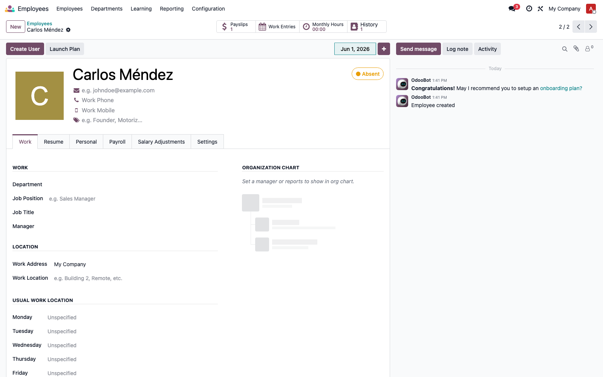
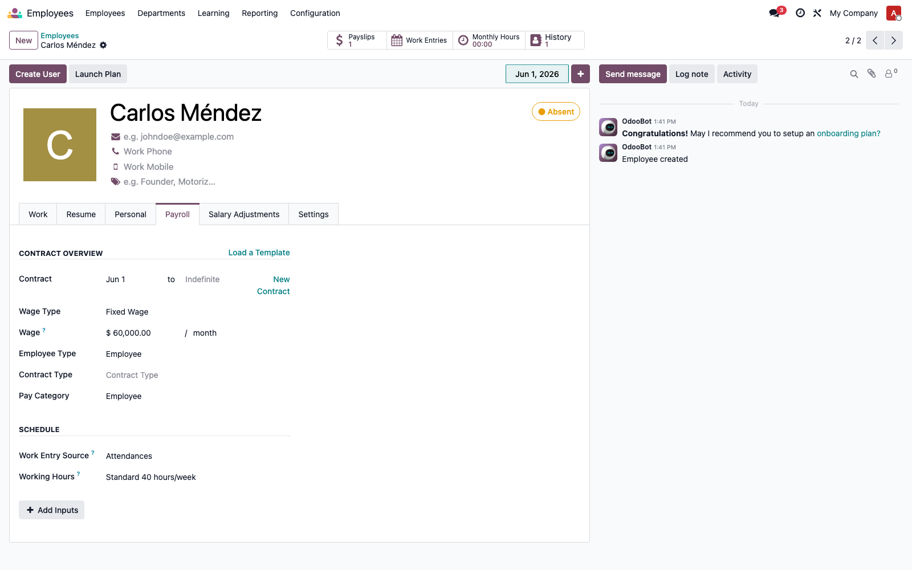
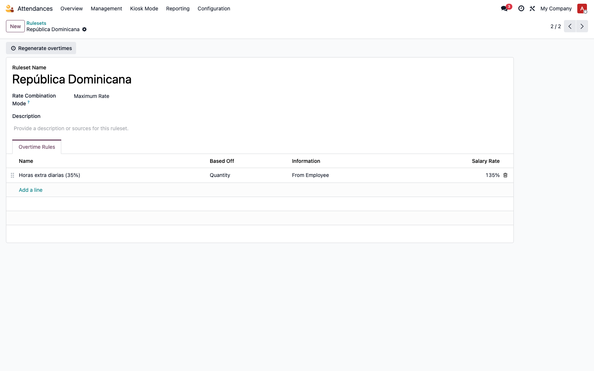
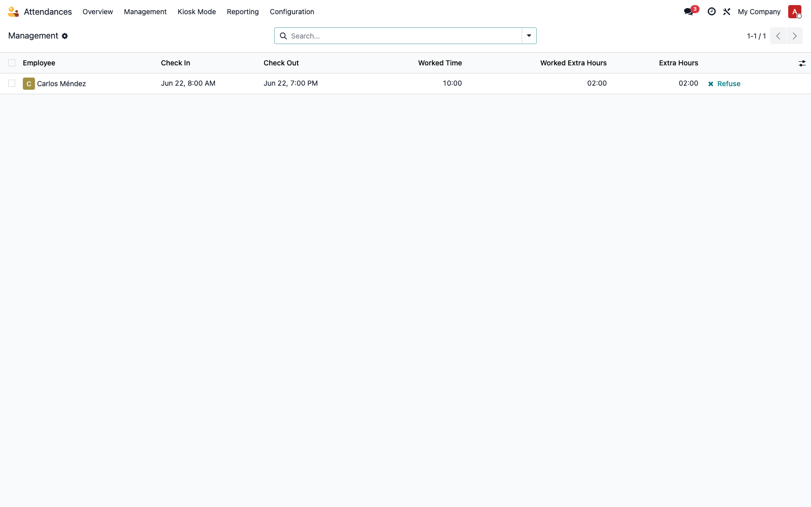
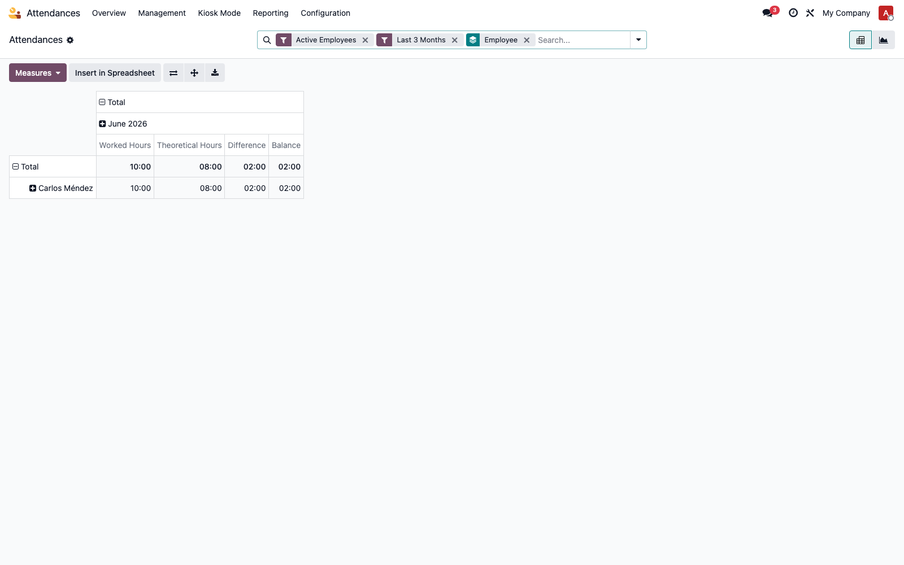
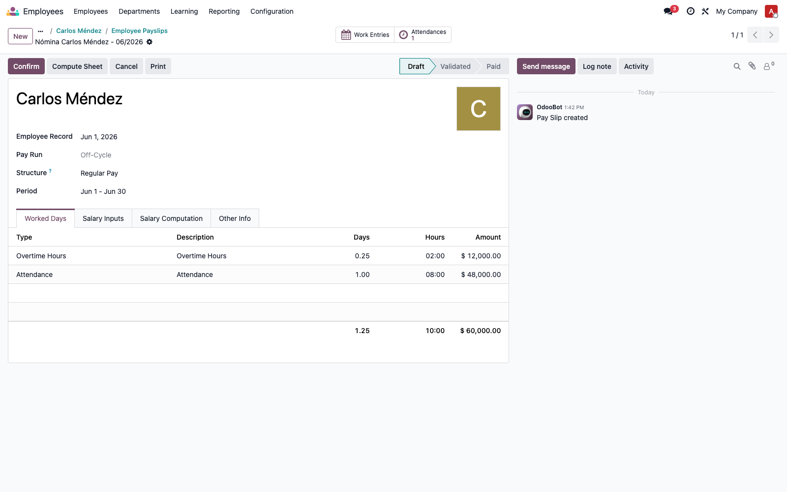

# Horas extra → nómina, 100 % nativo en Odoo 19

> Proceso **sin módulos custom**: reemplaza a `l10n_do_hr_news_attendance` y
> `l10n_do_hr_payroll_news_attendance` usando solo el motor nativo de Odoo 19 Enterprise.
> Desde crear el empleado y registrar la asistencia hasta ver las horas extra en la nómina.

---

## 1. Qué módulos intervienen (nativos)

| Módulo | Rol |
|--------|-----|
| `hr_attendance` | Marcas de entrada/salida + **Overtime Rulesets** (cálculo de horas extra) |
| `hr_work_entry_attendance` | Convierte el overtime aprobado en **work entries** de tipo *Overtime* |
| `hr_payroll_attendance` | Lleva esos work entries al **recibo de nómina** (auto-instala `hr_payroll`) |

> Basta instalar **`hr_payroll_attendance`** (arrastra los otros como dependencias) + `hr_attendance`.

Estos módulos cubren el cálculo (diurno/nocturno/feriado + tarifas) **y** el traslado a nómina,
que antes hacían los dos módulos custom. La migración para desinstalarlos y dejar a los empleados
sobre la regla nativa está en
`upgrade-util/src/l10n_do_banks/19.0.1.0.0/pre-25-uninstall-news-attendance-use-native-overtime.py`.

---

## 2. Paso a paso

### Paso 1 — Crear el empleado

**Employees → New**. Crear la ficha del empleado (en el ejemplo, *Carlos Méndez*).

### Paso 2 — Configurar el contrato para tomar horas de la asistencia

En la pestaña **Payroll** del empleado (o en el contrato), sección **Schedule**:

- **Work Entry Source = Attendances** → la nómina toma las horas reales de `hr.attendance`.
- **Working Hours** → el horario teórico (ej. *Standard 40 hours/week*); el exceso sobre este
  horario es lo que se considera hora extra.

### Paso 3 — Configurar el Overtime Ruleset y asignarlo

**Attendances → Configuration → Rulesets**. Crear un ruleset (ej. *República Dominicana*) con las
reglas y tarifas de la ley laboral:

- Regla *Horas extra diarias* — **Based Off: Quantity** (exceso sobre la jornada del contrato),
  **Salary Rate 135 %**, marcada como pagada y con su *work entry type* de overtime.
- Se pueden agregar reglas de tipo **Timing** para nocturno/feriado con sus propios %.

Luego se **asigna el ruleset al empleado** (campo *Overtime Ruleset* en el contrato). Con eso, Odoo
genera automáticamente las horas extra de cada asistencia.

### Paso 4 — Registrar las horas extra (asistencia)

Cuando el empleado marca entrada/salida (o se registra manualmente en **Attendances → Management**),
Odoo calcula el excedente sobre el horario y lo deja como **Extra Hours**. El overtime queda
pendiente de aprobación (botón **Refuse/Approve** según la política de la compañía).

> En el ejemplo: jornada 8:00–19:00 = 10 h trabajadas vs 8 h de horario → **2 h extra**.

### Paso 5 — Revisar el resumen de horas extra

**Attendances → Overview** muestra, por empleado y periodo, las horas trabajadas vs teóricas y la
**diferencia** (las horas extra).

### Paso 6 — Generar la nómina y ver las horas extra

**Payroll → Payslips → New** (o desde el botón *Payslips* del empleado). Crear el recibo del periodo
y pulsar **Compute Sheet**. En la pestaña **Worked Days** aparecen las **Overtime Hours** como línea
propia, separadas de las horas normales (*Attendance*).

> En el ejemplo: *Overtime Hours — 2:00 h* y *Attendance — 8:00 h*. Las horas extra ya están en la
> nómina, trazables y separadas.

---

## 3. Nota sobre el pago del recargo (135 %)

La línea **Overtime Hours** lleva las horas extra al recibo con su `amount_rate` (135 %). Que ese
recargo se **pague como dinero adicional** depende de la **estructura salarial**:

- Estructura **por hora** (Worker): paga las horas extra × tarifa automáticamente.
- Estructura **mensual fija** (Regular Pay, la del ejemplo): el sueldo es fijo; las horas extra
  aparecen separadas en *Worked Days* pero no suman al neto salvo que la estructura tenga una
  **regla salarial de recargo de horas extra**. En RD, esa regla se define en la estructura de
  `l10n_do_hr_payroll`.

→ El **cálculo y el traslado a nómina son nativos**; el porcentaje de pago se controla con las
reglas salariales de la estructura, no con un módulo custom.

---

## 4. Equivalencia con el proceso antiguo

| Proceso antiguo (custom) | Equivalente nativo v19 |
|--------------------------|------------------------|
| `l10n_do_hr_news_attendance` calcula horas extra a mano | **Overtime Ruleset** (`hr_attendance`) |
| Wizard crea una "novedad" | Overtime se aprueba en la propia asistencia / línea de overtime |
| `l10n_do_hr_payroll_news_attendance` → `hr.salary.attachment` | **Work entry de overtime** → recibo (`hr_payroll_attendance`) |
| Tarifas/recargos hardcodeados | `amount_rate` por regla + reglas de la estructura salarial |

---

*DB de ejemplo: `doc_native_ot` (limpia, solo stack nativo) · Odoo 19 Enterprise.*
*Migración de desinstalación: `upgrade-util/.../pre-25-uninstall-news-attendance-use-native-overtime.py`.*
