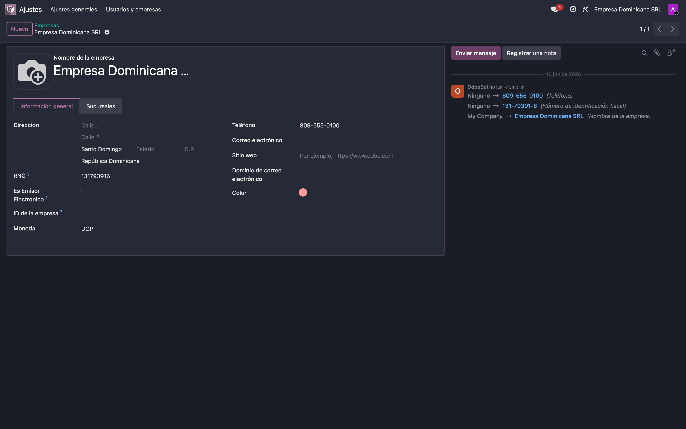
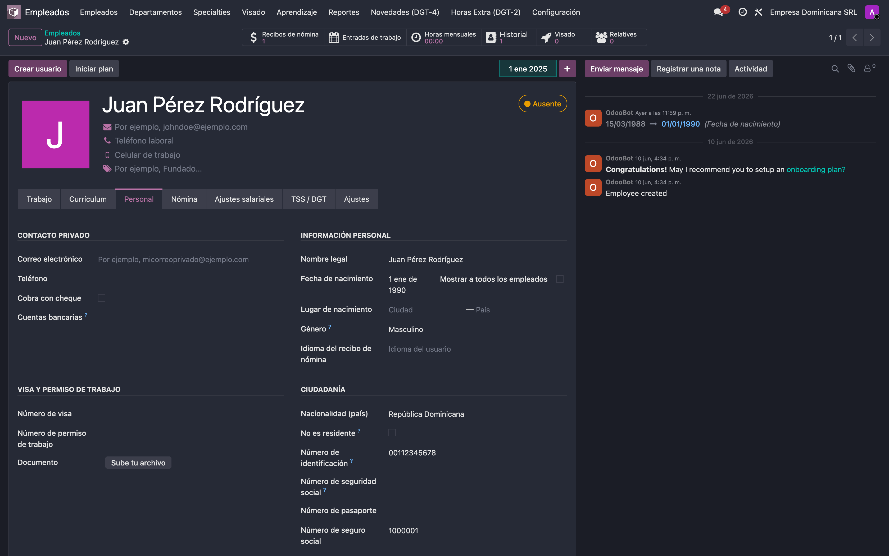
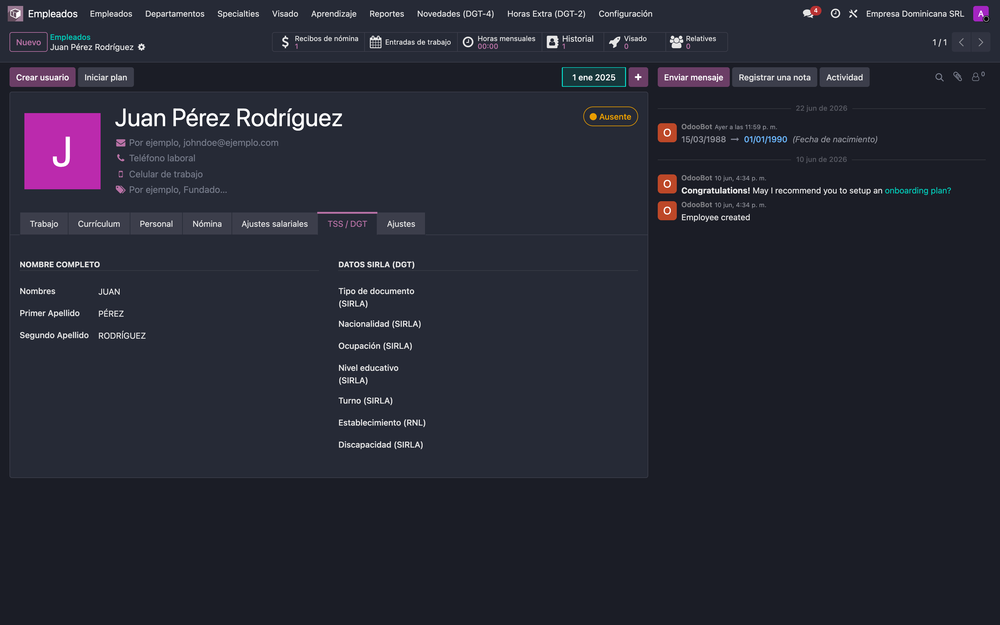
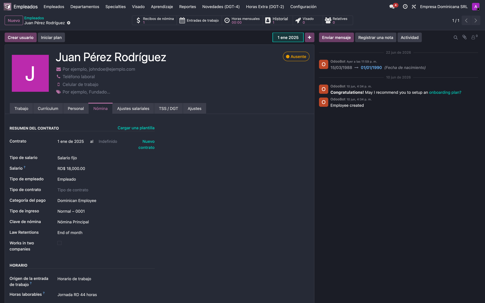
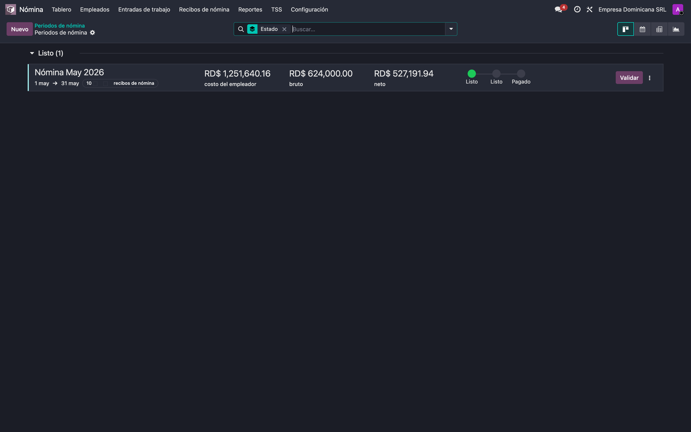
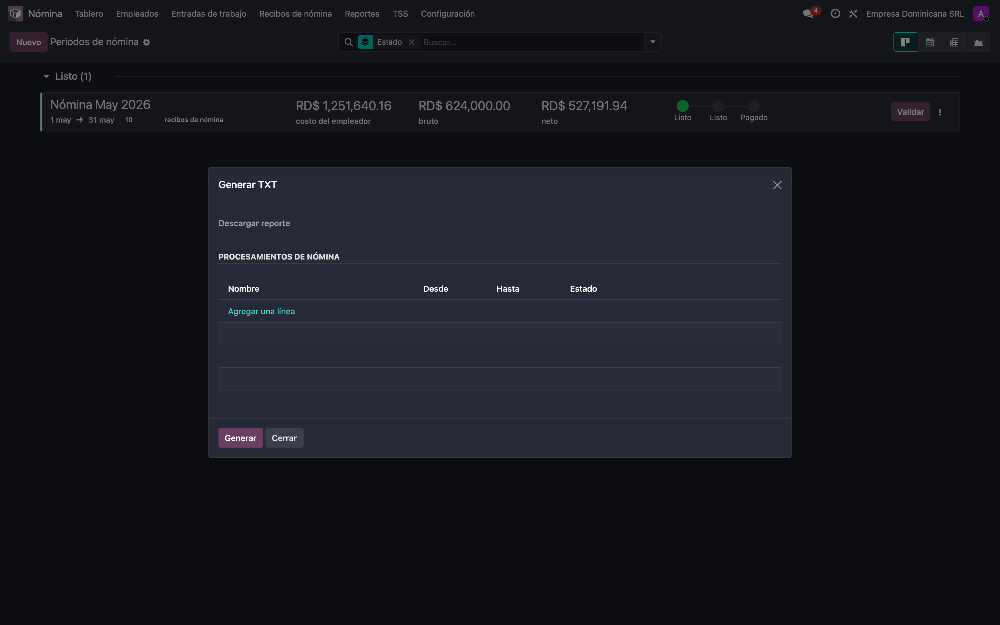
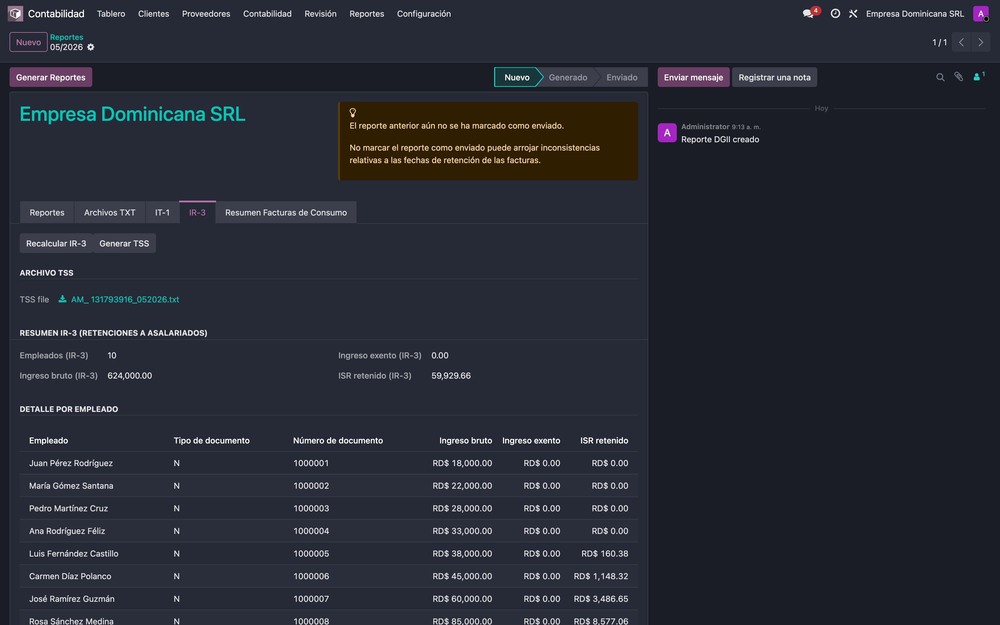
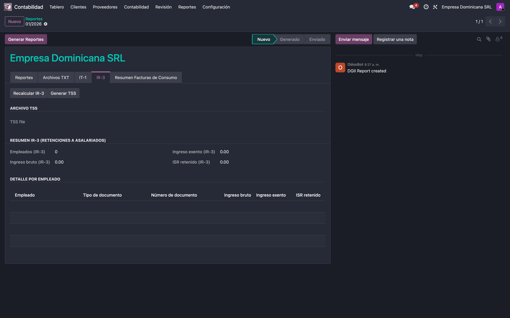
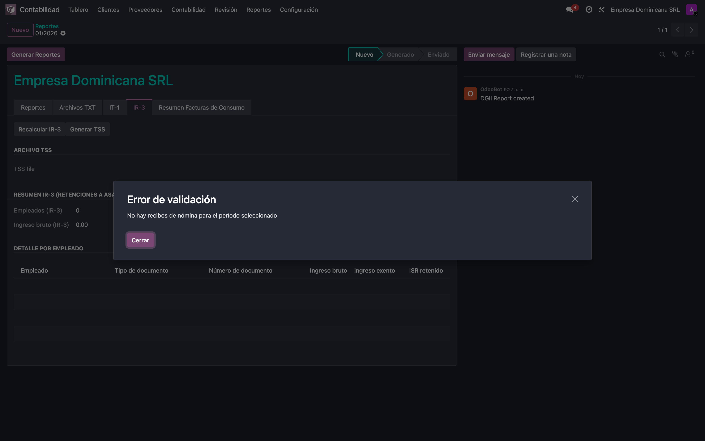

# Documentación funcional — Nómina TSS, IR-3 y reporte DGII (RD)

> Guía única y funcional: cómo **configurar el entorno desde cero**, cómo **conviven los tres módulos** y cómo **generar el reporte TSS** (desde dos caminos), con **casos de prueba**. Capturas tomadas en una base con la interfaz en español.

**Los tres módulos y su rol:**

- **Base de reportes** — guarda en un solo lugar los datos, catálogos y el cálculo que usan TSS, IR-3 y DGT.
- **TSS** — genera el archivo de Autodeterminación (TXT) de la TSS.
- **IR-3 / DGII** — añade el IR-3 (retenciones a asalariados) y el archivo TSS **dentro del reporte DGII** del período.

**Idea central:** existe **un solo reporte DGII por período** (`MM/AAAA`). Lo crea quien llegue primero —al generar la TSS o al abrir DGII— y el otro lo reutiliza. **Nunca se duplica.**

---

## Parte 1 — Configurar el entorno (paso a paso, sin saltarse nada)

### 1.1 RNC de la compañía
Ajustes → Empresas → abrir la compañía → completar el **RNC** (solo dígitos).

### 1.2 Datos personales del empleado
Empleados → abrir el empleado → pestaña **Personal**: **Género**, **Fecha de nacimiento** y el **documento** (Número de seguro social, o cédula, o pasaporte).

### 1.3 Nombre completo del empleado
Pestaña **TSS / DGT**: **Nombres**, **Primer Apellido** y **Segundo Apellido**.

### 1.4 Datos de nómina del empleado
Pestaña **Nómina**: **Clave de nómina**, **Tipo de ingreso** y el **Horario / Horas laborables**.

### 1.5 Procesar la nómina del período
Nómina → **Períodos de nómina** → **Nuevo** → crear el lote del mes → agregar empleados → **Calcular** → **Validar**.

---

## Parte 2 — Generar el reporte TSS (dos caminos, mismo resultado)

### Camino A — Desde el módulo TSS
Nómina → **TSS** → **Autodeterminación** → *Agregar una línea* y elegir el/los lote(s) del mismo mes → **Generar** → descargar el TXT.

### Camino B — Desde el reporte DGII
Contabilidad → DGII → Reportes → abrir el período → pestaña **IR-3** → botón **Generar TSS** → descargar en **Archivo TSS**.

En la misma pestaña se ve el **IR-3** del período (empleados, ingreso bruto, ingreso exento e ISR retenido) calculado a partir de la nómina validada.

> **Ambos caminos producen exactamente el mismo archivo** (`AM_<RNC>_<MMAAAA>.txt`). Al generar por cualquiera de los dos, el reporte DGII del período queda disponible con su IR-3 y su archivo TSS.

---

## Parte 3 — Cómo conviven los módulos

- Al **generar la TSS** (Camino A), el sistema crea —si no existe— el **reporte DGII** del mismo período. Si ya existía, lo reutiliza.
- Al **abrir/crear el reporte DGII** (Camino B), se calcula el **IR-3** del período y desde ahí también se puede **generar la TSS**.
- El **cálculo de montos** (salario cotizable, ISR, etc.) es **el mismo** para TSS e IR-3, por eso los números cuadran entre ambos.
- Resultado: **un único reporte por período**, alimentado por la misma nómina, sin duplicados.

---

## Parte 4 — Casos de prueba (comportamiento del sistema)

### CP1 — Generar TSS y luego abrir DGII (mismo período)
Se genera la TSS desde el asistente; al abrir el reporte DGII del mismo mes, **ya existe** con el IR-3 calculado y su archivo TSS. No se crea un segundo reporte.

### CP2 — Crear el reporte DGII sin haber procesado nómina
El IR-3 queda **en cero** (sin empleados).

Al intentar **Generar TSS** sin nómina del período, el sistema avisa en español:

### CP3 — Varios lotes / varios recibos en el mismo período
- Se pueden incluir **varios lotes del mismo mes**; se consolidan en el mismo reporte.
- Un empleado con **más de un recibo** se **consolida en una sola línea** (no se duplica).
- Si se intentan mezclar **lotes de meses distintos**, el sistema **lo impide y avisa**.

### CP4 — Falta un dato obligatorio
Si un empleado no tiene un campo obligatorio (ej. **clave de nómina**), al generar sale un **aviso en español** indicando el empleado y el dato faltante. Se completa y se vuelve a generar.

---

## Resumen — datos obligatorios para generar

| Dato | Dónde | Paso |
|---|---|---|
| RNC de la compañía | Empresa | 1.1 |
| Género, fecha de nacimiento, documento | Empleado → Personal | 1.2 |
| Nombres y apellidos | Empleado → TSS / DGT | 1.3 |
| Clave de nómina, tipo de ingreso, horario | Empleado → Nómina | 1.4 |
| Nómina del período calculada y validada | Nómina → Períodos de nómina | 1.5 |

*Fin del documento.*
