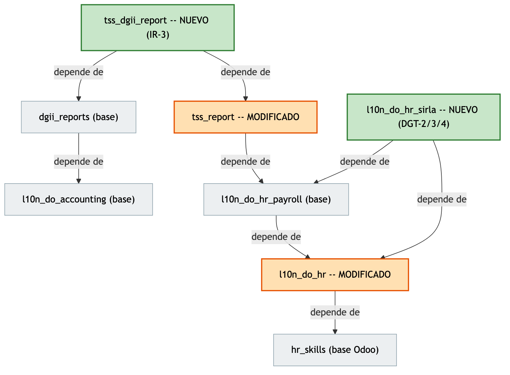
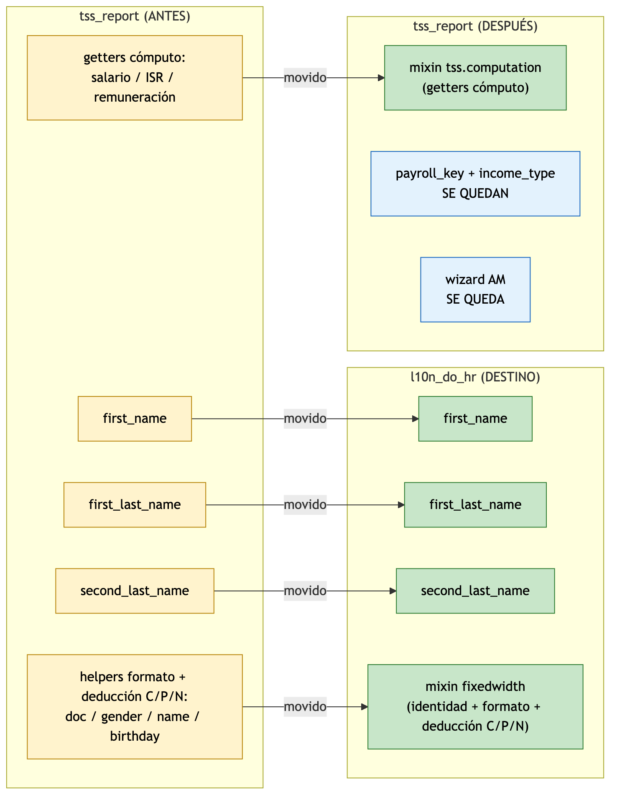
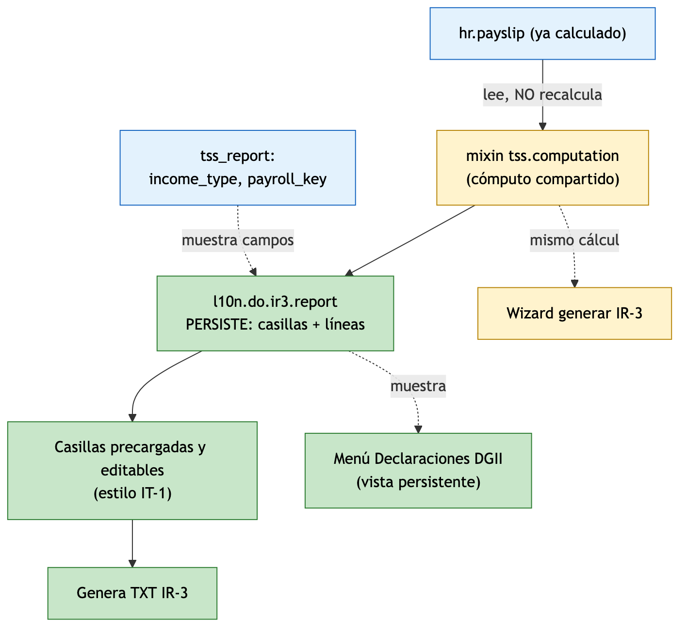
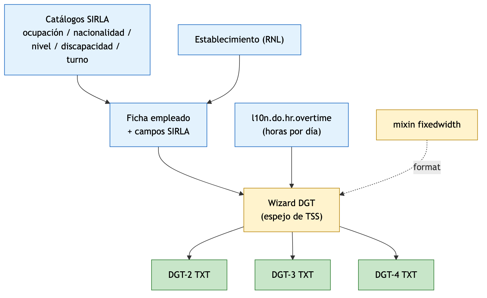
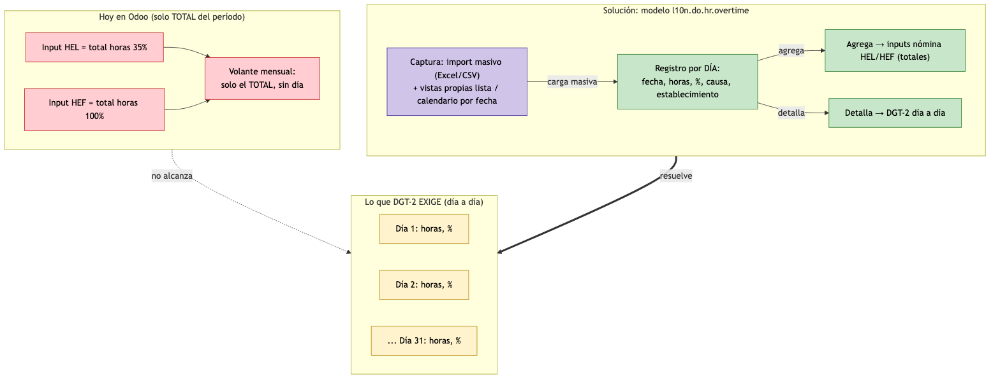
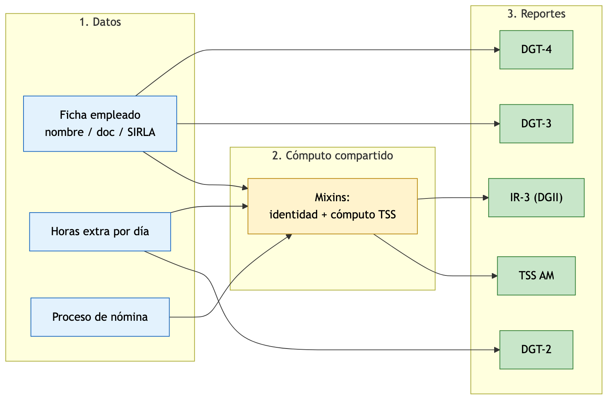
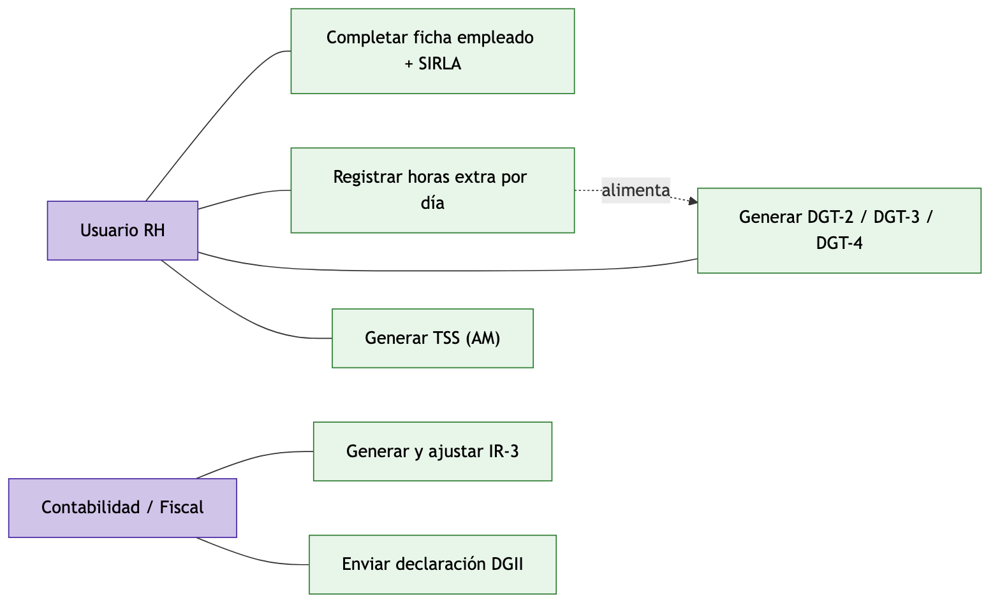

# Diseño Técnico — Reportes DGT‑2 / DGT‑3 / DGT‑4 / IR‑3

> | | |
> |---|---|
> | **Autor** | Luis Fernández |
> | **Estado** | Borrador para revisión |
> | **Fecha** | 2026‑06‑17 |
> | **Versiones Odoo** | **V19 y V20** (se descarta V17) |
> | **Módulos base** | `l10n_do_hr`, `l10n_do_hr_payroll`, `tss_report`, `dgii_reports` |

Documento de **diseño** orientado a **explicar los cambios**: conceptos previos, arquitectura de módulos, qué se mueve y por qué, los flujos de los módulos nuevos, cómo se resuelven las problemáticas (sobre todo el reporte de horas extras), qué se empieza a guardar en base de datos y qué pasa con la data ya existente.

| Reporte | Ente | Fuente de datos |
|---|---|---|
| DGT‑2 (horas extras) | Min. Trabajo (SIRLA) | Nómina — **desglose diario** |
| DGT‑3 (plantilla / ingreso) | Min. Trabajo (SIRLA) | Ficha del empleado |
| DGT‑4 (novedades) | Min. Trabajo (SIRLA) | Ficha del empleado |
| IR‑3 (retenciones asalariados) | DGII | Nómina — acumulado (misma data que `tss_report`) |

---

## 1. Conceptos clave (leer primero)

Cuatro aclaraciones que hacen entendible todo lo demás:

| Concepto | Qué significa |
|---|---|
| **TSS "AM"** | El reporte de **Autodeterminación Mensual** que el módulo `tss_report` **ya genera hoy** (existe). "AM" es el código del proceso en el encabezado del archivo (`E` + `AM` + RNC + período). No es nuevo: se usa como referencia porque el IR‑3 reutiliza su mismo cómputo. |
| **Patrón "declaración" (estilo IT‑1)** | Un registro por período donde el sistema **precarga montos calculados y los deja editar** antes de generar el archivo. Es como funciona hoy `dgii_reports` (606/607/…). El IR‑3 sigue ese mismo patrón. |
| **`mixin` = código, no datos** | Un *AbstractModel* (mixin) es un **contenedor de métodos reutilizables**. **No crea tabla ni guarda registros.** Cuando se marca "Agregado", se agrega *código* compartido, no data. |
| **Lo que se muestra = la data, no el archivo** | En la vista del IR‑3 (y de los DGT) lo principal son **los montos / líneas por empleado** revisables; el TXT es una **salida secundaria** que se genera *después* de revisar esa data. |

---

## 2. Arquitectura de módulos

Cuatro módulos: dos se **modifican** y dos son **nuevos**. Lo importante: el módulo del IR‑3 (`tss_dgii_report`) **depende a la vez de `tss_report` y de `dgii_reports`**, porque reutiliza el cómputo y los campos del primero y el patrón de declaración del segundo.

| Módulo | Acción | Depende de | Rol |
|---|---|---|---|
| `l10n_do_hr` | 🟧 **Modificado** | `hr_skills` | Base común: recibe los campos de nombre y el *mixin* de identidad/formato |
| `tss_report` | 🟧 **Modificado** | `l10n_do_hr_payroll`, **+ `l10n_do_hr`** | Cede los campos de nombre; expone su cómputo como *mixin* reutilizable |
| `l10n_do_hr_sirla` | 🟩 **Nuevo** | `l10n_do_hr`, `l10n_do_hr_payroll` | Catálogos SIRLA + horas extra diarias + generadores DGT‑2/3/4 |
| `tss_dgii_report` | 🟩 **Nuevo** | **`tss_report` + `dgii_reports`** | IR‑3 persistente; muestra y reutiliza data de ambos |

> 🟩 verde = nuevo · 🟧 naranja = modificado · ⬜ gris = base existente.

---

## 3. Refactor: campos de `tss_report` y su destino

El refactor mueve a `l10n_do_hr` lo que es compartido (nombres + helpers) y deja en `tss_report` lo que es propio de TSS. Visión general:

**Leyenda de las tablas:**

| Símbolo | Estado | Significado |
|---|---|---|
| ➡️ | **Removido** | Sale de este módulo y se mueve a otro (el dato/columna se conserva) |
| ✅ | **Se queda** | Permanece sin cambios en este módulo |
| ➕ | **Agregado** | Nuevo en este módulo |
| ❌ | **Eliminado** | Deja de existir (se reemplaza) |

### 3.1 `l10n_do_hr` (modificado)

| Elemento | Modelo | Estado | Detalle |
|---|---|---|---|
| `first_name` | `hr.employee` | ➕ Agregado (recibido de `tss_report`) | "Nombres" |
| `first_last_name` | `hr.employee` | ➕ Agregado (recibido) | "Primer Apellido" |
| `second_last_name` | `hr.employee` | ➕ Agregado (recibido) | "Segundo Apellido" |
| `l10n.do.hr.fixedwidth.mixin` | *AbstractModel* (**código, no tabla**) | ➕ Agregado | Helpers de identidad y formato de ancho fijo, incluida la **deducción C/P/N** (ver §5.2) |
| Campos `l10n_do_*` actuales (visa, estudio, discapacidad, etc.) | `hr.employee` / `hr.job` | ✅ Se queda | Sin cambios |

> El *mixin* no genera tabla ni guarda registros; centraliza el código que hoy está duplicado dentro del wizard de `tss_report` para que DGT e IR‑3 lo reutilicen.

### 3.2 `tss_report` (modificado)

| Elemento | Ubicación | Estado | Detalle |
|---|---|---|---|
| `first_name`, `first_last_name`, `second_last_name` | `hr.employee` | ➡️ Removido → `l10n_do_hr` | Misma columna; **cero migración de datos** |
| Vista "page TSS" de nombre | Vista empleado | ➡️ Removido → `l10n_do_hr` | La presentación pasa a la base |
| Helpers de formato + **deducción C/P/N** | Wizard | ➡️ Removido → *mixin* en `l10n_do_hr` | Se conserva la lógica; se centraliza |
| Getters de cómputo (salario, ISR, otras remuneraciones, INFOTEP, regalía, PCVI) | Wizard | ➡️ Removido → *mixin* `tss.computation` (mismo módulo) | Reubicados a un *AbstractModel* para reúso |
| Referencia a `employee.gender` | Wizard | ❌ Eliminado | Se reemplaza por `sex` (campo real en V19) — corrige un bug latente |
| `l10n_do_payroll_key_id` | `hr.version` | ✅ Se queda | Clave de nómina TSS |
| `l10n_do_income_type` | `hr.version` + `hr.payslip` | ✅ Se queda | Tipo de ingreso TSS (0001–0007) |
| `l10n.do.payroll.key` | Modelo | ✅ Se queda | Catálogo de claves de nómina |
| `tss.report.wizard` + autodeterminación AM | Wizard | ✅ Se queda | Generación del archivo TSS (existente) |
| `depends = l10n_do_hr` | Manifest | ➕ Agregado | Dependencia explícita |
| Herencia de los dos *mixins* | Wizard | ➕ Agregado | Sin cambio funcional |

### 3.3 `l10n_do_hr_sirla` (nuevo — todo agregado)

| Elemento | Tipo | Detalle |
|---|---|---|
| `l10n.do.hr.occupation` | Modelo (catálogo) | Ocupaciones (≈2 835): código + nombre |
| `l10n.do.hr.nationality` | Modelo (catálogo) | Nacionalidades (153): código SIRLA + nombre |
| `l10n.do.hr.education.level` | Modelo (catálogo) | Niveles educativos (38) |
| `l10n.do.hr.disability` | Modelo (catálogo) | Discapacidades (7) |
| `l10n.do.hr.work.shift` | Modelo (config) | Turnos por empresa |
| `l10n.do.hr.establishment` | Modelo (config) | Establecimiento + código RNL (4 díg.) |
| `l10n.do.hr.overtime.cause` | Modelo (catálogo) | Causas de prolongación (art. 153, a–e) |
| **`l10n.do.hr.overtime`** | Modelo (transaccional) | **Horas extra por día** — con import masivo y vistas propias (ver §5.1) |
| `l10n.do.hr.movement` | Modelo (transaccional) | Novedades DGT‑4 (NI/NS/NC) — opcional |
| `l10n_do_sirla_document_type` | Campo en `hr.employee` | **Solo** para los tipos no deducibles: `M` (carnet migración) e `I` (interior/policía) — ver §5.2 |
| `l10n_do_occupation_id` | Campo en `hr.job` | Ocupación SIRLA |
| `l10n_do_nationality_id`, `l10n_do_education_level_id`, `l10n_do_disability_ids`, `l10n_do_work_shift_id`, `l10n_do_establishment_id` | Campos en `hr.employee` | Datos SIRLA del trabajador |
| Wizards DGT‑2 / DGT‑3 / DGT‑4 | Wizard | Generación de archivos |

### 3.4 `tss_dgii_report` (nuevo — todo agregado)

| Elemento | Tipo | Detalle |
|---|---|---|
| `l10n.do.ir3.report` | Modelo (transaccional, **persiste**) | Declaración IR‑3 por período |
| `l10n.do.ir3.report.line` | Modelo (transaccional, **persiste**) | Detalle por empleado (snapshot) |
| Casillas resumen (empleados sujetos, total sueldos, otras remuneraciones, ISR retenido, TSS excluido) | Campos en `l10n.do.ir3.report` | Computadas **y editables** (estilo IT‑1) |
| Herencia de *mixins* (identidad + cómputo TSS) | Modelo | Reutiliza el cómputo de `tss_report` |

---

## 4. Flujos de los módulos nuevos

### 4.1 `tss_dgii_report` (IR‑3)

Lee las nóminas ya calculadas (no recalcula), pasa por el **mismo cómputo que usa `tss_report`**, **persiste** el resultado en un registro por período con casillas editables, y de ahí genera el TXT. La misma data se ve en el menú "Declaraciones DGII" y al generar desde el wizard.

- **Depende de `tss_report`** → muestra `income_type` / `payroll_key` y reutiliza los getters de monto.
- **Depende de `dgii_reports`** → hereda el patrón de período, estados y convivencia en el mismo menú.
- **Persiste** (a diferencia de TSS, que es solo wizard) para soportar auditoría y rectificativas.

### 4.2 `l10n_do_hr_sirla` (DGT‑2 / DGT‑3 / DGT‑4)

La ficha del empleado (con los nuevos campos SIRLA y catálogos) y, para el DGT‑2, las horas extra diarias, alimentan wizards que —reusando el *mixin* de formato— generan los TXT de ancho fijo.

- **DGT‑3 / DGT‑4:** wizard espejo del de `tss_report`; leen ficha + catálogos.
- **DGT‑2:** además lee el modelo de horas extra diarias (§5.1).
- Catálogos cargados como data maestra desde los Excel oficiales del Ministerio.

---

## 5. Problemáticas y cómo se resuelven

### 5.1 Horas extras (no se maneja como Odoo lo hace usualmente)

**Problema.** Odoo registra las horas extra como un **total del período** (inputs `HEL` 35 % y `HEF` 100 % en el volante). El DGT‑2 exige el **desglose día por día (1–31)** con su porcentaje y causa. La data diaria **no existe** hoy.

**Solución.** Un modelo nuevo `l10n.do.hr.overtime` que captura las horas extra **por día** y actúa como **fuente única**: por un lado **agrega** los totales que la nómina necesita (`HEL`/`HEF`), por otro **detalla** el día a día que exige el DGT‑2.

**Cómo se captura y se muestra al usuario (parte importante):**

- **Import masivo:** el modelo se podrá **cargar desde Excel/CSV de forma masiva**, para no registrarlo empleado por empleado. Se aprovecha tanto la importación nativa de Odoo (sobre la vista lista) como el módulo existente `hr_payroll_import_inputs`.
- **Vistas propias:** el modelo tendrá sus **propias vistas** para verse bien:
  - **Lista** (agrupable por empleado y por mes),
  - **Calendario / por fecha** (ver las horas extra ubicadas en el día),
  - filtros por período y por establecimiento.
- **Menú dedicado** "Horas Extra" (y, opcionalmente, una pestaña en el volante) con botón de importar.

**Qué pasa con la data ya existente:**

- Las nóminas viejas tienen solo el **TOTAL** (`HEL`/`HEF`), **sin desglose diario**; esa información **nunca se capturó por día**, por lo que **no se puede reconstruir automáticamente**.
- Es **viable dejar el histórico como está**: la captura diaria arranca desde la implementación hacia adelante (DGT‑2 a futuro).
- Si se necesitara un DGT‑2 de un mes pasado, habría que **completar manualmente** el detalle de esos días (o importarlo).

### 5.2 Tipo de documento del trabajador (C/P/N/M/I)

**Aclaración importante:** **NO** se crea un campo `l10n_do_document_type`. Ese nombre **ya existe** en `l10n_do_accounting` (`account.journal.l10n_do_document_type_ids`) y se refiere al **tipo de comprobante fiscal (NCF)** — nada que ver con la identidad de la persona.

La identidad del empleado **ya está modelada** con campos existentes en `l10n_do_hr`:

| Documento SIRLA | Campo existente | ¿Acción? |
|---|---|---|
| **C** (Cédula) | `identification_id` | Ninguna — ya se deduce |
| **P** (Pasaporte) | `passport_id` | Ninguna — ya se deduce |
| **N** (NSS) | `l10n_do_social_security_number` | Ninguna — ya se deduce |
| **M** (Carnet de migración) | — | **Hueco**: no hay dónde guardarlo |
| **I** (Interior y policía) | — | **Hueco**: no hay dónde guardarlo |

**Diseño:**
1. **C/P/N** → se siguen usando los campos crudos existentes; el *mixin* centraliza la deducción según cuál campo esté lleno (lo que `tss_report` ya hace hoy). **Cero campos nuevos.**
2. **M/I** (único faltante) → un campo **opcional y bien nombrado** `l10n_do_sirla_document_type` en `l10n_do_hr_sirla`, que solo se llena para extranjeros con carnet de migración o documento de interior/policía. Si está vacío, el *mixin* deduce C/P/N de los campos crudos.

> Así no se toca contabilidad, no se colisiona con el concepto fiscal y no se duplica la identidad ya existente.

### 5.3 Reuso del cómputo TSS (no recrear data ni lógica)

El cómputo por empleado que hoy vive en el wizard de `tss_report` se **extrae a un mixin compartido**. A partir de ahí, **el wizard TSS y el IR‑3 usan exactamente el mismo código** sobre las **nóminas ya calculadas** (no se recalcula nómina). Resultado: una sola fuente de la matemática, imposible que TSS e IR‑3 difieran, y la misma data visible en la vista persistente y en el wizard. Un *constraint* de unicidad por período/compañía evita declaraciones duplicadas.

### 5.4 El IR‑3 muestra la data, no el archivo

La vista del IR‑3 muestra **las casillas resumen y el detalle por empleado** (montos revisables y ajustables), siguiendo el patrón estilo IT‑1. El **TXT/binario es una salida secundaria** que se genera *después* de revisar y ajustar la data. Lo mismo aplica a los DGT: primero la data tabular, luego el archivo.

### 5.5 Datos y nóminas ya existentes (migración / backfill)

| Qué | Qué pasa |
|---|---|
| **Nóminas existentes** | Quedan **intactas**. El IR‑3 las **lee** (no recalcula) → se pueden generar declaraciones IR‑3 de **períodos pasados** de forma retroactiva. |
| **Campos de nombre** (`first_name`…) | Ya están poblados en producción. Al moverlos a `l10n_do_hr` es la **misma columna** → **data preservada**, sin migración. |
| **Campos SIRLA nuevos** (ocupación, nacionalidad, nivel, turno, establecimiento) | **No existían** → quedan vacíos en los empleados actuales → requieren **backfill** (carga manual o import) antes de generar DGT‑3/4 de esos empleados. |
| **Horas extra por día** | El histórico solo tiene totales; el detalle diario se captura **hacia adelante** (§5.1). |
| **TXT TSS ya generados** | `tss_report` **no guarda nada** (wizard); el archivo solo se descargó. **No hay nada que migrar.** |

➡️ Por esto el plan incluye una fase de **backfill** (§7, F8): cargar los catálogos SIRLA en los empleados existentes y, opcionalmente, pre‑generar IR‑3 de períodos previos leyendo las nóminas viejas.

---

## 6. Flujo completo del proceso

De los datos a los cinco reportes, mostrando dónde se comparte el cómputo y de dónde sale cada salida:

---

## 7. Casos de uso

| Actor | Casos de uso |
|---|---|
| **Usuario RH** | Completar ficha + datos SIRLA · Registrar/importar horas extra por día · Generar DGT‑2/3/4 · Generar TSS (AM) |
| **Contabilidad / Fiscal** | Generar y ajustar IR‑3 · Enviar declaración a DGII |

---

## 8. Qué se empieza a guardar en base de datos

> Hoy `tss_report` **no persiste nada** (wizard transitorio). El nuevo diseño introduce persistencia donde hace falta data maestra, configuración o trazabilidad.

| Modelo / Campo | Naturaleza | Módulo |
|---|---|---|
| Catálogos SIRLA (ocupación, nacionalidad, nivel, discapacidad, causa) | Data maestra (carga única) | `l10n_do_hr_sirla` |
| `l10n.do.hr.work.shift`, `l10n.do.hr.establishment` | Configuración por empresa | `l10n_do_hr_sirla` |
| **`l10n.do.hr.overtime`** | Transaccional (horas extra por día) | `l10n_do_hr_sirla` |
| `l10n.do.hr.movement` (opcional) | Transaccional (novedades DGT‑4) | `l10n_do_hr_sirla` |
| **`l10n.do.ir3.report`** + **`l10n.do.ir3.report.line`** | Transaccional (declaración IR‑3 + detalle) | `tss_dgii_report` |
| Campos SIRLA en `hr.employee` / `hr.job` + `l10n_do_sirla_document_type` | Stored | `l10n_do_hr_sirla` |
| Campos de nombre (`first_name`, …) | Stored — **ya existían**, solo cambian de módulo dueño | `l10n_do_hr` |

> El *mixin* `l10n.do.hr.fixedwidth.mixin` y `l10n.do.tss.computation` **no aparecen aquí**: son código, no guardan data.

---

## 9. Plan por fases

| Fase | Acción | Tipo |
|---|---|---|
| F1 | Mover los 3 campos de nombre `tss_report → l10n_do_hr`; dependencia explícita; mover la vista | No funcional |
| F2 | Extraer los *mixins* (identidad/formato + deducción C/P/N en `l10n_do_hr`; cómputo en `tss_report`); corregir `sex` | No funcional |
| F3 | `tss_dgii_report`: IR‑3 persistente (modelos + casillas editables + cómputo reusado + TXT) | Funcional |
| F4 | `l10n_do_hr_sirla`: catálogos + campos SIRLA + `l10n_do_sirla_document_type` (M/I) + UI de la ficha | Funcional |
| F5 | `l10n.do.hr.overtime`: modelo + **import masivo** + **vistas propias (lista/calendario)** + integración con nómina | Funcional |
| F6 | Generadores DGT‑3 / DGT‑4 (wizard) | Funcional |
| F7 | Generador DGT‑2 (usa el desglose diario) | Funcional |
| F8 | **Backfill de datos existentes:** cargar catálogos SIRLA en empleados; opcional pre‑generar IR‑3 de períodos previos | Datos |
| F9 | Validación de formato de los TXT + pruebas | — |

> F1–F2 no cambian nada para el usuario, pero son la base que evita duplicar código en el resto.

*Fin del documento.*
