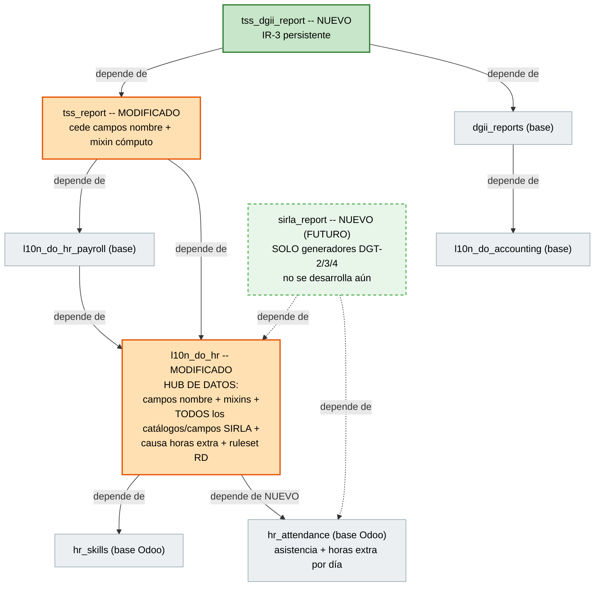
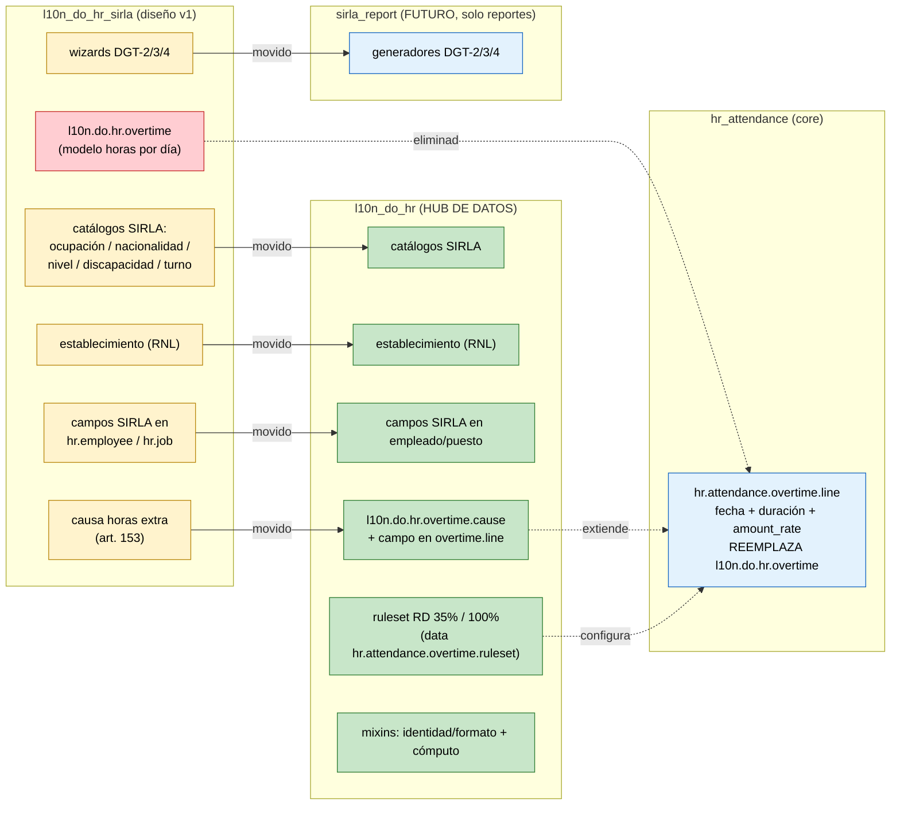
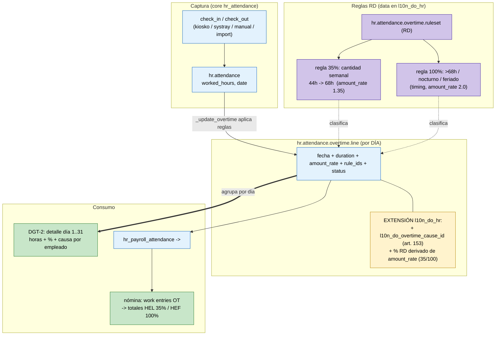
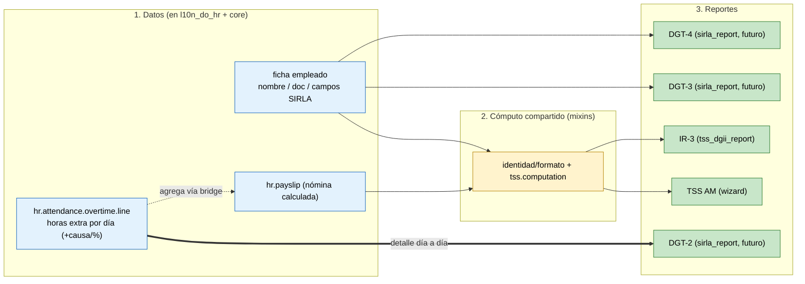

# Diseño Técnico v2 — Reportes DGT‑2 / DGT‑3 / DGT‑4 / IR‑3

> | | |
> |---|---|
> | **Autor** | Luis Fernández |
> | **Estado** | Borrador para revisión |
> | **Fecha** | 2026‑06‑18 |
> | **Versiones Odoo** | **V19 y V20** (se descarta V17) |
> | **Reemplaza a** | `Especificacion_Tecnica_DGT_IR3.md` (v1) |
> | **Módulos base** | `l10n_do_hr`, `l10n_do_hr_payroll`, `hr_attendance`, `tss_report`, `dgii_reports` |

Esta versión incorpora tres cambios respecto a la v1:

1. **Horas extras = módulo de asistencia.** Se elimina el modelo propio `l10n.do.hr.overtime`. El desglose diario que el DGT‑2 exige ya lo provee el core (`hr.attendance.overtime.line`). Se integra el módulo `hr_attendance` y se identifican los cambios mínimos que necesita.
2. **Reestructura de módulos.** `l10n_do_hr_sirla` se renombra a **`sirla_report`** y queda **solo para generar reportes** (DGT‑2/3/4). **Todos los campos, catálogos y modelos** que iban en ese módulo pasan a **`l10n_do_hr`**, que se vuelve el *hub de datos*. `sirla_report` **no se desarrolla todavía**: por ahora solo se construye la capa de datos en `l10n_do_hr`. Más adelante se decide si se desarrolla `sirla_report`.
3. **Foco en arquitectura y flujo.** El centro del documento son los diagramas de arquitectura de módulos y flujo de datos con los cambios aplicados.

| Reporte | Ente | Fuente de datos |
|---|---|---|
| DGT‑2 (horas extras) | Min. Trabajo (SIRLA) | **Asistencia — desglose diario** (`hr.attendance.overtime.line`) |
| DGT‑3 (plantilla / ingreso) | Min. Trabajo (SIRLA) | Ficha del empleado |
| DGT‑4 (novedades) | Min. Trabajo (SIRLA) | Ficha del empleado |
| IR‑3 (retenciones asalariados) | DGII | Nómina — acumulado (misma data que `tss_report`) |

---

## 1. Arquitectura de módulos

Dos módulos se **modifican** (`l10n_do_hr`, `tss_report`) y dos son **nuevos** (`sirla_report`, `tss_dgii_report`). La diferencia clave con la v1: `l10n_do_hr` ahora depende de `hr_attendance` y concentra **toda la data** (campos + catálogos + modelos); `sirla_report` queda como capa de reportes a futuro.

> 🟩 verde = nuevo · 🟩 punteado = nuevo a futuro (no se desarrolla aún) · 🟧 naranja = modificado · ⬜ gris = base existente.

| Módulo | Acción | Depende de | Rol |
|---|---|---|---|
| `l10n_do_hr` | 🟧 **Modificado** | `hr_skills`, **+ `hr_attendance`** | **Hub de datos**: campos de nombre, mixins, todos los catálogos y campos SIRLA, causa de horas extra y el ruleset RD |
| `tss_report` | 🟧 **Modificado** | `l10n_do_hr_payroll`, `l10n_do_hr` | Cede los campos de nombre; expone su cómputo como *mixin* reutilizable |
| `sirla_report` | 🟩 **Nuevo (futuro)** | `l10n_do_hr`, `hr_attendance` | **Solo** generadores DGT‑2/3/4. No se desarrolla ahora |
| `tss_dgii_report` | 🟩 **Nuevo** | `tss_report`, `dgii_reports` | IR‑3 persistente; reutiliza data de ambos |

**Por qué `l10n_do_hr` depende ahora de `hr_attendance`:** la causa de horas extra (art. 153) se agrega como campo sobre `hr.attendance.overtime.line`, y el ruleset RD se carga como data sobre `hr.attendance.overtime.ruleset`. Ambos modelos viven en `hr_attendance`, así que la capa de datos debe verlo.

---

## 2. Reestructura: a dónde va cada cosa

Todo lo que en la v1 vivía en `l10n_do_hr_sirla` se reparte así: la **data** baja a `l10n_do_hr`, los **generadores** quedan en `sirla_report` (futuro), y el modelo propio de horas extra **se elimina** porque lo reemplaza el core de asistencia.

### 2.1 `l10n_do_hr` (modificado — recibe toda la data)

| Elemento | Modelo | Detalle |
|---|---|---|
| `first_name`, `first_last_name`, `second_last_name` | `hr.employee` | Campos de nombre (recibidos de `tss_report`); misma columna, cero migración |
| `l10n.do.hr.fixedwidth.mixin` | *AbstractModel* | Identidad + formato ancho fijo + deducción C/P/N |
| `l10n.do.hr.occupation` / `.nationality` / `.education.level` / `.disability` | Catálogos | Cargados desde los Excel oficiales del Ministerio |
| `l10n.do.hr.work.shift` / `l10n.do.hr.establishment` | Config por empresa | Turnos + establecimiento (código RNL) |
| `l10n.do.hr.overtime.cause` | Catálogo | Causas de prolongación (art. 153, a–e) |
| `l10n_do_overtime_cause_id` | Campo en `hr.attendance.overtime.line` | **Extensión al core** (ver §3) |
| Campos SIRLA (`l10n_do_occupation_id`, `l10n_do_nationality_id`, `l10n_do_education_level_id`, `l10n_do_disability_ids`, `l10n_do_work_shift_id`, `l10n_do_establishment_id`, `l10n_do_sirla_document_type`) | `hr.employee` / `hr.job` | Datos SIRLA del trabajador |
| `l10n.do.hr.movement` (opcional) | Transaccional | Novedades DGT‑4 (NI/NS/NC) |
| Ruleset RD de horas extra | Data sobre `hr.attendance.overtime.ruleset` + `.rule` | Reglas 35% y 100% (ver §3) |

### 2.2 `tss_report` (modificado)

Sin cambios respecto a la v1: cede los campos de nombre a `l10n_do_hr`, extrae el cómputo TSS a un mixin `tss.computation`, corrige `gender` → `sex`. Mantiene `payroll_key`, `income_type` y el wizard de autodeterminación AM.

### 2.3 `sirla_report` (nuevo — **no se desarrolla todavía**)

| Elemento | Estado |
|---|---|
| Wizards / generadores DGT‑2 / DGT‑3 / DGT‑4 (TXT ancho fijo) | **Futuro** — solo planificado |

> Por ahora **no se construye**. Solo se levanta la data en `l10n_do_hr` para alimentar los reportes. Cuando se decida desarrollar `sirla_report`, ya tendrá todos los campos y modelos listos.

### 2.4 `tss_dgii_report` (nuevo — IR‑3)

Sin cambios respecto a la v1: `l10n.do.ir3.report` + `.line` persistentes, casillas editables estilo IT‑1, reutiliza el mixin de cómputo TSS sobre nóminas ya calculadas.

---

## 3. Horas extras vía módulo de asistencia

**Decisión:** no se crea modelo propio. El desglose día por día que exige el DGT‑2 **ya existe** en el core de Odoo, en `hr.attendance.overtime.line`. Se integra `hr_attendance` y se le agrega lo mínimo que falta.

### 3.1 Qué ya provee el core (sin tocar)

| Modelo | Campo | Aporte al DGT‑2 |
|---|---|---|
| `hr.attendance` | `check_in`, `check_out`, `date`, `worked_hours` | Marcaje y horas trabajadas |
| **`hr.attendance.overtime.line`** | **`date`** (día, indexado) | **El desglose diario 1–31 que pide el DGT‑2** |
| `hr.attendance.overtime.line` | `duration`, `manual_duration` | Horas extra del día (calculadas / editadas) |
| `hr.attendance.overtime.line` | `amount_rate` | Recargo (multiplicador, ej. `1.35` = 35 %, `2.0` = 100 %) |
| `hr.attendance.overtime.line` | `rule_ids`, `status` | Reglas aplicadas + aprobación |
| `hr.attendance.overtime.ruleset` / `.rule` | `amount_rate`, `quantity_period`, `timing_type` | Define cuándo y a qué tasa nace la hora extra |

Las líneas de horas extra se generan **automáticamente** desde los marcajes (`_update_overtime`) aplicando el ruleset asignado al empleado (`hr.version.ruleset_id`). Esa es la fuente única: no hay que duplicar data.

### 3.2 Cambios que necesita el core de asistencia (mínimos)

| Cambio | Dónde | Por qué | Cómo |
|---|---|---|---|
| **Campo causa** `l10n_do_overtime_cause_id` | `hr.attendance.overtime.line` (vía `l10n_do_hr`) | El DGT‑2 pide la causa de prolongación (art. 153, a–e); el core no la tiene | Many2one a `l10n.do.hr.overtime.cause` |
| **Clasificación RD** 35 % / 100 % | derivado de `amount_rate` | El DGT‑2 reporta el % de recargo, no el multiplicador interno | Campo/cómputo que mapea `amount_rate` → `35` / `100` |
| **Ruleset RD (data)** | `hr.attendance.overtime.ruleset` + `.rule` | Para que las líneas nazcan ya clasificadas según el Código de Trabajo RD | Regla por cantidad semanal 44h→68h (`amount_rate 1.35`) + regla por *timing* nocturno/feriado y >68h (`amount_rate 2.0`) |
| **(Opcional) captura manual / import** | `hr.attendance` o líneas | Empresas sin reloj marcador o backfill de meses pasados | Import nativo de Odoo sobre asistencia |

> No se modifica la lógica de cómputo del core; solo se **extiende** con un campo y se **configura** con data (ruleset). El motor de horas extra de Odoo hace el resto.

### 3.3 Flujo de integración

- **DGT‑2** lee `hr.attendance.overtime.line` agrupado por `(empleado, día)` → desglose diario con horas, % (de `amount_rate`) y causa.
- **Nómina** ya cuenta con el puente `hr_payroll_attendance` (+ `hr_work_entry_attendance`): con `version.work_entry_source = 'attendance'`, las horas extra se convierten en *work entries* y alimentan los totales del volante. No hay que sumar a mano hacia HEL/HEF.

### 3.4 Data ya existente

- Las nóminas viejas tienen solo el **total** (`HEL`/`HEF`), sin marcajes diarios → no se puede reconstruir el día a día automáticamente.
- La captura diaria arranca **hacia adelante** (desde que haya asistencia registrada).
- Para un DGT‑2 de un mes pasado se completarían los marcajes o las líneas de horas extra manualmente (import).

---

## 4. Flujo de datos completo

De los datos a los cinco reportes, mostrando dónde se comparte el cómputo y de dónde sale cada salida.

---

## 5. Qué se guarda en base de datos

| Modelo / Campo | Naturaleza | Módulo |
|---|---|---|
| Catálogos SIRLA (ocupación, nacionalidad, nivel, discapacidad, causa) | Data maestra | `l10n_do_hr` |
| `l10n.do.hr.work.shift`, `l10n.do.hr.establishment` | Config por empresa | `l10n_do_hr` |
| Campos SIRLA en `hr.employee` / `hr.job` + `l10n_do_sirla_document_type` | Stored | `l10n_do_hr` |
| `l10n_do_overtime_cause_id` en `hr.attendance.overtime.line` | Stored (extensión) | `l10n_do_hr` |
| Ruleset RD (35 % / 100 %) | Data sobre `hr.attendance.overtime.ruleset` | `l10n_do_hr` |
| Horas extra por día | **`hr.attendance.overtime.line`** (core, ya persiste) | `hr_attendance` |
| `l10n.do.ir3.report` + `.line` | Transaccional | `tss_dgii_report` |
| Campos de nombre (`first_name`, …) | Stored — ya existían, cambian de módulo dueño | `l10n_do_hr` |

> Se **elimina** el modelo `l10n.do.hr.overtime` de la v1. Los mixins no aparecen aquí: son código, no guardan data.

---

## 6. Plan por fases

| Fase | Acción | Tipo |
|---|---|---|
| F1 | Mover campos de nombre `tss_report → l10n_do_hr`; dependencia explícita; mover la vista | No funcional |
| F2 | Extraer mixins (identidad/formato + deducción C/P/N en `l10n_do_hr`; cómputo en `tss_report`); corregir `sex` | No funcional |
| F3 | `tss_dgii_report`: IR‑3 persistente (modelos + casillas editables + cómputo reusado + TXT) | Funcional |
| F4 | `l10n_do_hr`: dependencia `hr_attendance` + catálogos SIRLA + campos SIRLA + `l10n_do_sirla_document_type` | Funcional (data) |
| F5 | Asistencia: campo `l10n_do_overtime_cause_id` + clasificación 35/100 + **ruleset RD** (data) | Funcional (data) |
| F6 | Backfill: cargar catálogos SIRLA en empleados existentes | Datos |
| F7 | **(Futuro, a decidir)** `sirla_report`: generadores DGT‑2/3/4 + validación de TXT | Funcional |

> F1–F6 levantan la **capa de datos** (lo que se necesita ahora). F7 (`sirla_report`) queda para cuando se decida desarrollar los reportes; los datos ya estarán listos.

*Fin del documento.*
