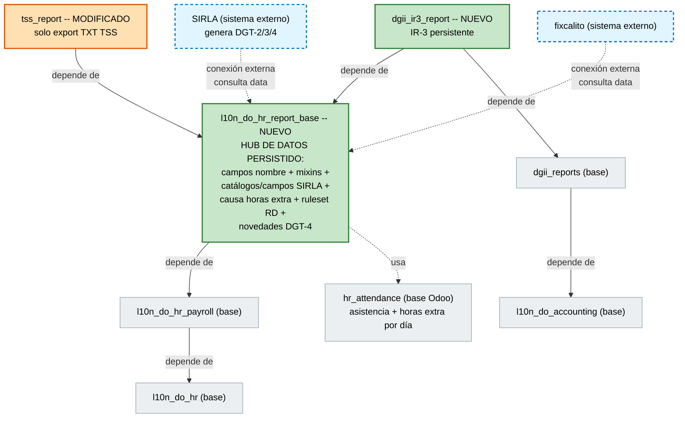
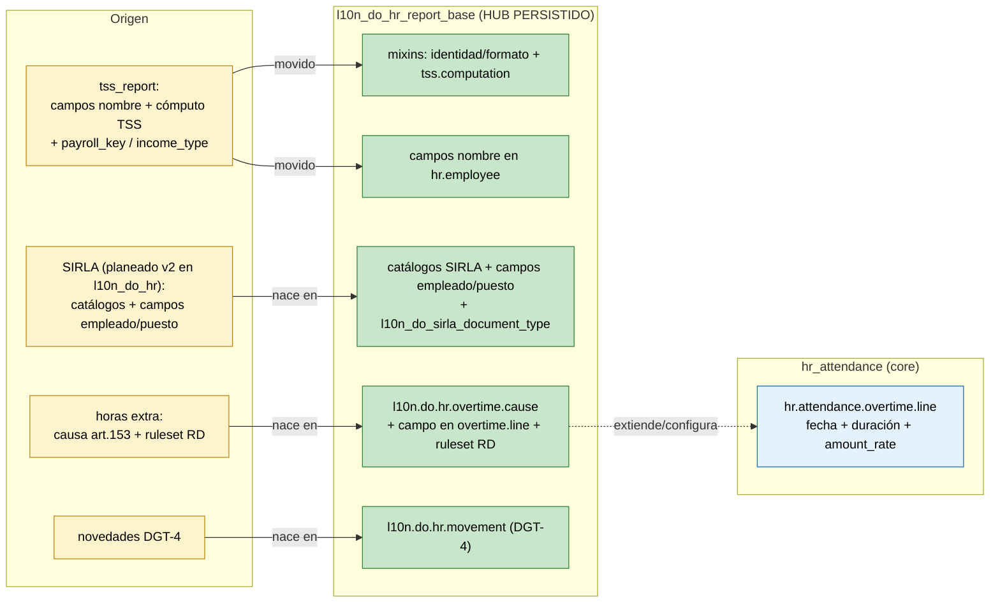
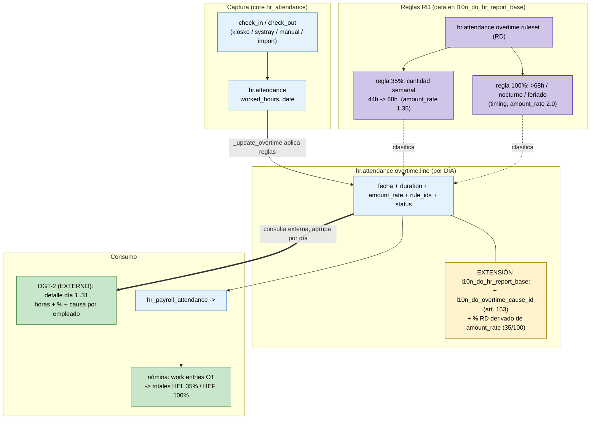
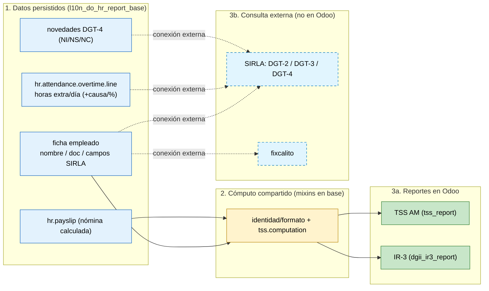

# Diseño Técnico v3 — Reportes DGT‑2 / DGT‑3 / DGT‑4 / IR‑3

> | | |
> |---|---|
> | **Autor** | Luis Fernández |
> | **Estado** | Borrador para revisión |
> | **Fecha** | 2026‑06‑22 |
> | **Versiones Odoo** | **V19 y V20** (se descarta V17) |
> | **Reemplaza a** | `Especificacion_Tecnica_DGT_IR3_v2.md` (v2) |
> | **Módulos base** | `l10n_do_hr`, `l10n_do_hr_payroll`, `hr_attendance`, `tss_report`, `dgii_reports` |
> | **Módulo nuevo** | `l10n_do_hr_report_base` *(nombre provisional)* |

Esta versión cambia **solo la arquitectura de módulos**. El alcance funcional, los catálogos SIRLA, el manejo de horas extra vía asistencia y el cómputo del IR‑3 **siguen igual que en la v2**.

El único cambio es **dónde vive la data**:

1. **Se crea un módulo base nuevo** (`l10n_do_hr_report_base`). Es el responsable de **generar y guardar toda la información** del módulo `tss_report` y de los reportes DGT. **Todos los campos** necesarios para esos reportes viven en este módulo y **persisten en base de datos**. (En la v2 esa data se concentraba en `l10n_do_hr`; ahora se aísla en un módulo propio).
2. **El módulo base depende de `l10n_do_hr_payroll`.** Los reportes **DGT‑2 / DGT‑3 / DGT‑4 no se generan en Odoo** por ahora: se **consultan por conexión externa** (sistemas **SIRLA** y **fixcalito**), que leen la data persistida en el módulo base. Odoo solo es el repositorio de datos.
3. **El módulo del reporte `dgii_ir3_report`** sigue dependiendo de `dgii_reports` **y además pasa a depender del módulo base** nuevo, de donde toma el cómputo y la data del empleado.

| Reporte | Ente | Fuente de datos | Quién lo genera |
|---|---|---|---|
| DGT‑2 (horas extras) | Min. Trabajo (SIRLA) | **Asistencia — desglose diario** (`hr.attendance.overtime.line`) | **Externo** (SIRLA/fixcalito) |
| DGT‑3 (plantilla / ingreso) | Min. Trabajo (SIRLA) | Ficha del empleado | **Externo** (SIRLA/fixcalito) |
| DGT‑4 (novedades) | Min. Trabajo (SIRLA) | Ficha del empleado | **Externo** (SIRLA/fixcalito) |
| IR‑3 (retenciones asalariados) | DGII | Nómina — acumulado (data de `tss_report`) | **Odoo** (`dgii_ir3_report`) |
| TSS AM | TSS | Nómina — acumulado | **Odoo** (`tss_report`) |

---

## 1. Arquitectura de módulos

El cambio central de la v3: **toda la data se aísla en un módulo base nuevo** (`l10n_do_hr_report_base`) que se monta **sobre `l10n_do_hr_payroll`**. Ese módulo persiste todo lo que necesitan TSS, DGT e IR‑3. Los reportes DGT no se construyen en Odoo: **SIRLA** y **fixcalito** los consultan por conexión externa contra la data persistida. `tss_report` y `dgii_ir3_report` pasan a depender del módulo base.

> 🟩 verde = nuevo · 🟧 naranja = modificado · 🟦 azul punteado = sistema externo (no es módulo Odoo) · ⬜ gris = base existente.

| Módulo | Acción | Depende de | Rol |
|---|---|---|---|
| `l10n_do_hr_report_base` | 🟩 **Nuevo** | `l10n_do_hr_payroll` (+ usa `hr_attendance`) | **Hub de datos persistido**: campos de nombre, mixins, todos los catálogos y campos SIRLA, causa de horas extra, ruleset RD y novedades DGT‑4. **Genera y guarda** la data de TSS y DGT |
| `tss_report` | 🟧 **Modificado** | `l10n_do_hr_report_base` | Cede su data y cómputo al módulo base; queda **solo** como exportador del TXT de TSS |
| `dgii_ir3_report` | 🟩 **Nuevo** | `dgii_reports`, `l10n_do_hr_report_base` | IR‑3 persistente; reutiliza el cómputo y la data del módulo base |
| DGT‑2 / DGT‑3 / DGT‑4 | 🟦 **Externo** | — (consultan el módulo base) | **No se generan en Odoo.** SIRLA / fixcalito leen la data persistida por conexión externa |

**Por qué un módulo base nuevo en vez de cargar la data en `l10n_do_hr` (como en la v2):** la data de reportes (TSS + DGT + IR‑3) es un dominio propio que se monta sobre la nómina ya calculada y debe persistir para que sistemas externos la consulten. Aislarla en `l10n_do_hr_report_base` mantiene `l10n_do_hr` como localización pura de empleados, evita acoplar catálogos fiscales a la ficha base y da un único punto de entrada a SIRLA/fixcalito.

**Por qué depende de `l10n_do_hr_payroll`:** los reportes parten de la nómina calculada (acumulados TSS/IR‑3) y de la ficha del empleado; ambos llegan vía la cadena `l10n_do_hr → l10n_do_hr_payroll`. Para la causa de horas extra (art. 153) y el ruleset RD, el módulo base usa además `hr_attendance` (ver §3).

---

## 2. Reestructura: a dónde va cada cosa

Todo lo que generaba/almacenaba data para los reportes baja al **módulo base nuevo**. `tss_report` cede sus campos de nombre y su cómputo; los catálogos y campos SIRLA, la causa de horas extra, el ruleset RD y las novedades DGT‑4 nacen directamente en el módulo base. El modelo propio de horas extra **no existe**: lo reemplaza el core de asistencia (igual que en la v2).

### 2.1 `l10n_do_hr_report_base` (nuevo — concentra toda la data)

| Elemento | Modelo | Detalle |
|---|---|---|
| `first_name`, `first_last_name`, `second_last_name` | `hr.employee` | Campos de nombre (recibidos de `tss_report`); misma columna, cero migración de datos |
| `l10n.do.hr.fixedwidth.mixin` | *AbstractModel* | Identidad + formato ancho fijo + deducción C/P/N |
| `tss.computation` | *AbstractModel* | Cómputo TSS reutilizable (lo usan TSS e IR‑3) |
| `l10n.do.hr.occupation` / `.nationality` / `.education.level` / `.disability` | Catálogos | Cargados desde los Excel oficiales del Ministerio |
| `l10n.do.hr.work.shift` / `l10n.do.hr.establishment` | Config por empresa | Turnos + establecimiento (código RNL) |
| `l10n.do.hr.overtime.cause` | Catálogo | Causas de prolongación (art. 153, a–e) |
| `l10n_do_overtime_cause_id` | Campo en `hr.attendance.overtime.line` | **Extensión al core** (ver §3) |
| Campos SIRLA (`l10n_do_occupation_id`, `l10n_do_nationality_id`, `l10n_do_education_level_id`, `l10n_do_disability_ids`, `l10n_do_work_shift_id`, `l10n_do_establishment_id`, `l10n_do_sirla_document_type`) | `hr.employee` / `hr.job` | Datos SIRLA del trabajador |
| `l10n.do.hr.movement` | Transaccional | Novedades DGT‑4 (NI/NS/NC) |
| Ruleset RD de horas extra | Data sobre `hr.attendance.overtime.ruleset` + `.rule` | Reglas 35 % y 100 % (ver §3) |
| `payroll_key`, `income_type` + wizard autodeterminación AM | Data + lógica | Recibidos de `tss_report`; alimentan TSS e IR‑3 |

> **Todo lo de esta tabla persiste en base de datos.** Es exactamente lo que las consultas externas (SIRLA/fixcalito) y los reportes internos (TSS/IR‑3) necesitan leer.

### 2.2 `tss_report` (modificado)

Cede a `l10n_do_hr_report_base` los campos de nombre, el cómputo TSS (mixin `tss.computation`), `payroll_key` e `income_type`. Corrige `gender` → `sex`. **Queda solo como front‑end del export TXT de TSS** (wizard de autodeterminación AM), leyendo la data y el cómputo desde el módulo base.

### 2.3 `dgii_ir3_report` (nuevo — IR‑3)

`l10n.do.ir3.report` + `.line` persistentes, casillas editables estilo IT‑1, reutiliza el mixin `tss.computation` del módulo base sobre nóminas ya calculadas. Depende de `dgii_reports` (integración con el formato DGII) **y** de `l10n_do_hr_report_base` (cómputo + data del empleado).

### 2.4 DGT‑2 / DGT‑3 / DGT‑4 (externos — no se desarrollan en Odoo)

No hay wizard ni generador en Odoo. **SIRLA** y **fixcalito** consultan por **conexión externa** la data persistida en `l10n_do_hr_report_base` (catálogos, campos SIRLA del empleado, líneas de horas extra con causa/%, novedades) y producen los TXT fuera de Odoo. La responsabilidad de Odoo es **tener todos los campos completos y persistidos**.

---

## 3. Horas extras vía módulo de asistencia

**Sin cambios respecto a la v2.** No se crea modelo propio: el desglose día por día que exige el DGT‑2 ya existe en el core, en `hr.attendance.overtime.line`. La única diferencia v3: la **extensión** (campo causa + clasificación %) y la **data** (ruleset RD) viven ahora en `l10n_do_hr_report_base` en vez de `l10n_do_hr`.

### 3.1 Qué ya provee el core (sin tocar)

| Modelo | Campo | Aporte al DGT‑2 |
|---|---|---|
| `hr.attendance` | `check_in`, `check_out`, `date`, `worked_hours` | Marcaje y horas trabajadas |
| **`hr.attendance.overtime.line`** | **`date`** (día, indexado) | **El desglose diario 1–31 que pide el DGT‑2** |
| `hr.attendance.overtime.line` | `duration`, `manual_duration` | Horas extra del día (calculadas / editadas) |
| `hr.attendance.overtime.line` | `amount_rate` | Recargo (multiplicador, ej. `1.35` = 35 %, `2.0` = 100 %) |
| `hr.attendance.overtime.line` | `rule_ids`, `status` | Reglas aplicadas + aprobación |
| `hr.attendance.overtime.ruleset` / `.rule` | `amount_rate`, `quantity_period`, `timing_type` | Define cuándo y a qué tasa nace la hora extra |

Las líneas de horas extra se generan **automáticamente** desde los marcajes (`_update_overtime`) aplicando el ruleset asignado al empleado (`hr.version.ruleset_id`). Esa es la fuente única: no se duplica data.

### 3.2 Cambios que necesita el core de asistencia (mínimos)

| Cambio | Dónde | Por qué | Cómo |
|---|---|---|---|
| **Campo causa** `l10n_do_overtime_cause_id` | `hr.attendance.overtime.line` (vía `l10n_do_hr_report_base`) | El DGT‑2 pide la causa de prolongación (art. 153, a–e); el core no la tiene | Many2one a `l10n.do.hr.overtime.cause` |
| **Clasificación RD** 35 % / 100 % | derivado de `amount_rate` | El DGT‑2 reporta el % de recargo, no el multiplicador interno | Campo/cómputo que mapea `amount_rate` → `35` / `100` |
| **Ruleset RD (data)** | `hr.attendance.overtime.ruleset` + `.rule` | Para que las líneas nazcan ya clasificadas según el Código de Trabajo RD | Regla por cantidad semanal 44h→68h (`amount_rate 1.35`) + regla por *timing* nocturno/feriado y >68h (`amount_rate 2.0`) |
| **(Opcional) captura manual / import** | `hr.attendance` o líneas | Empresas sin reloj marcador o backfill de meses pasados | Import nativo de Odoo sobre asistencia |

> No se modifica la lógica de cómputo del core; solo se **extiende** con un campo y se **configura** con data (ruleset), todo desde `l10n_do_hr_report_base`.

### 3.3 Flujo de integración

- **DGT‑2** (externo) lee `hr.attendance.overtime.line` agrupado por `(empleado, día)` → desglose diario con horas, % (de `amount_rate`) y causa.
- **Nómina** ya cuenta con el puente `hr_payroll_attendance` (+ `hr_work_entry_attendance`): con `version.work_entry_source = 'attendance'`, las horas extra se convierten en *work entries* y alimentan los totales del volante. No hay que sumar a mano hacia HEL/HEF.

### 3.4 Data ya existente

- Las nóminas viejas tienen solo el **total** (`HEL`/`HEF`), sin marcajes diarios → no se puede reconstruir el día a día automáticamente.
- La captura diaria arranca **hacia adelante** (desde que haya asistencia registrada).
- Para un DGT‑2 de un mes pasado se completarían los marcajes o las líneas de horas extra manualmente (import).

---

## 4. Flujo de datos completo

De los datos persistidos en el módulo base a los reportes: los de Odoo (TSS, IR‑3) y los externos (DGT‑2/3/4 vía SIRLA/fixcalito).

---

## 5. Qué se guarda en base de datos

Todo vive en `l10n_do_hr_report_base` (salvo las líneas de horas extra, que ya persisten en el core).

| Modelo / Campo | Naturaleza | Módulo |
|---|---|---|
| Catálogos SIRLA (ocupación, nacionalidad, nivel, discapacidad, causa) | Data maestra | `l10n_do_hr_report_base` |
| `l10n.do.hr.work.shift`, `l10n.do.hr.establishment` | Config por empresa | `l10n_do_hr_report_base` |
| Campos SIRLA en `hr.employee` / `hr.job` + `l10n_do_sirla_document_type` | Stored | `l10n_do_hr_report_base` |
| `l10n_do_overtime_cause_id` en `hr.attendance.overtime.line` | Stored (extensión) | `l10n_do_hr_report_base` |
| Ruleset RD (35 % / 100 %) | Data sobre `hr.attendance.overtime.ruleset` | `l10n_do_hr_report_base` |
| `l10n.do.hr.movement` (novedades DGT‑4) | Transaccional | `l10n_do_hr_report_base` |
| Campos de nombre (`first_name`, …) | Stored — ya existían, cambian de módulo dueño | `l10n_do_hr_report_base` |
| `payroll_key`, `income_type` | Stored / data | `l10n_do_hr_report_base` |
| Horas extra por día | **`hr.attendance.overtime.line`** (core, ya persiste) | `hr_attendance` |
| `l10n.do.ir3.report` + `.line` | Transaccional | `dgii_ir3_report` |

> No se crea ningún modelo propio de horas extra (lo reemplaza el core). Los mixins no aparecen aquí: son código, no guardan data.

---

## 6. Plan por fases

| Fase | Acción | Tipo |
|---|---|---|
| F1 | Crear `l10n_do_hr_report_base` (depende de `l10n_do_hr_payroll`); mover campos de nombre `tss_report → base`; mover su vista | No funcional |
| F2 | Extraer mixins al base (identidad/formato + deducción C/P/N + `tss.computation`); mover `payroll_key`/`income_type`; corregir `sex`; `tss_report` queda solo como export TXT | No funcional |
| F3 | `dgii_ir3_report`: IR‑3 persistente (modelos + casillas editables + cómputo reusado del base + TXT); depende de `dgii_reports` + base | Funcional |
| F4 | Base: catálogos SIRLA + campos SIRLA en empleado/puesto + `l10n_do_sirla_document_type` | Funcional (data) |
| F5 | Base + asistencia: campo `l10n_do_overtime_cause_id` + clasificación 35/100 + **ruleset RD** (data) | Funcional (data) |
| F6 | Base: `l10n.do.hr.movement` (novedades DGT‑4) | Funcional (data) |
| F7 | Backfill: cargar catálogos SIRLA en empleados existentes | Datos |
| F8 | **Conexión externa**: exponer/documentar la data persistida para que SIRLA y fixcalito consulten DGT‑2/3/4 | Integración |

> F1–F7 levantan y persisten la **capa de datos** en el módulo base. F8 es la integración externa; los reportes DGT no se construyen en Odoo.

*Fin del documento.*
</content>
</invoke>
