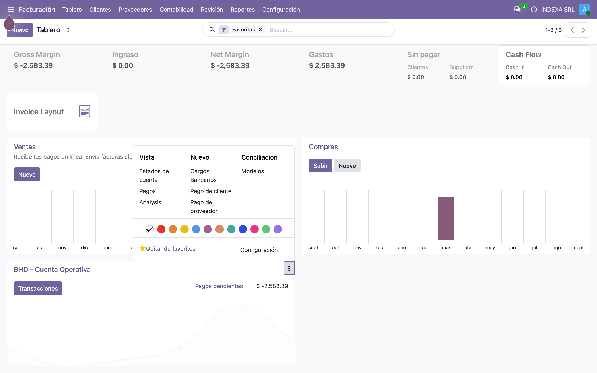
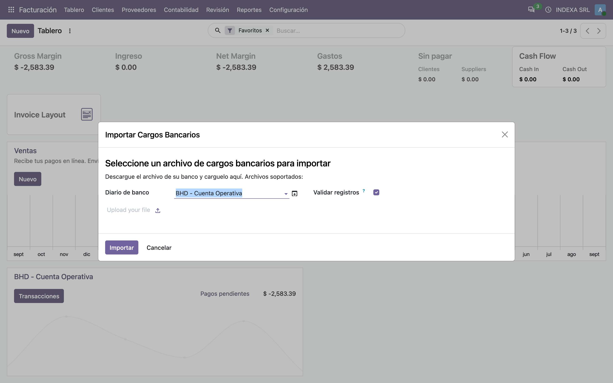
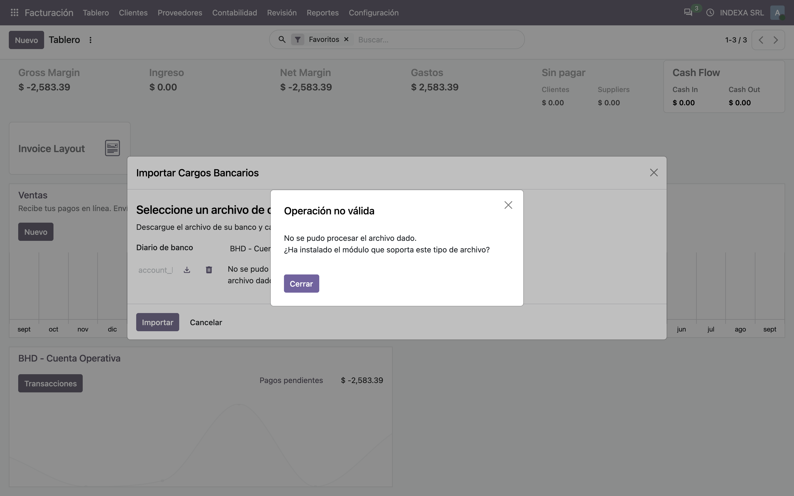
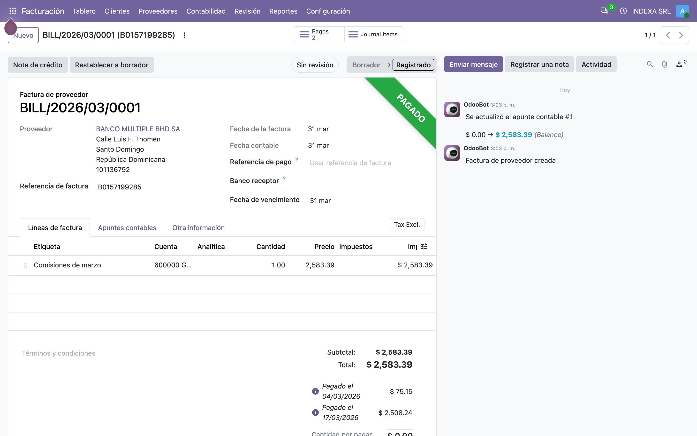
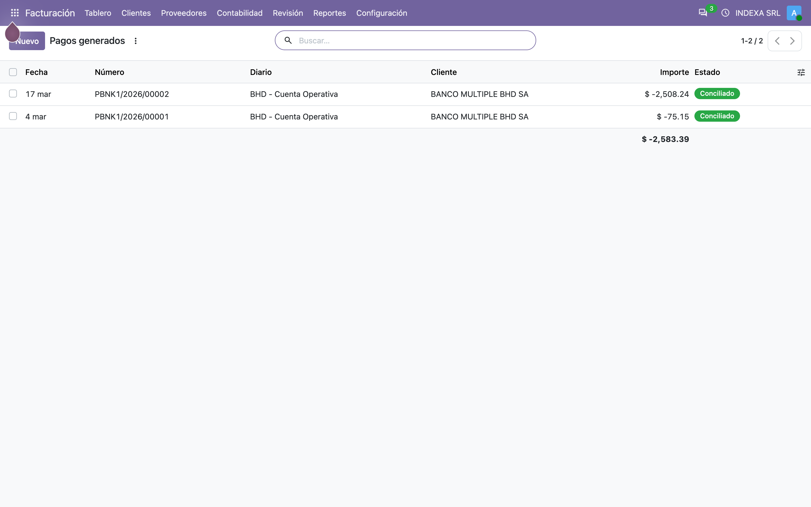
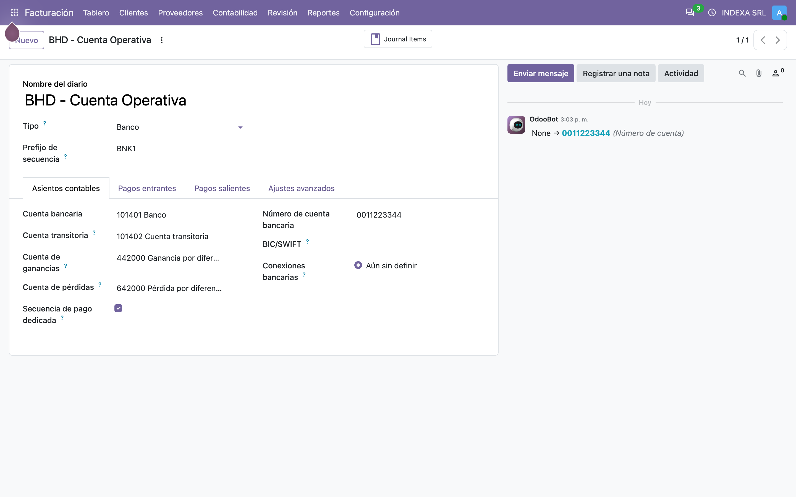

# Importación de cargos bancarios — Manual de usuario (account_bank_charge_import_base)

> Manual generado con `tools/manual-generator`. Las capturas se regeneran ejecutando el generador contra una base `test_v20_<módulo>`.

Todos los meses el banco cobra comisiones, cargos por transferencia, impuestos retenidos y un puñado de conceptos más. Esos cargos hay que **registrarlos como gastos** y **darlos por pagados**, porque el banco ya se cobró solo debitando la cuenta.

Hacerlo a mano significa abrir el estado de cuenta, capturar una factura de proveedor por cada concepto, registrar el pago y conciliarlo contra el banco. Este módulo lo hace desde el archivo que el banco ya publica.

Qué aporta, en concreto:

- Un enlace **Cargos Bancarios** en la tarjeta del diario de banco, dentro del tablero de Contabilidad.
- Un asistente donde se sube el archivo del banco y se dice **qué producto** corresponde a cada referencia de cargo. Ese producto es el que aporta la cuenta de gasto y los impuestos.
- Por cada referencia: una **factura de proveedor** a nombre del banco, con la fecha del último día del mes del cargo, y **un pago por cada movimiento**, conciliado contra la factura.
- Un interruptor para dejarlo todo en borrador si se prefiere revisar antes de validar.

Este es el módulo **base**: define el asistente, la generación contable y el punto de entrada, pero **no sabe leer ningún archivo**. Cada banco trae el suyo (`account_bank_charge_import_bhd`, `account_bank_charge_import_bpd`), que solo implementa la lectura del formato.

## Requisitos previos

- Módulo **`account_bank_charge_import_base`** instalado (v `19.5.2.0.0`, línea 20.0 / `master`). Odoo `master` se autodeclara `19.5`, de ahí el prefijo de versión.
- Dependencias: **`account`** y **`l10n_do_banks`** (v `19.5.2.0.0`).
- El usuario necesita **Contabilidad: Facturación** (`account.group_account_basic`) como mínimo; el tablero lo exige explícitamente.
- Un **diario de banco** con su número de cuenta configurado: el asistente compara la cuenta del archivo contra la del diario y se niega si no coinciden.
- **Al menos un módulo de banco instalado** para leer el archivo. Sin él, el asistente se abre y valida todo, pero al importar responde que no reconoce el formato (paso 3).
- Un **producto por cada tipo de cargo**, con su cuenta de gasto e impuestos de proveedor.

## 1. Dónde se entra: la tarjeta del diario de banco

El módulo agrega un solo enlace, **Cargos Bancarios**, en el menú de la tarjeta del diario de banco del tablero de Contabilidad. Sale en la columna *Nuevo*, justo antes de *Pago de cliente*.

La herencia se cuelga de `account.account_journal_dashboard_kanban_view` y se condiciona a `journal_type == 'bank'`, así que en un diario de caja o de tarjeta el enlace no aparece.

El enlace llama a `import_bank_charges()` en `account.journal`, que abre el asistente pasándole el diario en el contexto — tanto en `journal_id` como en `default_journal_id`.

En la captura el menú está desplegado desde la tarjeta **BHD - Cuenta Operativa** (abajo a la izquierda, con su botón ⋮ activo); Odoo lo dibuja hacia arriba cuando la tarjeta queda al final de la página.



## 2. El asistente: archivo y mapa de productos

El asistente pide tres cosas:

| Campo | Para qué |
|---|---|
| **Diario de banco** | Contra qué cuenta se valida el archivo y desde qué diario salen los pagos. Viene relleno desde la tarjeta |
| **Archivo** | El que publica el banco. La lista *Archivos soportados* la llena cada módulo de banco |
| **Validar registros?** | Si se desmarca, la factura y los pagos quedan en **borrador** |

Al cargar el archivo, el módulo del banco lo lee y rellena abajo una línea **por cada referencia de cargo** encontrada. Ahí el usuario elige el **producto** de cada una, que es lo que decide la cuenta de gasto y los impuestos de la factura. Opcionalmente se puede poner una **cuenta analítica**, que viaja a la línea de factura como distribución al 100 %.

Una referencia sin producto detiene la importación con *«All invoices references must be related to a product»*: el módulo no adivina la cuenta contable.



## 3. Sin módulo de banco, el archivo no se puede leer

Al subir un archivo que ningún módulo instalado reconoce, la importación se detiene con:

> **No se pudo procesar el archivo dado.**
> **¿Ha instalado el módulo que soporta este tipo de archivo?**

No es un fallo: es el comportamiento del módulo base. `_parse_file()` **siempre** lanza ese error, y cada módulo de banco lo sobreescribe para quedarse con los archivos que sabe leer y delegar el resto en `super()`. Es una cadena de responsabilidad: se instalan tantos módulos de banco como bancos tenga la empresa, y el primero que reconoce el formato lo procesa.

Lo que un módulo de banco tiene que devolver son tres cosas: el **código de moneda**, el **número de cuenta** del archivo, y el diccionario de cargos agrupado por referencia, con la fecha, el concepto y el monto de cada movimiento.



## 4. El resultado: una factura de proveedor por referencia

Esta factura la generó el módulo a partir de una referencia de cargo (`B0157199285`) con dos movimientos de marzo: 75.15 y 2,508.24. Lo que hay que mirar:

| Campo | De dónde sale |
|---|---|
| **Proveedor** | El banco, buscado por RNC y creado si no existía. Lo aporta el módulo del banco |
| **Referencia** | La referencia del cargo en el archivo |
| **Fecha de factura** | El **último día del mes** del primer movimiento — los cargos se agrupan por mes, no por día |
| **Línea** | Un solo renglón con la **suma** de los movimientos de esa referencia |
| **Cuenta** | La cuenta de gasto del producto elegido en el asistente |
| **Impuestos** | Los impuestos de proveedor del producto, filtrados por compañía |

Y está **pagada**: el módulo generó los pagos y los concilió en la misma operación. El importe total, 2,583.39, es la suma exacta de los dos movimientos.



## 5. Un pago por cada movimiento, no uno por factura

Los dos pagos corresponden a los **dos movimientos** del archivo, cada uno con su fecha real y su concepto en la **nota** (*COMISION PAGO IMPUESTO X IB*, *EXI COMISION TRANS APROBA CCT*). La factura los agrupa, pero el banco los cobró por separado y así es como quedan en el diario, que es lo que después permite conciliar contra el extracto sin cuadrar a mano.

Todos salen como **salida** (`outbound`) y tipo de contraparte **proveedor**, en el diario del asistente y en la moneda de la factura. Si el cargo viene como nota de crédito (`in_refund`), el pago se invierte a entrada.

Con **Validar registros?** desmarcado, esta misma pantalla mostraría los pagos en borrador y la factura sin asentar: nada se concilia hasta que alguien los valide.



## 6. La cuenta del archivo tiene que ser la del diario

Antes de generar nada, el asistente compara el número de cuenta que trae el archivo con el del diario, ya normalizado:

- Si el **diario no tiene cuenta**, se la pone con la del archivo (`set_bank_account`).
- Si la tiene y **no coincide**, se detiene: *«The account of this file (...) is not the same as the journal (...)»*. Es la salvaguarda contra importar el archivo del banco A en el diario del banco B.
- Lo mismo con la **moneda**: si el archivo trae una distinta a la del diario y tampoco es la de la compañía, se detiene.

El diario también necesita **cuenta por defecto**; sin ella el asistente avisa antes de empezar.

Aquí es donde más trabajo dio el port: en la 20.0 el modelo `res.partner.bank` renombró sus campos, y esta comparación era justo la que los usaba.



## 7. Qué implementa un módulo de banco

Para dar soporte a un banco nuevo hacen falta dos métodos, nada más:

| Método | Qué devuelve |
|---|---|
| `_parse_file(data_file)` | `(código de moneda, número de cuenta, dict de cargos)`, o `super()` si el archivo no es suyo |
| `_get_bank_partner_id(values)` | Rellena `values` con el nombre y el RNC del banco y llama a `super()`, que lo busca o lo crea |

Y normalmente también `onchange_data_file()`, que es lo que rellena la lista de referencias en cuanto se sube el archivo.

El dict de cargos tiene esta forma:

```python
{
    'B0157199285': {
        'type': 'in_invoice',          # o 'in_refund' para una devolución
        'origin': '',
        'payments': [
            {'date': date(2026, 3, 4), 'reference': 'COMISION PAGO IMPUESTO X IB', 'amount': 75.15},
            {'date': date(2026, 3, 17), 'reference': 'EXI COMISION TRANS APROBA CCT', 'amount': 2508.24},
        ],
    },
}
```

**Aviso para quien porte `_bhd` y `_bpd`:** los dos escriben `"is_company": True` al crear el contacto del banco. En la 20.0 `is_company` pasó a ser calculado y almacenado a partir de `has_vat`, así que esa escritura ya no tiene efecto. No rompe nada aquí, pero conviene quitarla al portarlos.

## Notas

### Qué agrega el módulo

| Modelo | Qué | Nota |
|---|---|---|
| `account.journal` | `import_bank_charges()` | Abre el asistente con el diario en el contexto |
| `account.bank.charge.import_wizard` | El asistente | Transitorio; `_parse_file()` es el gancho de cada banco |
| `account.bank.charge.line_wizard` | Las líneas referencia → producto | Con cuenta analítica y etiquetas |
| `account.move.line` | `_prepare_create_values()` | Bajo el contexto `bank_charge_import`, reencamina la línea de plazo de pago a una cuenta por pagar |

La única vista heredada es `account.account_journal_dashboard_kanban_view`.

### Notas de la migración a la línea 20.0 (`master`)

**Roturas encontradas y corregidas:**

1. **`odoo.addons.base.models.res_bank` ya no existe.** El módulo se quedó en `res_partner_bank`, y con él `sanitize_account_number`. Con el import viejo el módulo **ni siquiera carga**.
2. **`res.partner.bank` renombró sus campos**: `acc_number` → `account_number` y `sanitized_acc_number` → `sanitized_account_number`. Los dos se usaban en la comparación de cuenta contra el diario (paso 6), o sea justo en la salvaguarda que evita importar el archivo del banco equivocado.
3. **Un campo `Binary` ya no guarda base64, guarda el contenido crudo.** Leerlo devuelve un `BinaryValue` y escribirle `bytes` ahora levanta *«use BinaryValue instead of bytes»*. El asistente hacía `base64.b64decode(self.data_file)` antes de pasárselo al módulo del banco; hoy eso decodifica como base64 un archivo que ya viene en claro. Ahora lee `self.data_file.content`, y lo que recibe el módulo del banco son los mismos bytes crudos de antes: el contrato con `_bhd` y `_bpd` no cambia.
4. **`ir.model.access` y `ir.rule` se fusionaron en `ir.access`.** `security/ir.model.access.csv` pasó a `security/ir.access.csv` con el formato nuevo (nombre de modelo con puntos, `operation` en vez de las cuatro columnas de permisos). Lo convirtió `odoo upgrade_code --script 19.4-00-ir-access`.
5. **Versión `20.0.1.0.4` → `19.5.2.0.0` e `installable: True`.** `master` se autodeclara `19.5`, y `check_version()` fuerza `installable=False` en cualquier módulo instalable cuya versión no empiece exactamente con la serie en ejecución. El salto de *major* es por el cambio de registros de seguridad, que es lo que obliga al script de migración.

**Sí hizo falta script de migración** (`migrations/2.0.0/pre-migrate.py`). Los dos xmlid de seguridad conservan su nombre, así que una base que venga de la 19.0 los tiene apuntando al modelo `ir.model.access`, que ya no existe, y el cargador se niega a reapuntarlos:

```
For external id account_bank_charge_import_base.access_account_bank_charge_import_wizard
when trying to create/update a record of model ir.access found record of different model
ir.model.access (28431)
```

El script borra esas filas de `ir_model_data` antes de que cargue el CSV nuevo. Se comprobó que hace falta: sobre una base marcada como `19.0.1.0.4` con los xmlid apuntando al modelo viejo, la actualización **falla** con ese error al apartar la carpeta `migrations/2.0.0/`, y con ella puesta sube a `19.5.2.0.0` dejando los dos xmlid en `ir.access`.

**Arreglo que salió de la instalación:** el README se genera a partir de `readme/`, y `CONFIGURE.md` y `USAGE.md` usaban los dos el mismo texto alternativo (`![image]`) en sus capturas. Al concatenarse, docutils encontraba tres nombres de sustitución duplicados y dejaba tres `ERROR` en el log **en cada instalación o actualización** del módulo. Ahora cada imagen tiene su propio texto alternativo.

**Verificación:** el módulo instala a `19.5.2.0.0`; su suite pasa **29 de 29**, e incluye una importación completa de punta a punta — con `_parse_file` simulado, porque es justo lo que este módulo no trae — que comprueba la factura asentada, su fecha de fin de mes, el importe sumado, los dos pagos, la conciliación, el modo borrador, la distribución analítica y los dos errores de cuenta bancaria. `pre-commit` (ruff, ruff-format, pylint-odoo, chequeos de `.po` y de manifiestos) pasa sobre todos los archivos tocados.

### Pendiente / decisión funcional

- **Los módulos de banco siguen sin portar.** `account_bank_charge_import_bhd` y `account_bank_charge_import_bpd` siguen en `installable: False`, así que en una instalación real este módulo todavía no puede leer ningún archivo. Portarlos es el siguiente paso, y ahora ya tienen base.
- **`_get_bank_partner_id` busca el banco solo por RNC.** Si el contacto existe con el RNC escrito de otra forma, crea uno nuevo. Viene así desde antes del port.
- **El asistente no avisa de un archivo ya importado.** Volver a subir el mismo archivo genera otra vez las facturas y los pagos. No hay control de duplicados.

### Reproducir este manual

```bash
cd tools/manual-generator
./generate-manual.sh --module=account_bank_charge_import_base \
  --addons-path=/mnt/extra-addons,/mnt/extra-addons-pro,/mnt/extra-addons-pro/store-addons
```

El `--addons-path` saca `enterprise` de la ruta: ese checkout va por delante del núcleo de la imagen y `ai_auto_install` muere al importar (`cannot import name '_check_jwt'`), lo que tumba la instalación entera. Este módulo no necesita `enterprise`.

**Aviso sobre el entorno:** la imagen `dev_env_odoo_pro-20-odoo` de este equipo trae el nightly `19.5a1-20260901`, anterior a varios cambios que este port necesita. Las capturas se tomaron montando el checkout de `odoo` del propio entorno como núcleo (`-v $R/odoo:/src/odoo:ro` y `python3 /src/odoo/odoo-bin`). En cuanto la imagen se reconstruya contra un nightly más reciente, `generate-manual.sh` funciona tal cual.

El seed (`configs/account_bank_charge_import_base.seed.py`) arma, sobre una base limpia: la compañía con plan contable genérico, un diario de banco con número de cuenta, dos productos de cargo, y **una importación completa ejecutada por el propio código del módulo** con `_parse_file` simulado. Todo lo que se ve en los pasos 4 y 5 lo generó el módulo.
