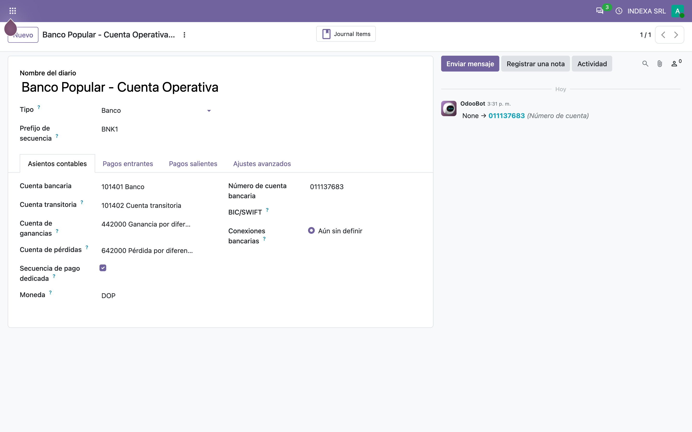
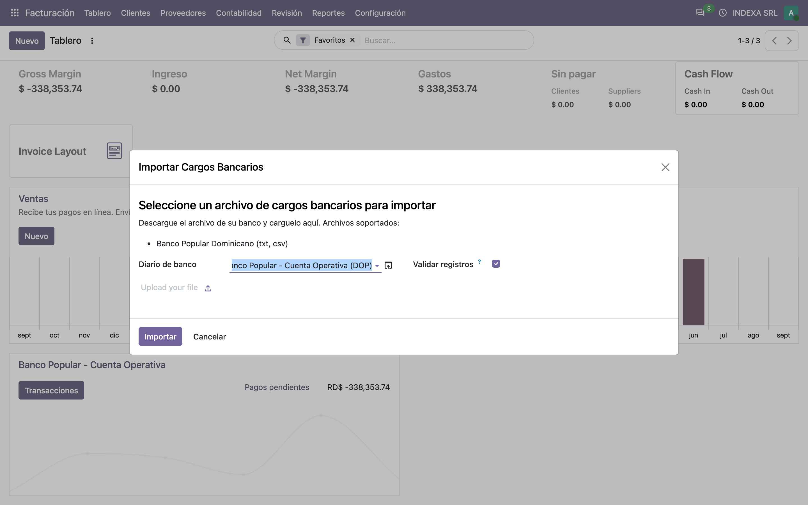
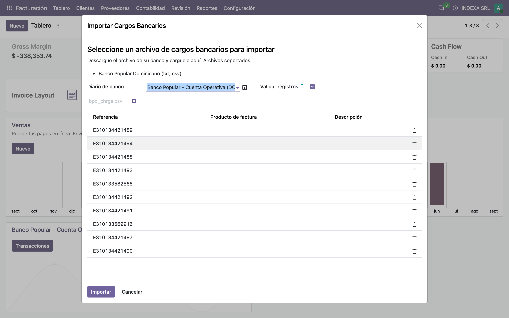
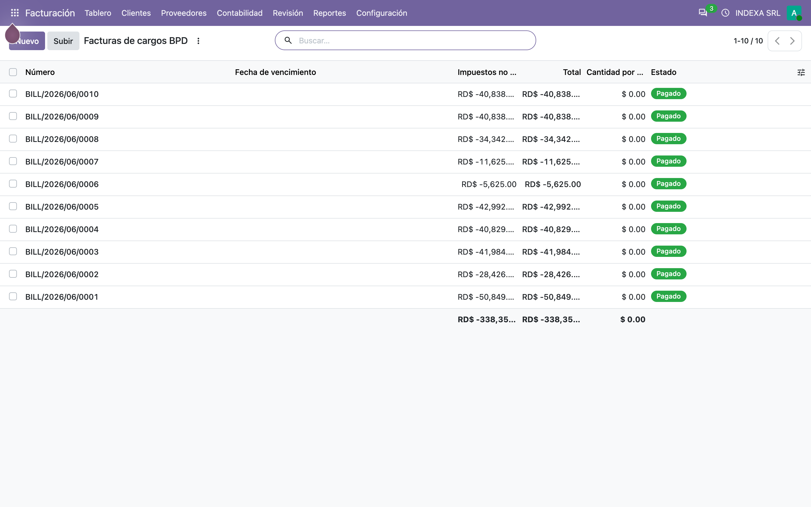
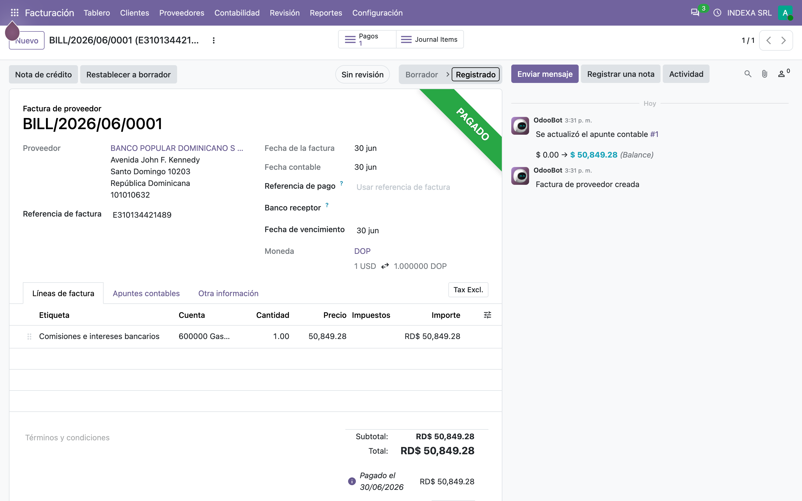
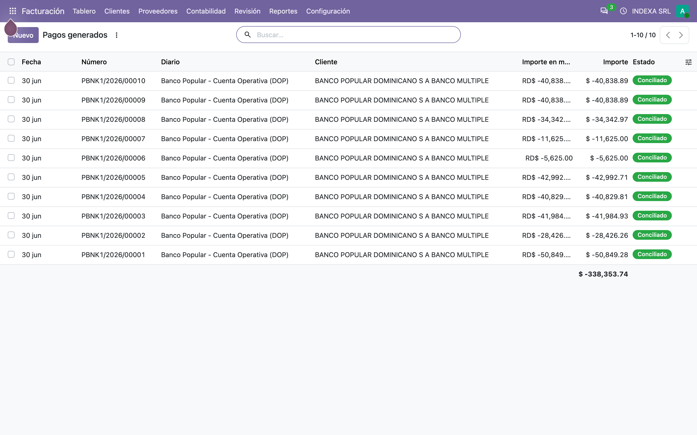

# Cargos bancarios del Banco Popular — Manual de usuario (account_bank_charge_import_bpd)

> Manual generado con `tools/manual-generator`. Las capturas se regeneran ejecutando el generador contra una base `test_v20_<módulo>`.

`account_bank_charge_import_base` sabe qué hacer con los cargos de un banco —facturarlos, pagarlos y conciliarlos— pero **no sabe leer ningún archivo**. Este módulo le enseña a leer los del **Banco Popular Dominicano**.

Concretamente, el reporte de *Consulta de Números de Comprobantes Fiscales* que el BPD publica en su banca en línea, en sus dos formatos: **csv** y **txt**.

Qué aporta:

- Reconoce que un diario es del BPD por el banco marcado en su cuenta bancaria, y solo entonces se hace cargo del archivo. Si no, lo deja pasar al siguiente módulo de banco.
- Lee el archivo y agrupa los movimientos **por NCF**, que es la referencia con la que el módulo base crea una factura de proveedor.
- Rellena la lista de referencias del asistente en cuanto se sube el archivo, para que el usuario solo tenga que elegir el producto de cada una.
- Distingue cargo de devolución, mapea la moneda del banco (`RD$`, `US$`) a la de Odoo y convierte las fechas `mm/yyyy` al último día del mes.

Todo lo que pasa después —la factura, los impuestos, los pagos, la conciliación— es del módulo base. Este solo aporta la lectura.

## Requisitos previos

- Módulo **`account_bank_charge_import_bpd`** instalado (v `19.5.1.2.0`, línea 20.0 / `master`). Odoo `master` se autodeclara `19.5`, de ahí el prefijo de versión.
- Dependencia: **`account_bank_charge_import_base`** (v `19.5.2.0.0`), que a su vez trae `account` y `l10n_do_banks`.
- Un **diario de banco** cuya cuenta bancaria tenga **Banco Dominicano = Banco Popular Dominicano (BPD)**. Ese campo es lo único que activa este módulo.
- El usuario necesita **Contabilidad: Facturación** (`account.group_account_basic`) como mínimo.
- Un **producto por cada tipo de cargo**, con su cuenta de gasto.

## 1. Lo que enciende el módulo: el banco de la cuenta

El módulo se activa con una sola condición:

```python
def _is_bpd_bank(self):
    return self.journal_id.bank_account_id.l10n_do_bank == "bpd"
```

`l10n_do_bank` lo aporta `l10n_do_banks` sobre la cuenta bancaria. Si el diario no tiene cuenta, o su banco no es el Popular, este módulo devuelve el archivo al siguiente de la cadena y no toca nada.

Aquí es donde más cambió el port: hasta la 19.0 la marca vivía en `res.bank`, y se llegaba a ella por `journal.bank_id`. En la 20.0 **`res.bank` desapareció**, `account.journal.bank_id` con él, y `l10n_do_banks` movió el campo a `res.partner.bank`.



## 2. El asistente declara los formatos que sabe leer

El asistente es el del módulo base. Lo único que este módulo le agrega es una línea en la lista de *Archivos soportados*:

> **Banco Popular Dominicano (txt, csv)**

Es una herencia de dos líneas sobre `//ul[@id='charge_format']`. Con varios bancos instalados la lista crece sola, y el usuario ve de un vistazo qué archivos acepta su instalación.



## 3. Al subir el archivo, las referencias aparecen solas

Este es el archivo de ejemplo que trae el módulo (`bpd_charges_file/bpd_chrgs.csv`), un reporte real de NCF del BPD. Al soltarlo, el asistente muestra **diez referencias**, una por cada NCF del archivo.

Lo hace `onchange_data_file()`, que lee el archivo y recoge los NCF. Lo interesante es **cómo** los encuentra. El reporte tiene esta cabecera:

```
Fecha,No. de Cuenta,Descripción,NCF,Moneda,Monto DB,Monto CR
```

…pero la descripción trae comas sin comillas (*«Cuota 39 de 60, Contrato No. 50004769»*), así que el NCF **no cae siempre en la misma columna**. El módulo no cuenta columnas: busca la celda que tenga forma de NCF (`B` + 10 dígitos) o de e-CF (`E` + 12 dígitos) y lee el resto relativo a ella. Las filas sin NCF —cabeceras, preámbulo, líneas de detalle— se saltan con un aviso en el log en vez de tumbar la importación.

Falta el paso del usuario: elegir el **producto** de cada referencia. Eso es lo que decide la cuenta de gasto y los impuestos de la factura, y el módulo base no lo adivina.



## 4. El resultado: una factura por NCF

Las diez referencias del archivo se convirtieron en diez facturas de proveedor a nombre del **Banco Popular Dominicano**, todas fechadas el **30 de junio** y todas **pagadas**.

La fecha merece explicación. El reporte del BPD trae `06/2026` —mes y año, sin día—, porque el NCF corresponde al mes completo. El módulo lo convierte al **último día del mes**, que es la fecha con la que el banco reporta ese comprobante. Cuando el archivo sí trae día (`dd/mm/yyyy`, como en las líneas de detalle del txt), lo respeta.

El proveedor lo aporta este módulo: nombre, RNC `101010632`, dirección y teléfono del Banco Popular. El módulo base lo busca por RNC y lo crea si no existe.



## 5. Una factura por dentro

La factura más grande del lote. La **referencia** es el NCF, la **línea** lleva el producto que eligió el usuario con la suma de los movimientos de ese NCF, y la descripción que quedó es la que traía el archivo.

Si un NCF tuviera varios movimientos, la factura seguiría siendo una sola, con la suma, y habría un pago por cada movimiento. En este archivo cada NCF trae un solo cargo.



## 6. Los pagos, conciliados contra sus facturas

Diez pagos en el diario del BPD, uno por cargo, todos **conciliados**. El banco ya se cobró debitando la cuenta; esto es lo que deja la contabilidad reflejando ese hecho sin que nadie capture nada a mano.

Si en el asistente se desmarca **Validar registros?**, las facturas y los pagos quedan en borrador para revisarlos antes.



## 7. Los dos formatos y sus reglas

| | csv | txt |
|---|---|---|
| Origen | *Consulta Números de Comprobantes Fiscal*, exportado a csv | El mismo reporte en texto plano, con columnas rellenas con espacios |
| Cómo se localiza el NCF | Por patrón, desde la tercera celda | Por patrón, en toda la fila |
| Cargo o devolución | Por el prefijo del NCF: `E34` y `B04` son devolución | Por la columna `DB`/`CR` |
| Monto | `Monto DB` o `Monto CR` según el caso | La columna posterior a la moneda |
| Moneda | La del primer movimiento con moneda mapeable | Solo si **todo** el archivo usa una |

Reglas comunes a los dos:

- **Codificación**: el BPD exporta lo mismo en UTF-8 (con BOM) que en latin-1. El módulo intenta UTF-8 y cae a latin-1.
- **Moneda**: `RD$` → `DOP`, `US$` → `USD`. En el txt, si el archivo mezcla monedas el módulo no declara ninguna y el base usa la del diario.
- **Fechas**: `mm/yyyy` → último día del mes; `dd/mm/yyyy` tal cual. Cualquier otra cosa detiene la importación con un mensaje explícito.
- **Montos**: si una celda no es un número decimal, la importación se detiene diciendo cuál.
- **Filas sin NCF**: se saltan. Las del txt (líneas de detalle de una transacción) en `DEBUG`; las del csv en `WARNING`, porque ahí sí deberían traerlo.

## 8. Qué cambió con el port

Tres roturas y un arreglo de diseño:

| Qué | Antes | Ahora |
|---|---|---|
| La marca del banco | `journal.bank_id.l10n_do_bank` sobre `res.bank` | `journal.bank_account_id.l10n_do_bank` sobre `res.partner.bank` |
| Leer el archivo subido | `base64.b64decode(self.data_file)` | `self.data_file.content` |
| `is_company` del banco | Se escribía al crear el contacto | Se quitó: el núcleo lo calcula |
| Pasar el archivo al parser | Se escribía a `/tmp/bank_charges.csv` y se releía | Se parsea en memoria, desde el argumento que ya recibe |

El último no era una rotura del port, pero sí un defecto que el port dejó a la vista. `onchange_data_file()` escribía el archivo decodificado en una ruta **fija** de `/tmp`, y `_parse_file()` **ignoraba el archivo que le pasaban** para releer esa ruta. Con eso:

- dos usuarios importando a la vez se pisaban el archivo;
- una importación lanzada sin pasar por el onchange leía lo que hubiera quedado de la anterior;
- y con varios procesos de Odoo, el que parseaba podía no ser el que escribió.

Ahora el archivo viaja como bytes y se parsea con `io.StringIO`. No queda nada en disco.

## Notas

### Qué agrega el módulo

| Método | Qué hace |
|---|---|
| `_is_bpd_bank()` | La condición que activa todo: el banco de la cuenta del diario |
| `_decode_bpd_file()` | UTF-8 con BOM, con respaldo a latin-1 |
| `_bpd_stream()` | Devuelve el reporte decodificado como flujo de texto |
| `_parse_bpd_csv_row()` / `_parse_bpd_txt_row()` | Una fila del reporte; `None` si no es de datos |
| `_get_bpd_csv_chrgs_vals()` / `_get_bpd_txt_chrgs_vals()` | El diccionario de cargos agrupado por NCF |
| `onchange_data_file()` | Rellena las referencias del asistente al subir el archivo |
| `_parse_file()` | El gancho del módulo base; delega en `super()` si el archivo no es suyo |
| `_get_bank_partner_id()` | Los datos fiscales del Banco Popular |

La única vista es una herencia de dos líneas sobre el formulario del asistente del módulo base.

### Notas de la migración a la línea 20.0 (`master`)

**Roturas encontradas y corregidas:**

1. **`res.bank` desapareció, y con él `account.journal.bank_id`.** `_is_bpd_bank()` leía `journal.bank_id.l10n_do_bank`, así que fallaba con `AttributeError` — y como es la condición que gobierna todos los caminos del módulo, el módulo entero quedaba muerto. `l10n_do_banks` ya había movido `l10n_do_bank` a `res.partner.bank` en su propio port, así que ahora se llega por `journal.bank_account_id`.
2. **Un campo `Binary` guarda el contenido crudo, ya no base64.** `onchange_data_file()` hacía `base64.b64decode(self.data_file)`. Es la misma rotura que el módulo base, y es silenciosa: `b64decode` omite los caracteres fuera del alfabeto base64 en vez de fallar, así que el reporte habría llegado convertido en basura y el asistente habría dicho simplemente que no encontró referencias.
3. **`is_company` pasó a ser calculado y almacenado.** `_get_bank_partner_id()` lo escribía al crear el contacto del banco; esa escritura ya no tiene efecto, así que se quitó. El contacto sigue quedando como empresa, ahora porque el núcleo lo calcula a partir del RNC.
4. **`invoice_payments_widget` pasó de `Binary` a `Json`.** Solo afectaba a las pruebas, que comparaban la fecha de un pago contra un objeto `date`; al pasar por JSON, esa fecha vuelve como cadena ISO.
5. **Versión `20.0.1.1.0` → `19.5.1.2.0` e `installable: True`.** `master` se autodeclara `19.5`, y `check_version()` fuerza `installable=False` en cualquier módulo instalable cuya versión no empiece exactamente con la serie en ejecución.

**Arreglo de diseño que el port dejó a la vista:** el archivo ya no pasa por `/tmp`. Ver el paso 8. Es la parte del cambio que no era obligatoria para que el módulo arrancara, pero sí para que `_parse_file()` cumpliera el contrato que el módulo base define —recibir el archivo y parsearlo— en vez de releer una ruta fija del disco.

**No hizo falta script de migración.** No cambió ninguna tabla, columna, campo ni registro de seguridad; el módulo solo trae una vista, cuyo xmlid y modelo no cambian. Por eso el salto de versión es de *minor*, no de *major*.

**Verificación:** el módulo instala a `19.5.1.2.0` y su suite pasa **12 de 12**, seis de ellas importaciones completas de los archivos de ejemplo que trae el propio módulo — sin simular nada, porque leer el archivo es justo lo que este módulo aporta. Las pruebas nuevas cubren lo que el port cambió: que la marca del banco distinga al BPD de otro banco dominicano, que `_parse_file()` funcione **sin** haber pasado por el onchange (la prueba de que `/tmp` ya no interviene), que una extensión no soportada delegue en el módulo base, que un reporte en latin-1 se lea, y que el contacto del banco salga con el RNC correcto. `pre-commit` pasa sobre todos los archivos tocados.

### Pendiente / decisión funcional

- **El asistente no avisa de un archivo ya importado.** Volver a subir el mismo reporte genera otra vez las facturas y los pagos. Viene así desde antes del port.
- **`account_bank_charge_import_bhd` sigue sin portar.** Es el otro módulo de banco de esta familia, y arrastra las mismas roturas que este (la marca del banco, el `base64`, el `is_company`), así que este port sirve de plantilla.

### Reproducir este manual

```bash
cd tools/manual-generator
./generate-manual.sh --module=account_bank_charge_import_bpd \
  --addons-path=/mnt/extra-addons,/mnt/extra-addons-pro,/mnt/extra-addons-pro/store-addons
```

El `--addons-path` saca `enterprise` de la ruta: ese checkout va por delante del núcleo de la imagen y `ai_auto_install` muere al importar (`cannot import name '_check_jwt'`), lo que tumba la instalación entera. Este módulo no necesita `enterprise`.

**Aviso sobre el entorno:** la imagen `dev_env_odoo_pro-20-odoo` de este equipo trae el nightly `19.5a1-20260901`, anterior a varios cambios que este port necesita. Las capturas se tomaron montando el checkout de `odoo` del propio entorno como núcleo (`-v $R/odoo:/src/odoo:ro` y `python3 /src/odoo/odoo-bin`). En cuanto la imagen se reconstruya contra un nightly más reciente, `generate-manual.sh` funciona tal cual.

El seed (`configs/account_bank_charge_import_bpd.seed.py`) arma, sobre una base limpia: la compañía con plan contable genérico, un diario de banco marcado como Banco Popular, un producto de cargo, y **una importación real del csv de ejemplo del módulo** — sin simular el parseo, a diferencia del manual del módulo base.
