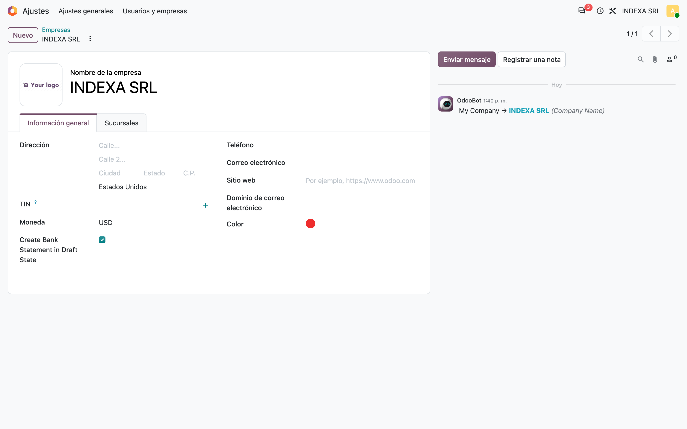
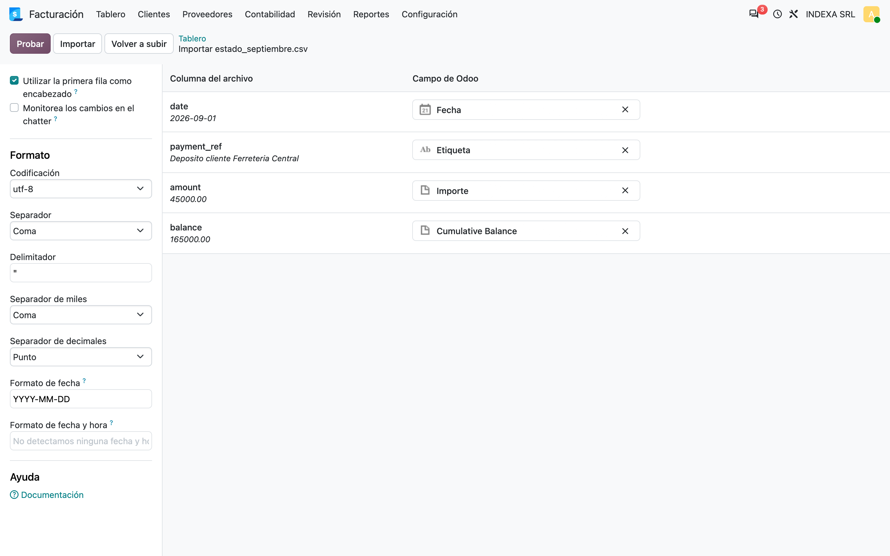
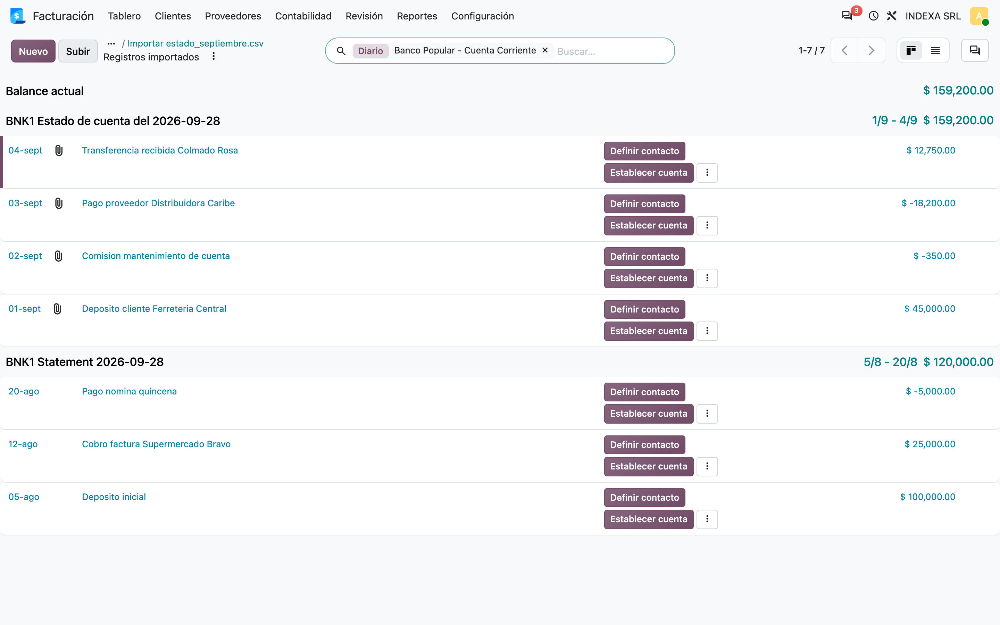
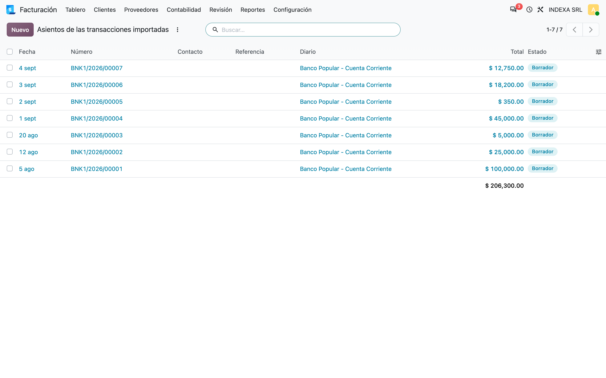
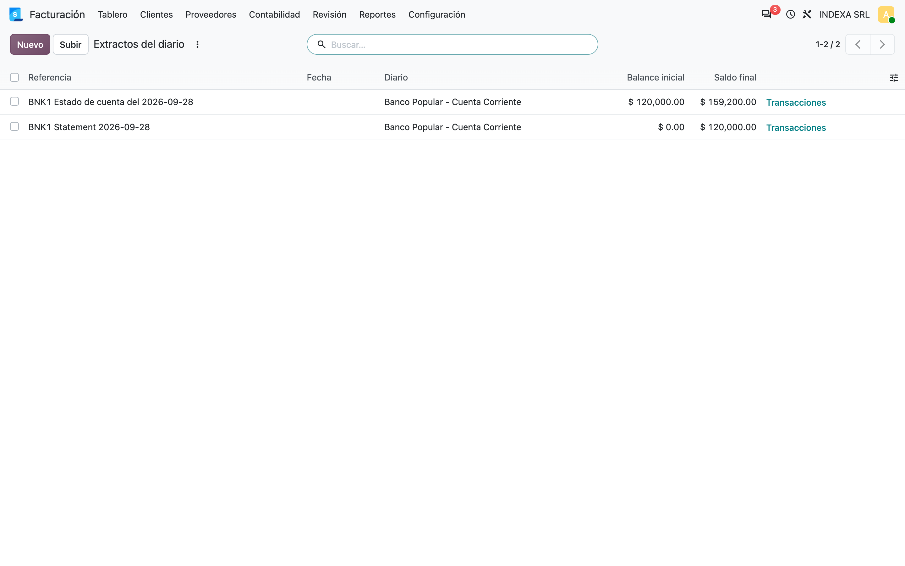

# Importación de extractos CSV en borrador — Manual de usuario (account_bank_statement_import_csv_patch)

> Manual generado con `tools/manual-generator`. Las capturas se regeneran ejecutando el generador contra una base `test_v20_<módulo>`.

Odoo importa los extractos bancarios en CSV desde la tarjeta del diario de banco y **publica** al instante el asiento de cada transacción. Muchas empresas prefieren revisar el extracto antes de que toque la contabilidad.

Este módulo agrega dos cosas:

- Un interruptor por empresa, **Create Bank Statement in Draft State**. Encendido, cada transacción importada deja su asiento en **Borrador**, y el extracto toma como **balance inicial** el saldo final del extracto anterior del mismo diario, con el **saldo final** igual a ese balance inicial más la suma de las transacciones.
- Un contexto técnico, `skip_csv_check`, que los módulos de cada banco (`bpd_bank_statement_import`, `bdr_bank_statement_import`, `acap_bank_statement_import`, ...) usan para que un archivo `.csv` con el formato propio del banco **no** caiga en el asistente genérico de columnas de Odoo, sino en su propio lector.

Apagado el interruptor, la importación se comporta exactamente como en Odoo estándar.

## Requisitos previos

- Módulo **`account_bank_statement_import_csv_patch`** instalado (v `20.0.1.0.0`, Odoo 20.0).
- Dependencias: **`account_bank_statement_import`**, **`account_bank_statement_import_csv`** (Enterprise) y **`l10n_do_banks`**.
- Permiso de **Administración / Ajustes** para cambiar el interruptor en la ficha de la empresa, y de **Contabilidad** para importar.
- Un **diario de banco**.

## 1. Activar el modo borrador en la empresa

*Ajustes → Usuarios y empresas → Empresas*, abrir la empresa. El módulo agrega la casilla **Create Bank Statement in Draft State** justo debajo de **Moneda**, en la pestaña *Información general*.

Es un ajuste **por empresa**: en una base multiempresa cada una decide si importa en borrador o no.

La etiqueta aparece en inglés porque el módulo no trae traducción al español.



## 2. Subir el archivo desde la tarjeta del diario

En el *Tablero* de Contabilidad, la tarjeta del diario de banco tiene el botón **Subir**. Al elegir un `.csv` (o `.xls`/`.xlsx`), Odoo abre su asistente de columnas: cada columna del archivo se asocia a un campo de la transacción. Con encabezados `date`, `payment_ref`, `amount` y `balance` la asociación sale sola.

La columna **Cumulative Balance** es la que Odoo usa para calcular el balance inicial y final del extracto; con el modo borrador encendido esos dos valores los fija este módulo (paso 5).

El archivo de ejemplo es `estado_septiembre.csv`, con cuatro movimientos de septiembre.



## 3. Resultado de la importación

Al pulsar **Importar**, Odoo crea el extracto *Estado de cuenta* con sus cuatro transacciones y abre la vista de conciliación del diario. Arriba queda el extracto de septiembre recién importado, y debajo el de agosto que ya existía.

Hasta aquí la pantalla es la de Odoo estándar; la diferencia está en los asientos (paso 4).



## 4. Los asientos quedan en borrador

Cada transacción de un extracto tiene su asiento contable en el diario de banco. Con el interruptor encendido, el módulo lo devuelve a **Borrador** en cuanto la transacción se crea, así que ninguna de las siete transacciones (tres de agosto, cuatro de septiembre) ha afectado todavía los saldos contables.

Para darlas por buenas se publican los asientos, uno a uno desde su formulario o en bloque desde esta lista (*Acciones → Confirmar asientos*).

Con el interruptor apagado los mismos asientos saldrían en **Publicado**, como en Odoo estándar.



## 5. Balances del extracto encadenados

Con las transacciones en borrador, Odoo no las cuenta al buscar el saldo del extracto anterior. Por eso el módulo fija él mismo los balances:

| Extracto | Balance inicial | Saldo final |
|---|---|---|
| Agosto | 0.00 | 120,000.00 |
| Septiembre | **120,000.00** (saldo final de agosto) | **159,200.00** = 120,000.00 + 45,000.00 − 350.00 − 18,200.00 + 12,750.00 |

El extracto anterior es el último creado **en el mismo diario**, sin importar su fecha.

La columna *Fecha* queda vacía: Odoo la calcula con las transacciones publicadas y todavía no hay ninguna. Pasa lo mismo en 19.0.



## 6. Para los módulos de banco: `skip_csv_check`

`account_bank_statement_import_csv` desvía **todo** archivo terminado en `.csv`, `.xls` o `.xlsx` a su asistente de columnas. Los bancos dominicanos publican sus extractos en CSV con formatos propios, y sus módulos traen su propio lector.

Este módulo sobrescribe `account.journal._check_file_format()`: si el contexto trae `skip_csv_check=True`, responde que el archivo **no** es un CSV genérico, y la importación sigue al lector del banco. Los módulos de banco lo usan así:

```python
def _import_bank_statement(self, attachments):
    return super(AccountJournal, self.with_context(skip_csv_check=True))._import_bank_statement(attachments)
```

Sin el contexto, el comportamiento es el de Odoo.

## Notas

- El modo borrador sólo actúa sobre transacciones y extractos **creados** con el interruptor encendido; no toca los ya importados.
- En 20.0 Odoo trae su propio **extracto en borrador** (`is_statement_posted`, botones *Publicar* / *Borrador* del extracto). Este módulo no lo usa: los extractos que crea siguen marcados como publicados y sólo sus asientos quedan en borrador, igual que en 19.0.
- Verificado sobre Odoo 20.0 con la importación real del asistente CSV.
