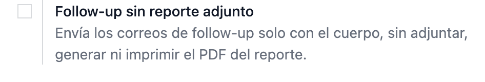
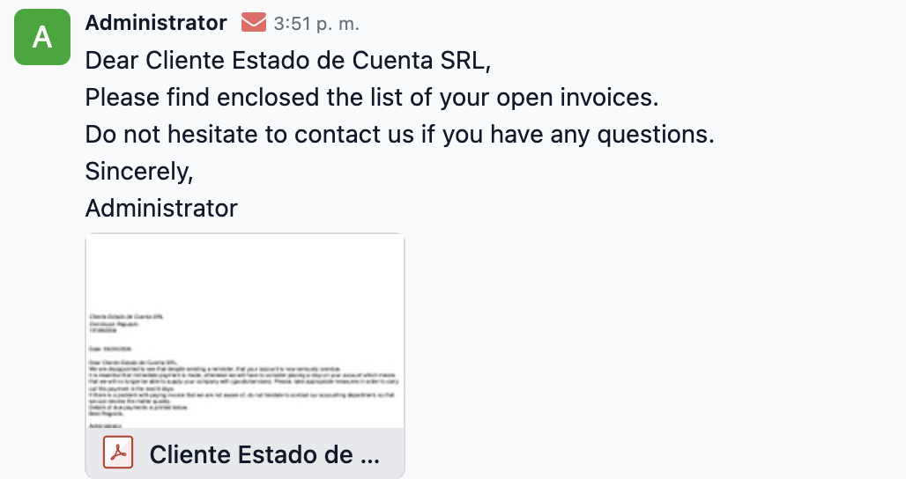
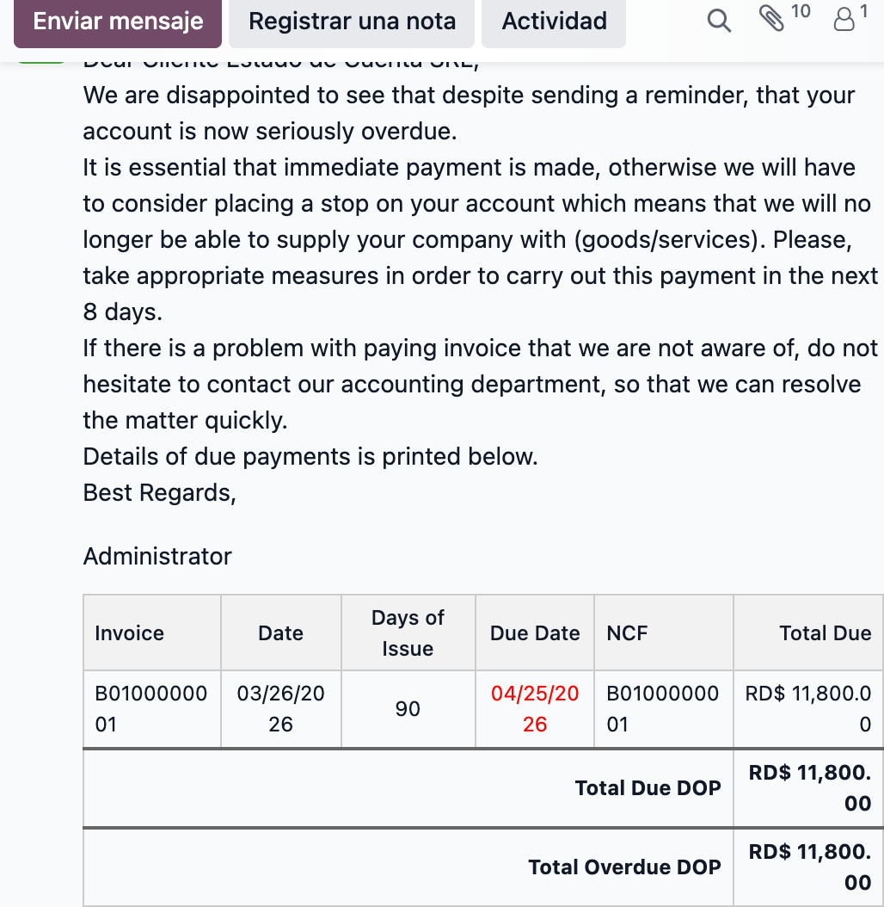

# Manual — Follow-up sin reporte adjunto (configurable)

Esta opción controla si los correos de follow-up (recordatorios de pago) se
envían **con el reporte PDF adjunto** (comportamiento normal de Odoo) o
**solo con el cuerpo del correo** (la tabla del estado de cuenta en línea, sin
PDF).

Aplica solo a compañías de **República Dominicana** y está **desactivada por
defecto**.

---

## 1. Dónde se activa / desactiva

**Ajustes → Contabilidad → sección _Facturas de cliente_**, casilla
**“Follow-up sin reporte adjunto”**.

- **Desmarcada (por defecto):** Odoo adjunta el reporte PDF al correo.
- **Marcada:** el correo se envía solo con el cuerpo; el PDF no se adjunta, no se
  genera ni se imprime.

Tras marcar/desmarcar, pulsa **Guardar**.

---

## 2. Desactivado (por defecto) — como Odoo normal

El correo usa la plantilla estándar y **adjunta el reporte PDF**.

> Cuerpo: texto de la plantilla. Adjunto: `…- follow-up_report_…pdf`.

---

## 3. Activado — solo cuerpo, sin reporte

El correo lleva la **tabla del estado de cuenta en el cuerpo** (factura, fecha,
días, vencimiento, NCF, total) y **ningún PDF adjunto**.

> Cuerpo: tabla del estado de cuenta. Adjuntos: ninguno.

---

## Alcance

El ajuste afecta los dos flujos de envío por igual:

| Flujo | Ruta |
|-------|------|
| Ficha del cliente | botón **Send** del widget de follow-up |
| Estado de cuenta | **Send → Enviar e Imprimir** |

Con la casilla marcada, ninguno de los dos adjunta/imprime el reporte; ambos
envían solo el cuerpo. Con la casilla desmarcada, ambos se comportan como Odoo
de fábrica.
