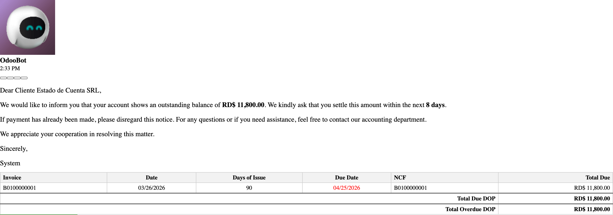
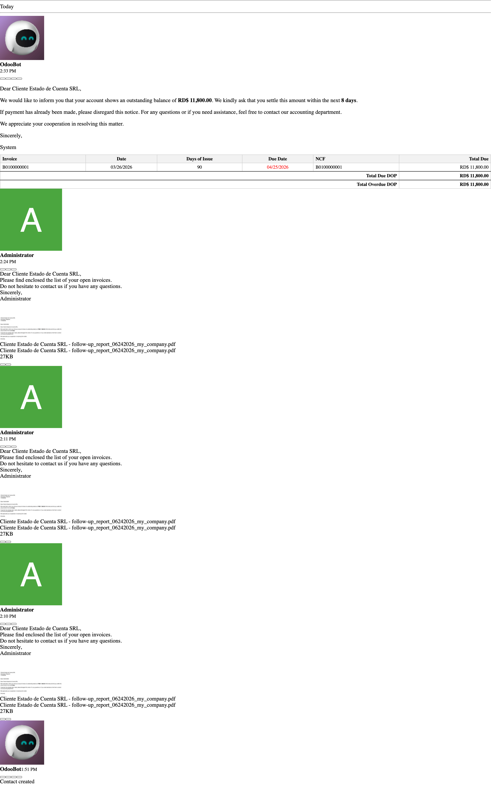

# Validación — el follow-up DO ya no adjunta el PDF

**Módulo:** `account_followup_extra_features` · **Odoo:** 19.0
**Fecha de validación:** 2026-06-24
**Base de datos:** `test_followup_pdf_repro` · **Contenedor:** `lfernandez_v19` (reiniciado)

---

## Veredicto

✅ **Confirmado en ejecución real.** Con compañía **DO** y la línea de follow-up con
**`join_invoices = True`** (el caso que más adjuntaría), el correo se envía con
**cero adjuntos**. El cuerpo conserva la tabla del estado de cuenta (factura, días,
NCF, total). El reporte PDF no se genera, no se adjunta y no se envía.

| Comprobación | Resultado |
|---|---|
| Código cargado en el contenedor reiniciado | `account_followup_extra_features` → `NEW(return [])` |
| `env.company.country_code` | `DO` |
| `followup_line.join_invoices` | `True` |
| `partner._get_followup_attachments(options)` | `[]` (len 0) |
| Cuerpo contiene la tabla (NCF / Days of Issue) | `True` |
| Mensaje enviado (`mail.message` #119) — adjuntos | `[]` |
| Correo en cola (`mail.mail` #5) — adjuntos | `[]` |

---

## Evidencia 1 — ejecución del flujo real (`odoo shell`)

Se ejecutó la **misma secuencia de producción** (`_get_followup_attachments` →
`send_followup_email` → `message_post`) sobre el cliente real con factura vencida,
y se inspeccionaron los adjuntos del mensaje generado:

```text
::RESULT:: method_module odoo.addons.account_followup_extra_features.models.res_partner
::RESULT:: code_version NEW(return [])
::RESULT:: country_code DO
::RESULT:: join_invoices True
::RESULT:: get_followup_attachments [] len 0
::RESULT:: body_has_NCF True
::RESULT:: body_has_days True
::RESULT:: sent_message 119 subject 'My Company Payment Reminder - Cliente Estado de Cuenta SRL' attachments []
::RESULT:: mail_mail 5 attachments []
::RESULT:: DONE
```

Lo importante:

- `code_version NEW(return [])` — el contenedor reiniciado **sí** cargó el fix
  (no el override viejo de quitar+borrar).
- `join_invoices True` pero `get_followup_attachments []` — ni el reporte ni las
  facturas se adjuntan.
- `sent_message ... attachments []` y `mail_mail ... attachments []` — el correo
  realmente enviado **no lleva ningún archivo**.

---

## Evidencia 2 — el correo enviado (captura real)

Recordatorio recién enviado (OdooBot, 2:33 PM). Cuerpo con la tabla del estado de
cuenta y **sin ningún adjunto** debajo:



### Antes vs. después en el mismo chatter

El hilo del cliente deja ver el contraste. Arriba (más reciente) el envío validado:
solo cuerpo, sin adjunto. Más abajo, mensajes de pruebas **anteriores al fix**, que
sí llevaban el archivo `... - follow-up_report_06242026_my_company.pdf` (27 KB):



---

## "Enviar e Imprimir" — sin PDF en el chatter

El paso *Imprimir* del wizard (`_print_followup_letter`) generaba una carta PDF y la
guardaba en el chatter (mensaje *"Follow-up letter generated"*). No se enviaba al
cliente, pero seguía siendo un PDF del reporte. Para compañías DO ese paso ahora es
un **no-op**: "Enviar e Imprimir" solo manda el correo, sin generar ningún PDF.

Validación (wizard real, template "Follow Up Report", `email=True`, `print=True`):

```text
::V:: print_override_loaded True
::V:: wizard_action {'type': 'ir.actions.act_window_close'}
::V:: MSG 133 attach [] | body 'Next Reminder Date set to 07/09/2026'
::V:: MSG 134 attach [] | body 'Dear Cliente Estado de Cuenta SRL, Please find enc'   # ← el correo, sin adjunto
::V:: any_pdf_in_chatter False                                                          # ← ya no hay "Follow-up letter generated"
```

```python
@api.model
def _print_followup_letter(self, partner, options=None):
    # DO companies must not produce the follow-up report PDF anywhere.
    if self.env.company.country_code == "DO":
        return False
    return super()._print_followup_letter(partner, options)
```

`account_followup_extra_features/models/account_followup_report.py`

> **Nota sobre el cuerpo:** en el wizard puedes elegir distintas plantillas. La línea
> usa por defecto *"Payment Reminder"* (id 20, *"We would like to inform…"*); el usuario
> probó con *"Follow Up Report"* (id 19, *"Please find enclosed…"*). Es solo el texto de
> la plantilla — ninguna adjunta el PDF.

---

## Por qué antes "seguía enviando"

El override anterior solo quitaba `report_attachment_id` de la lista de adjuntos, y
encima requería **reiniciar Odoo** para que el cambio de modelo Python tomara efecto.
El fix corta de raíz: para compañías DO `_get_followup_attachments` devuelve `[]`,
así nunca se llama a `super()` ni se crea el PDF.

```python
def _get_followup_attachments(self, options):
    # DO companies send the follow-up as the email body only (the report is
    # rendered inline by get_followup_report_html). No PDF/account statement
    # must be attached, so skip the base attachment generation entirely.
    if self.env.company.country_code == "DO":
        return []
    return super()._get_followup_attachments(options)
```

`account_followup_extra_features/models/res_partner.py`

---

## Cómo reproducir

```bash
# 1. Ejecutar el flujo real e inspeccionar adjuntos (contenedor reiniciado)
docker exec -i lfernandez_v19 odoo shell -d test_followup_pdf_repro \
  --db_host=odoo-db --db_user=odoo --db_password=*** --no-http < validate.py

# 2. Servidor efímero solo para capturas (no toca la conf del usuario)
docker run -d --rm --name manualgen_followup --network odoo_shared_network \
  -p 8071:8069 -v "$PWD/odoo-pro:/mnt/extra-addons-pro" \
  -v "$PWD/enterprise:/mnt/extra-addons-enterprise" -v "$PWD/conf:/etc/odoo" \
  -v dev_env_odoo_pro-19_odoo_pro_ODOO_DATA:/var/lib/odoo \
  --entrypoint odoo dev_env_odoo_pro-19-odoo -d test_followup_pdf_repro \
  --db-filter='^test_followup_pdf_repro$' --workers=0 --max-cron-threads=0

# 3. Capturas con Playwright (Chrome del sistema)
node tools/manual-generator/capture.mjs --base-url=http://localhost:8071 \
  --db=test_followup_pdf_repro --login=admin --password=admin --config=followup_capture.json --out=img
```

> El mensaje #119 quedó **commiteado** en `test_followup_pdf_repro` como evidencia del
> envío real sin adjunto.
