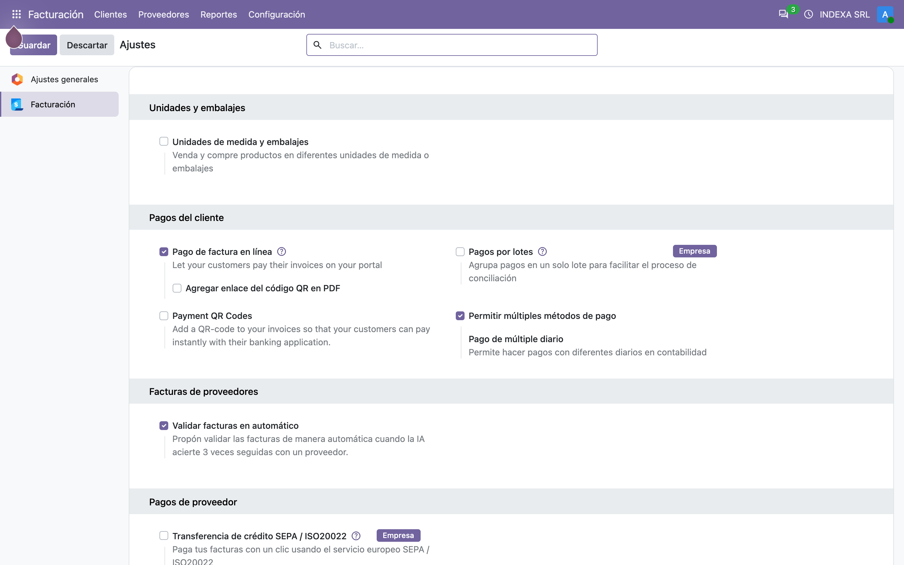
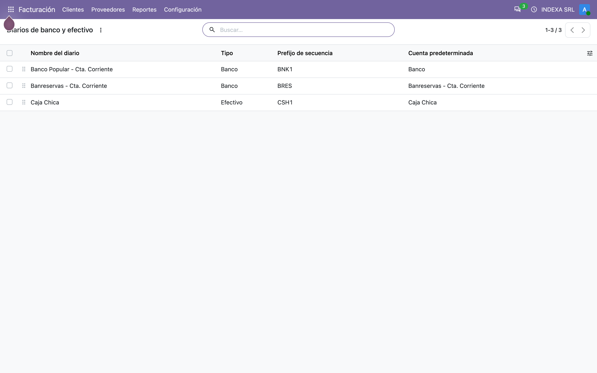
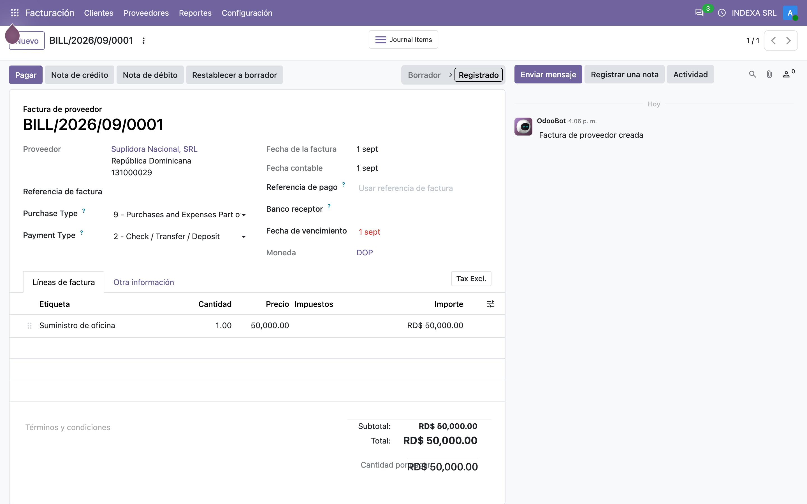
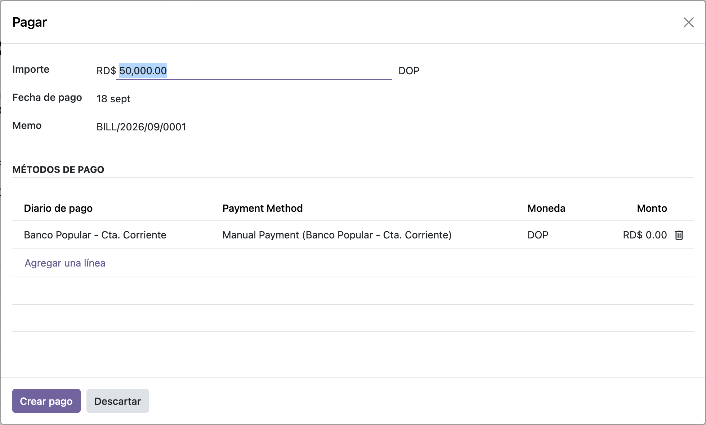
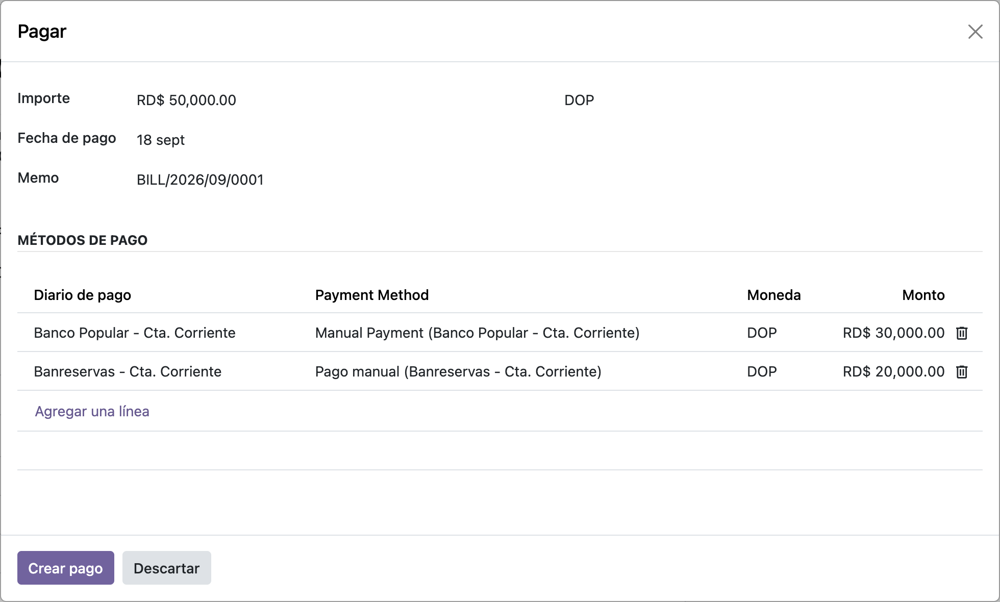
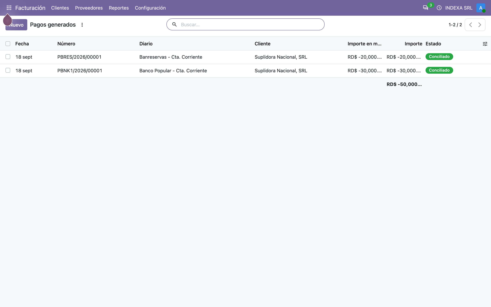
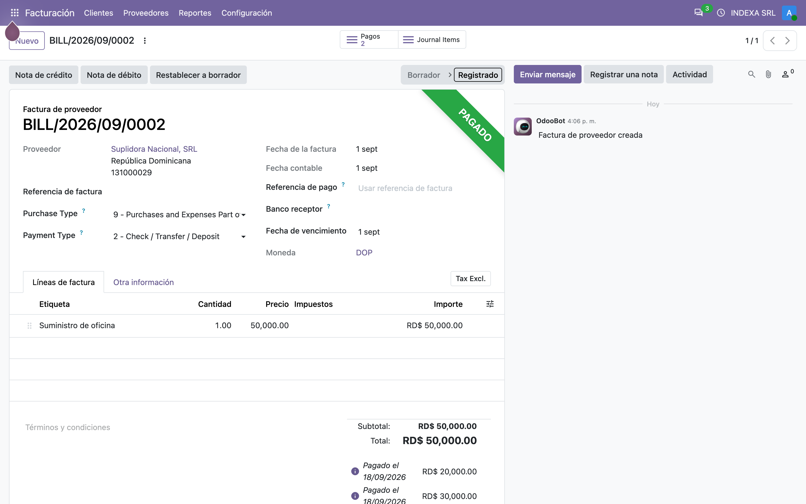

# Pago multi-diario — Manual de usuario (account_multi_journal_payment)

> Manual generado con `tools/manual-generator`. Las capturas se regeneran ejecutando el generador contra una base `test_v20_<módulo>`.

Odoo core paga una factura **desde un solo diario**. El asistente *Registrar pago* pregunta por un diario, un método de pago y un monto, y con eso genera **un** pago.

En la práctica eso no siempre alcanza. Una factura de RD$50,000 se salda con RD$30,000 de una cuenta y RD$20,000 de otra; o una parte en efectivo y el resto por transferencia. Sin este módulo hay que registrar los pagos uno por uno y conciliarlos a mano contra la misma factura.

Este módulo agrega una tabla **Métodos de pago** al mismo asistente. Cada línea es un diario con su propio método de pago, su moneda y su monto. Al confirmar, Odoo genera **un pago por línea**, todos conciliados contra la misma factura, en una sola operación.

Lo que **no** cambia: si la opción está apagada, el asistente y el comportamiento son exactamente los de Odoo core.

## Requisitos previos

- Módulo **`account_multi_journal_payment`** instalado (v `19.5.2.0.0`, línea 20.0 / `master`). Odoo `master` se autodeclara `19.5`, de ahí el prefijo de versión.
- Dependencia única: **`account`**. Este manual además instala `l10n_do` para trabajar sobre un plan contable dominicano realista.
- La opción **Permitir múltiples métodos de pago** encendida en *Contabilidad › Configuración › Ajustes*. Es por compañía (campo `multi_journal_payment` en `res.company`).
- Al menos **dos diarios** de tipo banco o efectivo, cada uno con su método de pago configurado.

## 1. Encender la opción

La función vive detrás de un interruptor por compañía. En *Contabilidad › Configuración › Ajustes*, bloque **Pagos del cliente**, aparece **Permitir múltiples métodos de pago** (*Pago de múltiple diario* — `multi_journal_payment` en `res.company`).

Mientras esté apagado, el asistente de pago es el de Odoo core, sin cambios. Al encenderlo, el mismo asistente gana la tabla **Métodos de pago** que se ve en los pasos siguientes.

Es un ajuste **por compañía**: en una base multi-compañía se enciende solo donde haga falta.

## 2. Los diarios entre los que se reparte

El asistente solo ofrece diarios de tipo **banco** o **efectivo** de la compañía activa — ese es el dominio del campo *Diario* en cada línea.

Esta base de ejemplo tiene tres:

| Diario | Tipo |
|---|---|
| **Banco Popular - Cta. Corriente** | Banco |
| **Banreservas - Cta. Corriente** | Banco |
| **Caja Chica** | Efectivo |

Cada uno aporta sus propios métodos de pago (*Manual*, *Cheque*, etc.). La lista de métodos de la segunda columna del asistente se recalcula por línea según el diario elegido.

## 3. El punto de partida: una factura por pagar

Una factura de proveedor de **RD$50,000** publicada y sin pagar. El botón **Registrar pago** es el de siempre: el módulo no agrega botones ni menús nuevos, solo cambia lo que hay dentro del asistente.

## 4. El asistente con la tabla Métodos de pago

Al pulsar **Registrar pago** aparece el asistente. La diferencia con Odoo core es la tabla **Métodos de pago** al pie.

El módulo la precarga con **una línea**, con el diario que Odoo habría elegido por defecto. El **monto de esa línea arranca en RD$ 0.00** y hay que escribirlo: el importe total de arriba se calcula en función del diario, y el diario en función del importe, así que al sembrar la línea el total todavía no existe. Es el comportamiento del módulo desde su versión 19.0, no un efecto de la migración.

Cada línea tiene sus propias columnas:

| Columna | Qué hace |
|---|---|
| **Diario de pago** | banco o efectivo del que sale el dinero |
| **Payment Method** | se filtra según el diario de la línea |
| **Moneda** | visible con multi-moneda activo; permite pagar una parte en otra divisa |
| **Monto** | lo que se paga por esa vía |

Los campos *Importe* y *Moneda* de arriba quedan como referencia del total de la factura; lo que manda a la hora de crear los pagos es la tabla.

## 5. Repartir el pago entre dos diarios

Se escribe el monto de la primera línea y se agrega una segunda con **Agregar una línea**, eligiendo otro diario.

En el ejemplo los RD$50,000 quedan repartidos en **RD$30,000 por Banco Popular** y **RD$20,000 por Banreservas**. La suma de las líneas es lo que se aplica contra la factura: si no cubre el total, el resto queda como saldo pendiente igual que en un pago parcial normal.

El método de pago de cada línea se recalcula solo al elegir el diario, tomando el primero disponible de ese diario.

## 6. El resultado: un pago por línea

Al confirmar, el módulo genera **un `account.payment` por cada línea** de la tabla, todos con la misma fecha, el mismo contacto y la misma referencia, y los concilia contra la factura en la misma operación.

Aquí están los dos pagos de la factura de ejemplo: RD$30,000 en Banco Popular y RD$20,000 en Banreservas. Cada uno lleva su propio asiento contable en su propio diario — que es justamente lo que permite cuadrar después cada cuenta bancaria por separado.

## 7. La factura queda saldada

La factura muestra el estado **Pagado** y los dos pagos conciliados contra ella. No hay diferencia con una factura pagada de la forma tradicional: para el resto de Odoo (conciliación bancaria, reportes, antigüedad de saldos) son pagos normales.

Si la suma de las líneas fuera menor al total, la factura quedaría **Parcialmente pagado** con el saldo pendiente correspondiente.

## 8. Con la opción apagada

Vale la pena dejarlo dicho porque es la garantía de que el módulo no estorba: **si `Permitir múltiples métodos de pago` está apagado, no pasa nada distinto**.

El campo de control (`is_multi_journal_payment`) se calcula por asistente y queda en falso; la tabla **Métodos de pago** se oculta, los campos de core vuelven a mostrarse tal cual, y la creación del pago delega en el método original de Odoo (`super()._create_payments()`), que genera un único pago.

También queda apagado, aunque la opción esté encendida, cuando el asistente **no es editable** — por ejemplo al pagar de un tirón varias facturas de contactos distintos, donde Odoo agrupa en lotes y no ofrece un monto único que repartir.

## Notas

**Alcance y límites**

- El monto de la línea sembrada arranca en **0.00** y hay que escribirlo: el importe total del asistente se calcula a partir del diario y el diario a partir del importe, así que al sembrar la línea el total todavía no está disponible. Es comportamiento heredado de la versión 19.0 del módulo, no un efecto de la migración.

- El reparto aplica a un asistente **editable**: una factura, o varias del mismo contacto agrupadas en un solo pago. Al pagar lotes de contactos distintos, el asistente vuelve al comportamiento de core.
- Cada línea puede llevar **su propia moneda**. La conversión usa la tasa de la fecha de pago; los campos *Monto origen* y *Moneda origen* guardan el valor en la moneda de la factura.
- La **cuenta bancaria del beneficiario** se resuelve por línea, a partir del diario y del contacto, igual que lo hace core para un pago simple.

**Notas de la migración a 20.0**

- `account.payment.register.batches` pasó de `Binary` a **`Json`**: las líneas del lote viajan como IDs y hay que rehidratarlas con `_get_batches()`. El módulo ya lo hace en los cinco puntos donde leía `batches`.
- Al crear el pago, el campo de referencia correcto es **`memo`**, no `ref` — `account.payment` no delega en `account.move`, así que `ref` nunca fue un campo válido. Corregido en esta versión; antes rompía el flujo *Registrar pago* desde la factura.
- La seguridad pasó de `ir.model.access.csv` a **`security/ir.access.csv`** (`ir.model.access` e `ir.rule` se fusionaron en `ir.access`). El script `migrations/2.0.0/pre-migrate.py` limpia los xmlid viejos antes de cargar el CSV nuevo.
