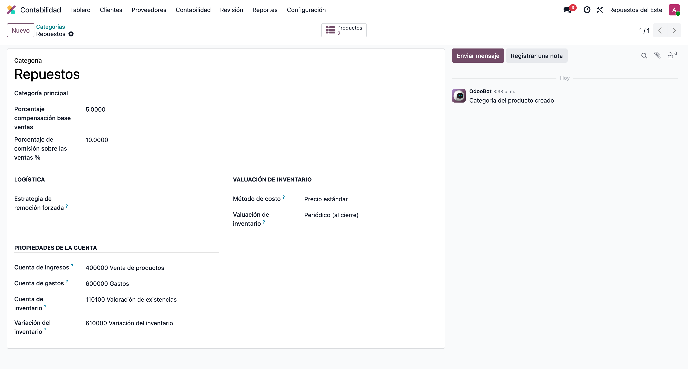
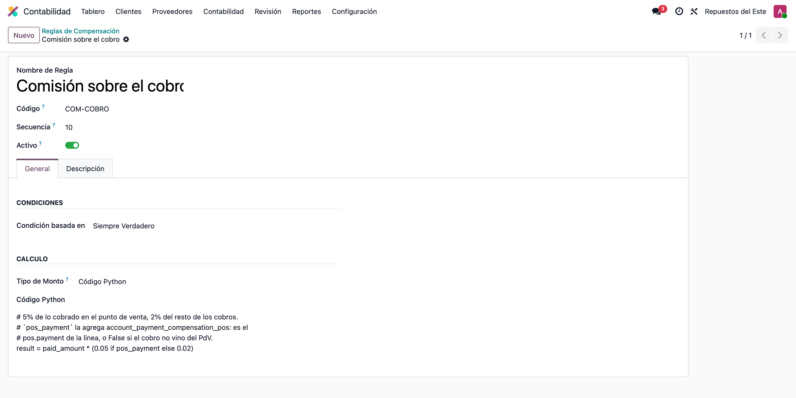
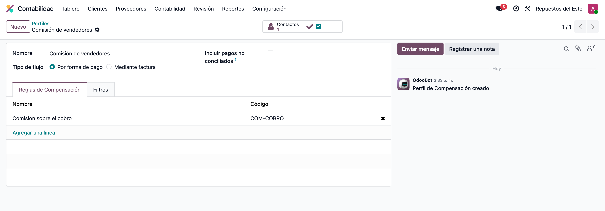
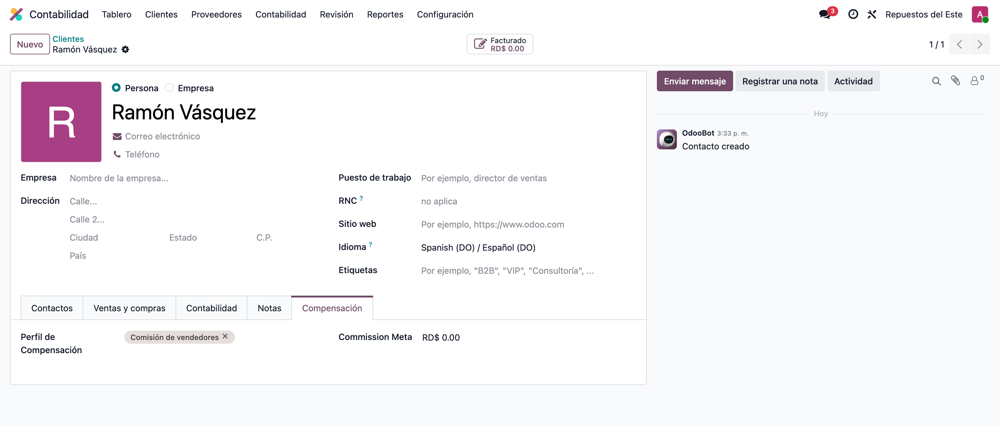
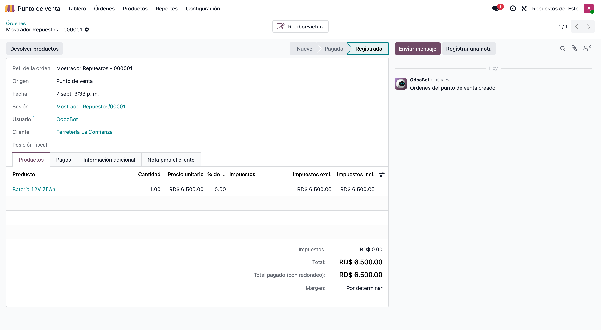
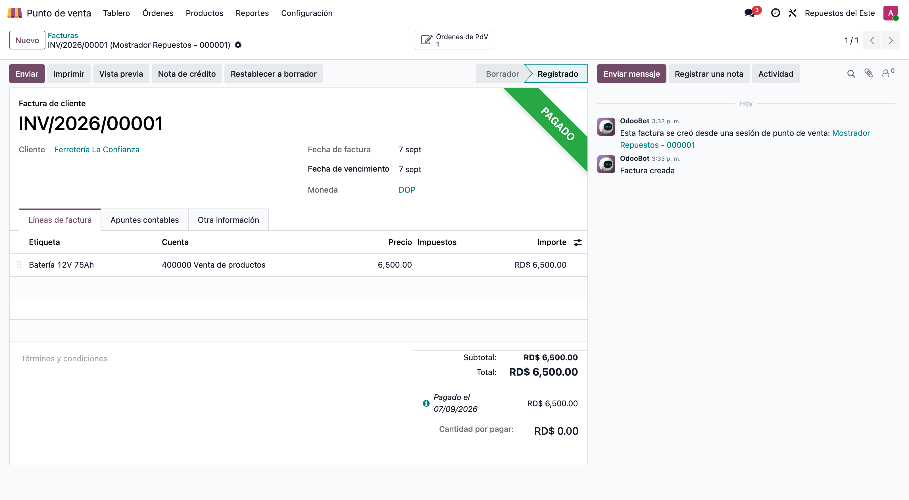
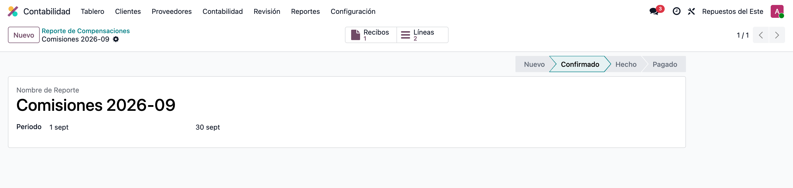
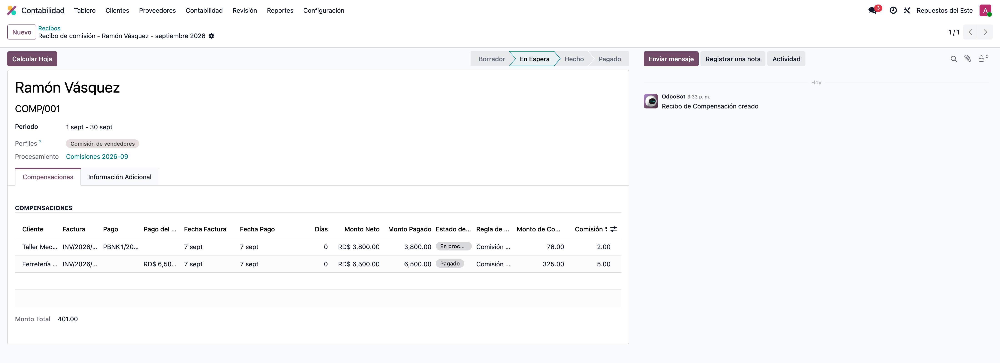
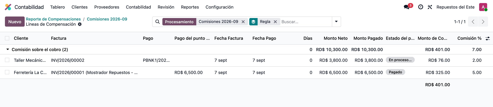

# Compensación de pagos — Integración con el punto de venta — Manual de usuario

> Manual generado con `tools/manual-generator`: `node capture.mjs --config=configs/account_payment_compensation_pos.json --db=test_v19_account_payment_compensation_pos`. Las capturas se regeneran corriendo ese comando contra la base de pruebas.

El módulo **Compensación de pagos** (`account_payment_compensation`) calcula comisiones a partir de los **cobros**: por cada conciliación entre un pago y una factura arma una línea en el recibo del vendedor y le aplica una regla.

Ese cálculo sólo veía los pagos contables (`account.payment`). Lo que se cobra en el **punto de venta** no es un `account.payment` sino un `pos.payment`, así que las ventas del mostrador quedaban fuera de la comisión aunque la orden se hubiera facturado.

**Compensación de pagos — Integración con el punto de venta** (`account_payment_compensation_pos`) es el módulo puente que las incorpora:

- Suma al recibo una línea por cada **pago del punto de venta** conciliado con una factura.
- Agrega la columna **Pago del punto de venta** al recibo y a la lista de líneas de compensación, para distinguir de un vistazo de dónde salió cada cobro.
- Pone la variable `pos_payment` a disposición de las reglas en Python, de modo que una misma regla pueda pagar distinto según el cobro venga de la caja o del banco.

Se instala solo (`auto_install`) en cuanto conviven **Compensación de pagos** y **Punto de venta**: no hay nada que activar.

**Base de datos de las capturas:** Base de pruebas `test_v19_account_payment_compensation_pos`, compañía **Repuestos del Este** (RD, DOP), sin datos de demostración. La siembra deja la categoría de producto con 5% de compensación, la regla `COM-COBRO`, el perfil *Comisión de vendedores*, el vendedor Ramón Vásquez, un punto de venta con sesión abierta, una orden del PdV facturada por RD$ 6,500.00, una factura de RD$ 3,800.00 cobrada por banco y el informe por lotes del mes con el recibo ya calculado.

## Requisitos previos

- Odoo 19 con `account_payment_compensation` y `point_of_sale` instalados (el puente se instala solo).
- Un perfil de compensación de tipo **Por pago** con al menos un filtro configurado.
- Las órdenes del punto de venta tienen que **facturarse**: el módulo trabaja sobre la conciliación entre el pago del PdV y la factura.
- La cuenta por cobrar del cliente debe permitir conciliación (es lo que enlaza el pago del PdV con la factura).

## 1. El porcentaje de compensación de la categoría

El módulo base saca la base de comisión de los productos. En **Contabilidad › Configuración › Facturación › Categorías de productos** la categoría *Repuestos* lleva **5%** de compensación sobre la venta y **10%** sobre la utilidad.

Esto es configuración del módulo base y no cambia con el puente: es sólo el punto de partida para que las líneas del recibo —las del banco y las del punto de venta— tengan un monto que calcular.



## 2. La regla que distingue el cobro del punto de venta

En **Contabilidad › Configuración › Compensación › Reglas de compensación**, la regla `COM-COBRO` usa **Tipo de importe = Código Python**. Ahí aparece la variable que agrega este módulo:

```python
result = paid_amount * (0.05 if pos_payment else 0.02)
```

`pos_payment` es el registro `pos.payment` de la línea cuando el cobro entró por la caja, y `False` cuando vino de un pago contable. Con eso una sola regla paga **5%** de lo cobrado en el punto de venta y **2%** del resto.

Las demás variables (`invoice`, `payment`, `paid_amount`, `net_amount`, `compensation_amounts_json`, `compensation_receipt`) son las del módulo base y siguen disponibles.



## 3. El perfil de compensación

En **Contabilidad › Configuración › Compensación › Perfiles de compensación**, el perfil *Comisión de vendedores* es de **Tipo de flujo = Por pago**: es el flujo que este módulo extiende (el flujo *Por factura* no se toca).

Dos detalles importantes para las líneas del punto de venta:

1. El módulo base exige **al menos un filtro** configurado en el perfil. Aquí el filtro de facturas es `[('move_type', 'in', ['out_invoice', 'out_receipt'])]`.
2. A las líneas del punto de venta se les aplica **sólo el filtro de facturas**. El filtro de pagos se salta, porque apunta al modelo `account.payment` y un cobro de caja es un `pos.payment`.



## 4. El vendedor que cobra la comisión

El recibo se emite a nombre de un contacto. En la pestaña **Compensación** de la ficha de Ramón Vásquez está el perfil que le corresponde: es lo que hace que el informe por lotes le genere un recibo.



## 5. La orden del punto de venta, facturada

En **Punto de venta › Órdenes** está la venta del mostrador por RD$ 6,500.00, con su cliente y su factura.

Facturar la orden es el paso que crea todo lo que el módulo necesita: Odoo emite la factura, arma el asiento del pago del punto de venta y **concilia** la cuenta por cobrar de los dos. Una orden del PdV sin facturar no genera comisión, porque no hay factura contra la que conciliar.



## 6. La factura del punto de venta, pagada

La factura que salió de la orden queda en **Pagado**. El pago que la liquida no es un pago contable: es el asiento del `pos.payment` de la caja, conciliado con la cuenta por cobrar de la factura.

Es justo esa conciliación la que el módulo lee para armar la línea de compensación.



## 7. El informe por lotes del mes

En **Contabilidad › Informes › Compensación › Informe de compensaciones** se abre el lote del mes y se pulsa **Generar compensación**, eligiendo el perfil. Odoo crea un recibo por cada contacto del perfil y lo calcula.

Los botones de arriba llevan a los **recibos** generados y a las **líneas** de compensación del lote.



## 8. El recibo con la columna Pago del punto de venta

Este es el resultado del módulo. El recibo de Ramón Vásquez trae **dos líneas** por el mismo período:

| Cobro | Monto cobrado | Regla | Comisión |
|---|---|---|---|
| Pago del punto de venta | 6,500.00 | 5% | 325.00 |
| Pago contable (banco) | 3,800.00 | 2% | 76.00 |

La columna **Pago del punto de venta** es la que agrega el puente: llena en la línea de la caja, vacía en la del banco. Sin el módulo, la primera línea no existiría y el recibo sumaría sólo RD$ 76.00.

La columna **Comisión %** de una línea del punto de venta se calcula sobre el **monto cobrado**, igual que en las líneas de pagos contables.

El **Estado del pago** de la línea del banco dice *En proceso* porque, con la app de Contabilidad instalada, la factura queda *En pago* hasta que se concilie el extracto bancario. La comisión se calcula igual: lo que el módulo mira es la conciliación entre el cobro y la factura, no el estado de la factura.



## 9. Las líneas de compensación del lote

La misma columna aparece en la lista de **líneas de compensación** —la que se abre desde el botón *Líneas* del informe por lotes—, donde se puede agrupar y filtrar. Ahí es cómodo revisar cuánto de la comisión del mes salió del mostrador y cuánto de la cobranza normal.



## 10. Detalles de implementación

Para quien tenga que darle mantenimiento:

- El módulo agrega una **segunda consulta SQL** a `_get_payment_compensation_lines_values`: llama primero al `super()` (pagos contables y notas de crédito) y le suma las filas del punto de venta. Nunca reemplaza el resultado del módulo base.
- La consulta parte de `pos_payment`, se une a su asiento (`account_move_id`) y busca la contrapartida conciliada. `pos.payment.account_move_id` se escribe con `write()`, que en Odoo queda pendiente en caché, así que el módulo hace `flush_all()` antes de consultar; sin eso el cobro del punto de venta se pierde cuando se calcula el recibo en la misma transacción en que se facturó la orden.
- Para **devoluciones** (`out_refund` / `in_refund`) se toma el pago del PdV con monto **negativo**; para las ventas, el positivo.
- Si la compañía tiene activado **usar la fecha de conciliación** (`compensation_payments_reconcile_date`), la consulta del punto de venta también filtra por `account_partial_reconcile.create_date` en vez de por la fecha del asiento.
- `pos.payment` sólo lo leen los usuarios del punto de venta, así que el recálculo de `compensation_amounts_json` en `account.move` accede a los pagos del PdV con `sudo()`.

## Notas

El módulo no agrega ningún ajuste: si el recibo no muestra líneas del punto de venta, la causa está casi siempre en uno de estos tres puntos.

1. **La orden del PdV no está facturada.** Sin factura no hay conciliación y sin conciliación no hay línea. Se factura desde la caja (cliente + *Factura*) o después, desde *Punto de venta › Órdenes*.
2. **El filtro de facturas del perfil excluye la factura.** Es el único filtro que se aplica a las líneas del punto de venta; conviene probarlo sobre la factura de la orden.
3. **El período del recibo no cubre la fecha del cobro.** La fecha que cuenta es la del asiento del pago del punto de venta, que es la de la orden, salvo que la compañía use la fecha de conciliación.
