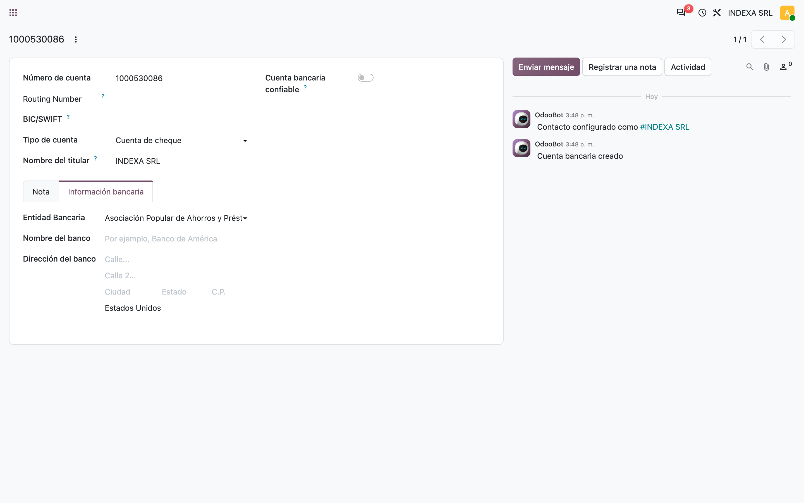
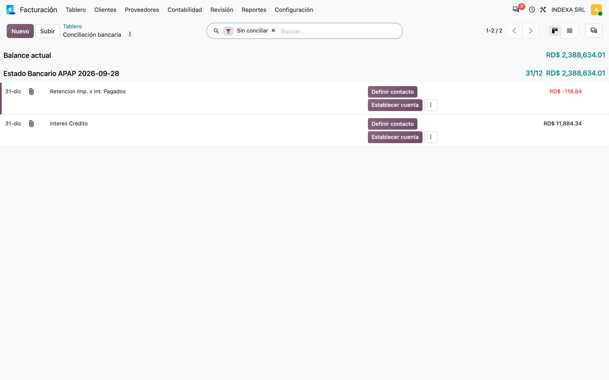
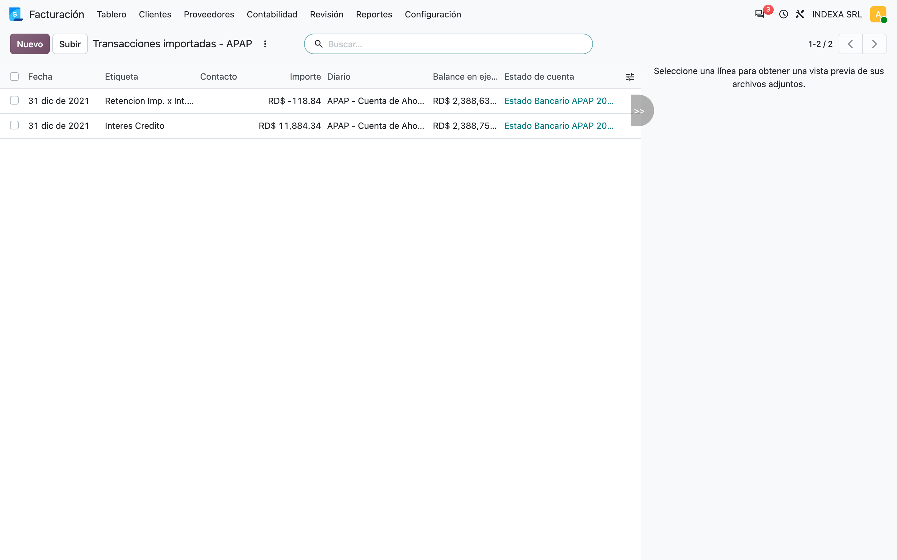

# Importación de extractos Asociación Popular de Ahorros y Préstamos (APAP) — Manual de usuario (apap_bank_statement_import)

> Manual generado con `tools/manual-generator`. Las capturas se regeneran ejecutando el generador contra una base `test_v20_<módulo>`.

Este módulo permite importar en Odoo el estado de cuenta tal como lo descarga la banca en línea de **Asociación Popular de Ahorros y Préstamos (APAP)**, sin reformatearlo.

Formato: CSV separado por comas. El módulo reconoce el archivo por el bloque de cabecera `TRANSACCIONES`, `CUENTA`, `TITULO CUENTA`, `MONEDA` y la fila `FECHA VALOR`, `DESCRIPCION`, `REFERENCIA TXN.`, `FECHA`, `MONTO`; los saldos inicial y final salen de las filas *SALDO INICIAL* y *SALDO AL FINAL DEL PERIODO*.

Se activa solo en los diarios cuya cuenta bancaria está marcada con el banco **Asociación Popular de Ahorros y Préstamos (APAP)**; en cualquier otro diario el archivo sigue el camino estándar de Odoo.

## Requisitos previos

- Módulo **`apap_bank_statement_import`** instalado (v `20.0.1.0.0`, Odoo 20.0).
- Dependencias: **`account_bank_statement_import`** (Enterprise) y **`account_bank_statement_import_csv_patch`**; a través de este último, **`l10n_do_banks`**.
- Un **diario de banco** cuya cuenta bancaria tenga *Entidad Bancaria* = **Asociación Popular de Ahorros y Préstamos (APAP)** y, cuando el archivo lo trae, el mismo número de cuenta (en el ejemplo `1000530086`).
- Permiso de **Contabilidad** para importar extractos.

## 1. Marcar la cuenta bancaria del diario

En *Contabilidad → Configuración → Diarios*, el diario de banco apunta a una **cuenta bancaria**. En esa cuenta, pestaña *Información bancaria*, el campo **Entidad Bancaria** debe decir **Asociación Popular de Ahorros y Préstamos (APAP)**. Es lo que el módulo consulta (`journal.bank_account_id.l10n_do_bank == "asoc_popular"`) para saber que el archivo es de este banco.

En 20.0 el banco se guarda en la cuenta bancaria y no en un registro *Banco* aparte. Por eso el campo está aquí.

## 2. Subir el archivo desde la tarjeta del diario

En el *Tablero* de Contabilidad, botón **Subir** de la tarjeta del diario, se elige el archivo del banco (en el ejemplo `apap_statement.csv`). No aparece el asistente de columnas de Odoo: el módulo lee el formato del banco directamente y Odoo abre la conciliación bancaria con las transacciones del extracto nuevo.

El módulo busca la cuenta en una fila rotulada `CU3NTA`, mientras que el archivo dice `CUENTA :`. Por eso nunca lee el número y Odoo no lo compara con el del diario. Esto ya ocurría en 19.0.

## 3. Transacciones importadas

La lista de transacciones del diario muestra fecha, etiqueta, importe, saldo acumulado y el extracto al que pertenece cada una. A partir de aquí se concilian como cualquier otra transacción bancaria.

## 4. Qué pasa con otros diarios u otros archivos

- Si la cuenta del diario **no** está marcada como Asociación Popular de Ahorros y Préstamos (APAP), el módulo no hace nada y el archivo sigue al siguiente lector (OFX, CAMT, CSV genérico…).
- Si el diario es de Asociación Popular de Ahorros y Préstamos (APAP) pero el archivo no tiene su formato, también se deja pasar. Si ningún lector lo reconoce, Odoo responde *Could not make sense of the given file*.
- Los `.csv` no pasan por el asistente genérico de columnas: el módulo usa el contexto `skip_csv_check` de `account_bank_statement_import_csv_patch`.

## Notas

Verificado sobre Odoo 20.0 con Enterprise: el archivo de ejemplo del módulo se subió desde la tarjeta del diario en el cliente web.
