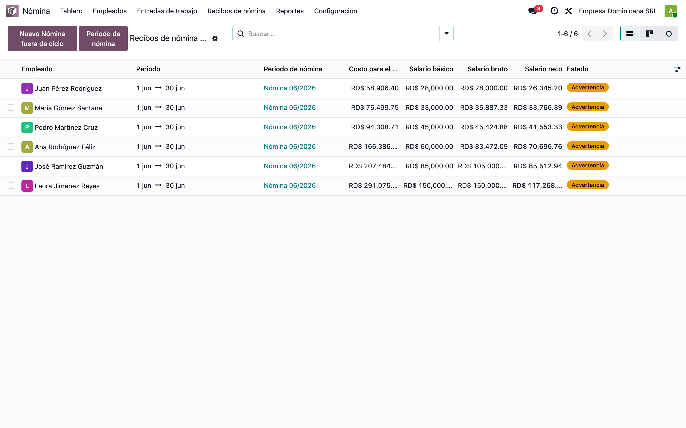
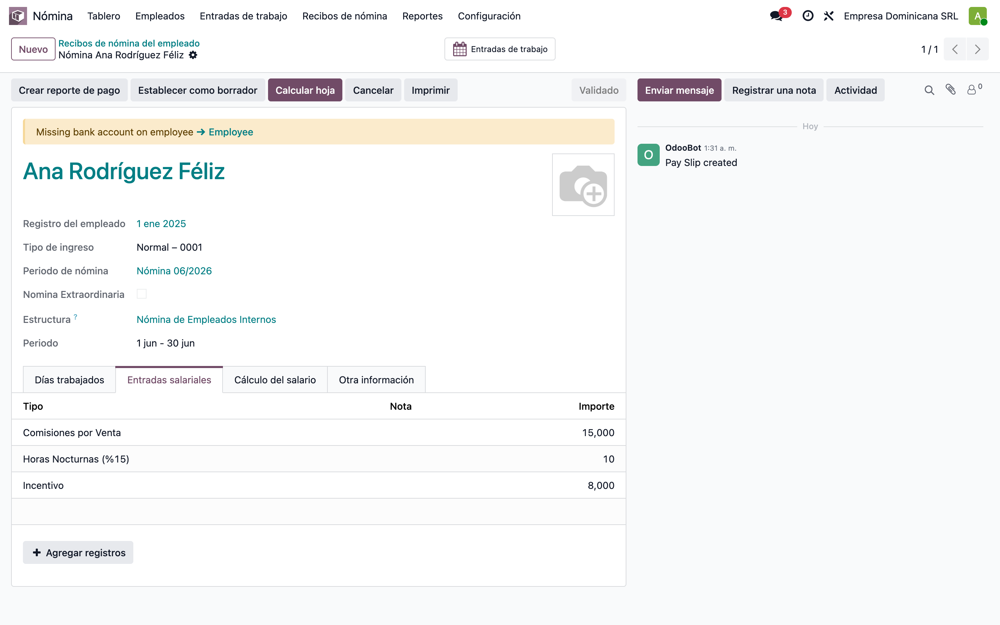
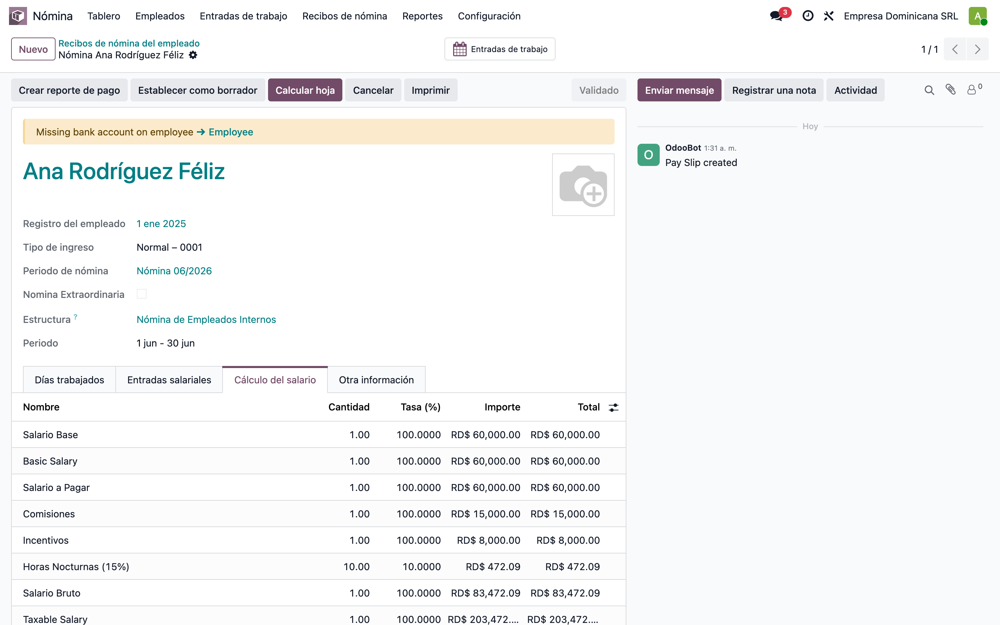
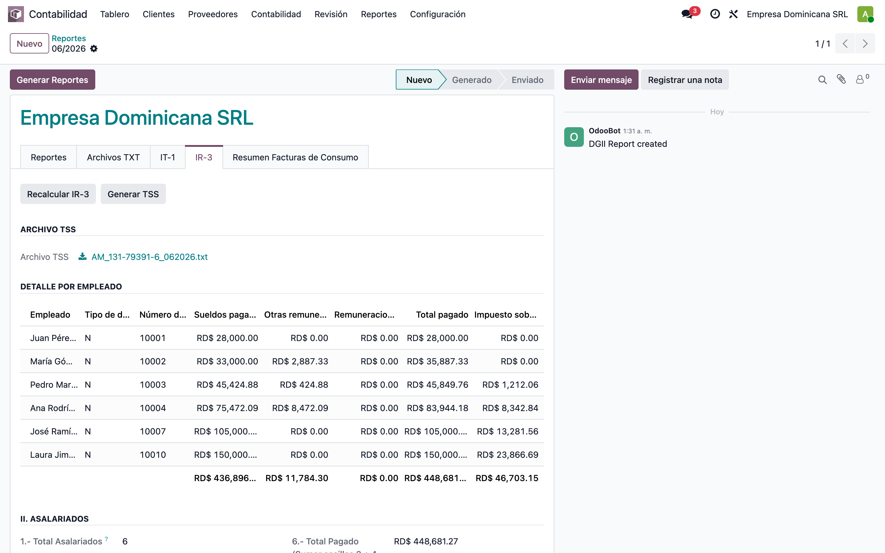
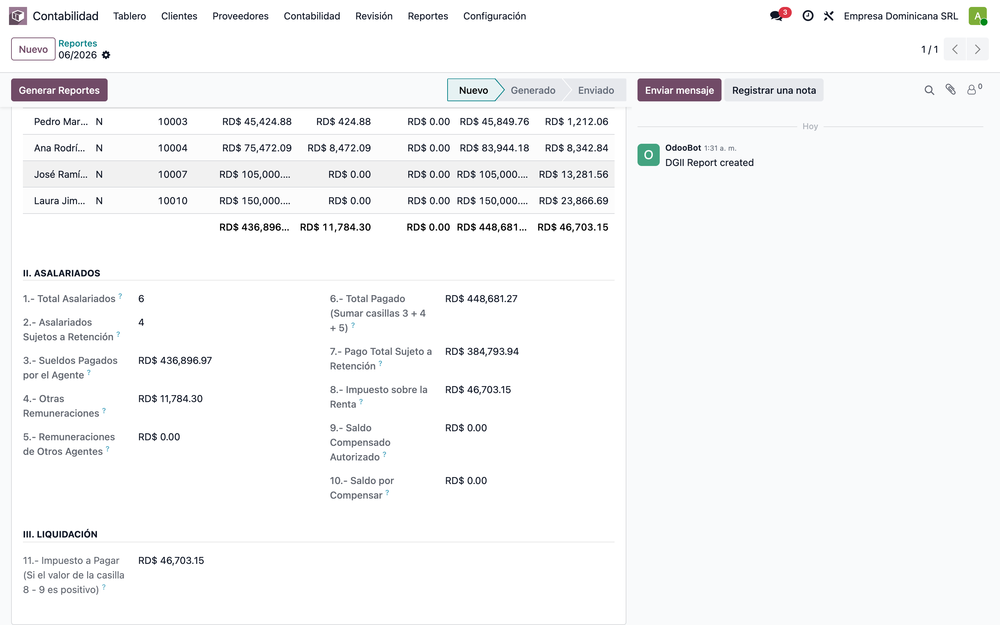
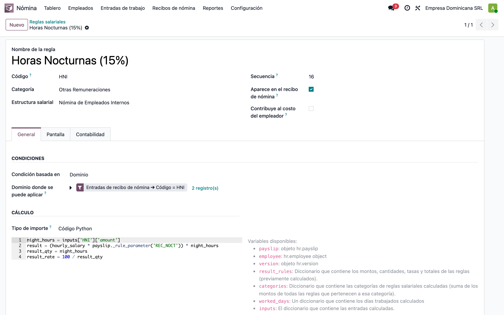
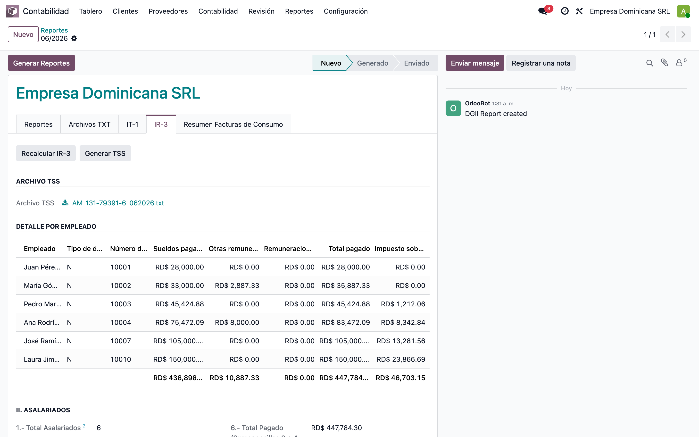

# IR-3 — Validación de "Sueldos Pagados por el Agente" y "Otras Remuneraciones"

> 🧾 Manual de **validación funcional** de las casillas **3** y **4** del IR-3
> (módulos `dgii_ir3_report` + `l10n_do_hr_report_base`, rama `19.0-feat-008-lf`).
> Responde al reporte de contabilidad: *"Sueldos pagados por el agente y Otras
> remuneraciones no cuadran con mi validación; el ISR sí cuadra"*.
>
> Todo lo que se muestra aquí fue reproducido en una **base de datos limpia**
> (`test_v19_dgii_ir3_descuadre`) con capturas reales del entorno.

**Fecha:** 2026-07-02 · **Período de prueba:** 06/2026
**Manual funcional general del IR-3:** [`../dgii_ir3_report/README.md`](../dgii_ir3_report/README.md)

---

## 1. Veredicto (resumen ejecutivo)

| Casilla | ¿Cuadra? | Explicación |
|---|---|---|
| **3.- Sueldos Pagados por el Agente** | ✅ **Correcta por diseño** | NO es "solo sueldos base". Es el **salario gravable de ISR** = Salario a Pagar (APAGAR) **+ Comisiones (COM) + Horas Nocturnas (HNI)**. Si la contable compara contra la suma de sueldos base, siempre verá una diferencia = comisiones + nocturnas del período. Es el mismo valor `Salario_ISR` que va en el archivo TSS. |
| **4.- Otras Remuneraciones** | ❌ **Tenía un bug — corregido** | Las **Horas Nocturnas (HNI)** se sumaban **dos veces**: una en la casilla 3 y otra en la casilla 4. La casilla 4 quedaba inflada **exactamente** por el monto de HNI del período. El fix elimina el doble conteo (también en el archivo TSS, que usa el mismo cálculo). |
| **8.- Impuesto sobre la Renta** | ✅ Correcta | Se toma directo de la retención ISR de la boleta; no se toca. Por eso a la contable "el ISR sí cuadra". |

Además, durante la validación aparecieron **dos hallazgos adicionales** del entorno v19
(sección 7): la regla de **Comisiones no se calculaba en absoluto** (regresión de la
migración, corregida) y el parámetro **REC_NOCT** de las horas nocturnas no viene en
la data del módulo (hay que crearlo).

---

## 2. De dónde sale cada casilla (origen de la data)

El IR-3 se recalcula con el botón **"Recalcular IR-3"** del reporte DGII del período
(`dgii_ir3_report/models/dgii_report.py::_compute_l10n_do_ir3`). Toma las boletas
(`hr.payslip`) del mes con estado **Validado o Pagado** de la compañía del reporte,
las agrupa por empleado y por cada uno calcula:

| Casilla | Método (en `l10n_do_hr_report_base/models/tss_computation.py`) | Qué suma de la boleta |
|---|---|---|
| **3** Sueldos Pagados | `_get_period_isr_salary` | Reglas **APAGAR** (Salario a Pagar) + **COM** (Comisiones) + **HNI** (Horas Nocturnas) |
| **4** Otras Remuneraciones | `_get_period_remuneration` | Toda la **categoría "asignaciones gravables"** (`hr_payroll_taxable_alw`: Incentivos, Horas Extra, etc.) **+ Vacaciones (VAC)** |
| **5** Remun. Otros Agentes | `_get_agent_remuneration` | Campo del contrato `Remuneración en otros empleadores` (manual) |
| **8** Impuesto sobre la Renta | filtro directo | Regla **ISR** (`hr_rule_isr_employee`) |
| 6 / 7 | derivadas | 6 = 3+4+5; 7 = total pagado de los empleados con retención |

> 🔗 **El archivo TSS usa exactamente los mismos métodos** (`Salario_ISR` =
> casilla 3, `Otras_Remuneraciones` = casilla 4). Por diseño, IR-3 y TSS siempre
> cuadran entre sí — y cualquier bug en uno aparece en el otro.

**La causa raíz del doble conteo:** la regla HNI pertenece a la categoría
`hr_payroll_taxable_alw` — que en pantalla se llama justamente **"Otras
Remuneraciones"** (captura §5.3) — así que el barrido de la casilla 4 la
incluía otra vez, además de estar nombrada explícitamente en la casilla 3.

---

## 3. Escenario de prueba (reproducible)

Base limpia con `dgii_ir3_report` instalado + seed
(`tools/manual-generator/configs/dgii_ir3_descuadre.seed.py`): 6 empleados,
nómina de 06/2026 calculada y validada, con inputs controlados para poder
verificar cada casilla a mano:

| Empleado | Sueldo base | Inputs de la boleta |
|---|---:|---|
| Juan Pérez Rodríguez | 28,000 | — |
| María Gómez Santana | 33,000 | Vacaciones (VAC) |
| Pedro Martínez Cruz | 45,000 | 12 horas nocturnas (HNI) |
| Ana Rodríguez Féliz | 60,000 | Comisiones 15,000 (COMV) + 10 h nocturnas (HNI) + Incentivo 8,000 (INC) |
| José Ramírez Guzmán | 85,000 | Comisiones 20,000 (COMV) |
| Laura Jiménez Reyes | 150,000 | — |

Las 6 boletas del período, en estado **Validado** (la etiqueta "Advertencia"
solo avisa que los empleados demo no tienen cuenta bancaria):



Los inputs de la boleta de Ana (pestaña **Entradas salariales**):



Y su **Cálculo del salario** — aquí nacen las líneas que alimentan el IR-3.
Las 10 horas nocturnas se convierten en RD$ 472.09 (10 h × tarifa horaria ×
recargo 15%); las comisiones y el incentivo entran por su monto:



---

## 4. Los números del escenario (verificables a mano)

Montos por regla en las boletas validadas de 06/2026:

| Empleado | APAGAR | COM | HNI | INC | VAC | ISR retenido |
|---|---:|---:|---:|---:|---:|---:|
| Juan | 28,000.00 | — | — | — | — | 0.00 |
| María | 33,000.00 | — | — | — | 2,887.33 | 0.00 |
| Pedro | 45,000.00 | — | 424.88 | — | — | 1,212.06 |
| Ana | 60,000.00 | 15,000.00 | 472.09 | 8,000.00 | — | 8,342.84 |
| José | 85,000.00 | 20,000.00 | — | — | — | 13,281.56 |
| Laura | 150,000.00 | — | — | — | — | 23,866.69 |
| **Total** | **401,000.00** | **35,000.00** | **896.97** | **8,000.00** | **2,887.33** | **46,703.15** |

Con esto, los valores **esperados** del IR-3 son:

- **Casilla 3** = APAGAR + COM + HNI = 401,000 + 35,000 + 896.97 = **436,896.97**
- **Casilla 4 correcta** = INC + VAC = 8,000 + 2,887.33 = **10,887.33**
- **Casilla 4 con bug** = HNI + INC + VAC = **11,784.30** (sobran 896.97 = HNI)
- **Casilla 8** = **46,703.15**

> 💡 **El punto clave para la contable:** la casilla 3 (436,896.97) es
> **35,896.97 más** que la suma de sueldos base (401,000.00). Esa diferencia
> **no es un error**: son las comisiones (35,000) y las horas nocturnas (896.97),
> que son salario gravable de ISR y así también se reportan a la TSS.

---

## 5. ANTES del fix — el doble conteo, en pantalla

### 5.1 Detalle por empleado (con bug)

Pedro solo tiene HNI 424.88 además de su sueldo — y aún así aparece con
"Otras remuneraciones" 424.88: **la misma HNI que ya está dentro de sus
45,424.88 de la casilla 3**. En Ana pasa igual: 8,472.09 = 8,000 (INC) +
472.09 (HNI repetida):



### 5.2 Casillas del formulario (con bug)

Casilla 4 = **11,784.30** (inflada por los 896.97 de HNI):



### 5.3 La causa raíz, visible en la configuración

La regla **Horas Nocturnas (15%)** pertenece a la categoría **"Otras
Remuneraciones"** (`hr_payroll_taxable_alw`) — la misma categoría que barre la
casilla 4 — y a la vez está nombrada explícitamente en la casilla 3. En la
misma pantalla se ve la fórmula que usa el parámetro `REC_NOCT` (§7.2):



---

## 6. DESPUÉS del fix

**El fix** (`l10n_do_hr_report_base/models/tss_computation.py`): se creó el
helper `_l10n_do_isr_salary_rules()` como única fuente de las reglas de la
casilla 3 (APAGAR, COM, HNI), y `_get_period_remuneration` (casilla 4) ahora
**excluye esas reglas** de su barrido de categoría. Ninguna regla puede contar
en las dos casillas a la vez. Como el archivo TSS usa los mismos métodos, el
fix corrige ambos reportes.

Tras **Recalcular IR-3**: Pedro queda en 0.00, Ana en 8,000.00 (solo el
incentivo), casilla 4 = **10,887.33**. Las casillas 3 y 8 **no cambian**:




Comparación final:

| Casilla | Antes (bug) | Después (fix) | Diferencia |
|---|---:|---:|---:|
| 3.- Sueldos Pagados | 436,896.97 | 436,896.97 | 0.00 |
| 4.- Otras Remuneraciones | 11,784.30 | **10,887.33** | **−896.97 (= HNI)** |
| 6.- Total Pagado | 448,681.27 | 447,784.30 | −896.97 |
| 8.- Impuesto sobre la Renta | 46,703.15 | 46,703.15 | 0.00 |

---

## 7. Hallazgos adicionales del entorno v19

### 7.1 La regla de Comisiones (COM) no se calculaba — regresión de migración (corregida)

En la migración a v19, la condición de la regla `hr_rule_commissions` quedó
rota en `l10n_do_hr_payroll/data/hr_salary_rule.xml`: consultaba un input
inexistente (`'COM'` en vez de `'COMV'`), perdió la rama de comisiones por
asientos contables y **dejó de asignar `result`**, por lo que la condición
siempre evaluaba falso y **ninguna boleta generaba línea de Comisiones**.

- Impacto: en v19 las comisiones desaparecían de la nómina (y por lo tanto de
  la casilla 3 del IR-3 y del `Salario_ISR` del TSS). En la v17 de producción
  la regla sí funciona — al migrar, los montos habrían bajado silenciosamente.
- Fix aplicado: se restauró la lógica de v17 (inputs **COMV** + **COMC** y
  comisiones por asientos contables) asignando `result` correctamente. El test
  existente `test_hr_rule_commissions` vuelve a validar este comportamiento.

### 7.2 El parámetro REC_NOCT no viene en la data del módulo

La regla HNI calcula `tarifa horaria × REC_NOCT × horas`, pero el parámetro
`REC_NOCT` (recargo nocturno 15%, Art. 204 del Código de Trabajo) **no se crea
al instalar el módulo**: sin él, cualquier boleta con horas nocturnas falla al
calcular. En este escenario se creó con valor `0.15` (Nómina → Configuración →
Parámetros de regla). **Verificar qué valor tiene en producción** — si
producción usa `1.15` (hora completa + recargo) los montos de HNI serán
proporcionalmente mayores, pero la lógica de las casillas es la misma.

---

## 8. Cómo validar contra los números de la contable (producción)

1. **Casilla 3:** pedirle su total de "sueldos" y sumarle las **comisiones** y
   **horas nocturnas** pagadas en el período. Debe dar la casilla 3. El desglose
   exacto por regla y por empleado se obtiene con:

   ```bash
   ./diagnose_ir3_report.sh <BASE_PRODUCCION> <MM/AAAA> <COMPANY_ID>
   ```

   (script en la raíz del repo; usa `diagnose_ir3_report.sql` y muestra, por
   empleado, cuánto es APAGAR vs COM vs HNI en la casilla 3, y marca el HNI
   doble contado de la casilla 4).

2. **Casilla 4 (antes del fix):** su valor esperado + HNI del período = valor
   del reporte. Después del fix deben coincidir directo.

3. **Regla de negocio pendiente de confirmar con ella/DGII:** ¿las comisiones
   deben ir en la casilla 3 ("Sueldos") o en la 4 ("Otras remuneraciones")?
   Hoy van en la 3 porque son salario gravable (criterio TSS `Salario_ISR`).
   Si DGII exige separarlas, es un cambio de una línea en
   `_l10n_do_isr_salary_rules()` — **no se cambió** porque altera montos
   declarados.

---

## 9. Despliegue

```bash
# en la base de producción, tras desplegar la rama:
odoo -d <BASE> -u l10n_do_hr_report_base,dgii_ir3_report,l10n_do_hr_payroll --stop-after-init
```

Luego, en el reporte DGII de cada período abierto: botón **"Recalcular IR-3"**
y **"Generar TSS"** si el archivo ya se había emitido.

> ⚠️ El fix de la regla COM (§7.1) solo afecta boletas **nuevas** (las
> validadas no se recalculan). El fix del IR-3/TSS sí recalcula al presionar
> el botón, sin tocar las boletas.

---

## 10. Verificación realizada

- Escenario limpio reproduce el descuadre reportado: casilla 4 sobrada
  **exactamente** por el HNI del período (896.97), y casilla 3 = sueldos +
  comisiones + nocturnas.
- Tras el fix: doble conteo = 0.00; casillas 3 y 8 idénticas.
- Test de regresión nuevo: `test_night_hours_not_double_counted`
  (`l10n_do_hr_report_base`). Suites `l10n_do_hr_report_base` y
  `dgii_ir3_report` en verde.

## Regenerar este manual

```bash
# 1. base + módulos + seed (bug ya corregido: casilla 4 saldrá correcta)
docker exec lfernandez_v19 odoo -d test_v19_dgii_ir3_descuadre --db_host=odoo-db \
  --db_user=odoo --db_password=odoo_password --without-demo=all \
  --stop-after-init --no-http -i dgii_ir3_report
docker exec -i lfernandez_v19 odoo shell -d test_v19_dgii_ir3_descuadre \
  --db_host=odoo-db --db_user=odoo --db_password=odoo_password --no-http \
  < tools/manual-generator/configs/dgii_ir3_descuadre.seed.py

# 2. servidor efímero + capturas (ver tools/manual-generator/README.md)
cd tools/manual-generator
node capture.mjs --config=configs/dgii_ir3_descuadre.before.json \
  --base-url=http://localhost:8071 --db=test_v19_dgii_ir3_descuadre \
  --login=admin --password=admin --out=../../docs/manuals/dgii_ir3_descuadre_sueldos/img
node capture.mjs --config=configs/dgii_ir3_descuadre.after.json ...   # ídem
```
