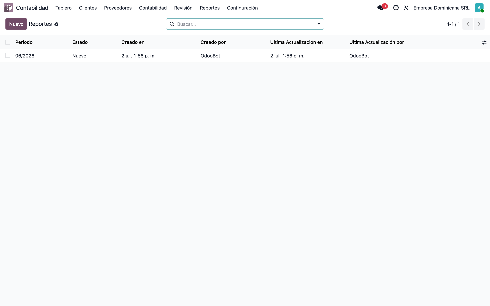
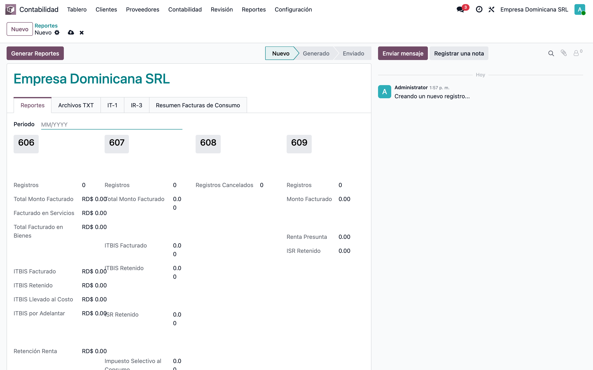
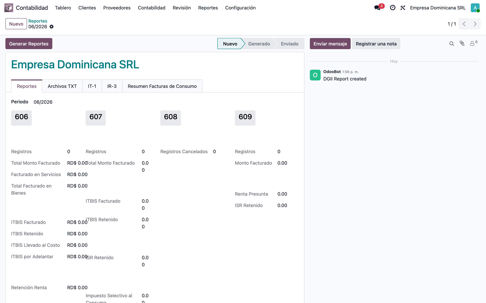
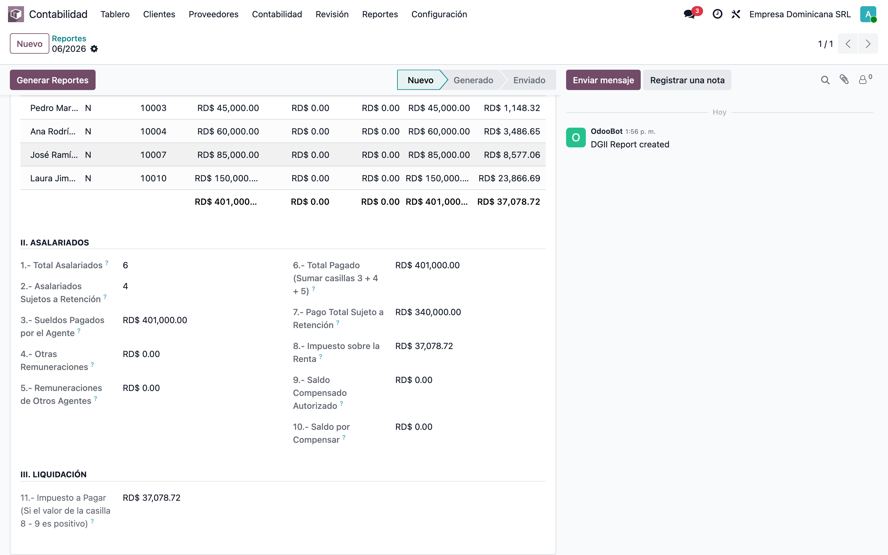
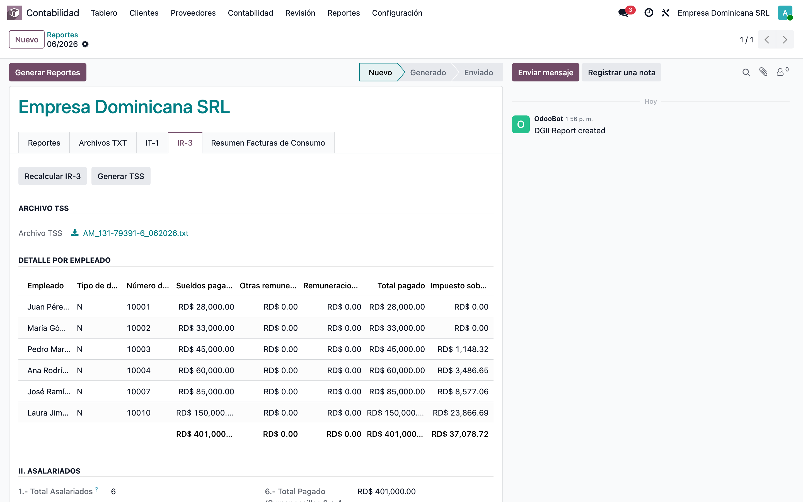

# IR-3 (DGII) — Declaración de retenciones del ISR a asalariados — Manual funcional

> Manual generado con `tools/manual-generator`. Las capturas se regeneran ejecutando el generador contra una base `test_v19_<módulo>`.

El **IR-3** es la declaración jurada mensual con la que el empleador (agente de retención) reporta a la **DGII** las retenciones del ISR aplicadas a sus asalariados. El módulo **`dgii_ir3_report`** agrega la pestaña **IR-3** dentro del reporte DGII del período (el mismo formulario donde se generan el 606/607/608/609), reproduce el formulario oficial —Sección **II. Asalariados** (casillas 1 a 10) y Sección **III. Liquidación** (casilla 11)— y lo calcula **automáticamente** desde las nóminas validadas del mes. Desde la misma pestaña también se genera el **archivo TSS** (autodeterminación), garantizando que IR-3 y TSS del período siempre cuadren porque comparten el mismo cálculo.

Este manual muestra el paso a paso completo para generar la declaración.

## Requisitos previos

- Módulo **dgii_ir3_report** instalado (instala automáticamente **dgii_reports** y **l10n_do_hr_report_base**).
- Empresa configurada como República Dominicana, con **RNC** y moneda **DOP**.
- Nóminas del período **calculadas y validadas** (estado *Validado* o *Pagado*); el IR-3 solo toma nóminas en esos estados.
- Empleados con **cédula/pasaporte** y datos TSS completos (documento, NSS).
- Usuario con permisos de **Contabilidad** (el menú DGII pertenece a los informes contables).

## 1. Acceder a los reportes DGII

Ir a **Contabilidad ▸ Informes ▸ DGII ▸ Envío de Datos ▸ Reportes**. Se abre la lista de declaraciones DGII: **una por período** (mes). El IR-3 vive dentro de esa misma declaración, por lo que no hay que crear un documento aparte: el reporte del mes sirve a la vez para el 606/607/608/609, el IR-3 y el archivo TSS.

## 2. Crear el reporte del período

Si el período aún no existe, pulsar **Nuevo**. En el campo del período escribir el mes a declarar en formato **MM/AAAA** (por ejemplo `06/2026`) y **guardar**. Al crear el reporte, el sistema calcula el IR-3 automáticamente con las nóminas validadas de ese mes; no hace falta ningún paso adicional.

## 3. Abrir la declaración del período

Desde la lista, abrir el reporte del mes a declarar. La primera pestaña (**Reportes**) muestra los formatos 606/607/608/609 de siempre; el estado del documento (Borrador → Generado → Enviado) se maneja igual que antes. El botón **Generar Reportes** del encabezado también recalcula el IR-3, de modo que al generar la declaración del período todo queda actualizado de una vez.

## 4. Ir a la pestaña IR-3

Hacer clic en la pestaña **IR-3**. Arriba están los dos botones de la declaración — **Recalcular IR-3** y **Generar TSS** — seguidos del grupo **Archivo TSS** (donde queda el TXT generado) y del **Detalle por empleado**. Todos los valores son de **solo lectura**: se calculan desde la nómina y no se digitan a mano.

## 5. Revisar el detalle por empleado

El **Detalle por empleado** lista, para cada asalariado del período: tipo y número de documento, **Sueldos pagados por el agente**, **Otras remuneraciones**, **Remuneraciones de otros agentes**, **Total pagado**, **Impuesto sobre la renta** (ISR retenido), **Saldo a compensar** y si estuvo **Sujeto a retención**. La fila de totales al pie de cada columna es exactamente lo que alimenta las casillas del formulario, así que este detalle es la herramienta de auditoría: si una casilla no cuadra, aquí se identifica al empleado responsable.

## 6. Leer las casillas del formulario oficial (Secciones II y III)

Debajo del detalle está el formulario tal como lo pide la DGII.

**Sección II. Asalariados:**

| Casilla | Contenido |
|---|---|
| **1.- Total Asalariados** | Cantidad de asalariados reportados en el período. |
| **2.- Asalariados Sujetos a Retención** | Cuántos tuvieron ISR retenido. |
| **3.- Sueldos Pagados por el Agente** | Salario sujeto a ISR pagado por la empresa. |
| **4.- Otras Remuneraciones** | Otras remuneraciones gravables del período. |
| **5.- Remuneraciones de Otros Agentes** | Pagadas al empleado por otros agentes de retención. |
| **6.- Total Pagado** | Suma de casillas 3 + 4 + 5. |
| **7.- Pago Total Sujeto a Retención** | Total pagado a los asalariados con retención. |
| **8.- Impuesto sobre la Renta** | Total del ISR retenido en el mes. |
| **9.- Saldo Compensado Autorizado** | Saldo autorizado por la DGII; se resta de la casilla 8. |
| **10.- Saldo por Compensar** | Saldo a favor pendiente de compensar. |

**Sección III. Liquidación:**

| Casilla | Contenido |
|---|---|
| **11.- Impuesto a Pagar** | Casilla 8 − casilla 9, cuando el resultado es positivo. Es el monto a pagar a la DGII. |

## 7. Recalcular el IR-3 cuando cambie la nómina

Si después de crear el reporte se valida, corrige o anula alguna nómina del mes, pulsar **Recalcular IR-3**. El sistema vuelve a leer todas las nóminas validadas/pagadas del período, reconstruye el detalle por empleado y actualiza las casillas 1 a 10 (la 11 se deriva sola de 8 − 9). Se puede recalcular tantas veces como haga falta antes de declarar.

## 8. Generar el archivo TSS del mismo período

Pulsar **Generar TSS**. El sistema construye el TXT de autodeterminación de la TSS con las mismas nóminas del período y lo deja en el campo **Archivo TSS**. Como IR-3 y TSS comparten el cálculo, los montos de ambos siempre cuadran entre sí para el mismo mes.

## 9. Descargar y presentar

Para descargar el TXT de la TSS, hacer clic sobre el nombre del archivo en el campo **Archivo TSS** y cargarlo en el portal **SUIR Plus** de la TSS. Los valores de las casillas 1 a 11 de la pestaña IR-3 se digitan en el formulario **IR-3** de la **Oficina Virtual de la DGII** tal como aparecen en pantalla. Al terminar el ciclo del período, usar **Marcar como enviado** en el encabezado del reporte para cerrar la declaración del mes.

## Notas

- El IR-3 se calcula **solo con nóminas en estado Validado o Pagado** cuya fecha final cae dentro del mes del reporte; los borradores no cuentan.
- El período del reporte debe tener el formato **MM/AAAA**; con un período inválido las casillas quedan en cero.
- La **casilla 3** incluye el salario sujeto a ISR pagado por la empresa; la **casilla 4** recoge las demás remuneraciones gravables (horas extra, comisiones, etc.).
- La **casilla 9** (Saldo Compensado Autorizado) corresponde a saldos autorizados por la DGII y se resta de la casilla 8 para obtener el impuesto a pagar (casilla 11).
- El botón **Generar Reportes** del encabezado (el que genera 606/607/608/609) también recalcula el IR-3, por lo que la pestaña siempre queda alineada con la declaración del período.
- Manual del flujo completo de nómina y reportes laborales (DGT-2/3/4, empleados, TSS): [`../l10n_do_hr_report_base/README.md`](../l10n_do_hr_report_base/README.md).
