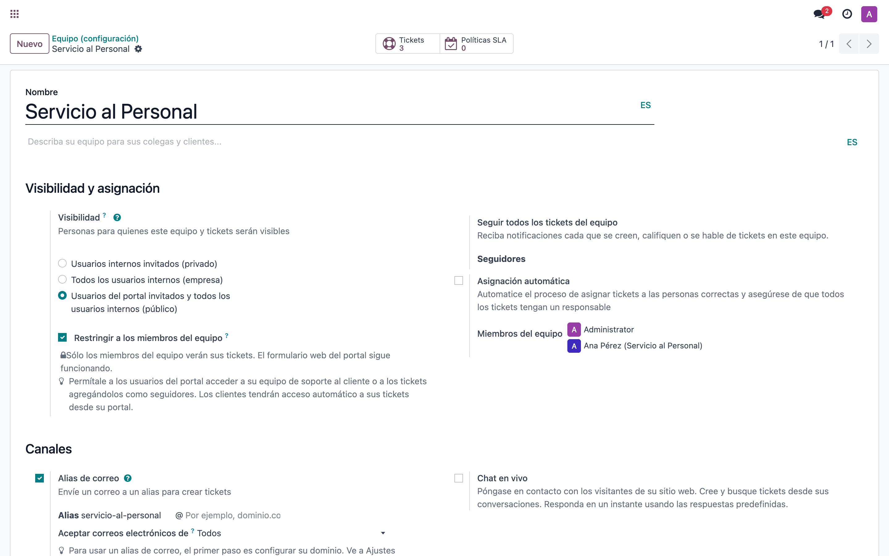
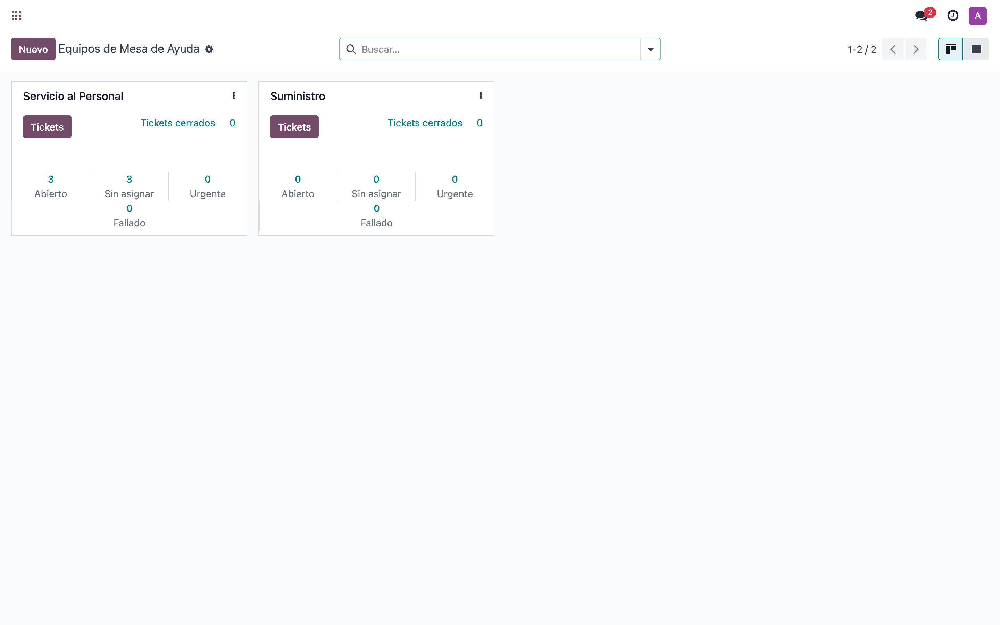
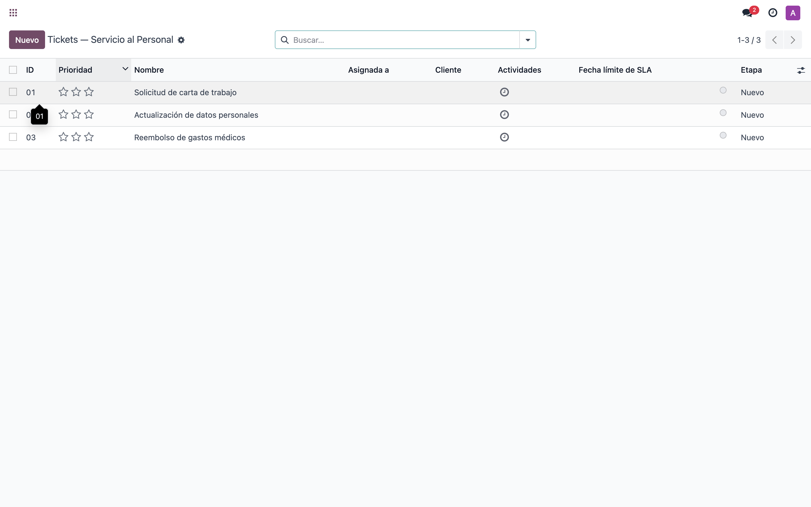

# Mesa de Ayuda — Restringir visibilidad interna por equipo — Manual de usuario

> Manual generado con `tools/manual-generator`. Las capturas se regeneran ejecutando el generador contra una base `test_v17_<módulo>`.

Este módulo agrega en cada **Mesa de Ayuda** el control **Restringir a los miembros del equipo**. Al activarlo, sólo los miembros explícitos del equipo ven sus tickets, aunque la mesa siga publicada para el formulario web del portal. Así se mantiene la recepción de tickets externos y, a la vez, se segrega la visualización interna por equipo (p. ej. *Servicio al Personal* o *Suministro*).

## Requisitos previos

- Módulo instalado: helpdesk_team_restrict_visibility (depende de helpdesk).
- Acceso con perfil Administrador de Mesa de Ayuda para configurar los equipos.
- Interfaz en español (es_DO).

## 1. Activar la restricción en el equipo

En *Mesa de Ayuda ▸ Configuración ▸ Equipos*, abre el equipo y, en la sección **Visibilidad y asignación**, deja la visibilidad en *Usuarios del portal invitados y todos los usuarios internos (público)* (necesaria para el formulario web) y activa **Restringir a los miembros del equipo**. Los usuarios listados en **Miembros del equipo** serán los únicos que verán los tickets de esta mesa.

## 2. Equipos de la Mesa de Ayuda

Vista general de los equipos. Cada equipo gestiona su restricción de forma individual, por lo que puedes tener equipos abiertos a todos los internos y otros restringidos a sus miembros.

## 3. Tickets del equipo restringido

Tickets de la mesa restringida. Sólo los miembros del equipo (y los administradores) los ven en el backend; los demás usuarios internos no los encuentran. El formulario web del portal sigue creando tickets normalmente.

## 4. Comportamiento por tipo de usuario

Con la restricción activa en un equipo:

- **Miembro del equipo**: ve los tickets de su mesa.
- **Otro usuario interno (no miembro)**: no ve los tickets de esa mesa.
- **Administrador de Mesa de Ayuda**: siempre conserva acceso a todos los tickets.
- **Usuario del portal / formulario web**: sigue creando y viendo sus propios tickets como antes (la visibilidad del equipo se mantiene en *público*).

Para cambiar quién ve los tickets, ajusta la lista **Miembros del equipo** en la configuración del equipo.

## Notas

La restricción no cambia la visibilidad del equipo (se mantiene en *público*), por lo que el formulario web del portal nunca se ve afectado. Los administradores de Mesa de Ayuda siempre ven todos los tickets por diseño.
