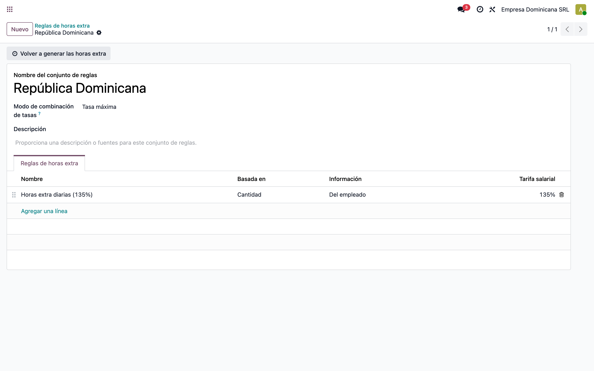
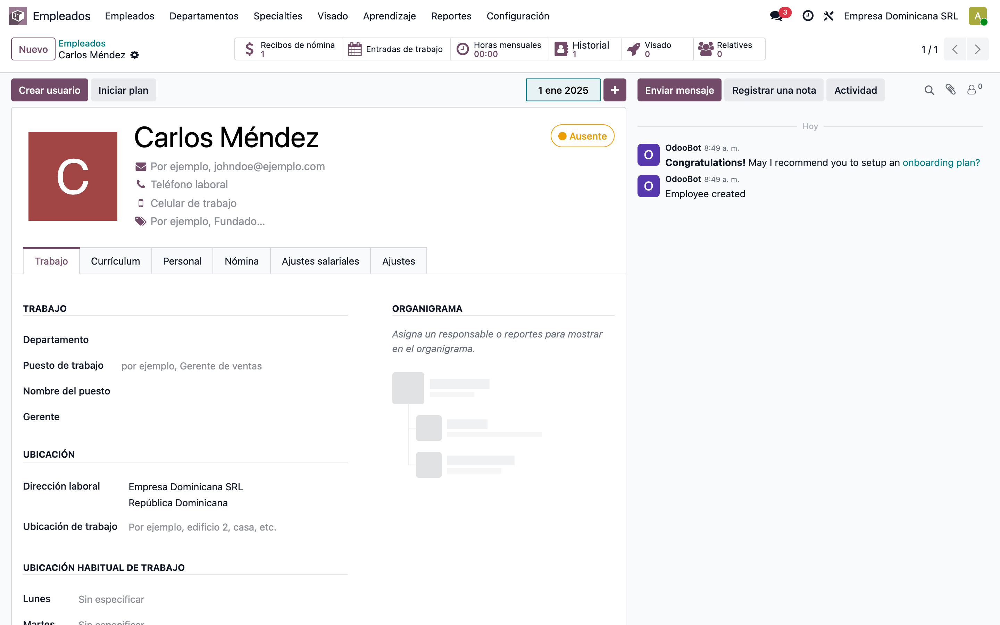
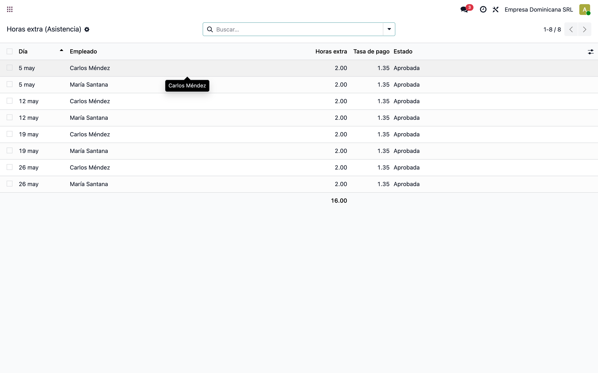
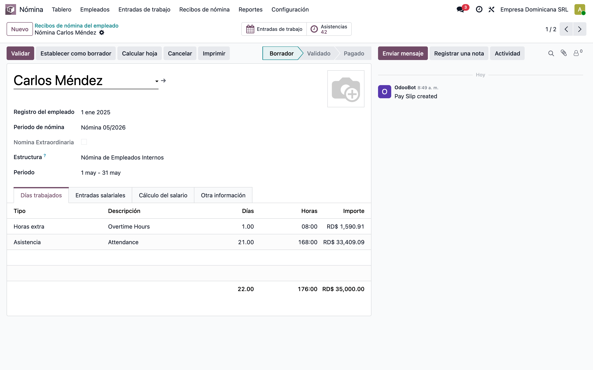

# Horas extra → nómina, 100% nativo en Odoo 19

> 📘 Manual **funcional** para **implementadores** y **ventas**.
> Explica cómo **Odoo core** cubre lo que hacían los módulos custom
> **`l10n_do_hr_news_attendance`** y **`l10n_do_hr_payroll_news_attendance`**
> (que se descartan), usando solo el motor nativo de Odoo 19 Enterprise.
> Capturas tomadas en una base de ejemplo con la interfaz en español.

---

## 1. Qué se descarta y por qué

Antes, dos módulos custom calculaban las horas extra desde la asistencia y las
metían a la nómina como "novedades":

| Módulo custom (descartado) | Qué hacía |
|---|---|
| **`l10n_do_hr_news_attendance`** | Un asistente recorría las asistencias del empleado, calculaba el exceso de horas (diurno / nocturno / feriado) y creaba una **novedad**. |
| **`l10n_do_hr_payroll_news_attendance`** | Ponía esas horas extra como **monto de entrada** de la novedad en la nómina. |

Odoo 19 **ya trae esto de fábrica**: el cálculo de horas extra y su traslado a la
nómina son nativos. ❌ Ya no hacen falta los módulos custom.

---

## 2. Qué módulos nativos intervienen

| Módulo | Rol |
|---|---|
| **`hr_attendance`** | Marcas de entrada/salida + **Reglas de horas extra (Overtime Rulesets)**: calculan el exceso sobre la jornada. |
| **`hr_work_entry_attendance`** | Convierte las horas extra aprobadas en **entradas de trabajo** (work entries) de tipo *Horas Extra*. |
| **`hr_payroll_attendance`** | Lleva esas entradas de trabajo al **recibo de nómina** (instala `hr_payroll`). |

> 💡 Basta instalar **`hr_payroll_attendance`** (arrastra `hr_payroll` y
> `hr_work_entry_attendance`) + **`hr_attendance`**. En RD se combina con
> `l10n_do_hr_payroll` para la estructura salarial local.

```
Asistencia (hr_attendance)
        │  Regla de horas extra → líneas de horas extra (aprobadas)
        ▼
hr_work_entry_attendance   → entradas de trabajo de tipo "Horas Extra"
        ▼
hr_payroll_attendance      → recibo de nómina (pestaña Días Trabajados)
```

---

## 3. Equivalencia con el proceso antiguo

| Proceso antiguo (custom) | Equivalente nativo v19 |
|---|---|
| El asistente calculaba las horas extra a mano | **Regla de horas extra** (`hr_attendance`) las calcula automáticamente |
| El asistente creaba una "novedad" | La hora extra se **aprueba** en la propia asistencia (automática o por gerente) |
| La novedad llevaba el monto a la nómina | **Entrada de trabajo de horas extra** → recibo (`hr_payroll_attendance`) |
| Tarifas/recargos fijos en código | **% de recargo por regla** (`amount_rate`) + reglas de la estructura salarial |

---

## 4. Paso a paso

### 4.1 Regla de horas extra (Overtime Ruleset)

**Asistencias → Configuración → Reglas de horas extra**. Define cómo se calculan
y pagan las horas extra. En el ejemplo, regla *República Dominicana*:



| Opción | Para qué sirve |
|---|---|
| **Basado en: Cantidad** | Cuenta como extra lo que **excede la jornada** del contrato. |
| **Horas esperadas del contrato** | Toma la jornada teórica del contrato del empleado. |
| **Pagar horas extra** | Marca la regla como pagada → genera entrada de trabajo. |
| **Tasa (`amount_rate`)** | Recargo: **1.35 = 135 %** (se pueden agregar reglas nocturno/feriado con su %). |
| **Tipo de entrada de trabajo** | *Horas Extra* — así aparecen separadas en el recibo. |

> La regla se asigna al **contrato del empleado** (campo *Regla de horas extra*).
> Con eso Odoo genera las horas extra de cada asistencia automáticamente.

### 4.2 Empleado: contrato basado en asistencia

En el contrato del empleado (pestaña **Nómina**):

- **Origen de entradas de trabajo = Asistencias** → la nómina toma las **horas reales**
  de `hr_attendance`.
- **Horario de trabajo** → la jornada teórica; el exceso sobre ese horario son las horas extra.
- **Regla de horas extra** → la regla del paso anterior.



### 4.3 Horas extra detectadas desde la asistencia

Cuando el empleado marca entrada/salida (**Asistencias**), Odoo compara las horas
reales contra su jornada y genera una **línea de horas extra** por día con
exceso. Con validación *automática* quedan **Aprobadas**; con *por gerente*,
esperan aprobación.



| Columna | Qué muestra |
|---|---|
| **Día** | Fecha de las horas extra. |
| **Empleado** | A quién pertenecen. |
| **Horas extra** | Cantidad de horas que exceden la jornada. |
| **Tasa de pago** | Recargo aplicado (1.35 = 135 %). |
| **Estado** | *Aprobado* / *Por aprobar* / *Rechazado*. |

> En el ejemplo: jornada 8:00–17:00 (8 h) vs asistencia 8:00–19:00 → **2 h extra**
> ese día. Solo las horas extra **aprobadas** pasan a la nómina.

### 4.4 Recibo de nómina: días trabajados + horas extra

**Nómina → Recibos** → abrir el recibo del período → **Calcular** (Compute Sheet).
En la pestaña **Días Trabajados** las **Horas Extra** aparecen como **línea propia**,
separadas de las horas normales (*Asistencia*).



> Las horas extra ya están en la nómina, **trazables y separadas**, sin módulos custom.

---

## 5. Nota sobre el pago del recargo (135 %)

La línea **Horas Extra** lleva las horas al recibo con su recargo (`amount_rate` 135 %).
Que ese recargo se **pague como dinero adicional** depende de la **estructura salarial**:

- Estructura **por hora**: paga las horas extra × tarifa automáticamente.
- Estructura **mensual fija** (la del ejemplo): el sueldo es fijo; las horas extra
  aparecen separadas en *Días Trabajados*, pero solo suman al neto si la estructura
  tiene una **regla salarial de recargo de horas extra** (en RD, definida en la
  estructura de `l10n_do_hr_payroll`).

→ El **cálculo y el traslado a nómina son nativos**; el porcentaje de pago se
controla con las reglas de la estructura salarial, no con un módulo custom.

---

## 6. Resumen del flujo

```
1. Regla de horas extra (Overtime Ruleset) con su % y tipo de entrada de trabajo
2. Contrato del empleado: Origen = Asistencias + Regla de horas extra + Horario
3. Asistencia registrada → horas extra calculadas y aprobadas
4. Recibo de nómina: Calcular → pestaña Días Trabajados con la línea Horas Extra
```

---

> 🛠️ Capturas regenerables con `tools/manual-generator`
> (`./generate-manual.sh --module=hr_payroll_attendance
> --extra-modules=hr_attendance,l10n_do_hr_payroll`), sobre una base
> `test_v19_hr_payroll_attendance` con datos de ejemplo en español.
