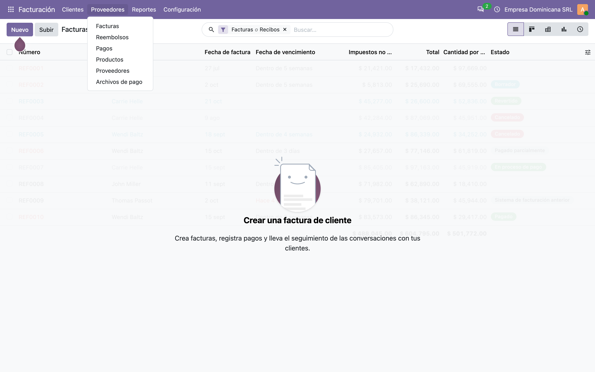
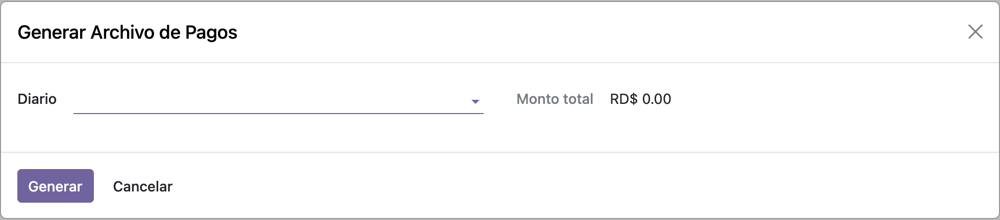
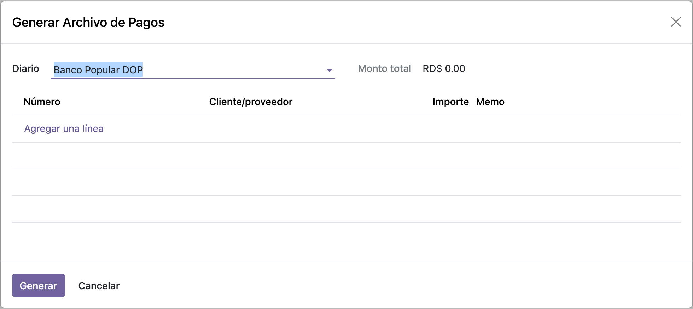
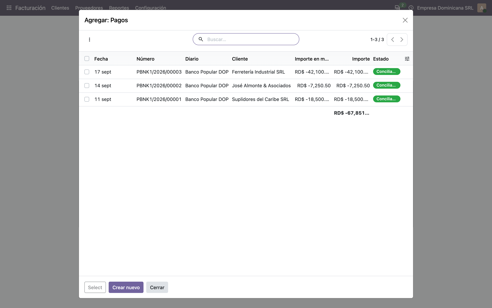
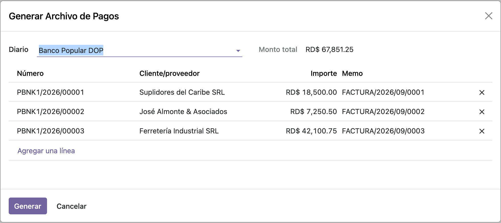
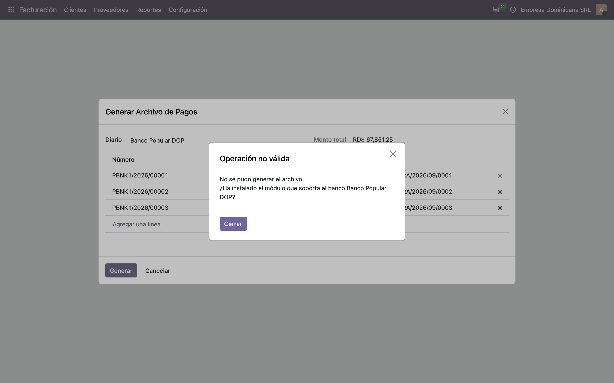
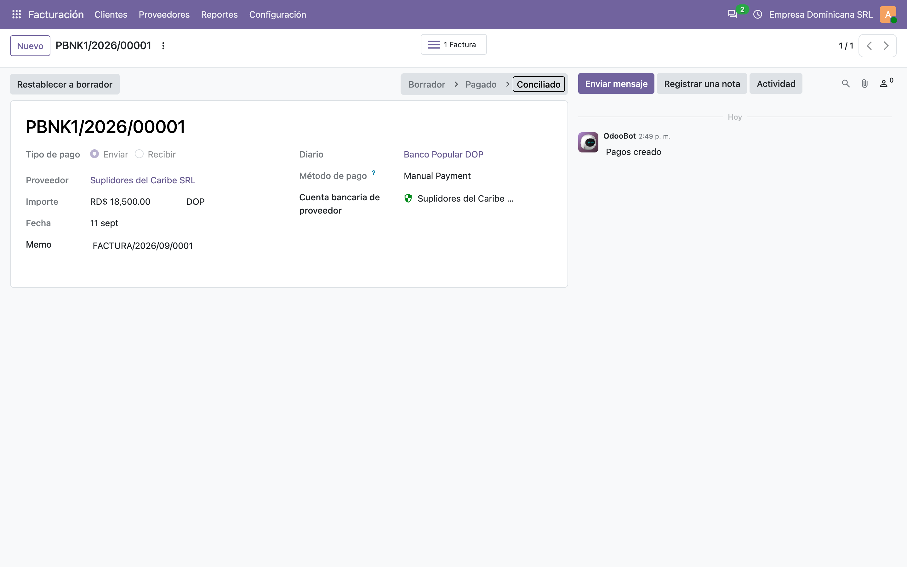
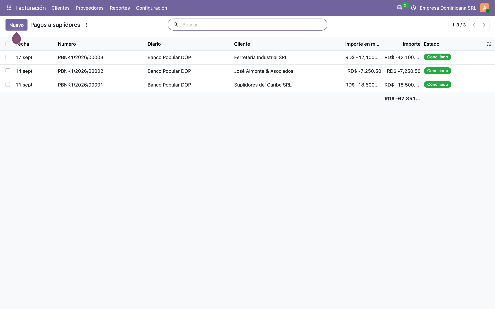
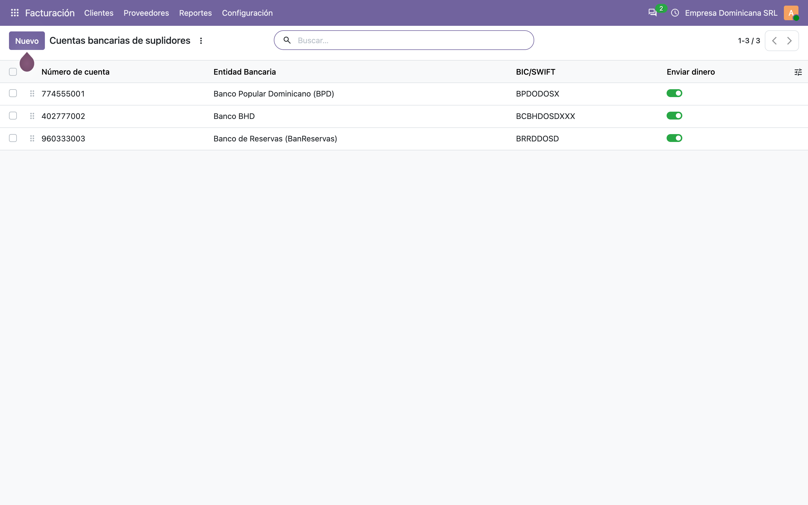
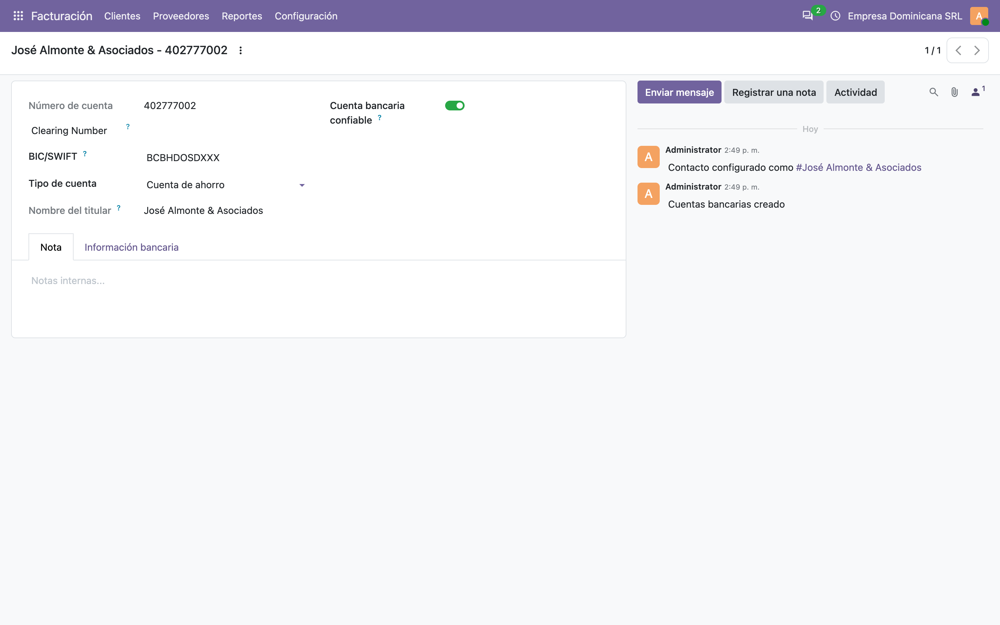

# Archivos de pago a bancos — Manual de usuario (l10n_do_account_batch_payment_base)

> Manual generado con `tools/manual-generator`. Las capturas se regeneran ejecutando el generador contra una base `test_v20_<módulo>`.

Los bancos dominicanos no aceptan que una empresa les mande sus pagos a suplidores uno por uno. Cada banco publica un **formato de archivo plano** (ancho fijo, posiciones exactas) que se sube al portal de banca empresarial y ejecuta decenas o cientos de transferencias de una sola vez. El formato de BPD no es el de BHD, y ninguno es el de BanReservas.

Este módulo es la **base común** de esos generadores. No produce ningún archivo por sí solo: aporta la pantalla, la selección de pagos y los datos que todos los formatos necesitan, para que cada módulo de banco (`l10n_do_account_batch_payment_bpd`, `_bhd`, `_bdr`) solo tenga que escribir su propio formato encima.

Qué aporta, en concreto:

- El asistente **Archivos de pago** (`l10n_do.account.batch.payment`): se elige el diario de banco, se marcan los pagos y se genera el archivo para descargar.
- Los **datos mínimos de la transacción** (`_get_transaction_data`): cuenta de origen, cuenta de destino, monto y nombre del suplidor, ya saneados.
- Los **saneadores** que exigen los bancos: nombre del beneficiario **sin tildes, sin puntuación y en mayúsculas**, y teléfono **solo dígitos**.
- Una **identificación más útil de las cuentas bancarias**: en vez de «número de cuenta – banco», se muestran como **«titular – número de cuenta»**, que es como se buscan al pagar.

Depende de `account`, `l10n_do` (catálogo de cuentas RD) y `l10n_do_banks` (catálogo de bancos dominicanos).

## Requisitos previos

- Módulo **`l10n_do_account_batch_payment_base`** instalado (v `19.5.2.0.0`, línea 20.0 / `master`). Odoo `master` se autodeclara `19.5`, de ahí el prefijo de versión.
- Dependencias: **`account`**, **`l10n_do`** (catálogo de cuentas dominicano) y **`l10n_do_banks`** (bancos RD, v `19.5.2.0.0`).
- Un **diario de tipo Banco** con su **cuenta bancaria propia** configurada: de ahí sale la cuenta de origen del archivo.
- Cada suplidor a pagar debe tener una **cuenta bancaria** registrada, y el pago debe apuntarla en **Cuenta bancaria de proveedor** (`partner_bank_id`).
- Permisos: cualquier **usuario interno** (`base.group_user`) puede abrir el asistente y generar el archivo; nadie puede borrar los registros del asistente. Marcar una cuenta como **Enviar dinero** exige además el grupo *Validar cuentas bancarias* (`account.group_validate_bank_account`).
- **Para que salga un archivo hace falta además el módulo del banco**: este módulo por sí solo levanta un error indicando que falta instalarlo.

## 1. Dónde está: Facturación → Proveedores → Archivos de pago

El módulo agrega un único menú, **Archivos de pago**, al final del menú **Proveedores** de Facturación (`sequence=900`, o sea de último). Ese menú abre directamente el asistente; no hay un listado de archivos generados que consultar después, porque el archivo se descarga en el momento.



## 2. El asistente al abrirlo: primero el diario

El asistente arranca pidiendo una sola cosa: el **Diario**. El campo está limitado a diarios de **tipo banco** (`domain=[('type','=','bank')]`) y es obligatorio.

La lista de pagos **no se muestra** hasta elegir el diario (`invisible="not journal_id"`), porque los pagos se filtran justamente por ese diario. **Monto total** aparece en cero mientras no haya pagos cargados.

Cambiar el diario **vacía la selección de pagos** (`_onchange_journal_id`): es deliberado, porque un pago del diario A no puede ir en el archivo del banco B.



## 3. Con el diario elegido: la lista donde se cargan los pagos

Elegido el diario aparece la lista de pagos del archivo — **vacía**, con su enlace **Agregar una línea**. No se precarga nada: el usuario decide qué pagos entran en este archivo y cuáles quedan para el siguiente.

Las columnas son **Número**, **Cliente/proveedor**, **Importe** y **Memo**, ordenadas por **fecha** (`default_order="date"`). Nótese que **no hay columnas vacías**: *Moneda* y *Estado* viajan en la vista para que los widgets funcionen, pero están declaradas `column_invisible="1"`, que oculta celda **y** encabezado.



## 4. Agregar una línea: qué pagos ofrece y cuáles no

**Agregar una línea** abre el diálogo **Agregar: Pagos**, y ahí es donde se ve el filtro del módulo trabajando. Solo se ofrecen los pagos que cumplen las tres condiciones:

```
[('payment_type', '=', 'outbound'),
 ('journal_id', '=', journal_id),
 ('state', 'in', ('paid', 'reconciled'))]
```

Es decir: **de salida**, **de ese diario** y **ya efectuados**. Los borradores, los cancelados y los cobros a clientes no aparecen por más que existan.

En la base de ejemplo salen los tres pagos a suplidores, los tres en estado **Conciliado**, por **RD$ 67,851.25** en total.

> Esta pantalla es la prueba directa de lo que arregló la migración a 20.0: `account.payment` eliminó el estado `in_process` y agregó `reconciled`. Con el filtro viejo este diálogo salía **vacío**, sin ningún mensaje de error.



## 5. El asistente con los pagos cargados

Con los pagos dentro, **Monto total** se recalcula solo (`_compute_total_to_pay`, que suma `payment_ids.amount`) y se muestra en la **moneda de la compañía** — pesos dominicanos en el ejemplo, **RD$ 67,851.25**.

La moneda del total es la de la compañía, no la de cada pago: es un campo `Monetary` con `currency_field="currency_id"`, y `currency_id` viene por defecto de `self.env.company.currency_id`. Mezclar pagos en monedas distintas en un mismo archivo daría un total sin sentido — los bancos dominicanos piden un archivo por moneda de todos modos.



## 6. Generar sin el módulo del banco: el error esperado

**Generar** llama a `generate_bank_file()`. En este módulo base ese método **siempre levanta un error**, a propósito:

> No se pudo generar el archivo.
> ¿Ha instalado el módulo que soporta el banco Banco Popular DOP?

Es el contrato del módulo: la base arma la pantalla y los datos, pero el que sabe escribir bytes es el módulo del banco. Cada uno (`l10n_do_account_batch_payment_bpd`, `_bhd`, `_bdr`) hereda `generate_bank_file()`, comprueba si el diario es de *su* banco y, si lo es, escribe el archivo; si no, delega en `super()` — que es este error.

El mensaje nombra el diario, para que quede claro **de qué banco** falta el módulo.



## 7. En el pago: la cuenta bancaria del destinatario

El enlace entre el pago y el archivo es el campo **Cuenta bancaria de proveedor** (`partner_bank_id`), nativo de Odoo. Es el que el módulo lee para sacar la cuenta destino de cada transacción, y se muestra con el formato que impone este módulo: **«titular – número de cuenta»**.

**Es obligatorio para el archivo**: si algún pago seleccionado no lo tiene, `_get_transaction_data()` corta el proceso completo con

> La cuenta bancaria del destinatario es necesaria para generar el fichero de pago por lotes

Se valida sobre **todos** los pagos cargados antes de escribir nada, no de uno en uno: o el lote está completo o no se genera.

Arriba se ve la barra de estados del pago en la línea 20.0: **Borrador → Pagado → Conciliado**. El estado `En proceso` que existía en 19.0 desapareció, y `Conciliado` es nuevo — por eso el filtro del asistente tuvo que cambiar.



## 8. Los pagos que entran al archivo

Los tres pagos del ejemplo se registraron desde sus facturas de proveedor, así que quedaron **publicados y conciliados** contra ellas. Ese es el estado normal de un pago que ya se ejecutó en el sistema y que ahora hay que **comunicarle al banco**.

Cada uno apunta a la cuenta bancaria de su suplidor, en tres bancos distintos (BPD, BHD y BanReservas). Un mismo archivo puede llevar pagos a varios bancos destino: el que importa para el formato es el banco **del diario**, que es quien va a ejecutar las transferencias.



## 9. Las cuentas bancarias de los suplidores

El listado de cuentas bancarias muestra los datos de la entidad que aporta `l10n_do_banks`: al elegir el **banco dominicano** se rellenan solos el nombre, el **BIC/SWIFT** y la dirección de la entidad, sin tener que teclearlos.

Esos datos no son decorativos: los formatos de BPD y BHD escriben un **código de banco** distinto según la entidad destino, y marcan la cuenta como **corriente o de ahorros**. Sin banco asignado, el módulo del banco no puede armar el renglón.

**Enviar dinero** (`allow_out_payment`) es la marca de cuenta verificada que Odoo exige para pagos de salida: se activa al confirmar por teléfono con el suplidor que el número es correcto. Es una defensa contra el fraude de facturas con la cuenta cambiada, y marcarla requiere el grupo *Validar cuentas bancarias*.



## 10. Ficha de una cuenta bancaria de suplidor

La ficha muestra lo que el archivo de pagos va a leer de la cuenta destino:

- **Número de cuenta** — de ahí sale `sanitized_account_number`, el número sin espacios ni guiones, que es lo que se escribe en el archivo.
- **Nombre del titular** — el suplidor.
- **BIC/SWIFT** y **Tipo de cuenta** — el BIC lo rellenó `l10n_do_banks` al elegir el banco dominicano; el tipo (*Cuenta de ahorro* / *Cuenta corriente*) es el campo `l10n_do_account_type`. El selector del **banco dominicano** está en la pestaña *Información bancaria*.
- **Cuenta bancaria confiable** (`allow_out_payment`) — la marca de cuenta verificada que Odoo exige para pagos de salida.

Fíjese en el **título de la ficha**: `José Almonte & Asociados - 402777002`. Ese es el `display_name` que impone este módulo; Odoo estándar mostraría `402777002 - Banco BHD`. El cambio aplica en toda la base, no solo dentro del asistente.



## 11. Los saneadores: por qué el nombre va sin tildes

Los archivos de banca empresarial son de **ancho fijo y juego de caracteres limitado**: una tilde o una `&` en el nombre del beneficiario hace que el banco rechace el lote entero, muchas veces sin decir cuál renglón falló. El módulo normaliza eso antes de escribir.

| Método | Qué hace | Ejemplo |
|---|---|---|
| `_get_sanitized_name(name)` | Quita todo lo que no sea letra, número o espacio; quita tildes; pasa a MAYÚSCULAS | `José Almonte & Asociados` → `JOSE ALMONTE  ASOCIADOS` |
| `get_recipient_name()` | El nombre saneado del beneficiario del pago | idem |
| `get_partner_sanitized_phone()` | Deja **solo dígitos** del teléfono de la empresa matriz del contacto | `(829) 777-4488` → `8297774488` |
| `get_recipient_email()` | Correo del beneficiario, o cadena vacía | `jose@almonte.do` |

Nótese el **doble espacio** en `JOSE ALMONTE  ASOCIADOS`: la `&` se elimina pero el espacio que la rodeaba se conserva. Es el comportamiento real y los formatos de ancho fijo lo toleran sin problema.

El teléfono se lee de la **empresa matriz** del contacto (`commercial_partner_id`), no del contacto individual, que es donde normalmente está el dato bueno.

## 12. Qué le pasa la base a cada módulo de banco

`_get_transaction_data()` devuelve una lista de diccionarios, uno por pago, con el mínimo común denominador de todos los formatos:

| Clave | De dónde sale |
|---|---|
| `payment_id` | El ID del pago |
| `origin_acc` | `journal_id.bank_account_id.sanitized_account_number` — la cuenta de la empresa |
| `destination_acc` | `partner_bank_id.sanitized_account_number` — la cuenta del suplidor |
| `amount` | El importe con **dos decimales fijos** (`f"{amount:.2f}"`) |
| `supplier_name` | El nombre del suplidor, **sin sanear** — cada banco decide cómo lo recorta |

Cada módulo de banco llama a `super()._get_transaction_data()` y le **agrega sus propias claves**: BHD añade el código de banco del destino y el teléfono; BPD añade el tipo de cuenta, el código y el dígito verificador del banco destino, y el correo recortado a 40 caracteres; BanReservas añade el memo saneado.

El orden de la lista es el orden del recordset, que en el asistente viene ordenado por **fecha**.

## 13. Permisos

| Grupo | Puede |
|---|---|
| **Usuario interno** (`base.group_user`) | Leer, crear y modificar los registros del asistente (`operation = cru`) |
| — | **Nadie** puede borrarlos: no se otorga la operación `d` |

El asistente es un modelo transitorio (`models.TransientModel`), así que Odoo limpia sus registros solo; por eso no hace falta permiso de borrado.

No hay reglas de registro propias: quien puede ver un pago puede incluirlo en un archivo. El control real está en los permisos de **Contabilidad** sobre los pagos y los diarios.

## 14. Qué cambió al pasar a la línea 20.0

Este módulo se portó desde 19.0. Lo que rompió `master` y cómo quedó:

| Qué cambió en el core | Efecto | Cómo quedó |
|---|---|---|
| `res.partner.bank` renombró sus campos: `acc_number` → `account_number`, `sanitized_acc_number` → `sanitized_account_number` | El módulo leía campos que ya no existen | Renombrados en el modelo y en `_get_transaction_data()` |
| **`res.bank` desapareció** | Los datos del banco viven ahora en la propia cuenta | `l10n_do_banks` los aporta vía `l10n_do_bank` |
| `account.payment.state` perdió `in_process` y ganó `reconciled` | **La lista de pagos del asistente salía vacía**, sin ningún error | El filtro pasó a `('paid', 'reconciled')` |
| `ir.model.access` + `ir.rule` se fusionaron en `ir.access` | La seguridad no cargaba | `security/ir.access.csv` + script de migración |

El tercero es el importante para el usuario: con el filtro viejo el asistente **abría bien, dejaba elegir el diario y mostraba la lista en blanco**, como si no hubiera pagos que mandar al banco. No había mensaje de error que lo delatara.

Además se corrigieron dos defectos de presentación que venían de antes: la lista de pagos mostraba **dos columnas vacías** (*Moneda* y *Estado* usaban `invisible="1"`, que oculta las celdas pero no el encabezado — ahora usan `column_invisible="1"`), y la traducción al español del error de *Generar* venía con comillas tipográficas y un `\n` literal de un mal pegado.

## Notas

### Modelos y métodos que agrega el módulo

**Modelo transitorio `l10n_do.account.batch.payment`** (Pago por Lotes Dominicano):

| Campo | Nota |
|---|---|
| `journal_id` | Diario de banco, obligatorio, `domain=[('type','=','bank')]` |
| `payment_ids` | Pagos seleccionados (Many2many a `account.payment`) |
| `currency_id` | Moneda de la compañía por defecto |
| `total_to_pay` | Calculado: suma de los importes de `payment_ids` |
| `file` / `filename` | El archivo generado, para descargar |
| `email` | Disponible para los módulos de banco que lo necesiten (oculto en la vista base) |

| Método | Rol |
|---|---|
| `generate_bank_file()` | **Punto de extensión.** En la base siempre levanta error; cada módulo de banco lo hereda |
| `_get_wizard_action()` | Reabre el asistente sobre el mismo registro, ya con el archivo cargado |
| `_get_total_to_pay()` | Aislado a propósito para poder alterarlo desde un módulo de banco |

**Métodos agregados a `account.payment`:**

| Método | Rol |
|---|---|
| `_get_transaction_data()` | Datos mínimos de cada transacción; valida que todos los pagos tengan cuenta destino |
| `_get_sanitized_name(name)` | Sin tildes, sin puntuación, en mayúsculas |
| `get_recipient_name()` | Nombre saneado del beneficiario |
| `get_recipient_email()` | Correo del beneficiario |
| `get_partner_sanitized_phone()` | Teléfono con solo dígitos |

**Cambios a `res.partner.bank`:** `display_name` pasa a ser «titular – número de cuenta», y la búsqueda por nombre cubre número de cuenta y titular.

### Cosas a tener en cuenta (comportamiento real del código)

1. **Este módulo solo no genera nada.** Es el contrato de diseño, no un defecto: hay que instalar además `l10n_do_account_batch_payment_bpd`, `_bhd` o `_bdr` según el banco. **Ninguno de los tres está portado todavía a la línea 20.0** — siguen en `installable: False` porque leen `partner_bank_id.bank_id`, que desapareció con `res.bank`.
2. **La lista solo muestra pagos ya efectuados.** Un pago en borrador no aparece, por más que esté dirigido al diario correcto. El flujo previsto es: registrar y publicar los pagos, y recién entonces generar el archivo para el banco.
3. **Un solo pago sin cuenta destino bota el lote completo.** La validación se hace sobre todo el recordset antes de armar nada, así que conviene revisar las cuentas bancarias de los suplidores antes de generar.
4. **`display_name` de las cuentas bancarias cambia en toda la base**, no solo dentro de este asistente. Es un cambio deseado — se buscan por titular — pero afecta también a Contabilidad y a la ficha del contacto.
5. **La cuenta de origen sale del diario, no de la compañía.** Si el diario de banco no tiene cuenta bancaria configurada, `origin_acc` sale vacío y el banco rechaza el archivo. Los módulos de banco que validan esto (BPD, BDR) levantan su propio error antes.
6. **El nombre saneado puede quedar con espacios dobles**, porque solo se eliminan los caracteres no alfanuméricos, no los espacios que dejan atrás. Los formatos de ancho fijo lo toleran.
7. **El teléfono se lee de la empresa matriz del contacto.** Si el pago va a un contacto hijo sin teléfono propio, se toma el de la empresa; si ninguno lo tiene, se devuelve cadena vacía en vez de fallar.
8. **La traducción es_DO no cubre los campos nuevos del core.** En las capturas se ven en español los textos propios del módulo; los rótulos que vienen de `account` o de `l10n_do_banks` dependen de la traducción de esos módulos.

### Reproducir este manual

```bash
cd tools/manual-generator
./generate-manual.sh --module=l10n_do_account_batch_payment_base \
  --addons-path=/mnt/extra-addons,/mnt/extra-addons-pro,/mnt/extra-addons-pro/store-addons
```

El `--addons-path` saca `enterprise` de la ruta: el checkout de enterprise está adelantado respecto al core de la imagen de desarrollo y `ai_auto_install` muere con `ImportError: cannot import name '_check_jwt'`. Este módulo no necesita enterprise.

El seed (`configs/l10n_do_account_batch_payment_base.seed.py`) arma, sobre una base limpia: compañía RD en español con catálogo de cuentas dominicano, diario **Banco Popular DOP** con su cuenta bancaria propia, tres suplidores con cuenta en BPD, BHD y BanReservas, sus tres facturas de proveedor publicadas y pagadas — que son los tres pagos que lista el asistente — y un cuarto suplidor sin cuenta bancaria.

`--keep-db` conserva la base `test_v20_l10n_do_account_batch_payment_base` para seguir explorando; `--headed` muestra el navegador durante las capturas.
