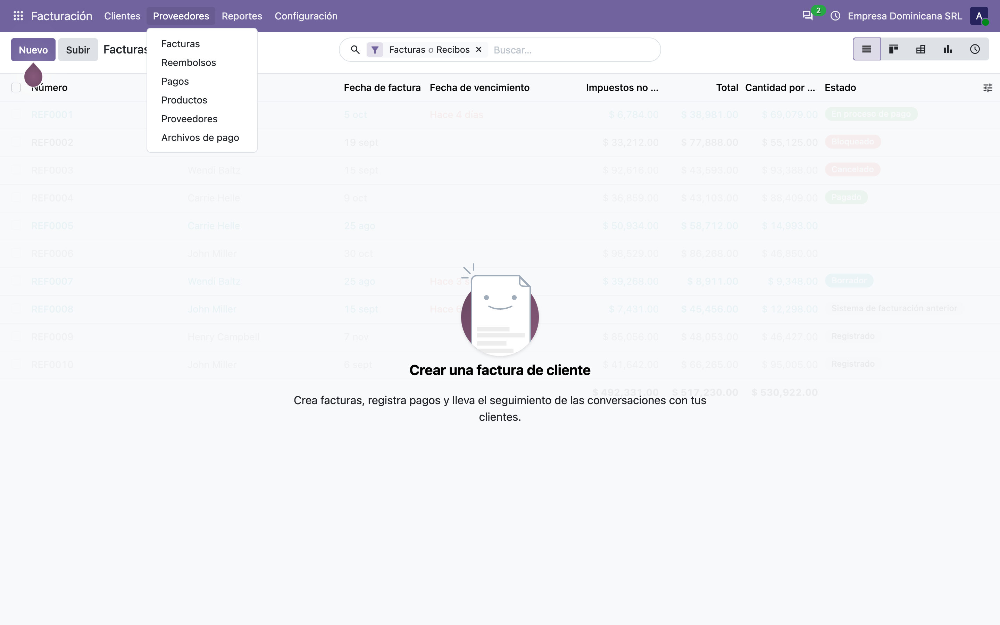
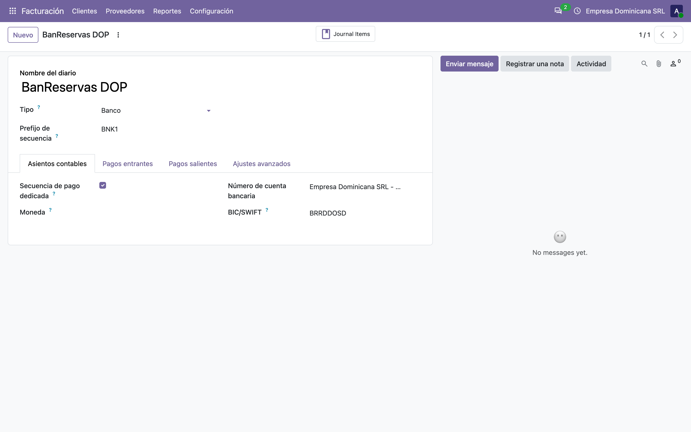
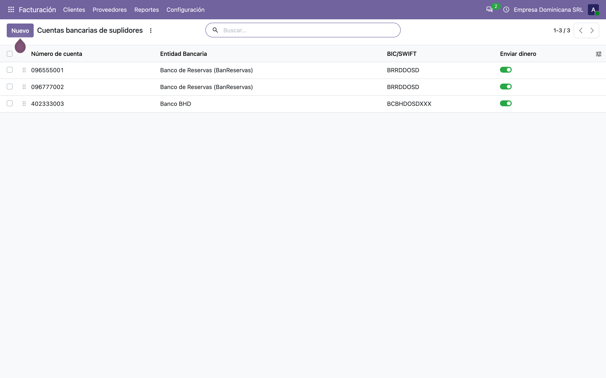
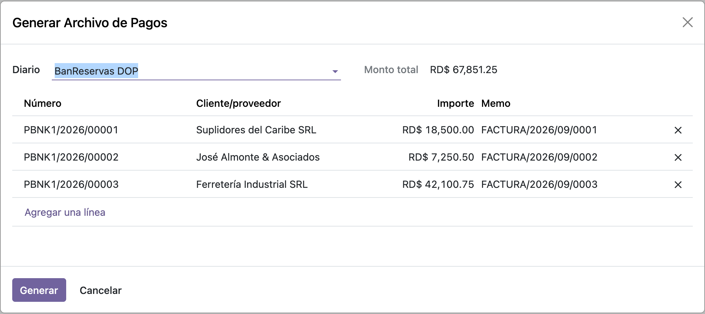
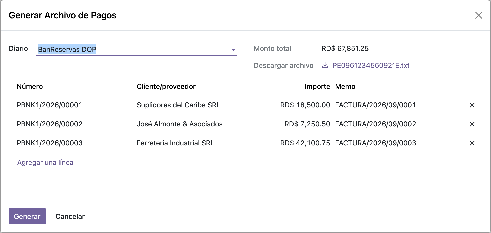

# Archivo de pagos BanReservas — Manual de usuario (l10n_do_account_batch_payment_bdr)

> Manual generado con `tools/manual-generator`. Las capturas se regeneran ejecutando el generador contra una base `test_v20_<módulo>`.

`l10n_do_account_batch_payment_base` arma la pantalla, elige los pagos y prepara los datos, pero **no escribe ningún archivo**: eso lo pone el módulo de cada banco. Este es el de **Banco de Reservas (BanReservas)**.

Lo que aporta es corto y concreto:

- **Reconoce el diario.** Si la cuenta bancaria del diario es de BanReservas, este módulo se hace cargo; si no, deja pasar al siguiente.
- **Agrega los datos que Reservas exige**: tipo de cuenta de origen y destino (**CC** corriente / **CA** ahorros), moneda de ambas cuentas, y el número de pago saneado como referencia.
- **Escribe el archivo**: un CSV de ocho columnas separadas por coma, una línea por transferencia, con el nombre que el portal de Reservas espera.

Depende solo de `l10n_do_account_batch_payment_base`.

## Requisitos previos

- Módulo **`l10n_do_account_batch_payment_bdr`** instalado (v `19.5.1.0.2`, línea 20.0 / `master`). Odoo `master` se autodeclara `19.5`, de ahí el prefijo de versión.
- Dependencia: **`l10n_do_account_batch_payment_base`** (v `19.5.2.0.0`), que a su vez trae `l10n_do_banks`.
- Un **diario de tipo Banco** cuya **cuenta bancaria propia** tenga *Banco dominicano* = **Banco de Reservas** y su **tipo de cuenta** (corriente o ahorros): de ahí salen la cuenta de origen y su tipo.
- Cada suplidor a pagar debe tener **cuenta bancaria** con su tipo de cuenta, y el pago debe apuntarla en **Cuenta bancaria de proveedor**.
- El diario **debe** tener número de cuenta: sin él el módulo corta con *«Reservas bank batch payment file needs an origin account number»*.

## 1. Dónde está: Proveedores → Archivos de pago

El menú lo pone el módulo base; este módulo no agrega pantallas propias, solo se engancha por detrás. Es deliberado: el usuario usa siempre el mismo asistente, y el banco correcto se resuelve solo a partir del diario.

> Si además se instala `l10n_do_account_batch_payment_ee`, este menú se desactiva y todo pasa por **Pagos por lotes** de Odoo Enterprise. El generador de Reservas es el mismo en ambos caminos.



## 2. Lo que decide todo: la cuenta bancaria del diario

El módulo no mira el pago para saber qué formato escribir: mira el **diario**. Concretamente `journal_id.bank_account_id.l10n_do_bank`, y si vale `brd` se hace cargo.

De esa misma cuenta salen dos datos que van en cada línea del archivo:

- el **número de cuenta**, que es la cuenta de origen de todas las transferencias y además da el nombre del archivo;
- el **tipo de cuenta** (corriente / ahorros), que se escribe como **CC** o **CA**.

> Antes de la línea 20.0 esto se leía de `journal_id.bank_id`, un enlace al modelo `res.bank`. Ese modelo desapareció y el banco vive ahora en la propia cuenta bancaria.



## 3. Las cuentas de los suplidores: corriente o ahorros

Cada cuenta de destino necesita su **tipo de cuenta**. Reservas lo exige en la línea, y el mapeo es directo:

| Tipo de cuenta en Odoo | En el archivo |
|---|---|
| Cuenta corriente (`cheque`) | **CC** |
| Cuenta de ahorro (`savings`) | **CA** |

En el ejemplo hay una de cada, más una tercera en **Banco BHD**: el banco del destino no importa para elegir el formato — manda el del diario, que es quien ejecuta las transferencias. Reservas envía a otros bancos igual.

> El campo se llama `l10n_do_account_type` desde el port. Se renombró porque el core de la línea 20.0 se quedó con el nombre `account_type` para su propio campo (normal / IBAN / CLABE).



## 4. El asistente con los pagos cargados

Es el asistente del módulo base, sin cambios: se elige el diario, se agregan los pagos y **Monto total** suma lo seleccionado. En el ejemplo, tres pagos por **RD$ 67,851.25**.

Lo único que cambia por tener instalado este módulo es qué pasa al pulsar **Generar**.



## 5. Generar: el archivo queda listo para descargar

**Generar** llama a `generate_bank_file()`. Este módulo comprueba si el diario es de Reservas; como lo es, arma el archivo, lo escribe en el campo **Descargar archivo** y **vuelve a abrir el mismo asistente** — por eso la pantalla se ve igual, pero ahora con el archivo colgado.

El nombre no se elige: se arma como `PE` + número de cuenta del diario + mes y día + `E.txt`. En la captura, `PE096123456` + `0921` + `E.txt`.

Desde ahí se descarga y se sube al portal de banca empresarial de Reservas.



## 6. Qué lleva el archivo

Un CSV sin encabezado, separado por comas, una línea por transferencia y ocho columnas en este orden:

| # | Columna | De dónde sale |
|---|---|---|
| 1 | Tipo de cuenta de origen | Tipo de cuenta de la cuenta del diario (**CC** / **CA**) |
| 2 | Moneda de origen | Moneda del diario, o **DOP** si no tiene |
| 3 | Cuenta de origen | Número de cuenta del diario, sin espacios ni guiones |
| 4 | Tipo de cuenta de destino | Tipo de cuenta del suplidor (**CC** / **CA**) |
| 5 | Moneda de destino | Moneda del pago |
| 6 | Cuenta de destino | Número de cuenta del suplidor |
| 7 | Monto | Con dos decimales |
| 8 | Referencia | Número del pago, **saneado**: sin tildes, sin puntuación y en mayúsculas |

El archivo del ejemplo:

```
CC,DOP,096123456,CC,DOP,096555001,18500.00,PBNK1202600001
CC,DOP,096123456,CA,DOP,096777002,7250.50,PBNK1202600002
CC,DOP,096123456,CC,DOP,402333003,42100.75,PBNK1202600003
```

Fíjese en la tercera línea: el destino es una cuenta de **BHD**, y sale en el mismo archivo de Reservas sin distinción.

El saneado de la referencia lo hace el módulo base (`_get_sanitized_name`): `PBNK1/2026/00001` pierde las barras y queda `PBNK1202600001`. Es lo que evita que el banco rechace el lote entero por un carácter que su parser no acepta.

## 7. Cuándo corta, y por qué

| Situación | Qué pasa |
|---|---|
| El diario **no** es de BanReservas | El módulo delega en `super()`: lo atiende el módulo del banco que corresponda, o sale el error del base pidiendo que se instale |
| El diario es de Reservas pero **su cuenta no tiene número** | `UserError`: *«Reservas bank batch payment file needs an origin account number»*. Se valida sobre todo el lote antes de escribir nada |
| Algún pago **no tiene cuenta bancaria de destino** | `UserError` del módulo base: *«La cuenta bancaria del destinatario es necesaria...»* |
| Una cuenta (origen o destino) **no tiene tipo de cuenta** | `KeyError` al mapear a CC/CA. Es el punto flojo del módulo: conviene revisar que todas las cuentas tengan su tipo antes de generar |

Los tres primeros están cubiertos por pruebas automáticas; el cuarto es un comportamiento conocido que este port **no** cambió, para no alterar el archivo que ya se le entrega al banco.

## 8. Qué cambió al pasar a la línea 20.0

| Qué cambió en el core | Efecto | Cómo quedó |
|---|---|---|
| **`res.bank` desapareció** y `account.journal` perdió `bank_id` | `is_bdr_bank()` reventaba: leía el banco por un enlace que ya no existe | Lee `journal_id.bank_account_id.l10n_do_bank`, donde `l10n_do_banks` dejó el banco |
| `account.journal` perdió **`bank_acc_number`** | El nombre del archivo y la validación de cuenta de origen fallaban | Ambos leen `journal_id.bank_account_id.account_number` |
| `res.partner.bank.account_type` pasó a ser el campo del core (normal / IBAN); el de cheque/ahorros se renombró a **`l10n_do_account_type`** | El mapeo a CC/CA leía el campo equivocado | Lee `l10n_do_account_type` |
| **Los campos `Binary` ya no aceptan `bytes` en crudo** | Escribir el archivo fallaba con `TypeError: use BinaryValue instead of bytes` | Se escribe con `BinaryBytes(contenido)`, y de paso el archivo se arma en memoria en vez de pasar por `/tmp` |
| `res.partner.bank` perdió `currency_id` y `acc_number` se llama `account_number` | Los datos de demostración no cargaban | Actualizados |

El cuarto es el más silencioso de todos: no es un error de nombre que salte al leer el código, sino un `TypeError` que solo aparece al momento de escribir el archivo — o sea, al final del flujo, con el usuario esperando.

## Notas

### Qué agrega el módulo, en código

**`account.journal`:**

| Método | Rol |
|---|---|
| `is_bdr_bank()` | `True` si la cuenta bancaria del diario es de BanReservas (`l10n_do_bank == 'brd'`) |
| `_is_brd_bank()` / `_is_BRRDDOSD_bank()` | Los nombres que busca `l10n_do_account_batch_payment_ee` — por código de banco y por BIC |

**`account.payment`:**

| Método | Rol |
|---|---|
| `_get_transaction_data()` | Extiende el del base con `origin_acc_type`, `destination_acc_type`, las dos monedas, `memo`, `email` y `description` |
| `_get_bdr_filename()` | `PE` + cuenta del diario + `MMDD` + `E.txt` |
| `_get_bdr_file()` | Arma el CSV y lo devuelve como `{'file': BinaryBytes(...), 'filename': ...}` |
| `_get_brd_file()` / `_get_BRRDDOSD_file()` | Alias para el enrutado del módulo Enterprise |

**`l10n_do.account.batch.payment`** (el asistente del base): `generate_bank_file()` escribe el archivo si el diario es de Reservas, y si no delega en `super()`.

### Cosas a tener en cuenta (comportamiento real del código)

1. **El banco lo manda el diario, no el pago.** Un mismo archivo de Reservas puede llevar transferencias a cuentas de BHD, Popular o cualquier otro banco; lo que decide el formato es quién ejecuta.
2. **Sin tipo de cuenta no hay archivo.** El mapeo a CC/CA es un diccionario directo: una cuenta sin tipo levanta `KeyError`, no un `UserError` explicativo. Es comportamiento previo al port, y se dejó igual a propósito.
3. **La moneda de origen cae en DOP si el diario no tiene moneda propia.** Es el caso normal de un diario en pesos.
4. **La referencia se sanea, la descripción no.** `memo` pasa por `_get_sanitized_name` (sin tildes, sin puntuación, mayúsculas); `description` se arma con el memo del pago tal cual. Reservas solo lee las ocho columnas del CSV, así que `description` y `email` viajan en los datos pero no llegan al archivo.
5. **El archivo ya no toca el disco.** Antes se escribía en `/tmp` y se releía para codificarlo; ahora se arma en memoria. Además de ser más limpio, evita el problema de escribir en el `/tmp` de un contenedor con varios workers.

### Reproducir este manual

```bash
cd tools/manual-generator
./generate-manual.sh --module=l10n_do_account_batch_payment_bdr \
  --addons-path=/mnt/extra-addons,/mnt/extra-addons-pro,/mnt/extra-addons-pro/store-addons
```

El `--addons-path` saca `enterprise` de la ruta: ese checkout está adelantado respecto al core de la imagen de desarrollo y `ai_auto_install` muere con `ImportError: cannot import name '_check_jwt'`. Este módulo no necesita enterprise.

El seed (`configs/l10n_do_account_batch_payment_bdr.seed.py`) arma, sobre una base limpia: compañía RD en español con catálogo de cuentas dominicano, diario **BanReservas DOP** con su cuenta corriente propia, tres suplidores (dos en Reservas — uno corriente y uno de ahorros — y uno en BHD), sus tres facturas publicadas y pagadas, un asistente cargado y **otro ya ejecutado**, con el archivo generado y descargable.

`--keep-db` conserva la base `test_v20_l10n_do_account_batch_payment_bdr`; `--headed` muestra el navegador durante las capturas.
