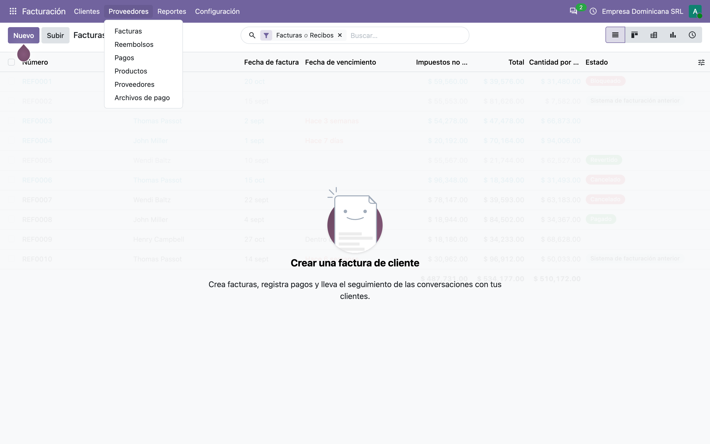
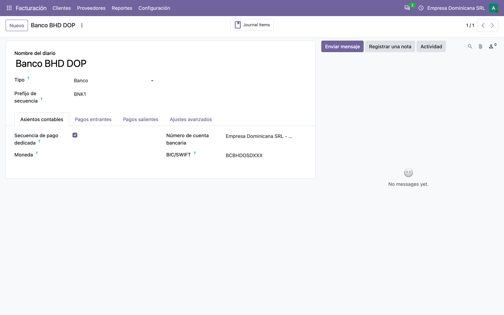
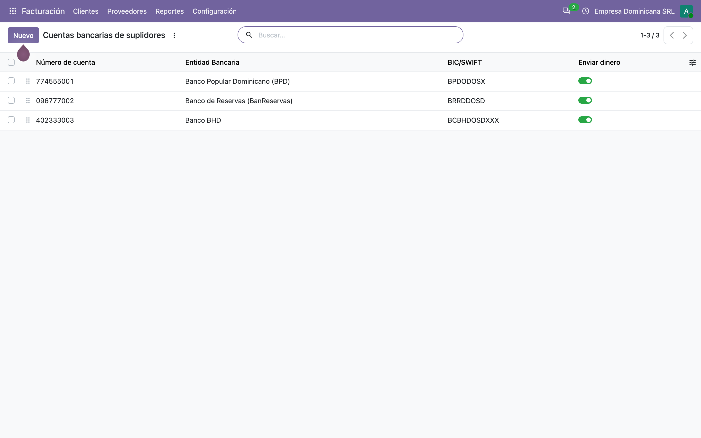
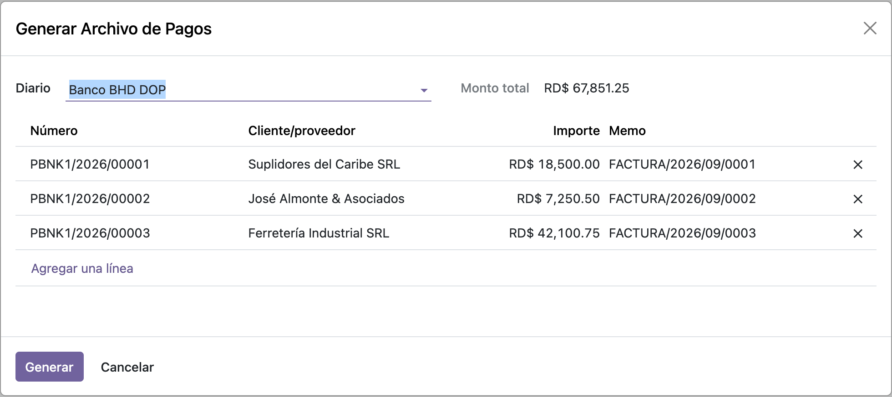
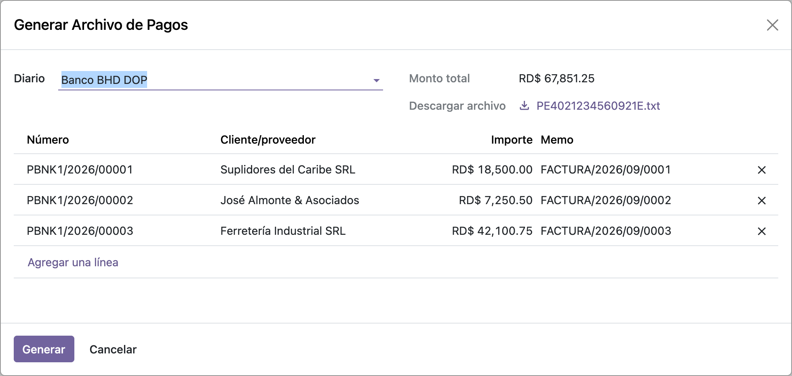

# Archivo de pagos Banco BHD — Manual de usuario (l10n_do_account_batch_payment_bhd)

> Manual generado con `tools/manual-generator`. Las capturas se regeneran ejecutando el generador contra una base `test_v20_<módulo>`.

`l10n_do_account_batch_payment_base` arma la pantalla, elige los pagos y prepara los datos, pero **no escribe ningún archivo**: eso lo pone el módulo de cada banco. Este es el de **Banco BHD**.

Lo que aporta:

- **Reconoce el diario.** Si la cuenta bancaria del diario es de BHD, este módulo se hace cargo; si no, deja pasar al siguiente.
- **Traduce el banco de destino al código que BHD usa.** BHD no acepta el nombre del banco ni su BIC: quiere su propia clave de tres letras (`BPD`, `BRD`, `BHD`, `BSC`…). El módulo trae la tabla de las 17 entidades que BHD reconoce.
- **Agrega el resto de lo que pide la línea**: tipo de cuenta (**CA** / **CC**), tipo de movimiento, referencia, descripción, correo y teléfono del beneficiario.
- **Escribe el archivo**: diez campos separados por punto y coma, una línea por transferencia.

Depende solo de `l10n_do_account_batch_payment_base`.

## Requisitos previos

- Módulo **`l10n_do_account_batch_payment_bhd`** instalado (v `19.5.1.0.3`, línea 20.0 / `master`). Odoo `master` se autodeclara `19.5`, de ahí el prefijo de versión.
- Dependencia: **`l10n_do_account_batch_payment_base`** (v `19.5.2.0.0`), que a su vez trae `l10n_do_banks`.
- Un **diario de tipo Banco** cuya **cuenta bancaria propia** tenga *Banco dominicano* = **Banco BHD**: de ahí sale el número de cuenta que nombra el archivo.
- Cada suplidor a pagar debe tener **cuenta bancaria** con su **banco dominicano** y su **tipo de cuenta**: el banco da el código de tres letras y el tipo da CA o CC.
- Los teléfonos y correos de los suplidores viajan en el archivo. Si faltan, la línea lleva un guion en su lugar.

## 1. Dónde está: Proveedores → Archivos de pago

El menú lo pone el módulo base; este módulo no agrega pantallas propias, solo se engancha por detrás. El usuario usa siempre el mismo asistente y el banco correcto se resuelve solo a partir del diario.

> Si además se instala `l10n_do_account_batch_payment_ee`, este menú se desactiva y todo pasa por **Pagos por lotes** de Odoo Enterprise. El generador de BHD es el mismo en ambos caminos.



## 2. Lo que decide todo: la cuenta bancaria del diario

El módulo no mira el pago para saber qué formato escribir: mira el **diario**. Concretamente `journal_id.bank_account_id.l10n_do_bank`, y si vale `bhd` se hace cargo.

De esa cuenta sale además el **número** que nombra el archivo: `PE` + número de cuenta + mes y día + `E.txt`.

> Antes de la línea 20.0 esto se leía de `journal_id.bank_id`, un enlace al modelo `res.bank`. Ese modelo desapareció y el banco vive ahora en la propia cuenta bancaria.



## 3. Las cuentas de los suplidores: banco y tipo

De cada cuenta de destino el archivo toma **dos** cosas:

- el **banco dominicano**, que se traduce al código de tres letras que usa BHD;
- el **tipo de cuenta**, que se escribe como **CA** o **CC**.

En el ejemplo hay una cuenta en cada banco — Popular, Reservas y BHD — para que se vean tres códigos distintos en el archivo. El banco del destino **no** decide el formato: manda el del diario, que es quien ejecuta las transferencias.



## 4. El asistente con los pagos cargados

Es el asistente del módulo base, sin cambios: se elige el diario, se agregan los pagos y **Monto total** suma lo seleccionado. En el ejemplo, tres pagos por **RD$ 67,851.25**.

Lo único que cambia por tener instalado este módulo es qué pasa al pulsar **Generar**.



## 5. Generar: el archivo queda listo para descargar

**Generar** llama a `generate_bank_file()`. Este módulo comprueba si el diario es de BHD; como lo es, arma el archivo, lo escribe en el campo **Descargar archivo** y **vuelve a abrir el mismo asistente** — por eso la pantalla se ve igual, pero ahora con el archivo colgado.

En la captura, `PE402123456` + `0921` + `E.txt`. Desde ahí se descarga y se sube al portal de banca empresarial de BHD.



## 6. Qué lleva el archivo

Sin encabezado, separado por **punto y coma**, una línea por transferencia y diez campos en este orden:

| # | Campo | De dónde sale |
|---|---|---|
| 1 | Cuenta de destino | Número de cuenta del suplidor, sin espacios ni guiones |
| 2 | Código de banco | El código BHD del banco del suplidor (`BPD`, `BRD`, `BHD`…) |
| 3 | Tipo de cuenta | **CA** o **CC** según el tipo de la cuenta del suplidor |
| 4 | Nombre del beneficiario | Nombre del suplidor |
| 5 | Tipo de movimiento | Siempre **C** (crédito) |
| 6 | Monto | Con dos decimales |
| 7 | Referencia | Número del pago |
| 8 | Descripción | Memo del pago, o su número si no tiene |
| 9 | Correo | De la empresa matriz del suplidor |
| 10 | Teléfono | De la empresa matriz, **solo dígitos** |

Un campo vacío se escribe como un guion (`-`), nunca se deja en blanco.

El archivo del ejemplo:

```
774555001;BPD;CA;Suplidores del Caribe SRL;C;18500.00;PBNK1/2026/00001;FACTURA/2026/09/0001;pagos@caribe.do;8095551234
096777002;BRD;CC;José Almonte & Asociados;C;7250.50;PBNK1/2026/00002;FACTURA/2026/09/0002;jose@almonte.do;8297774488
402333003;BHD;CA;Ferretería Industrial SRL;C;42100.75;PBNK1/2026/00003;FACTURA/2026/09/0003;ventas@ferrind.do;8093339900
```

Tres bancos distintos, tres códigos distintos, y los dos tipos de cuenta. El teléfono `(829) 777-4488` llegó como `8297774488`: eso lo hace `get_partner_sanitized_phone()` del módulo base.

## 7. La tabla de códigos de banco

BHD identifica cada entidad con una clave propia de tres letras. El módulo trae las 17 que BHD reconoce:

| Banco | Código | Banco | Código |
|---|---|---|---|
| Banco Popular | `BPD` | Banco Ademi | `BAD` |
| Banco de Reservas | `BRD` | Asoc. Cibao | `ACP` |
| Banco BHD | `BHD` | Asoc. La Nacional | `ALN` |
| Banco Santa Cruz | `BSC` | Asoc. Popular | `APA` |
| Citibank | `CIT` | Banco Caribe | `BCA` |
| Scotiabank | `SCB` | Banco Promerica | `BPA` |
| Banco BDI | `BDI` | Banco Vimenca | `VIM` |
| Banco López de Haro | `BLH` | Banesco | `BNC` |
| Bellbank | `BEL` | | |

**Un banco que no esté en la tabla escribe un guion** en esa columna, y BHD rechazará esa línea. `l10n_do_banks` conoce 29 bancos dominicanos, así que hay 12 para los que BHD no tiene código en esta tabla — entre ellos LAFISE, Empire y Atlántico. Si un suplidor tiene cuenta en uno de esos, hay que pagarle por otra vía o pedirle a BHD el código que falta y agregarlo.

> Hasta la línea 19.0 esta tabla eran 17 registros XML que escribían un campo `l10n_do_bhd_bank_code` sobre el modelo `res.bank`. Como ese modelo desapareció, la tabla vive ahora en `const.py` y se consulta por el identificador de banco que `l10n_do_banks` dejó en la cuenta. Los códigos son exactamente los mismos.

## 8. Qué cambió al pasar a la línea 20.0

| Qué cambió en el core | Efecto | Cómo quedó |
|---|---|---|
| **`res.bank` desapareció** | El módulo ni siquiera cargaba: declaraba `_inherit = "res.bank"` para agregarle el código de banco | El campo y sus 17 registros XML pasan a `const.py`, consultados por `partner_bank_id.l10n_do_bank` |
| `account.journal` perdió **`bank_id`** | `is_bhd_bank()` leía el banco por un enlace que ya no existe | Lee `journal_id.bank_account_id.l10n_do_bank` |
| `account.journal` perdió **`bank_acc_number`** | El nombre del archivo fallaba | Lee `journal_id.bank_account_id.account_number` |
| El campo cheque/ahorros se renombró a **`l10n_do_account_type`** (el core se quedó con `account_type`) | El mapeo a CA/CC leía el campo equivocado | Lee `l10n_do_account_type` |
| **Los campos `Binary` ya no aceptan `bytes` en crudo** | Escribir el archivo fallaba con `TypeError: use BinaryValue instead of bytes` | Se escribe con `BinaryBytes(contenido)`, y el archivo se arma en memoria en vez de pasar por `/tmp` |
| `res.partner.bank` perdió `currency_id` y `acc_number` se llama `account_number` | Los datos de demostración no cargaban | Actualizados |

El primero es el de fondo: el módulo guardaba un dato **del banco** (su código) en un modelo de bancos. Sin ese modelo, el dato se vuelve una constante del módulo. No se perdió nada: los 17 códigos son los mismos y siguen cubriendo las mismas entidades.

## 9. Dos cosas que conviene revisar con el banco

Ninguna de las dos la introdujo la migración; las dos venían de antes y se dejaron **tal cual** para no cambiar el archivo que ya se le entrega a BHD. Pero conviene que alguien de negocio las confirme:

**1. El mapeo CA/CC va al revés que en BanReservas.**

| Tipo de cuenta | BHD escribe | BanReservas escribe |
|---|---|---|
| Cuenta corriente (`cheque`) | **CA** | **CC** |
| Cuenta de ahorro (`savings`) | **CC** | **CA** |

Puede ser que cada banco use su propia convención — pasa —, pero también puede ser un error de hace años que nadie notó porque el banco procesa igual. Vale la pena confirmarlo con BHD.

**2. El archivo de BHD lleva tildes y símbolos.** A diferencia del de Reservas, aquí el nombre del beneficiario y la referencia van **sin sanear**: en el ejemplo se ve `José Almonte & Asociados` con tilde y con `&`, y la referencia `PBNK1/2026/00001` con barras. El módulo base tiene `_get_sanitized_name()` justamente para esto, y este módulo no lo usa. Si BHD alguna vez rechaza un lote sin decir por qué, este es el primer lugar donde mirar.

## Notas

### Qué agrega el módulo, en código

**`account.journal`:**

| Método | Rol |
|---|---|
| `is_bhd_bank()` | `True` si la cuenta bancaria del diario es de BHD (`l10n_do_bank == 'bhd'`) |
| `_is_bhd_bank()` / `_is_BCBHDOSDXXX_bank()` | Los nombres que busca `l10n_do_account_batch_payment_ee` — por código de banco y por BIC |

**`account.payment`:**

| Método | Rol |
|---|---|
| `_get_transaction_data()` | Extiende el del base con `bank_code`, `account_type`, `move_type`, `memo`, `description`, `email` y `phone` |
| `_get_bhd_filename()` | `PE` + cuenta del diario + `MMDD` + `E.txt` |
| `_get_bhd_file()` | Arma el archivo y lo devuelve como `{'file': BinaryBytes(...), 'filename': ...}` |
| `_get_BCBHDOSDXXX_file()` | Alias para el enrutado del módulo Enterprise |

**`const.py`:** `BHD_BANK_CODES`, la tabla de 17 entidades con el código de tres letras que usa BHD.

**`l10n_do.account.batch.payment`** (el asistente del base): `generate_bank_file()` escribe el archivo si el diario es de BHD, y si no delega en `super()`.

### Cosas a tener en cuenta (comportamiento real del código)

1. **El banco lo manda el diario, no el pago.** Un mismo archivo de BHD lleva transferencias a cuentas de cualquier banco; lo que decide el formato es quién ejecuta.
2. **Un banco fuera de la tabla escribe un guion.** No levanta error: la línea sale con `-` en la columna del código y BHD la rechazará. De los 29 bancos que conoce `l10n_do_banks`, 12 no tienen código aquí.
3. **Sin tipo de cuenta no hay archivo.** El mapeo a CA/CC es un diccionario directo: una cuenta sin tipo levanta `KeyError`, no un `UserError` explicativo. Comportamiento previo al port, se dejó igual.
4. **El nombre y la referencia no se sanean**, a diferencia del archivo de BanReservas. Ver el paso 9.
5. **El correo y el teléfono se leen de la empresa matriz del contacto** (`commercial_partner_id`), no del contacto individual.
6. **El archivo ya no toca el disco.** Antes se escribía en `/tmp` y se releía para codificarlo; ahora se arma en memoria, lo que además evita que dos workers del mismo contenedor se pisen el archivo.

### Reproducir este manual

```bash
cd tools/manual-generator
./generate-manual.sh --module=l10n_do_account_batch_payment_bhd \
  --addons-path=/mnt/extra-addons,/mnt/extra-addons-pro,/mnt/extra-addons-pro/store-addons
```

El `--addons-path` saca `enterprise` de la ruta: ese checkout está adelantado respecto al core de la imagen de desarrollo y `ai_auto_install` muere con `ImportError: cannot import name '_check_jwt'`. Este módulo no necesita enterprise.

El seed (`configs/l10n_do_account_batch_payment_bhd.seed.py`) arma, sobre una base limpia: compañía RD en español con catálogo de cuentas dominicano, diario **Banco BHD DOP** con su cuenta corriente propia, tres suplidores con cuenta en Popular, Reservas y BHD, sus tres facturas publicadas y pagadas, un asistente cargado y **otro ya ejecutado**, con el archivo generado y descargable.

`--keep-db` conserva la base `test_v20_l10n_do_account_batch_payment_bhd`; `--headed` muestra el navegador durante las capturas.
