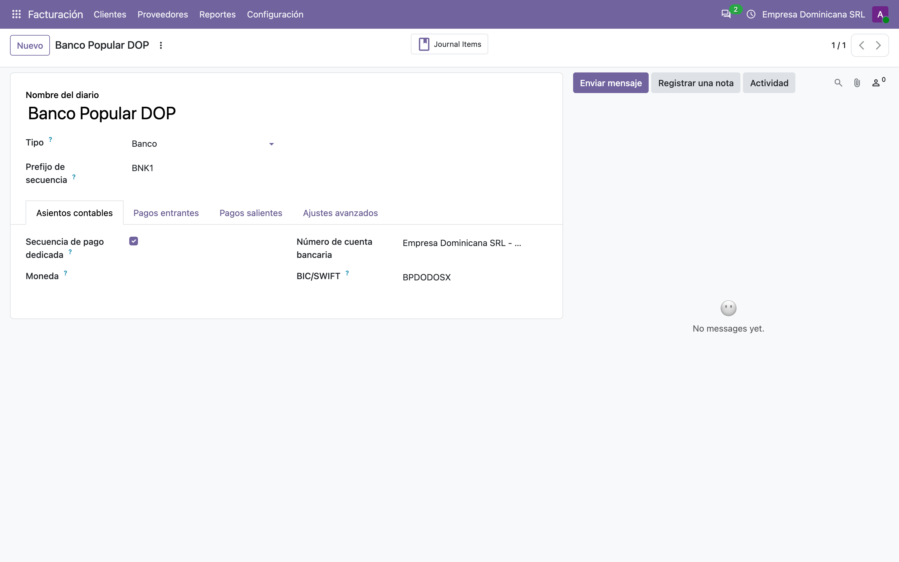
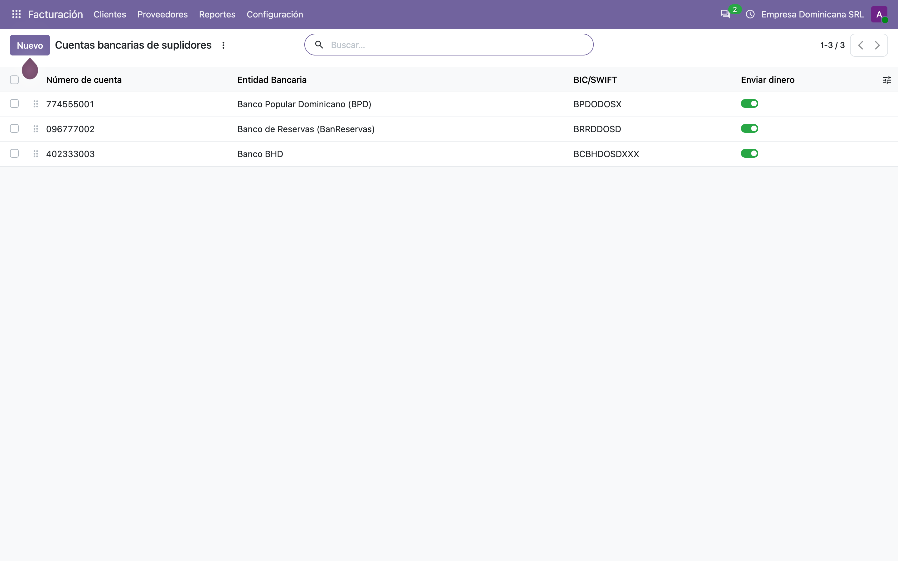
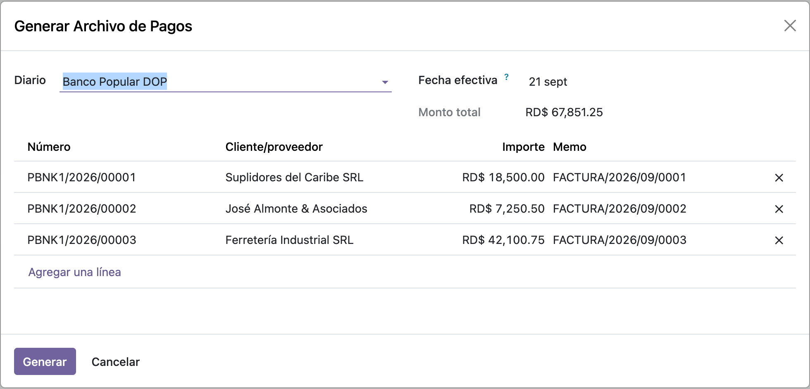
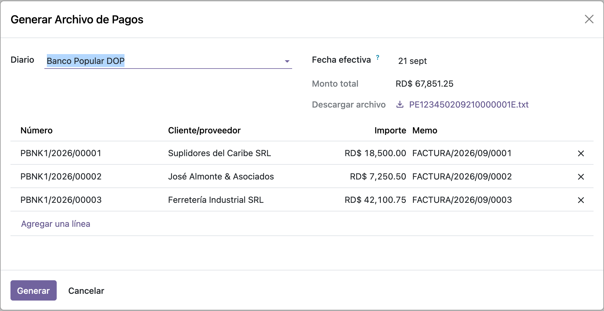

# Archivo de pagos Banco Popular — Manual de usuario (l10n_do_account_batch_payment_bpd)

> Manual generado con `tools/manual-generator`. Las capturas se regeneran ejecutando el generador contra una base `test_v20_<módulo>`.

`l10n_do_account_batch_payment_base` arma la pantalla, elige los pagos y prepara los datos, pero **no escribe ningún archivo**: eso lo pone el módulo de cada banco. Este es el de **Banco Popular Dominicano**, y es el más exigente de los tres.

A diferencia de BanReservas (CSV de 8 columnas) y BHD (10 campos con punto y coma), Popular pide un **archivo de ancho fijo**: cada dato ocupa una cantidad exacta de caracteres, rellenada con espacios o ceros, sin separadores. Un carácter de más y el banco rechaza el lote.

Lo que aporta:

- **Reconoce el diario** por el banco de su cuenta.
- **Escribe una línea de cabecera** (tipo `H`) con el RNC de la empresa, su nombre, la secuencia del archivo, la fecha de efectividad y los totales del lote.
- **Escribe una línea por transferencia** (tipo `N`) con 28 campos de ancho fijo.
- **Traduce el banco de destino** a su código de ruta de 8 dígitos y su dígito verificador.
- **Lleva dos secuencias propias por compañía**: una numera el archivo y otra cada transacción.
- **Agrega el número de afiliación BPD de la empresa** (5 dígitos) y el **código de moneda** de Popular.

Depende solo de `l10n_do_account_batch_payment_base`.

## Requisitos previos

- Módulo **`l10n_do_account_batch_payment_bpd`** instalado (v `19.5.1.0.2`, línea 20.0 / `master`). Odoo `master` se autodeclara `19.5`, de ahí el prefijo de versión.
- Dependencia: **`l10n_do_account_batch_payment_base`** (v `19.5.2.0.0`), que a su vez trae `l10n_do_banks`.
- La compañía necesita **RNC** y **número de banco BPD** de exactamente **5 dígitos**: los dos van en la cabecera y el segundo nombra el archivo.
- Un **diario de tipo Banco** cuya **cuenta bancaria propia** tenga *Banco dominicano* = **Banco Popular**.
- **Cada suplidor necesita RNC o cédula**: sin eso el archivo no se genera. También su cuenta bancaria con banco y tipo de cuenta.
- La **fecha de efectividad** del asistente no puede ser futura.

## 1. Dónde está: Proveedores → Archivos de pago

El menú lo pone el módulo base; este módulo no agrega pantalla propia, solo un campo al asistente y el generador por detrás.

> Si además se instala `l10n_do_account_batch_payment_ee`, este menú se desactiva y todo pasa por **Pagos por lotes** de Odoo Enterprise. El generador de Popular es el mismo en ambos caminos.


## 2. La compañía: RNC y número de afiliación BPD

Popular identifica a la empresa por dos datos, y los dos tienen que estar antes de generar nada:

- el **RNC** (`vat`), que va en la cabecera y al principio de cada transacción;
- el **número de banco BPD** (`l10n_do_bpd_bank_number`), el número de afiliación que Popular asigna al contratar el servicio. El módulo lo agrega al formulario de compañía, justo debajo del RNC, y **valida que sean exactamente 5 dígitos**.

Ese número nombra el archivo: `PE` + número + `02` + mes y día + secuencia + `E.txt`. En el ejemplo, `PE` + `12345` + `02` + `0921` + `0000001` + `E.txt`.

El correo de la compañía también viaja en la cabecera, por si Popular necesita avisar de algo.


## 3. Lo que decide el formato: la cuenta bancaria del diario

El módulo mira el **diario** para saber si le toca: `journal_id.bank_account_id.l10n_do_bank`, y si vale `bpd` se hace cargo.

A diferencia de los otros dos bancos, aquí la cuenta del diario **no** aparece en el archivo — Popular ya sabe de qué cuenta debitar por el número de afiliación. La cuenta del diario solo sirve para el enrutado.

> Antes de la línea 20.0 esto se leía de `journal_id.bank_id`, un enlace al modelo `res.bank`. Ese modelo desapareció y el banco vive ahora en la propia cuenta bancaria.



## 4. Las cuentas de los suplidores

De cada cuenta de destino el archivo toma el **banco dominicano** — que se traduce a un código de ruta de 8 dígitos más su dígito verificador — y el **tipo de cuenta**, que además determina el código de transacción:

| Tipo de cuenta | Código de cuenta | Código de transacción |
|---|---|---|
| Cuenta corriente (`cheque`) | **1** | **22** |
| Cuenta de ahorro (`savings`) | **2** | **32** |

En el ejemplo hay una cuenta en cada banco — Popular, Reservas y BHD — para que se vean tres códigos de ruta distintos en el archivo.

Además, **cada suplidor necesita RNC o cédula**: va en la línea, y su longitud decide si se marca como `RN` (RNC, 9 dígitos) o `CE` (cédula, 11).



## 5. El asistente: aquí sí aparece un campo nuevo

Este es el único de los tres módulos de banco que agrega algo a la pantalla: el campo **Fecha de efectividad**, la fecha en que Popular debe ejecutar las transferencias.

Solo se muestra cuando el diario elegido es de Popular (`invisible="not is_bpd_bank"`), y es obligatorio. Por defecto trae la fecha de hoy.

**No puede ser futura.** Si se pone una fecha adelante, el módulo corta con *«Effective date cannot be in the future»* antes de escribir nada.

> El campo técnico que controla esa visibilidad (`is_bpd_bank`) estaba declarado `column_invisible="1"`, un atributo que solo tiene efecto dentro de una lista. Al estar en un grupo de formulario no ocultaba nada y el usuario veía una casilla **Es BPD** que no debía tocar. Este port lo pasó a `invisible="1"`.



## 6. Generar: el archivo queda listo para descargar

**Generar** llama a `generate_bank_file()`. El módulo comprueba si el diario es de Popular; como lo es, consume la secuencia de archivo, arma la cabecera y las transacciones, lo escribe en **Descargar archivo** y **vuelve a abrir el mismo asistente**.

En la captura, `PE123450209210000001E.txt`. Cada vez que se genera, la **secuencia de archivo avanza**: el nombre nunca se repite, que es justo lo que Popular exige para no procesar dos veces el mismo lote.



## 7. Qué lleva el archivo

Ancho fijo, sin separadores. Primero una **cabecera** y después una línea por transferencia.

**Cabecera (tipo `H`)** — 16 campos:

| Campo | Ancho | Contenido |
|---|---|---|
| Tipo de registro | 1 | `H` |
| RNC de la empresa | 15 | Rellenado con espacios |
| Nombre de la empresa | 35 | Recortado a 35 |
| Secuencia del archivo | 7 | Con ceros a la izquierda |
| Tipo de servicio | 2 | `02` |
| Fecha de efectividad | 8 | `AAAAMMDD` |
| Cantidad y total de débitos | 11 + 13 | Siempre en cero: este archivo solo acredita |
| Cantidad de créditos | 11 | Cuántas transferencias |
| Total de créditos | 13 | En centavos, sin punto |
| Afiliación, fecha, hora, correo, estado, relleno | — | El resto de la cabecera |

**Transacción (tipo `N`)** — 28 campos. Los que importan:

| Campo | Ancho | Contenido |
|---|---|---|
| Tipo de registro | 1 | `N` |
| Cuenta de destino | 20 | Del suplidor |
| Tipo de cuenta | 1 | `1` corriente / `2` ahorro |
| Moneda | 3 | Código de Popular (`214` DOP, `840` USD, `978` EUR) |
| Código de banco | 8 | Ruta del banco de destino |
| Dígito verificador | 1 | Del mismo banco |
| Código de transacción | 2 | `22` o `32` según el tipo de cuenta |
| Monto | 13 | En **centavos**, con ceros a la izquierda |
| Tipo y número de identificación | 2 + 15 | `RN` o `CE` más el RNC/cédula |
| Nombre del beneficiario | 35 | |
| Referencia y descripción | 12 + 40 | Número del pago y memo |
| Correo y teléfono | 40 + 12 | Del beneficiario |

Las primeras líneas del archivo del ejemplo, con los espacios marcados como puntos para que se vea el ancho:

```
H131793916......Empresa Dominicana SRL.............00000010220260921...
N131793916......00000010000001774555001...........1214101010708220000001850000RN131000001......Suplidores del Caribe SRL..........
N131793916......00000010000002096777002...........2214101010106320000000725050RN131000002......José Almonte & Asociados...........
```

Se ve el contraste entre la segunda y la tercera línea: cuenta corriente en Popular (`1`, ruta `10101070`, verificador `8`, transacción `22`) contra cuenta de ahorro en Reservas (`2`, ruta `10101010`, verificador `6`, transacción `32`).

## 8. Las dos secuencias

Popular exige que cada archivo y cada transacción lleven un número que no se repita. El módulo crea **dos secuencias por compañía**:

| Secuencia | Código | Para qué |
|---|---|---|
| BPD Batch Payment File Sequence | `batch.payment.bpd.sequence` | Numera el archivo; va en la cabecera y en el nombre |
| BPD Batch Payment TX Sequence | `batch.payment.bpd.tx.sequence` | Numera cada transacción dentro del archivo |

Ambas se crean solas: al instalar el módulo para las compañías que ya existen, y en el `create()` de `res.company` para las que se creen después. Las dos usan 7 dígitos.

**Consecuencia práctica:** generar un archivo **consume secuencia**, aunque después no se suba al banco. Los números saltados son normales y Popular no se queja de ello — lo que no tolera es que se repitan.

## 9. Cuándo corta, y por qué

Popular es el banco que más valida, y el módulo hace la mayor parte de esas validaciones antes de escribir:

| Situación | Mensaje |
|---|---|
| La compañía no tiene RNC | *Banco Popular batch payment file needs company VAT* |
| La compañía no tiene número BPD | *Company BPD Bank number is required for this operation* |
| El número BPD no tiene 5 dígitos | *BPD Bank number must be a 5 digits value* (al guardar la compañía) |
| Un suplidor no tiene RNC ni cédula | *Banco Popular batch payment file require ... VAT* |
| Una cuenta de destino no tiene tipo | *... account type is required for generate batch file* |
| La fecha de efectividad es futura | *Effective date cannot be in the future* |
| Falta la fecha de efectividad | *Effective date is required* |
| Se pierden transacciones entre pasadas | *Error: Transaction count mismatch...* |

La última es una red de seguridad propia del módulo: arma los datos dos veces —una para contar y totalizar la cabecera, otra con la secuencia ya asignada— y si los conteos no coinciden se detiene en vez de mandar una cabecera que no cuadre con el cuerpo.

**Un banco de destino que no esté en la tabla de rutas** no corta: escribe el código en blanco y Popular rechazará esa línea. `l10n_do_banks` conoce 29 bancos y la tabla cubre 22, así que quedan 7 sin ruta.

## 10. Qué cambió al pasar a la línea 20.0

| Qué cambió en el core | Efecto | Cómo quedó |
|---|---|---|
| **`res.bank` desapareció** | El módulo ni cargaba: declaraba `_inherit = "res.bank"` para agregarle el código de ruta y el dígito verificador | Los 22 pares pasan a `const.py`, consultados por `partner_bank_id.l10n_do_bank` |
| `account.journal` perdió **`bank_id`** | `is_bpd_bank()` leía el banco por un enlace que ya no existe | Lee `journal_id.bank_account_id.l10n_do_bank` |
| El campo cheque/ahorros se renombró a **`l10n_do_account_type`** | El mapeo de tipo y código de transacción leía el campo equivocado | Lee `l10n_do_account_type` |
| **Los campos `Binary` ya no aceptan `bytes` en crudo** | Escribir el archivo fallaba con `TypeError: use BinaryValue instead of bytes` | Se escribe con `BinaryBytes(contenido)`, y el archivo se arma en memoria en vez de pasar por `/tmp` |
| `res.partner.bank` perdió `currency_id` y `acc_number` se llama `account_number` | Los datos de demostración no cargaban | Actualizados |

Y una rama de código que ya estaba muerta: el módulo decidía el beneficiario con `payment_type != "transfer"`. `account.payment.payment_type` solo tiene `inbound` y `outbound`, ni en 19.0 ni ahora, así que la rama nunca se ejecutaba. Se quitó sin cambiar comportamiento.

**Lo que no se tocó:** `res.currency.l10n_do_bpd_currency_code` y sus datos siguen igual. `res.currency` existe en la línea 20.0, así que no había nada que migrar ahí.

## Notas

### Qué agrega el módulo, en código

| Modelo | Qué agrega |
|---|---|
| `res.company` | `l10n_do_bpd_bank_number` (5 dígitos, con restricción), y la creación de las dos secuencias en `create()` y en `init()` |
| `res.currency` | `l10n_do_bpd_currency_code`, precargado para DOP, USD y EUR |
| `account.journal` | `is_bpd_bank()` y los alias `_is_bpd_bank()` / `_is_BPDODOSX_bank()` para el enrutado del módulo Enterprise |
| `account.payment` | `_get_header_data()`, `_get_transaction_data()`, `_get_bpd_filename()`, `_get_bpd_file()` y `_get_BPDODOSX_file()` |
| `l10n_do.account.batch.payment` | El campo `effective_date` y el `is_bpd_bank` que controla su visibilidad |
| `const.py` | `BPD_BANK_CODES`: 22 bancos con su código de ruta y su dígito verificador |
| `bpd_fields.py` | El orden exacto de los 28 campos de transacción y los 16 de cabecera |

### Cosas a tener en cuenta (comportamiento real del código)

1. **Generar consume secuencia.** Cada archivo generado avanza `batch.payment.bpd.sequence`, se suba al banco o no. Los saltos son normales.
2. **Los datos se arman dos veces.** Una pasada calcula los totales de la cabecera y otra genera las líneas con la secuencia ya asignada. El módulo compara los conteos y se detiene si no cuadran.
3. **Un banco fuera de la tabla escribe el código en blanco.** No levanta error: la línea sale con 8 espacios y Popular la rechazará. De los 29 bancos que conoce `l10n_do_banks`, 7 no tienen ruta aquí.
4. **El tipo de identificación se decide por la longitud.** 11 caracteres se marca como `CE` (cédula) y cualquier otra longitud como `RN` (RNC). Un RNC mal digitado con 11 caracteres se marcaría como cédula.
5. **La restricción de los 5 dígitos pasa por casualidad cuando el campo está vacío.** La condición evalúa `len(str(False))`, que es 5 porque `str(False)` es `"False"`. Funciona, pero por accidente; es código previo al port y se dejó igual para no empezar a rechazar compañías que hoy se guardan sin problema.
6. **El archivo ya no toca el disco.** Antes se escribía en `/tmp` y se releía para codificarlo; ahora se arma en memoria, lo que además evita que dos workers del mismo contenedor se pisen el archivo.
7. **La cuenta del diario no viaja en el archivo.** Popular ya sabe de dónde debitar por el número de afiliación; la cuenta del diario solo sirve para decidir que el archivo es de Popular.

### Reproducir este manual

```bash
cd tools/manual-generator
./generate-manual.sh --module=l10n_do_account_batch_payment_bpd \
  --addons-path=/mnt/extra-addons,/mnt/extra-addons-pro,/mnt/extra-addons-pro/store-addons
```

El `--addons-path` saca `enterprise` de la ruta: ese checkout está adelantado respecto al core de la imagen de desarrollo y `ai_auto_install` muere con `ImportError: cannot import name '_check_jwt'`. Este módulo no necesita enterprise.

El seed (`configs/l10n_do_account_batch_payment_bpd.seed.py`) arma, sobre una base limpia: compañía RD en español con RNC, correo y número de afiliación BPD `12345`, catálogo de cuentas dominicano, diario **Banco Popular DOP** con su cuenta corriente propia, tres suplidores con RNC y cuenta en Popular, Reservas y BHD, sus tres facturas publicadas y pagadas, un asistente cargado y **otro ya ejecutado**, con el archivo generado y descargable.

`--keep-db` conserva la base `test_v20_l10n_do_account_batch_payment_bpd`; `--headed` muestra el navegador durante las capturas.
