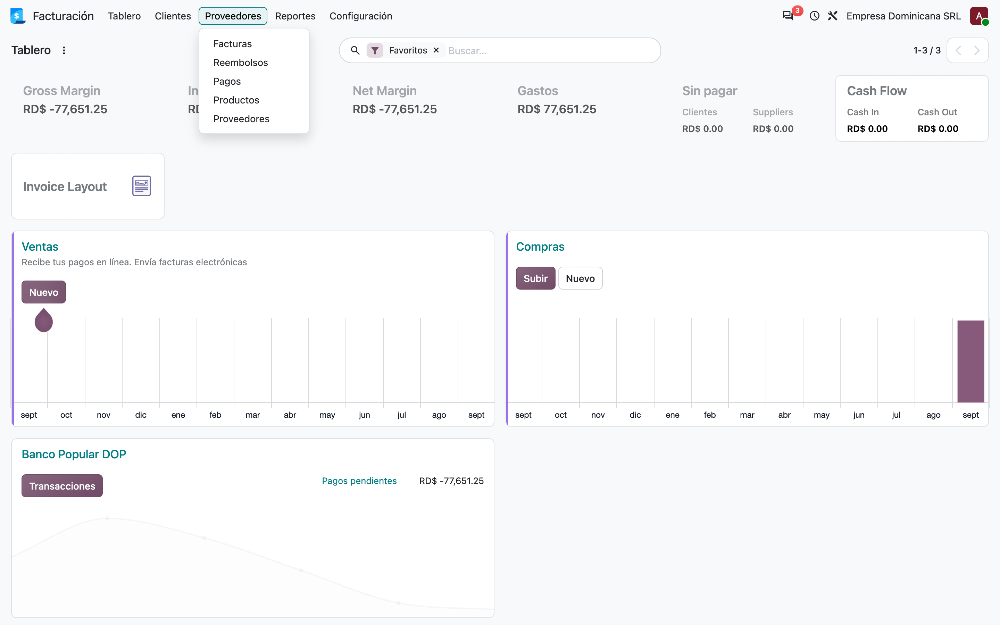
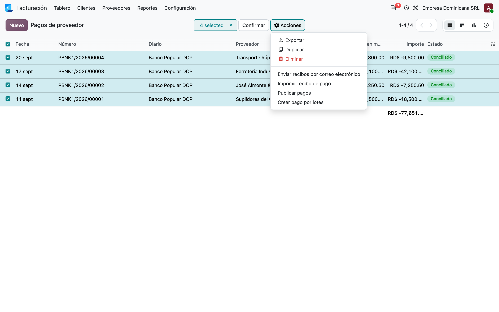
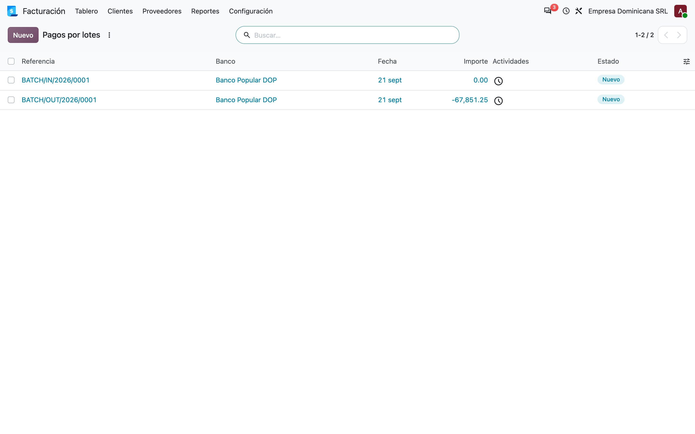
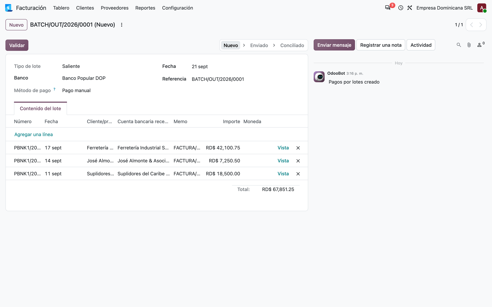
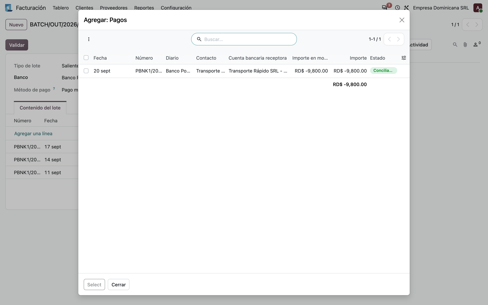
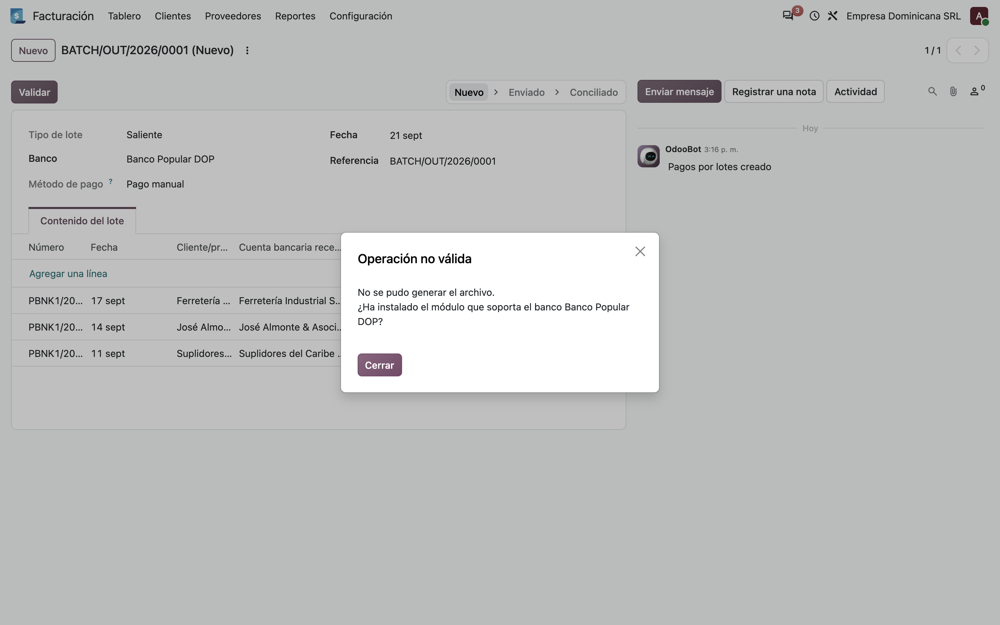
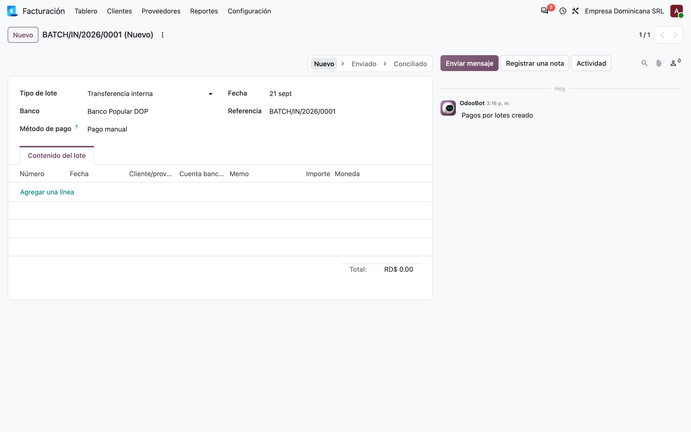
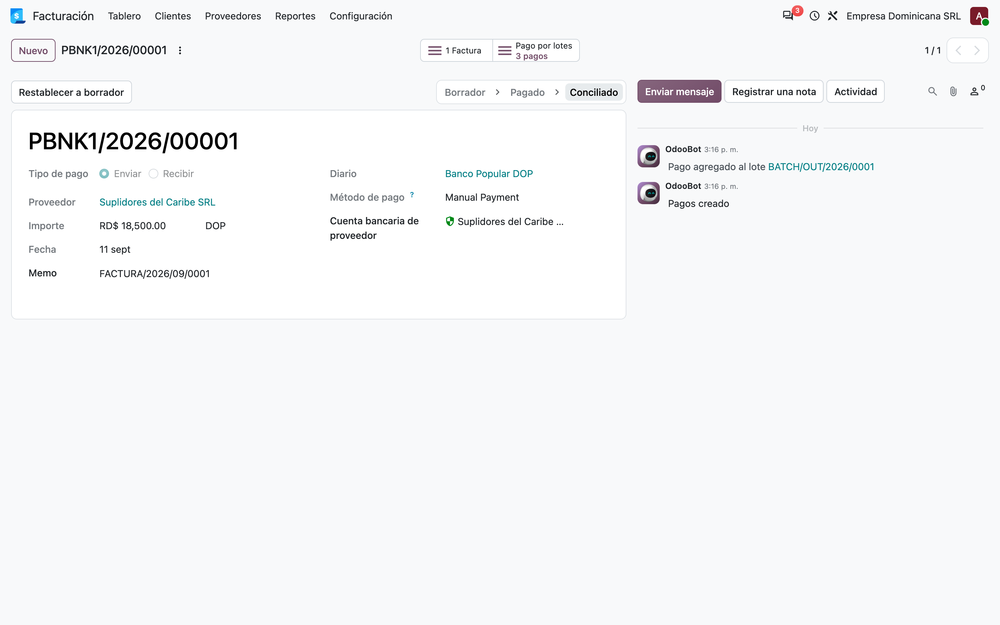
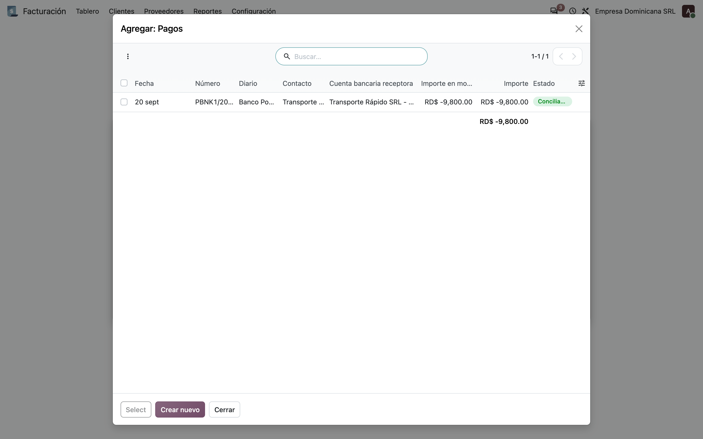

# Pagos por lotes a bancos RD — Manual de usuario (l10n_do_account_batch_payment_ee)

> Manual generado con `tools/manual-generator`. Las capturas se regeneran ejecutando el generador contra una base `test_v20_<módulo>`.

Odoo Enterprise ya trae **Pagos por lotes** (`account_batch_payment`): agrupa varios pagos de un mismo diario y método, y genera un archivo para el banco. Lo que trae de fábrica son los formatos internacionales (SEPA, NACHA). Ningún banco dominicano los lee.

Este módulo enchufa la familia `l10n_do_account_batch_payment_*` dentro de esa pantalla. En vez de mantener dos lugares distintos para pagar a suplidores, deja uno solo:

- **Reemplaza el asistente del módulo base.** Desactiva el menú *Archivos de pago* de `l10n_do_account_batch_payment_base` y deja que todo pase por **Pagos por lotes**, que es la pantalla estándar de Odoo y sí lleva historial, adjunto del archivo y chatter.
- **Enruta al módulo del banco.** Cuando la compañía es dominicana, `_generate_export_file()` mira el banco del diario y llama al generador del banco que corresponda (`l10n_do_account_batch_payment_bpd`, `_bhd`, `_bdr`). Si ninguno está instalado, lo dice con un error claro.
- **Agrega el tipo de lote «Transferencia interna»**, que Odoo no tiene (solo *Entrante* y *Saliente*).
- **Muestra la cuenta bancaria receptora** en el contenido del lote y en el selector de pagos, que es el dato que el banco va a cobrar si está mal.

Depende de `l10n_do_account_batch_payment_base` y de `account_batch_payment` (Enterprise).

## Requisitos previos

- Módulo **`l10n_do_account_batch_payment_ee`** instalado (v `19.5.1.0.3`, línea 20.0 / `master`). Odoo `master` se autodeclara `19.5`, de ahí el prefijo de versión.
- Dependencias: **`l10n_do_account_batch_payment_base`** (v `19.5.2.0.0`) y **`account_batch_payment`** (Odoo **Enterprise**).
- Un **diario de tipo Banco** con su **cuenta bancaria propia**, y esa cuenta con su **banco dominicano** asignado: de ahí sale el generador que se va a usar.
- Cada pago del lote debe tener **Cuenta bancaria receptora** (`partner_bank_id`).
- **Para que salga un archivo hace falta además el módulo del banco.** Ninguno de los tres (`_bpd`, `_bhd`, `_bdr`) está portado todavía a la línea 20.0, así que hoy el flujo termina en el error que documenta el paso 5.

## 1. Qué pasa con los menús de Proveedores

Instalado este módulo, el menú **Proveedores** ya **no** muestra *Archivos de pago*, el asistente de `l10n_do_account_batch_payment_base`. No se borra: el módulo lo **desactiva** (`active = False`) para que no haya dos caminos para lo mismo, y el `uninstall_hook` lo vuelve a activar si este módulo se desinstala.

Ahora bien, ojo con lo que queda en su lugar: el menú **Pagos por lotes** que trae Odoo bajo *Proveedores* está declarado `groups="base.group_no_one"`, o sea **solo visible en modo desarrollador**. El de *Clientes* sí es visible para los grupos de contabilidad, pero el de proveedores no.

Con lo cual, en una instalación normal, el camino de todos los días para pagos a suplidores es el del paso siguiente: **Proveedores → Pagos**, seleccionar y usar la acción. Vale la pena saberlo antes de desplegar, porque para un usuario acostumbrado al asistente del base el menú simplemente desapareció.



## 2. El camino real: Proveedores → Pagos → Crear pago por lotes

Se marcan los pagos que van juntos al banco y se usa **Acciones → Crear pago por lotes**. Odoo agrupa lo seleccionado en un `account.batch.payment` y abre el lote.

Es una acción de servidor de Odoo Enterprise enlazada a la lista y al kanban de pagos (`binding_view_types` = `list,kanban`), así que está disponible desde cualquier vista de pagos, no solo desde este menú.

Odoo valida que los pagos compartan diario y método de pago; si no, abre un asistente explicando qué sobra. Los cuatro pagos del ejemplo comparten ambos.



## 3. La lista de lotes de salida

La acción **Pagos por lotes** de Proveedores lista los lotes de salida. Este módulo le amplía el dominio:

```python
[('batch_type', 'in', ('outbound', 'transfer'))]
```

Odoo trae `[('batch_type', '=', 'outbound')]`; sin este cambio los lotes de **Transferencia interna** existirían pero no se verían desde ningún menú.

En la base de ejemplo hay dos: uno *Saliente* con tres pagos y uno de *Transferencia interna* vacío.



## 4. El contenido del lote: la cuenta bancaria receptora

Dentro del lote, la columna **Cuenta bancaria receptora** es la que agrega este módulo (`partner_bank_id`, por xpath sobre la vista de Odoo). Es el dato que el archivo va a escribir como cuenta destino, y el único que el banco no puede adivinar: si está mal, el dinero se va a otra cuenta.

Se lee como **«titular – número de cuenta»**, que es el formato que impone `l10n_do_account_batch_payment_base`.

Arriba, el botón **Validar** genera el archivo. Aparece en vez de *Imprimir* porque `_get_methods_generating_files()` declara que, para una compañía dominicana, **todo método de pago genera archivo**.

El **Total** de RD$ 67,851.25 es la suma de los tres pagos del lote.



## 5. Agregar pagos al lote: el selector también muestra la cuenta

**Agregar una línea** abre el selector de pagos, y también ahí aparece la **Cuenta bancaria receptora**. Eso lo consigue un segundo aporte del módulo: una vista de lista propia de `account.payment` con esa columna, enchufada al campo mediante la clave de contexto **`list_view_ref`**.

El selector solo ofrece pagos **del mismo diario, del mismo método y que no estén ya en otro lote**. En el ejemplo aparece el cuarto pago, a *Transporte Rápido SRL*, que quedó deliberadamente fuera: no todos los pagos del día tienen que ir en el mismo archivo.

> Esta pantalla es prueba directa de una de las correcciones del port: la clave de contexto se llamaba `tree_view_ref`, y en la línea 20.0 `tree` dejó de ser un tipo de vista. La clave se ignoraba en silencio y el selector salía con las columnas de Odoo, sin la cuenta bancaria.



## 6. Validar sin el módulo del banco: el error esperado

**Validar** llama a `_generate_export_file()`. Para una compañía dominicana el método mira el **banco de la cuenta del diario** y busca el generador correspondiente:

1. toma `journal_id.bank_account_id`;
2. arma los sufijos candidatos: primero `l10n_do_bank` (`bpd`), luego el BIC;
3. por cada uno busca el par `_is_<sufijo>_bank` / `_get_<sufijo>_file`, que instala el módulo del banco;
4. si ninguno responde, levanta el error.

> No se pudo generar el archivo.
> ¿Ha instalado el módulo que soporta el banco Banco Popular DOP?

Se prefiere `l10n_do_bank` sobre el BIC a propósito: el BIC es texto libre y viene en variantes de 8 y 11 caracteres, mientras que `l10n_do_bank` es una selección curada por `l10n_do_banks`.

El mensaje en español es, además, una corrección de este port: el `.po` del módulo venía de la versión 13.0 y no traía el comentario `#. odoo-python`, así que Odoo descartaba la traducción y el diálogo salía en inglés.



## 7. El tipo de lote «Transferencia interna»

Odoo trae dos tipos de lote: **Entrante** y **Saliente**. Este módulo agrega un tercero, **Transferencia interna**, para agrupar los movimientos entre cuentas propias de la empresa — que en la práctica se mandan al banco en el mismo tipo de archivo que los pagos a suplidores, pero se contabilizan y se revisan aparte.

Se declara con `selection_add` y `ondelete={'transfer': 'set default'}`, así que si algún día se desinstala el módulo los lotes que usaban el tipo caen al valor por defecto en vez de dejar la base inconsistente.

Un detalle a tener en cuenta: la **referencia** se genera con la secuencia *entrante* (`BATCH/IN/...`), porque Odoo solo distingue `outbound` del resto. Es cosmético y viene de antes del port.



## 8. De dónde sale la cuenta receptora

La cuenta que el lote muestra es la del propio pago: **Cuenta bancaria de proveedor** (`partner_bank_id`), que se elige al registrar el pago desde la factura.

Arriba se ve la barra de estados de la línea 20.0: **Borrador → Pagado → Conciliado**. El estado `En proceso` que existía en 19.0 desapareció y `Conciliado` es nuevo, y de ahí salió otra corrección del port: la vista del asistente base filtraba por `state = 'posted'`, un estado que `account.payment` **nunca** tuvo, así que ese filtro no casaba con nada.



## 9. El asistente del módulo base sigue ahí (sin menú)

Desactivar el menú no borra el asistente: si alguien lo reactiva, o lo abre por su acción, sigue funcionando. Por eso este módulo **también le extiende el filtro de pagos** y le agrega una condición que el base no tiene:

```python
('batch_payment_id', '=', False)
```

Con eso, un pago que ya está dentro de un lote no vuelve a aparecer como candidato, y no se puede mandar dos veces al banco por dos caminos distintos.

En la captura el asistente no ofrece los tres pagos del lote: solo queda el cuarto, el que se dejó suelto.



## 10. Cómo se reparte el trabajo entre los tres módulos

| Módulo | Qué aporta |
|---|---|
| `l10n_do_account_batch_payment_base` | Los saneadores (nombre sin tildes y en mayúsculas, teléfono solo dígitos), los datos mínimos de cada transacción (`_get_transaction_data`), y el `display_name` «titular – número de cuenta». Trae su propio asistente, que este módulo apaga. |
| `l10n_do_account_batch_payment_ee` (este) | Enchufa todo eso dentro de **Pagos por lotes** de Enterprise: enruta al banco, agrega el tipo *Transferencia interna* y muestra la cuenta receptora. **No escribe ningún archivo.** |
| `l10n_do_account_batch_payment_bpd` / `_bhd` / `_bdr` | El formato de cada banco: el par `_is_<banco>_bank` (en `account.journal`) y `_get_<banco>_file` (en `account.payment`). |

El enganche entre el segundo y el tercero es por **nombre de método**, no por herencia: `_generate_export_file()` construye el nombre a partir del banco de la cuenta y pregunta con `hasattr`. Por eso instalar el módulo de un banco basta para que funcione, sin tocar nada de este.

## 11. Qué cambió al pasar a la línea 20.0

| Qué cambió en el core | Efecto | Cómo quedó |
|---|---|---|
| **`account.journal` perdió `bank_id` y `bank_acc_number`** (eran campos relacionados sobre la cuenta bancaria, y se fueron con `res.bank`) | `_generate_export_file()` reventaba al leer el banco del diario | Lee `journal_id.bank_account_id` y saca `l10n_do_bank` y `bank_bic` de la cuenta |
| La clave de contexto `tree_view_ref` pasó a **`list_view_ref`** | El selector de pagos ignoraba la vista propia y salía sin la columna de cuenta bancaria | Renombrada, y con el xmlid completo como lo escribe el core |
| `account.payment._valid_payment_states()` pasó de `('in_process','paid')` a `('paid','reconciled')` | — | El filtro del asistente base sigue el mismo par |

Y dos defectos que el port destapó:

1. **El filtro del asistente nunca funcionó.** Estaba escrito `('state', '=', 'posted')`, y `account.payment` no ha tenido nunca un estado `posted`, ni en 19.0 ni ahora. Al no casar nada, la condición `batch_payment_id = False` que ese filtro existía para agregar tampoco se aplicaba: quien reactivara el menú del base podía meter el mismo pago en dos lotes.
2. **El error salía en inglés.** El `i18n/es_DO.po` se generó contra la versión **13.0** y no trae el comentario `#. odoo-python`; desde 16.0 Odoo descarta las entradas que no lo tienen, así que el único mensaje Python del módulo se quedaba sin traducir. De paso se tradujo el tipo de lote *Transferencia interna*, que no tenía entrada.

## 12. Qué falta para que salga un archivo

Los tres módulos de banco siguen en `installable: False` en la línea 20.0:

| Módulo | Banco | Por qué sigue bloqueado |
|---|---|---|
| `l10n_do_account_batch_payment_bpd` | Banco Popular | Lee `journal_id.bank_id`, `journal_id.bank_acc_number` y `partner_bank_id.bank_id.l10n_do_bpd_bank_code`; trae datos de `res.bank` |
| `l10n_do_account_batch_payment_bhd` | Banco BHD | Igual, más un `_inherit = "res.bank"` propio |
| `l10n_do_account_batch_payment_bdr` | BanReservas | Igual |

Los tres dependen de lo mismo: `res.bank` desapareció y su información vive ahora en `res.partner.bank` a través de `l10n_do_banks.l10n_do_bank`. Es el mismo trabajo que ya se hizo en `l10n_do_banks` y en el módulo base, repetido en cada uno.

Mientras tanto, este módulo **está completo y probado**: la pantalla, el enrutado, el tipo de lote y el filtro funcionan. Lo que no hay todavía es a quién enrutar, y eso el módulo lo dice con todas las letras en vez de fallar raro.

## Notas

### Qué agrega el módulo, en código

**`account.batch.payment`:**

| Miembro | Rol |
|---|---|
| `batch_type` | `selection_add=[('transfer', 'Internal Transfer')]`, con `ondelete={'transfer': 'set default'}` |
| `_get_methods_generating_files()` | Para una compañía **DO**, agrega el código del método de pago del lote, de modo que la pantalla muestre *Validar / Generar archivo* en vez de *Imprimir* |
| `_generate_export_file()` | Para una compañía **DO**, enruta al generador del banco de `journal_id.bank_account_id`; fuera de RD delega en `super()` |

**Vistas:**

| Vista | Qué hace |
|---|---|
| `view_account_payment_tree_inherited` | Vista de lista primaria de `account.payment` con la columna **Cuenta bancaria receptora**; se enchufa al selector del lote con `list_view_ref` |
| `view_batch_payment_form_inherited` | Agrega esa misma columna al contenido del lote y fija el contexto del campo `payment_ids` |
| `action_batch_payment_out` | Amplía el dominio a `('outbound', 'transfer')` |
| menú del base | `active = False`; el `uninstall_hook` lo restaura |
| vista del asistente base | Agrega `('batch_payment_id', '=', False)` y alinea el estado con `('paid', 'reconciled')` |

### Cosas a tener en cuenta (comportamiento real del código)

1. **El módulo no escribe ningún archivo.** Es un enrutador. Sin `_bpd`, `_bhd` o `_bdr` instalado, *Validar* siempre termina en el error del paso 5. Ninguno de los tres está portado a la línea 20.0 todavía.
2. **Para una compañía dominicana, todo método de pago se considera generador de archivo.** `_get_methods_generating_files()` agrega el código del método sin mirar cuál es, así que el botón *Imprimir* desaparece siempre. Es deliberado, pero significa que un método que no tenga generador detrás igual muestra *Validar*.
3. **El banco se resuelve por el diario, no por el pago.** Un lote puede llevar pagos a cuentas de bancos distintos; el formato lo manda el banco de la cuenta del **diario**, que es quien ejecuta las transferencias.
4. **Si el diario no tiene cuenta bancaria, no hay sufijos que probar** y se cae en el mismo error, sin reventar. Antes del port esto habría sido un `AttributeError` sobre `res.bank`.
5. **El tipo *Transferencia interna* usa la secuencia entrante** (`BATCH/IN/...`) porque Odoo solo distingue `outbound` del resto. Cosmético, viene de antes del port.
6. **El menú *Pagos por lotes* de Proveedores es de modo desarrollador.** Odoo lo declara `groups="base.group_no_one"` (el de *Clientes* no). Como este módulo además apaga *Archivos de pago*, en una instalación normal **no queda ningún menú** de pagos por lotes bajo Proveedores: se llega por *Pagos → Acciones → Crear pago por lotes*. Si el equipo quiere el menú a la vista, hay que darle otros grupos.
7. **Desactivar el menú del base no borra su asistente.** Sigue accesible por su acción, y por eso este módulo le agrega la condición `batch_payment_id = False`. El `uninstall_hook` reactiva el menú al desinstalar.

### Reproducir este manual

```bash
cd tools/manual-generator
./generate-manual.sh --module=l10n_do_account_batch_payment_ee \
  --addons-path=/mnt/extra-addons-pro/.manualgen-addons,/mnt/extra-addons-pro
```

El `--addons-path` apunta primero a `odoo-pro/.manualgen-addons/`, un directorio **ignorado por git** donde se extrajeron con `git archive` los cinco módulos de Enterprise que este manual necesita (`account_batch_payment`, `account_accountant`, `mail_enterprise`, `web_enterprise`, `web_mobile`) en el commit `7ed1db0dd59` (2026‑09‑02), más un `ai_auto_install` de relleno.

Hace falta porque el checkout de `enterprise` (2026‑09‑14) está **adelantado respecto al core de la imagen de desarrollo** (`19.5a1-20260901`) y no se puede cargar: `ai_auto_install` muere con `ImportError: cannot import name '_check_jwt'` y `account_accountant` con `ImportError: cannot import name '_ignore_tax_lock_date'`. Nada de eso se toca ni se commitea; la solución de fondo es poner la imagen y el checkout de enterprise en el mismo punto.

El seed (`configs/l10n_do_account_batch_payment_ee.seed.py`) arma, sobre una base limpia: compañía RD en español con catálogo de cuentas dominicano, diario **Banco Popular DOP** con su cuenta propia, **cuatro** suplidores con cuenta en BPD, BHD y BanReservas, sus cuatro facturas publicadas y pagadas, un **lote de salida con tres de esos pagos** (el cuarto queda suelto a propósito) y un **lote de transferencia interna** vacío.

`--keep-db` conserva la base `test_v20_l10n_do_account_batch_payment_ee`; `--headed` muestra el navegador durante las capturas.
