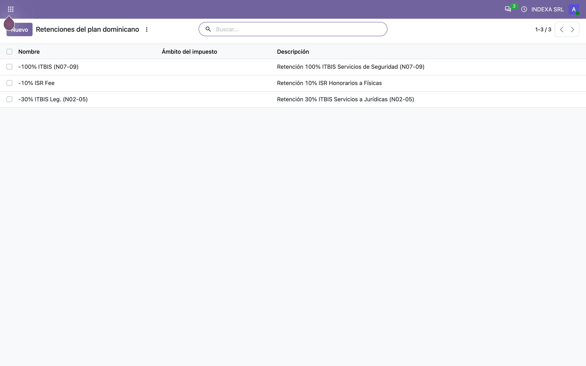
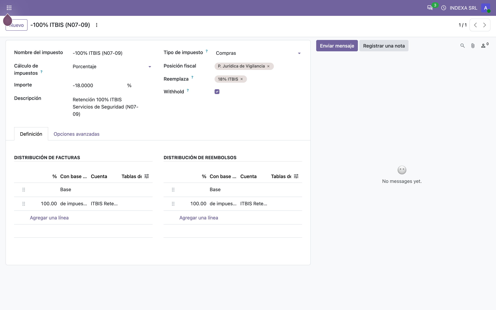
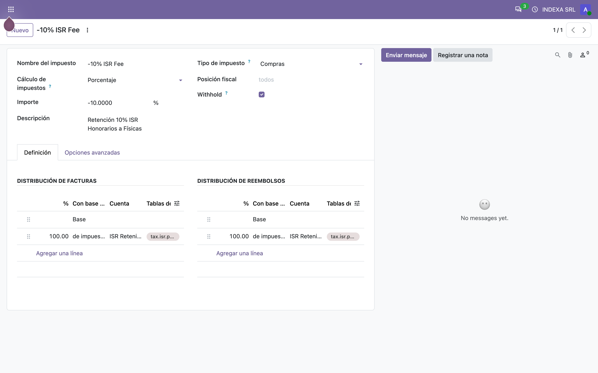
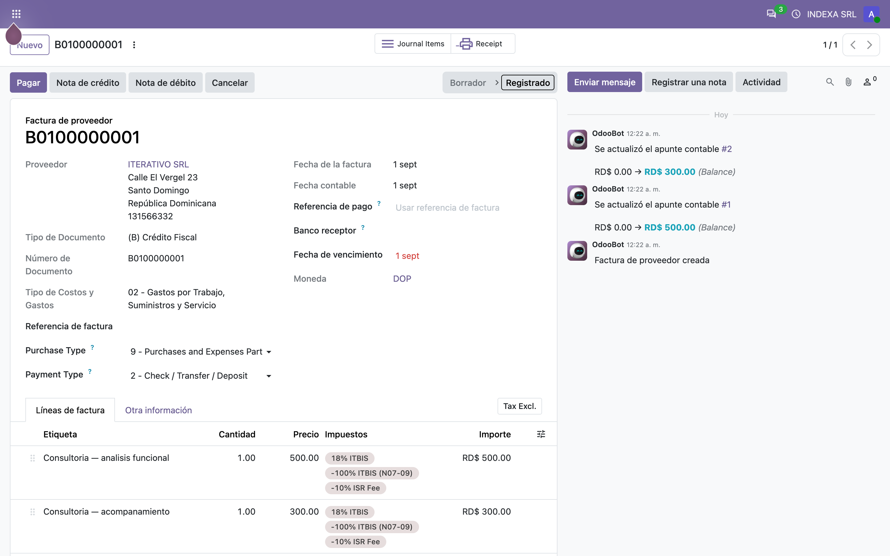
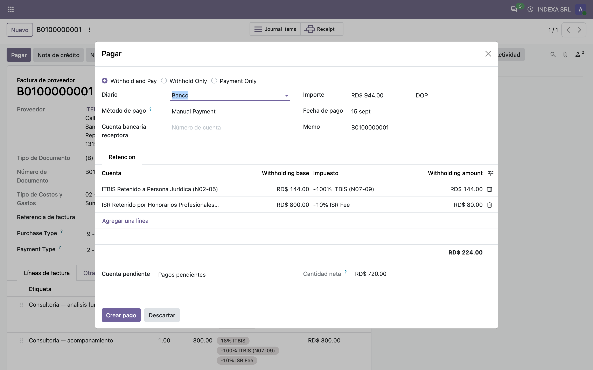
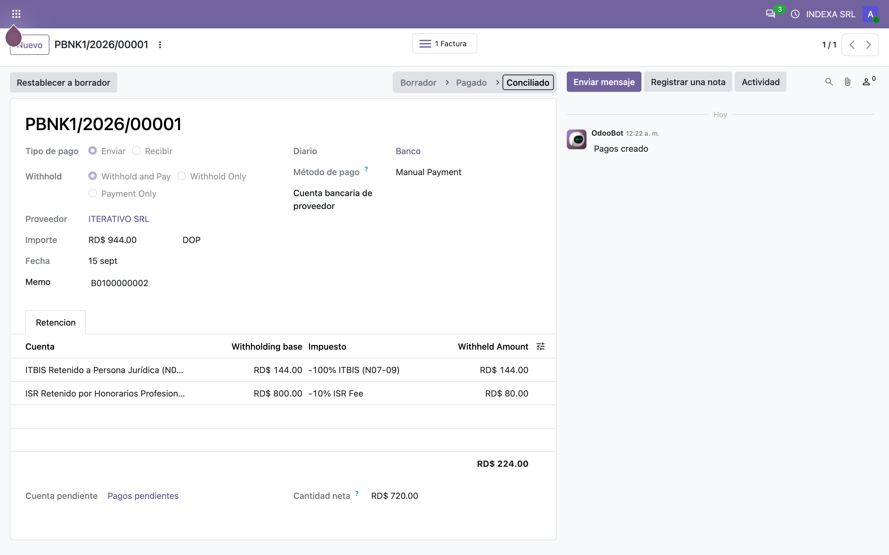
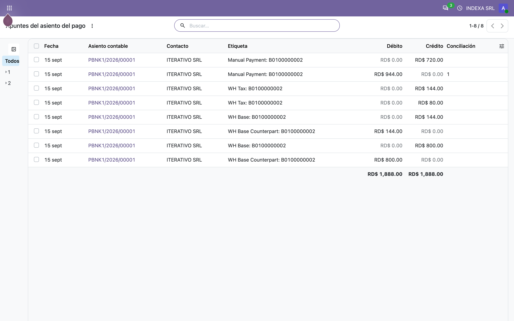
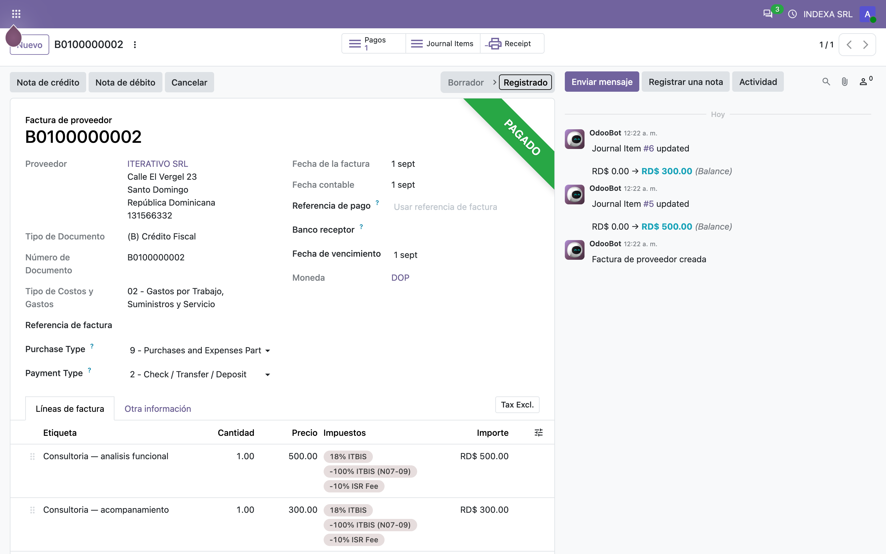

# Retención en el pago (RD) — Manual de usuario (l10n_do_account_withholding_tax)

> Manual generado con `tools/manual-generator`. Las capturas se regeneran ejecutando el generador contra una base `test_v20_<módulo>`.

Odoo ya sabe retener en el pago: el módulo core **`l10n_account_withholding_tax`** agrega el asistente de *Registrar pago* con líneas de retención, el asiento contable y el número de retención. Lo que **no** sabe es cómo la DGII calcula la base.

Ahí entra este módulo. Hace una sola cosa, y solo para compañías cuyo país fiscal es **República Dominicana**: cambia la **base** sobre la que se calcula cada retención.

| Tipo de retención | Base que usa Odoo core | Base que exige la DGII (y que aplica este módulo) |
|---|---|---|
| **ITBIS** (`-18`, `-13.5`, `-5.4`) | el subtotal de las líneas | el **ITBIS ya facturado** en el comprobante |
| **ISR** (`-10`, `-2`, `-27`…) | el subtotal de las líneas | el **subtotal sin impuestos** de la factura completa |

El **monto retenido no cambia** — cambia el número que se registra como base. Sobre una factura de RD$800 + ITBIS 18% (RD$144), una retención de *100% del ITBIS* se contabiliza contra una base de **RD$144**, no de RD$800; la de *ISR 10%* contra una base de **RD$800**. Eso es lo que después cuadra con el 606.

Además: si la retención no tiene cuenta de base configurada en la compañía, el módulo la resuelve desde la **línea de repartición del propio impuesto**, en vez de dejar el campo vacío.

## Requisitos previos

- Módulo **`l10n_do_account_withholding_tax`** instalado (v `19.5.2.0.0`, línea 20.0 / `master`). Odoo `master` se autodeclara `19.5`, por eso el prefijo de versión.
- Dependencias: **`l10n_do_accounting`** (v `19.5.3.0.0`) y el módulo core **`l10n_account_withholding_tax`**, que a su vez traen `l10n_do` y `l10n_latam_invoice_document`.
- La compañía debe tener **país fiscal República Dominicana**. Todo el módulo está condicionado a `company_id.account_fiscal_country_id.code == "DO"`; en cualquier otro país el comportamiento es el de Odoo core, intacto.
- Las retenciones del plan dominicano deben estar marcadas como **Retención** (`is_withholding_tax`). **El plan no las trae marcadas de fábrica** — ver el paso 1.

## 1. Punto de partida: habilitar las retenciones del plan dominicano

El plan contable dominicano (`l10n_do`) ya trae las retenciones con las tasas correctas, pero **no las marca como retención en el pago**. Mientras el interruptor **Retención** esté apagado, el asistente de pago no las ofrece y este módulo no tiene nada que hacer.

El listado muestra las tres que usa esta base de ejemplo, ya habilitadas:

| Impuesto | Tasa | Grupo | Base que aplicará el módulo |
|---|---|---|---|
| **-100% ITBIS (N07-09)** | `-18` | Retenciones | el ITBIS facturado |
| **-30% ITBIS Leg. (N02-05)** | `-5.4` | Retenciones | el ITBIS facturado |
| **-10% ISR Fee** | `-10` | ISR | el subtotal sin impuestos |

Las tasas se leen como *porcentaje del subtotal*: `-18` es el 100% de un ITBIS del 18%, `-13.5` el 75%, `-5.4` el 30%. Esa es la convención de Odoo core y la que este módulo respeta.

El módulo aporta aquí un detalle de comodidad: **al poner una tasa negativa, marca `Retención` sola**. Core solo hace lo contrario (apagarla cuando la tasa vuelve a ser positiva).



## 2. Una retención de ITBIS por dentro

**-100% ITBIS (N07-09)**, tasa `-18`, grupo *Retenciones*. El interruptor **Retención** encendido es lo único que hace falta para que aparezca en el asistente de pago.

Dos condiciones que core exige y que este módulo también asegura por SQL en su script de migración:

- **Exigibilidad = Basado en la factura** (`on_invoice`): una retención no puede ser de caja.
- **Precio incluido = Impuesto excluido**: la retención no se suma al precio.

El grupo de impuesto es lo que decide **cómo se calcula la base**. En la línea 20.0 el plan dominicano separó los grupos: las tasas de ITBIS viven en *ITBIS 18% / 16% / 0%* y las retenciones de ITBIS se mudaron a *Retenciones*. El módulo clasifica por ese grupo, no por la tasa ni por el nombre.



## 3. Una retención de ISR por dentro

**-10% ISR Fee**, tasa `-10`, grupo **ISR**. Misma configuración, distinto grupo — y eso basta para que el módulo le aplique la otra regla de base.

Una retención de ISR se calcula sobre el **subtotal sin impuestos de la factura completa**, no sobre el ITBIS y no línea por línea. Por eso sobre la factura de ejemplo (RD$500 + RD$300) la base es **RD$800** y la retención **RD$80**, aunque el ITBIS de esa misma factura sea RD$144.



## 4. La factura de proveedor

Factura fiscal **B0100000001** de ITERATIVO SRL, dos líneas de servicio:

| Línea | Subtotal | Impuestos |
|---|---|---|
| Consultoría — análisis funcional | RD$500 | ITBIS 18%, -100% ITBIS, -10% ISR |
| Consultoría — acompañamiento | RD$300 | ITBIS 18%, -100% ITBIS, -10% ISR |

Totales: **subtotal RD$800**, **ITBIS RD$144**, **total RD$944**.

Las retenciones van en las líneas de la factura pero **no afectan el total**: core las excluye del cálculo (`filter_tax_function`) hasta que llega el pago. La factura se debe RD$944 completos; lo que se retiene se decide al pagar.



## 5. El asistente de pago — aquí es donde el módulo actúa

Al pulsar **Registrar pago** sobre esa factura, el asistente propone las líneas de retención. **Estas son las cifras que este módulo calcula:**

| Retención | Base | Monto |
|---|---|---|
| **-100% ITBIS (N07-09)** | **RD$144.00** | RD$144.00 |
| **-10% ISR Fee** | **RD$800.00** | RD$80.00 |

La base de la retención de ITBIS es **RD$144**, el ITBIS que ya está en la factura — no los RD$800 del subtotal, que es lo que Odoo core pondría ahí. La de ISR sí es RD$800, el subtotal completo.

La cuenta de cada línea se resolvió desde la **línea de repartición del impuesto** (cuentas 21030201 y 21030301), porque la compañía no tiene *Cuenta base de retención* configurada. Ese respaldo también lo aporta este módulo: sin él el campo quedaría vacío y el asistente no dejaría continuar.

El campo **Importe neto** muestra lo que realmente sale del banco: RD$944 − RD$144 − RD$80 = **RD$720**.



## 6. El pago registrado

Este es el pago de la segunda factura de ejemplo (**B0100000002**), creado con las mismas retenciones. El pago conserva sus líneas de retención: el impuesto, la base y el monto quedan guardados en el pago, no solo en el asiento.

Es lo que después alimenta el **606** y el comprobante de retención que se le entrega al proveedor.



## 7. El asiento contable del pago

El asiento que genera core con las cifras de este módulo. Por cada retención se escriben tres líneas:

- **WH Base** — la base (RD$144 para el ITBIS, RD$800 para el ISR) contra la cuenta base;
- **WH Base Counterpart** — su contrapartida, que la neutraliza;
- **WH Tax** — el monto retenido, contra la cuenta del impuesto.

El par base/contrapartida existe precisamente para que la base quede registrada sin descuadrar el asiento: es el dato que la DGII pide, no un movimiento de dinero. Por eso importa que la base sea la correcta — es el único lugar donde la diferencia entre este módulo y el core queda escrita en la contabilidad.



## 8. La factura pagada

**B0100000002** queda en **Pagado**. El proveedor recibió RD$720 y la compañía retuvo RD$224 (RD$144 de ITBIS + RD$80 de ISR) que debe enterar a la DGII — pero la factura se cancela por sus RD$944 completos.

Esta es la lógica que hace el módulo necesario: sin él el asiento registraría las mismas RD$224 retenidas, pero sobre bases de RD$800 y RD$800, y el 606 no cuadraría contra el ITBIS facturado.



## 9. Las reglas completas, en una tabla

Todo lo que el módulo decide cabe aquí:

| Situación | Base | Monto retenido |
|---|---|---|
| Retención de **grupo ITBIS** (*Retenciones*) y la factura **tiene** ITBIS facturado | suma del ITBIS de la factura | base × (\|tasa retención\| ÷ \|tasa ITBIS\|) |
| Retención de **grupo ITBIS** y la factura **no tiene** ITBIS | — | **no se propone la línea** |
| Cualquier otra retención (**ISR** y grupos no reconocidos) | `amount_untaxed` de la factura | base × (\|tasa\| ÷ 100) |

Ejemplos sobre la factura de RD$800 + ITBIS RD$144:

| Retención | Tasa | Base | Monto |
|---|---|---|---|
| -100% ITBIS | `-18` | 144.00 | **144.00** (= 144 × 18/18) |
| -30% ITBIS | `-5.4` | 144.00 | **43.20** (= 144 × 5.4/18) |
| -10% ISR | `-10` | 800.00 | **80.00** |

La división por la tasa del ITBIS se hace **por cada línea de impuesto**, así que una factura que mezcle ITBIS 18% y 16% sigue dando el número correcto.

El caso «no se propone la línea» es nuevo en esta versión: antes una retención de ITBIS sobre una factura exenta caía en la regla de ISR y retenía un 18% del subtotal, que no correspondía.

## 10. Facturas en otra moneda

Cuando la factura está en una moneda distinta a la de la compañía, el módulo calcula la base y el monto **en la moneda de la factura** y después convierte a moneda de compañía con la tasa de la **fecha del pago** (no la de la factura).

Se guardan ambos pares de cifras en la línea de retención:

| Campo | Contenido |
|---|---|
| `source_base_amount_currency` / `source_tax_amount_currency` | en la moneda de la factura |
| `source_base_amount` / `source_tax_amount` | en la moneda de la compañía |

Un detalle de la línea 20.0 que conviene tener presente al revisar cifras: **las tasas de cambio pasaron a aplicar desde el día siguiente a su fecha**. Una tasa registrada el día *D* rige a partir de *D+1*, así que un pago fechado *D* toma la tasa anterior.

## Notas

### Qué agrega el módulo

| Modelo | Método | Nota |
|---|---|---|
| `account.tax` | `_l10n_do_is_itbis_withholding()` | ¿Esta retención se descuenta de un ITBIS ya facturado? Resuelve por grupo de impuesto |
| `account.tax` | `_l10n_do_get_itbis_rate_tax_groups()` | Los grupos que llevan una tasa de ITBIS positiva, resueltos por xmlid y por compañía |
| `account.tax` | `_onchange_amount_l10n_do_withholding()` | Marca `is_withholding_tax` al poner una tasa negativa |
| `account.payment.register` | `_compute_withholding_line_ids()` | Solo para compañías DO; el resto va a core sin tocar |
| `account.payment.register` | `_l10n_do_prepare_withholding_commands()` | Arma las líneas de retención de la factura |
| `account.payment.register` | `_l10n_do_get_withholding_amounts()` | **El corazón del módulo**: devuelve `(base, monto)` según la regla DGII |
| `account.payment.register.withholding.line` | `_compute_account_id()` | Respaldo: cuenta de la línea de repartición del impuesto |
| `account.payment.register.withholding.line` | `_onchange_tax_id_l10n_do()` | Recalcula base y monto al elegir una retención a mano |

El módulo **no trae vistas, datos ni registros de seguridad**: es solo Python sobre modelos de core.

### Notas de la migración a la línea 20.0 (`master`)

A diferencia de otros ports, este sí tuvo roturas — y una de ellas era silenciosa.

1. **`account.tax.is_withholding_tax_on_payment` → `is_withholding_tax`.** Core renombró el campo sin dejar alias. Afectaba al modelo, a los dos asistentes y al SQL de la migración.
2. **`account.payment.register.batches` pasó de `fields.Binary` a `fields.Json`.** Antes contenía conjuntos de registros; ahora guarda **listas de ids**, y hay que pedirlos con **`_get_batches()`**. El código anterior (`self.batches[0]["lines"].move_id`) reventaba con `AttributeError`.
3. **El plan dominicano partió el grupo `tax_group_itbis`.** Esta es la rotura silenciosa. En 19.0 las tasas de ITBIS y las retenciones de ITBIS compartían un único grupo, y el módulo detectaba una retención de ITBIS buscando *impuestos positivos del mismo grupo*. En `master` las tasas viven en `tax_group_itbis_18/16/0` y las retenciones se mudaron a `tax_group_ret`, **que además contiene impuestos positivos del 18%** (grupos de impuestos de las posiciones fiscales de ISR). Resultado sin corregir: ninguna retención de ITBIS se habría reconocido como tal — habría caído en la regla de ISR y registrado una base de RD$800 en vez de RD$144, sin error visible. La detección ahora resuelve los grupos por **xmlid**, tolerando los que una serie dada no trae.
4. **`should_withhold_tax` (booleano) → `withhold` (selección `withhold_pay` / `withhold` / `payment`)** y `_create_payment_vals_from_wizard` se corta cuando vale `payment`.
5. **Nuevo `account.move.withholding_residual_amount_currency`.** Core ahora filtra las facturas por retención pendiente antes de proponer líneas; el override hace lo mismo, para no volver a retener una factura ya retenida parcialmente.

### Migración de datos

`migrations/2.0.0/post-migrate.py`, **probado con la carpeta desactivada y activada**:

- **Sin el script**: 0 de 19 retenciones quedan marcadas y el asistente de pago deja de ofrecerlas. Core renombró el campo pero **no la columna**, así que una base 19.0 actualizada en sitio pierde todas las marcas.
- **Con el script**: las 19 vuelven a quedar marcadas; volver a correrlo no cambia nada (idempotente).

El paso 2 del script (normalizar tasas heredadas de v17, `-100`/`-75`/`-30` → `-18`/`-13.5`/`-5.4`) también hubo que reescribirlo: leía la tasa del **grupo de la propia retención**, y en `master` los únicos impuestos positivos de `tax_group_ret` son *grupos de impuestos*, no porcentajes, así que no encontraba tasa y no hacía nada. Ahora lee la tasa de los grupos de ITBIS, resueltos por xmlid vía `ir_model_data`. Verificado: normaliza las 10 retenciones de ITBIS y **deja intacta la de ISR del -27%**, que la versión ingenua habría reescrito a -4.86.

Se **eliminaron** dos carpetas de migración anteriores: `upgrade/19.0.1.0.0/` (nombre de carpeta que Odoo nunca escanea — solo mira `migrations/` y `upgrades/`, así que ese script jamás corrió) y `upgrades/19.0.1.1.0/`, cuya lógica queda subsumida.

También se **eliminó el `post_init_hook`**: en una base nueva los cuatro pasos son no-ops (`0 / 0 / omitido / 0`, verificado en la instalación limpia), así que solo tenía sentido en la ruta de actualización, que es donde vive ahora.

### Pendiente / decisión funcional

- **El plan dominicano no marca sus retenciones.** Ni en 19.0 ni en `master`: `is_withholding_tax` llega apagado y alguien tiene que encenderlo (a mano, o dejando que el onchange lo haga al tocar la tasa). El port mantiene ese comportamiento tal cual. Marcarlas automáticamente al instalar sería un cambio de alcance, no una migración — queda a decisión del responsable funcional.
- **La base de ITBIS suma el ITBIS de toda la factura**, aunque la retención esté solo en algunas líneas. Es el comportamiento heredado de 19.0 y se conservó. En facturas donde la retención va en todas las líneas (el caso normal) no hay diferencia; en una factura mixta, retiene de más.
- **Los impuestos `tax_18_of_10` y `tax_18_10_total_mount` son del 1.8%** y viven en el grupo *ITBIS 18%*. Dividir una retención de `-18` entre `1.8` da un factor de 10. Es un defecto heredado de 19.0 (allí ambos estaban en `tax_group_itbis`), no una regresión del port.

### Reproducir este manual

```bash
cd tools/manual-generator
./generate-manual.sh --module=l10n_do_account_withholding_tax
```

El seed (`configs/l10n_do_account_withholding_tax.seed.py`) arma, sobre una base limpia: compañía INDEXA SRL (RNC 131793916) con plan contable dominicano en español, las tres retenciones habilitadas, diario de compras con documentos fiscales, el proveedor ITERATIVO SRL y las dos facturas de RD$800 + ITBIS — una sin pagar y otra ya pagada con retención.

`--keep-db` conserva la base `test_v20_l10n_do_account_withholding_tax`; `--headed` muestra el navegador durante las capturas.
