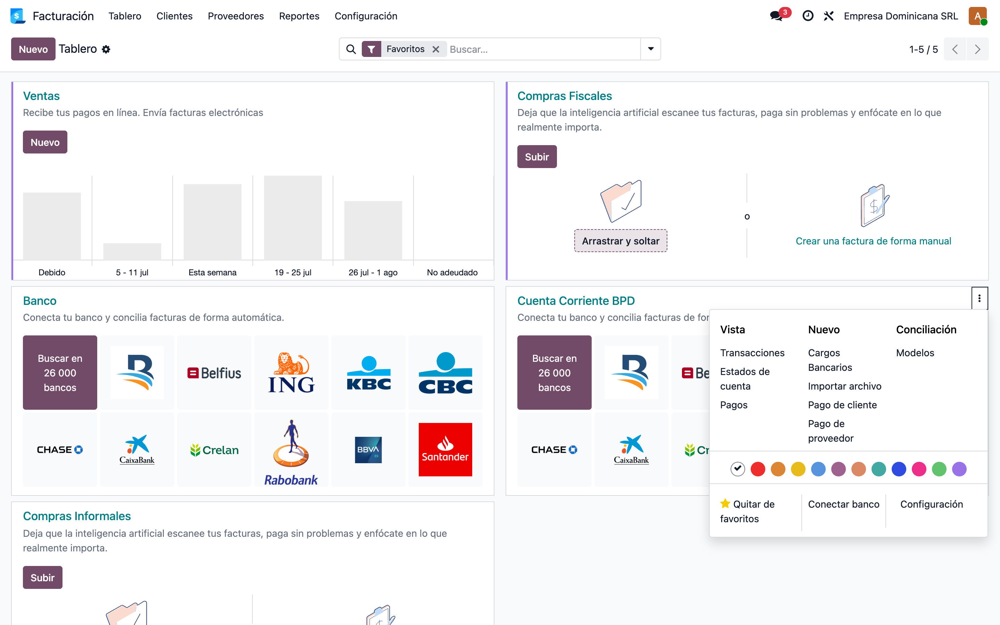
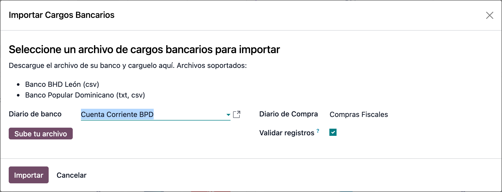
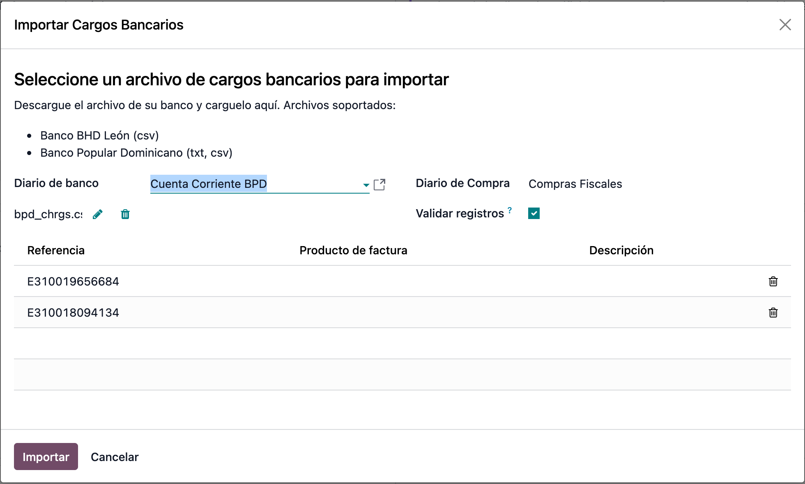
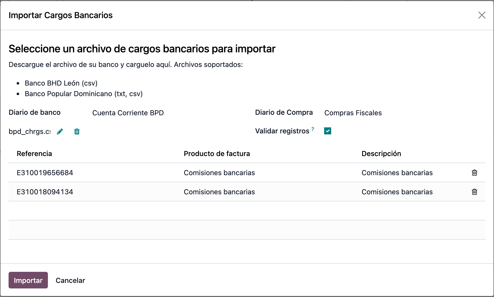
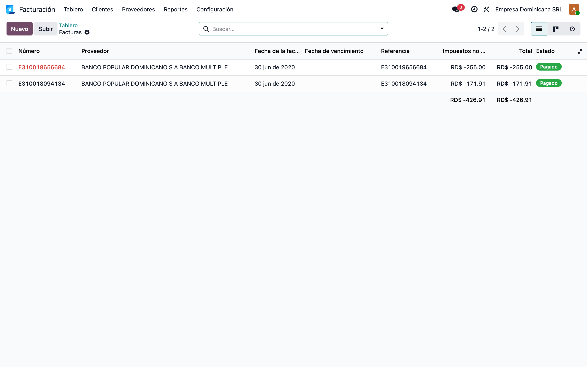
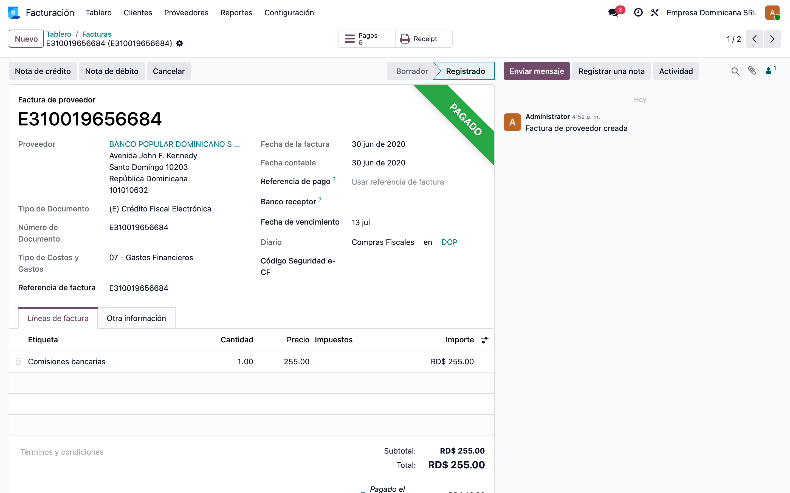
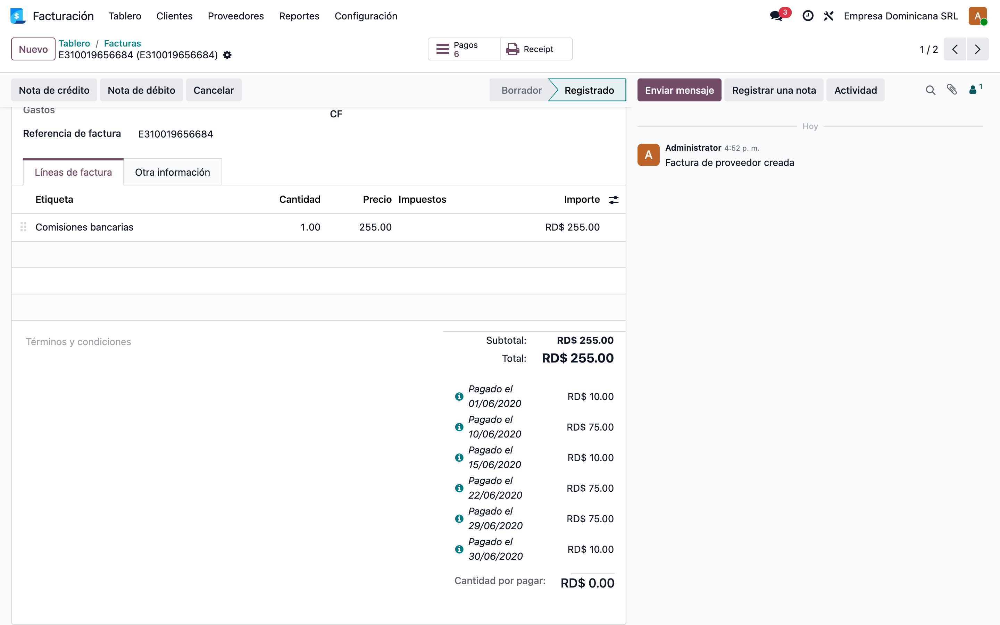

# Importación de Cargos Bancarios RD (l10n_do_bank_charges_import)

> Manual generado con `tools/manual-generator`. Las capturas se regeneran ejecutando el generador contra una base `test_v19_<módulo>`.

Este manual muestra, **desde una base de datos limpia**, cómo importar los **cargos bancarios** (comisiones, impuesto 0.15%, cargos por transferencia, etc.) desde el archivo que emite el banco, generando automáticamente por cada NCF/e-CF:

1. La **factura de proveedor** a nombre del banco (el proveedor se crea solo con su RNC si no existe), con su **NCF/e-CF** como número de documento fiscal y **Tipo de Gasto 07 — Gastos Financieros**.
2. Los **pagos** en el diario de banco, uno por cada movimiento del archivo, **conciliados** contra la factura.

Bancos soportados: **Banco Popular Dominicano** (txt, csv) vía `account_bank_charge_import_bpd` y **Banco BHD León** (csv) vía `account_bank_charge_import_bhd`. El banco se detecta por el campo **Banco RD** (`l10n_do_bank`) del banco configurado en la cuenta bancaria del diario.

> **Replicar todo automáticamente** (crea base limpia, instala, siembra y captura):
> ```bash
> cd tools/manual-generator
> ./generate-manual.sh --module=l10n_do_bank_charges_import
> ```
> La base se siembra con `configs/l10n_do_bank_charges_import.seed.py` (compañía RD con plan contable dominicano, diario de banco BPD con la cuenta 0000809972854, dos diarios de compras fiscales y un producto de servicio) y se importa el archivo de ejemplo `account_bank_charge_import_bpd/bpd_charges_file/bpd_chrgs.csv`.

## Requisitos previos

- Módulos **`l10n_do_bank_charges_import`** + el módulo del banco (**`account_bank_charge_import_bpd`** y/o **`account_bank_charge_import_bhd`**) instalados.
- Compañía con localización RD: plan contable dominicano, **moneda DOP** y **RNC** configurado.
- Un **diario de banco** cuya **cuenta bancaria** tenga como banco un `res.bank` con **Banco RD** (`l10n_do_bank`) = Banco Popular o BHD — así se detecta el formato del archivo. Ojo: el campo *Banco* del diario es relativo a la cuenta bancaria; el banco se asigna en la cuenta, no en el diario.
- Un **diario de compras fiscal** (con *Usar documentos* activo) donde se registrarán las facturas del banco; si hay más de uno, el asistente muestra el campo **Diario de Compra** para elegir.
- Un **producto de servicio** (p. ej. «Comisiones bancarias») con cuenta de gasto, para asignar a cada NCF del archivo.
- El archivo de cargos descargado del banco (BPD: reporte de comprobantes fiscales en csv/txt).

## 1. Punto de entrada: tarjeta del diario de banco

**Contabilidad → Tablero.** En la tarjeta del **diario de banco** (aquí *Cuenta Corriente BPD*), el menú **⋮** muestra la opción **Cargos Bancarios** en la columna *Nuevo*. El enlace solo aparece en diarios de tipo *banco*.



## 2. El asistente de importación

Al pulsar **Cargos Bancarios** se abre el asistente **Importar Cargos Bancarios** con:

- **Diario de banco** — precargado con el diario desde el que se abrió (contra este diario se registran los pagos).
- **Sube tu archivo** — el archivo de cargos descargado del banco; arriba se listan los formatos soportados según los módulos de banco instalados.
- **Diario de Compra** — visible solo cuando la compañía tiene **más de un** diario de compras fiscal; permite elegir en cuál registrar las facturas.
- **Validar registros** — si está activo (por defecto), las facturas se **publican** y los pagos se **concilian** automáticamente; si se desactiva, todo queda en borrador para revisión manual.



## 3. Cargar el archivo del banco

Al seleccionar el archivo (aquí `bpd_chrgs.csv` del Banco Popular), el asistente lo lee y carga **una línea por cada NCF/e-CF** encontrado — en el ejemplo, dos e-CF tipo 31 (`E310018094134` y `E310019656684`).

Si el archivo no corresponde al banco del diario (o la cuenta bancaria del diario no tiene un banco con **Banco RD** configurado), no se carga ninguna línea y aparece la advertencia *«No se pudo cargar ninguna factura del archivo dado»*.



## 4. Asignar el producto a cada NCF

Cada línea (NCF) debe tener un **producto** — es el que define la **cuenta de gasto** de la factura y la descripción de su línea. Se puede usar un mismo producto de servicio genérico («Comisiones bancarias») o productos distintos por tipo de cargo. La **cuenta analítica** y las **etiquetas** son opcionales (aparecen con la contabilidad analítica activa).

Si alguna línea queda sin producto, el asistente detiene la importación con *«Todas las referencias de facturas deben estar relacionadas a un producto»*.



## 5. Importar: facturas de proveedor generadas

Al pulsar **Importar**, el asistente genera por cada NCF una **factura de proveedor** a nombre del banco (creándolo con su RNC si no existe) en el **diario de compras fiscal**, y registra en el **diario de banco** un pago por cada movimiento del archivo, conciliado contra la factura. Con **Validar registros** activo, las facturas quedan **publicadas** y **pagadas**.

Al terminar se abre el listado de facturas de proveedor: `E310019656684` por **RD$255.00** y `E310018094134` por **RD$171.91**, ambas en estado **Pagado**.



## 6. La factura fiscal resultante

Cada factura queda con:

- **Proveedor**: el banco (BANCO POPULAR DOMINICANO S A BANCO MULTIPLE, RNC 101010632), creado automáticamente si no existía.
- **Tipo de Documento**: al ser un e-CF tipo **E31**, se asigna *(E) Crédito Fiscal Electrónica* (para **E34** sería la *Nota de Crédito Electrónica*).
- **Número de Documento**: el NCF/e-CF del archivo.
- **Tipo de Costos y Gastos: 07 — Gastos Financieros** (requisito DGII para el 606).
- **Fecha**: el último día del mes de los movimientos (30/06/2020).
- **Diario**: el diario de compras fiscal elegido.



## 7. Línea de gasto y pagos conciliados

La factura tiene **una línea** con el producto asignado por el **total de los movimientos** de ese NCF (aquí RD$255.00 = 6 comisiones del mes), y debajo del total aparecen los **pagos individuales conciliados** — uno por cada movimiento del archivo, con su fecha real (01/06, 10/06, 15/06, 22/06, 29/06 y 30/06). La factura queda en estado **PAGADO** y el botón inteligente **Pagos** enlaza los asientos del diario de banco.



## 8. Detalles del flujo

- **Detección del banco**: el asistente compara el campo **Banco RD** (`l10n_do_bank`) del banco de la cuenta bancaria del **diario de banco**. Si el diario no tiene cuenta/banco, o el banco no tiene `l10n_do_bank`, el archivo no se reconoce.
- **Moneda**: la moneda del archivo (RD$/US$) debe coincidir con la del diario de banco; si no, el asistente lo rechaza.
- **Diario de Compra**: con un solo diario de compras fiscal, el campo se oculta y se usa automáticamente.
- **Validar registros desactivado**: las facturas y pagos se crean en **borrador**, sin conciliar — útil para revisar antes de publicar.

## Notas

Los montos del ejemplo salen de `bpd_chrgs.csv`: e-CF `E310018094134` por **RD$171.91** (4 pagos del impuesto 0.15% DGII) y `E310019656684` por **RD$255.00** (6 comisiones). El asistente y sus mensajes están traducidos al español (es_DO) desde `account_bank_charge_import_base 19.0.1.0.3` y `l10n_do_bank_charges_import 19.0.1.0.1`.
