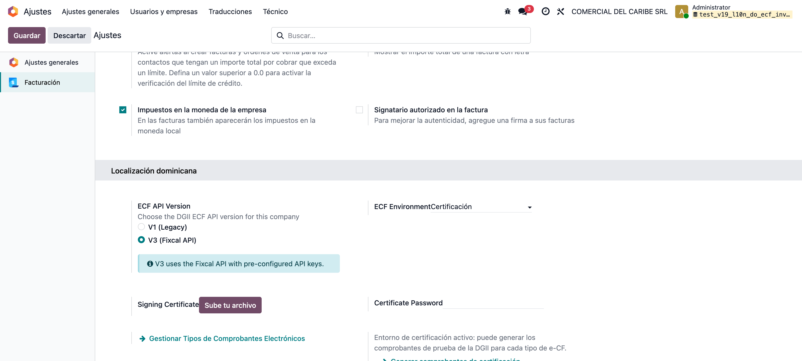
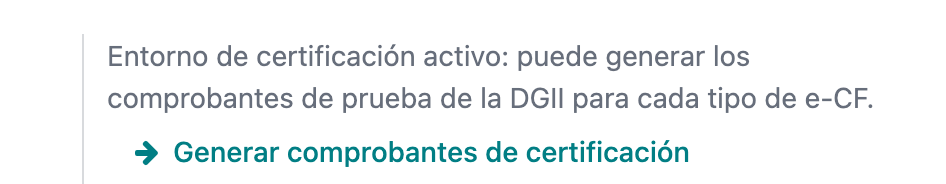
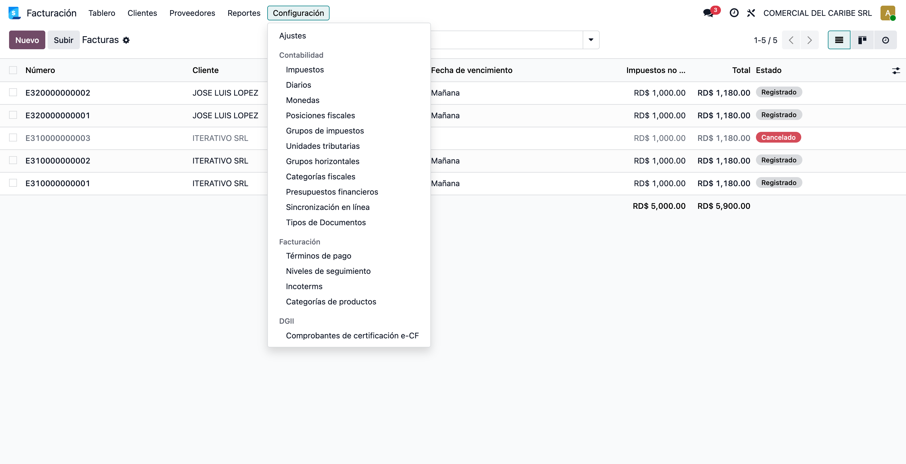
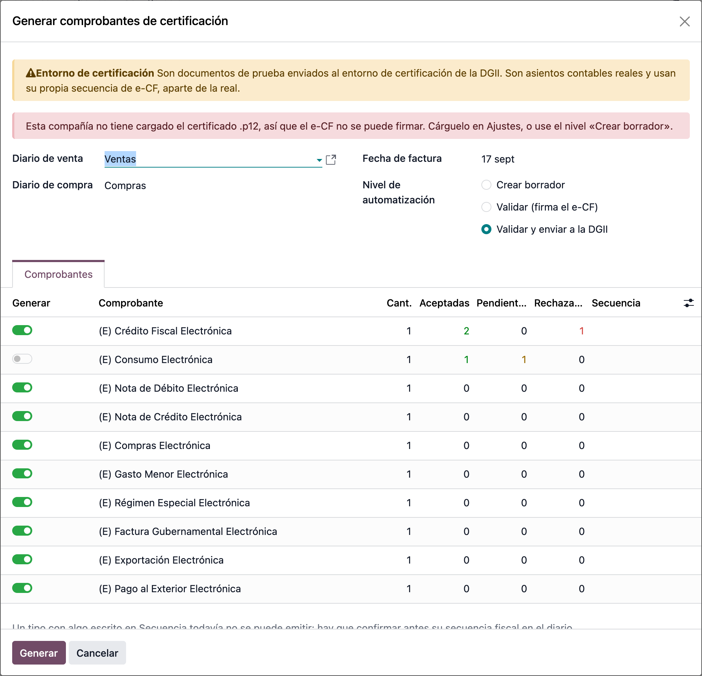
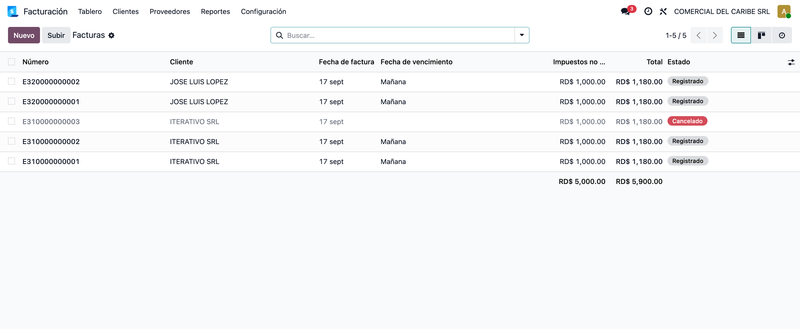
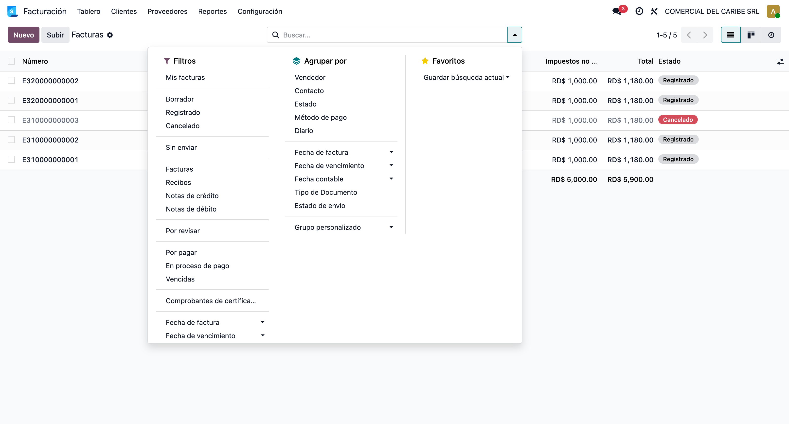
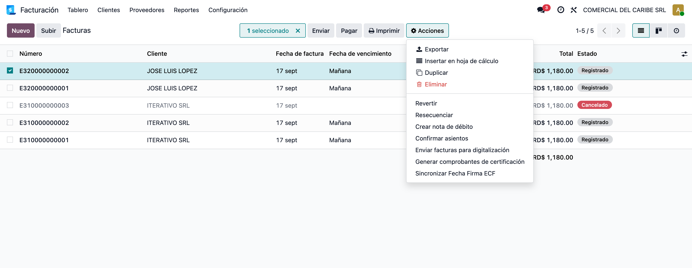

# Comprobantes de certificación DGII — Manual de usuario

> Manual generado con `tools/manual-generator`: `node capture.mjs --config=/Users/luisfernandez/repos/dev_env_odoo_pro-19/tools/manual-generator/configs/l10n_do_ecf_invoicing.json --db=test_v19_l10n_do_ecf_invoicing`. Las capturas se regeneran corriendo ese comando contra la base de pruebas.

Para certificarse ante la DGII como emisor electrónico hay que emitir un set de comprobantes de prueba: al menos uno de cada tipo de e-CF que la empresa vaya a usar (31 Crédito Fiscal, 32 Consumo, 33 Nota de Débito, 34 Nota de Crédito, 41 Compras, 43 Gasto Menor, 44 Régimen Especial, 45 Gubernamental, 46 Exportación y 47 Pago al Exterior). Hasta ahora eso se hacía factura por factura, a mano, y cada rechazo de la DGII obligaba a repetir el trabajo.

**Generar comprobantes de certificación** los crea en masa desde una sola pantalla. Aparece **solo mientras el entorno e-CF de la compañía está en Certificación**, arma cada tipo con la contraparte, el producto y los impuestos que ese tipo exige, y deja elegir hasta dónde llega la automatización: crear el borrador, validarlo (que es cuando se firma el e-CF) o validarlo y enviarlo a la DGII.

Se puede ejecutar tantas veces como haga falta. Al abrirla otra vez muestra, por tipo, cuántos comprobantes aceptó la DGII, cuántos están pendientes y cuántos rechazó, y propone reponer justo los rechazados. Un e-CF rechazado nunca se reenvía: se emite uno nuevo, con NCF nuevo.

Los comprobantes salen de los diarios y de las **secuencias fiscales que la compañía ya tiene configuradas**: el entorno de Certificación no es producción, así que no hay nada que separar.

**Base de datos de las capturas:** Base de pruebas `test_v19_l10n_do_ecf_invoicing`, compañía **COMERCIAL DEL CARIBE SRL** (RD, RNC 131793916, plan contable dominicano), marcada como emisora de e-CF y con el entorno del servicio en **Certificación**. La siembra deja una primera tanda ya generada —tres E31 y dos E32— con las respuestas de la DGII simuladas: dos E31 y una E32 aceptadas, una E32 pendiente y una E31 rechazada. Así las pantallas muestran el caso real, que es el de una certificación a medio camino.

## Requisitos previos

- Módulo **`l10n_do_ecf_invoicing`** instalado (versión 19.0.1.1.0 o superior).
- Compañía con **país República Dominicana**, RNC válido y dirección: sin eso la DGII rechaza el e-CF y el asistente ni siquiera abre.
- Compañía marcada como **emisora de e-CF**.
- **Entorno del servicio e-CF en Certificación** (`CerteCF`). En Prueba o en Producción la opción no aparece, y si se llama de todos modos el sistema la rechaza.
- Usuario con el permiso **Contabilidad: Administrador**.
- Diarios de venta y de compra con **documentos fiscales activados**, y los tipos de e-CF habilitados en ellos: solo los tipos habilitados se ofrecen en el asistente.
- Si la compañía usa el **gestor de secuencias** (`l10n_do_document_pools`), cada tipo necesita su **secuencia fiscal confirmada** en el diario. El asistente avisa tipo por tipo cuando falta.
- Para los niveles *Validar* y *Validar y enviar*: **certificado .p12 y su contraseña** cargados en la compañía. Sin ellos el asistente se detiene antes de crear nada y solo queda disponible el nivel *Crear borrador*.

## 1. El entorno tiene que estar en Certificación

**Ajustes → Contabilidad**, sección *República Dominicana*. El selector **ECF Environment** es el que manda: mientras diga **Certificación**, el generador existe; en *Prueba* o en *Producción* desaparece.

Este selector solo se ve con el **modo desarrollador** activo, así que normalmente lo deja puesto el consultor que configura la facturación electrónica.

Debajo van el certificado `.p12` y su contraseña, que hacen falta para los niveles *Validar* y *Validar y enviar*.

## 2. El botón en los ajustes

En la misma sección, debajo de *Administrar tipos de documento ECF*, aparece el recuadro del generador con el aviso de que el entorno de certificación está activo.

Es la puerta de entrada para el perfil administrador: quien configura el e-CF ya está en esta pantalla. El recuadro **solo se dibuja si el entorno es Certificación**, así que no hay forma de lanzarlo por descuido desde una compañía en producción.

## 3. El menú de Contabilidad

La segunda entrada está en **Contabilidad → Configuración → DGII → Comprobantes de certificación e-CF**. Es la ruta de uso habitual: el mismo asistente, sin pasar por los ajustes generales ni por el modo desarrollador.

Requiere el permiso **Contabilidad: Administrador**.

## 4. El asistente, con el avance de lo ya emitido

El asistente trae **una línea por cada tipo de e-CF habilitado** en los diarios de la compañía. Si un tipo no aparece, es que la compañía no lo tiene habilitado: eso se corrige en *Administrar tipos de documento ECF*, no aquí.

La columna **Generar** decide qué se emite, y **Cant.** cuántos de cada tipo.

Las tres siguientes son el avance de la certificación, leído de los comprobantes ya emitidos:

- **Aceptadas** — la DGII las aprobó.
- **Pendientes** — enviadas y todavía sin respuesta, o aún sin enviar.
- **Rechazadas** — la DGII las devolvió; el módulo ya las canceló.

En la captura se ve una certificación a medio camino: el Crédito Fiscal tiene dos aceptadas y una rechazada, así que viene marcado para reponerla; el Consumo tiene una aceptada y una pendiente, así que viene desmarcado —un toque en **Generar** basta para emitir otro—; y los tipos que todavía no se han probado vienen marcados con cantidad **1**.

**Contraparte**, **Producto** y **Precio** se pueden ajustar por línea: se muestran con el botón de columnas opcionales, arriba a la derecha de la tabla.

El recuadro rojo de la captura aparece cuando se elige un nivel que firma y la compañía todavía no tiene cargado el certificado `.p12`. Mientras esté ahí, **Generar** no crea nada: el asistente avisa primero en vez de dejar una tanda de borradores inservibles.

## 5. Hasta dónde llega la automatización

El **nivel de automatización** decide qué hace el botón *Generar*:

| Nivel | Qué hace | Cómo quedan |
|---|---|---|
| **Crear borrador** | Solo crea las facturas | En borrador, sin NCF todavía: el e-CF nace al validar |
| **Validar (firma el e-CF)** | Valida y firma el XML | *Firmado pendiente*, con su NCF y su código de seguridad |
| **Validar y enviar a la DGII** | Valida, firma y envía | *Entregado pendiente*, con su TrackID |

El estado final (aceptado o rechazado) lo cierran los procesos automáticos que ya corren cada 15 minutos, o el botón **Update ECF Now** de la propia factura.

**Los dos niveles que firman necesitan el certificado `.p12` de la compañía.** Sin él, el asistente no genera nada y explica dónde cargarlo: *Ajustes → Contabilidad → República Dominicana*. Es a propósito: firmar es lo que convierte la factura en e-CF, y sin certificado cada documento fallaría uno por uno al validar, dejando borradores que no sirven.

Otros dos detalles que conviene saber de antemano:

- El **41 (Compras)** no queda firmado al validar. Es así en la operación normal del módulo, no un problema del generador: se queda esperando al proceso automático.
- Las **notas de crédito y débito** necesitan una factura E31 **ya validada** en la misma tanda. Con *Crear borrador* no hay ninguna, así que se omiten y el asistente lo avisa.
- Con *Validar y enviar* se hace **una llamada por documento** a la DGII. Para tandas grandes conviene ir por bloques.

## 6. Los comprobantes generados

Al pulsar **Generar**, el asistente deja en pantalla los comprobantes que acaba de crear. Son facturas normales: se abren, se revisan y se envían como cualquier otra.

Aquí se ve lo que trae cada una: el tipo de documento correcto, la contraparte que ese tipo exige y su NCF, tomado de la **secuencia fiscal que la compañía ya tiene configurada** para ese tipo. No hay numeración aparte: en Certificación la instancia no es productiva, así que los comprobantes de prueba consumen la misma secuencia que el resto.

## 7. Ver solo los comprobantes de certificación

En la lista de facturas, el filtro **Comprobantes de certificación** deja a la vista únicamente los comprobantes de prueba. Es la forma de separarlos de la facturación real sin buscarlos uno por uno.

Combinado con *Agrupar por → Estado de envío* se ve, en una sola pantalla, cuántos están aceptados, cuántos pendientes y cuántos rechazados; que es exactamente el avance que la DGII va a revisar.

## 8. Lanzarlo desde la propia lista de facturas

La tercera entrada está en el menú **Acciones** de la lista de facturas: **Generar comprobantes de certificación**.

Es la ruta pensada para que el usuario se certifique solo, sin entrar a los ajustes de la compañía. No depende de los registros seleccionados: abre el mismo asistente.

## 9. Repetir cuando la DGII rechaza

Un e-CF rechazado **no se puede reenviar**: la DGII exige un comprobante nuevo, con NCF nuevo. El módulo ya cancela solo las facturas que la DGII devuelve, así que no hay nada que limpiar a mano.

Para reponerlas basta con abrir otra vez el asistente: la columna **Rechazadas** dice cuántas fallaron por tipo y la cantidad propuesta ya viene con ese número. Se revisa y se pulsa **Generar**.

Los tipos que van bien vienen con cantidad **0** y desmarcados, para no duplicar trabajo. Por eso el asistente se puede abrir cuantas veces haga falta sin llevar la cuenta aparte.

## 10. De dónde sale el NCF de los comprobantes de prueba

De la **secuencia fiscal de la compañía**, igual que cualquier otra factura. El entorno de Certificación existe precisamente para eso: la instancia no está en producción, así que no hace falta inventar una numeración aparte.

Esto importa cuando la compañía usa el **gestor de secuencias** (`l10n_do_document_pools`): ahí un documento solo se puede numerar desde un talonario en estado **válido**, con su número de autorización y su rango. Si el talonario de un tipo está sin confirmar, agotado o vencido, ese tipo **no se puede emitir todavía**.

Por eso el asistente lo revisa antes: el tipo aparece con el motivo en la columna **Secuencia**, viene desmarcado, y si se fuerza, el asistente lo dice en vez de dejar borradores que no se pueden validar. La solución está en el diario: *Contabilidad → Configuración → Diarios → pestaña de tipos de documento*, cargar el rango autorizado por la DGII y confirmarlo.

Si la compañía tiene más de un diario fiscal, se usa aquel con el que realmente factura: el que tiene las secuencias confirmadas y los documentos emitidos.

## 11. Contrapartes, producto e impuestos de prueba

La primera vez, el asistente crea los contactos que cada tipo de e-CF exige, y los reutiliza después:

| Contacto | RNC / Cédula | Tipo de contribuyente | Se usa en |
|---|---|---|---|
| ITERATIVO SRL | 131566332 | Contribuyente fiscal | E31, E33, E34 |
| JOSE LUIS LOPEZ | 22400559690 | No contribuyente | E32, E41, E43 |
| ZONA FRANCA INDUSTRIAL DE LAS AMERICAS S A | 101168481 | Régimen especial | E44 |
| MINISTERIO DE INDUSTRIA Y COMERCIO Y MIPYMES | 401007355 | Gubernamental | E45 |
| ECF CERTIFICATION FOREIGN CUSTOMER | 847898798 | Extranjero | E46, E47 |

Son RNC reales y válidos: el validador de RNC rechaza los inventados. Si la DGII entrega otros en el set de pruebas, se cambian en la misma línea del asistente.

También se crea el producto **Producto de certificación e-CF**, de tipo bien, porque el 46 de Exportación no admite servicios.

Los impuestos los pone el generador según el tipo:

| Tipo | Impuestos |
|---|---|
| E31, E32, E45 | ITBIS 18 % de venta |
| E44 Régimen Especial | Sin impuestos |
| E46 Exportación | ITBIS exento |
| E41 Compras | ITBIS 18 % de compra + retención 100 % ITBIS + retención 10 % ISR |
| E43 Gasto Menor | ITBIS 18 % de compra |
| E47 Pago al Exterior | Retención 27 % ISR remesas al exterior |

## Notas

## Mensajes que puede mostrar

| Mensaje | Qué significa |
|---|---|
| *Esta acción solo está disponible mientras el entorno e-CF de la compañía sea «Certificación»* | El entorno está en Prueba o en Producción |
| *La compañía debe estar configurada como emisora de e-CF* | Falta marcar la compañía como emisora |
| *Los comprobantes de certificación solo pueden emitirse desde compañías dominicanas* | La compañía activa no es de República Dominicana |
| *… omitido: necesita un documento E31 validado* | Se pidió una nota de crédito o débito con el nivel *Crear borrador* |
| *Seleccione al menos un tipo de documento con una cantidad mayor que cero* | No hay nada marcado en la tabla |
| *Firmar el e-CF requiere el certificado .p12 de la compañía y su contraseña…* | Se eligió *Validar* o *Validar y enviar* y la compañía no tiene el certificado cargado |
| *… omitido: Secuencia fiscal sin confirmar* | Ese tipo no tiene su talonario confirmado en el diario |
| *… omitido: Secuencia fiscal agotada / vencida* | El talonario de ese tipo se acabó o pasó su fecha de vencimiento |

## Antes de pasar a producción

- Los comprobantes de certificación son **asientos contables reales**. Si la certificación se hace sobre la base de datos de producción, hay que contar con ellos al presentar 606, 607, 608 e IT-1.
- Mientras existan timbres emitidos en Certificación, **la compañía no puede cambiar el entorno a Producción**. Es una validación del propio módulo, y es la razón principal para certificar en una base de datos aparte.
- Tras certificar, *Habilitar primera secuencia fiscal* queda apagado para los tipos usados, porque ya existe un documento posteado de ese tipo. Si producción tiene que arrancar en un número autorizado concreto, se configura con el gestor de secuencias (`l10n_do_document_pools`).
