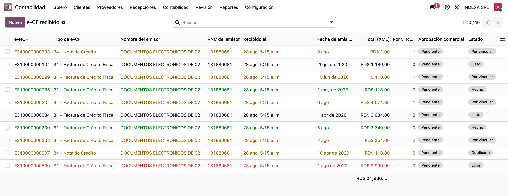
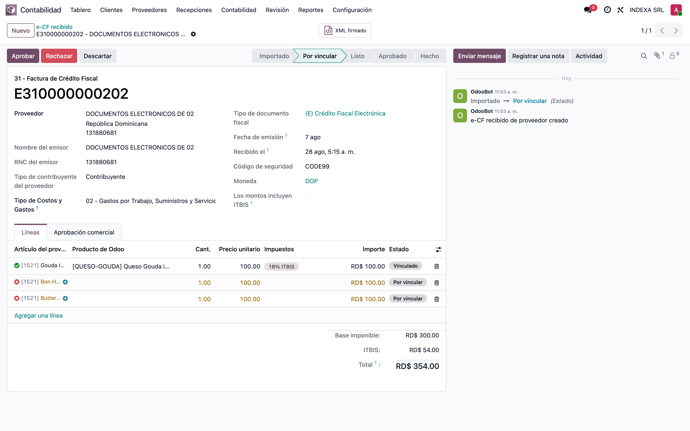
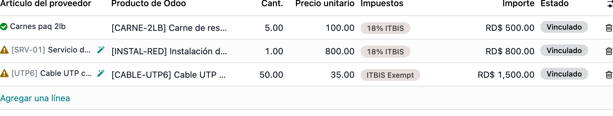
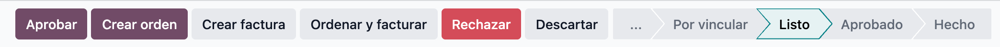
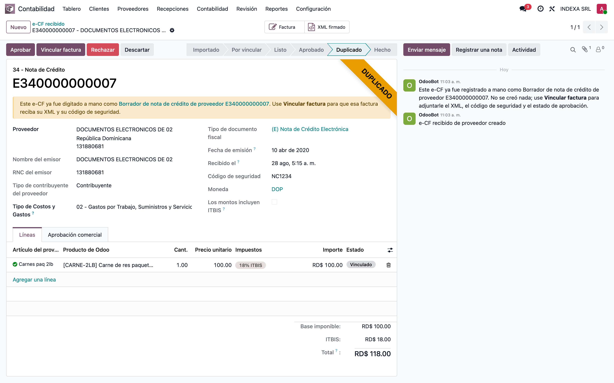
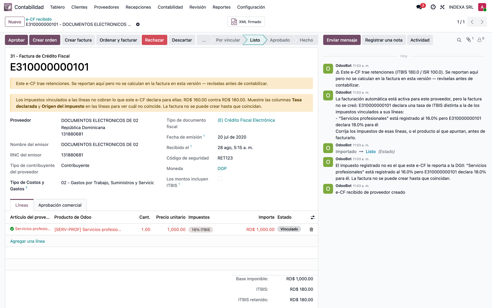
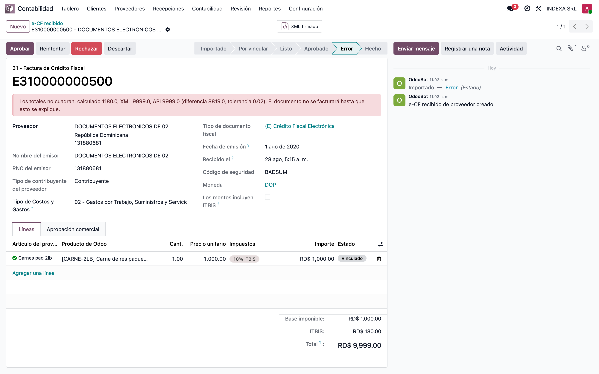
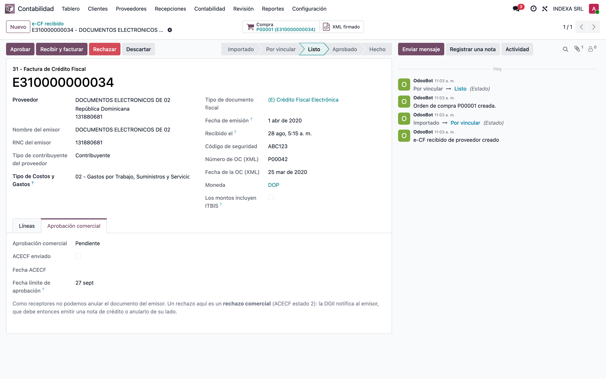

# Recepción de e-CF de Proveedores — Manual de usuario

> Manual generado con `tools/manual-generator`: `node capture.mjs --config=configs/l10n_do_ecf_purchase_reception_usuario.json --db=unused`. Las capturas se regeneran corriendo ese comando contra la base de pruebas.

Sus proveedores emiten facturas electrónicas (e-CF) y se las reportan a la DGII. Este módulo las trae solas a Odoo todas las noches y las deja en una bandeja.

Usted hace una sola cosa: decir a qué producto suyo corresponde cada línea de la factura del proveedor. Después da un botón y Odoo crea la orden de compra o la factura de proveedor, ya con su e-NCF, su código de seguridad y el XML firmado. Nada se contabiliza solo.

## Requisitos previos

- El administrador prende el módulo una vez; usted no configura nada.
- Hace falta el permiso **Administrador de facturación** para ver el menú.
- Todo vive en **Contabilidad ▸ Proveedores ▸ Recepciones**.

## La bandeja: qué le llegó de sus proveedores

**Contabilidad ▸ Proveedores ▸ Recepciones ▸ e-CF recibido.** Cada línea es una factura que un proveedor ya le reportó a la DGII.

El estado dice qué falta:

- **Por vincular** — hay que decirle a Odoo qué producto es cada línea.
- **Listo** — no falta nada, sólo dar el botón.
- **Hecho** — ya tiene su factura en Odoo.
- **Duplicado** — esa factura ya la digitaron a mano.
- **Error** — los montos del documento no cuadran.

La columna **Por vincular** dice cuántas líneas le faltan a cada documento.

## Cómo se lee un documento

Arriba, quién le facturó y con qué documento. Abajo, en **Líneas**, lo que le vendieron: artículo, cantidad, precio, ITBIS y total.

Nada de eso se escribe a mano ni se puede cambiar: es lo que el proveedor le reportó a la DGII, tal como salió del XML firmado. Lo único que le toca a usted es la columna **Producto de Odoo**.

## Diga qué producto suyo es cada línea

Es la única tarea manual, y sólo la primera vez que ese proveedor le vende ese artículo.

- En **Producto de Odoo**, escoja el producto que corresponde al artículo del proveedor.
- La **varita** guarda el vínculo: la próxima factura de ese proveedor se vincula sola.
- El **+** crea el producto en Odoo cuando todavía no existe, con el nombre y el impuesto de la factura.

El icono a la izquierda del artículo dice cómo va cada línea:

- Visto verde — vínculo guardado; ese artículo se reconoce solo de aquí en adelante.
- Triángulo amarillo — producto puesto, vínculo sin guardar: dé la varita.
- Equis roja — todavía sin producto: escójalo, o créelo con el **+**.

Cuando ya ninguna línea queda pendiente, el documento pasa a **Listo**.

## Cree la orden o la factura

Con el documento en **Listo**, escoja el botón según cómo se compró:

- **Crear factura** — compra sin orden: sale la factura de proveedor.
- **Crear orden** — sólo la orden de compra, para recibir la mercancía después.
- **Ordenar y facturar** — la orden, la recepción y la factura de un tirón.
- **Recibir y facturar** — aparece en lugar de los otros cuando la orden ya existe.

La factura nace en **borrador**, con el e-NCF, el código de seguridad y el XML del proveedor. Revísela y contabilícela como cualquier otra.

## «Esa factura ya la digité a mano»

El documento llega marcado **Duplicado** y le dice con cuál factura suya coincide.

Dé **Vincular factura**: no se crea nada nuevo; su factura de siempre se queda con el XML y el código de seguridad del proveedor.

## «El ITBIS del producto no es el que facturó el proveedor»

La línea sale en rojo y arriba aparece el aviso. Odoo respeta el impuesto de su producto y no deja crear la factura hasta que se aclare, porque uno de los dos está mal:

- Si el equivocado es su producto, corrija el impuesto en la ficha del producto.
- Si el equivocado es el proveedor, pídale la nota de crédito o use **Rechazar**.

## «Los montos no cuadran»

Estado **Error**: lo que suman las líneas no da el total que declaró el proveedor. Eso no se arregla en Odoo.

**Reintentar** vuelve a bajar el documento por si falló la descarga. Si sigue igual, es el proveedor quien tiene que corregirlo.

## Aprobar o rechazar ante la DGII

La pestaña **Aprobación comercial** es su respuesta al proveedor delante de la DGII.

- **Aprobar** — usted reconoce la compra.
- **Rechazar** — usted no la reconoce: la DGII avisa al proveedor, que tendrá que emitir una nota de crédito o anular el documento.

Hay una **Fecha límite de aprobación** contada desde que el documento llegó. Rechazar no toca la factura que ya se haya creado.

## Notas

**Hay proveedores que se facturan solos.** Si el administrador marcó un proveedor con *Facturar sus e-CF automáticamente*, sus documentos aparecen ya en **Hecho** y con la factura en borrador esperando, siempre que todas las líneas se hayan vinculado solas. Lo que se automatiza es la digitación, nunca la contabilización.

**Cada documento sale por un solo camino.** Al escoger orden o factura, los demás botones desaparecen: un e-CF termina en una sola factura, que es como la DGII lo tiene registrado.

**Facturas con retenciones.** Cuando el e-CF trae retenciones, el documento se lo avisa arriba: se muestran aquí pero no se calculan en la factura. Revíselas antes de contabilizar.

**Si no ve un documento en la bandeja**, quite el filtro de la barra de búsqueda: la lista abre mostrando sólo lo pendiente.
