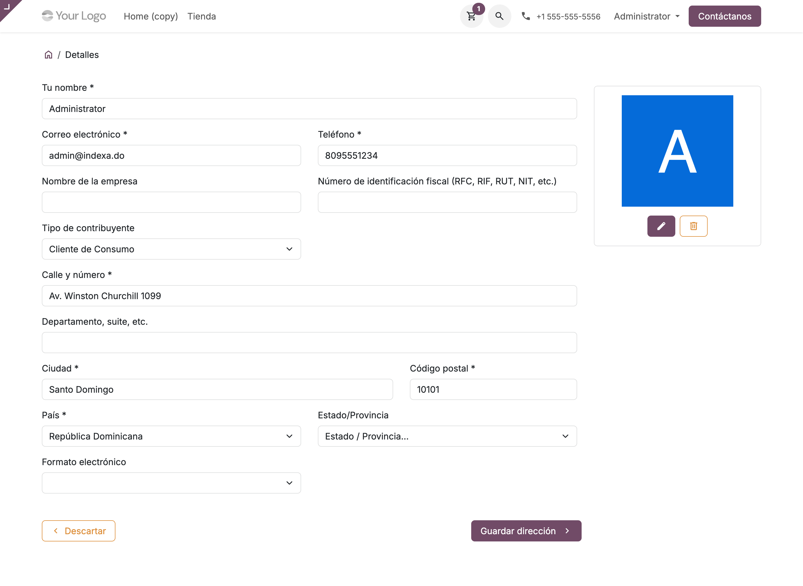
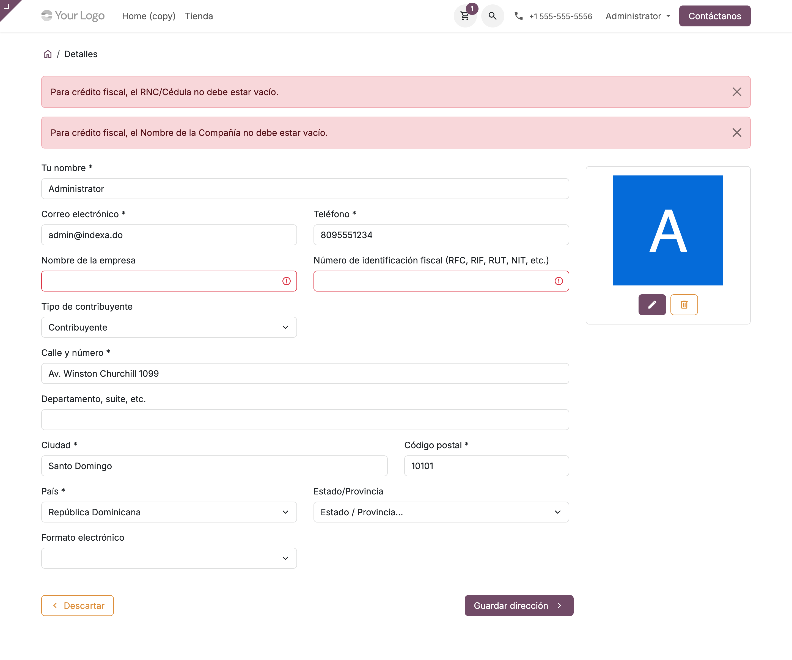
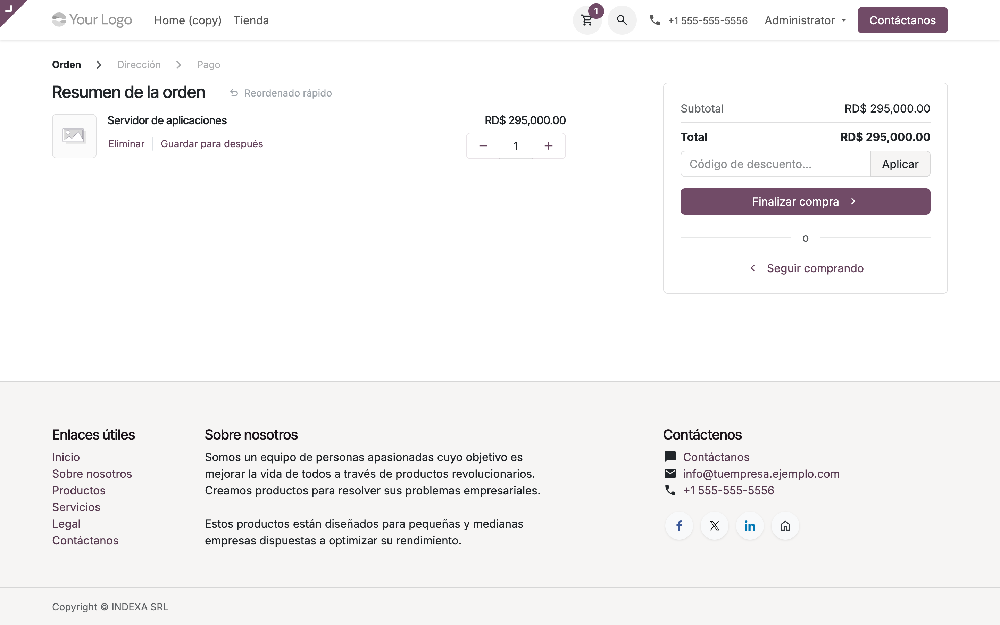
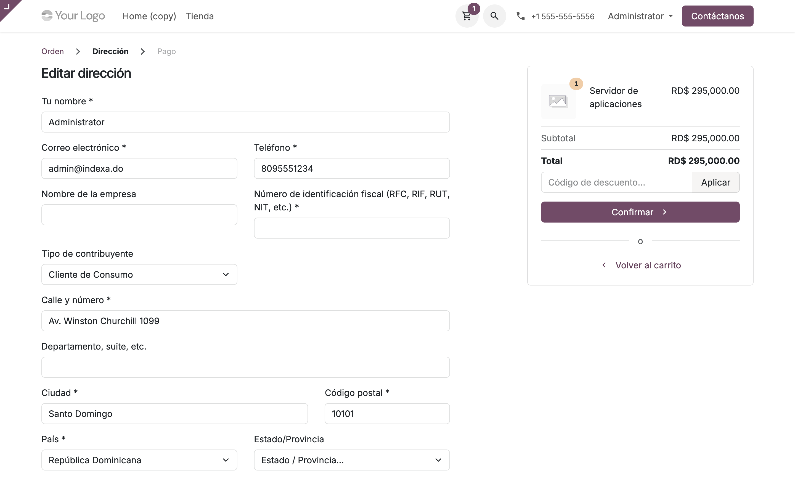
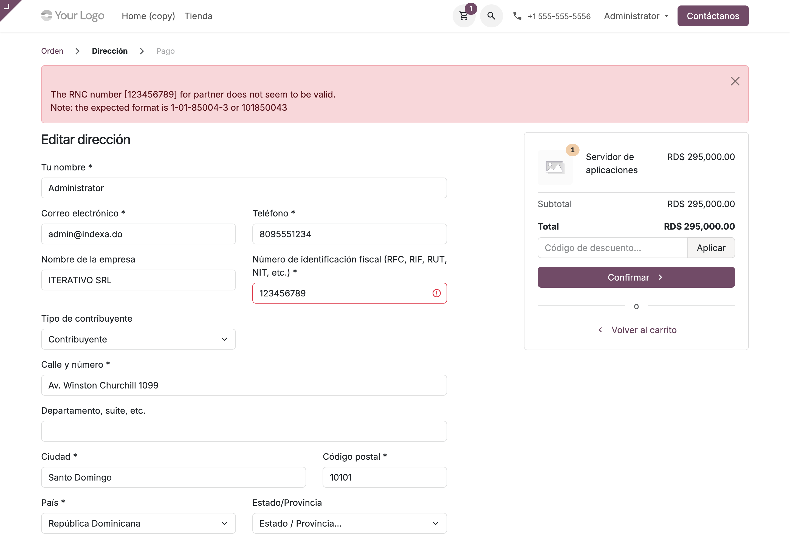

# Localización dominicana del checkout y del portal — Manual de usuario (l10n_do_ecommerce)

> Manual generado con `tools/manual-generator`. Las capturas se regeneran ejecutando el generador contra una base `test_v20_<módulo>`.

Este módulo le agrega al **formulario de dirección** de Odoo —el del checkout de la tienda y el del portal del cliente— lo que la DGII exige para poder emitir un comprobante fiscal: el **tipo de contribuyente**, la obligación de traer RNC y razón social cuando se pide crédito fiscal, y el umbral de **250,000 DOP** por encima del cual el número de identificación deja de ser opcional.

Odoo por sí solo trae el campo *NIF* y, desde la serie 20.0, **valida** que un RNC o una cédula dominicana estén bien formados. Lo que no sabe es qué significa ese número para la DGII: si el cliente es contribuyente, consumidor final, gubernamental o extranjero. Esa clasificación (`l10n_do_dgii_tax_payer_type`, que aporta `l10n_do_accounting`) es la que decide después el tipo de comprobante que lleva la factura, y hasta ahora solo se podía capturar desde el backend.

Qué agrega, en concreto:

- El **selector de tipo de contribuyente** junto al NIF, en `/my/account`, `/my/address` y `/shop/address`, con una sola herencia de `portal.address_form_fields`.
- Una **regla fiscal**: una dirección de facturación marcada como *Contribuyente* o *Gubernamental* no se guarda sin RNC y sin razón social. El error vuelve como error de formulario, junto al campo.
- El **umbral de 250,000 DOP**: por encima de ese total el NIF pasa a ser un campo obligatorio de la dirección, marcado como tal en el navegador **y exigido en el servidor**.
- **Autocompletado del RNC** contra el servicio de Indexa/DGII mientras se teclea.
- **Sincronía país ↔ tipo**: un país que no sea República Dominicana fuerza *Extranjero*; al volver a RD se cae a *Cliente de Consumo*.

## Requisitos previos

- Módulo **`l10n_do_ecommerce`** instalado (v `19.5.1.1.0`, línea 20.0 / `master`). Odoo `master` se autodeclara `19.5`, de ahí el prefijo de versión.
- Dependencias: **`website_sale`**, **`l10n_do_accounting`** (v `19.5.3.0.0`) y **`l10n_do_rnc_validation`** (v `19.5.2.0.0`).
- **Campos b2b encendidos en el sitio web** (vista `website_sale.address_b2b`). El núcleo solo dibuja razón social y NIF cuando esa opción está activa, y el selector de tipo de contribuyente se cuelga de ese bloque. Se enciende desde el editor del sitio, en la página de checkout: *Editar → Checkout → Mostrar campos b2b*.
- Compañía con **país República Dominicana** y plan contable dominicano, para que la moneda sea DOP y el umbral de 250,000 tenga sentido.
- Para el autocompletado: **salida a Internet** y un **token de la API de Indexa** en el parámetro `rnc.indexa.api.token`.

## 1. El selector en el portal del cliente (/my/account)

El campo **Tipo de contribuyente** sale justo después del NIF, dentro del bloque de datos fiscales que el núcleo llama `b2b_fields`.

Una sola herencia lo pone en los tres sitios donde se edita una dirección:

| Ruta | Plantilla que la dibuja |
|---|---|
| `/my/account` | `portal.portal_my_details` |
| `/my/address` | `portal.address_management` |
| `/shop/address` | `website_sale.address` |

Las tres hacen `t-call` de **`portal.address_form_fields`**, y el checkout usa una copia `primary` de esa misma plantilla. En la serie 19.0 había que heredar en dos sitios; en la 20.0 basta con uno.

El contacto de la captura es dominicano y no tiene NIF, así que el tipo aparece en **Cliente de Consumo**. Eso no lo decide el formulario: `l10n_do_dgii_tax_payer_type` es un campo calculado y almacenado en `l10n_do_accounting` que deduce el tipo a partir del país y del NIF. El JavaScript del módulo llega a la misma conclusión al cargar la página, así que servidor y navegador coinciden.



## 2. Sincronía país ↔ tipo de contribuyente

Al cambiar el país a **Estados Unidos**, el tipo salta a **Extranjero** sin tocar nada más. La regla es simétrica:

| Acción del usuario | Qué hace el módulo |
|---|---|
| Elige un país distinto de RD | Fuerza *Extranjero* |
| Vuelve a RD estando en *Extranjero* | Cae a *Cliente de Consumo* |
| Elige *Extranjero* teniendo RD | **Vacía el país**, para que lo vuelva a elegir |

Es JavaScript puro, sin ida al servidor: una `Interaction` pública registrada sobre `.o_customer_address_fill`, el mismo elemento sobre el que corre la interacción de dirección del núcleo. Las dos conviven.

El detalle del port: la opción de país ya no se localiza por su **id de base de datos**. Hasta la 19.0 el módulo comparaba contra `"61"`, el id de `base.do`, que no está garantizado en ninguna instalación. El núcleo ahora estampa el código ISO en cada opción (`code="DO"`, renombrado a `data-code` más adelante en el ciclo), así que el módulo busca por código y acepta las dos formas del atributo.


## 3. Crédito fiscal sin RNC: el guardado se corta

Con el tipo en **Contribuyente**, y el NIF y la razón social vacíos, *Guardar dirección* devuelve los dos errores del módulo:

> **Para crédito fiscal, el RNC/Cédula no debe estar vacío.**
> **Para crédito fiscal, el Nombre de la Compañía no debe estar vacío.**

Los dos campos quedan marcados en rojo. La regla corre en `_validate_address_values`, solo para direcciones de **facturación** y solo para los tipos *Contribuyente* y *Gubernamental*: una dirección de envío, o un consumidor final, no necesitan ninguno de los dos datos.

Dos cosas que cambiaron en este port y que se ven aquí:

- **Los mensajes salen en español.** El `es_DO.po` del módulo no llevaba el comentario `#. odoo-python` que Odoo exige desde la 16.0 para cargar una traducción de Python, así que desde entonces estos dos mensajes salían en inglés sin que nada lo avisara.
- **El campo de razón social se llama `parent_name`.** En la 19.0 era `company_name`, campo que el núcleo eliminó. El nombre viejo no fallaba con un error claro: el módulo marcaba como inválido un campo que ya no existe, y el JavaScript del núcleo hace `this.addressForm[fieldName].classList.add(...)` sobre esa lista — o sea, `TypeError` en la consola y **ningún mensaje de error visible**. El formulario simplemente no hacía nada.



## 4. Un carrito por encima del umbral

El carrito de la captura vale **295,000 DOP**, por encima de los 250,000 que marcan el límite a partir del cual la DGII espera el RNC del comprador en el comprobante.

El umbral vive en `L10N_DO_FISCAL_THRESHOLD`, en `controllers/portal.py`. Se compara contra `order_sudo.amount_total`, el total que calcula Odoo — nunca contra un valor que venga del navegador.



## 5. En el checkout, el RNC pasa a ser obligatorio

En la dirección de facturación de ese mismo carrito, la etiqueta del NIF trae el **asterisco rojo** de campo obligatorio. No lo pone este módulo directamente: el formulario lleva un input oculto `required_fields` que el núcleo lee por los dos lados, y el módulo le agrega `vat` cuando el carrito pasa del umbral.

```html
<input type="hidden" name="required_fields" value="name,email,vat"/>
```

Del lado del navegador, la interacción del portal lee ese valor, marca el input como `required` y le quita la clase `label-optional` a la etiqueta —que es lo que dibuja el asterisco—. Del lado del servidor, `_validate_address_values` lee el **mismo** valor y rechaza el guardado si llega vacío.

Esto es lo que más cambió con el port. Hasta la 19.0 el módulo mandaba el total del pedido al navegador en un input oculto `total_order`, el JavaScript lo comparaba contra 250,000 y ponía `required` a mano; el servidor **descartaba** ese valor a propósito, por no fiarse de él. El efecto neto era que la regla existía solo en el navegador: bastaba con borrar el atributo desde las herramientas de desarrollo para saltársela. Ahora el umbral se decide en el servidor y se comprueba en el servidor; el input `total_order` y el JavaScript que lo leía desaparecieron.



## 6. Un RNC mal escrito lo rechaza el núcleo

Con un RNC de nueve dígitos pero con el dígito verificador incorrecto (`123456789`), el guardado se corta con:

> **The RNC number [123456789] for partner does not seem to be valid.**
> **Note: the expected format is 1-01-85004-3 or 101850043**

Ese mensaje **ya no lo produce este módulo**. En la 19.0 el módulo traía su propia comprobación de formato —contar que fueran 9 u 11 dígitos— para adelantarse a la restricción del ORM y devolverla como error de formulario en vez de un HTTP 422. En la 20.0 `base_vat` se fusionó en `base`, `check_vat_do` valida el número **con dígito verificador** y `_validate_address_values` ya lo llama y convierte el resultado en error de formulario. La regla propia quedó redundante y más débil, así que se eliminó.

Se gana severidad y se pierde idioma: el mensaje es del núcleo y todavía no está traducido al español río arriba (`base/i18n/es.po` no lo trae), así que sale en inglés aunque el resto de la página esté en español. Es un hueco del núcleo, el mismo que documenta el manual de `l10n_do_rnc_validation`; se tapa agregando la entrada a la traducción de `base`.

La validación del núcleo solo corre si la dirección trae **país**. Sin país no se valida el número — ni el núcleo ni este módulo.



## 7. Autocompletado del RNC contra la DGII

Al teclear un RNC de 9 dígitos o una cédula de 11 en el campo de NIF, el módulo consulta `/indexa_vat_ws` (300 ms después de la última tecla) y, si el servicio conoce el número, llena la **razón social**, fija el país en **República Dominicana** y pone el tipo en **Contribuyente**. Si el usuario borra el número, la razón social se vuelve a poder editar.

`/indexa_vat_ws` es un controlador público de este módulo que reenvía la consulta a `res.partner.get_contact_data()`, que vive en `l10n_do_rnc_validation`. O sea, el checkout usa exactamente el mismo servicio que el backend cuando se crea un contacto escribiendo solo el RNC.

**Este paso no lleva captura**: la API de Indexa necesita un token (`rnc.indexa.api.token`) que una instalación recién hecha no trae, y el servicio SOAP de la DGII lleva tiempo devolviendo HTML en vez de XML. Sin ninguna de las dos fuentes el campo se queda como lo escribió el usuario, que es el comportamiento correcto: ningún fallo del servicio externo interrumpe el checkout.

Vale la pena saber que la ruta es **pública y con `cors="*"`**: cualquiera puede consultarla desde cualquier origen. No expone datos de la base —solo reenvía al servicio de contribuyentes— pero sí consume la cuota del token. Es como estaba en la 19.0; limitarla es una decisión funcional, no una tarea de port.

## 8. Qué se quedó el núcleo en la 20.0 y qué sigue aquí

| Función | 19.0 | 20.0 |
|---|---|---|
| Formato del RNC/cédula | este módulo | **núcleo** (`check_vat_do`, con dígito verificador) |
| Marcar un campo extra como obligatorio | este módulo, en JavaScript | **núcleo** (input `required_fields`) |
| Selector de tipo de contribuyente | este módulo | **este módulo** |
| RNC y razón social exigidos para crédito fiscal | este módulo | **este módulo** |
| Umbral de 250,000 DOP | este módulo (solo navegador) | **este módulo** (servidor + navegador) |
| Autocompletado contra Indexa/DGII | este módulo | **este módulo** |
| Sincronía país ↔ tipo | este módulo | **este módulo** |

El módulo salió más chico del port: un controlador menos, una plantilla menos y unas treinta líneas menos de JavaScript, todo porque el núcleo ya hacía ese trabajo.

## Notas

### Qué agrega el módulo

| Dónde | Qué | Nota |
|---|---|---|
| `CustomerPortal._prepare_address_form_values` | `fiscal_types`, `l10n_do_vat_required` | Alimenta las dos plantillas |
| `CustomerPortal._validate_address_values` | Regla fiscal de RNC y razón social | Solo facturación, solo *Contribuyente* / *Gubernamental* |
| `res.partner._get_frontend_writable_fields` | `l10n_do_dgii_tax_payer_type` | Sin esto el `<select>` se envía y el servidor lo descarta |
| `/indexa_vat_ws` | Proxy público a `get_contact_data()` | Lo consume el autocompletado |
| `l10n_do_portal_tax_type` | Hereda `portal.address_form_fields` | Cubre portal y checkout |
| `l10n_do_checkout_required_vat` | Hereda `website_sale.address_form_fields` | Agrega `vat` a `required_fields` sobre el umbral |
| `L10nDoAddress` (Interaction) | Sincronía país ↔ tipo y autocompletado | Sobre `.o_customer_address_fill` |

### Notas de la migración a la línea 20.0 (`master`)

**Roturas encontradas y corregidas:**

1. **`res.partner.company_name` fue eliminado; el formulario ahora manda `parent_name`.** El módulo leía `address_values['company_name']` y marcaba `"company_name"` como campo inválido. Lo primero hacía que la regla de razón social **nunca** se cumpliera; lo segundo rompía el JavaScript del núcleo, que hace `this.addressForm[fieldName].classList.add(...)` sobre la lista de campos inválidos: `TypeError` sobre `undefined` y, en la práctica, un formulario que al guardar no hacía nada y no mostraba ningún error.
2. **`portal.address_warning_icon` no existe en el núcleo desplegado.** Es una plantilla nueva del ciclo 20.0 que todavía no está en el nightly ni en el checkout de `odoo` de este entorno. Llamarla deja la página del portal en **HTTP 500** (`Template not found`). El módulo no la usa.
3. **El código ISO de las opciones de país.** El módulo comparaba contra el id `"61"` de `base.do`. El núcleo estampa el código en cada opción, y el atributo se llama `code` en el núcleo desplegado y `data-code` en `master`; el módulo acepta los dos y ya no depende de un id.
4. **El `.po` no cargaba ninguna traducción de Python.** Desde la 16.0 `CodeTranslations._load_python_translations()` descarta toda entrada que no traiga el comentario `#. odoo-python`. El `es_DO.po` del módulo no lo tenía, así que los dos mensajes fiscales salían en inglés, sin aviso en el log.
5. **Versión `20.0.1.0.0` → `19.5.1.1.0` e `installable: True`.** `master` se autodeclara `19.5`, y `check_version()` fuerza `installable=False` en cualquier módulo instalable cuya versión no empiece exactamente con la serie en ejecución.

**Recortes, porque el núcleo ya lo cubre:**

1. **La comprobación de formato del RNC.** `base_vat` se fusionó en `base`, `_check_vat` corre en toda base de datos y `check_vat_do` valida RNC y cédula **con dígito verificador**. La regla del módulo solo contaba dígitos: mantenerla era duplicar una validación más débil.
2. **El umbral en el navegador.** El input oculto `total_order`, la plantilla que lo dibujaba y el `_handle_extra_form_data` que lo descartaba desaparecieron, junto con el bloque de JavaScript que ponía `required` a mano. El umbral ahora se resuelve en el servidor y viaja por el input `required_fields`, que es el mecanismo del núcleo para esto. **Cambio de comportamiento deliberado**: antes la regla se podía saltar desde las herramientas del navegador, porque el servidor no la comprobaba.

**Reordenado:**

- Los tres enganches vivían repartidos entre `WebsiteSale` (checkout) y `CustomerPortal` (`/my/account`), con la consecuencia de que `/my/address` no mostraba el selector y ninguna página del portal aplicaba la regla fiscal. Ahora todo cuelga de `CustomerPortal`, que es de donde desciende `WebsiteSale`, igual que hacen `l10n_ar`, `l10n_pe` y `l10n_ma` en el núcleo. El `_prepare_my_account_rendering_values` que existía solo para inyectar `fiscal_types` se eliminó: esa función ya llama a `_prepare_address_form_values`.
- `controllers/website_sale.py` desapareció; todo está en `controllers/portal.py`.
- `depends` quedó en `website_sale`, `l10n_do_accounting` y `l10n_do_rnc_validation`. `base` y `website` eran redundantes.

**No hizo falta script de migración.** No cambió ninguna tabla, columna ni registro de seguridad. Lo único que desaparece es el xmlid de la vista `l10n_do_checkout_total_order`, y de eso se encarga el propio cargador de módulos. Se verificó sobre una base marcada como `19.0.1.0.0` con esa vista creada a mano: la actualización subió a `19.5.1.1.0` y borró la vista y su xmlid sin intervención.

**Verificación:** el módulo instala a `19.5.1.1.0`; su suite pasa **16 de 16** (incluye dos `HttpCase` que cargan `/my/account` y hacen POST contra `/my/address/submit`); una batería de humo de 9 comprobaciones cubre las dos vistas propias, las tres del núcleo que hereda, el paquete de assets del frontend, la ruta del webservice y la ausencia del xmlid obsoleto. `pre-commit` (ruff, ruff-format, eslint, pylint-odoo, chequeos de `.po` y de manifiestos) pasa sobre todos los archivos tocados.

### Pendiente / decisión funcional

- **El mensaje de RNC inválido sale en inglés** (paso 6), porque es del núcleo y `base/i18n/es.po` no lo trae río arriba.
- **`/indexa_vat_ws` es pública y con `cors="*"`.** Cualquiera puede consultarla desde cualquier origen y gastar la cuota del token de Indexa. Viene así desde la 19.0; acotarla (rate limit, quitar `cors`, exigir sesión) es una decisión del responsable funcional.
- **El umbral de 250,000 DOP está en el código**, no en un parámetro del sistema. Si la DGII lo cambia hay que tocar `controllers/portal.py`. Pasarlo a `ir.config_parameter` es una mejora razonable, fuera del alcance del port.
- **El módulo depende de que los campos b2b estén encendidos en el sitio.** Si esa vista está apagada, el núcleo no dibuja ni razón social ni NIF, y el selector desaparece con ellos. No hay nada en la interfaz que avise de la relación.

### Reproducir este manual

```bash
cd tools/manual-generator
./generate-manual.sh --module=l10n_do_ecommerce \
  --addons-path=/mnt/extra-addons,/mnt/extra-addons-pro,/mnt/extra-addons-pro/store-addons
```

El `--addons-path` saca `enterprise` de la ruta: ese checkout va por delante del núcleo de la imagen y `ai_auto_install` muere al importar (`cannot import name '_check_jwt'`), lo que tumba la instalación entera. Este módulo no necesita `enterprise`.

**Aviso sobre el entorno:** la imagen `dev_env_odoo_pro-20-odoo` de este equipo trae el nightly `19.5a1-20260901`, anterior al campo `res.partner.has_vat` del que depende `l10n_do_rnc_validation`. Con esa imagen la instalación muere en *«Wrong @depends on '_compute_is_company' … Dependency field 'has_vat' not found»*. Las capturas de este manual se tomaron montando el checkout de `odoo` del propio entorno como núcleo (`-v $R/odoo:/src/odoo:ro` y `python3 /src/odoo/odoo-bin`). En cuanto la imagen se reconstruya contra un nightly más reciente, `generate-manual.sh` funciona tal cual.

El seed (`configs/l10n_do_ecommerce.seed.py`) arma, sobre una base limpia: compañía INDEXA SRL con plan contable dominicano (moneda DOP), el sitio web en español con los campos b2b encendidos, dos productos publicados y un carrito abierto de 295,000 DOP a nombre del administrador —que el núcleo recupera solo al entrar a la tienda—. El contacto del administrador se deja **sin país** a propósito, para que el primer paso muestre la sincronía país ↔ tipo trabajando.
