# Insignias que pagan: recompensas de Gamificación vía Novedades y Nómina (l10n_do_gamification_hr_news)

> Manual generado con `tools/manual-generator`. Las capturas se regeneran ejecutando el generador contra una base `test_v19_<módulo>`.

Este manual muestra, **desde una base de datos limpia**, el flujo completo del módulo **`l10n_do_gamification_hr_news`**: una **insignia de Gamificación configurada con recompensa económica** que, al ser otorgada (por un desafío o manualmente), genera automáticamente una **novedad de empleado** que sigue el flujo normal de aprobación de RRHH y termina **pagada en el recibo de nómina**.

**El problema que resuelve:** la Gamificación nativa de Odoo (desafíos, metas, insignias) no contempla recompensas económicas. Progressa ya cuenta con Novedades (`l10n_do_hr_news`) y su puente a Nómina (`l10n_do_hr_payroll_news`). Este módulo conecta ambos mundos **a la manera Odoo**: la configuración vive en la **insignia** y el disparador es el **otorgamiento nativo** — el desafío no se toca, no se agregan modelos nuevos y el resto es 100 % el flujo estándar.

**Diseño (mínima huella):**

| Modelo | Cambio |
|---|---|
| `gamification.badge` | 3 campos de configuración: *Paga una novedad*, *Monto*, *Tipo de novedad* |
| `gamification.badge.user` | 1 campo (`hr_news_id`) + hook en `create()`: otorgamiento → novedad |
| `l10n.do.hr.news` | enlace al otorgamiento (+ insignia y desafío relacionados) |
| `l10n.do.hr.news.type` | flag *Es Recompensa de Gamificación* |
| `gamification.challenge` | **sin cambios** — la insignia se elige como premio nativo |

**Flujo end-to-end:**

```
gamification.challenge (100% nativo, premio = insignia)
        │  usuario cumple todas las metas → core otorga la insignia
        ▼
gamification.badge.user (otorgamiento)   ← hook del módulo
        │  insignia marcada "paga novedad" → crea y confirma
        ▼
l10n.do.hr.news (Por aprobar)            ← flujo normal de RRHH
        │  RRHH aprueba/valida
        ▼
hr.salary.attachment (una vez)
        │  cálculo de nómina
        ▼
input INC → línea Incentivo en el recibo → el empleado cobra
```

**Escenario de la base de ejemplo** — la insignia precargada *Recompensa por Meta* (configurada a RD$5,000) como premio del desafío *Reto de Ventas del Mes* (meta: 10 ventas):

| Participante | Ventas | Meta | Insignia | Novedad RD$5,000 |
|---|---|---|---|---|
| Ana Féliz | 12 | ✅ Alcanzada | ✅ | ✅ Novedad → nómina validada (pagada) |
| Carlos Mota | 15 | ✅ Alcanzada | ✅ | ✅ Novedad pendiente de aprobación RRHH |
| Roberto Vargas | 11 | ✅ Alcanzada | ✅ | ⚠️ Sin novedad: usuario sin empleado (regenerable) |
| Julia Peña | 6 | ❌ No alcanzada | — | — |

> **Replicar todo automáticamente** (crea base limpia, instala, siembra y captura):
> ```bash
> cd tools/manual-generator
> ./generate-manual.sh --module=l10n_do_gamification_hr_news
> ```
> La base de ejemplo se siembra y **auto-valida** con `configs/l10n_do_gamification_hr_news.seed.py`.

## Requisitos previos

- Módulo **`l10n_do_gamification_hr_news`** instalado (v `19.0.1.0.0`). Instala automáticamente `hr_gamification` (gamificación + RRHH) y `l10n_do_hr_payroll_news` (novedades + nómina RD).
- Compañía con localización RD: **país** República Dominicana, **moneda** DOP y **tipo de riesgo laboral**.
- Cada usuario que vaya a cobrar debe estar **vinculado a un empleado activo** (campo *Empleado* en el usuario o *Usuario relacionado* en el empleado).
- Empleados con salario y estructura **Dominican Republic - Base** para que la nómina calcule el incentivo.
- Un **tipo de novedad** marcado como *Recompensa de Gamificación* con un **tipo de entrada de nómina** (el módulo trae precargado *Recompensa por Meta (Gamificación)* → input `INC`).

## 1. Configuración: tipo de novedad de recompensa

**Empleados → Configuración → News Types.** El módulo precarga el tipo **Recompensa por Meta (Gamificación)** con:

- **Es Recompensa de Gamificación** activado: habilita el tipo para usarse en insignias que pagan.
- **Input Type = Incentivo (INC)**: define cómo entra el monto al recibo de nómina (regla salarial `INC`, salario ordinario gravable).
- **Aprobación**: *Por el gerente del empleado* (una sola aprobación). Puede configurarse doble aprobación (*gerente + gerente RRHH*) como cualquier tipo de novedad.

Se pueden crear otros tipos (p. ej. con un input de bono no gravable): solo deben tener el flag y un input type.

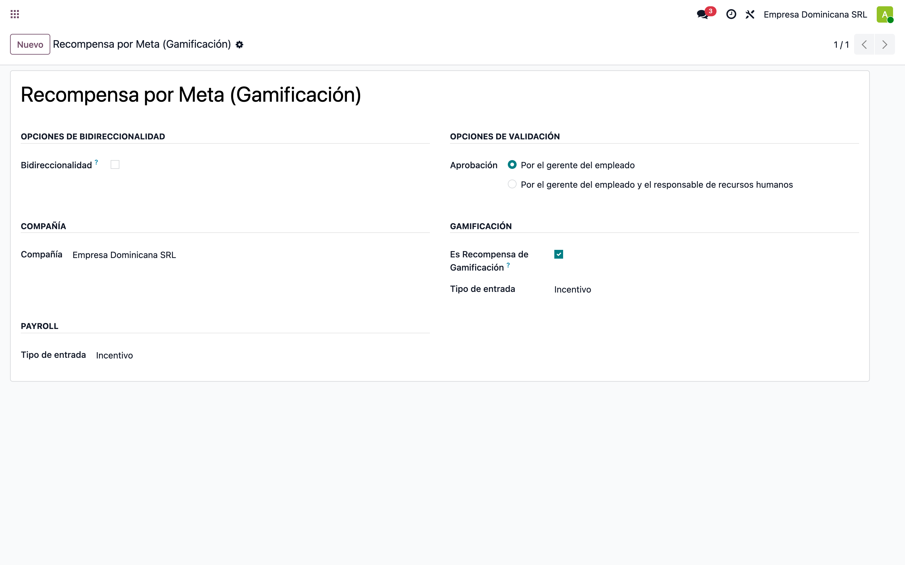

## 2. La pieza central: la insignia precargada que paga

**Ajustes → Gamificación → Insignias** (o Empleados → Insignias). El módulo **precarga** la insignia **Recompensa por Meta**, lista para usar, con el grupo **Recompensa por Novedad (Nómina)**:

- *Paga una Novedad*: activado de fábrica.
- *Monto de la Recompensa*: viene en **0** — es el **único paso de configuración**: establecer el monto (aquí RD$5,000). Mientras esté en 0, otorgarla **no paga** (queda el aviso en el chatter y el otorgamiento es regenerable después de configurar el monto).
- *Tipo de Novedad de Recompensa*: precargado con *Recompensa por Meta (Gamificación)* → input `INC`.
- *Regla de otorgamiento*: precargada en **Nadie, asignada mediante desafíos** — nadie la otorga manualmente (salvo administradores); solo los desafíos. Si se relaja, cada otorgamiento manual **también paga** (es el mismo evento).

Se pueden crear más insignias que paguen (montos/conceptos distintos): cualquier insignia con el flag funciona igual. Los smart buttons muestran las novedades generadas y los otorgamientos.

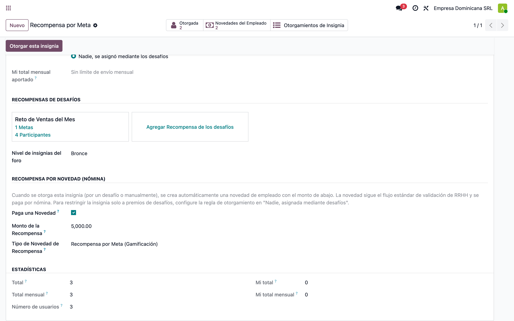

## 3. Desafío 100 % nativo: la insignia como premio

**Empleados → Desafíos** (o Ajustes → Gamificación → Desafíos). El desafío *Reto de Ventas del Mes* **no tiene ninguna configuración especial del módulo**: en la pestaña **Recompensa** se eligió la insignia precargada *Recompensa por Meta* como premio nativo *Para todos los usuarios exitosos*.

El módulo no modifica el desafío: los momentos de premiación son los nativos (cierre del período en desafíos recurrentes, fecha de fin, cierre manual, o tiempo real con *Recompensar tan pronto como se alcancen todos los objetivos*). En el chatter se ve el histórico completo: insignias enviadas, novedades creadas para Ana y Carlos, y el aviso de que la de Roberto no pudo generarse.

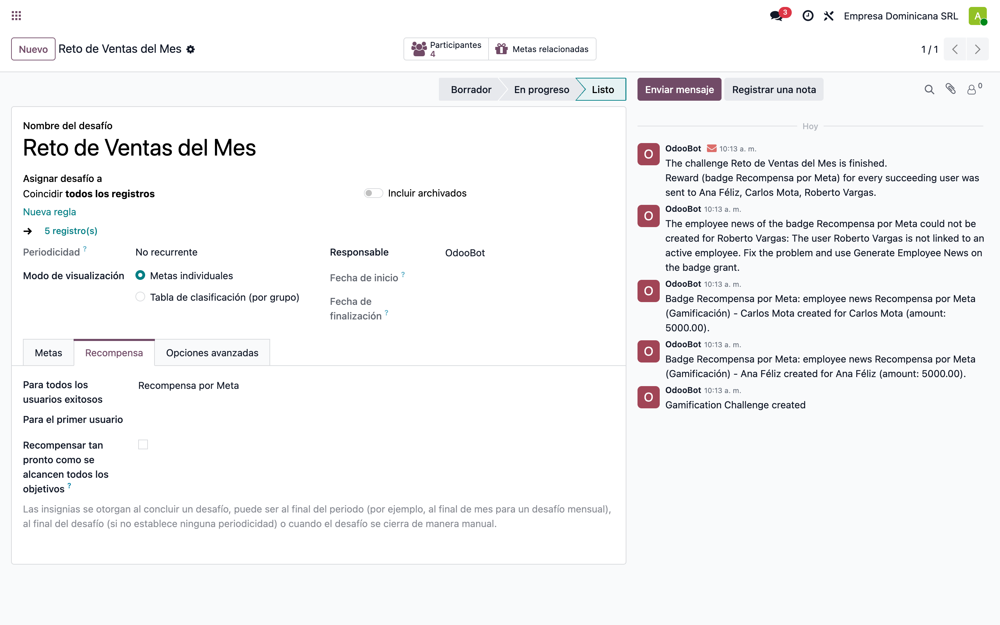

## 4. Seguimiento: metas de los participantes

Metas generadas por el desafío (una por participante). La meta *Ventas cerradas del mes* es de registro manual en este ejemplo; en producción puede ser cualquier definición de gamificación (conteo/suma sobre un modelo, código Python, o las precargadas de ventas/CRM como *Total Invoiced* o *New Leads*).

- **Ana (12/10), Carlos (15/10) y Roberto (11/10)** alcanzaron la meta (*Reached*).
- **Julia (6/10)** no llegó al objetivo (*In progress* al momento del cierre).

El avance lo actualiza el cron diario de gamificación (metas automáticas) o el botón *Goal Reached* / asistente de actualización (metas manuales).

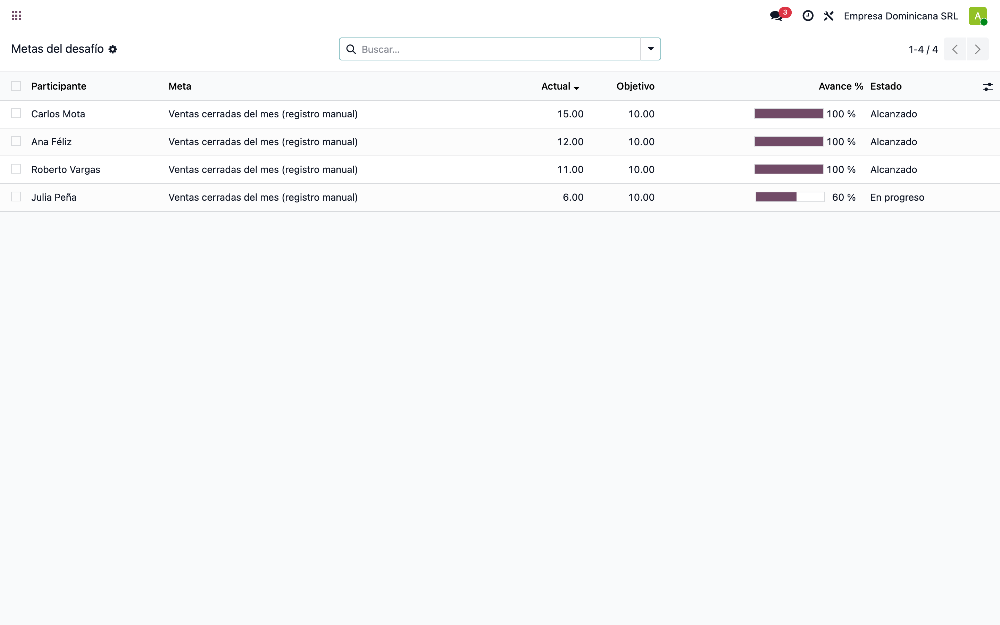

## 5. Cierre del desafío: otorgamientos y sus novedades

Al cerrar el desafío, el core otorga la insignia a los tres que cumplieron — y cada **otorgamiento** (`gamification.badge.user`, registro nativo) genera su novedad (smart button **Badge Grants** de la insignia):

- **Ana y Carlos** → otorgamiento con su **novedad enlazada**.
- **Roberto** → insignia otorgada (comportamiento nativo intacto) pero **sin novedad**: su usuario no está vinculado a ningún empleado. **No bloqueó** al resto; el aviso quedó en el chatter del desafío y el botón **Generate Employee News** permite generarla una vez corregido el dato.
- **Julia** no aparece: no cumplió la meta, no hay otorgamiento.

Anti-duplicados por diseño: la novedad es **1:1 con el otorgamiento** — un otorgamiento paga exactamente una vez (regenerar sobre él es un no-op), y cada período de un desafío recurrente produce un otorgamiento nuevo que paga el suyo.

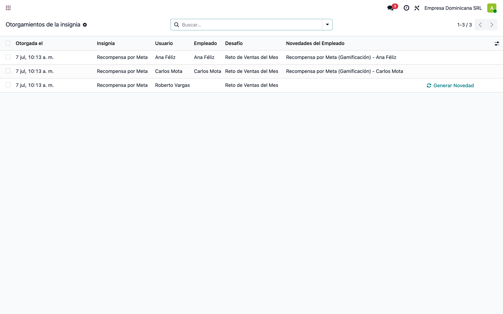

## 6. Novedades: la recompensa entra al flujo normal de RRHH

Novedad de **Carlos Mota** generada por su otorgamiento, en estado **Por aprobar** (el módulo la crea y la confirma automáticamente). A partir de aquí es una novedad estándar:

- La aprueba el gerente (o doble aprobación si el tipo lo exige) con los botones de siempre.
- Puede rechazarse (*Refuse*): la recompensa **no** se paga y no se regenera sola.
- Los smart buttons **Badge** y **Challenge** navegan a la insignia y al desafío de origen (trazabilidad inversa).

Nadie cobra sin la validación humana de RRHH: el módulo no salta ningún paso del workflow.

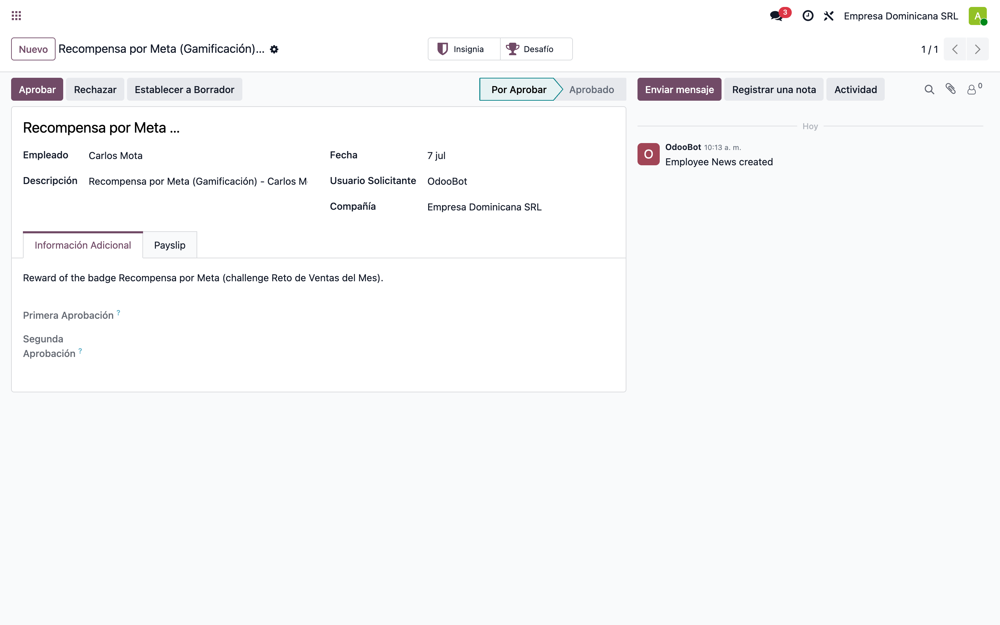

## 7. Novedad: pestaña Payslip con el monto de la recompensa

La pestaña **Payslip** de la novedad muestra el **Amount per Payslip = RD$5,000** (monto fijo configurado en la insignia) y la duración **One Time**: la recompensa se paga **una sola vez** en la próxima nómina del empleado.

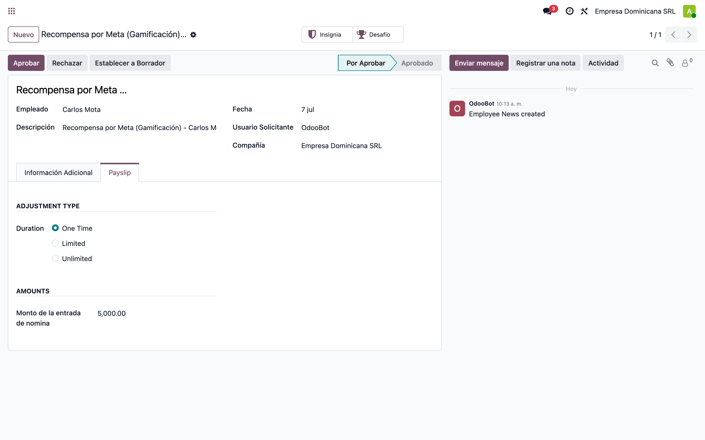

## 8. Aprobación de RRHH: novedad validada → ajuste salarial

Novedad de **Ana Féliz** ya **aprobada** por RRHH. Al validarla, el puente estándar de novedades creó el **ajuste salarial** (`hr.salary.attachment`) — visible en el smart button **Salary Adjustment**, junto a los smart buttons **Badge** y **Challenge** del módulo. La cadena de trazabilidad completa: insignia ↔ otorgamiento ↔ novedad ↔ ajuste ↔ nómina.

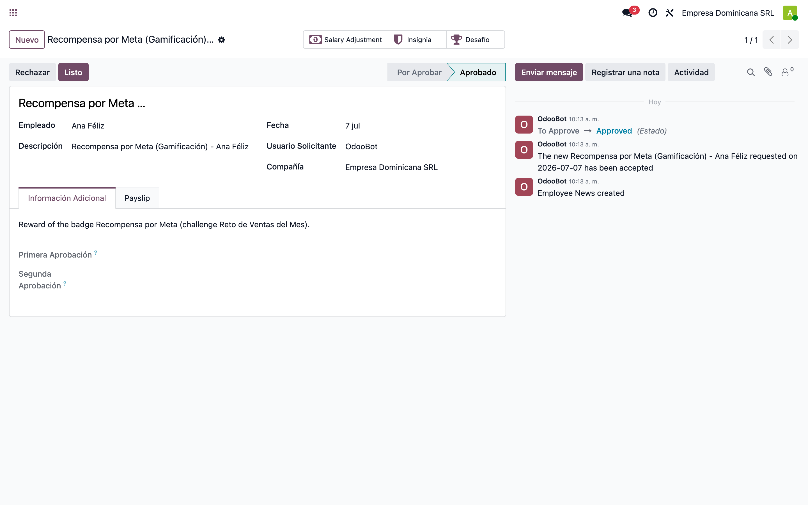

## 9. Ajuste salarial: una sola vez, cerrado al pagarse

El ajuste salarial de Ana con **monto RD$5,000**, tipo de entrada **Incentivo (INC)** y duración de una sola vez. Como la nómina de Ana ya fue validada (sección siguiente), el ajuste aparece **cerrado** con **monto pagado RD$5,000**: no volverá a aplicarse en nóminas futuras.

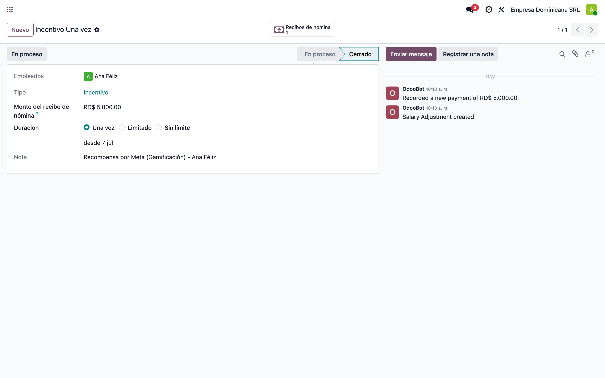

## 10. Nómina: el incentivo en el recibo del empleado

Recibo de nómina de **Ana Féliz** del mes en curso, pestaña **Cálculo del salario**. El cálculo tomó automáticamente el ajuste abierto y creó la entrada **Incentivo (INC) = RD$5,000**, que la regla salarial suma al salario gravable:

```
Salario base            45,000.00
Incentivo (INC)        + 5,000.00   ← recompensa de la insignia
TSS / ISR               según reglas RD sobre el gravable
Salario Neto            45,442.18
```

El recibo fue **validado**, lo que cerró el ajuste salarial (pago único consumido). El flujo de nómina es 100 % el estándar: calcular → verificar → validar.

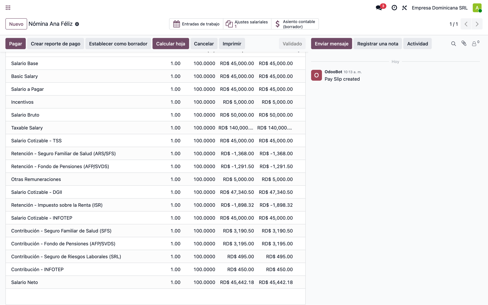

## 11. Comparativa: líneas del recibo (BASIC / INC / NET)

Líneas clave del recibo de Ana: **Salario base 45,000**, **Incentivo 5,000** (la recompensa de la insignia) y el **Neto** resultante después de TSS e ISR. La recompensa es salario ordinario gravable por el input type elegido; con otro input type puede modelarse como concepto no gravable si la política de compensación lo define así.

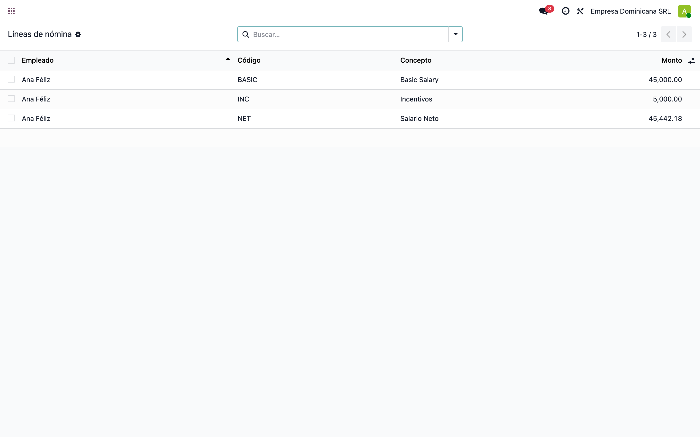

## Notas

### Criterios de aceptación cubiertos

1. **Recompensa opcional que no altera lo nativo**: la insignia sin el flag es 100 % nativa; con el flag, el otorgamiento nativo además paga. Roberto recibió su insignia aunque su novedad no pudo crearse.
2. **Desafío intacto**: `gamification.challenge` no se modifica en absoluto — la insignia se elige como premio nativo (*For Every Succeeding User*, podio 1.º/2.º/3.º, o tiempo real).
3. **Monto fijo → novedad automática**: cada otorgamiento de la insignia crea una novedad confirmada con el monto configurado.
4. **Flujo habitual de validación**: la novedad sigue el workflow estándar y solo al validarse crea el ajuste salarial; la nómina la consume por el mecanismo existente de `l10n_do_hr_payroll_news`.
5. **Prevención de duplicidades**: novedad 1:1 con el otorgamiento (`hr_news_id`); regenerar sobre un otorgamiento ya pagado es un no-op. Desafíos recurrentes: cada período = otorgamiento nuevo = pago nuevo, espejo exacto del comportamiento nativo de las insignias.
6. **Relación usuario–empleado**: `employee_id` del otorgamiento (hr_gamification) → `user.employee_id` → búsqueda por `hr.employee.user_id`.
7. **Manejo de errores**: un usuario sin empleado nunca bloquea el lote ni la insignia; queda registrado en el chatter del desafío (o de la insignia) y es regenerable con *Generate Employee News*.
8. **Trazabilidad completa**: insignia → otorgamiento → novedad → ajuste → input de nómina, navegable en ambas direcciones.

### Notas técnicas

- Punto de enganche: `create()` de `gamification.badge.user` — el evento único de otorgamiento, venga de un desafío (cualquier momento de premiación nativo), del wizard de RRHH o de un otorgamiento entre compañeros.
- Sin modelos nuevos y sin tocar `gamification.challenge`: 3 campos en la insignia, 1 campo en el otorgamiento, enlaces en la novedad.
- La generación usa `sudo()` puntual y `savepoint` por otorgamiento: un error de un participante se revierte solo para él y jamás bloquea la insignia.
- **Otorgamiento manual paga**: si la insignia permite otorgamiento manual, cada envío genera novedad. Para restringirla a desafíos, usar la regla nativa *No one, assigned through challenges* (los administradores siempre pueden).
- Tests automatizados del módulo: `odoo-bin -d <db> --test-enable --test-tags /l10n_do_gamification_hr_news -i l10n_do_gamification_hr_news` (9 tests: otorgamiento→novedad, sin empleado, regeneración, otorgamiento manual, insignia simple, config inválida, no-duplicado, pago por otorgamiento, ajuste salarial).
- ⚠️ Rechazar o cancelar la novedad **no** revierte la insignia (flujo unidireccional); el otorgamiento conserva el enlace a la novedad rechazada.
- ⚠️ La recompensa se otorga cuando el core otorga la insignia — por **desafío completo** (todas sus metas), no por meta individual.
