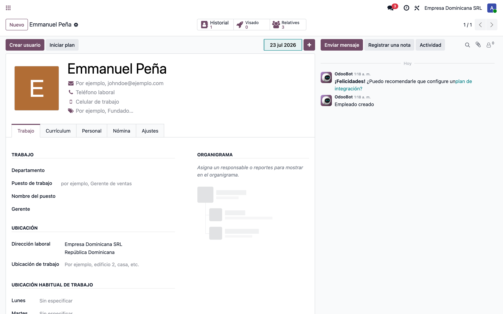
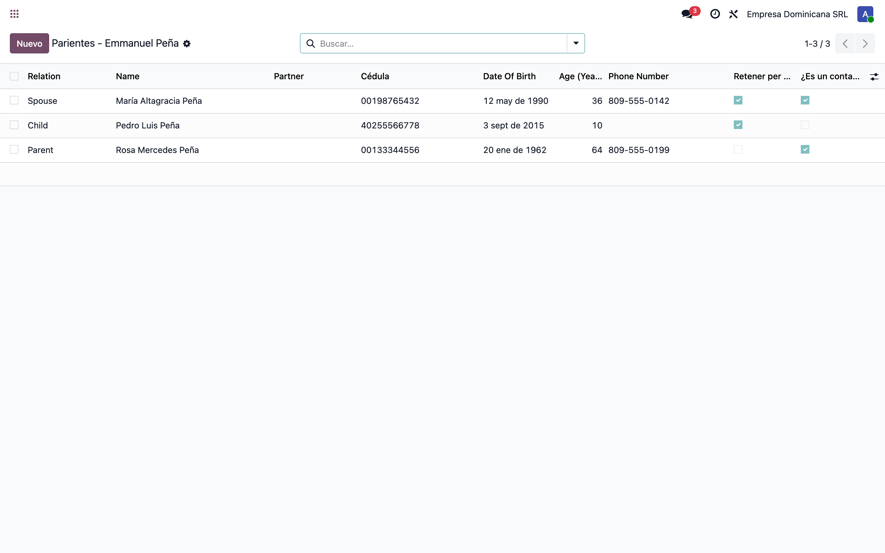
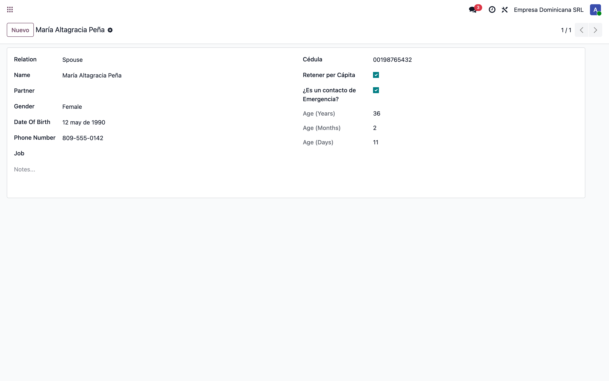

# Parientes del empleado en Odoo 19 — dónde quedaron los campos (l10n_do_hr)

> Manual generado con `tools/manual-generator`. Las capturas se regeneran ejecutando el generador contra una base `test_v19_<módulo>`.

Guía para usuarios tras la migración de **Odoo 17 a Odoo 19**. La funcionalidad de **Parientes** del empleado (dependientes / familiares) **sigue existiendo** y **conserva todos sus campos**, incluidos los dos que se reportaron como faltantes:

- **Retener per Cápita** (campo técnico `l10n_do_is_active`)
- **¿Es un contacto de Emergencia?** (campo técnico `l10n_do_emergency_contact`)

Lo único que cambió es **de dónde salen**: en Odoo 17 el modelo lo aportaba el módulo comunitario **`hr_employee_relative` (OCA)** y la localización lo extendía; en Odoo 19 el modelo fue **absorbido dentro de `l10n_do_hr`**, que ahora define el modelo completo (mismos campos, mismas etiquetas en español). Ningún campo se eliminó ni fue reemplazado por una función nativa de Odoo.

**Cómo llegar a los Parientes en Odoo 19:**

> **Empleados → Empleados → (abrir el empleado) → botón inteligente «Relatives / Parientes»** (arriba a la derecha, ícono de personas).

Ese botón abre el **listado de parientes** del empleado; desde ahí se **abre o crea** cada pariente en su **formulario**. Los dos campos aparecen **tanto en el listado (columnas) como en el formulario**.

## Requisitos previos

- Módulo **`l10n_do_hr`** instalado (v `19.0.1.0.3` o superior).
- Permisos de **Empleados** (`hr.group_hr_user`) para ver/editar parientes.
- El botón inteligente **Parientes** se ve en la ficha de cualquier empleado.
- El campo **Retener per Cápita** alimenta la nómina RD (retención por dependientes adicionales SFS) cuando está instalado `l10n_do_hr_payroll`.

## 1. Punto de entrada: botón «Parientes» en la ficha del empleado

**Empleados → Empleados → Emmanuel Peña.** En la barra de botones inteligentes (arriba a la derecha) aparece **Parientes** con el ícono de personas y el **contador** de parientes registrados. Es el reemplazo directo de la pestaña/listado que existía en Odoo 17.

Un clic abre el listado de parientes del empleado, ya filtrado por esa persona y listo para crear nuevos con el empleado predefinido.



## 2. Listado de parientes — aquí están las dos columnas

Listado de los parientes de **Emmanuel Peña**. Las **dos columnas reportadas como faltantes están presentes**:

- **Retener per Cápita** (`l10n_do_is_active`) — marca si el pariente cuenta como **dependiente adicional** para la retención per cápita de la seguridad social (SFS).
- **¿Es un contacto de Emergencia?** (`l10n_do_emergency_contact`) — marca al pariente como contacto de emergencia del empleado.

Además de: Relación, Nombre, Contacto (partner), **Cédula** (`l10n_do_identification_id`), Fecha de nacimiento, Edad y Teléfono. Columnas como Género, Trabajo y Notas quedan **ocultas por defecto** y se activan con el botón de **opciones de columna** (⚙️) a la derecha del encabezado.



## 3. Formulario del pariente — los dos campos en detalle

Ficha de **María Altagracia Peña** (cónyuge). En la **columna derecha** del formulario están, uno debajo del otro:

- **Cédula** (`l10n_do_identification_id`).
- **Retener per Cápita** (`l10n_do_is_active`) — casilla marcada.
- **¿Es un contacto de Emergencia?** (`l10n_do_emergency_contact`) — casilla marcada.
- **Edad (Años / Meses / Días)** — calculada desde la fecha de nacimiento.

En la columna izquierda: Relación, Nombre, Contacto, Género, Fecha de nacimiento, Teléfono y Trabajo. Abajo, el campo **Notas**. Es exactamente la misma información que en Odoo 17, reorganizada en el formulario propio de `l10n_do_hr`.



## 4. Crear un pariente nuevo

Desde el listado, el botón **Nuevo** abre el formulario en blanco con el **empleado predefinido**. Al elegir un **Contacto** (partner) existente, el sistema autocompleta el **Nombre** y, si el contacto tiene RNC/Cédula, la **Cédula** del pariente. Luego se marcan **Retener per Cápita** y/o **¿Es un contacto de Emergencia?** según corresponda y se guarda.

## Notas

### Dónde quedó cada campo (mapa 17 → 19)

| Campo (etiqueta en español) | Campo técnico | Odoo 17 | Odoo 19 | Estado |
|---|---|---|---|---|
| Retener per Cápita | `l10n_do_is_active` | Módulo OCA `hr_employee_relative` extendido por `l10n_do_hr` | Definido **dentro de `l10n_do_hr`** | **Conservado** — listado + formulario |
| ¿Es un contacto de Emergencia? | `l10n_do_emergency_contact` | Ídem | Definido **dentro de `l10n_do_hr`** | **Conservado** — listado + formulario |
| Cédula | `l10n_do_identification_id` | Ídem | `l10n_do_hr` | Conservado |
| Relación, Nombre, Contacto, Género, Fecha nac., Edad, Teléfono, Trabajo, Notas | (campos base) | Modelo OCA | Absorbidos en `l10n_do_hr` | Conservados |

### ¿Odoo 19 cubre esto de forma nativa? — No

- **Retener per Cápita** es un concepto de nómina dominicana **sin equivalente nativo**. Alimenta la regla salarial **`DEPENDIENTE_AD`** (retención por dependientes adicionales SFS): la nómina cuenta los parientes con *Retener per Cápita = Sí* (`l10n_do_relatives_active_count`) y aplica el parámetro `DEPENDIENTE_AD`. Si el campo desapareciera, ese descuento se calcularía mal.
- **¿Es un contacto de Emergencia?** — Odoo nativo tiene *Contacto de emergencia* y *Teléfono de emergencia*, pero como **texto libre en la ficha del empleado** (un solo contacto). El campo de `l10n_do_hr` es un **indicador por pariente**, que permite marcar **cuál** de los familiares registrados es el contacto de emergencia. No son equivalentes; por eso se mantiene.

### Ruta rápida (para el usuario final)

1. **Empleados → Empleados** y abrir la persona.
2. Clic en el botón inteligente **Parientes** (ícono de personas, arriba a la derecha).
3. En el **listado** se ven las columnas **Retener per Cápita** y **¿Es un contacto de Emergencia?**.
4. Abrir o crear un pariente para editarlas en el **formulario**.

> **Reproducir este manual** (base limpia, instalar, sembrar y capturar):
> ```bash
> cd tools/manual-generator
> ./generate-manual.sh --module=l10n_do_hr
> ```
> La base se siembra con `configs/l10n_do_hr.seed.py`: empleado **Emmanuel Peña** con tres parientes (cónyuge con per cápita + emergencia, hijo con per cápita, madre como contacto de emergencia).
