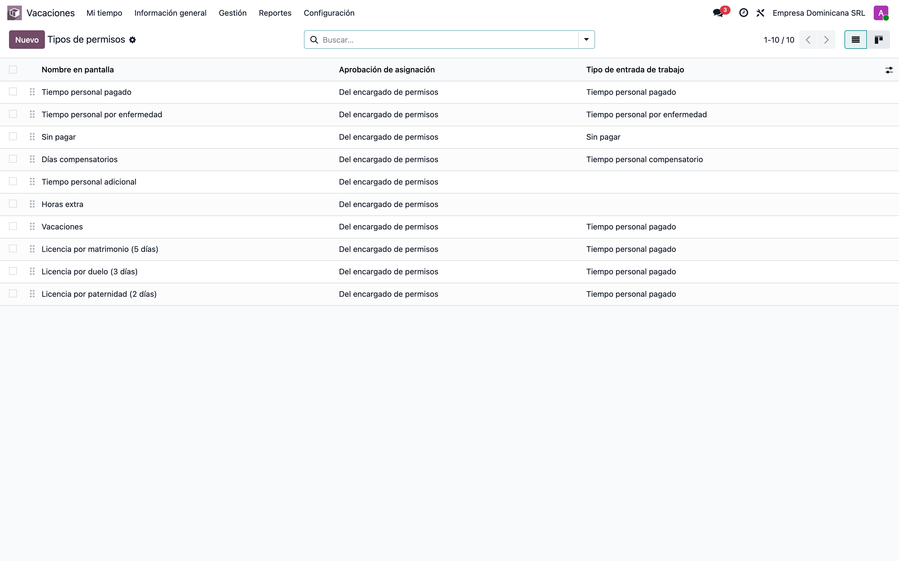
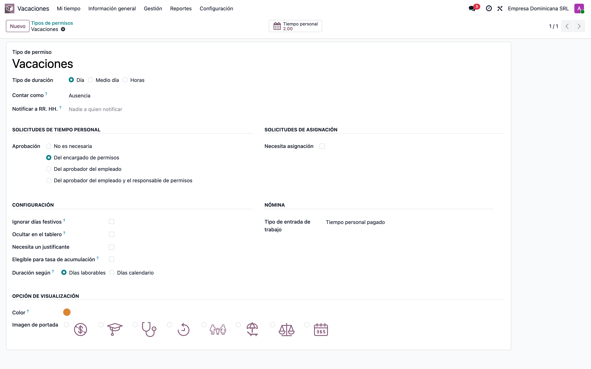
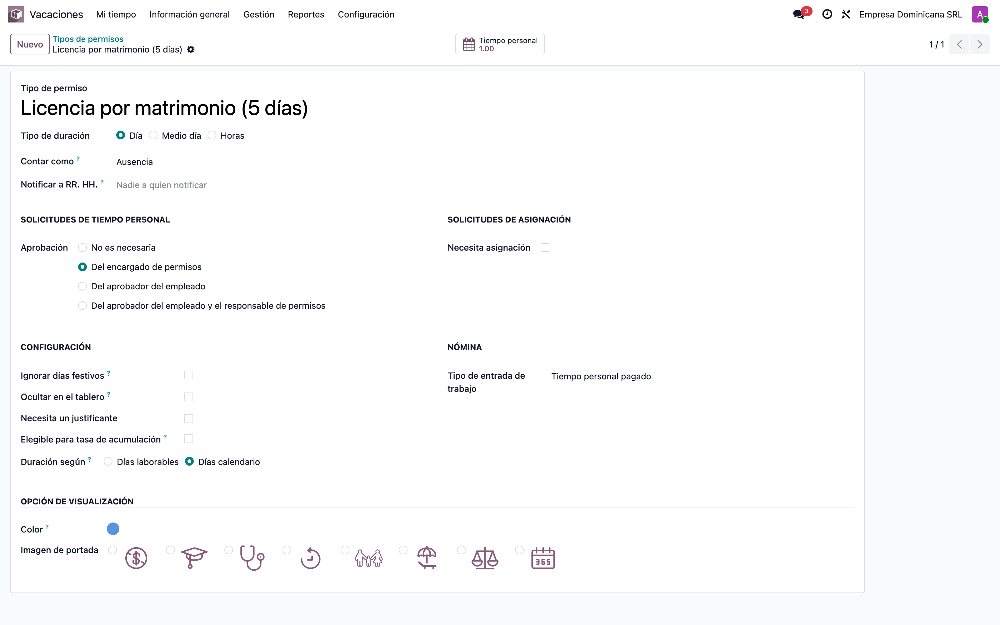
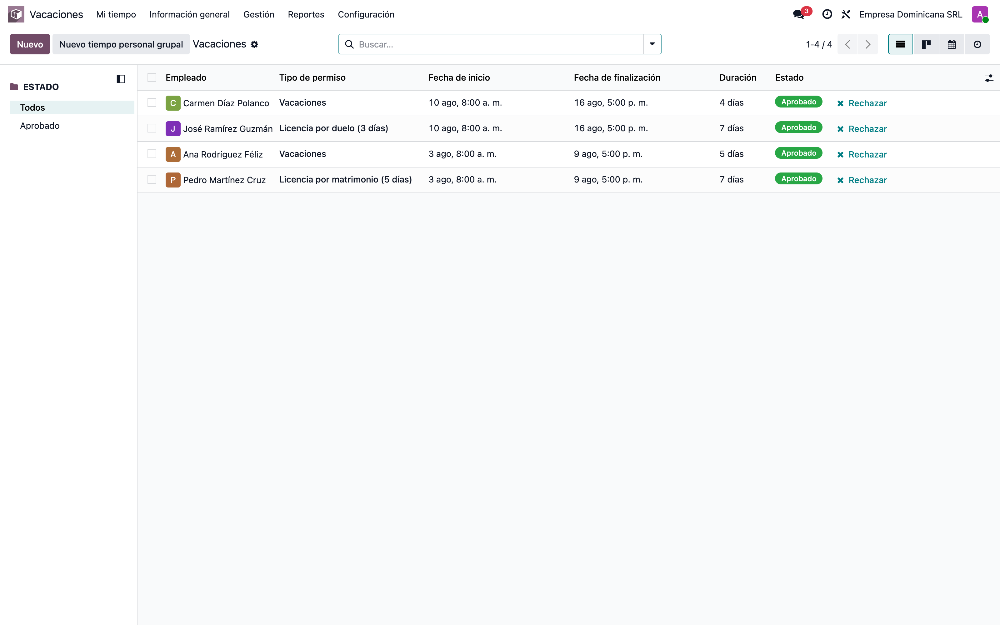
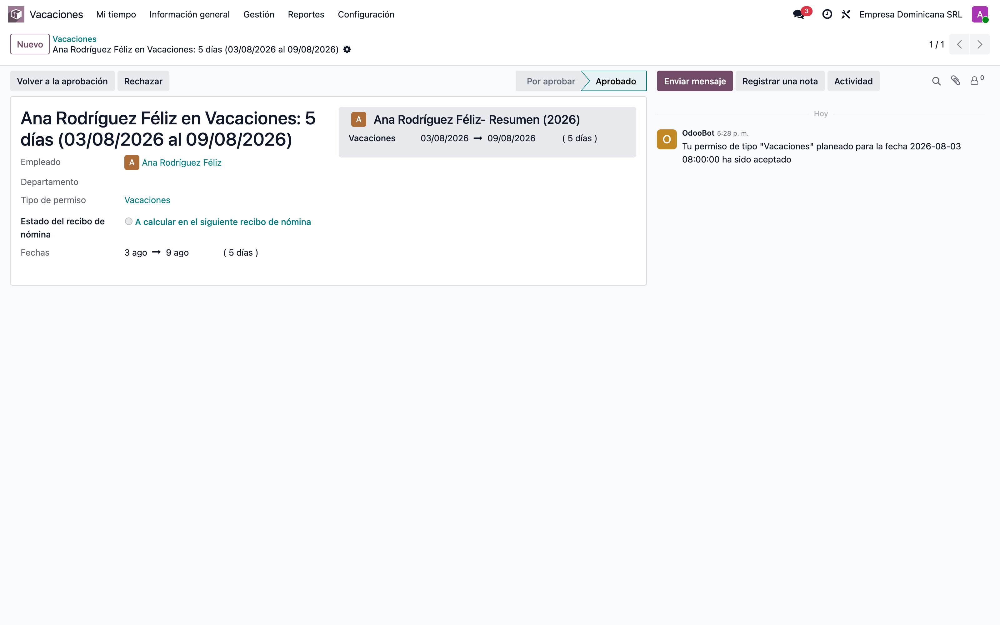
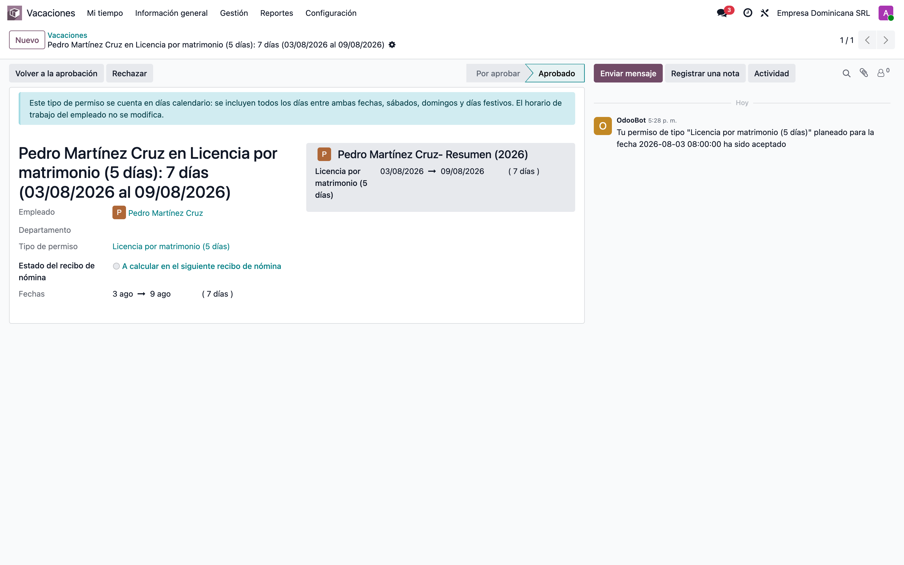
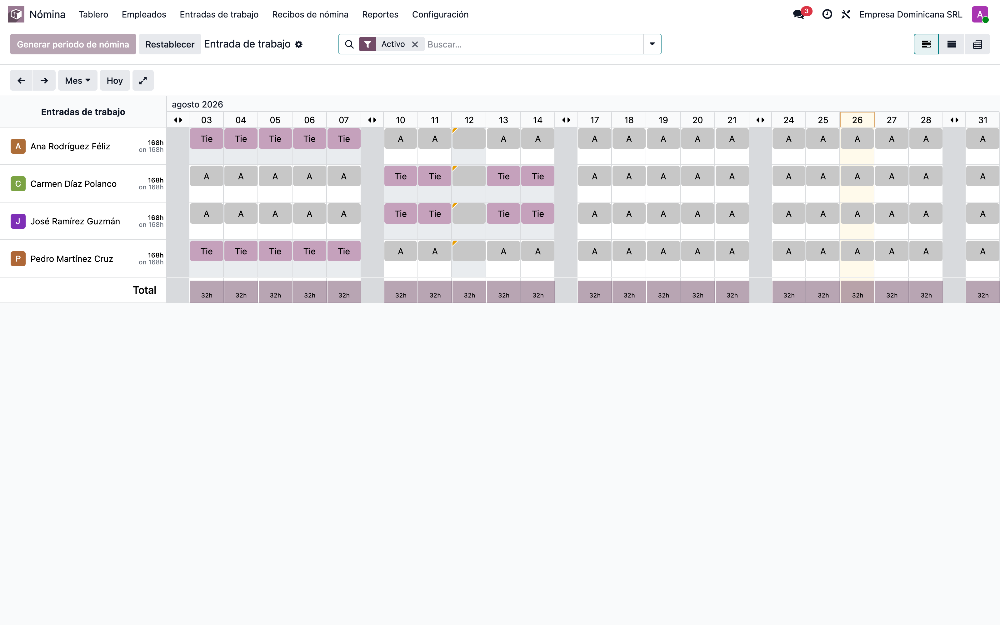
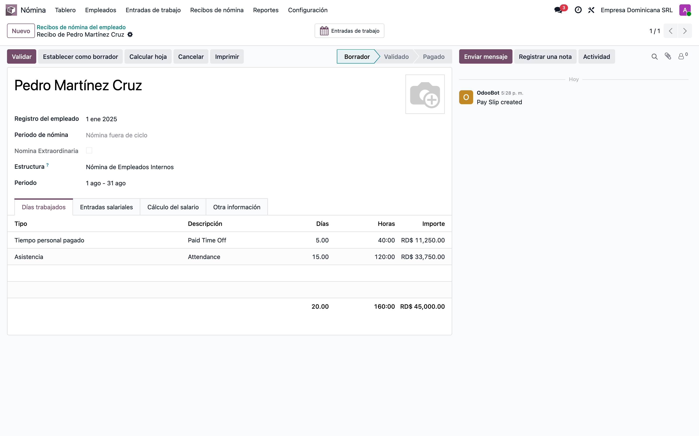

# Duración de ausencias en días calendario — Manual funcional

> Manual generado con `tools/manual-generator`: `node capture.mjs --config=configs/l10n_do_hr_holidays.json --db=test_v19_l10n_do_hr_holidays`. Las capturas se regeneran corriendo ese comando contra la base de pruebas.

Odoo calcula la duración de una ausencia contra el **horario de trabajo** del empleado: para alguien de lunes a viernes, una licencia de lunes a domingo cuenta 5 días, no 7. Eso es correcto para las vacaciones, que se miden en días laborables, pero no para las licencias que el Código de Trabajo dominicano concede en **días calendario** —matrimonio, duelo, paternidad—, donde sábados, domingos y feriados forman parte del período.

Este módulo agrega al tipo de ausencia el campo **Duración según**, con dos valores: *Días laborables* (el comportamiento estándar de Odoo, intacto) y *Días calendario*, que calcula `fecha final - fecha inicial + 1` sin consultar el horario del empleado. La configuración es por tipo de ausencia, así que cada licencia usa el criterio que le toca.

Lo que **no** cambia es igual de importante: el horario de trabajo del empleado se queda como está, los *work entries* se siguen generando sólo sobre los días laborables y los días trabajados del recibo de nómina siguen contando 5 días. Contar 7 días calendario es una medida de la duración de la licencia, no una orden de pagar el fin de semana.

**Base de datos de las capturas:** `test_v19_l10n_do_hr_holidays`, creada con `cd tools/manual-generator && ./generate-manual.sh --module=l10n_do_hr_holidays --extra-modules=l10n_do_hr_payroll,hr_work_entry_holidays --keep-db` (usuario `admin`, clave `admin`).

## Requisitos previos

- Módulo instalado: `l10n_do_hr_holidays` (arrastra `hr_holidays` y `l10n_do_hr`).
- Para la parte de work entries y nómina: `hr_work_entry_holidays` y `l10n_do_hr_payroll` (el seed del manual los instala).
- Un horario de trabajo real del empleado (en las capturas, lunes a viernes 8-12 / 13-17, zona `America/Santo_Domingo`).
- Usuario con el grupo **Administrador de Tiempo personal** para configurar los tipos de ausencia.
- Interfaz en español (es_DO).

## 1. Tipos de ausencia de la compañía

En **Tiempo personal › Configuración › Tipos de ausencia** conviven los dos criterios: *Vacaciones* se mide en días laborables y las licencias del Código de Trabajo en días calendario.

## 2. Tipo de ausencia en días laborables

*Vacaciones* con **Duración según = Días laborables**: el comportamiento estándar de Odoo. La duración se calcula contra el horario de trabajo del empleado, así que sábados y domingos no cuentan.

## 3. Tipo de ausencia en días calendario

*Licencia por matrimonio* con **Duración según = Días calendario**. A partir de aquí toda solicitud de este tipo mide `fecha final - fecha inicial + 1`, sin mirar el horario del empleado. El campo sólo aparece si el tipo se solicita por día: si se cambia a medio día u horas, vuelve solo a días laborables.

## 4. Las cuatro solicitudes, dos semanas

Las cuatro personas tienen el mismo horario de lunes a viernes y cada solicitud cubre un lunes a domingo completo. La columna **Duración** resume el módulo: en la semana sin feriado, 5 días con el criterio de días laborables y 7 con el de días calendario; en la semana con feriado el miércoles, 4 días con laborables y otra vez 7 con calendario, porque el feriado también forma parte del período.

## 5. Solicitud en días laborables: 5 días

Lunes a domingo con horario de lunes a viernes: Odoo cuenta **5 días**. Es el comportamiento estándar y no se toca. En la semana con feriado, el mismo tipo cuenta 4.

## 6. Solicitud en días calendario: 7 días

El mismo período, en un tipo configurado en días calendario, cuenta **7 días**: el sábado y el domingo forman parte de la licencia. El aviso azul recuerda el criterio y que el horario del empleado no se modifica. Con un feriado dentro del período el resultado sigue siendo 7.

## 7. Entradas de trabajo: el fin de semana no aparece

Las entradas de trabajo del mes, con las cuatro personas. Los días de licencia (**Per**miso) van de lunes a viernes y nada más: el sábado y el domingo no generan entradas, porque siguen calculándose contra el horario de trabajo real. En la segunda semana se ve además el feriado del miércoles, que tampoco genera entrada aunque la licencia de días calendario sí lo cuente en su duración.

## 8. Nómina: 5 días de ausencia, no 7

El recibo del mismo empleado. En **Días trabajados**, la ausencia entra con 5 días y 40 horas: contar la licencia como 7 días calendario no convierte el sábado ni el domingo en días pagables.

## Notas

El criterio es por tipo de ausencia, nunca global: los tipos que quedan en *Días laborables* conservan el cálculo estándar de Odoo, incluido el manejo del interruptor **Ignorar días festivos** que ya trae la versión 19. En los tipos de días calendario ese interruptor deja de importar, porque el feriado se cuenta de todas formas.

El script `verify_l10n_do_natural_days.sh` (raíz de `dev_env_odoo_pro-19`) repite los 14 chequeos de este manual sobre una base existente, incluidos los de work entries y nómina.
