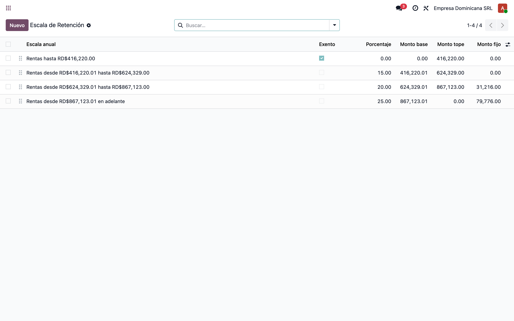
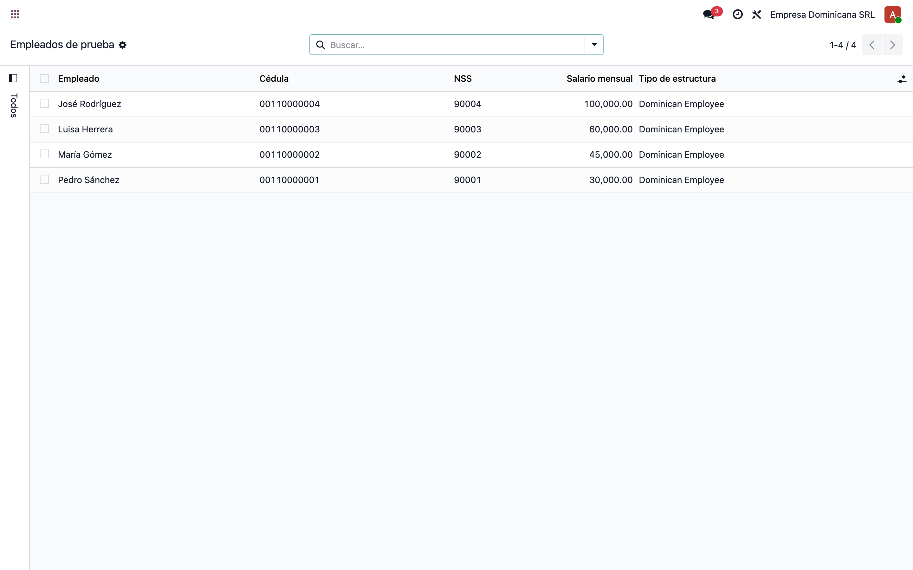
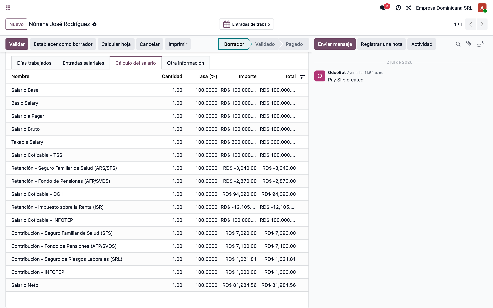
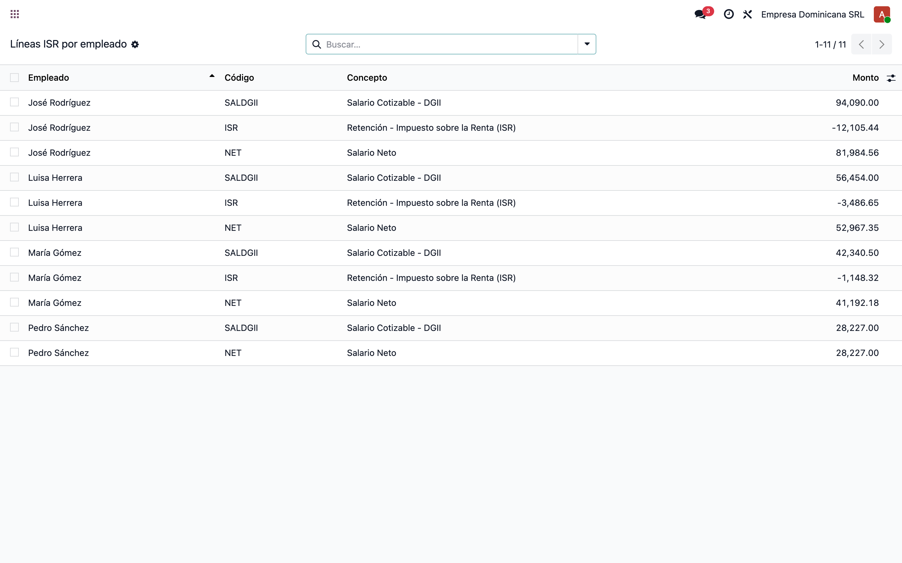

# Retención ISR configurable por escalas — Nómina Dominicana (l10n_do_hr_payroll)

> Manual generado con `tools/manual-generator`. Las capturas se regeneran ejecutando el generador contra una base `test_v19_<módulo>`.

Este manual muestra, **desde una base de datos limpia**, el flujo completo de la nómina dominicana con la retención del **Impuesto sobre la Renta (ISR)** calculada desde las **escalas configurables** (`l10n.do.hr.retention.scale`), en lugar de valores fijos en el código de la regla salarial.

**Qué cambió:** la regla `hr_rule_isr_employee` (código `ISR`) ya no tiene los montos de la escala DGII escritos en el código Python. Ahora:

- La **condición** toma el umbral exento anual de la escala marcada como *Exento* (`_get_annual_exempt_amount()`).
- El **monto** se calcula con `_compute_annual_retention(salario_anual)`: busca la escala cuyo *Monto base* cubre el salario anual cotizable y aplica `Monto fijo + %(excedente sobre el monto base)`.
- Las 4 escalas DGII 2026 se cargan por **data** (`data/l10n_do_hr_retention_scale.xml`, `noupdate="1"`): al publicar la DGII una nueva escala (ajuste anual por inflación), se edita desde la interfaz **sin tocar código** y sin que un upgrade del módulo la sobreescriba.

**Escala retención asalariados 2026 (DGII):**

| Escala anual | Tasa |
|---|---|
| Hasta RD$416,220.00 | Exento |
| RD$416,220.01 – RD$624,329.00 | 15% del excedente de RD$416,220.01 |
| RD$624,329.01 – RD$867,123.00 | RD$31,216.00 + 20% del excedente de RD$624,329.01 |
| RD$867,123.01 en adelante | RD$79,776.00 + 25% del excedente de RD$867,123.01 |

> **Replicar todo automáticamente** (crea base limpia, instala, siembra y captura):
> ```bash
> cd tools/manual-generator
> ./generate-manual.sh --module=l10n_do_hr_payroll
> ```
> La base de ejemplo se siembra con `configs/l10n_do_hr_payroll.seed.py`.

## Requisitos previos

- Módulo **`l10n_do_hr_payroll`** actualizado (v `19.0.1.0.7` o superior): regla ISR leyendo de las escalas + data de escalas 2026.
- Compañía con localización RD: **país** República Dominicana, **moneda** DOP y **tipo de riesgo laboral**.
- Empleados con contrato en la estructura **Dominican Republic - Base** y salario mensual configurado.
- Interfaz en español (es_DO) — los campos de la escala están traducidos (*Monto fijo*, *Monto base*, *Monto tope*, *Exento*).

## 1. Configuración: escalas de retención ISR

**Nómina → Configuración → Retention Scale.** Las 4 escalas DGII 2026 vienen precargadas por data del módulo. Cada escala define:

- **Exento**: marca la escala libre de impuesto; su *Monto tope* es el umbral anual (RD$416,220.00) bajo el cual **no se retiene ISR**.
- **Monto base**: límite inferior de la escala — el excedente se calcula sobre este valor.
- **Monto tope**: límite superior (la última escala queda en 0 = abierta).
- **Porcentaje**: tasa aplicada al excedente.
- **Monto fijo**: cuota fija DGII de la escala (RD$31,216.00 / RD$79,776.00).

La lista es **editable en línea**: cuando la DGII publique la escala de un nuevo año, solo hay que actualizar estos montos.



## 2. Empleados de prueba (una por escala)

**Empleados → Empleados.** Cuatro empleados con salarios mensuales que caen uno en cada escala:

| Empleado | Salario mensual | Salario anual cotizable (SALDGII×12) | Escala |
|---|---|---|---|
| Pedro Sánchez | RD$30,000 | RD$338,724.00 | Exento — sin ISR |
| María Gómez | RD$45,000 | RD$508,086.00 | 15% |
| Luisa Herrera | RD$60,000 | RD$677,448.00 | 20% + RD$31,216 |
| José Rodríguez | RD$100,000 | RD$1,129,080.00 | 25% + RD$79,776 |

El salario cotizable DGII descuenta primero TSS (SFS 3.04% + AFP 2.87%).



## 3. Recibo de nómina: línea ISR calculada desde la escala

**Nómina → Recibos** → recibo de *José Rodríguez* (RD$100,000/mes), pestaña **Cálculo del salario**. La línea **Retención - Impuesto sobre la Renta (ISR)** muestra **-RD$12,105.44**:

```
SALDGII = 100,000 − 3,040 (SFS) − 2,870 (AFP) = 94,090
Anual   = 94,090 × 12 = 1,129,080  → escala "desde RD$867,123.01"
ISR     = 79,776 + 25% × (1,129,080 − 867,123.01) = 145,265.25 anual
Mensual = 145,265.25 / 12 = 12,105.44
```

Exactamente la fórmula DGII, pero tomando **monto fijo, base y porcentaje desde la escala configurada**.



## 4. Comparativa: ISR por empleado (todas las escalas)

Líneas `SALDGII`, `ISR` y `NET` de los cuatro recibos del período. Se ve cada escala aplicada:

- **Pedro** (exento): **no aparece línea ISR** — su salario anual cotizable queda bajo el umbral y la condición de la regla no se cumple.
- **María** (15%): ISR mensual **-1,148.32** = `15% × (508,086 − 416,220.01) / 12`.
- **Luisa** (20%): ISR mensual **-3,486.65** = `(31,216 + 20% × (677,448 − 624,329.01)) / 12`.
- **José** (25%): ISR mensual **-12,105.44** = `(79,776 + 25% × (1,129,080 − 867,123.01)) / 12`.



## 5. Cambio de escala (ajuste anual DGII) — sin tocar código

Cuando la DGII publique la escala de un nuevo año, basta editar los montos en **Nómina → Configuración → Retention Scale** y **recalcular** los recibos abiertos. Validación automática incluida en la siembra de esta base:

1. Se elevó temporalmente el umbral exento a **RD$500,000** (y el monto base de la escala del 15% a RD$500,000.01).
2. Se recalculó el recibo de María (anual RD$508,086): el ISR bajó de **-1,148.32** a **-101.07** = `15% × (508,086 − 500,000.01) / 12` — la regla siguió la nueva configuración al instante.
3. Se restauró la escala 2026 y se recalculó: el ISR volvió a **-1,148.32**.

> Editar *Nombre* y *Secuencia* de una escala requiere permisos de **Administrador** (grupo Sistema); los montos y porcentajes los puede mantener el gestor de nómina con permisos de configuración.

## Notas

### Criterios de aceptación

1. **Configuración por data:** al instalar/actualizar el módulo existen las 4 escalas DGII 2026 en `Nómina → Configuración → Retention Scale` (data `noupdate="1"`: un upgrade no pisa los valores editados por el usuario).
2. **Regla sin hardcode:** `hr_rule_isr_employee` no contiene montos de la escala; usa `_get_annual_exempt_amount()` (condición) y `_compute_annual_retention()` (monto).
3. **Cálculo correcto por escala:** exento sin línea ISR; 15% / 20% / 25% con los montos de la sección 4 — idénticos a la fórmula DGII y al comportamiento anterior de la regla (verificado borde por borde: 416,220.01, 624,329.00/.01, 867,123.00/.01).
4. **Reactividad a cambios:** editar la escala y recalcular el recibo produce el nuevo ISR sin reiniciar ni actualizar el módulo (sección 5).
5. **Traducciones:** los campos nuevos (*Monto fijo*) y las ayudas de campo están en `i18n/es_DO.po`.

### Notas técnicas

- La escala se evalúa sobre el **salario anual cotizable DGII** (`SALDGII × 12`), después de descontar TSS.
- La retención mensual descuenta lo ya retenido en el período (`payslip._sum('ISR', ...)`), igual que antes.
- El **Monto fijo** existe como campo porque la DGII publica cuotas fijas redondeadas (RD$31,216 / RD$79,776) que no coinciden exactamente con la acumulación matemática de las escalas anteriores (31,216.35 / 79,775.15); usar el monto publicado garantiza cuadre con la tabla oficial.
- La última escala se deja con **Monto tope = 0** (abierta, "en adelante").
- ⚠️ Los cambios de escala aplican al **próximo cálculo** de cada recibo: recibos ya validados no se recalculan solos.
