# Liquidación por Desvinculación — Análisis y Diseño (Propuesta)

**Módulo propuesto:** `l10n_do_hr_payroll_liquidation`
**Base:** `l10n_do_hr_payroll` (Odoo 19, rama 19.0)
**Referencia funcional:** Manual de Usuario v2.0 — "Cálculo de Prestaciones y Derechos Adquiridos", Ministerio de Trabajo RD (`docs/calulo de prestaciones y derechos adquiridos.pdf`)
**Fecha:** 2026-07-08
**Estado:** Propuesta para aprobación

---

## 1. Resumen ejecutivo

Hoy las liquidaciones por desvinculación se procesan con una nómina extraordinaria donde los montos de Preaviso (PREA), Cesantía (CESA), Vacaciones y Regalía se digitan manualmente como *inputs*. Las reglas salariales existen pero son *passthrough*: pagan lo que el usuario escriba, sin cálculo.

Se propone un nuevo módulo `l10n_do_hr_payroll_liquidation` que agrega:

1. Un **documento de liquidación** (`l10n.do.hr.liquidation`) que calcula automáticamente los cuatro conceptos usando el historial de nómina (salarios + comisiones) y la antigüedad del contrato, replicando la calculadora oficial del Ministerio de Trabajo (MT).
2. Una pantalla donde el usuario **selecciona conceptos, revisa el detalle del cálculo y edita los montos** antes de confirmar.
3. La **generación automática de la nómina extraordinaria** (lote con `l10n_do_extraordinary = True`) con los inputs correspondientes, reutilizando las reglas salariales existentes.

El salario pendiente por días laborados queda **fuera del MVP**; la sección 8 documenta su viabilidad técnica y la ruta recomendada.

---

## 2. Alcance

### Incluido (MVP)

| Concepto | Base legal | Regla existente | Estrategia |
|---|---|---|---|
| Preaviso | Art. 76 CT | `PREA` (input passthrough) | Calcular monto y pasarlo como input |
| Cesantía | Art. 80 CT | `CESA` (input passthrough) | Calcular monto y pasarlo como input |
| Vacaciones no disfrutadas | Arts. 177, 180 CT | `VAC` (no reutilizable, ver §6.4) | **Nueva regla `VACL`** categoría INEX |
| Regalía pascual proporcional | Arts. 219, 222 CT | `REPA` (acepta input override) | Calcular monto y pasarlo como input |

- Selección de conceptos por el usuario (checkboxes, patrón calculadora MT).
- Montos editables antes de confirmar.
- Generación de lote extraordinario + nómina + inputs.
- Jornada ordinaria (divisor 23.83) e intermitente (divisor 26).

### Excluido (MVP)

- **Causa de salida**: se registra antes, en el proceso nativo de desvinculación (`hr.departure.wizard` → `departure_date`, `departure_reason_id` en `hr.employee`). La liquidación solo la **lee**.
- **Salario pendiente por días laborados**: análisis de viabilidad en §8, implementación en fase 2.
- Empleados contratados antes de la Ley 16-92 (cálculo dividido Art. 80 pre/post 1992). El sistema advertirá y permitirá captura manual (§7).
- Participación en beneficios (bonificación Art. 223) — no solicitado.

---

## 3. Marco legal y fórmulas (calculadora MT)

### 3.1 Bases de cálculo

| Variable | Definición MT | Fuente en Odoo |
|---|---|---|
| **Salario promedio mensual** | Suma de salarios + comisiones devengados en el último año (o fracción) ÷ meses trabajados | `payslip._sum('APAGAR', ...) + _sum('COM', ...)` sobre nóminas `validated/paid` de los últimos 12 meses |
| **Salario promedio diario** | Promedio mensual ÷ **23.83** (jornada ordinaria) o ÷ **26** (intermitente) | Parámetro existente `DIAS_LAB_MES` = 23.83; nuevo parámetro para 26 |
| **Salario último mes** | Salario devengado en el último mes (base de vacaciones para salario fijo) | `_sum('APAGAR' + 'COM')` del último mes con nómina |

Componen el salario ordinario: sueldo fijo + comisiones pagadas regularmente + incentivos permanentes (Art. 311 CT y jurisprudencia — ya documentado en la nota de la regla `BASE`, `data/hr_salary_rule.xml:286`). Quedan fuera: horas extra, salario de navidad, participación en utilidades, viáticos.

### 3.2 Preaviso (Art. 76 CT)

`Monto = salario promedio diario × días según antigüedad`

| Antigüedad | Días |
|---|---|
| 3 a 6 meses | 7 |
| 6 a 12 meses | 14 |
| ≥ 1 año | 28 |
| < 3 meses | 0 (no aplica) |

Si el empleador **otorgó el preaviso trabajado**, no se paga (pregunta "¿Ha sido usted pre-avisado?" de la calculadora MT → checkbox en el documento).

### 3.3 Cesantía (Art. 80 CT)

`Monto = salario promedio diario × días acumulados`

| Antigüedad | Días |
|---|---|
| 3 a 6 meses | 6 |
| 6 a 12 meses | 13 |
| 1 a 5 años | 21 por año trabajado |
| > 5 años | 23 por año trabajado |

Fracción de año posterior a los años completos (comportamiento calculadora MT):

| Fracción | Días adicionales |
|---|---|
| ≥ 3 y < 6 meses | 6 |
| ≥ 6 meses | 13 |

> **Nota pre-1992:** para contratos iniciados antes de la Ley 16-92 la calculadora MT muestra dos líneas ("Art. 80 antes 1992" con 15 días/año y "después 1992"). Fuera del MVP; el sistema advertirá (§7).

### 3.4 Vacaciones (Arts. 177 y 180 CT)

- Salario fijo: `Monto = (salario último mes ÷ divisor) × días`
- Salario variable / por labor rendida (ej. con comisiones): se usa el **salario promedio diario** del último año en lugar del último mes.

| Antigüedad | Días |
|---|---|
| > 5 meses | 6 |
| > 6 meses | 7 |
| > 7 meses | 8 |
| > 8 meses | 9 |
| > 9 meses | 10 |
| > 10 meses | 11 |
| > 11 meses | 12 |
| ≥ 1 año y < 5 años | 14 |
| ≥ 5 años | 18 |

Si el empleado **ya tomó las vacaciones del último año**, no se paga (pregunta MT → checkbox). Escala 14/18 ya existe como parámetros `VAC_DAYS` / `VAC_DAYS_60` (`data/hr_rule_parameter.xml:178-198`).

### 3.5 Regalía pascual proporcional (Arts. 219, 222 CT)

`Monto = salarios ordinarios devengados en el año calendario (1 ene → fecha salida) ÷ 12`

Excluye horas extra y beneficios. Exenta de ISR (Art. 222 CT). Coincide con la fórmula ya implementada en la regla `REPA` (`data/hr_salary_rule.xml:932`): `(Σ APAGAR + Σ COM − |Σ NLAB|) / 12`.

---

## 4. Análisis del estado actual (as-is)

### 4.1 Infraestructura de nómina extraordinaria

| Elemento | Ubicación | Comportamiento |
|---|---|---|
| Flag de lote | `hr.payslip.run.l10n_do_extraordinary` (`models/hr_payslip_run.py:7`) | Marca el lote como extraordinario |
| Flag por nómina | `hr.payslip.l10n_do_payslip_extraordinary` related-stored (`models/hr_payslip.py:22`) | Propaga el flag a cada nómina |
| Regla `APAGAR` | `data/hr_salary_rule.xml:329` | `condition_domain [("l10n_do_payslip_extraordinary","=",False)]` → **nunca dispara en extraordinarias** (origen de la "Consideración adicional" del requerimiento) |
| Reglas informativas `COTSS`/`COTDGII`/`SALISR`/`OREM` | `hr_salary_rule.xml:555,639,676,543` | Condición `not payslip.l10n_do_payslip_extraordinary` → no acumulan en extraordinarias |
| Reglas `SALTSS`/`SALDGII` | `hr_salary_rule.xml:566,651` | `condition_select = none` → **sí computan** en extraordinarias (ver riesgo §6.6) |

### 4.2 Reglas de los cuatro conceptos

| Código | Regla | Categoría | Cálculo actual |
|---|---|---|---|
| `PREA` | Preaviso (`hr_salary_rule.xml:951`) | `INEX` (exento) | 100% del input manual |
| `CESA` | Cesantía (`hr_salary_rule.xml:966`) | `INEX` | 100% del input manual |
| `REPA` | Regalía Pascual (`hr_salary_rule.xml:922`) | `INEX` | Automático solo en diciembre con `l10n_do_christmas_run`; input manual la sobreescribe |
| `VAC` | Vacaciones (`hr_salary_rule.xml:69`) | `SALARIO` (¡ordinario!) | Input `VAC=1` → auto (último mes, menos `BASE/2`); input ≠ 1 → monto directo |

La categoría `INEX` fluye directo al neto sin pasar por bases imponibles: `NET = BRUTO − RET − DED + INEX` (`hr_salary_rule.xml:526`) y `BRUTO = SALARIO + OREM` (`hr_salary_rule.xml:351`). **Correcto para prestaciones: exentas de ISR y no cotizables en TSS.**

### 4.3 Datos disponibles para el cálculo

| Dato | Fuente |
|---|---|
| Fecha de ingreso | `hr.version.contract_date_start`; primera versión → `hr.employee.l10n_do_employee_time` (meses, `models/hr_employee.py:28`) |
| Fecha y causa de salida | `hr.employee.departure_date`, `departure_reason_id` — poblados por `hr.departure.wizard` nativo |
| Historial salarios | `payslip._sum(code, from, to)` (enterprise `hr_payroll/models/hr_payslip.py:957`) suma líneas de nóminas `validated/paid` |
| Comisiones | Líneas `COM` (inputs `COMV`/`COMC`) |
| Divisor legal | Parámetro `DIAS_LAB_MES = 23.83` |
| Días vacaciones | Parámetros `VAC_DAYS = 14`, `VAC_DAYS_60 = 18` |

### 4.4 Brechas identificadas

1. **Sin motor de cálculo**: PREA/CESA son passthrough; el usuario calcula fuera de Odoo (calculadora MT) y digita.
2. **Sin escalas legales parametrizadas**: no existen los días de Art. 76/80 ni el divisor de jornada intermitente (26).
3. **Regla `VAC` no apta para liquidación**: categoría `SALARIO` (alimentaría `SALTSS`/`SALDGII` en la nómina extraordinaria → retenciones indebidas) y su fórmula resta `BASE/2` (diseñada para nómina quincenal ordinaria, `hr_salary_rule.xml:112`).
4. **`REPA` automático solo aplica en diciembre** (`condition_python` exige mes 12 + christmas run); en liquidación debe calcularse proporcional a cualquier fecha.
5. **Sin trazabilidad**: no queda registro de cómo se obtuvo cada monto (días, promedio, escala).
6. **Wizard `hr.payslip.employees` heredado** (`wizards/hr_payslip_employees.py:48`) aún referencia `contract_ids`/`state` (API v17, inexistente sobre `hr.version` en v19) — el flujo de liquidación **no** dependerá de él.
7. **Riesgo de retenciones TSS en nóminas extraordinarias**: `SALTSS` computa siempre y `SFSE`/`SVDSE` disparan para empleados `distributed` (`hr_salary_rule.xml:592,616`) — ver mitigación §6.6.

---

## 5. Diseño propuesto — visión general

```
┌─────────────────────┐     ┌──────────────────────────────┐     ┌─────────────────────────┐
│ Proceso de salida   │     │ Documento de Liquidación     │     │ Nómina extraordinaria    │
│ (nativo hr)         │ --> │ l10n.do.hr.liquidation       │ --> │ hr.payslip.run           │
│ departure_date      │     │ 1. calcula 4 conceptos       │     │  l10n_do_extraordinary   │
│ departure_reason_id │     │ 2. usuario revisa/edita      │     │ hr.payslip + inputs      │
│ fin de hr.version   │     │ 3. confirma                  │     │  PREA/CESA/VACL/REPA     │
└─────────────────────┘     └──────────────────────────────┘     └─────────────────────────┘
```

**Decisión: módulo satélite nuevo** (`l10n_do_hr_payroll_liquidation`), no modificar `l10n_do_hr_payroll` salvo lo estrictamente necesario. Sigue el patrón del repo (`l10n_do_hr_payroll_news`, `l10n_do_payroll_*_file`) y aísla el riesgo de regresión en la nómina productiva.

**Decisión: documento persistente, no wizard transient.** El requerimiento exige revisar y modificar montos antes de confirmar; un registro persistente da auditoría (quién calculó, qué se editó, enlace a la nómina generada) y permite retomar liquidaciones a medio proceso.

### 5.1 Diagrama de flujo funcional

Flujo tal como lo recorre el usuario de Nómina/RRHH, sin detalle técnico:

```mermaid
flowchart TD
    A([Empleado se desvincula]) --> B["Proceso de desvinculación\n(ya existente, fuera de este alcance)\nregistra fecha y causa de salida"]
    B --> C["Usuario de Nómina abre\nNómina › Liquidaciones › Nueva"]
    C --> D["Selecciona empleado"]
    D --> E{"¿Tiene fecha de salida\nregistrada?"}
    E -- No --> F["Aviso: registrar la salida\nprimero, o capturar fecha\nmanualmente para simular"]
    F --> G
    E -- Sí --> G["Sistema carga:\nfecha ingreso, fecha salida,\nantigüedad, tipo de jornada"]
    G --> H["Usuario pulsa CALCULAR"]
    H --> I["Sistema busca historial de\nnóminas validadas (12 meses)\ny calcula salario promedio\nmensual y diario"]
    I --> J{"¿Hay historial\nsuficiente?"}
    J -- No --> K["Aviso: se usa el salario\ndel contrato como base"]
    J -- Sí --> L["Se usa el promedio\nreal de salario + comisiones"]
    K --> M
    L --> M["Sistema calcula automáticamente\nlos 4 conceptos con sus fórmulas\nlegales y muestra el detalle\n(días, base, fórmula aplicada)"]
    M --> N["Usuario responde:\n¿Fue preavisado?\n¿Ya tomó vacaciones del último año?"]
    N --> O["Sistema ajusta qué conceptos\nquedan incluidos por defecto"]
    O --> P["Usuario marca o desmarca\ncada concepto:\nPreaviso / Cesantía /\nVacaciones / Regalía"]
    P --> Q["Usuario revisa el monto\nde cada concepto y, si\nlo necesita, lo edita a mano"]
    Q --> R{"¿Total y conceptos\nson correctos?"}
    R -- No --> P
    R -- Sí --> S["Usuario pulsa CONFIRMAR"]
    S --> T["Sistema valida:\nal menos un concepto,\nmontos no negativos,\nno hay otra liquidación\nactiva para ese empleado"]
    T --> U{"¿Validación OK?"}
    U -- No --> V["Sistema muestra el error\ny vuelve a edición"]
    V --> P
    U -- Sí --> W["Sistema genera automáticamente:\nnómina extraordinaria de liquidación\ncon los montos confirmados"]
    W --> X["Sistema calcula la nómina:\nneto = suma de conceptos,\nsin retenciones TSS/ISR\nsobre las prestaciones"]
    X --> Y["Usuario revisa la nómina\ngenerada y la valida\n(flujo normal de nómina)"]
    Y --> Z([Liquidación pagada])

    style A fill:#e8f5e9,stroke:#2e7d32
    style Z fill:#e8f5e9,stroke:#2e7d32
    style B fill:#fff3e0,stroke:#ef6c00
    style W fill:#e3f2fd,stroke:#1565c0
    style X fill:#e3f2fd,stroke:#1565c0
```



**Puntos de decisión clave para el usuario funcional:**

| Punto | Pregunta | Efecto |
|---|---|---|
| E | ¿Fecha de salida registrada? | Si no, avisa que la causa/fecha se gestiona en el proceso de desvinculación (fuera de este flujo); permite continuar con fecha manual solo para simular |
| J | ¿Historial de nómina suficiente? | Si no hay 12 meses de nóminas validadas, usa el salario del contrato como respaldo y lo advierte en pantalla |
| N | ¿Preavisado? / ¿Vacaciones tomadas? | Pre-marca o desmarca Preaviso y Vacaciones automáticamente (igual que la calculadora del Ministerio de Trabajo) |
| P | Selección manual de conceptos | El usuario tiene la última palabra: puede incluir/excluir cualquiera de los 4, sin importar el pre-marcado |
| R | Revisión de montos | Ciclo de edición libre antes de confirmar — nada se escribe en nómina hasta este paso |
| T/U | Validaciones de confirmación | Bloquea confirmar si falta información o hay una liquidación activa duplicada |

La causa de salida **nunca se captura ni se edita en este flujo** — solo se muestra en modo lectura, tomada del proceso de desvinculación existente (paso B).

---

## 6. Diseño detallado

### 6.1 Modelo de datos

```
l10n.do.hr.liquidation  (_inherit mail.thread, mail.activity.mixin)
├── name                      Char, secuencia "LIQ/%(year)s/####"
├── company_id, currency_id
├── employee_id               M2O hr.employee (context active_test=False), required
├── version_id                M2O hr.version (última versión del empleado)
├── departure_reason_id       related employee_id.departure_reason_id, readonly (solo informativo)
├── date_start                Date, default = min(version_ids.contract_date_start)
├── date_end                  Date, default = employee.departure_date, editable, required
├── l10n_do_schedule_type     Selection [ordinaria (23.83) / intermitente (26)], default ordinaria
├── divisor                   Float computed (parámetros DIAS_LAB_MES / LIQ_DIV_INTERMITENTE)
├── tenure_display            Char computed "X años, Y meses, Z días"
├── months_worked             Integer computed (meses con nómina en últimos 12 meses)
├── avg_monthly_salary        Monetary computed + editable (override con tracking)
├── avg_daily_salary          Monetary computed = avg_monthly / divisor
├── last_month_salary         Monetary computed + editable
├── was_prenotified           Boolean "¿Fue preavisado?" (default False)
├── vacations_taken           Boolean "¿Tomó vacaciones del último año?" (default False)
├── include_preaviso          Boolean default = not was_prenotified
├── include_cesantia          Boolean default True
├── include_vacaciones        Boolean default = not vacations_taken
├── include_regalia           Boolean default True
├── line_ids                  O2M l10n.do.hr.liquidation.line
├── amount_total              Monetary computed = Σ line_ids.amount (solo conceptos incluidos)
├── payslip_run_id            M2O hr.payslip.run, readonly
├── payslip_id                M2O hr.payslip, readonly
├── state                     Selection [draft / computed / done / cancelled], tracking
└── note                      Html

l10n.do.hr.liquidation.line
├── liquidation_id            M2O, ondelete cascade
├── concept                   Selection [preaviso / cesantia / vacaciones / regalia]
├── input_type_id             M2O hr.payslip.input.type (PREA / CESA / VACL / REPA)
├── days                      Float (días aplicados según escala; 0 para regalía)
├── base_amount               Monetary (salario diario o base anual usada)
├── amount_computed           Monetary readonly (resultado del motor)
├── amount                    Monetary editable, default = amount_computed
└── detail                    Char (ej. "3 años × 21 días + fracción 8 meses = 13 días")
```

Restricciones:
- `_sql_constraints`: una liquidación activa (state ≠ cancelled) por empleado.
- `amount ≥ 0` en líneas.
- `date_end ≥ date_start`.

### 6.2 Motor de cálculo (método `action_compute`)

Pseudocódigo del núcleo (implementación en el modelo, con tests unitarios):

```python
def _get_tenure(self):
    # relativedelta(date_end, date_start) -> años, meses, días
    # meses totales = years*12 + months (patrón de l10n_do_employee_time,
    # pero contra date_end en lugar de date.today())

def _get_average_salary(self):
    date_from = max(self.date_start, self.date_end - relativedelta(years=1))
    slip = self.env["hr.payslip"]  # helper que reutiliza _sum vía un payslip dummy
    total = _sum('APAGAR', date_from, self.date_end) + _sum('COM', date_from, self.date_end)
    months = meses_calendario_con_nomina(date_from, self.date_end)
    if not total or not months:
        # Fallback sin historial: salario contractual + promedio comisiones 0
        return self.version_id.wage
    return total / months

def _compute_preaviso(self):
    days = escala LIQ_PREAVISO_SCALE por meses de antigüedad   # {3:7, 6:14, 12:28}
    return self.avg_daily_salary * days, days

def _compute_cesantia(self):
    m = meses_totales
    if m < 3: return 0
    if m < 6: days = 6
    elif m < 12: days = 13
    else:
        per_year = 23 if años >= 5 else 21          # LIQ_CESANTIA_YEAR_5 / LIQ_CESANTIA_YEAR
        days = años * per_year
        fraccion = m - años*12
        days += 13 if fraccion >= 6 else (6 if fraccion >= 3 else 0)
    return self.avg_daily_salary * days, days

def _compute_vacaciones(self):
    m = meses_totales
    if m <= 5: return 0
    if m < 12: days = escala Art. 180                # LIQ_VAC_SCALE {5:6,...,11:12}
    else: days = VAC_DAYS_60 (18) if m >= 60 else VAC_DAYS (14)
    base = avg_daily si salario_variable else (last_month_salary / divisor)
    # salario_variable = hubo líneas COM en los últimos 12 meses
    return base * days, days

def _compute_regalia(self):
    jan1 = date(self.date_end.year, 1, 1)
    earned = _sum('APAGAR', jan1, date_end) + _sum('COM', jan1, date_end) \
             - abs(_sum('NLAB', jan1, date_end))     # espejo de la regla REPA
    return earned / 12, 0
```

Notas:
- `_sum` requiere un recordset de `hr.payslip`; se expondrá un helper `_liq_sum(employee, code, date_from, date_to)` en el módulo nuevo con la misma query SQL (estados `validated/paid`) para no depender de un payslip existente.
- **Redondeo**: precisión completa durante el cálculo, redondeo a 2 decimales solo en el monto final por concepto (mismo criterio observable en la calculadora MT). Tolerancia de aceptación: ±1 DOP por concepto.
- Recalcular (`action_compute`) regenera `line_ids` y pisa montos editados **previa confirmación** (`confirm dialog`), pasando state → `computed`.

### 6.3 Parámetros legales nuevos (`hr.rule.parameter`, país DO)

| Código | Valor | Uso |
|---|---|---|
| `LIQ_DIV_INTERMITENTE` | `26.0` | Divisor jornada intermitente |
| `LIQ_PREAVISO_SCALE` | `{3: 7, 6: 14, 12: 28}` | Art. 76 (mes mínimo → días) |
| `LIQ_CESANTIA_SCALE` | `{3: 6, 6: 13}` | Art. 80 fracciones |
| `LIQ_CESANTIA_YEAR` | `21.0` | Art. 80, 1–5 años |
| `LIQ_CESANTIA_YEAR_5` | `23.0` | Art. 80, > 5 años |
| `LIQ_VAC_SCALE` | `{5: 6, 6: 7, 7: 8, 8: 9, 9: 10, 10: 11, 11: 12}` | Art. 180 |

Se reutilizan `DIAS_LAB_MES` (23.83), `VAC_DAYS` (14) y `VAC_DAYS_60` (18). `hr.rule.parameter` soporta literales Python (dict) vía `literal_eval`, y versiona valores por fecha — ideal si cambia la ley.

### 6.4 Regla e input nuevos: `VACL` (Vacaciones — Liquidación)

**Por qué no reutilizar `VAC`:**
1. Categoría `SALARIO` → en la nómina de liquidación sumaría a `SALTSS`/`SALDGII` y generaría retenciones TSS/ISR indebidas (la compensación de vacaciones en liquidación se paga como prestación, junto al resto exento).
2. Su fórmula resta `BASE/2` (ajuste para quincena ordinaria) y consulta `l10n_do_employee_time` (meses vs *hoy*, no vs fecha de salida).

**Nuevo:**
```xml
hr.payslip.input.type: código VACL "Vacaciones (Liquidación)"
hr.salary.rule: código VACL, categoría INEX, struct hr_payroll_structure_base,
  condition_domain [("input_line_ids.code","=","VACL")],
  amount = 100% del input   (mismo patrón PREA/CESA)
  sequence ~495 (junto a PREA 493 / CESA 494)
```

`PREA`, `CESA` y `REPA` se reutilizan tal cual: los tres aceptan input manual con prioridad (REPA: `hr_salary_rule.xml:932` usa el input si está presente, evitando su condición de diciembre gracias a `condition_python` que acepta `'REPA' in inputs`).

### 6.5 Confirmación → generación de la nómina extraordinaria

`action_confirm()`:

1. Validaciones (§7).
2. Crear lote: `hr.payslip.run` con `l10n_do_extraordinary = True`, nombre `"Liquidación — {empleado} — {fecha salida}"`, período = mes de la fecha de salida.
3. Crear `hr.payslip` directamente (sin pasar por el wizard heredado, ver brecha §4.4-6): `employee_id` (con `active_test=False`), `version_id`, `struct_id = hr_payroll_structure_base`, `date_from = primer día del mes de salida`, `date_to = date_end`.
4. Crear `input_line_ids` por cada línea incluida con `amount > 0`: `PREA`, `CESA`, `VACL`, `REPA` con el monto final editado. Inputs manuales sobreviven al recompute gracias al fix `l10n_do_from_attachment` (`models/hr_payslip_input.py:10`).
5. `payslip.compute_sheet()` → líneas INEX → `NET = Σ conceptos`.
6. Enlazar `payslip_run_id`/`payslip_id`, state → `done`. La validación contable de la nómina sigue el flujo estándar (`action_payslip_done`).

`action_cancel()`: permitido solo si la nómina generada está en borrador/cancelada; cancela lote y nómina asociados, state → `cancelled`.

### 6.6 Interacción con retenciones TSS/ISR en la nómina extraordinaria (riesgo y mitigación)

Análisis del comportamiento actual sobre la nómina de liquidación:

- Los 4 conceptos entran por categoría `INEX` → **no** alimentan `SALARIO`/`OREM` → `SALTSS = 0 + acumulado del mes` (`hr_salary_rule.xml:574-580`).
- `SFSE`/`SVDSE` disparan si el empleado es `distributed` (`hr_salary_rule.xml:592`): monto = `SALTSS × % − retenido acumulado`. Si la nómina ordinaria del mes ya retuvo lo suyo, la diferencia ≈ 0; pero si la liquidación se procesa **antes** de completar las nóminas ordinarias del mes, la regla intentaría retener el "restante" del mes sobre la liquidación.
- `ISR` análogo vía `SALDGII`.

**Mitigación propuesta (cambio mínimo en `l10n_do_hr_payroll`):** añadir campo `l10n_do_is_liquidation` (Boolean) en `hr.payslip.run`/`hr.payslip` (related stored, mismo patrón del flag extraordinario) y anteponer `not payslip.l10n_do_is_liquidation` en la condición de `SFSE`, `SVDSE`, `ISR` y contribuciones patronales (`SFSC`, `SVDSC`, `SRLC`, `INFC`). No afecta corridas de regalía de diciembre ni extraordinarias existentes (el flag solo lo activa el nuevo flujo).

Alternativa sin tocar reglas: exigir por validación que la liquidación se confirme después de la última nómina ordinaria del período. Se descarta como solución única por frágil (depende de disciplina operativa), pero se añade como *warning* no bloqueante.

### 6.7 Interfaz de usuario

```
Liquidación LIQ/2026/0007                                [Calcular] [Confirmar] [Cancelar]
──────────────────────────────────────────────────────────────────────────────────────────
Empleado:  Juan Pérez (archivado)         Causa salida:  Desahucio (readonly)
Ingreso:   15/01/2022                     Salida:        30/09/2025
Antigüedad: 3 años, 8 meses, 15 días      Jornada:       Ordinaria (÷23.83)

Salario promedio mensual:  60,000.00      Salario promedio diario: 2,517.83
Salario último mes:        60,000.00      Meses con nómina (12m):  12

[x] Preaviso   (¿fue preavisado? [ ])     [x] Vacaciones  (¿las tomó? [ ])
[x] Cesantía                              [x] Regalía pascual proporcional
──────────────────────────────────────────────────────────────────────────────────────────
Concepto     Días   Base           Calculado      Monto final    Detalle
Preaviso      28    2,517.83       70,499.37      70,499.37      ≥1 año → 28 días
Cesantía      76    2,517.83      191,355.43     191,355.43      3 años × 21 + fracc. 8m → 13
Vacaciones    14    2,517.83       35,249.69      35,249.69      1–5 años → 14 días
Regalía        —    540,000.00     45,000.00      45,000.00      devengado ene–sep ÷ 12
──────────────────────────────────────────────────────────────────────────────────────────
                                            TOTAL A RECIBIR:    342,104.49
Smart buttons: [Nómina]  [Lote]
```

- Menú: **Nómina → Liquidaciones** (list + form). Grupos: `hr_payroll.group_hr_payroll_user` (crear/calcular), `group_hr_payroll_manager` (confirmar/cancelar).
- Botón **"Generar liquidación"** en la ficha del empleado, visible cuando `departure_date` está poblado.
- Chatter con tracking de montos editados (auditoría).

### 6.8 Reporte imprimible (MVP+ recomendado)

QWeb PDF "Detalle de Liquidación" replicando el desglose de la calculadora MT (datos del empleado, fechas, promedios, tabla por concepto con días y fórmula, total). Sirve como soporte del descargo firmado. Esfuerzo bajo (media jornada) — se recomienda incluirlo aunque es opcional al MVP.

---

## 7. Validaciones y reglas de negocio

| # | Validación | Tipo |
|---|---|---|
| V1 | Empleado sin `departure_date` → aviso "la causa/fecha de salida se registra en el proceso de desvinculación"; permite continuar editando `date_end` manualmente | Warning |
| V2 | `date_end ≥ date_start`; antigüedad < 3 meses → Preaviso y Cesantía = 0 con detalle explicativo | Bloqueante/cálculo |
| V3 | Antigüedad ≤ 5 meses → Vacaciones = 0 (Art. 180) | Cálculo |
| V4 | Historial de nómina < meses trabajados en el año → aviso "promedio basado en N meses; fallback a salario contractual si N = 0" | Warning |
| V5 | `contract_date_start < 17/06/1992` → aviso cálculo dividido Art. 80 no soportado; capturar cesantía manualmente | Warning |
| V6 | Liquidación activa duplicada por empleado | Bloqueante (SQL) |
| V7 | Confirmar sin ningún concepto incluido o con total = 0 | Bloqueante |
| V8 | Montos negativos en líneas | Bloqueante |
| V9 | Nóminas ordinarias del mes de salida sin validar al confirmar | Warning (ver §6.6) |
| V10 | Moneda de la compañía ≠ DOP | Warning |

---

## 8. Viabilidad técnica: salario pendiente por días laborados

**Situación:** la regla `APAGAR` está deshabilitada en nóminas extraordinarias por diseño (`condition_domain`, `hr_salary_rule.xml:329`) porque (a) su default pagaría el período completo (`wage / payment_division`) y (b) las reglas de acumulación TSS/DGII excluyen extraordinarias, por lo que ese salario **no cotizaría** — un pasivo fiscal.

**Opciones evaluadas:**

| Opción | Descripción | Veredicto |
|---|---|---|
| **A. Pagar en la última nómina ordinaria** | Usar el input existente `DLAB` (días laborados): `APAGAR = daily_salary × DLAB` ya implementado (`hr_salary_rule.xml:335`). El wizard heredado ya soporta empleados salientes en lotes ordinarios | **Recomendada para MVP** — cero desarrollo, fiscalmente correcta |
| **B. Nueva regla `SALPEN` en la liquidación** | Input días pendientes; monto = `(wage/23.83) × días`; categoría `SALARIO` para que cotice TSS/ISR | Viable, pero exige: (1) revertir la exclusión de acumulación en extraordinarias solo para este caso, (2) auditar que los reportes TSS/DGII (`l10n_do_hr_report_base`, autodeterminación, IR-3) incluyan la nómina de liquidación — hoy el tratamiento de extraordinarias en reportes es inconsistente. **Fase 2** |
| C. `SALPEN` categoría exenta | Días trabajados sin cotizar | Descartada — legalmente incorrecta |

**Conclusión:** no bloquea el MVP. El documento de liquidación mostrará un aviso si `date_end` no coincide con el fin del último período de nómina ordinaria validada, recordando procesar los días pendientes por la vía A. La opción B se diseña en fase 2 junto con la auditoría de reportes.

---

## 9. Criterios de aceptación

1. El usuario genera una liquidación seleccionando cuáles de los 4 conceptos aplican; los no seleccionados no generan input ni línea de nómina.
2. Los montos calculados coinciden con la calculadora oficial del MT (tolerancia ±1 DOP por concepto, por redondeo).
3. Todos los montos son editables antes de confirmar; el valor final editado es el que llega a la nómina.
4. Al confirmar se crea un lote extraordinario (`l10n_do_extraordinary = True`) con una nómina cuyo neto = suma de los conceptos (sin retenciones TSS/ISR sobre ellos).
5. La causa de salida se muestra solo lectura; el flujo no la modifica.
6. El cálculo usa salario ordinario (APAGAR) + comisiones (COM) del historial validado; sin historial, usa el salario contractual como fallback y lo advierte.
7. Jornada intermitente usa divisor 26.
8. Queda trazabilidad: días aplicados, base, escala usada, montos editados (chatter) y enlace a la nómina.

---

## 10. Casos de prueba

### CP-01 — Empleado mensual estable (caso de referencia UI §6.7)

- Salario RD$60,000/mes, sin comisiones, 12 nóminas validadas.
- Ingreso 15/01/2022, salida 30/09/2025 → 3 años, 8 meses. Promedio diario = 60,000 ÷ 23.83 = 2,517.8347.

| Concepto | Días | Esperado |
|---|---|---|
| Preaviso | 28 | 70,499.37 |
| Cesantía | 3×21 + 13 = 76 | 191,355.43 |
| Vacaciones | 14 | 35,249.69 |
| Regalía (ene–sep = 540,000 ÷ 12) | — | 45,000.00 |
| **Total** | | **342,104.49** |

### CP-02 — Con comisiones, > 5 años

- Salario RD$40,000 + comisiones RD$120,000/año (historial COM). Promedio mensual = 50,000; diario = 2,098.1955.
- Antigüedad 7 años, 2 meses (fracción < 3 meses → sin días extra). Salida 15/03.

| Concepto | Días | Esperado |
|---|---|---|
| Preaviso | 28 | 58,749.48 |
| Cesantía | 7×23 = 161 | 337,809.48 |
| Vacaciones (base promedio por salario variable) | 18 | 37,767.52 |
| Regalía (125,000 ÷ 12) | — | 10,416.67 |
| **Total** | | **444,743.15** |

### CP-03 — Antigüedad corta (4 meses)

- RD$30,000/mes; diario = 1,258.9173. Ingreso 01/03, salida 30/06.

| Concepto | Días | Esperado |
|---|---|---|
| Preaviso | 7 | 8,812.42 |
| Cesantía | 6 | 7,553.50 |
| Vacaciones | 0 (≤5 meses) | 0.00 |
| Regalía (120,000 ÷ 12) | — | 10,000.00 |
| **Total** | | **26,365.93** |

### CP-04 a CP-10 — matriz adicional

| Caso | Escenario | Verifica |
|---|---|---|
| CP-04 | < 3 meses | Preaviso/Cesantía = 0; solo regalía (+vacaciones 0) |
| CP-05 | Preavisado + vacaciones tomadas | Solo Cesantía + Regalía |
| CP-06 | Jornada intermitente | Divisor 26 en todos los conceptos |
| CP-07 | Fracción cesantía 3–6 meses | +6 días (vs 13 de CP-01) |
| CP-08 | 8 meses de antigüedad | Preaviso 14, Cesantía 13, Vacaciones 9 (Art. 180) |
| CP-09 | Sin historial de nómina | Fallback a `version_id.wage` + warning V4 |
| CP-10 | Montos editados manualmente | Input de nómina = monto editado; chatter registra cambio |
| CP-11 | Confirmar y validar nómina | NET = total liquidación; sin líneas SFSE/SVDSE/ISR |
| CP-12 | Cancelación | Lote/nómina borrador cancelados; permite nueva liquidación |

Tests automatizados: unitarios del motor (escalas, fracciones, fallbacks) + tour de integración (confirmación → payslip → compute_sheet → NET). Base: patrón de `tests/test_payslip_computation.py`.

---

## 11. Plan de implementación y estimación

| Fase | Contenido | Estimación |
|---|---|---|
| F1 | Esqueleto módulo, parámetros legales, modelo + motor de cálculo con tests unitarios | 3 d |
| F2 | Vistas (list/form/menú), botón en empleado, seguridad, secuencia | 1.5 d |
| F3 | Regla/input `VACL`, flag `l10n_do_is_liquidation` + condiciones TSS/ISR (§6.6), generación lote/nómina/inputs, cancelación | 2 d |
| F4 | Reporte PDF, i18n `es_DO`, QA con matriz CP-01…CP-12, script de demo (patrón `setup_v19_*`) | 2 d |
| **Total MVP** | | **8.5 d** |
| F5 (post-MVP) | Salario pendiente (opción B §8 + auditoría reportes TSS/DGII), cesantía pre-1992, tracking de vacaciones tomadas contra `hr.leave` | por estimar |

---

## 12. Riesgos y consideraciones

| Riesgo | Impacto | Mitigación |
|---|---|---|
| Retenciones TSS/ISR disparando en la nómina de liquidación | Neto incorrecto | Flag `l10n_do_is_liquidation` + condiciones (§6.6); CP-11 |
| Historial COM incompleto (regla COM depende de inputs `COMV`/`COMC`; su `condition_python` sin `result` es una falla conocida) | Promedio subestimado | Campo promedio editable + warning V4; corregir regla COM en paralelo |
| Reportes TSS/DGII/IR-3 frente a nóminas extraordinarias con INEX | Descuadres en reportes | Conceptos INEX no cotizan (correcto); añadir a QA la verificación de exclusión en `l10n_do_hr_report_base` |
| Wizard `hr.payslip.employees` con API v17 muerta | Error si se usa para lotes salientes | Flujo nuevo no lo usa; registrar deuda técnica para su refactor |
| Divergencia de redondeo vs calculadora MT | Diferencias de centavos | Política única (§6.2) + tolerancia ±1 DOP en aceptación |
| Cambios legales (escalas, divisores) | Recálculo incorrecto | Todo parametrizado en `hr.rule.parameter` con vigencias por fecha |

---

## 13. Preguntas abiertas para validar con el cliente

1. ¿La liquidación debe soportar **varias por empleado** en el tiempo (reingresos)? El diseño lo permite (constraint solo sobre liquidaciones activas), confirmar.
2. ¿Se requiere **aprobación en dos pasos** (calculado → aprobado por gerencia → confirmado)? Hoy: `computed → done` con grupos de seguridad.
3. ¿El reporte PDF debe seguir un formato legal específico (descargo/finiquito con espacio de firmas)?
4. Regalía: ¿confirmar que el mes de salida en curso (días no pagados aún) queda fuera del devengado, dado que el salario pendiente se paga por la vía ordinaria (§8-A)?
5. ¿Jornada intermitente se usa realmente en las empresas objetivo? Si no, se deja el selector con default ordinaria y sin UI adicional.
