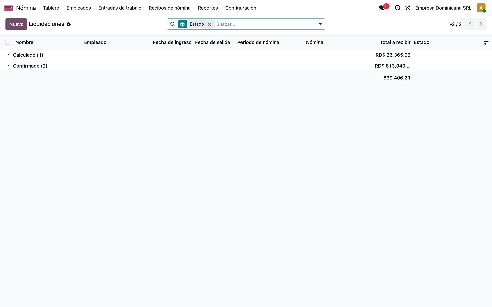
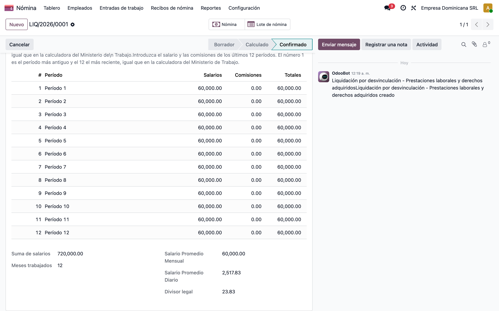
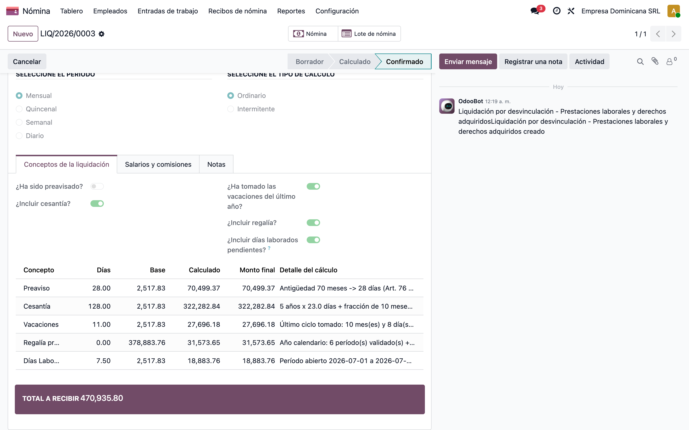
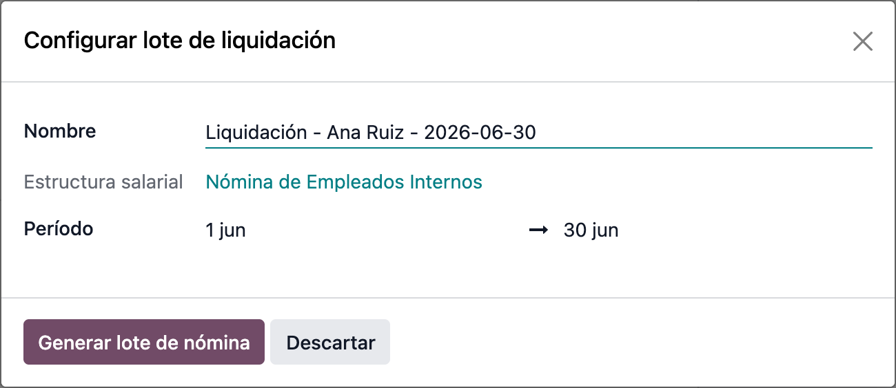
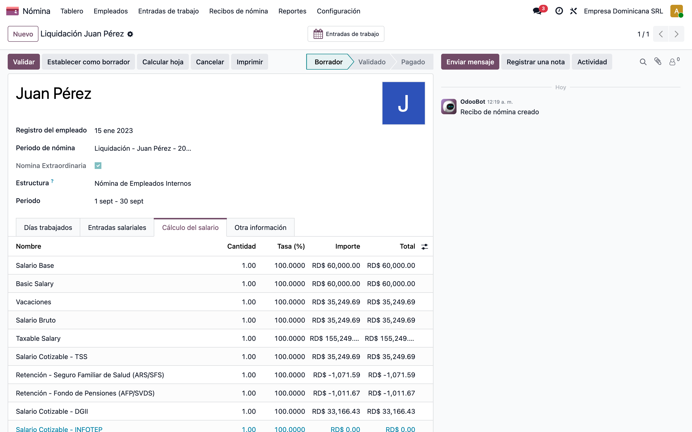
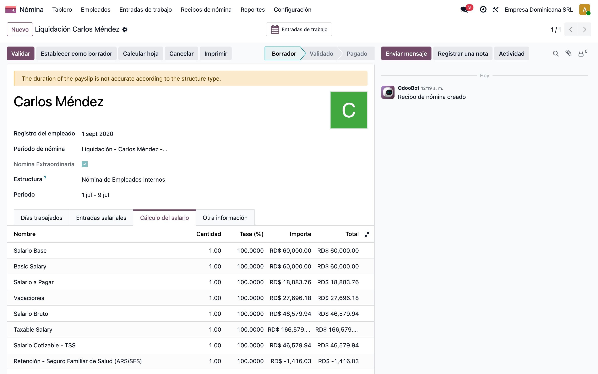
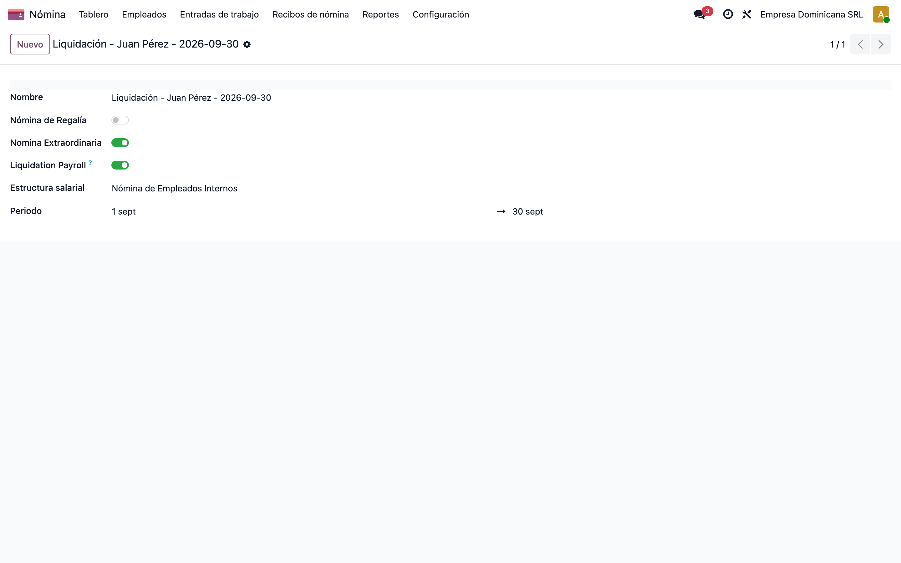

# Liquidación por Desvinculación — Prestaciones Laborales (l10n_do_hr_payroll_liquidation)

> Manual generado con `tools/manual-generator`. Las capturas se regeneran ejecutando el generador contra una base `test_v19_<módulo>`.

Este manual muestra, **desde una base de datos limpia**, el cálculo de **Prestaciones Laborales y Derechos Adquiridos** al desvincular un empleado en la República Dominicana: **Preaviso, Cesantía, Vacaciones, Regalía Pascual proporcional** y, de forma opcional, el pago de **Días Laborados pendientes**, replicando la calculadora oficial del **Ministerio de Trabajo** (https://calculo.mt.gob.do/) y sustentado en el Código de Trabajo (Arts. 76, 80, 177, 180, 219).

Al **confirmar**, la liquidación abre el **asistente de lote de nómina** (el mismo que al crear un lote) para configurar el período y genera **un único recibo extraordinario de liquidación** con todos los conceptos. Dentro de ese recibo cada concepto recibe su tratamiento fiscal: **preaviso, cesantía y regalía** son ingresos exentos, mientras que **vacaciones y días laborados** conservan su naturaleza salarial y **sí cotizan** TSS e ISR (sección 10). Los ajustes que esto exige sobre las reglas de la localización los declara **este** módulo, sin modificar `l10n_do_hr_payroll` (sección 12).

**Flujo funcional:**

1. Desde el empleado (o desde **Nómina → Recibos → Liquidaciones**) se crea una liquidación; al elegir el empleado se cargan sus fechas de ingreso/salida, el **salario vigente** y su historial de salarios.
2. Se completa la **grilla de 12 períodos** (salario + comisiones) — a mano, con **Cargar Historial de Nómina** o con **Completar**.
3. Se marca qué conceptos incluir (preaviso, cesantía, vacaciones, regalía, días laborados) y se pulsa **Calcular**.
4. Se revisan/ajustan los montos y se **Confirma**; en el asistente de lote (igual al de una nómina) se pulsa **Generar lote de nómina** → se emite **un solo recibo** de liquidación por empleado, con todos los conceptos seleccionados.

> **Replicar todo automáticamente** (crea base limpia, instala, siembra y captura):
> ```bash
> cd tools/manual-generator
> ./generate-manual.sh --module=l10n_do_hr_payroll_liquidation
> ```
> La base de ejemplo se siembra con `configs/l10n_do_hr_payroll_liquidation.seed.py`: tres empleados desvinculados (Juan Pérez, RD$60,000, 3a 8m, liquidación **confirmada**; Ana Ruiz, RD$30,000, 3 meses, liquidación **calculada**; Carlos Méndez, RD$60,000, salida a mitad de mes con **vacaciones proporcionales** y **días laborados**).

## Requisitos previos

- Módulo **`l10n_do_hr_payroll_liquidation`** instalado (arrastra su dependencia **`l10n_do_hr_payroll`** v `19.0.1.0.8` o superior). Este módulo **no modifica** los archivos de la localización: los ajustes que necesita sobre sus reglas los declara en su propio `data/hr_salary_rule.xml` (sección 12).
- Compañía con localización RD: **país** República Dominicana, **moneda** DOP y **tipo de riesgo laboral**.
- Empleado con **fecha de ingreso** (versión de contrato) y, para la carga automática, **historial de nómina validada** (líneas APAGAR/COM).
- Permisos de **Gestor de nómina** (`hr_payroll.group_hr_payroll_user`); para eliminar liquidaciones, **Administrador de nómina**.
- Parámetros de reglas de liquidación cargados por data (escalas Art. 76/80/180, divisor de jornada intermitente). Su vigencia arranca en 1992 para admitir salidas con fecha histórica.

## 1. Punto de entrada: botón «Liquidación» en el empleado

**Empleados → Empleados → Juan Pérez.** El módulo agrega un botón inteligente **Liquidación** en la ficha del empleado (grupo *Gestor de nómina*). Abre las liquidaciones del empleado con su `employee_id` predefinido, de modo que crear la liquidación de una persona recién desvinculada es un solo clic desde su ficha.

El mismo listado está disponible en el menú **Nómina → Recibos → Liquidaciones**.


## 2. Listado de liquidaciones

**Nómina → Recibos → Liquidaciones.** Cada liquidación tiene un **folio** (`LIQ/2026/0001`), el empleado, las fechas de ingreso/salida, el **Total a Recibir** y su **estado**:

- **Borrador** — recién creada, aún sin calcular.
- **Calculado** — conceptos calculados, editables antes de confirmar.
- **Confirmada** — nómina de liquidación ya generada.
- **Cancelada** — anulada (libera al empleado para una nueva liquidación).

Solo puede existir **una liquidación activa por empleado** (no cancelada); el sistema lo valida al crear.



## 3. Datos del solicitante, fechas y tipo de cálculo

Liquidación de **Juan Pérez**. Al elegir el empleado, el módulo autocompleta:

- El **selector de empleado** solo ofrece personas **activas y con contrato vigente**: la liquidación se prepara *antes* de archivar a quien sale, así que un empleado archivado o sin contrato aplicable no es candidato. El servidor lo vuelve a validar al calcular y al confirmar. Las liquidaciones ya creadas siguen consultándose aunque después se archive al empleado.
- **Fecha de ingreso** = inicio de su versión de contrato más antigua; **Fecha de salida** = su fecha de desvinculación (o la de hoy).
- **Causa de Salida** y descripción, tomadas de la ficha del empleado.
- **Tiempo Laborado** = antigüedad exacta (años/meses/días) que alimenta las escalas legales.
- **Salario Vigente** = sueldo del contrato a la fecha de salida; se usa para estimar el **período abierto** (mes parcial de salida) en la regalía y en los días laborados. Es editable.

Dos parámetros rigen todo el cálculo:

- **Período** (Mensual / Quincenal / Semanal / Diario): cómo se pagó el salario, para convertir el promedio por período a promedio mensual.
- **Tipo de Cálculo**: **Ordinaria** (Art. 147 CT, divisor de días laborables del mes) o **Intermitente** (Res. 04/93 MT, divisor 26). Determina el **Divisor Legal** con que se obtiene el salario diario.


## 4. Grilla de 12 períodos de salario + comisiones

Pestaña **Salarios y Comisiones**. Igual que la calculadora del Ministerio de Trabajo: **12 períodos**, donde el **1 es el más antiguo** y el **12 el más reciente**. Tres formas de llenarla:

- **A mano** — se escribe salario y comisiones de cada período.
- **Cargar Historial de Nómina** — para empleados mensuales, precarga los 12 meses desde las nóminas **validadas** en Odoo (suma de líneas `APAGAR` + `COM`).
- **Completar** — copia el último período con datos hacia todos los períodos vacíos siguientes.

Si la antigüedad es de **12 meses o más** y se encontraron **menos de 12 períodos**, la liquidación muestra un **aviso no bloqueante** («El historial salarial disponible podría estar incompleto…»). El cálculo se hace con lo que hay —nunca inventa salarios— y la grilla queda editable para completarla antes de confirmar. Una relación laboral naturalmente menor a un año no genera el aviso.

Con la grilla llena, el módulo calcula abajo:

- **Sumatoria de los Salarios** y **Meses Trabajados** (períodos con monto).
- **Salario Promedio Mensual** = promedio por período × períodos/mes.
- **Salario Promedio Diario** = promedio mensual ÷ **Divisor Legal**.

En el ejemplo (RD$60,000/mes constante): promedio mensual **RD$60,000** y diario **RD$2,517.83** (60,000 ÷ 23.83).



## 5. Conceptos calculados y Total a Recibir

Pestaña **Conceptos de Liquidación**. **Cinco** interruptores deciden qué se incluye, y **Calcular** genera las líneas:

- **¿Ha sido usted pre-avisado?** — si **No**, se paga **Preaviso** (Art. 76 CT: 7/14/28 días según antigüedad).
- **¿Desea incluir cesantía?** — **Cesantía** o auxilio de cesantía (Art. 80 CT: escala por meses < 1 año; 21 días/año hasta 5 años, 23 días/año a partir del 6º, más fracción).
- **¿Ha tomado las vacaciones del último año?** — decide **cómo** se calculan las **Vacaciones**, que **siempre** se computan (Arts. 177 y 180 CT). Con **un año o más** de antigüedad: si **No**, se pagan los 14/18 días completos; si **Sí**, solo la **proporción generada desde el último aniversario**. Con **menos de un año** el interruptor **no aplica**: no existe un ciclo anual previo cuyo disfrute pueda reducir el derecho, así que se paga siempre la escala proporcional del Art. 180 (más de 5 meses → 6 días, y así hasta 12 días).
- **¿Incluir salario de Navidad?** — **Regalía Pascual** proporcional (salarios del año calendario ÷ 12), prorrateando el mes de salida parcial.
- **¿Incluir días laborados pendientes?** — paga el **salario ordinario** del período abierto (desde el día siguiente a la última nómina validada hasta la salida). Viaja en el **mismo recibo** que el resto de los conceptos, pero a diferencia de las prestaciones **conserva su naturaleza salarial**: le aplican TSS, ISR y los aportes patronales (ver sección 10). La existencia de una nómina previa en el período **no** activa ni bloquea este concepto; lo decide People, porque un recibo puede contener pagos ajenos al salario ordinario.

Cada línea muestra **Días**, **Base**, **Monto Calculado**, **Monto Final** (editable) y el **Detalle del Cálculo** con el artículo aplicado. Para Juan (60,000/mes, 44 meses, sin vacaciones tomadas ni días laborados):

| Concepto | Días | Monto |
|---|---|---|
| Preaviso | 28 | RD$70,499.37 |
| Cesantía | 76 | RD$191,355.43 |
| Vacaciones | 14 | RD$35,249.69 |
| Regalía Pascual | — | RD$45,000.00 |
| **TOTAL A RECIBIR** | | **RD$342,104.49** |


## 6. Caso de antigüedad corta (sin vacaciones)

Liquidación de **Ana Ruiz** (RD$30,000/mes, **3 meses** de antigüedad), en estado **Calculado** — así se ve la pantalla **antes de confirmar**, con los montos aún editables. Las escalas legales se aplican solas según la antigüedad:

- **Preaviso** — escala de 7 días (3–5 meses): RD$8,812.42.
- **Cesantía** — escala de fracción, 6 días: RD$7,553.50.
- **Vacaciones** — **no aplica**: el Art. 180 CT concede el primer tramo a quien tiene **más de cinco meses** de servicio, y Ana tiene 3 meses y 29 días → RD$0.00. Con 5 meses y 5 días, en cambio, corresponderían 6 días **sin importar** el interruptor de vacaciones tomadas.
- **Regalía Pascual** — proporcional a lo devengado: RD$10,000.00.

Quien liquida puede **excluir** un concepto (interruptores) o **sobrescribir el Monto Final** antes de confirmar; **Volver a Borrador** permite corregir la grilla y recalcular.


## 7. Salida a mitad de mes: vacaciones proporcionales y días laborados

Liquidación de **Carlos Méndez** (RD$60,000/mes, ingreso 01/09/2020, salida el **9 de julio de 2026**), en estado **Confirmada**. Ilustra los tres ajustes para una salida a mitad de mes:

- **Vacaciones** con el interruptor *¿Ha tomado las vacaciones?* en **Sí**: en vez de eliminar el concepto, se paga la **proporción desde el último aniversario**. Con 10 meses desde el aniversario (01/09/2025) → **11 días** = RD$27,696.18.
- **Regalía Pascual** que **no** cuenta julio como mes completo: 6 meses validados del año (ene–jun = RD$360,000) **+** el devengado estimado del período abierto (1–9 jul = 7.5 días equivalentes) ÷ 12 = **RD$31,573.65**.
- **Días Laborados** pendientes: el salario ordinario del período abierto (1–9 jul, **7.5 días equivalentes**) = **RD$18,883.76**. Viaja en el mismo recibo de liquidación y cotiza TSS/ISR (paso 10).

El **Detalle del Cálculo** de cada línea deja trazable el período, los días equivalentes (L-V = 1, sábado = 0.5, domingo = 0) y el divisor aplicado.



## 8. Asistente de configuración del lote (al confirmar)

Al pulsar **Confirmar**, el módulo abre el **mismo asistente que aparece al crear un lote de nómina** («Configurar lote de liquidación»), de modo que las liquidaciones se generan **como si se estuviera generando una nómina**. El asistente llega **prellenado** con lo necesario para el flujo:

- **Nombre** del lote (por empleado si es una sola liquidación, o «Liquidaciones - <fecha>» si se confirman varias a la vez).
- **Período** (fechas del lote) — ajustable antes de generar.
- **Estructura** = *Estructura Base* (la única con los conceptos PREA/CESA/VAC/REPA/DLAB); se muestra de solo lectura.
- **Compañía** y las banderas técnicas *Extraordinary Payroll* + *Liquidation Payroll*.

**Generar lote de nómina** crea el recibo de liquidación y lo vincula; **Descartar** cierra sin generar. Confirmar **varias** liquidaciones seleccionadas en el listado las agrupa en un **único lote**.



## 9. Nómina de liquidación generada (un solo recibo)

Al **Confirmar** la liquidación de Juan, el módulo crea un **lote y un recibo extraordinarios** marcados como *liquidación*, y envía cada concepto a su código de nómina (**PREA, CESA, VAC, REPA**). Pestaña **Cálculo del salario** del recibo:

- **Preaviso, cesantía y regalía** aparecen como **ingresos exentos**: la bandera de liquidación los mantiene fuera del salario cotizable, como manda la ley.
- Las **vacaciones** van por la regla **`VAC`** de la localización, que pertenece al **Salario Ordinario**. La TSS define el salario cotizable como salario ordinario + comisiones + vacaciones por ley, y la DGII incluye las vacaciones —disfrutadas o no— entre las remuneraciones sujetas a ISR. Por eso el **Salario Cotizable** del recibo es exactamente el monto de vacaciones.
- Sobre esa base aparecen las retenciones **`SFSE`** (SFS empleado) y **`SVDSE`** (AFP empleado), y el **`ISR`** cuando la base anualizada supera el tramo exento. El preaviso y la cesantía **no** contribuyen a ninguna de ellas.
- El **Salario Neto** es el **Total a Recibir** de la liquidación menos esas retenciones.

El botón inteligente **Nómina** de la liquidación lleva a este recibo, y **Lote de nómina** al lote que lo contiene.



## 10. Días laborados en el mismo recibo (salario ordinario, SÍ cotiza)

Recibo de liquidación de **Carlos Méndez**, cuya salida cae el **9 de julio**. Los días efectivamente trabajados del período abierto (**1–9 de julio**) viajan en **este mismo recibo**, no en una nómina ordinaria aparte:

- La liquidación envía la entrada **`DLAB`** con la **cantidad de días equivalentes** (7.5), no un monto. Es la regla salarial **`APAGAR`** la que los convierte en dinero: `salario / divisor × días` = **RD$18,883.76**. Así el cálculo vive en un solo sitio y no se duplica.
- Aunque el lote es extraordinario, `APAGAR` corre porque el recibo trae `DLAB`. Sin ese ajuste la regla se saltaba en toda nómina extraordinaria, que es lo que antes obligaba a emitir un segundo recibo.
- El **Salario Cotizable** suma **vacaciones + días laborados**; sobre él se retienen **`SFSE`** y **`SVDSE`**, y se calculan los aportes patronales y su contabilización. Preaviso, cesantía y regalía siguen exentos en el mismo recibo.
- Cubre **solo** el período posterior a la última nómina validada, de modo que **no duplica** un salario ya pagado.

Un único recibo por empleado mantiene juntas la trazabilidad, las bases y los conceptos: no hay que conciliar dos documentos para saber qué se le pagó a la persona al salir.



## 11. Lote de nómina con distintivo «Liquidation Payroll»

El lote generado (**hr.payslip.run**) queda marcado a la vez como **Extraordinary Payroll** y **Liquidation Payroll**. Este segundo distintivo (campo técnico `l10n_do_is_liquidation`) es el que mantiene el preaviso, la cesantía y la regalía fuera del salario cotizable. **No** es una exención total del recibo: si el mismo recibo paga vacaciones o días laborados, esos conceptos sí cotizan (secciones 9 y 10). Es visible como **badge** en la cabecera del lote y como campo en el formulario, para separarlo de la nómina mensual ordinaria en reportes y conciliaciones.



## 12. Tratamiento fiscal por concepto (arquitectura)

El módulo `l10n_do_hr_payroll_liquidation` **depende de** `l10n_do_hr_payroll` y necesita ajustar algunas de sus reglas salariales. Esos ajustes se declaran **dentro de este módulo** (`data/hr_salary_rule.xml`, `data/hr_payslip_input_type.xml`, `data/hr_rule_parameter.xml`) como registros que sobreescriben por `xml_id`, **sin editar** los archivos de la localización: la nómina de un cliente que no instale este módulo queda intacta, y el alcance real del cambio se revisa en un solo lugar.

**a) Bandera de liquidación en el lote y el recibo.** Campo `l10n_do_is_liquidation` en `hr.payslip.run` (con distintivo en la vista) y su reflejo `related` en `hr.payslip`. Marca un lote como pago de prestaciones laborales.

**b) Bandera de contenido salarial.** Campo calculado `l10n_do_liquidation_ordinary_income` en `hr.payslip`: verdadero **solo** en un recibo de liquidación que además trae entradas de naturaleza salarial (`VAC`, `DLAB` o `REAL`). Es la pieza que permite distinguir «recibo de prestaciones puras» de «recibo que también paga salario», y lo que hace que los overrides sean equivalentes a las reglas originales fuera del flujo de liquidación.

**c) Retenciones y bases condicionadas, no suprimidas.** Once reglas de la localización (**SFS/AFP empleado, SFS/AFP/SRL/INFOTEP patronal, ISR** y las bases **OREM, COTSS, COTDGII, SALISR**) llevaban `and not payslip.l10n_do_is_liquidation` o `and not payslip.l10n_do_payslip_extraordinary`, lo que dejaba las bases de TSS y DGII en cero en todo recibo de liquidación. Ahora cada condición admite además el caso «liquidación con contenido salarial», y trata ese recibo como el **último de la relación laboral**, de modo que se retiene aunque la salida caiga a mitad de mes. Con la bandera en falso, cada expresión se reduce algebraicamente a la original.

**d) Vacaciones por la regla `VAC`, no por una regla exenta paralela.** La liquidación envía el importe calculado a la entrada **`VAC`** de la localización, cuya regla pertenece al **Salario Ordinario**. La regla `VACL` (*Vacaciones (Liquidación)*, Ingresos Exentos) y su tipo de entrada quedan **desactivados** —no eliminados, para no alterar los recibos ya emitidos—. En la nómina ordinaria la entrada `VAC` con valor 1 sigue siendo el interruptor «¿Pago de vacaciones?»; en un recibo de liquidación el importe llega ya calculado y se respeta tal cual.

**e) Días laborados por `DLAB` → `APAGAR`.** `APAGAR` solo corría en nómina ordinaria, lo que obligaba a emitir un recibo separado. Ahora también corre en una nómina extraordinaria que traiga `REAL` o `DLAB`. La liquidación transfiere **días**, y `APAGAR` hace la aritmética una sola vez. La regla `DLAB` queda desactivada: duplicaba ese cómputo y su fórmula referenciaba `amount_to_pay`, una variable que la nómina no publica en el contexto de evaluación, por lo que fallaba en cuanto un recibo traía la entrada.

**f) Tope del período abierto.** El conteo de días equivalentes (L-V = 1, sábado = 0.5, domingo = 0) nunca supera el salario contractual: un mes íntegramente trabajado paga el salario completo y su conteo se fija en el divisor legal; un período parcial paga `salario/divisor × días`, topado al salario. El divisor del salario ordinario es siempre `DIAS_LAB_MES`, porque el divisor de jornada intermitente (Res. 04/93) rige las prestaciones, no el salario que paga la nómina.

**g) Reglas de cálculo (parámetros por data).** Escalas legales editables sin tocar código: `LIQ_PREAVISO_SCALE` (Art. 76), `LIQ_CESANTIA_SCALE` / `LIQ_CESANTIA_YEAR` / `LIQ_CESANTIA_YEAR_5` (Art. 80), `LIQ_VAC_SCALE` (Art. 180, usada también para la **proporción de vacaciones** por meses desde el último aniversario) y `LIQ_DIV_INTERMITENTE` (divisor jornada intermitente = 26).

**h) Vigencia histórica de parámetros.** La liquidación admite fechas de salida y antigüedades históricas, pero las semillas de la localización arrancan su vigencia en la fecha de instalación, así que una salida anterior no encontraba valor. Este módulo **añade** —sin modificar la semilla existente— valores con la vigencia de su ley:

- Constantes del Código de Trabajo: `DIAS_LAB_MES`, `HORAS_LAB_DIA`, `LAST_DAY`, `VAC_DAYS` y `VAC_DAYS_60`.
- Tasas del SDSS (porcentajes fijos, no montos indexados): `SFS_RET`, `SFS_CONT`, `AFP_RET`, `AFP_CONT`, `SRL_CONT` e `INFOTEP_CONT`.

Los **topes** sobre los que se aplican esas tasas (`SFS_TOPE`, `AFP_TOPE`, `SRL_TOPE`) sí se indexan cada año y **no** se retrofechan: aplicar el tope vigente a un período anterior daría una retención errónea en silencio. Antes de generar el recibo, la liquidación comprueba los tres y, si falta alguno, los **lista todos de una vez** con la fecha y la ruta donde cargarlos, en vez de fallar uno por uno. Cargados los topes del año, una liquidación con fecha histórica se genera completa.

## Notas

### Motor de cálculo (Código de Trabajo)

| Concepto | Base legal | Regla resumida |
|---|---|---|
| **Preaviso** | Art. 76 CT | Días según antigüedad (3m→7, 6m→14, ≥12m→28) × salario **diario** promedio. Solo si el empleado **no** fue preavisado. |
| **Cesantía** | Art. 80 CT | < 3m: no aplica. 3–11m: escala de fracción (6/13 días). ≥ 1 año: 21 días/año (23 desde el 6º año) + fracción (≥3m→+6, ≥6m→+13) × salario **diario**. |
| **Vacaciones** | Arts. 177 y 180 CT | **Siempre se computa.** Con **menos de un año** el interruptor de vacaciones tomadas **no interviene**: rige la escala del Art. 180 sobre la antigüedad (más de 5m → 6 días … más de 11m → 12 días). Con **un año o más**: si **no** se tomó el último ciclo, 14 días (18 si ≥ 5 años); si **sí** se tomó, la proporción según el tiempo **desde el último aniversario**. La escala concede cada tramo a quien tiene *más de* N meses, así que una antigüedad de N meses exactos se queda en el tramo anterior. Base diaria del **último** salario si es fijo, o promedio si es **variable**. |
| **Regalía Pascual** | Ley 5235 / Art. 219 CT | Salarios y comisiones **devengados en el año calendario** ÷ 12. El mes de salida parcial **no** cuenta como completo: se suman los meses validados del año + el **devengado estimado del período abierto** (no se prorratea un mes parcial como entero). |
| **Días Laborados** | Art. 192 CT (salario) | *(Opcional)* Días equivalentes del período abierto (L-V = 1, sábado = 0.5, domingo = 0), topados al divisor legal. La liquidación transfiere los **días** por la entrada `DLAB` y la regla `APAGAR` calcula `sueldo / DIAS_LAB_MES × días`. **Cotiza** TSS/ISR en el **mismo** recibo de liquidación. |

### Divisores y promedios

- **Promedio por período** = Sumatoria de salarios ÷ meses trabajados (períodos con monto).
- **Promedio mensual** = promedio por período × períodos/mes (Mensual 1, Quincenal 2, Semanal 4.33, Diario = `DIAS_LAB_MES`).
- **Salario diario** = promedio mensual ÷ **Divisor Legal** (Ordinaria = `DIAS_LAB_MES` ≈ 23.83; Intermitente = 26).
- **Período abierto** (regalía y días laborados) = desde el día siguiente a la última nómina validada hasta la salida. Un mes íntegramente trabajado paga el salario completo; un período parcial usa el conteo de días equivalentes topado al salario (§9.1).
- Los promedios se guardan como **float sin redondeo** intermedio; solo el **monto final** de cada concepto se redondea a la moneda.

### Ciclo de estados

`Borrador → Calcular → Calculado → Confirmar → Confirmada`

- **Volver a Borrador** (desde Calculado): permite corregir la grilla y recalcular.
- **Cancelar**: anula la liquidación; si ya generó el recibo, lo elimina **solo si sigue en borrador** (si fue validado o pagado, bloquea la cancelación). El lote sobrevive mientras otra liquidación del mismo grupo lo siga usando. Al cancelar se libera al empleado para una nueva liquidación.
- No se puede **recalcular ni editar** una liquidación **Confirmada**.

### Integración con la nómina

1. Valida empleado, compañía, contrato vigente, fechas y que no exista otra liquidación activa.
2. **Confirmar** crea o reutiliza un `hr.payslip.run` con `l10n_do_extraordinary=True` y `l10n_do_is_liquidation=True`. Varias liquidaciones confirmadas juntas comparten un solo lote.
3. Crea **un único** `hr.payslip` por empleado dentro del lote, con una línea de entrada por concepto seleccionado, y ejecuta `compute_sheet()`:
   - `PREA`, `CESA`, `REPA` llevan el **monto final** y conservan su exención.
   - `VAC` lleva el **monto final** de vacaciones y cotiza como salario ordinario.
   - `DLAB` lleva la **cantidad de días equivalentes**; `APAGAR` los convierte en monto.
4. Vincula liquidación ↔ lote ↔ recibo (`payslip_run_id`, `payslip_id`) y deja la trazabilidad en el chatter.
5. No crea un segundo recibo si la liquidación ya tiene uno vigente: reintentar el asistente lo rechaza en vez de duplicar la nómina.

### Criterios de aceptación

1. **Paridad con la calculadora del MT**: preaviso, cesantía, vacaciones y regalía coinciden con https://calculo.mt.gob.do/ (Juan 60,000/44m → total RD$342,104.49; Ana 30,000/3m).
2. **Vacaciones tomadas**: no se elimina el concepto; se paga la proporción desde el aniversario (Carlos 10m → 11 días).
3. **Regalía con salida parcial**: julio no se cuenta como mes completo (Carlos → RD$31,573.65 = (360,000 + devengado 1–9 jul) / 12).
4. **Vacaciones < 1 año independientes del interruptor**: 5 meses y 5 días paga 6 días tanto en «Sí» como en «No»; 5 meses exactos paga 0.
5. **Vacaciones como salario ordinario**: la liquidación usa `VAC`, no genera `VACL`, y las vacaciones alimentan el salario cotizable de TSS y el cálculo de ISR.
6. **Días laborados en el mismo recibo**: entrada `DLAB` con los días, `APAGAR` calcula el monto una sola vez, y **no** se crea un recibo ordinario separado.
7. **Indemnizaciones exentas**: preaviso, cesantía y regalía no contribuyen al salario cotizable; un recibo que solo las pague no tiene líneas `SFSE`/`SVDSE`/`ISR`.
8. **Fechas históricas**: una salida anterior al año de instalación resuelve las escalas legales; si falta un tope indexado, el mensaje nombra el código y la fecha.
9. **Selector de empleado**: excluye archivados y personas sin contrato vigente, y el servidor lo revalida al calcular y confirmar.
10. **Historial incompleto**: avisa sin bloquear y permite completar la grilla.
11. **Una liquidación activa por empleado**; **autocarga** de historial validado; recalcular sustituye líneas sin duplicar.
12. **Regresión de la nómina ordinaria**: instalar este módulo no cambia ningún importe de la nómina que no sea de liquidación (ver más abajo).

### Notas técnicas

- La grilla usa la convención de la calculadora oficial: **1 = período más antiguo, 12 = más reciente**.
- `Cargar Historial de Nómina` solo aplica a empleados **mensuales** con nóminas en estado `validated`/`paid`; la entrada manual siempre tiene prioridad.
- Con **historial validado**, la regalía separa los meses completos del año del **período abierto**; en **entrada puramente manual** (sin nóminas), confía en la grilla tal como se capturó.
- Las vacaciones usan **base del último salario** para salario fijo y **base promedio** cuando hay comisiones (`is_variable_salary`).
- El indicador *¿tomó vacaciones?* es una **decisión manual** del usuario; el módulo no consulta el módulo de Ausencias, y con menos de un año de antigüedad no se toma en cuenta.
- La **causa de salida** es informativa: no decide conceptos ni bloquea la liquidación.
- El monto de días laborados se calcula sobre el **sueldo de la versión vigente** del empleado, la misma base que usa `APAGAR`, para que la liquidación y el recibo no difieran. El campo **Salario Vigente**, editable, solo afecta la estimación del período abierto de la **regalía**.
- Las fechas de contrato viven en `hr.version` detrás del grupo *Administrador de RRHH*, mientras que la liquidación la operan gestores de nómina: el filtro del selector y la validación las resuelven con permisos elevados, sin exigir un grupo extra al operador.
- Los ajustes sobre las reglas de la localización se declaran en este módulo. Si algún día se actualiza **solo** `l10n_do_hr_payroll`, ese módulo reescribe sus propios valores y pisa los overrides hasta que se vuelva a actualizar este módulo; actualizar ambos juntos funciona porque Odoo respeta el orden de dependencias.

### Verificación reproducible

Dos scripts en la raíz del entorno permiten reproducir la validación completa sin depender de una revisión manual:

```bash
./verify_liquidation_batch2_acceptance.sh    # criterios del informe Batch 2
./verify_liquidation_payroll_regression.sh   # la nómina ordinaria no cambia
```

El primero ejercita sobre una base limpia cada criterio de aceptación (AC-B2-01..10) y cada prueba del plan de regresión (REG-01..09) del informe, más la tabla de días equivalentes del Batch 1, y reporta PASS/FAIL con el dato que lo sustenta. El segundo se explica abajo. Además, el módulo trae 40 tests unitarios (`./run_tests.sh --module=l10n_do_hr_payroll_liquidation`), de los cuales 13 existen solo para vigilar que los overrides no alteren la nómina que no es de liquidación.

### Regresión de la nómina ordinaria

Como este módulo ajusta reglas de la localización, razonar la equivalencia no basta: se mide. El script `verify_liquidation_payroll_regression.sh` (raíz del entorno) instala `l10n_do_hr_payroll` en una base y `l10n_do_hr_payroll_liquidation` en otra, calcula los **mismos 15 escenarios** de nómina en ambas y compara, por recibo, cada código de regla con su total.

```bash
./verify_liquidation_payroll_regression.sh
```

Resultado esperado: **13 de 15 escenarios idénticos**. Las dos diferencias son mejoras, no regresiones:

- **Días laborados en nómina ordinaria**: sin este módulo el cálculo **aborta**, porque la regla `DLAB` referencia `amount_to_pay`, un nombre que la nómina no publica. Con el módulo instalado esa regla queda desactivada —`APAGAR` ya hace el cómputo— y el recibo se calcula.
- **Nómina con fecha de 2025**: sin el módulo falla por falta de vigencia de `LAST_DAY`; con el módulo llega más lejos y falla en `SFS_TOPE`, el tope indexado que no se retrofecha a propósito.

Los escenarios de bonificación fallan **igual en ambas bases**: la regla `INFE` referencia `BONOS`, que no está definido porque la regla `BONOS` lee `inputs['BONOS']` cuando el tipo de entrada es `BONO`. Es un defecto preexistente de la localización, ajeno a este módulo y pendiente de corregir aparte.
