# Nómina Dominicana — Manual de usuario (Odoo 20)

> Manual generado con `tools/manual-generator`. Las capturas se regeneran ejecutando el generador contra una base `test_v20_<módulo>`.

Este manual explica, paso a paso, cómo configurar y procesar la nómina dominicana en Odoo 20 con el módulo **Nómina Dominicana** (`l10n_do_hr_payroll`).

**¿Qué cambió respecto a la versión anterior?**

| Antes (Odoo 19) | Ahora (Odoo 20) |
|---|---|
| Las entradas del recibo (incentivos, horas extra, préstamos…) eran *Tipos de entrada*. | Las entradas son **Reglas salariales** marcadas como *Recibo de nómina*. Se agregan en el recibo con el mismo código de siempre (INC, HEL, PRE…). |
| Los descuentos fijos se configuraban con *Duración: Una vez / Limitado / Ilimitado* y un *Monto total*. | En **Payslip Adjustments** solo se indica el **Importe** y si se **repite** (*Repeat*) hasta una fecha. |
| Un ajuste terminado quedaba *Terminado*. | Un ajuste está *En proceso* o *Pausado*; los botones **Pause** y **Restart** lo detienen o reanudan. |

Los ejemplos usan dos empleados quincenales: **Ana Mercedes Pérez** (RD$ 85,000) y **Beto Antonio Gómez** (RD$ 45,000).

## Requisitos previos

- Compañía con país **República Dominicana** y moneda **DOP**.
- Usuario con permiso **Nómina: Administrador** y el grupo **Manager Configuration** (Ajustes → Usuarios → pestaña *Permisos*). Sin ese grupo no aparece el menú *Legislación Dominicana*.
- Empleados con un contrato en la estructura **Nómina de Empleados Internos**.

## 1. Ajustes de la nómina dominicana

Ruta: **Nómina → Configuración → Ajustes**, sección de localización dominicana.

- **ONG**: márquelo si la compañía es una organización sin fines de lucro.
- **Escala de Riesgo Laboral**: elija la clase de riesgo (I a IV) que le asignó la TSS. Se usa para calcular el Seguro de Riesgos Laborales (SRL).
- **Automatización de pago de vacaciones**: calcula el pago de vacaciones a partir de las ausencias aprobadas.

Pulse **Guardar** al terminar.

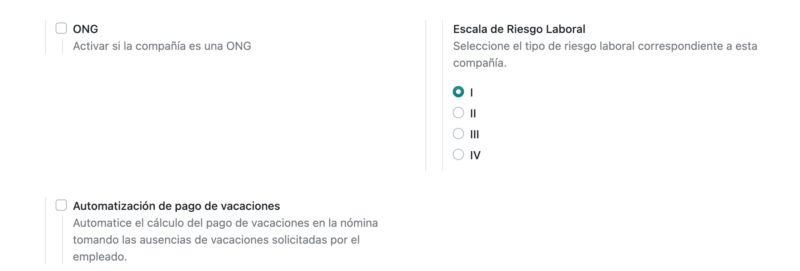

## 2. Menú de configuración

En **Nómina → Configuración** están todas las tablas que usa la nómina: **Estructuras**, **Reglas**, **Parámetros de regla** y, al final, **Legislación Dominicana** (*División de Pagos*, *Escala de riesgo laboral* y *Escala de Retención*).

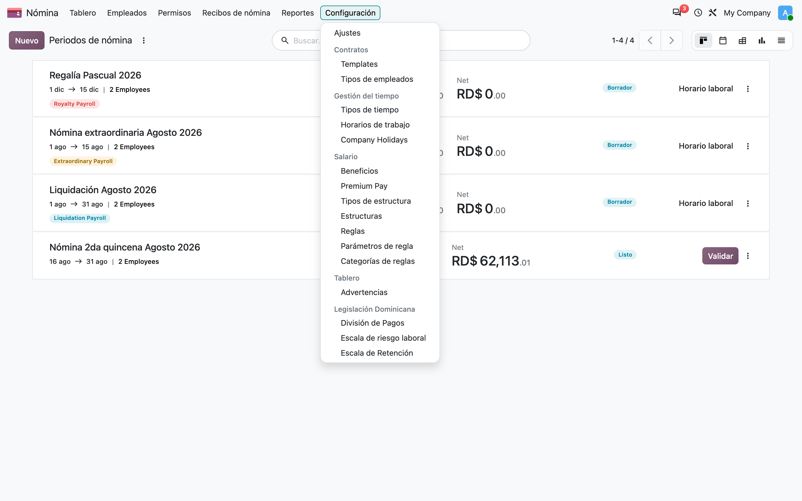

## 3. División de pagos

Ruta: **Configuración → Legislación Dominicana → División de Pagos**.

Indica en cuántas partes se divide el salario mensual: **mes (1)**, **quincenal (2)** o **semana (4.33)**. Ya viene cargada; normalmente no hay que tocarla.

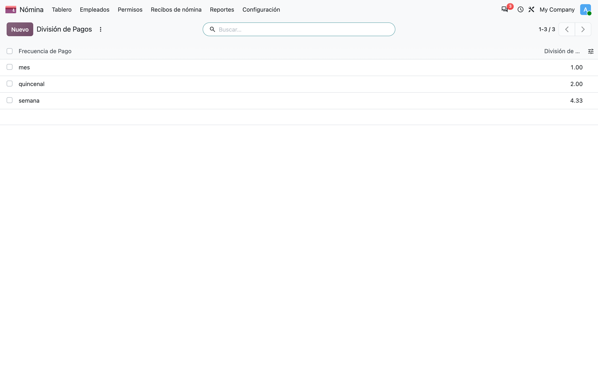

## 4. Escala de riesgo laboral

Ruta: **Configuración → Legislación Dominicana → Escala de riesgo laboral**.

Catálogo de clases de riesgo con su porcentaje. La clase de la compañía se elige en los Ajustes (paso 1).

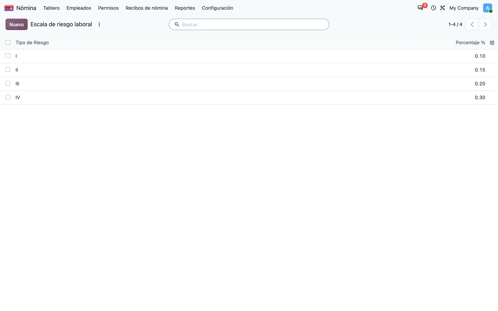

## 5. Escala de retención ISR

Ruta: **Configuración → Legislación Dominicana → Escala de Retención**.

Tramos anuales del Impuesto Sobre la Renta publicados por la DGII (exento, 15 %, 20 % y 25 %, con su monto fijo). Cuando la DGII cambie la escala, edite los montos aquí; no hace falta cambiar ninguna regla.

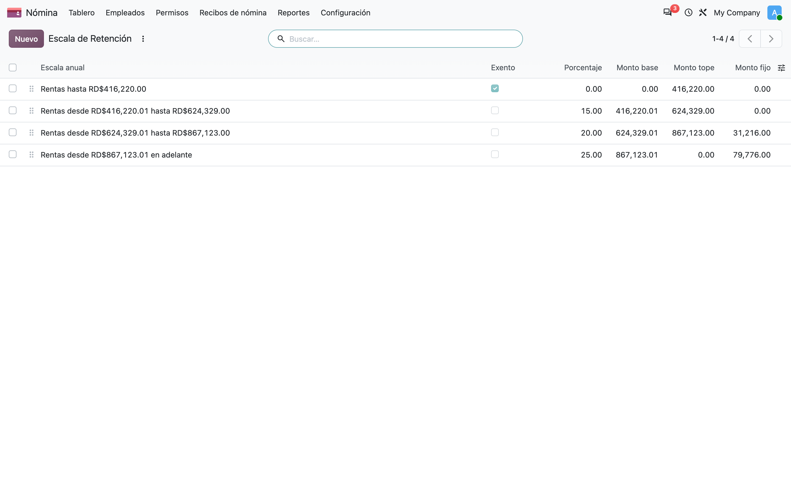

## 6. Estructura salarial

Ruta: **Configuración → Estructuras → Nómina de Empleados Internos**.

- **Tipo**: *Dominican Employee* (con pago programado **quincenal**).
- **Diario de salarios**: diario contable donde se registran los asientos de nómina. Es obligatorio.
- Pestaña **Reglas salariales**: todas las reglas que se calculan en el recibo (salario, horas extra, TSS, ISR, descuentos…). Una misma regla puede estar en varias estructuras.

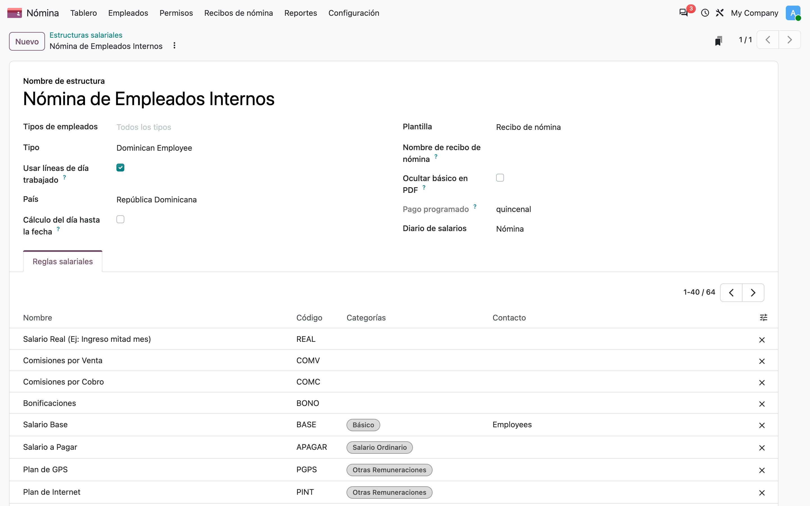

## 7. Reglas que se capturan en el recibo (entradas)

Ruta: **Configuración → Reglas**, abra una regla, por ejemplo **Incentivos (INC)**.

- **Inputtable on → Recibo de nómina** marcado: la regla se puede agregar como entrada en el recibo y usarse en un ajuste de nómina (paso 9).
- Pestaña **Input Options**: nombre que se muestra en el recibo, sección y si se agrega sola a cada recibo nuevo (*Seleccionada de forma predeterminada*).

Todas las entradas dominicanas ya vienen marcadas: INC, INCCER, HEL, HEF, HEN, HNI, VAC, BVAC, DLAB, NLAB, PRE, COOP, COOA, ALM, COMB, UNIF, CAJA, SEC, SEV, DDSL, REEM, INEX, ISRCRED, REPA, PREA, CESA, VACL, DTER, PALIM, entre otras. Para **Salario Real (REAL)**, **Comisiones por Venta (COMV)**, **Comisiones por Cobro (COMC)** y **Bonificaciones (BONO)** existe una regla de captura que no genera línea propia: su valor lo usan otras reglas.

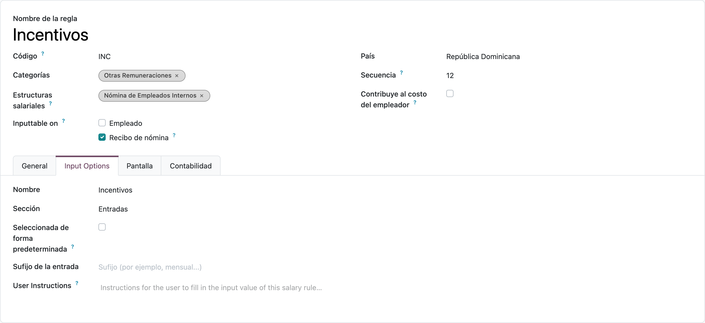

## 8. Datos de nómina del empleado

Ruta: **Empleados → (empleado) → pestaña Nómina**.

- **Salario** y **Tipo de salario** del contrato.
- **Categoría del pago**: debe ser *Dominican Employee* para usar la estructura dominicana.
- **Law Retentions** (retenciones de ley): *Distributed* reparte TSS e ISR entre las quincenas; *End of month* las descuenta completas en la última quincena.
- **Works in two companies / Single Withholding Agent**: para empleados con otro empleador que actúa como agente de retención único del ISR.

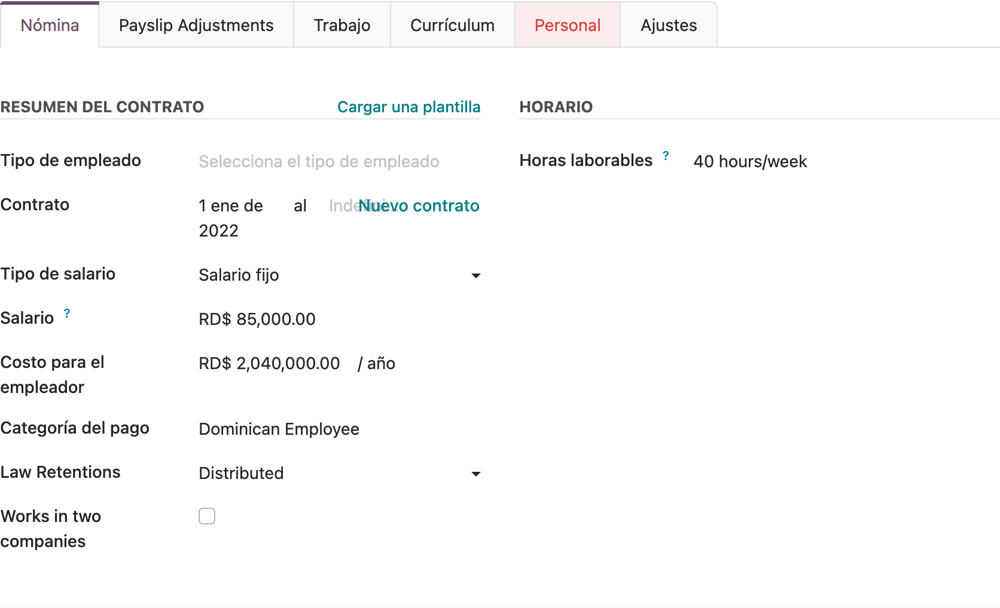

## 9. Ajustes de nómina del empleado (Payslip Adjustments)

Ruta: **Empleados → (empleado) → pestaña Payslip Adjustments**.

Aquí se registran los montos que deben entrar solos en los recibos del empleado: préstamos, cooperativa, faltantes de caja, incentivos fijos, etc. Pulse **Add an adjustment** para crear uno.

> Con el modo desarrollador activo también existe la lista completa en **Nómina → Empleados → Payslip Adjustments**.

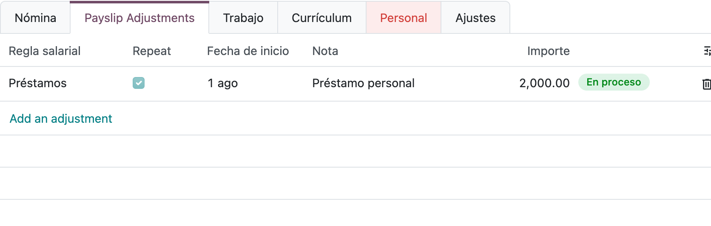

## 10. Ajuste que se repite (ej. préstamo en cuotas)

En la pestaña **Payslip Adjustments** del empleado pulse **Add an adjustment** y complete:

1. **Empleado** y **Regla salarial** (ej. *Préstamos*).
2. **Importe**: monto que se descuenta en **cada** recibo (la cuota).
3. **Fecha de inicio**.
4. Marque **Repeat** y, en **Until**, la fecha de la última cuota. Si lo deja vacío se repite hasta que lo pause.
5. **Apply on** (solo empleados quincenales): *All payslips* (ambas quincenas), *First fortnight* o *Second fortnight*.
6. **Nota**: referencia opcional.

En el ejemplo, Ana paga RD$ 2,000 de préstamo solo en la segunda quincena, de agosto a noviembre.

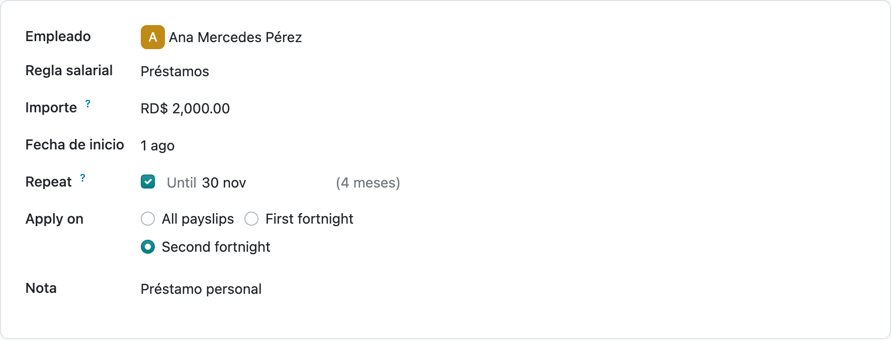

## 11. Ajuste de una sola vez (ej. faltante de caja)

Igual que el anterior, pero **sin** marcar *Repeat*. El importe completo entra en el siguiente recibo y, al validarlo, el ajuste se cierra solo.

Los botones **Pause** y **Restart** detienen o reanudan un ajuste sin borrarlo.

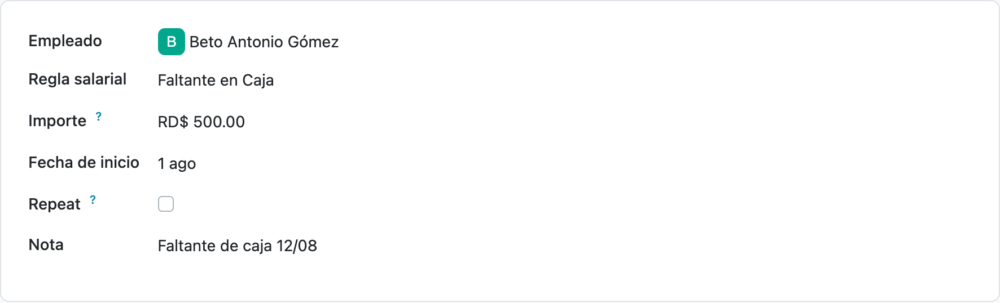

## 12. Periodos de nómina

Ruta: **Nómina → Recibos de nómina → Periodos de nómina**.

Cada tarjeta es un periodo. Las etiquetas de color indican el tipo: **Royalty Payroll** (Regalía Pascual), **Extraordinary Payroll** y **Liquidation Payroll**. El botón **Validar** aparece cuando los recibos están listos.

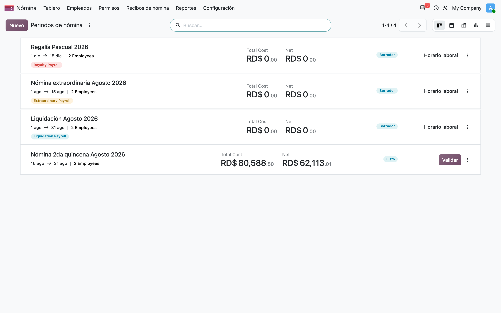

## 13. Crear un periodo

Pulse **Nuevo** y complete:

- **Nombre** y **Periodo** (fechas de la quincena o del mes).
- **Estructura de pagos**: *Nómina de Empleados Internos*.
- Active **Nómina de Regalía** para la Regalía Pascual, **Nómina Extraordinaria** para pagos fuera del ciclo (no aplica los ajustes ni el salario regular) o **Liquidation Payroll** para prestaciones.

Pulse **Siguiente**, elija los empleados y Odoo genera un recibo por cada uno.

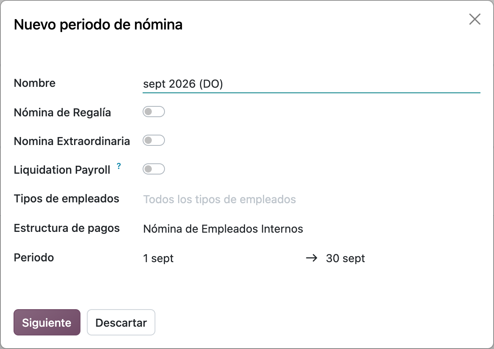

## 14. Recibos del periodo

Al abrir un periodo se ven sus recibos con el costo total y el salario neto de cada empleado. Desde aquí se **Valida** todo el periodo o se abre un recibo para revisarlo.

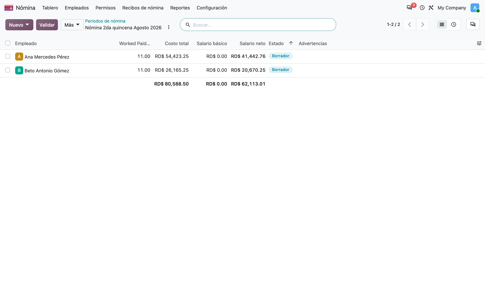

## 15. Recibo: entradas salariales

En el recibo, pestaña **Entradas salariales**:

- Las líneas de los **ajustes** (pasos 10 y 11) aparecen solas, con su nota como descripción (aquí, *Préstamo personal*).
- Para agregar un valor solo a este recibo pulse **Agregar una línea**, elija la **Regla salarial** (ej. *Incentivos*) y escriba el **Valor**. Para horas extra (HEL, HEF, HEN, HNI) el valor es la cantidad de horas; para *Días Laborados* (DLAB) y *Ausencias* (NLAB), los días.

Pulse **Calcular** después de cambiar las entradas.

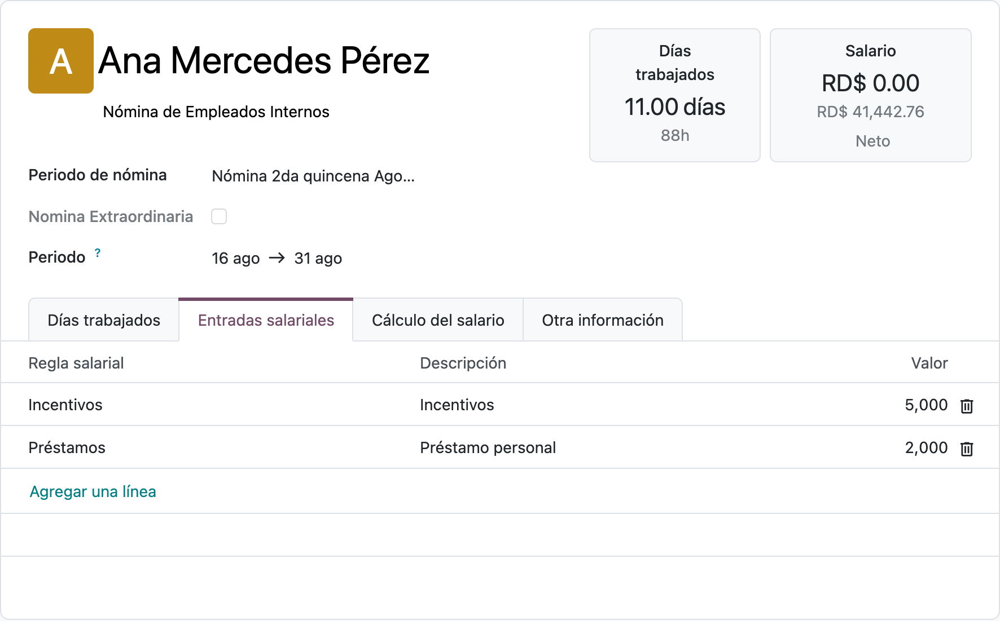

## 16. Recibo: cálculo del salario

Pestaña **Cálculo del salario**: todas las líneas calculadas — salario a pagar, incentivos, salario bruto, retenciones SFS y AFP, ISR, descuentos y **Salario Neto**.

Si todo está correcto pulse **Validar** (en el recibo o en el periodo). Un recibo validado se puede devolver con **Establecer como borrador**; en ese caso lo cobrado de los ajustes se revierte.

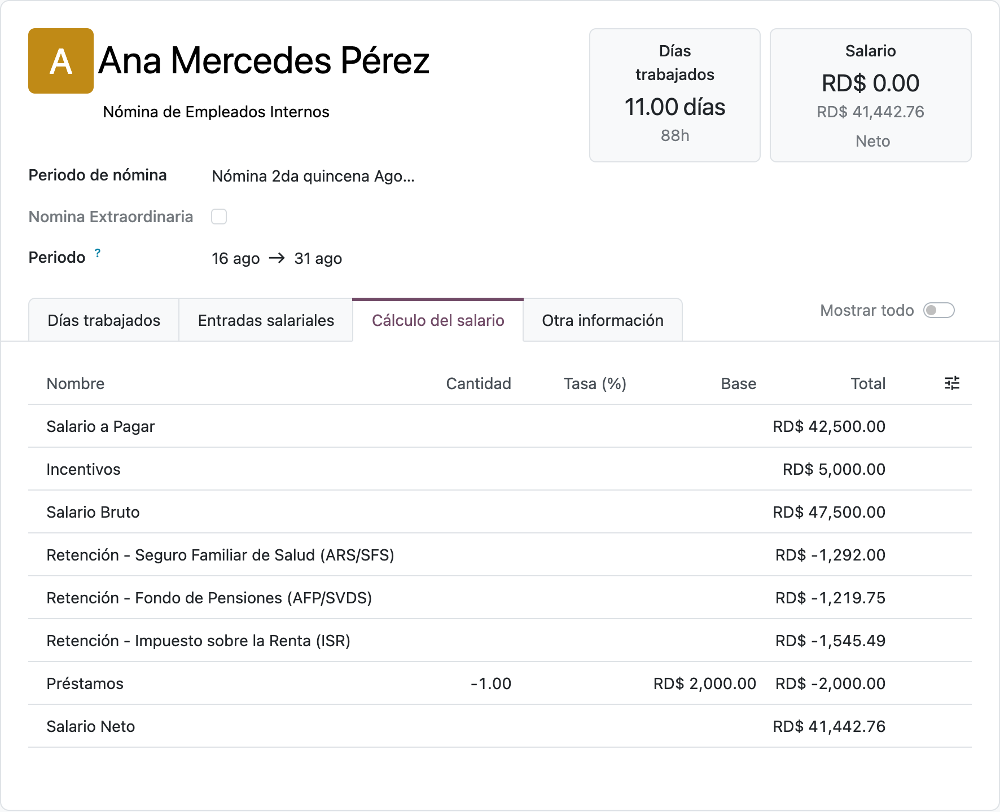

## 17. Análisis de recibos por regla salarial

Ruta: **Nómina → Reportes → Payslip Analysis by Salary Rule**.

Tabla dinámica con el monto de cada regla por departamento y empleado. Use los filtros (*Este año*, *Aparece en recibo*) y agrupe por periodo, empleado o mes. **Hoja de cálculo** y el botón de descarga exportan la tabla.

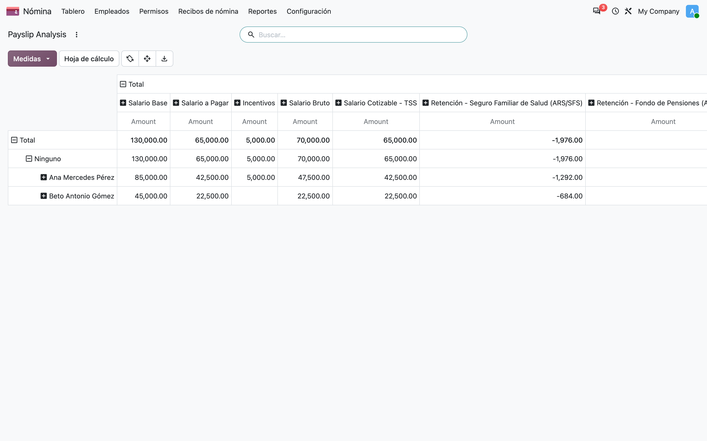

## Notas

**Preguntas frecuentes**

- *No veo el menú Legislación Dominicana*: al usuario le falta el grupo **Manager Configuration** (ver Requisitos).
- *Un ajuste no aparece en el recibo*: revise que esté **En curso**, que la fecha de inicio sea anterior al fin del periodo, que *Until* no haya pasado y, si el empleado es quincenal, que *Apply on* corresponda a esa quincena. En una **Nómina Extraordinaria** los ajustes nunca se aplican.
- *La regla que quiero no sale al agregar una entrada*: la regla debe estar en la estructura del recibo y tener marcado **Recibo de nómina** (paso 7).
- *Cambió la escala del ISR*: actualice los tramos en **Escalas de retención** (paso 5).
