# Nómina Dominicana — pruebas de la migración a Odoo 20.0

> Manual generado con `tools/manual-generator`. Las capturas se regeneran ejecutando el generador contra una base `test_v20_<módulo>`.

Recorrido de las pruebas hechas sobre `l10n_do_hr_payroll` al portarlo a la línea 20.0 (`master`, que se auto-reporta como `19.5a1`). Cada sección muestra la pantalla que se verificó y qué cambió del lado del core para que siguiera funcionando.

Resultado de la corrida que produjo estas capturas:

| Prueba | Resultado |
|---|---|
| Instalación en base limpia | sin errores |
| Suite del módulo (`--test-tags=/l10n_do_hr_payroll`) | 9/9 |
| Verificaciones de flujo | 48/48 |
| Upgrade de una base con forma 19.0 | correcto |
| Repetir el upgrade | sin cambios (idempotente) |


## Requisitos previos

- `l10n_do_hr_payroll` **19.5.2.0.0** — la versión debe empezar con la serie que corre el servidor, o `check_version()` la vuelve no instalable.
- Dependencias ya portadas: `l10n_do_banks` y `l10n_do_hr` (PR #1137 y #1138).
- Compañía con país República Dominicana y moneda DOP.
- Empleados en la estructura *Nómina de Empleados Internos* con frecuencia quincenal.

## 1. Menú de configuración dominicano

**Nómina → Configuración → Dominican legislation.** 20.0 retiró el módulo `hr_work_entry_enterprise`, que era el padre de este menú; ahora cuelga de `hr_payroll.menu_hr_payroll_configuration`. Las tres pantallas que abre son las de las secciones 2, 3 y 4.

## 2. Escalas de retención ISR

Las cuatro escalas DGII cargadas por data del módulo. La lista sigue editable en línea y los permisos siguen siendo los mismos, ahora declarados en `security/ir.access.csv`.

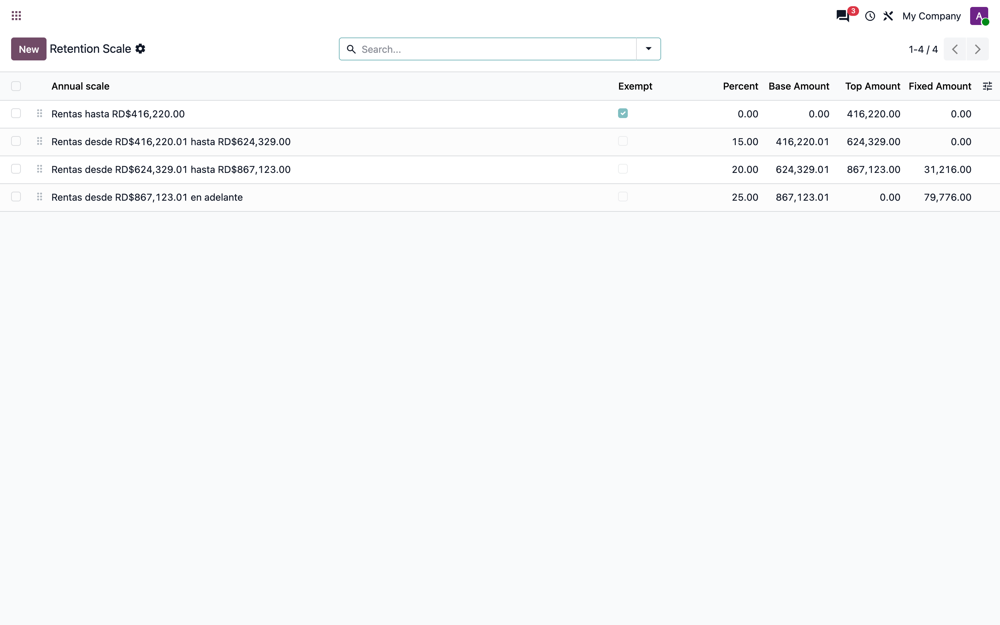

## 3. División de pago

Divisiones mensual / quincenal / semanal. La restricción de unicidad se declara con `models.Constraint`, la forma que 20.0 espera en lugar de `_sql_constraints`.

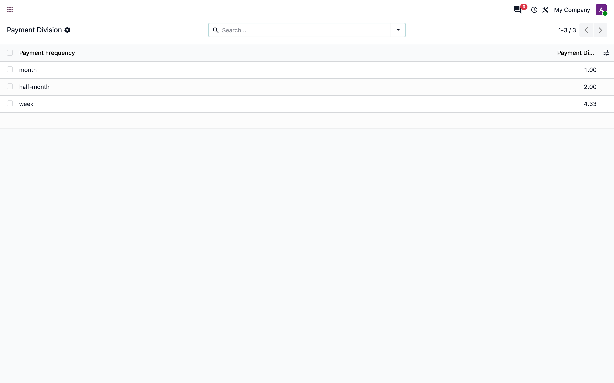

## 4. Tipos de riesgo laboral

Catálogo usado por la contribución de riesgo laboral (SRL) de la compañía.

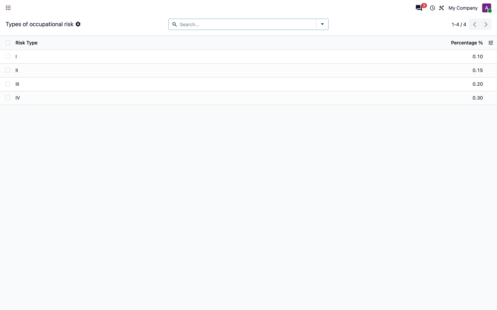

## 5. Ajustes de nómina

**Ajustes → Nómina.** El bloque *Dominican Localization* (ONG, tipo de riesgo laboral y automatización de vacaciones) se reancló después del bloque `hr_payroll_accountant`. El xpath que ocultaba el botón nativo *Choose a Payroll Localization Package* se eliminó: 20.0 quitó ese ajuste, y en su lugar el módulo muestra el paquete activo.

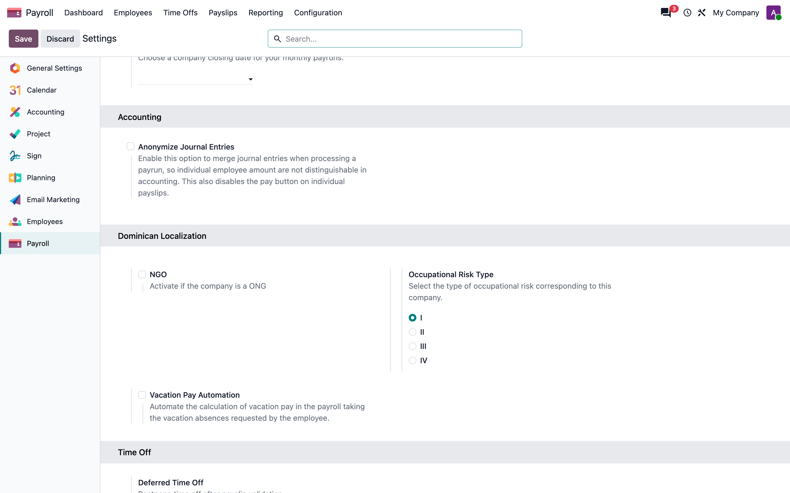

## 6. Empleado: retenciones de ley

**Empleados → un empleado → pestaña Nómina.** Los campos `l10n_do_schedule_retentions`, *Works in two companies* y *Single Withholding Agent* viven en `hr.version` y se anclan al formulario que trae `hr_payroll` (`payroll_hr_employee_view_form`), después de *Reference*: en 20.0 ese campo ya no está en la vista base de `hr`.

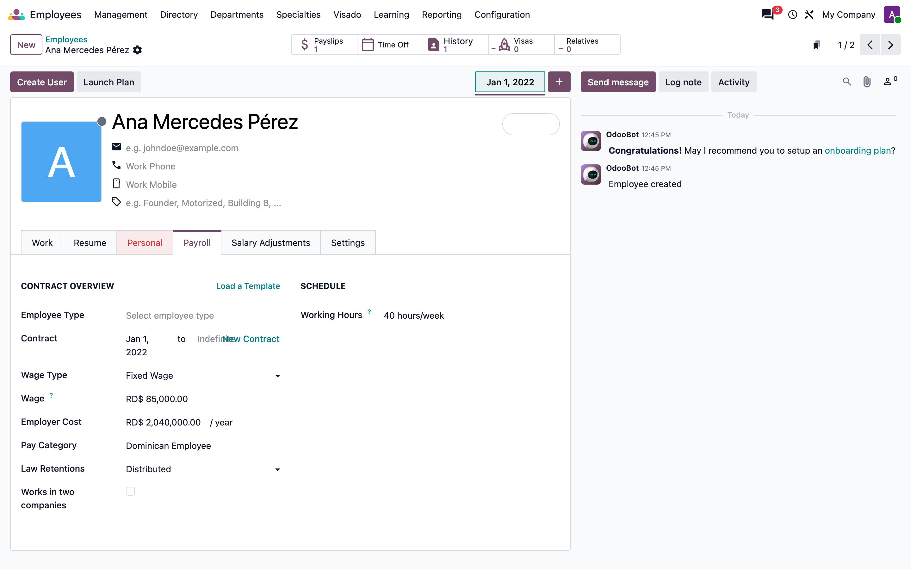

## 7. Ajuste salarial por quincena

**Nómina → Ajustes salariales.** `l10n_do_apply_on` decide en qué quincena se descuenta. En 19.0 el ajuste tenía varios empleados (`employee_ids`); 20.0 lo dejó en uno (`employee_id`), así que la bandera de frecuencia se calcula sobre ese empleado y el campo pasó a llamarse `l10n_do_semi_or_biweekly`.

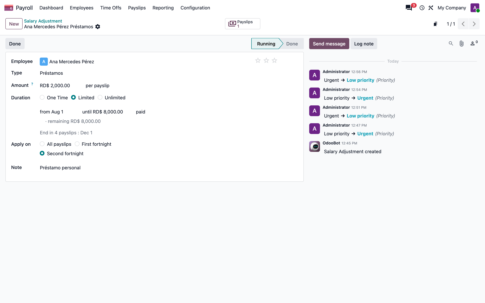

## 8. Nóminas: banderas dominicanas

**Nómina → Nóminas.** Las tres banderas (*Royalty*, *Extraordinary*, *Liquidation*) se reanclaron dentro de la plantilla `payrun_name` del kanban de 20.0. El `div.o_payrun_info` que usaba la vista de 19.0 desapareció junto con el rediseño del kanban por pasos.

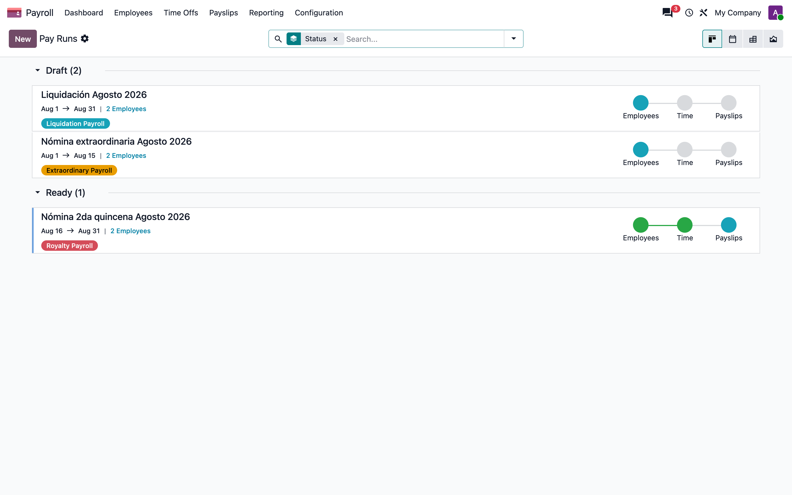

## 9. Alta de nómina

El formulario de `hr.payslip.run` es ahora un diálogo de creación. Las tres banderas se añaden después de `company_id`; el `schedule_pay` que la vista de 19.0 ocultaba ya no existe en el modelo, y el botón *Computar Nóminas* se retiró porque el core trae `action_re_compute_payslips`.

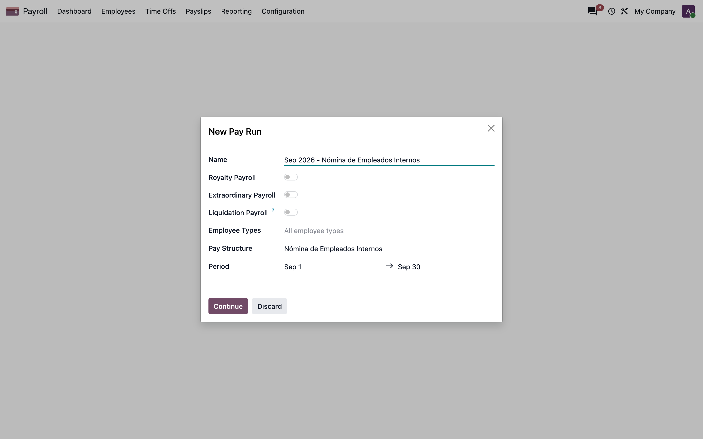

## 10. Recibo: cómputo salarial

Recibo de la 2da quincena. *Wage* muestra el salario base porque el módulo declara `_get_basic_wage_line_codes` → `BASE` y `_get_gross_wage_line_codes` → `BRUTO`, los ganchos que 20.0 abrió; en 19.0 el módulo reemplazaba `_compute_basic_net` completo y `basic_wage` quedaba en cero. Se ven las retenciones SFS, AFP e ISR, el depósito a terceros y el préstamo.

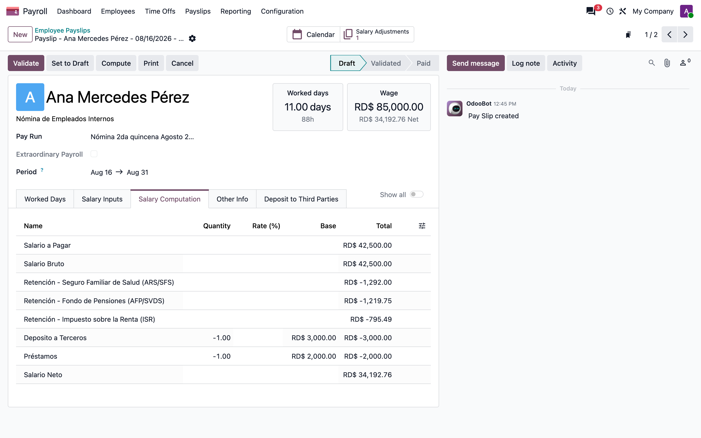

## 11. Recibo: entradas salariales

La línea de *Préstamos* la genera el ajuste salarial y queda marcada con `l10n_do_from_attachment`, la bandera que distingue lo generado de lo capturado a mano. `compute_sheet` la reconstruye pidiéndole el recálculo al ORM: llamar al compute directamente escribe `input_line_ids`, y 20.0 vuelve a entrar a `compute_sheet` desde `hr.payslip.write` con esa misma clave — una recursión infinita.

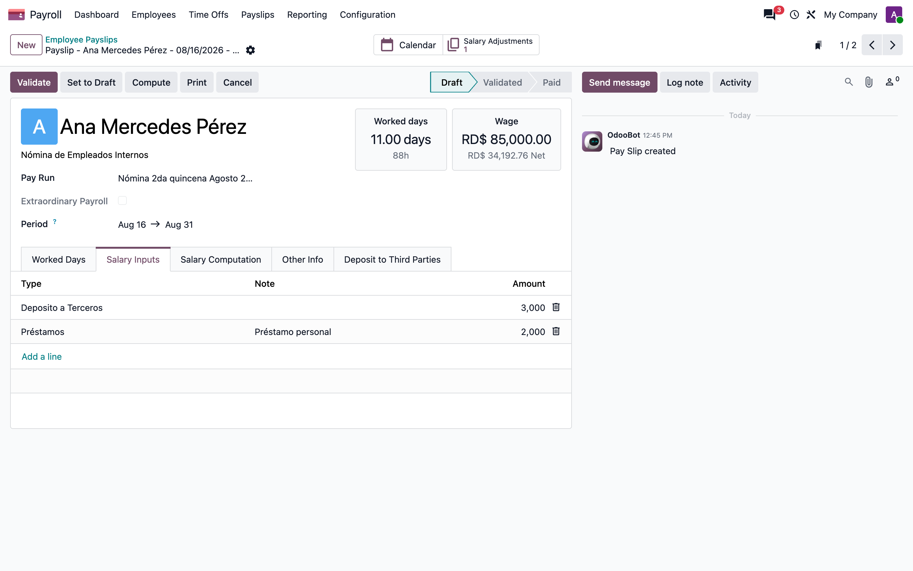

## 12. Recibo: depósito a terceros

La pestaña se declaraba como `<sheet>` dentro del `notebook`, así que nunca se dibujaba. Ahora es un `<page>` y la restricción que exige que el total cuadre con la entrada DTER es verificable desde la interfaz.


## 13. Reporte de líneas de recibo

**Nómina → Reportes → Recibos.** Reemplaza la vista SQL `payslip.report` del módulo, que leía `hr_salary_rule.category_id` y `struct_id`, columnas que 20.0 convirtió en many2many. El reporte de líneas del core cubre lo mismo sin SQL, y el módulo sólo le agrega los dos filtros dominicanos (*Appears On Payslip* y *Nóminas con cheque*).

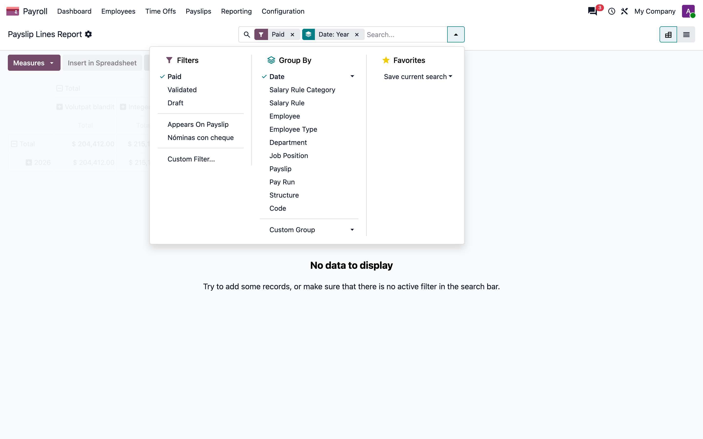

## Notas

### Cómo se regeneran estas capturas

El generador estándar crea la base con el core del contenedor. En este entorno el `enterprise` fijado (2026-07-31) no es compatible con el nightly del contenedor (19.5a1-20260901) — `account_accountant` no instala — así que la base se levanta con un core contemporáneo al `enterprise` fijado y se llama al generador con `--base-url`:

```bash
cd tools/manual-generator
node capture.mjs --config=configs/l10n_do_hr_payroll_migracion_20.json \
  --base-url=http://localhost:8099 --db=<base> --login=admin --password=admin \
  --out=../../docs/manuals/l10n_do_hr_payroll_migracion_20/img
node render-manual.mjs --config=configs/l10n_do_hr_payroll_migracion_20.json \
  --img=../../docs/manuals/l10n_do_hr_payroll_migracion_20/img \
  --out=../../docs/manuals/l10n_do_hr_payroll_migracion_20/README.md
```

La base de ejemplo se siembra con `configs/l10n_do_hr_payroll_migracion_20.seed.py`.

### Hallazgos previos, no tocados por este port

- Las reglas `DLAB` y `NLAB` usan una variable `amount_to_pay` que ninguna regla define (la regla `APAGAR` declara `amounttopay`), así que lanzan `NameError` cuando llega su entrada. `NLAB` además lee `employee.l10n_do_days_division`, un campo que no existe.
- La regla `ISR` anualiza multiplicando por 12 el `SALDGII` del recibo, que en una nómina quincenal es medio mes.
- `l10n_do_first_payslip_of_month` es verdadero en cualquier recibo que no tenga otro anterior en el mes, así que en un mes con una sola quincena capturada resulta verdadero a la vez que `l10n_do_last_payslip_of_month`.

