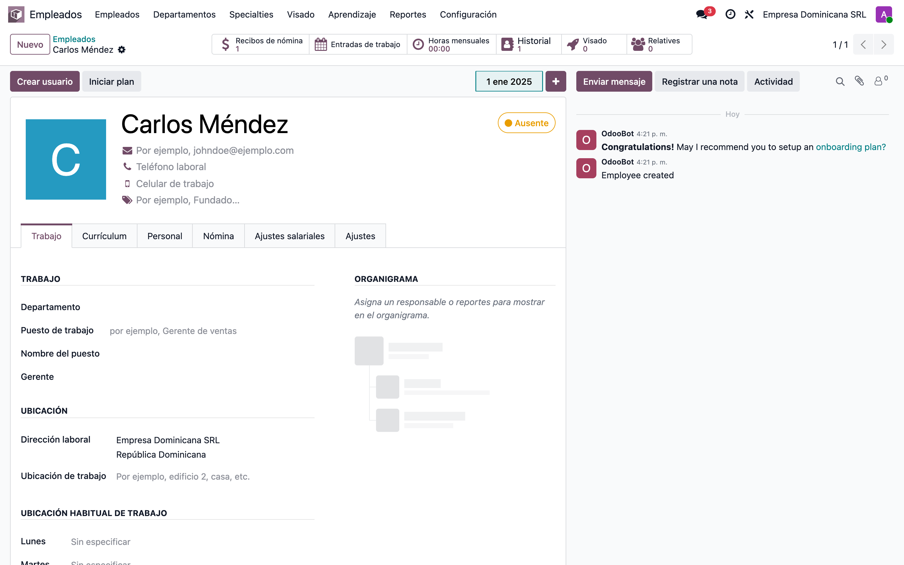
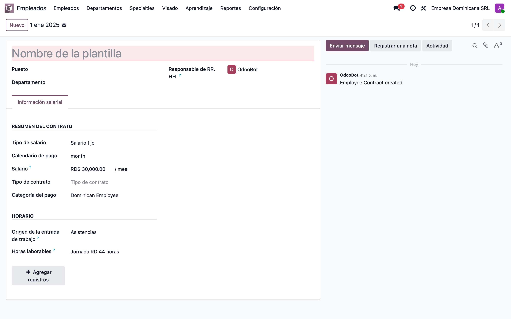
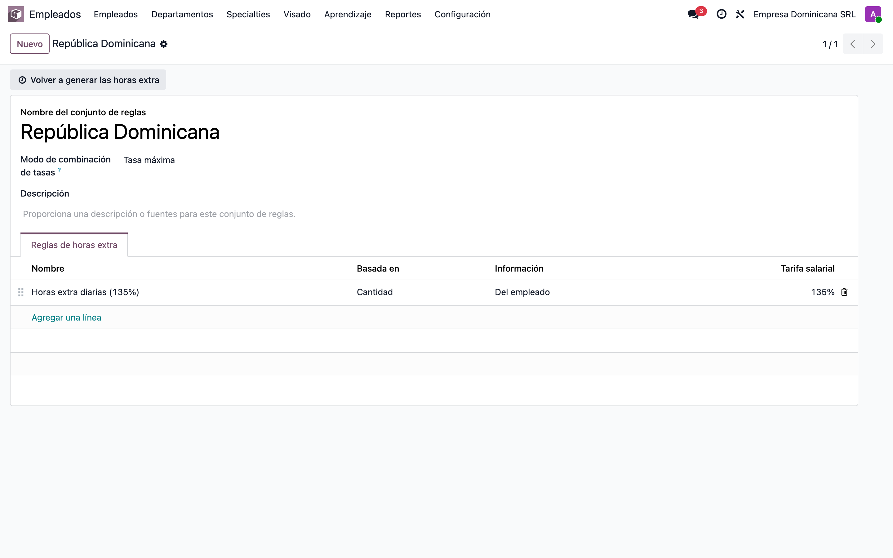
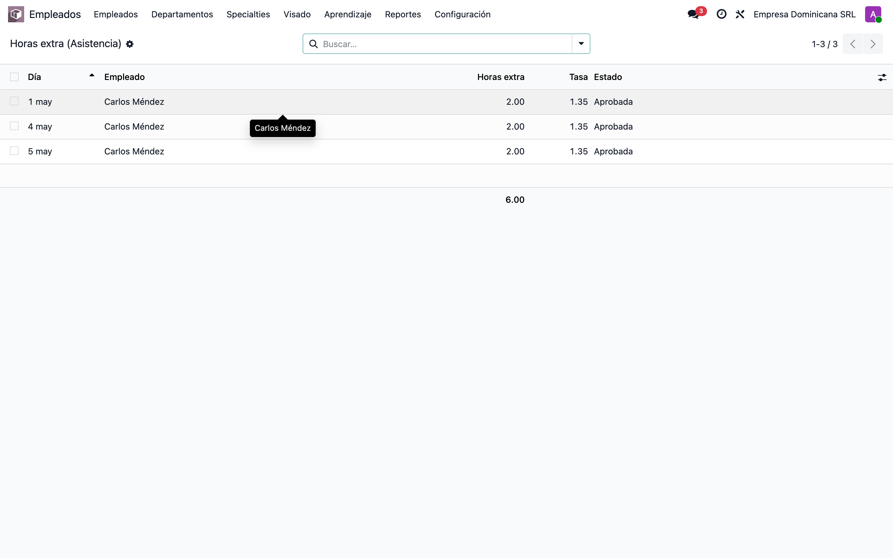
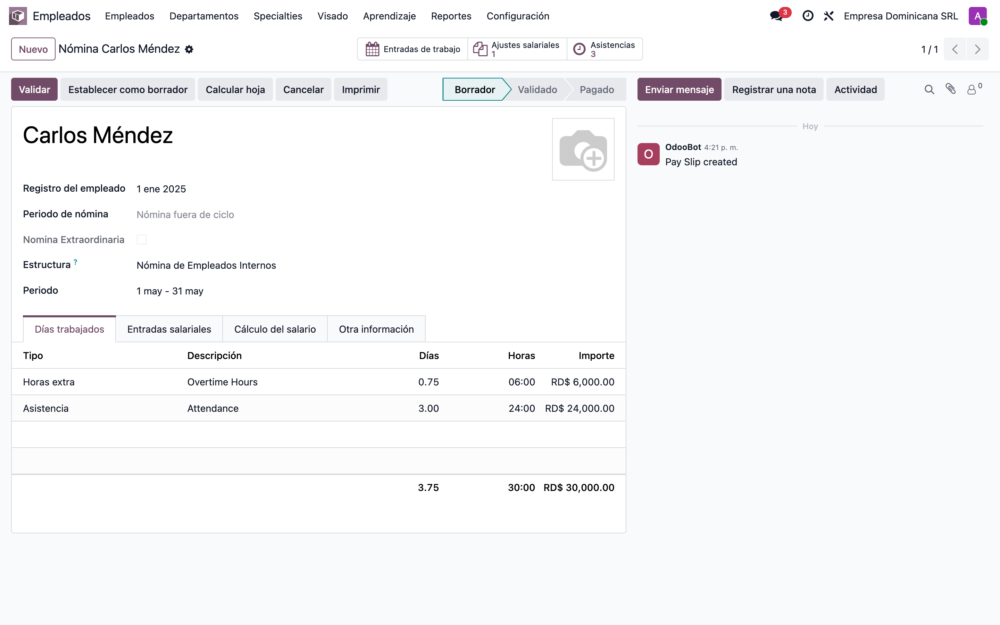
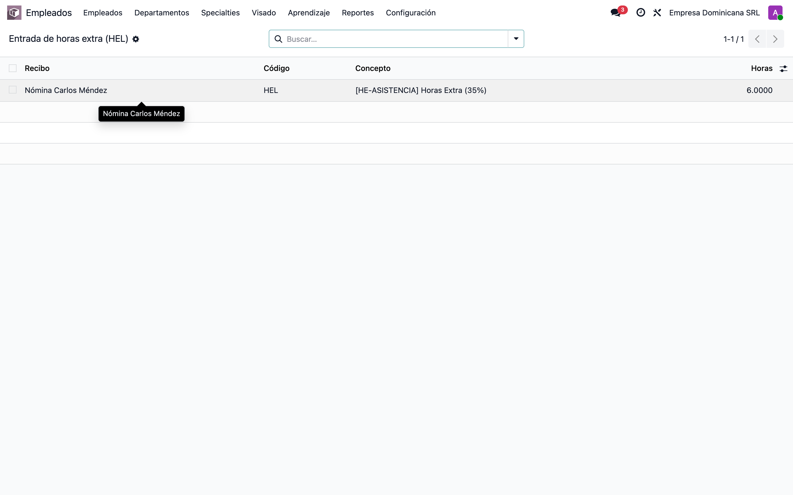
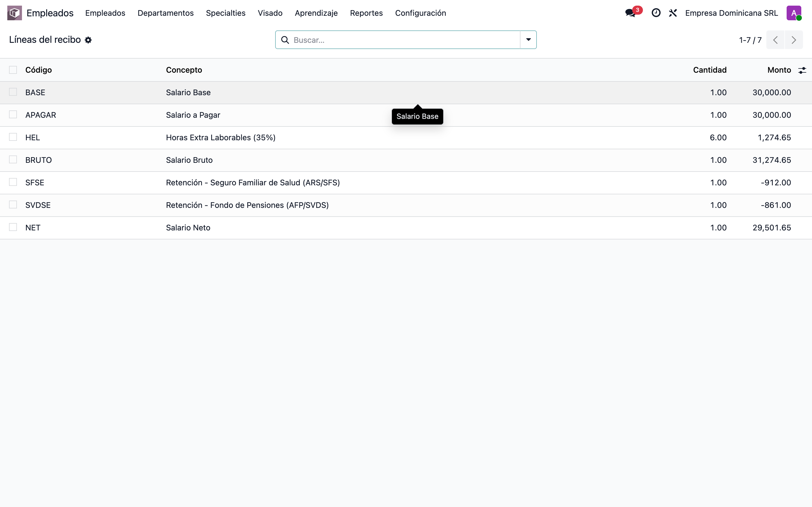

# Horas extra de asistencia → input de nómina (HEL) — Manual de configuración y validación

Este manual muestra, **desde una base de datos limpia**, cómo dejar el flujo funcionando: el motor **nativo** de Odoo calcula las horas extra desde la asistencia y las pone en el recibo como línea de *Días Trabajados* (`OVERTIME`); el módulo **`l10n_do_hr_payroll_news_attendance`** lleva esas horas a la **entrada (input) de horas extra** dominicana (`HEL`), que es de donde la estructura RD paga el recargo del 35%.

**Cómo se calcula el monto:** el input `HEL` lleva el **número de horas** extra; la regla salarial las multiplica por el salario/hora y el recargo: `HEL = (salario / DIAS_LAB_MES / HORAS_LAB_DIA) × EXTRA_DIURNA × horas`. En el ejemplo: salario RD$30,000, 6 h extra → `(30000/23.83/8)×1.35×6 = 1,274.65`.

## Requisitos previos

- Instalar **`l10n_do_hr_payroll_news_attendance`** — arrastra `hr_payroll_attendance` (motor nativo de overtime), `hr_work_entry_attendance`, `hr_payroll`, `l10n_do_hr_payroll` y `l10n_do_hr_payroll_news`.
- Compañía con localización RD: **país** República Dominicana, **moneda** DOP y **tipo de riesgo laboral**.
- **Asistencias → Configuración → Ajustes → Validación de horas extra = Aprobación automática** (para la prueba; si es *por gerente*, hay que aprobar las horas extra antes de calcular).
- Un **calendario laboral** que represente la jornada teórica (ej. RD 44h: L-V 8h, Sáb 4h). El exceso sobre esa jornada son las horas extra.
- Interfaz en español (es_DO).

## 1. Empleado

**Empleados → Empleados.** Crear el empleado (en el ejemplo *Carlos Méndez*) con sus datos RD: cédula, NSS, sexo, fecha de nacimiento y salario mensual (RD$30,000).

## 2. Contrato: origen Asistencias + Regla de horas extra

En el **contrato / configuración de nómina** del empleado:

- **Origen de entradas de trabajo = Asistencias** → la nómina toma las horas reales.
- **Horario de trabajo** = la jornada teórica (RD 44h).
- **Regla de horas extra** = el ruleset RD (activa *Horas extra desde asistencia*).

## 3. Regla de horas extra (Overtime Ruleset)

**Asistencias → Configuración → Reglas de horas extra.** Regla *República Dominicana*: **Basado en = Cantidad**, **Período = Día**, **Horas esperadas del contrato = Sí**, **Pagar horas extra = Sí**, **Tasa = 1.35**, **Tipo de entrada de trabajo = Overtime Hours** (`OVERTIME`).

> Para nocturno/feriado: agregar reglas *Timing* con su propio tipo de entrada de trabajo y mapearlas en `_l10n_do_overtime_input_map` (`HNI`/`HEF`/`HEN`).

## 4. Horas extra detectadas desde la asistencia

Al registrar la asistencia (**Asistencias → Gestión**), Odoo compara las horas reales contra la jornada y genera una **línea de horas extra** por día con exceso. En el ejemplo: 3 días de 08:00 a 18:00 (10 h) vs jornada de 8 h → **2 h extra/día = 6 h**. Con *Aprobación automática* quedan **Aprobadas** (solo las aprobadas pasan a la nómina).

## 5. Recibo: Días Trabajados con la línea Overtime

**Nómina → Recibos → Nuevo** para el empleado y el período, estructura **Dominican Republic - Base**, botón **Calcular**. En **Días Trabajados** aparece **Overtime Hours** (`OVERTIME`) con las 6 h, separada de la *Attendance* normal.

## 6. Entrada de horas extra (HEL) — lo que agrega este módulo

Al calcular, el módulo lee la línea `OVERTIME` de Días Trabajados y crea la **entrada `HEL` — Horas Extra (35%)** con las **6 horas** (respaldada por un `hr.salary.attachment` de un período con descripción `[HE-ASISTENCIA]`). Sin este módulo, las horas quedarían solo en Días Trabajados y **no** se pagarían en la estructura RD mensual.

## 7. Líneas del recibo: HEL pagado + Neto

La regla **HEL — Horas Extra Laborables (35%)** paga `(30000/23.83/8)×1.35×6 = 1,274.65`. El **Salario Neto** sube en ese monto respecto al mismo recibo sin horas extra.

