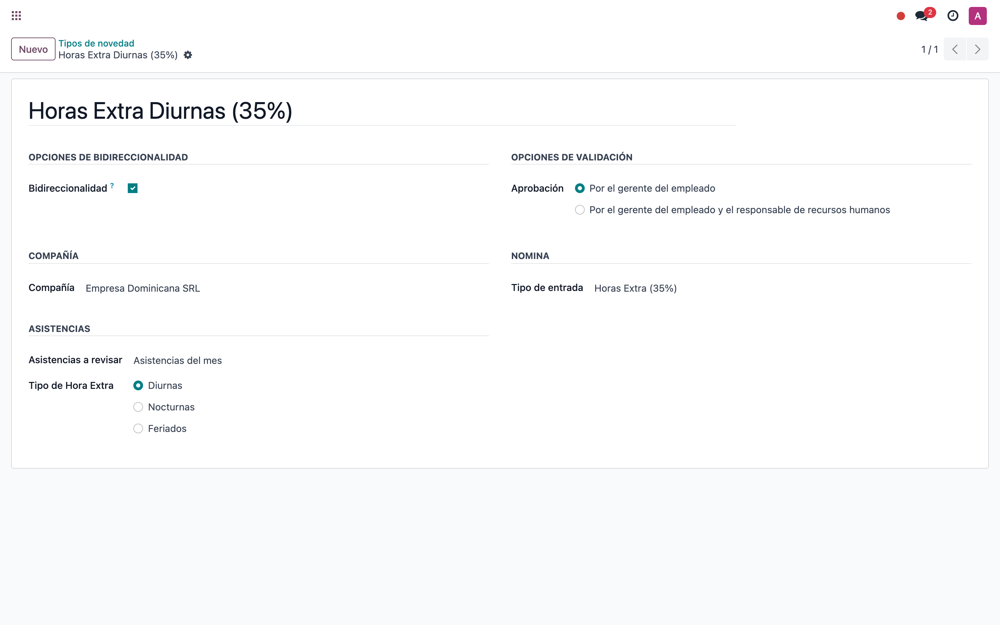
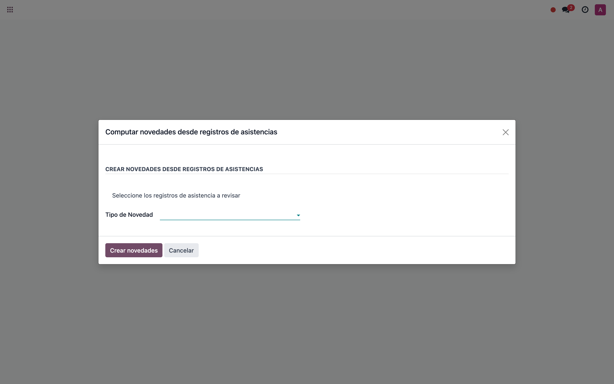
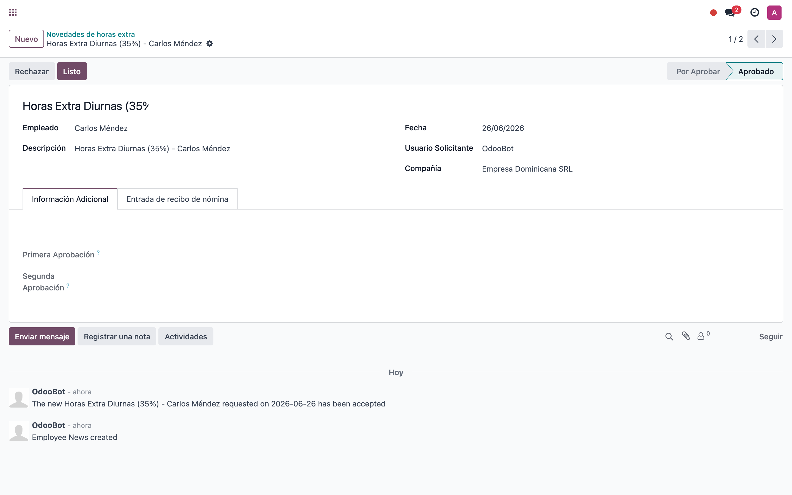
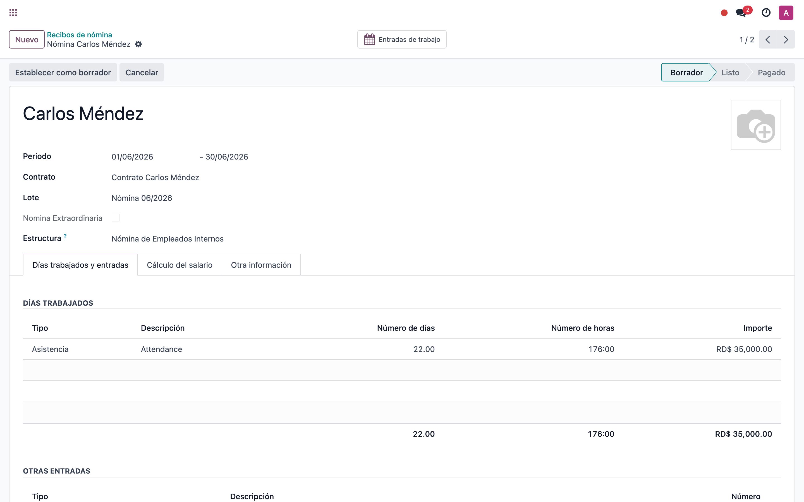

# Horas extra → nómina con módulos custom (Odoo 17)

> 📘 Manual **funcional** del flujo **antiguo** de horas extra en Odoo 17, con los
> módulos custom **`l10n_do_hr_news_attendance`** y
> **`l10n_do_hr_payroll_news_attendance`** instalados.
> ⚠️ Este flujo **se descarta en v19** y se reemplaza por el motor nativo
> (ver el manual `hr_payroll_attendance`). Capturas en una base de ejemplo en español.

---

## 1. Módulos custom que intervienen

| Módulo | Rol |
|---|---|
| **`l10n_do_hr_news`** | Base de **Novedades** (eventos de RRHH con flujo de aprobación). |
| **`l10n_do_hr_payroll_news`** | Convierte la novedad aprobada en **input del recibo** (tipo de entrada salarial). |
| **`l10n_do_hr_news_attendance`** | **Asistente** que calcula las horas extra desde la asistencia y crea la novedad. |
| **`l10n_do_hr_payroll_news_attendance`** | Pone las **horas extra como monto** de esa novedad. |

> Idea: la hora extra se vuelve una **Novedad** que, una vez **aprobada**, entra al
> recibo como un **input** (entrada salarial).

```
Asistencia (hr_attendance)
        │  Asistente "Crear novedades desde asistencia" (calcula el exceso)
        ▼
Novedad (l10n.do.hr.news)  →  aprobar (Borrador → Por aprobar → Aprobada)
        ▼
Input del recibo (l10n_do_hr_payroll_news)  →  recibo de nómina
```

---

## 2. Paso a paso

### 2.1 Configurar el tipo de novedad

**Empleados → Configuración → Novedades → Tipos de novedad**. El tipo de novedad
de horas extra define de dónde salen las horas y a qué input van.



| Campo | Para qué sirve |
|---|---|
| **Asistencias a tomar** | Período de asistencias a considerar: día / semana / **mes** / fechas específicas. |
| **Tipo de hora extra** | **Diurna** / Nocturna / Feriados (regla de cálculo del exceso). |
| **Tipo de entrada (input)** | Input salarial al que se manda el monto (ej. *Horas Extra 35 %*). |
| **Validación** | Quién aprueba la novedad (gerente / gerente + RRHH). |

### 2.2 Ejecutar el asistente desde la asistencia

Desde **Empleados** (lista) → seleccionar empleados → menú **Acción → Crear
novedades desde asistencia** → elegir el **tipo de novedad** → **Crear novedades**.
El asistente recorre las asistencias del período y calcula el exceso de horas.



### 2.3 Revisar y aprobar la novedad

**Empleados → Nómina → Novedades**. El asistente crea una **novedad** por empleado
con las **horas extra** como monto. Se aprueba con el flujo
**Borrador → Por aprobar → Aprobada**.



> Solo las novedades **Aprobadas** del período entran al recibo.

### 2.4 El recibo toma el monto como input

**Nómina → Recibos** → abrir el recibo del período → **Calcular**. El monto de la
novedad aprobada aparece como **entrada salarial** (input) del recibo, donde la
regla salarial lo paga al porcentaje correspondiente.



---

## 3. Comparación con el flujo nativo de v19

| Paso antiguo (custom, v17) | Equivalente nativo (v19) |
|---|---|
| Tipo de novedad con *origen asistencia* + *tipo de hora extra* | **Regla de horas extra** (Overtime Ruleset) |
| Asistente manual *Crear novedades desde asistencia* | Cálculo **automático** al registrar la asistencia |
| Novedad aprobada (flujo de estados) | Hora extra **aprobada** en la propia asistencia |
| Input del recibo vía `l10n_do_hr_payroll_news` | **Entrada de trabajo de horas extra** → recibo (`hr_payroll_attendance`) |

→ En v19 desaparecen el asistente y la novedad: la hora extra se calcula sola y
llega al recibo de forma nativa. Ver el manual del flujo nativo.

---

> 🛠️ Capturas regenerables con `tools/manual-generator`
> (`./generate-manual.sh --module=l10n_do_hr_payroll_news_attendance
> --extra-modules=hr_attendance`), sobre una base `test_v17_*` con datos de
> ejemplo en español.
