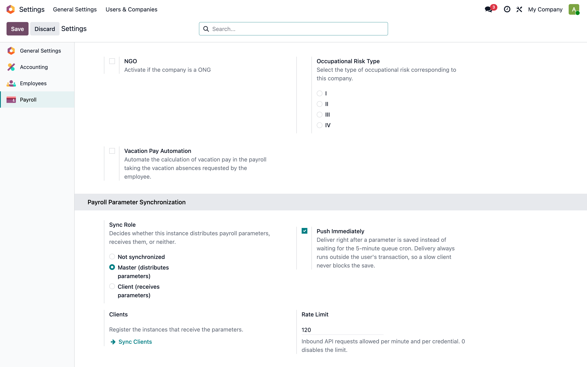
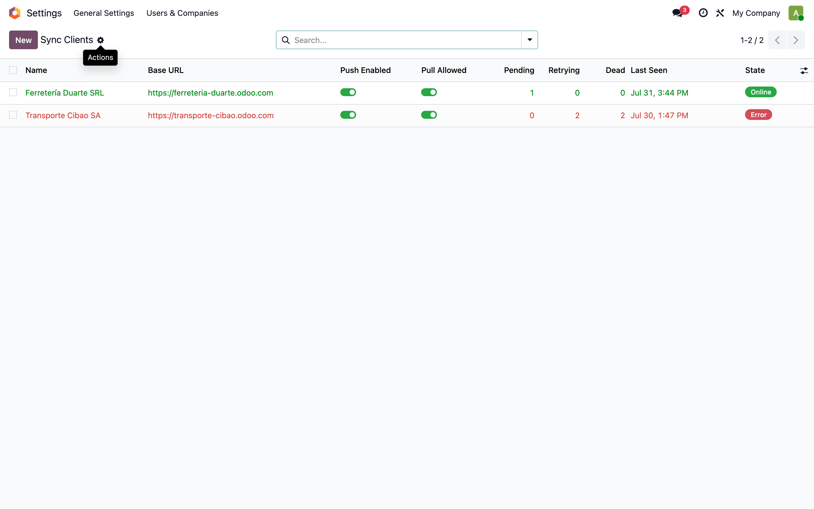
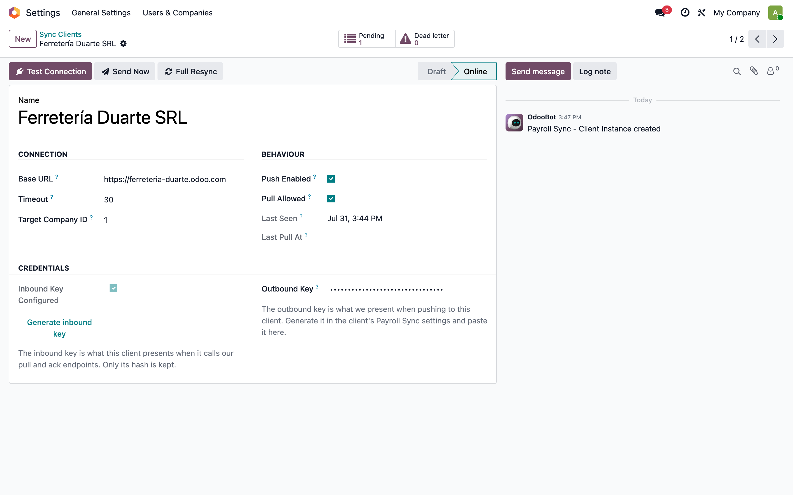
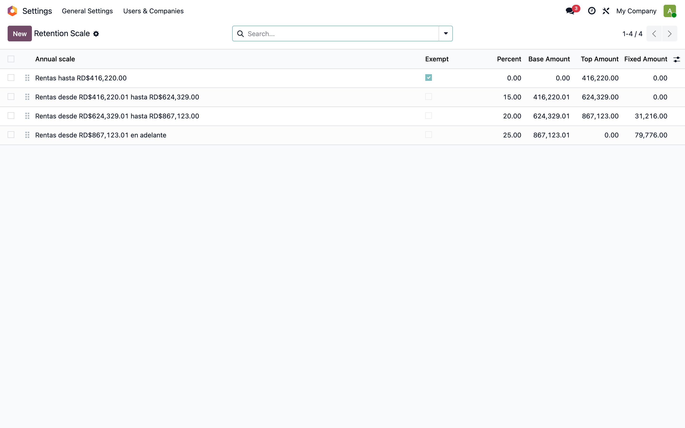
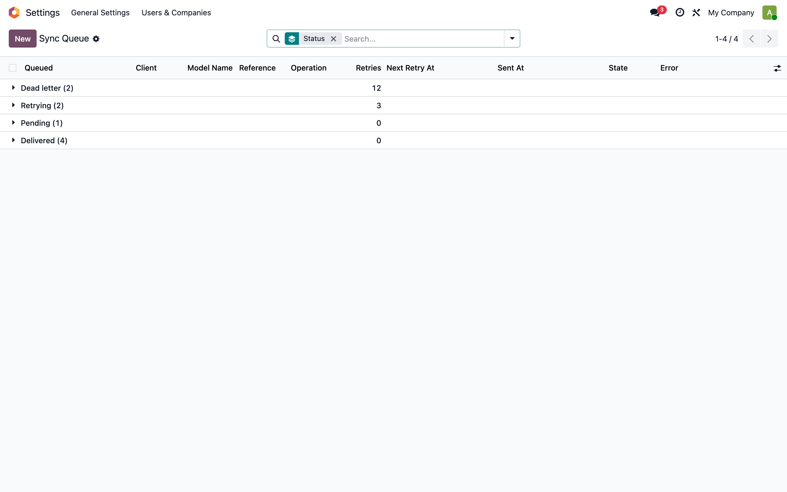
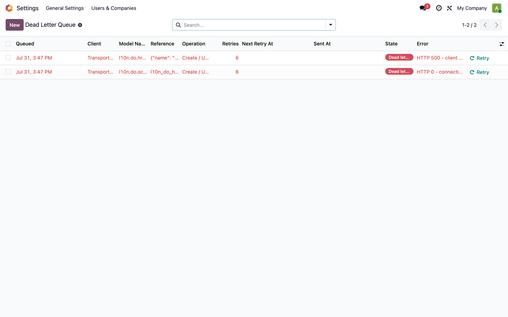
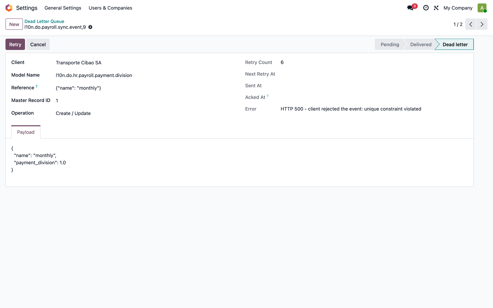
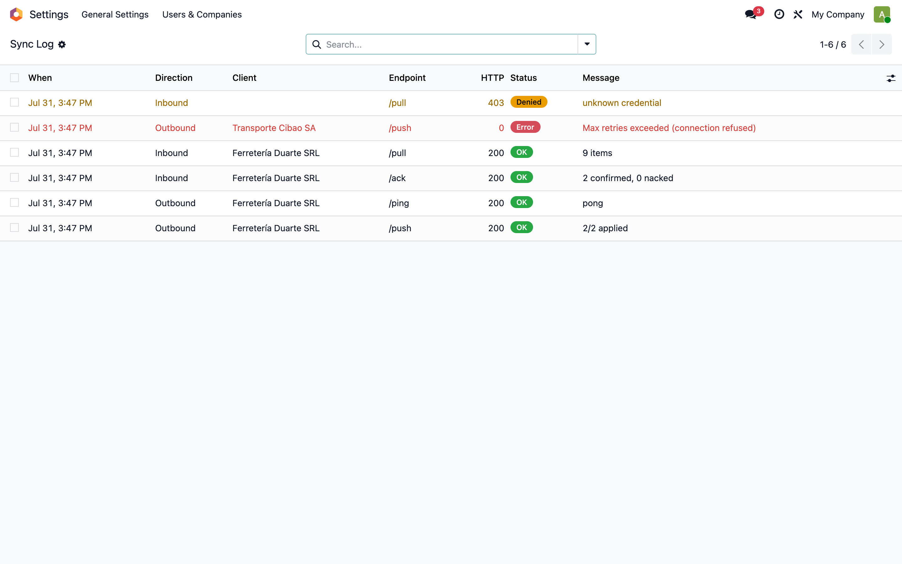
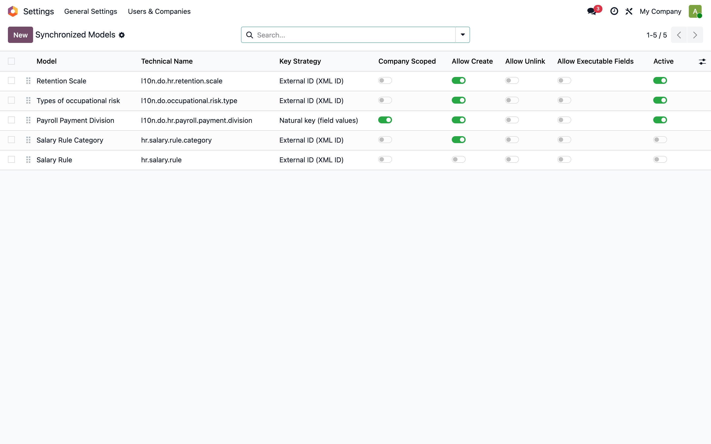

# Sincronización centralizada de parámetros de nómina — Manual

> Manual generado con `tools/manual-generator`. Las capturas se regeneran ejecutando el generador contra una base `test_v19_<módulo>`.

Módulo `l10n_do_hr_payroll_sync` (19.0.1.0.0). Distribuye los parámetros maestros de nómina RD desde una instancia **maestra** (PROGRESSA) hacia N instancias **cliente**, mediante una API REST versionada implementada como módulo Odoo 19.

El mismo módulo se instala en ambos extremos; el ajuste **Rol de sincronización** decide cómo se comporta cada instancia. Sin rol configurado el módulo queda completamente inerte.

> Este manual tiene dos partes: **A) Guía de usuario final** (cómo operarlo desde la interfaz) y **B) Documentación técnica** (arquitectura, endpoints, seguridad, decisiones de diseño). Las capturas provienen de una base generada automáticamente con `tools/manual-generator`.

## Requisitos previos

- Odoo 19 con `l10n_do_hr_payroll` 19.0.1.0.9 o superior instalado en ambos extremos
- El módulo `l10n_do_hr_payroll_sync` instalado tanto en el maestro como en cada cliente
- Conectividad HTTPS del maestro hacia cada cliente (modo push) o del cliente hacia el maestro (modo pull)
- Un usuario con el grupo *Payroll Sync Administrator* (implícito para Administrador de ajustes)

## Parte A — Guía de usuario final

Esta sección describe la operación diaria: cómo activar el rol, registrar clientes, publicar un cambio de parámetro y diagnosticar una entrega fallida.

## A1. Elegir el rol de la instancia

**Nómina → Configuración → Ajustes → Payroll Parameter Synchronization.**

El selector **Sync Role** define el comportamiento del módulo:

| Rol | Qué hace | Endpoints que expone |
|---|---|---|
| *Not synchronized* | Nada. El módulo queda inerte: no encola eventos y no atiende llamadas. | ninguno |
| *Master* | Detecta cambios en los parámetros y los distribuye a los clientes registrados. | `/pull`, `/ack` |
| *Client* | Recibe y aplica los parámetros que envía el maestro. | `/push` |

Seleccionar el rol es el **único paso obligatorio**: mientras esté en *Not synchronized*, instalar el módulo no cambia absolutamente nada del comportamiento de la nómina.

**Push Immediately** (solo maestro) entrega el cambio justo después de guardarlo, en lugar de esperar al cron de 5 minutos. La entrega HTTP siempre corre **fuera** de la transacción del usuario, así que un cliente lento nunca bloquea el guardado.

**Rate Limit** limita los requests entrantes por minuto y por credencial; `0` desactiva el límite.



## A2. Clientes registrados

**Nómina → Configuración → Dominican legislation → Parameter Synchronization → Sync Clients.**

Cada línea es una base Odoo que recibe los parámetros. La lista es el tablero de salud de la distribución:

- **Pending / Retrying / Dead**: cuántos eventos esperan, cuántos reintentan y cuántos agotaron sus reintentos. Una columna *Dead* distinta de cero es lo único que exige intervención humana.
- **Last Seen**: último intercambio exitoso con ese cliente.
- **Status**: verde *Online*, rojo *Error*.

En el ejemplo, *Ferretería Duarte SRL* está al día y *Transporte Cibao SA* lleva 26 horas sin responder: sus eventos siguen en cola, ninguno se perdió.



## A3. Ficha de un cliente y sus credenciales

Cada emparejamiento maestro↔cliente usa **dos secretos distintos**, y esa separación es deliberada:

| Campo | Dirección | Cómo se guarda |
|---|---|---|
| **Inbound Key** | El cliente nos llama a `/pull` y `/ack` | Solo el hash (`pbkdf2_sha512`). No se puede recuperar: al generarla se muestra una sola vez. |
| **Outbound Key** | Nosotros llamamos al `/push` del cliente | Recuperable, porque hay que enviarla en cada request. Restringida a usuarios de Ajustes. |

**Puesta en marcha de un cliente nuevo:**

1. En el **cliente**: Ajustes → *Generate inbound key*. Copiar la clave.
2. En el **maestro**: crear el registro del cliente, pegar esa clave en **Outbound Key**.
3. En el **maestro**: *Generate inbound key* en la ficha del cliente. Copiar.
4. En el **cliente**: pegar esa clave en **Key for the Master** y llenar **Master URL**.
5. **Test Connection** desde el maestro. Debe quedar en verde *Online*.
6. **Full Resync** para la carga inicial: encola todos los parámetros de todos los modelos activos.

**Target Company ID** indica en qué compañía del cliente aterrizan los parámetros con alcance por compañía. En `0`, el cliente usa su compañía por defecto.



## A4. El parámetro que se distribuye

**Nómina → Configuración → Dominican legislation → Retention Scale.**

Este es el caso de uso que justifica todo el módulo: cuando la DGII publica la escala ISR de un año nuevo, se edita **una sola vez aquí**, en el maestro, y el cambio viaja solo a todas las bases cliente.

Guardar cualquiera de estas líneas encola un evento por cada cliente con *Push Enabled*. No hay que hacer nada más.

Los otros parámetros que viajan por defecto:

| Modelo | Alcance | Cómo se emparejan las bases |
|---|---|---|
| `l10n.do.hr.retention.scale` | Global | External ID (`l10n_do_hr_payroll.l10n_do_hr_retention_scale_N`) |
| `l10n.do.occupational.risk.type` | Global | External ID (`l10n_do_hr_payroll.risk_type_N`) |
| `l10n.do.hr.payroll.payment.division` | Por compañía | Clave natural (`name`) dentro de la compañía destino |

`hr.salary.rule` y `hr.salary.rule.category` vienen **registrados pero archivados**: ver A7.



## A5. La cola de sincronización

**Parameter Synchronization → Sync Queue**, agrupada por estado.

Esta tabla es la cola de mensajes del sistema: vive en Postgres, no en un broker externo. El evento se escribe **en la misma transacción** que el cambio del parámetro, así que una edición que se revierte nunca deja un evento huérfano.

| Estado | Significado |
|---|---|
| **Pending** | Encolado, esperando entrega |
| **Delivered** | El cliente confirmó que lo aplicó |
| **Retrying** | Falló; hay un reintento programado con espera creciente |
| **Dead letter** | Agotó los 5 reintentos. Requiere intervención |
| **Cancelled** | Otra edición más nueva del mismo registro lo dejó obsoleto |

**Retries** y **Next Retry At** muestran el backoff exponencial: 60s, 120s, 240s, 480s, 960s. Una ráfaga de ediciones sobre el mismo registro se colapsa en una sola entrega — los eventos viejos pasan a *Cancelled*.



## A6. Cola de mensajes muertos (dead letter)

**Parameter Synchronization → Dead Letter Queue.**

Lo único que exige atención humana. Un evento llega aquí tras agotar sus 5 reintentos; la columna **Error** dice por qué.

Dos causas típicas y su tratamiento:

| Error | Qué pasó | Qué hacer |
|---|---|---|
| `HTTP 0 - connection refused` | El cliente estuvo caído más tiempo que la ventana de reintentos | Verificar que el cliente responde (*Test Connection*), luego **Retry** |
| `HTTP 500 - unique constraint violated` | El cliente rechazó el dato: choca con un registro suyo | Corregir el conflicto en el cliente y luego **Retry** |

El botón **Retry** devuelve el evento a *Pending* y reinicia su presupuesto de reintentos. También se puede seleccionar varios y reintentarlos en lote.

Los eventos muertos **no se purgan**: el cron de limpieza diaria borra los entregados y cancelados con más de 90 días, pero conserva los muertos como evidencia.



## A7. Detalle de un evento y su payload

Abrir un evento muestra exactamente qué se envió.

- **Reference**: la clave con la que el cliente localiza su propio registro. Para los modelos globales es el External ID que ambas bases comparten porque vino del mismo archivo de datos del módulo — por eso el emparejamiento entre bases es exacto y no depende de IDs numéricos, que no significan nada fuera de su base.
- **Payload**: el JSON literal enviado. Contiene solo los campos de la lista blanca del modelo; `company_id`, los campos de auditoría y los campos con código Python nunca aparecen.
- **Acked At**: momento en que el cliente confirmó explícitamente.



## A8. Bitácora de sincronización

**Parameter Synchronization → Sync Log.**

Registro bidireccional de **todo** intercambio HTTP, incluidos los rechazados. Es la pista de auditoría del sistema.

| Direction | Qué es |
|---|---|
| **Outbound** | Llamadas que hicimos nosotros (push a un cliente, pull al maestro) |
| **Inbound** | Llamadas que recibimos (un cliente hizo pull, envió un ack, o presentó una credencial inválida) |

La fila en naranja con estado **Denied** y HTTP 403 es un intento de acceso con una credencial desconocida: se registra la IP de origen. Un patrón de *Denied* desde una misma IP es la señal de que alguien está probando claves.



## A9. Los secretos nunca llegan a la bitácora

Al abrir la entrada *Denied* se ve el cuerpo del request que se intentó — con las credenciales **reemplazadas por `***` antes de guardarse**.

La redacción es recursiva y cubre las claves `api_key`, `x-api-key`, `password`, `remote_api_key` y `token` a cualquier nivel de anidación del JSON. Esto está verificado por prueba automatizada (`test_secrets_are_stripped_before_the_payload_is_stored`) y también por el escenario E2E, que consulta Postgres directamente para confirmar que la clave real no aparece en ninguna fila de la bitácora.

> _(captura pendiente: ejecutar el generador)_

## A10. Qué modelos se sincronizan

**Parameter Synchronization → Synchronized Models.**

El alcance de la sincronización es **configuración, no código**: agregar un parámetro nuevo a la distribución es activar una línea aquí, no programar.

| Columna | Qué controla |
|---|---|
| **Key Strategy** | Cómo el cliente encuentra su registro equivalente: por External ID o por clave natural |
| **Company Scoped** | El registro lleva `company_id` y se resuelve dentro de la compañía destino del cliente |
| **Allow Create** | El cliente puede crear el registro si no lo tiene |
| **Allow Unlink** | Propagar borrados. **Apagado por defecto**: un borrado en el maestro eliminando parámetros de nómina en todas las bases rara vez es lo deseado |
| **Allow Executable Fields** | Ver el aviso abajo |

> ⚠️ **`hr.salary.rule` viene archivado a propósito.** Sus reglas contienen `amount_python_compute`: distribuirlas significa **ejecutar código del maestro dentro de la base de cada cliente**. El interruptor *Allow Executable Fields* existe, pero activarlo es una decisión de seguridad consciente que exige que cada cambio en el maestro sea revisado. Con el interruptor apagado esos campos se filtran del payload aunque el modelo esté activo.



## A11. Configurar un modelo sincronizado

En la ficha de cada modelo se define la lista blanca de campos y la política del cliente.

**Synchronized Fields** vacío significa *todos los campos almacenados y no relacionales*. Independientemente de lo que se ponga aquí, nunca viajan:

- `id`, `create_uid`, `create_date`, `write_uid`, `write_date`, `display_name` — carecen de sentido fuera de su base;
- `company_id` — lo resuelve el cliente contra su propia compañía destino, jamás se acepta el del maestro;
- `amount_python_compute`, `condition_python`, `code` — salvo que se active explícitamente *Allow Executable Fields*.

La lista blanca se aplica **en los dos extremos**: el cliente descarta cualquier campo que su propio registro no acepte, aunque el maestro lo haya enviado. Quien decide qué se guarda es el cliente, no el maestro.

> _(captura pendiente: ejecutar el generador)_

## Parte B — Documentación técnica

Arquitectura, contrato de la API, modelo de seguridad y decisiones de diseño con su justificación.

## Notas

## B1. Arquitectura

```
┌──────────────────────── MAESTRO (PROGRESSA, Odoo 19) ─────────────────────────┐
│                                                                               │
│  l10n_do_hr_payroll          l10n_do_hr_payroll_sync                          │
│  ┌────────────────────┐      ┌──────────────────────────────────────────┐     │
│  │ retention.scale    │──┐   │ trigger mixin  create/write/unlink       │     │
│  │ occupational.risk  │──┼──▶│      ↓ (misma transacción)               │     │
│  │ payment.division   │──┘   │ sync.event   COLA DURABLE (Postgres)     │     │
│  └────────────────────┘      │      ↓ post-commit  |  ir.cron 5 min     │     │
│                              │ sync.client  ──HTTP POST /push──────────┐│     │
│                              │ sync.log     auditoría bidireccional    ││     │
│                              └─────────────────────────────────────────┼┘     │
│  Controllers: /pull  /ack  /ping  /manifest  ◀──────────────────────┐  │      │
└─────────────────────────────────────────────────────────────────────┼──┼──────┘
                                                                      │  │
                     ┌────────────────────────────────────────────────┴──▼──────┐
                     │ CLIENTE (Odoo 19, mismo módulo, rol=client)              │
                     │ Controllers: /push  /ping  /manifest                     │
                     │ sync.service  → resuelve ref → ORM create/write          │
                     │ ir.cron 1 h   → /pull de reconciliación                  │
                     └──────────────────────────────────────────────────────────┘
```

Un solo módulo en ambos extremos. El rol decide el comportamiento y qué endpoints existen. Esto evita el *version skew* entre maestro y cliente: el serializador y el aplicador son literalmente el mismo código.

## B2. Contrato de la API

Prefijo `/api/v1/payroll-sync`. Todas las rutas son `type='http'`, `auth='none'`, `csrf=False`, `readonly=False`, cuerpo y respuesta JSON crudo.

| Método | Ruta | Rol | Función |
|---|---|---|---|
| `GET`/`POST` | `/ping` | ambos | Salud + validación de credencial |
| `GET`/`POST` | `/manifest` | ambos | Versión de API y contrato de campos por modelo |
| `POST` | `/push` | cliente | Recibe lote, aplica, devuelve veredicto por ítem |
| `POST` | `/pull` | maestro | Devuelve cambios desde `since` + `checkpoint` |
| `POST` | `/ack` | maestro | Confirmación explícita que cierra eventos |

Pedir un endpoint del rol contrario devuelve **404**, no 403: una instancia no revela qué rol *no* tiene.

**Cuerpo de `/push`:**

```json
{
  "version": "1.0",
  "target_company_id": 1,
  "items": [{
    "event_id": 42,
    "model": "l10n.do.hr.retention.scale",
    "ref": "l10n_do_hr_payroll.l10n_do_hr_retention_scale_2",
    "operation": "upsert",
    "values": {"percent": 15.0, "base_amount": 416220.01}
  }]
}
```

**Respuesta** — un veredicto por ítem, que es lo que permite el reintento selectivo:

```json
{"status":"ok","applied":1,"rejected":0,
 "results":[{"event_id":42,"status":"ok","message":"updated: percent"}],
 "version":"1.0"}
```

Un ítem que el cliente no reporta **no** se da por entregado: se reintenta. El silencio no es éxito.

**Códigos:** `200` procesado · `400` cuerpo inválido · `401` falta `X-API-Key` · `403` credencial inválida o cliente archivado · `404` endpoint no habilitado para el rol · `429` límite de tasa · `500` error interno (mensaje genérico, detalle solo en la bitácora).

## B3. Seguridad

| Control | Implementación |
|---|---|
| Autenticación | Header `X-API-Key`, verificado con `KEY_CRYPT_CONTEXT` (`pbkdf2_sha512`), el mismo contexto que Odoo usa para sus propias API keys |
| Comparación | `passlib.verify`, tiempo constante. La búsqueda del cliente recorre todos los activos para no filtrar por tiempo de respuesta qué prefijo existe |
| Almacenamiento | Clave entrante: solo hash, irrecuperable. Clave saliente: recuperable por necesidad, con `groups="base.group_system"` |
| Límite de tasa | Ventana deslizante por credencial, clave indexada por SHA-256 para no tener el secreto en memoria |
| Tamaño de cuerpo | Rechazo por encima de 8 MiB antes de parsear |
| Superficie de escritura | Lista blanca de modelos **y** de campos, aplicada en el cliente. Un `res.users` enviado por el maestro se rechaza |
| Ejecución remota | Campos con código Python bloqueados salvo opt-in explícito y señalizado en la UI |
| Auditoría | Toda llamada, aceptada o rechazada, en `sync.log` con IP de origen |
| Redacción | Secretos sustituidos por `***` recursivamente antes de persistir el payload |
| Aislamiento por compañía | `company_id` nunca viaja; lo fija el cliente contra su compañía destino |

El aplicador corre como `SUPERUSER_ID`. Es necesario: `l10n.do.hr.retention.scale.write()` exige `base.group_system` para tocar `name` y `sequence`. La contrapartida es que la superficie de escritura queda acotada por la lista blanca del registro, no por ACLs — de ahí que la lista blanca sea el control de seguridad central y se aplique del lado del cliente.

## B4. Garantías de entrega

El diseño original proponía RabbitMQ o `queue_job` de la OCA. **`queue_job` no está vendorizado en este repositorio** (verificado en `odoo-pro/`, `odoo/`, `enterprise/`, `OCA/`, `store-addons/`), así que introducirlo significaba una dependencia y una infraestructura nuevas.

En su lugar, la cola es una tabla Postgres más `ir.cron`, lo que da las mismas garantías:

| Garantía | Cómo |
|---|---|
| Durabilidad | El evento se inserta en la transacción del cambio. Un rollback se lleva el evento |
| At-least-once | El evento solo pasa a `sent` con confirmación explícita del cliente |
| Backoff exponencial | `60s · 2^n`, tope 3600s, 5 reintentos |
| Dead letter | Estado `dead` tras agotar reintentos, con botón *Retry* y sin purga automática |
| Reconciliación | Cron horario de `pull` en el cliente: se recupera solo tras estar caído |
| Colapso de ráfagas | Un evento pendiente para el mismo destino se cancela al llegar uno más nuevo |
| Idempotencia | El emparejamiento por External ID / clave natural hace que reaplicar sea un no-op |
| No bloqueo | La entrega corre en `postcommit`, fuera de la transacción del usuario |

### Ventana de solapamiento del checkpoint

El `checkpoint` que devuelve `/pull` está deliberadamente **atrasado 300 segundos** respecto al reloj de la base. Motivo: `write_date` lleva el instante de **inicio** de la transacción, no el del commit. Una transacción abierta antes del pull y confirmada después quedaría con un `write_date` anterior al checkpoint y sería invisible para todos los pulls siguientes — una pérdida silenciosa de datos. Reenviar unos registros de más es gratis, porque aplicar es idempotente; perder uno no lo es.

Esto se detectó escribiendo la prueba `test_checkpoint_lags_the_clock_so_late_commits_are_not_lost`.

## B5. Emparejamiento entre bases

El problema difícil de sincronizar no es el transporte, es la identidad: un `id` numérico no significa nada en otra base.

| Estrategia | Cuándo | Cómo |
|---|---|---|
| **External ID** | El registro viene de un archivo de datos del módulo, así que ambas bases comparten el mismo XML ID | `env.ref('l10n_do_hr_payroll.l10n_do_hr_retention_scale_2')` |
| **Clave natural** | El registro es por compañía y el XML ID solo apunta a una | Búsqueda por los campos clave dentro de la compañía destino |

Los Many2one viajan como referencia, no como FK:

```json
"category_id": {"__model__": "hr.salary.rule.category",
                "__ref__": "hr_payroll.BASIC",
                "__label__": "Basic"}
```

Si la referencia no resuelve en el cliente, **ese ítem falla** y los demás del lote se aplican igual: cada ítem corre en su propio savepoint.

Un registro sin External ID resoluble se omite con un warning en el log del servidor, en lugar de enviarse y crear un duplicado en el cliente.

## B6. Cambio en `l10n_do_hr_payroll`

Se modificó un archivo del módulo de nómina, y el motivo importa:

`data/l10n_do_hr_payroll_payment_division.xml` no tenía `noupdate="1"`. Sin esa marca, **cada upgrade del módulo restablecía las divisiones de pago a los valores semilla**, pisando tanto lo que una compañía hubiera ajustado a mano como lo que este módulo hubiera sincronizado.

- Se añadió `<data noupdate="1">`, que solo afecta a instalaciones nuevas.
- Migración `migrations/19.0.1.0.9/post-migrate.py` que voltea el flag en las filas `ir_model_data` ya existentes.
- Versión: `19.0.1.0.8` → `19.0.1.0.9`.

Verificado por `tools/sync-e2e/regression.sh` §2: se recrea el estado previo, se ajusta un valor a mano, se corre el upgrade y se comprueba que el valor **sobrevive**.

## B7. Validación ejecutada

| Suite | Alcance | Resultado |
|---|---|---|
| `--test-tags=/l10n_do_hr_payroll_sync` | 61 tests: registro, serializador, aplicación, cola/backoff/dead-letter, controladores HTTP (401/403/404/429/400) | **61 pasan, 0 fallan, 0 omitidos** |
| `tools/sync-e2e/run-tests.sh` | 35 aserciones E2E entre **dos instancias Odoo reales** sobre HTTP real, verificando contra Postgres del cliente | **35 pasan, 0 fallan** |
| `tools/sync-e2e/regression.sh` | 23 aserciones: migración, ISR idéntico antes/después, los 5 dependientes instalan, corrida de nómina completa, upgrade idempotente | **23 pasan, 0 fallan** |

Los escenarios E2E cubren, sobre HTTP real: entrega push, parámetro con alcance por compañía, **cliente apagado a mitad de la prueba** con backoff y dead letter, recuperación con *Retry*, modo pull aislado, y las propiedades de seguridad (modelo no registrado rechazado, `res.users` intacto, clave ausente de la bitácora, reenvío idempotente).

La no-regresión compara la huella ISR (`0.00, 0.00, 12567.00, 46350.20, 87995.25, 237995.25` para seis salarios anuales) antes de instalar el módulo, después de instalarlo y con los cinco dependientes instalados: **idéntica en los tres casos**. La corrida de nómina de cuatro empleados sigue dando los mismos importes que espera el escenario de referencia.

## B8. Dos hallazgos de Odoo 19 que valen documentar

1. **`auth='none'` implica `readonly=True`.** Desde 19.0, `odoo/http.py:974` hace `default_mode = routing.get('readonly', default_auth == 'none')`. Una ruta `auth='none'` recibe un cursor de solo lectura y cualquier `INSERT` revienta con `cannot execute INSERT in a read-only transaction`. Todas las rutas del módulo llevan `readonly=False` explícito. Lo detectó la suite de controladores.
2. **`res.groups.category_id` ya no existe** y `<group expand="0">` dentro de `<search>` dejó de validar contra el RNG: los filtros de agrupación van sueltos en el `<search>` con `context="{'group_by': ...}"`.

## B9. Desviaciones respecto al documento de diseño

| Documento | Implementado | Por qué |
|---|---|---|
| Odoo 17 | Odoo 19 | La rama es 19.0; `type='json'` está deprecado a favor de `type='jsonrpc'`, y para REST crudo corresponde `type='http'` |
| Dos módulos (maestro + cliente) | Uno con rol | Serializador y aplicador compartidos: imposible que las puntas discrepen en el formato de cable |
| Message queue (`queue_job`/RabbitMQ) | Cola Postgres + `ir.cron` | `queue_job` no está en el repositorio; la tabla da durabilidad, backoff y dead-letter sin infraestructura nueva |
| Sincronizar `l10n.do.hr.payroll.days.division` | Excluido | Modelo **eliminado** en 19.0 (`upgrades/19.0.1.0.2/post-migrate.py:6,76-78`) |
| Sincronizar `hr.salary.rule.l10n_do_is_news` / `l10n_do_type_news` | Excluido | Campos inexistentes en 19.0; solo sobreviven en SQL de migración 14.0/15.0 |
| Sincronizar `res.company.l10n_do_ngo`, `l10n_do_occupational_risk_type_id` | Excluido | Es configuración de cada cliente, no dato maestro; sincronizarla pisaría decisiones locales |
| `hr.salary.rule` en el alcance base | Registrado pero archivado | Distribuir `amount_python_compute` es ejecución remota de código en la base del cliente |

## B10. Operación

**Crones** (`ir.cron`, todos cortocircuitan si el rol no corresponde):

| Cron | Frecuencia | Rol | Qué hace |
|---|---|---|---|
| *deliver queued events* | 5 min | maestro | Drena la cola. Es la ruta de reintento; la ruta feliz es el flush post-commit |
| *reconcile with master* | 1 h | cliente | `pull` de lo perdido mientras estuvo inalcanzable |
| *purge old events and logs* | 1 día | ambos | Borra entregados/cancelados y bitácora con más de 90 días. **No toca los dead letter** |

**Diagnóstico rápido:**

| Síntoma | Dónde mirar |
|---|---|
| Un cliente no recibe nada | Ficha del cliente → *Test Connection*; revisar *Push Enabled* |
| Eventos acumulados en *Pending* | ¿Está corriendo el cron? ¿`max_cron_threads > 0` en la conf? |
| Eventos en *Retrying* | Columna *Error* del evento; suele ser red o TLS |
| Eventos en *Dead letter* | *Error* dice la causa. Corregir en el cliente y **Retry** |
| `403` en la bitácora del cliente | La *Outbound Key* del maestro no coincide con la *inbound* del cliente. Regenerar y volver a emparejar |
| Un parámetro no viaja | *Synchronized Models*: ¿la línea está activa? ¿el campo está en la lista blanca? |

**Entorno de pruebas reproducible** — levanta dos instancias reales y las empareja solo:

```bash
tools/sync-e2e/setup.sh       # dos BD + dos servidores + credenciales
tools/sync-e2e/run-tests.sh   # 35 escenarios E2E sobre HTTP real
tools/sync-e2e/regression.sh  # 23 aserciones de no-regresión
tools/sync-e2e/teardown.sh --drop-db
```

## B11. Archivos

```
odoo-pro/l10n_do_hr_payroll_sync/
├── models/
│   ├── sync_model.py       registro: qué modelos/campos viajan y cómo se emparejan
│   ├── sync_client.py      instancias destino, credenciales, HTTP saliente
│   ├── sync_event.py       cola durable: estados, backoff, dead letter
│   ├── sync_log.py         auditoría bidireccional con redacción de secretos
│   ├── sync_service.py     serialización, resolución de referencias, aplicación, pull
│   ├── sync_trigger.py     mixin create/write/unlink sobre los modelos maestros
│   └── res_config_settings.py   rol y credenciales
├── controllers/main.py     REST: auth, rate limit, auditoría, ping/manifest/push/pull/ack
├── tests/                  61 tests
├── security/  views/  data/

odoo-pro/l10n_do_hr_payroll/
├── data/l10n_do_hr_payroll_payment_division.xml   + noupdate="1"
├── migrations/19.0.1.0.9/post-migrate.py          voltea el flag en bases existentes
└── __manifest__.py                                19.0.1.0.8 → 19.0.1.0.9

tools/sync-e2e/             entorno de pruebas maestro↔cliente
```

