# Sincronización centralizada de parámetros de nómina — Manual

> Manual generado con `tools/sync-manual`. Las capturas se rehacen levantando las tres instancias con `setup.sh` y ejecutando `generate.sh`.

Este manual documenta **`l10n_do_hr_payroll_sync`** sobre tres bases Odoo 19 vivas hablando entre ellas por RPC:

| Instancia | Papel | Compañía | Qué tiene instalado | URL |
|---|---|---|---|---|
| **padre** | Maestra: distribuye | PROGRESSA (Casa Matriz) | `l10n_do_hr_payroll_sync` | `http://localhost:8101` |
| **hija1** | Cliente: recibe | Distribuidora Acme, SRL | solo `l10n_do_hr_payroll` | `http://localhost:8102` |
| **hija2** | Cliente: recibe | Ferretería Bella Vista, SRL | solo `l10n_do_hr_payroll` | `http://localhost:8103` |

**El problema.** Cuando la TSS sube un tope o la DGII publica una escala ISR nueva, hoy hay que entrar a cada base de cliente y editarlo a mano. Con veinte clientes son veinte oportunidades de equivocarse, y nadie sabe cuáles quedaron al día.

**La solución.** Se edita una vez en el padre. Esa madrugada, un proceso central lee cada hija, compara y escribe solo lo que difiere.

> **Lo que NO hace:** no sincroniza nómina. No viaja ningún dato de empleados, contratos, sueldos ni recibos. Solo parámetros legales. Y **nunca borra nada** en una hija.

## Lo que hay que entender antes de seguir

1. **Las hijas no instalan nada.** El módulo va solo en el padre, que escribe sobre los modelos de nómina que la hija ya tiene. No hay despliegue, ni versión que cuadrar, ni módulo que actualizar en veinte instancias.
2. **No hay contraseñas nuevas.** Se reutilizan la URL, el usuario y la llave de API que el módulo `databases` ya guarda de cada instancia.
3. **Un solo horario para toda la flota**, no uno por cliente: 2:30 de la madrugada, hora de República Dominicana.
4. **El padre manda.** Lo que se edite a mano en una hija se sobrescribe en la siguiente ventana. No es retroactivo: hasta que corra, la hija usa lo que tenga.
5. **Es una comparación, no un diario de cambios.** No hay cola ni eventos pendientes: cada noche se lee el estado de la hija y se corrige la diferencia. Por eso una hija que estuvo caída se pone al día sola, sin reintentar nada.

## Requisitos previos

- El padre con `l10n_do_hr_payroll_sync` instalado, que arrastra `l10n_do_hr_payroll` y el módulo enterprise `databases`.
- Cada hija dada de alta en **Bases de datos** con su URL, base, usuario y llave de API.
- El usuario de esa llave, en la hija, con los grupos de administrador de nómina, configuración de nómina DO y ajustes técnicos.
- La compañía de la hija con **República Dominicana** como país: los parámetros de reglas salariales están filtrados por el país de las compañías permitidas.
- Conectividad del padre hacia cada hija. Al revés no hace falta: las hijas nunca llaman al padre.
- HTTPS en producción: el módulo no lo exige por código, se garantiza en el proxy inverso.

## Contenido

- Parte A — Puesta en marcha
  - A1. El módulo, instalado en el padre
  - A2. La hija no lo instala
  - A3. Lo que sí hay que preparar en la hija
  - A4. La flota de bases de datos en el padre
  - A5. La ficha de una hija
  - A6. Diagnosticar antes de encender nada
  - A7. Qué se sincroniza: el registro de modelos
  - A8. Una línea del registro por dentro
  - A9. Ajustes de la flota
- Parte B — El día a día
  - B1. El tope actual en el padre
  - B2. El mismo tope en la hija
  - B3. Se edita en el padre y se previsualiza
  - B4. Qué exactamente va a cambiar
  - B5. La corrida de verdad
  - B6. La hija 1, ya con el tope nuevo
  - B7. Y la hija 2, igual
  - B8. La escala del ISR
  - B9. Lo que alguien tocó a mano en la hija se pierde
- Parte C — Cuando algo sale mal
  - C1. Una hija apagada
  - C2. Vuelve, y a la noche siguiente se pone al día
  - C3. Falta un permiso en la hija
  - C4. Filas que solo existen en la hija
  - C5. Un tramo nuevo que la hija deja actualizar pero no crear
  - C6. La corrida deja constancia en su chatter
  - C7. Y la ficha de la hija se entera también
  - C8. Se otorga el permiso y el tramo entra solo
  - C9. El historial completo
- Parte D — Referencia
  - D1. Cuánto cuesta una noche
  - D2. Dónde se va el tiempo
  - D3. Cómo se reconoce el mismo registro en dos bases
  - D4. Seguridad
  - D5. Cuatro cosas que conviene saber
  - D6. Cómo se regenera este manual
- Parte E — Por dentro
  - E1. Las tres capas
  - E2. `api.py` — el conector
  - E3. `engine.py` — comparar y aplicar
  - E4. Para qué sirve el corte

## Parte A — Puesta en marcha

El módulo se instala **solo en el padre**. Las hijas no reciben nada: se les escribe por RPC sobre sus modelos de nómina de siempre.

Configurar una hija son tres cosas: una llave de API en la hija, la ficha de la base de datos en el padre, y un diagnóstico que confirme que el usuario remoto puede escribir.

## A1. El módulo, instalado en el padre

**Instancia:** padre · PROGRESSA (Casa Matriz) — maestra, con el módulo

**Aplicaciones → buscar «Payroll Parameter Sync».**

Arrastra dos dependencias: `l10n_do_hr_payroll` (de dónde salen los parámetros) y `databases` (de dónde salen las credenciales de cada instancia cliente).

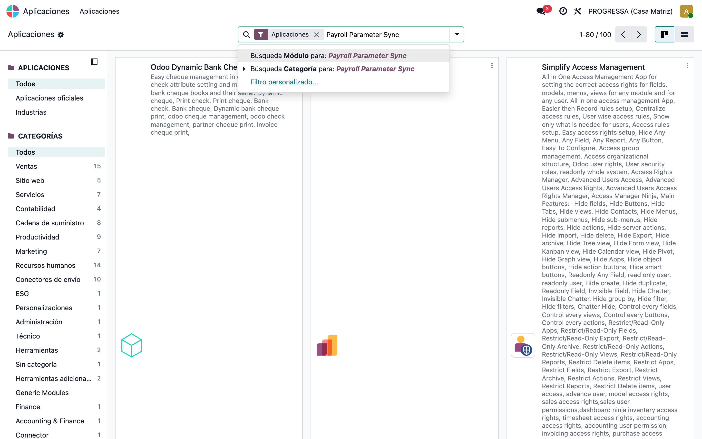

## A2. La hija no lo instala

**Instancia:** hija 1 · Distribuidora Acme, SRL — cliente, sin el módulo

**Misma búsqueda en la hija.** El módulo aparece en el catálogo pero **no está instalado**, y así se queda.

Esto es lo que diferencia este diseño del anterior: no hay que desplegar, actualizar ni versionar nada en las instancias de los clientes. El padre escribe sobre `hr.rule.parameter`, `l10n.do.hr.retention.scale` y `l10n.do.occupational.risk.type`, que la hija ya tiene por `l10n_do_hr_payroll`.

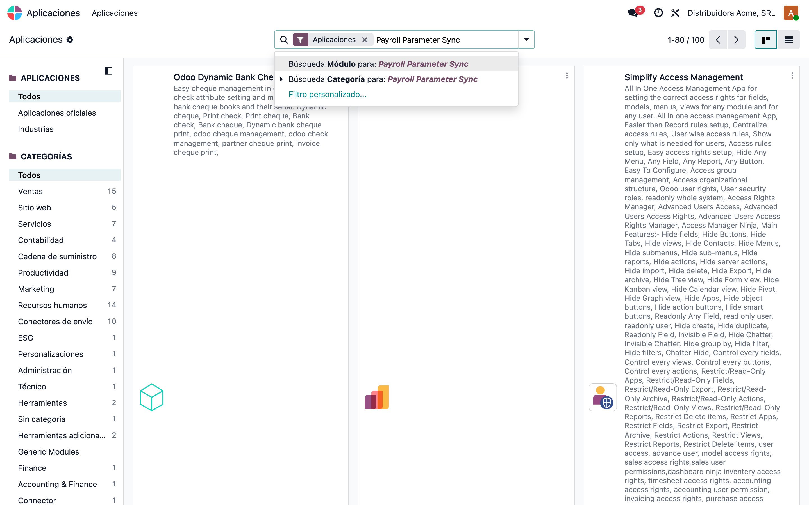

## A3. Lo que sí hay que preparar en la hija

**Instancia:** hija 1 · Distribuidora Acme, SRL — cliente, sin el módulo

**Ajustes → Usuarios → el usuario de la llave de API.**

El padre entra como un usuario cualquiera de la hija, así que ese usuario necesita permiso para escribir lo que se le va a enviar:

| Grupo | Para qué |
|---|---|
| `hr_payroll.group_hr_payroll_manager` | Topes y tasas TSS |
| `base.group_system` | La escala ISR rechaza cambiar su nombre y su secuencia a cualquier otro |
| `l10n_do_hr_payroll.group_hr_payroll_manager_conf` | Riesgo laboral y divisiones de pago |

> El tercero **no** lo trae un administrador recién creado: hay que dárselo a mano.

Además, la compañía de la hija debe tener **República Dominicana** como país. Los parámetros de reglas salariales están filtrados por el país de las compañías permitidas; sin país, el usuario remoto ve la tabla vacía y el padre intentaría crear todo de nuevo.

La llave de API se emite en *Preferencias → Seguridad de la cuenta → Nueva llave de API* y se muestra una sola vez.

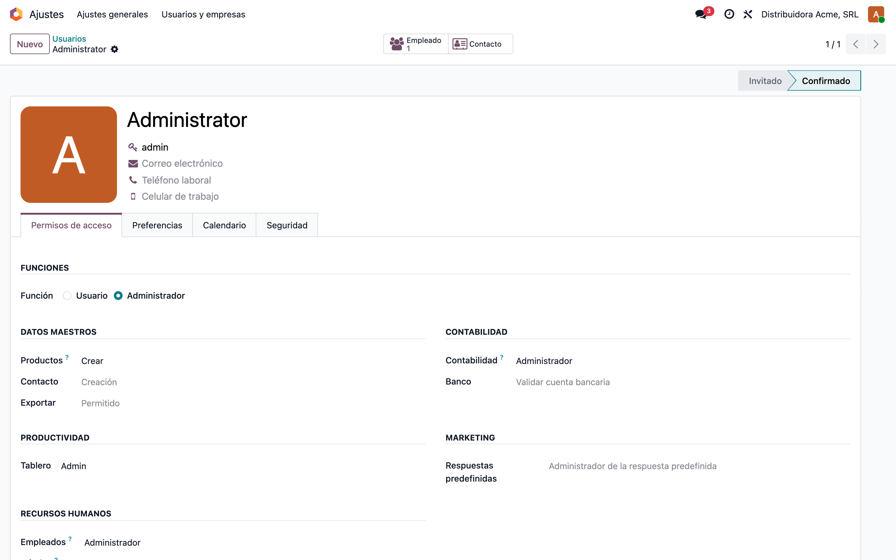

## A4. La flota de bases de datos en el padre

**Instancia:** padre · PROGRESSA (Casa Matriz) — maestra, con el módulo

**Bases de datos → Bases de datos.**

Cada instancia cliente es un registro aquí, con su URL, su base, su usuario y su llave de API. El módulo de sincronización no inventa credenciales: reutiliza estas.

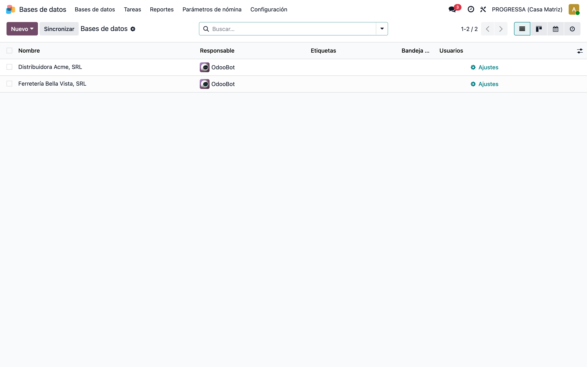

## A5. La ficha de una hija

**Instancia:** padre · PROGRESSA (Casa Matriz) — maestra, con el módulo

**Abrir la base de datos → pestaña «Base de datos».**

Debajo de los campos que ya trae el módulo `databases` aparece el grupo **Parámetros de nómina**:

| Campo | Qué hace |
|---|---|
| **Sincronizar parámetros de nómina** | La casilla que mete esta base en la tarea nocturna. Apagada por defecto |
| **Última sincronización de nómina** | Cuándo corrió por última vez |
| **Estado de la última sincronización de nómina** | Éxito, parcial, error u omitida |
| **Errores de sincronización de nómina** | Fallos consecutivos; a los 5 la tarea nocturna deja de tomarla |

En la cabecera quedan **Sincronizar parámetros de nómina** y **Previsualizar diferencias de nómina** —junto al **Sincronizar** que ya trae el módulo `databases`—, y dentro del grupo, los botones **Diagnosticar** y **Registros**.

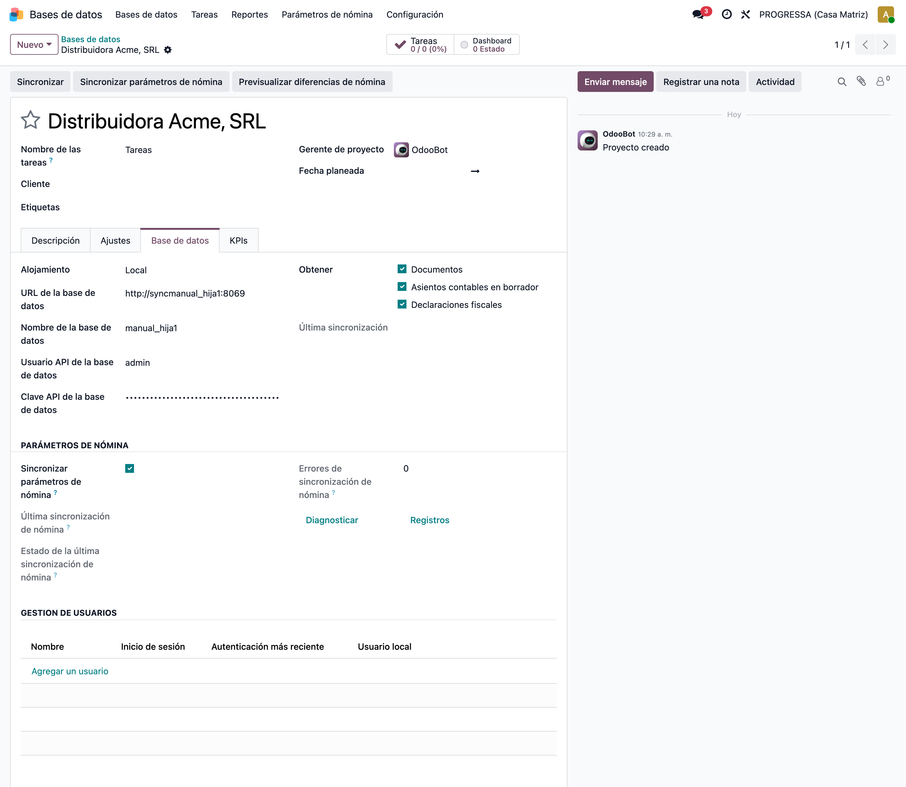

## A6. Diagnosticar antes de encender nada

**Instancia:** padre · PROGRESSA (Casa Matriz) — maestra, con el módulo

**Botón «Diagnosticar».**

Entra a la hija con la llave configurada y comprueba, modelo por modelo:

- si el usuario remoto puede **escribir** y **crear**;
- si a la hija le falta algún campo (versiones distintas del módulo de nómina);
- si el usuario remoto **ve** los registros: compara las filas que ve contra las que el padre piensa enviar. Cero contra diecisiete significa que una regla de registro las está escondiendo, y sincronizar así crearía duplicados;
- si tiene los grupos que hacen falta.

El resultado queda guardado en el campo **Diagnóstico**, y los problemas salen además en un aviso. Es la forma segura de dar de alta una hija: no gasta llamadas todas las noches, se usa cuando se configura o cuando algo se rompe.

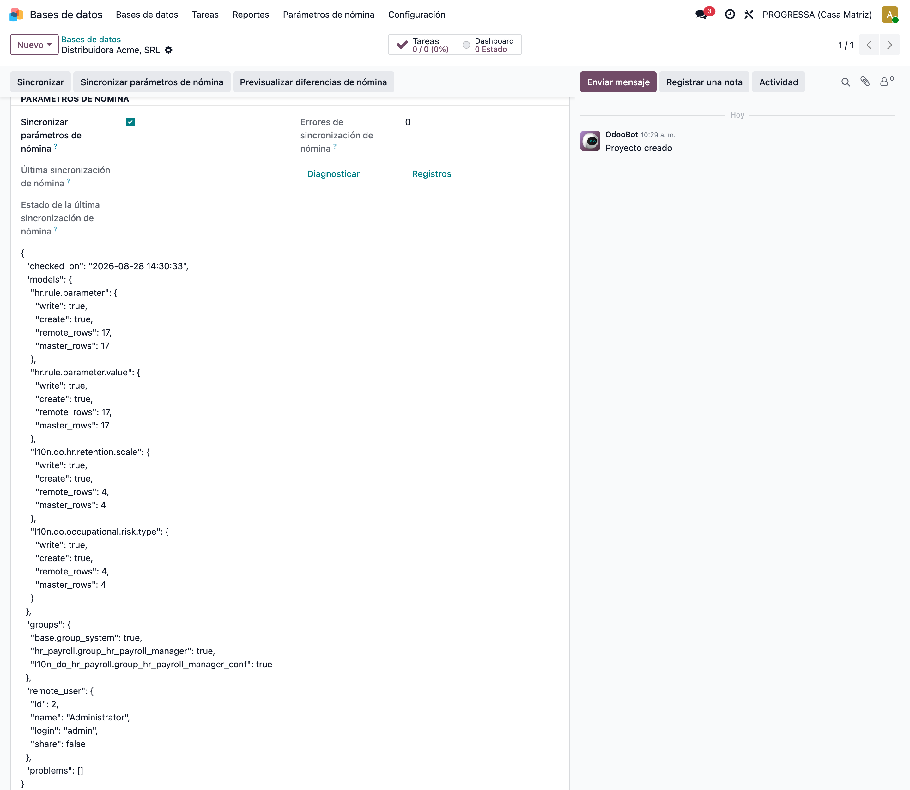

## A7. Qué se sincroniza: el registro de modelos

**Instancia:** padre · PROGRESSA (Casa Matriz) — maestra, con el módulo

**Bases de datos → Parámetros de nómina → Modelos sincronizados.**

Lo que viaja es **dato, no código**: se agregan modelos nuevos sin tocar el módulo.

| Orden | Modelo | Se empareja por | Activo |
|---|---|---|---|
| 10 | Parámetros de reglas salariales | `code` | sí |
| 20 | Valores de esos parámetros | `code` + fecha de inicio | sí |
| 30 | Escala de retención ISR | `sequence` | sí |
| 40 | Tipos de riesgo laboral | `name` | sí |
| 50 | Divisiones de pago | `name`, por compañía | **no** |

Las divisiones de pago vienen registradas pero **archivadas** a propósito: su restricción única incluye el divisor, así que no impide dos filas para la misma frecuencia, y la compañía a la que pertenecen es dato del cliente. La nota de la línea explica los cuatro requisitos antes de encenderla.

El orden importa: un valor no puede llegar antes que el parámetro del que cuelga.

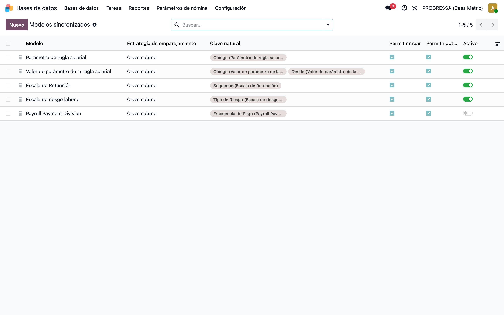

## A8. Una línea del registro por dentro

**Instancia:** padre · PROGRESSA (Casa Matriz) — maestra, con el módulo

**Abrir «Parámetros de reglas salariales».**

| Campo | Qué decide |
|---|---|
| **Campos sincronizados** | La lista blanca. Lo que no está aquí no sale de la maestra |
| **Clave natural** | Cómo se encuentra el mismo registro en la otra base. Nunca por id |
| **Claves de relación** | Cómo se resuelve un many2one: el país se busca por su código, no por su id |
| **Dominio** | Filtro del lado del padre: aquí, solo los parámetros dominicanos |
| **Dígitos de precisión** | Tolerancia al comparar decimales, para no reescribir por ruido de coma flotante |
| **Permitir crear / actualizar** | Nunca hay «permitir borrar»: no existe |
| **Permitir campos ejecutables** | Apagado. Los campos con código Python no viajan salvo que se pida |

El emparejamiento es por **`code`**, no por ID externo, y es deliberado: un parámetro creado a mano en el padre no tiene ID externo, y nunca llegaría.

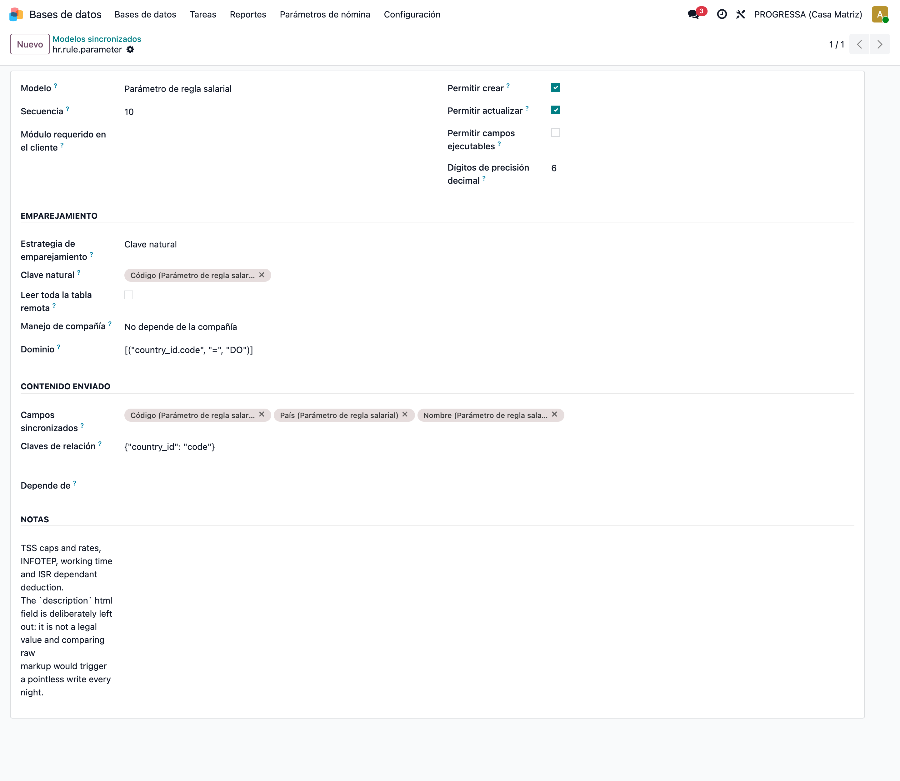

## A9. Ajustes de la flota

**Instancia:** padre · PROGRESSA (Casa Matriz) — maestra, con el módulo

**Ajustes → Bases de datos.**

| Ajuste | Para qué |
|---|---|
| **Modo simulación** | Deja la tarea nocturna corriendo e informando, pero sin escribir en ninguna hija. Red de seguridad después de un cambio delicado |
| **Hilos en paralelo** | **Solo la tarea nocturna**: uno por servidor cliente, no por base, para que varias bases en un mismo servidor no lo inunden. Una sincronización lanzada a mano corre siempre en **un solo hilo**, porque ocurre en horario laboral sobre una instancia de producción |
| **Límite de errores** | Fallos consecutivos antes de sacar una base de la tarea nocturna |
| **Retención del historial** | Días de bitácora antes de la purga semanal |

El horario es **uno solo para toda la flota**, no por cliente: la tarea programada *Payroll Sync: distribute legal parameters* corre a las 06:30 UTC, o sea **2:30 de la madrugada** en República Dominicana.

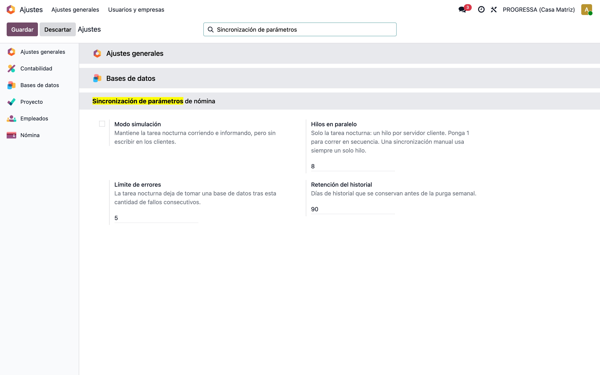

## Parte B — El día a día

La TSS publica un tope nuevo. Se edita **una vez** en el padre y esa noche lo tienen las dos hijas.

Lo que sigue está capturado en ese orden, sobre las tres bases vivas.

## B1. El tope actual en el padre

**Instancia:** padre · PROGRESSA (Casa Matriz) — maestra, con el módulo

**Nómina → Configuración → Parámetros de reglas salariales**, buscando `SFS_TOPE`.

El tope de cotización del Seguro Familiar de Salud vigente desde el 1 de febrero de 2026.

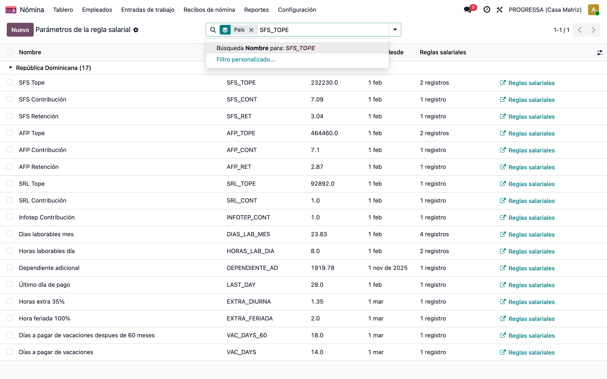

## B2. El mismo tope en la hija

**Instancia:** hija 1 · Distribuidora Acme, SRL — cliente, sin el módulo

La hija tiene el mismo valor, pero porque lo trae el módulo de nómina que instaló, no porque nadie se lo haya enviado. Este es el punto de partida.

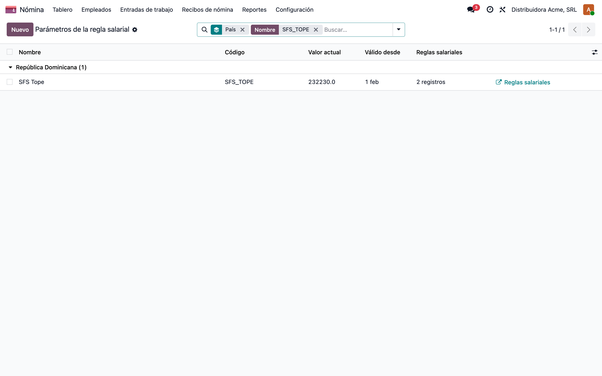

## B3. Se edita en el padre y se previsualiza

**Instancia:** padre · PROGRESSA (Casa Matriz) — maestra, con el módulo

Se sube el tope a 240 000 en el padre y se pulsa **Previsualizar diferencias**.

La simulación hace exactamente el mismo trabajo que la corrida real —lee cada hija, compara, arma el plan— y se detiene justo antes de escribir. La corrida queda marcada como **Simulación** y reporta un valor actualizado por hija.

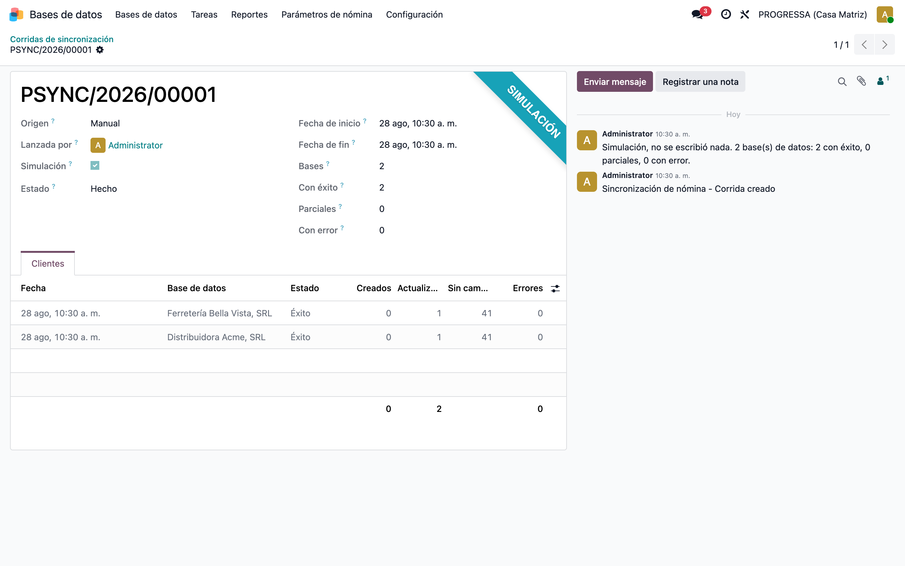

## B4. Qué exactamente va a cambiar

**Instancia:** padre · PROGRESSA (Casa Matriz) — maestra, con el módulo

**Abrir el registro de una hija dentro de la corrida.**

El detalle es por registro: modelo, clave, operación y el cambio con **valor anterior y valor nuevo**. Solo se guardan las líneas que hacen algo —creado, actualizado, omitido, error, o presente solo en la hija—; los cuarenta y pico que ya coincidían se cuentan, no se listan.

Esta pantalla **es** la previsualización: no hace falta un asistente aparte.

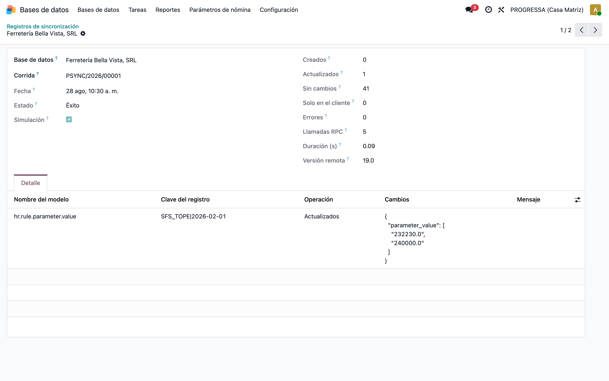

## B5. La corrida de verdad

**Instancia:** padre · PROGRESSA (Casa Matriz) — maestra, con el módulo

**Sincronizar parámetros de nómina** —o, sin que nadie haga nada, la tarea de las 2:30.

Una corrida, dos hijas, un registro por hija. Cada una lleva su cuenta de creados, actualizados, sin cambios, solo en el cliente, errores, y **cuántas llamadas RPC costó**. Una noche en la que no cambió nada son cinco llamadas por hija.

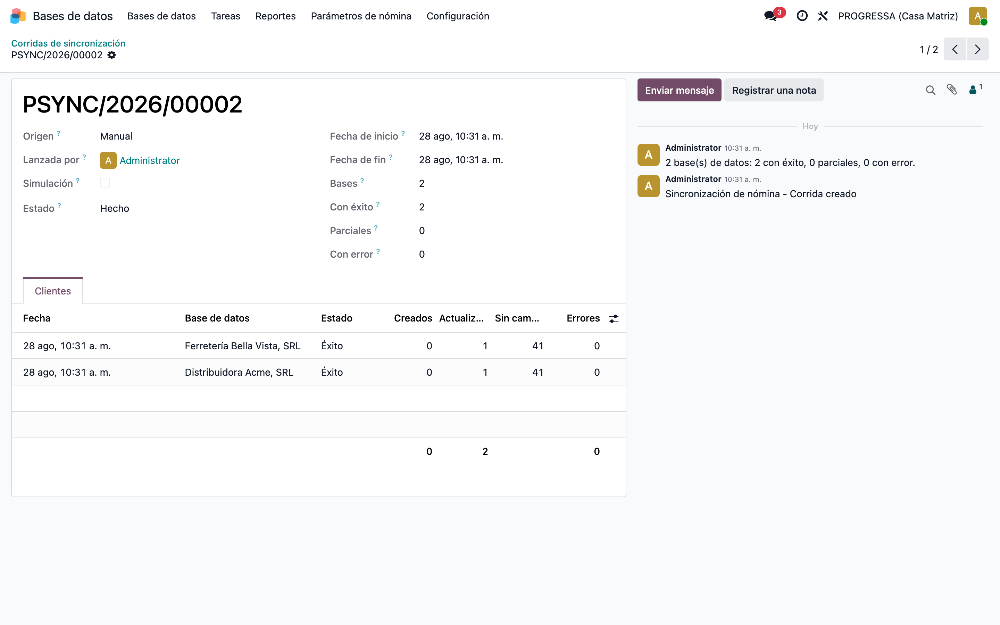

## B6. La hija 1, ya con el tope nuevo

**Instancia:** hija 1 · Distribuidora Acme, SRL — cliente, sin el módulo

Nadie entró a esta base. El valor cambió porque el padre lo escribió por RPC.

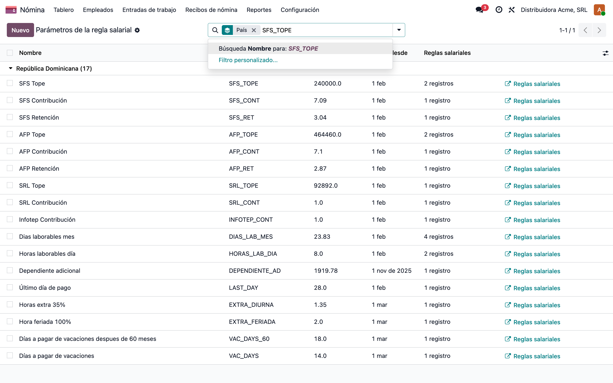

## B7. Y la hija 2, igual

**Instancia:** hija 2 · Ferretería Bella Vista, SRL — cliente, sin el módulo

Misma edición, una sola vez, dos bases actualizadas. Con cincuenta clientes es la misma operación.

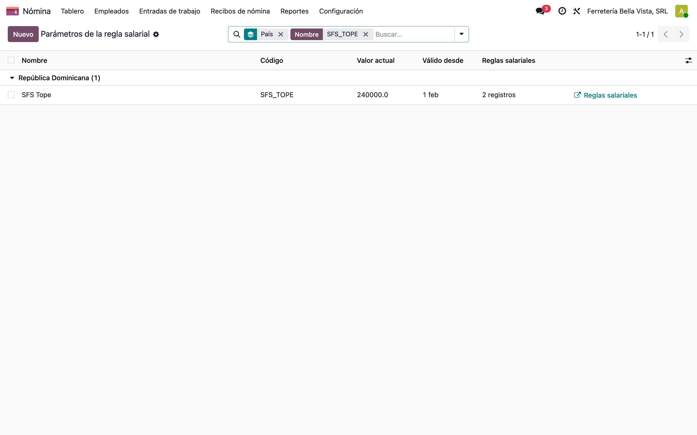

## B8. La escala del ISR

**Instancia:** hija 1 · Distribuidora Acme, SRL — cliente, sin el módulo

Cuando la DGII actualiza los tramos del ISR, cambian los montos **y el nombre del tramo**, que los lleva escritos. Se edita en el padre y llega igual.

> Este es el modelo que exige `base.group_system` en el usuario remoto: la escala rechaza que cualquier otro le cambie el nombre o la secuencia. Si falta ese grupo, el diagnóstico lo dice y la corrida queda en *parcial*: el resto de los parámetros sí se aplican.

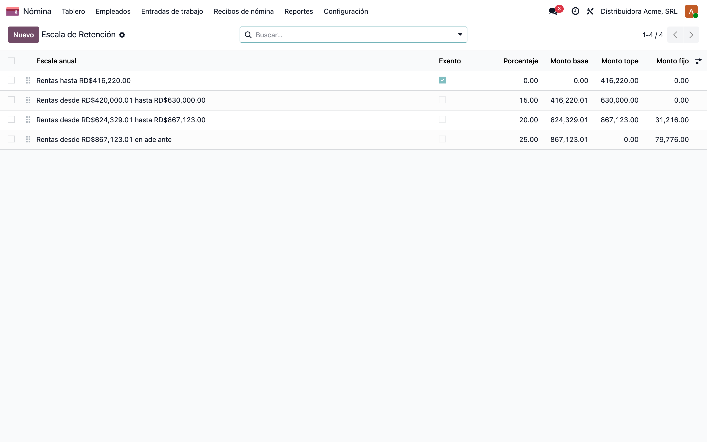

## B9. Lo que alguien tocó a mano en la hija se pierde

**Instancia:** hija 2 · Ferretería Bella Vista, SRL — cliente, sin el módulo

Alguien en la hija 2 puso el riesgo laboral de la clase I en 9,99. En la siguiente ventana de sincronización el padre lo devuelve a 0,10.

Es la regla acordada y no es retroactiva: mientras no corra la sincronización, el valor editado a mano es el que usa la nómina de esa hija. Cuando corre, gana el padre.

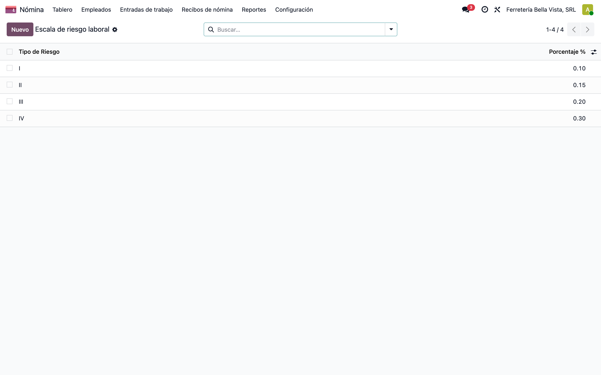

## Parte C — Cuando algo sale mal

Cinco fallos que se ven en producción: una hija apagada, un permiso que falta, filas que solo existen en la hija, y el que más despista de todos —un registro **nuevo** que la hija deja actualizar pero no crear—. Ninguno detiene al resto de la flota, y todos quedan por escrito.

## C1. Una hija apagada

**Instancia:** padre · PROGRESSA (Casa Matriz) — maestra, con el módulo

Se apaga la hija 2 y se cambia otro tope. La corrida entrega a la hija 1 y marca la hija 2 en **error**, con el mensaje del fallo y el contador de errores en 1.

El aislamiento es por hija y también por modelo: un modelo que falla no impide los demás, y la corrida queda en *parcial* en vez de en *error*.

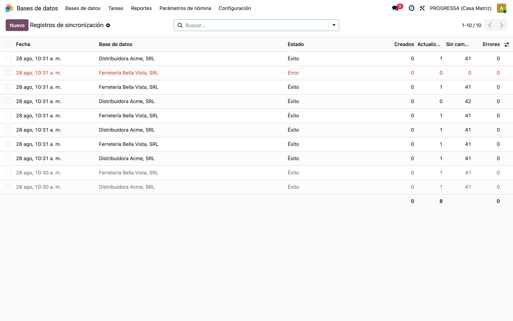

## C2. Vuelve, y a la noche siguiente se pone al día

**Instancia:** padre · PROGRESSA (Casa Matriz) — maestra, con el módulo

No hay nada que reintentar a mano: la sincronización no es un diario de cambios, es una comparación. La siguiente corrida lee lo que la hija tiene, ve que le falta el tope y lo escribe. El contador de errores vuelve a cero.

Si una hija estuviera caída cinco noches seguidas, la tarea nocturna deja de tomarla hasta que alguien pulse **Reiniciar contador de errores**; así una base muerta no gasta la ventana de las demás.

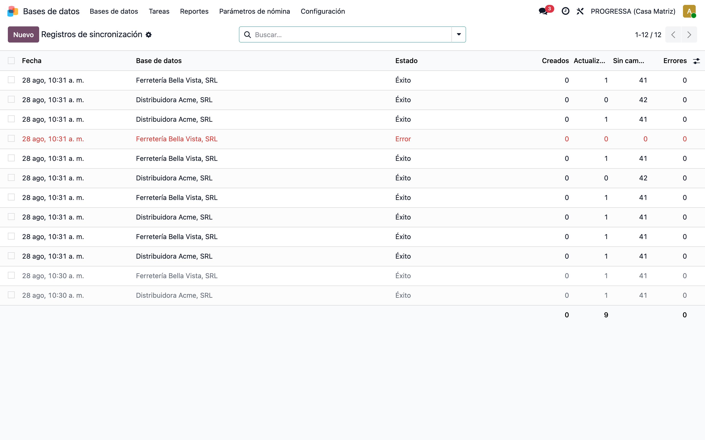

## C3. Falta un permiso en la hija

**Instancia:** padre · PROGRESSA (Casa Matriz) — maestra, con el módulo

Se le quita a la hija 1 el grupo de configuración de nómina y se cambia un porcentaje de riesgo laboral.

La hija 1 queda en **parcial**: los parámetros de reglas salariales entraron, el riesgo laboral no. El detalle trae el error remoto tal cual, con el modelo y el registro que lo produjo, y el contador de errores sube. La hija 2, que sí tiene el grupo, queda en éxito.

El campo **Mensaje** de la bitácora resume lo mismo sin abrir la pestaña de detalle, y cuando el modelo tiene un grupo remoto conocido añade una línea diciendo cuál otorgar.

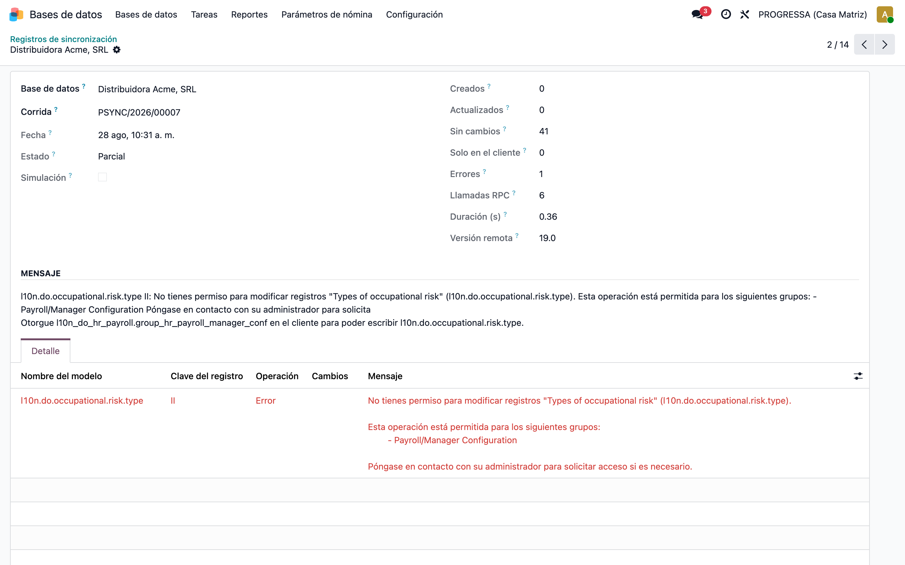

## C4. Filas que solo existen en la hija

**Instancia:** padre · PROGRESSA (Casa Matriz) — maestra, con el módulo

Una hija puede tener, legítimamente, más filas que el padre: `l10n_do_hr_payroll_liquidation` siembra valores retro-datados de 2003 que el padre no conoce.

Esas filas salen en el detalle como **Solo en el cliente** y **no se tocan nunca**. La sincronización crea y actualiza; no borra. Un parámetro que se elimine en el padre tampoco desaparece de las hijas: se queda y se reporta.

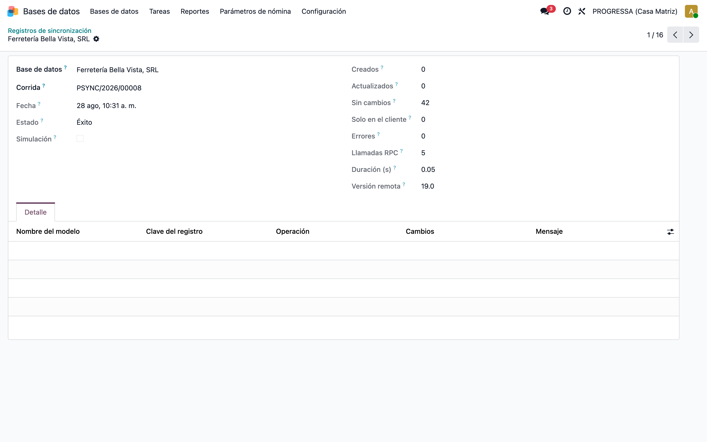

## C5. Un tramo nuevo que la hija deja actualizar pero no crear

**Instancia:** padre · PROGRESSA (Casa Matriz) — maestra, con el módulo

Este es el que cuesta ver, porque no parece un problema de permisos: la hija **sí** deja escribir la escala del ISR y **no** deja crearla.

El padre pasa a hablarle a la hija 1 con un usuario de API realista —administrador de nómina y de configuración de nómina DO, sin ajustes técnicos— y se le agrega al padre un tramo nuevo, de los que publica la DGII cuando cambia la escala.

La lista de control de acceso de `l10n_do_hr_payroll` le da a `hr_payroll.group_hr_payroll_manager` lectura y escritura sobre `l10n.do.hr.retention.scale`, pero **crear solo lo puede `base.group_system`**. El resultado: las correcciones de los tramos que ya existen entran sin problema y el tramo nuevo se rechaza.

La bitácora lo dice en el **Mensaje**, con el error tal como lo redactó la hija y, debajo, el grupo que hay que otorgar. Antes esto solo quedaba en una línea del detalle y la hija volvía en *parcial* con el mensaje en blanco.

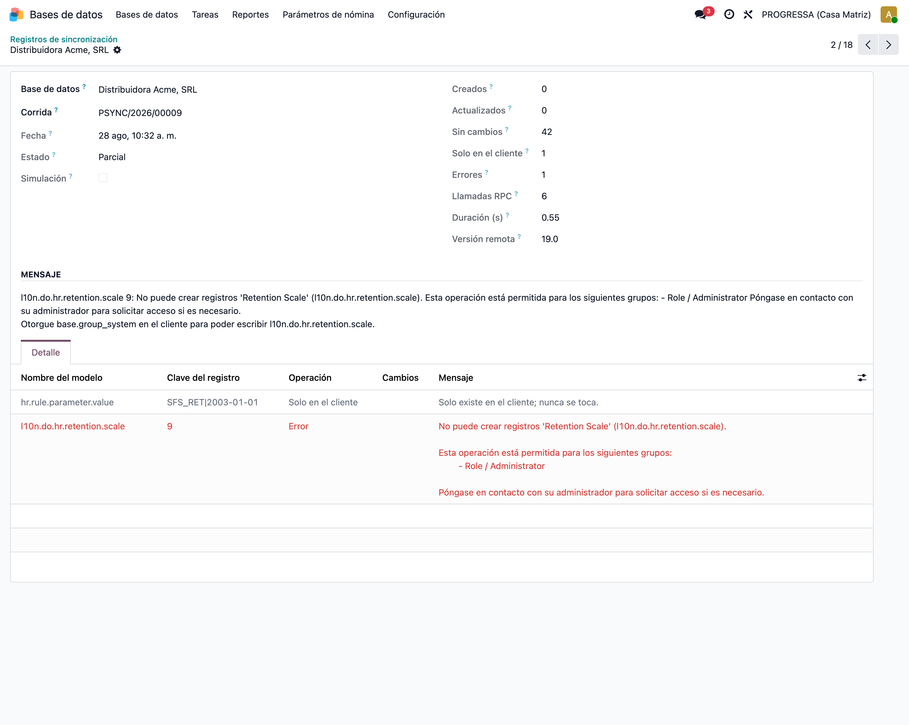

## C6. La corrida deja constancia en su chatter

**Instancia:** padre · PROGRESSA (Casa Matriz) — maestra, con el módulo

Cada corrida publica un mensaje en su propio chatter: cuántas hijas terminaron bien, a medias y mal, y para las que no terminaron bien, el error de cada una.

Sirve para lo que se pidió en la reunión: enterarse de **qué cambios no se ejecutaron** sin ir a buscarlos base por base. Y como es un chatter de verdad, se le puede seguir, comentar y responder.

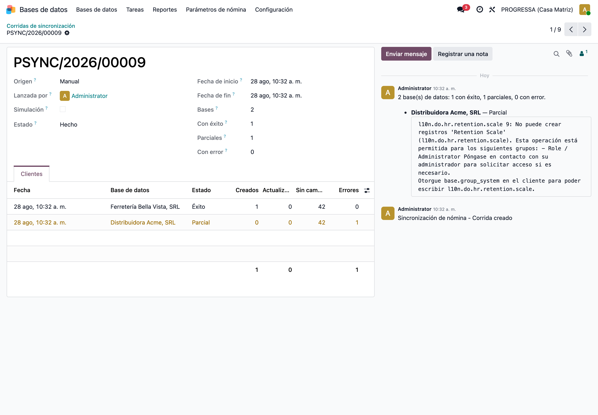

## C7. Y la ficha de la hija se entera también

**Instancia:** padre · PROGRESSA (Casa Matriz) — maestra, con el módulo

**Bases de datos → la ficha de la hija.**

La misma entrega deja una nota en el chatter de la base cliente, así que el fallo queda sobre el registro del cliente y no solo dentro de una corrida que hay que ir a buscar.

Solo se anota lo que hay que leer: una simulación no escribe nada, y una noche en la que la hija terminó en éxito tampoco. Si se anotara cada noche, la nota que importa quedaría enterrada.

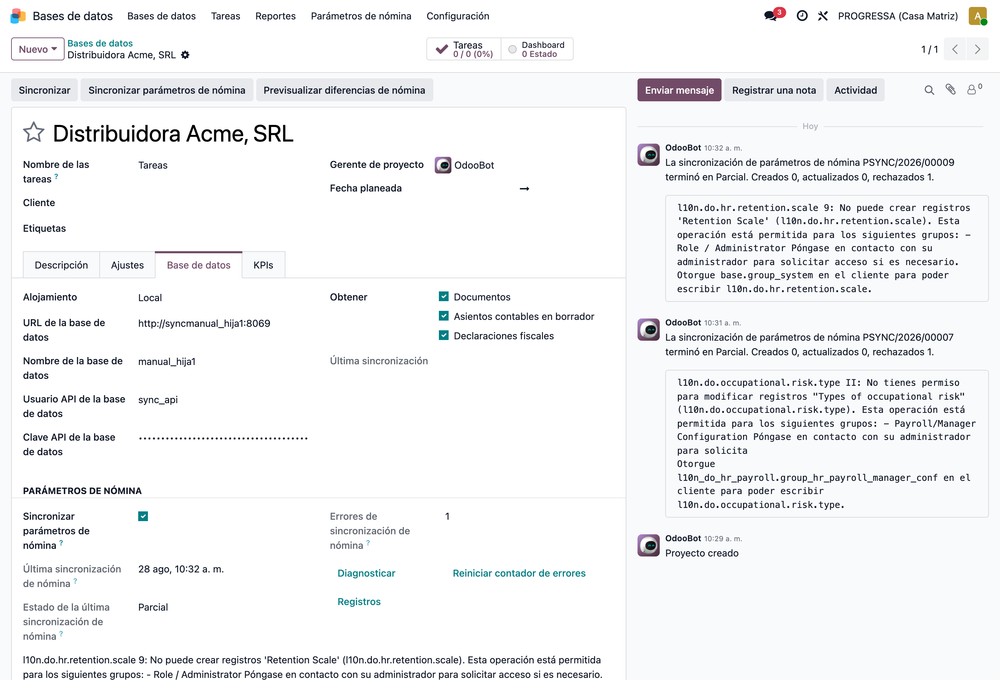

## C8. Se otorga el permiso y el tramo entra solo

**Instancia:** hija 1 · Distribuidora Acme, SRL — cliente, sin el módulo

No hay nada que reintentar a mano ni ninguna cola que vaciar. Se le devuelve al padre un usuario remoto que sí puede crear, corre la siguiente entrega, y el tramo aparece en la hija.

**Nómina → Configuración → Escala de retención**, en la hija: los cuatro tramos de siempre más el nuevo, escrito por RPC sin que nadie entre a esta base.

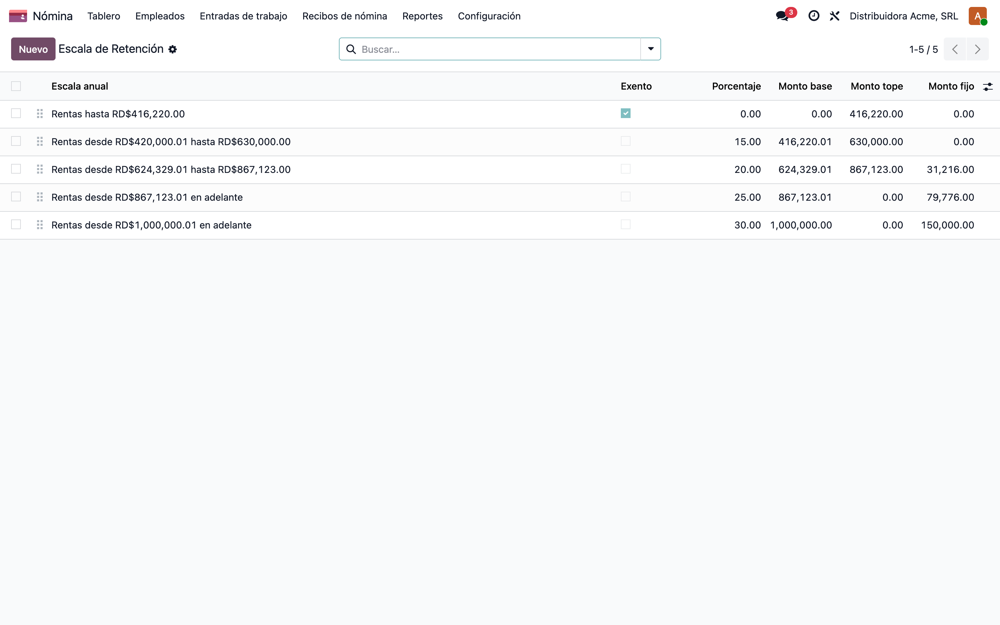

## C9. El historial completo

**Instancia:** padre · PROGRESSA (Casa Matriz) — maestra, con el módulo

**Bases de datos → Parámetros de nómina → Corridas de sincronización.**

Una fila por noche —o por botón—, con cuántas hijas terminaron bien, cuántas a medias y cuántas mal. Las simulaciones salen atenuadas. Una tarea semanal borra lo que pase de 90 días.

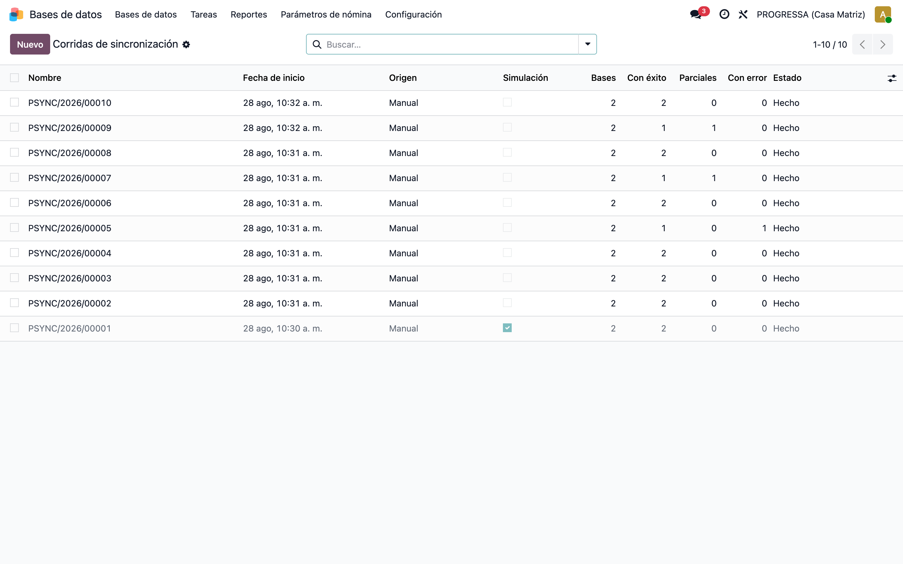

## Parte D — Referencia

El camino completo, de la edición en el padre a la escritura en la hija.

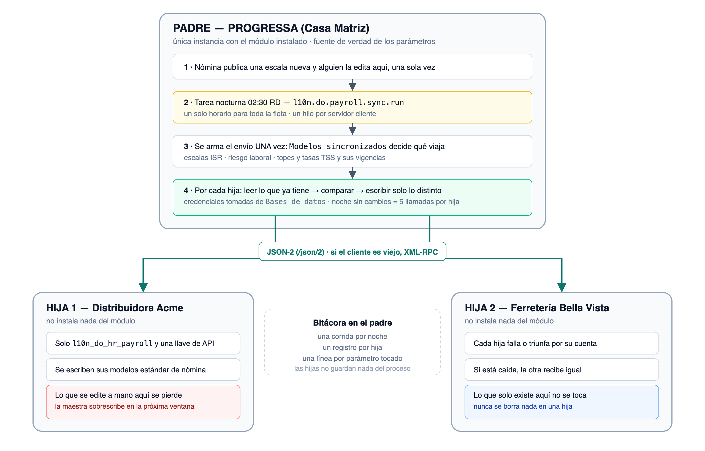

## D1. Cuánto cuesta una noche

Con la semilla puesta, una hija que ya está al día cuesta **cinco llamadas**:

| # | Llamada |
|---|---|
| 1 | Leer los parámetros de reglas salariales por su `code` |
| 2 | Resolver el país (una vez por corrida, se reutiliza) |
| 3 | Leer los valores de esos parámetros |
| 4 | Leer la escala ISR completa |
| 5 | Leer los tipos de riesgo laboral |

Si hay cambios se suma **una** creación por modelo, con todas las filas nuevas juntas, y una escritura por grupo de registros que cambian igual. La actualización anual típica de la TSS —tres parámetros y tres valores— son seis llamadas.

Por eso no se escribe registro a registro: cada llamada RPC es su propia transacción en la hija, y escribir de a uno multiplica los fallos parciales y limpia la caché del cliente una vez por fila, en plena madrugada.

## D2. Dónde se va el tiempo

Medido con `cProfile` sobre el banco de pruebas, con una hija ya al día, el registro de Odoo caliente y las dos bases en la misma red:

| Fase | Por hija |
|---|---|
| **Las 5 llamadas RPC** | 18,6 ms — **73 %** |
| Contabilidad ORM: bitácora, detalle, estado de la base | 6,7 ms |
| **Total** | 25,4 ms |

Armar el paquete de datos —leer los cuatro modelos del padre y serializarlos— cuesta **3 ms y se hace una sola vez por corrida**, no por hija: con cien clientes sigue costando 3 ms.

O sea que el tiempo es **latencia de red, no cálculo**. En el banco cada llamada tarda 4 ms porque las dos bases se hablan por la red interna de Docker; contra un cliente real por HTTPS cada llamada cuesta un viaje de ida y vuelta, y **antes** de eso el saludo TCP y el de TLS. Ahí es donde se van los segundos que se ven al sincronizar una sola hija a mano.

Por eso la conexión se abre **una sola vez por hija** y se reutiliza para las cinco llamadas, en vez de abrir una por llamada. Contra un cliente detrás de nginx o en odoo.sh son cuatro saludos TCP+TLS menos por hija y por corrida: a 40 ms de latencia, entre 320 y 480 ms menos por cliente, y más de medio minuto por noche con cien clientes. Contra un servidor de desarrollo, que responde `Connection: close`, no cambia nada y nada se rompe.

Dos cosas que conviene tener presentes al crecer la flota:

- **Un hilo por servidor cliente, no por base.** Si cincuenta bases viven en el mismo servidor, se entregan una detrás de otra en el mismo hilo. Es deliberado —no se inunda un servidor ajeno—, pero significa que esa noche dura la suma de las cincuenta, no la más lenta.
- **La resolución de nombres es un prólogo en serie.** Antes de empezar se resuelve el DNS de cada cliente, uno por uno, para agruparlos por servidor. Con miles de bases ese prólogo se nota.

Y la sincronización lanzada **a mano** corre siempre en **un solo hilo**: ocurre en horario laboral sobre una instancia de producción, y quien pulsó el botón espera la respuesta de todos modos. Los hilos en paralelo son de la tarea nocturna, que tiene la madrugada entera para repartirse.

## D3. Cómo se reconoce el mismo registro en dos bases

Nunca viaja un id de Postgres. Cada modelo declara su **clave natural**:

| Modelo | Clave | Por qué esa |
|---|---|---|
| Parámetros de reglas salariales | `code` | Ya es único a nivel de base de datos en ambos lados |
| Valores de parámetros | `code` + fecha de inicio | Es exactamente la restricción única del modelo |
| Escala ISR | `sequence` | El número de tramo; los montos y el nombre son lo que cambia |
| Riesgo laboral | `name` | Las clases I a IV |

Si dos filas de la hija comparten la misma clave, esa fila se **salta** y se registra el conflicto con los ids remotos. Nunca se adivina.

Los many2one se resuelven en destino: el país por su código, y el parámetro padre de un valor por el `code` que ya se resolvió en la pasada anterior —de ahí que el orden del registro importe.

## D4. Seguridad

- **Ninguna contraseña nueva.** Se usan las llaves de API que el módulo `databases` ya guarda, y que solo un administrador de la flota puede ver.
- **Nada se escribe en el registro sin permiso de administrador de flota**: quien decide qué se escribe en bases de terceros es ese rol.
- **Bitácoras filtradas**: un usuario de flota solo ve las bitácoras de las bases donde tiene cuenta.
- **Secretos tachados en el punto de captura**, no al mostrarlos: un error de autenticación por XML-RPC puede traer la llave dentro del mensaje, así que se limpia antes de guardarla.
- **Los campos con código Python no viajan** salvo que se marque explícitamente la casilla en la línea del registro.

## D5. Cuatro cosas que conviene saber

**1. Un `-u l10n_do_hr_payroll` en una hija revierte lo sincronizado.** Los archivos de datos de los parámetros de reglas salariales y de las divisiones de pago no llevan `noupdate`, así que actualizar el módulo reescribe los valores de la semilla. La noche siguiente lo corrige y queda en la bitácora, pero conviene sincronizar a mano después de una actualización.

**2. Las divisiones de pago están apagadas.** Están registradas y a un clic, pero la nota de la línea lista los cuatro requisitos antes de encenderlas: dependen de la compañía, su restricción única no impide duplicados por frecuencia, no son un parámetro legal publicado por el Estado, y las revierte cualquier actualización del módulo de nómina en la hija.

**3. La escala del ISR necesita ajustes técnicos en la hija para *crear*.** Escribir sobre los tramos que ya existen le basta con el grupo de administrador de nómina; crear un tramo nuevo lo exige `base.group_system`. Es la trampa de la sección C5: todo parece funcionar hasta que la DGII publica una escala con un tramo más. **Diagnosticar** lo detecta antes de la primera corrida.

**4. Una hija cargada de addons de terceros puede rechazar las creaciones, y el módulo lo resuelve solo.** Un addon instalado en la hija que reescriba el método `create` con otro nombre de argumento deja ese modelo inalcanzable por el transporte moderno; en la bitácora se leía como `missing a required argument: 'vals'`. El conector lo reconoce y reintenta esa llamada por el transporte viejo, que no depende del nombre —ver E2—. No hay nada que configurar ni que tocar en la hija: solo aparece una llamada RPC de más la primera vez que ese modelo se crea.

## D6. Cómo se regenera este manual

```bash
tools/sync-manual/setup.sh      # crea las tres bases y las empareja
tools/sync-manual/generate.sh   # captura las pantallas y arma este README
tools/sync-manual/teardown.sh   # baja los tres contenedores
```

Las pruebas del módulo van aparte:

```bash
odoo -d <base> --test-tags /l10n_do_hr_payroll_sync --stop-after-init   # 55 unitarias
tools/sync-e2e/run-tests.sh                                            # 36 comprobaciones e2e
tools/sync-e2e/regression.sh                                           # 27 de regresión de nómina
```

## Parte E — Por dentro

Esta parte es para quien va a mantener el módulo. El resto del manual se puede leer sin ella.

Todo el módulo vive en la maestra y se reparte en tres capas: los **modelos**, que son la parte Odoo de siempre; el **motor** (`engine.py`), que decide qué escribir; y el **conector** (`api.py`), que sabe hablarle a otra base de datos.

## E1. Las tres capas

| Capa | Dónde corre | De qué sabe |
|---|---|---|
| `models/` | proceso principal, con ORM | qué se sincroniza, permisos, bitácora, estados de cada base |
| `engine.py` | hilo trabajador, sin ORM | cómo comparar y en qué orden escribir |
| `api.py` | hilo trabajador, sin ORM | cómo hablarle a la base cliente |

El corte no es decorativo: la sincronización nocturna abre un hilo por servidor cliente, y dentro de un hilo **no se puede tocar el ORM** —el cursor pertenece al hilo principal—. Por eso el proceso principal serializa una sola vez todo lo que hay que enviar (`_build_payload`, datos planos: diccionarios, listas, strings) y los hilos trabajan sobre eso, sin volver a la base de la maestra.

## E2. `api.py` — el conector

Un cliente RPC por base de datos cliente. Hereda de `OdooDatabaseApi`, el conector del módulo enterprise `databases`, así que reutiliza las credenciales de la ficha, la autenticación y el mecanismo de reintento que ya venían probados. Solo agrega las seis operaciones que el motor necesita: `search_read`, `create`, `write`, `fields_get`, `has_access` y `has_group`. Ni una línea de nómina.

Cinco cosas que aporta por encima del conector base:

- **Dos transportes, uno solo visible.** Primero `POST /json/2/<modelo>/<método>` con la llave de API en la cabecera `Authorization: Bearer`. Si el cliente contesta una redirección o un 404 —un Odoo más viejo, que no tiene ese endpoint— la llamada se repite tal cual por XML-RPC. El resto del módulo no se enteró de cuál de los dos se usó.
- **Y un segundo motivo para cambiar de transporte.** `/json/2` arma la llamada por nombre de argumento, contra la firma que el modelo declara *en el cliente*. Basta con que un addon instalado allá reescriba `create(self, vals)` —varios de tienda lo hacen, y alguno sobre el modelo `base`, o sea sobre todos los modelos a la vez— para que ningún nombre sirva: el declarado revienta la llamada y el real no pasa la validación. XML-RPC entrega el contenido por posición y no depende de cómo se llame el argumento, así que el conector reintenta esa llamada por ahí. Se acuerda del modelo y del método, de modo que el resto de la corrida va directo y no vuelve a gastar el intento fallido. Lo demás —leer, `fields_get`— sigue por `/json/2`.
- **Tiempos de espera separados**: 30 segundos para leer, 120 para escribir. Una escritura grande sobre una hija lenta no debe morir con el mismo reloj que una lectura. XML-RPC no trae tiempo de espera propio, así que el módulo le pone uno a mano.
- **Cuenta las llamadas**, sumando los dos transportes. De ahí sale el campo **Llamadas RPC** de la bitácora y el «cinco llamadas por noche sin cambios» de la sección D1.
- **Una sola conexión por hija.** El conector base abre una conexión nueva en cada llamada; este mantiene una sesión HTTP viva mientras dura la entrega y la cierra al terminar. Contra un cliente por HTTPS eso son cuatro saludos TCP y TLS menos por hija y por corrida —ver D2—.

## E3. `engine.py` — comparar y aplicar

Python puro sobre diccionarios: entra el paquete de datos que armó la maestra más un conector, y sale un resultado plano con los contadores y el detalle. No importa nada de Odoo salvo la excepción `ApiError`.

Por cada modelo del registro, en orden de secuencia:

1. **Indexar la hija.** Se lee del cliente lo que hace falta y se indexa por clave natural. Si dos filas del cliente comparten la misma clave, esa clave queda marcada como ambigua y sus registros se reportan como error, con los ids remotos: nunca se adivina cuál de las dos era.
2. **Resolver las relaciones.** Un many2one no puede viajar como id. El país se busca por su código; el parámetro del que cuelga un valor se busca por la clave que ya se resolvió en la pasada anterior —de ahí que el orden del registro importe—. Si no hay contraparte, ese registro sale con un error de resolución y los demás siguen.
3. **Armar el plan.** Cada registro cae en una de cinco cajas: crear, escribir, omitir, error, o presente solo en el cliente. La comparación normaliza antes: los flotantes se redondean a los dígitos de precisión de la línea y los espacios en blanco se colapsan, para no reescribir por ruido.
4. **Limpiar lo que la hija no entiende.** Si un campo de selección lleva un valor que en el cliente no existe, se quita ese campo y se reporta; la fila entra igual con el resto de sus valores.
5. **Aplicar.** Una sola llamada `create` con todas las filas nuevas juntas, y una `write` por grupo de registros que cambian igual. Si el lote choca con un error de integridad —clave duplicada, restricción única— se reintenta fila por fila para aislar la culpable en vez de perder el lote entero.

Dos decisiones que se notan al leer el código:

- **Los errores viajan como códigos, no como frases.** El hilo no tiene entorno, así que no puede traducir: devuelve `module_missing`, `create_disabled`, `ambiguous`… y la capa ORM los convierte en una oración en el idioma de quien lee la bitácora. Lo que venga del cliente se pasa tal cual, porque ya viene redactado por él.
- **Un modelo sin nada que enviar no cuesta una llamada.** Si el padre no tiene ni una fila de ese modelo, se salta: leer la tabla remota entera solo serviría para reportar cada una de sus filas como «solo en el cliente». La excepción es la casilla *Leer toda la tabla remota*, que es exactamente pedir lo contrario.
- **No existe el borrado.** El plan tiene cajas para crear, escribir y omitir; ninguna para eliminar. Lo que solo está en la hija se cuenta y se reporta, y ahí se queda.

## E4. Para qué sirve el corte

Separar las tres capas es lo que permite probarlo casi todo sin una segunda instancia:

- el **motor** se prueba con un conector falso en memoria, sin red y sin base cliente;
- la **capa ORM** se prueba con el motor simulado, verificando estados, contadores y permisos;
- el **conector** es lo único que necesita una base de verdad enfrente, y eso lo cubre el banco de pruebas de extremo a extremo.

Y es lo que permite agregar un modelo nuevo al registro sin escribir código: el motor no conoce `hr.rule.parameter` ni la escala del ISR, solo especificaciones que le llegan como datos.

---

_Manual generado desde tres instancias reales con `tools/sync-manual/generate.sh`. Las capturas se rehacen levantando el entorno con `setup.sh` y volviendo a ejecutarlo._
