# Solicitud de Vacante — Manual de usuario (l10n_do_hr_recruitment)

> Manual generado con `tools/manual-generator`. Las capturas se regeneran ejecutando el generador contra una base `test_v19_<módulo>`.

Este módulo agrega al reclutamiento de Odoo la pieza que la práctica dominicana exige y que Odoo nativo no tiene: la **Solicitud de Vacante** (*requisición de personal*).

En Odoo estándar el proceso arranca cuando ya existe un **Puesto de trabajo** abierto y llegan **Candidatos**. En la práctica, antes de eso hay un paso administrativo: alguien del negocio **solicita** cubrir una plaza y esa solicitud debe ser **aprobada** por Recursos Humanos / Gerencia antes de abrir el proceso. Ese paso es lo que este módulo formaliza en el modelo `l10n.do.hr.vacancy.application`.

Qué aporta, en concreto:

- Un documento numerado (**VAC00001**, **VAC00002**, …) con su propio **flujo de aprobación** y su bitácora en el chatter.
- **Trazabilidad de tiempos** del proceso: días en aprobar, en abrir y en cerrar la vacante — calculados, no digitados.
- Enlace **vacante → candidatos**: cada candidato se cuelga de una solicitud; desde la solicitud se ve el contador y el listado de sus candidatos.
- Datos de contexto que el negocio pide y Odoo no guarda: **tipo de vacante**, **cantidad de recursos**, **tipo de contrato**, **fecha deseada de contratación**, **motivo de ingreso** y **tipo de cobertura** (interna / externa / mixta) con los **empleados internos considerados**.
- **Grados académicos** (`hr.recruitment.degree`) reutilizados tanto en el puesto como en la ficha del empleado.

Depende de `hr_recruitment` y de `l10n_do_hr`; no reemplaza nada del reclutamiento nativo: lo extiende.

## Requisitos previos

- Módulo **`l10n_do_hr_recruitment`** instalado (v `19.0.1.0.0`).
- Dependencias: **`hr_recruitment`** (Reclutamiento) y **`l10n_do_hr`** (localización RD de empleados).
- Permisos: **Reclutamiento / Usuario** (`hr_recruitment.group_hr_recruitment_user`) para crear solicitudes; **Reclutamiento / Administrador** (`hr_recruitment.group_hr_recruitment_manager`) para **Aprobar** y **Rechazar**.
- El solicitante debe existir como **Empleado** (`hr.employee`) y estar ligado a su usuario si se quiere que el campo *Solicitante* venga por defecto.
- La secuencia **VAC** (`hr.vacancy.application`) se crea al instalar y se replica sola en cada compañía nueva.

## 1. Dónde está: Reclutamiento → Solicitud de Vacantes

El menú **Solicitud de Vacantes** queda dentro de **Reclutamiento → Puestos de trabajo** (`sequence=0`, o sea de primero). Ahí vive el listado de todas las requisiciones.

El listado muestra: **Priority** (estrellas), **Referencia solicitud de vacante** (`VAC00001`…), **Puesto de trabajo solicitado**, **Fecha de solicitud** y **Estado**. El **Responsable de reclutamiento** es una columna opcional (se activa con el ⚙ de la derecha) y **Compañía** solo aparece en multicompañía.

En la base de ejemplo hay una requisición por cada estado relevante: *En proceso*, *Por aprobar*, *Finalizado* y *Rechazado*.

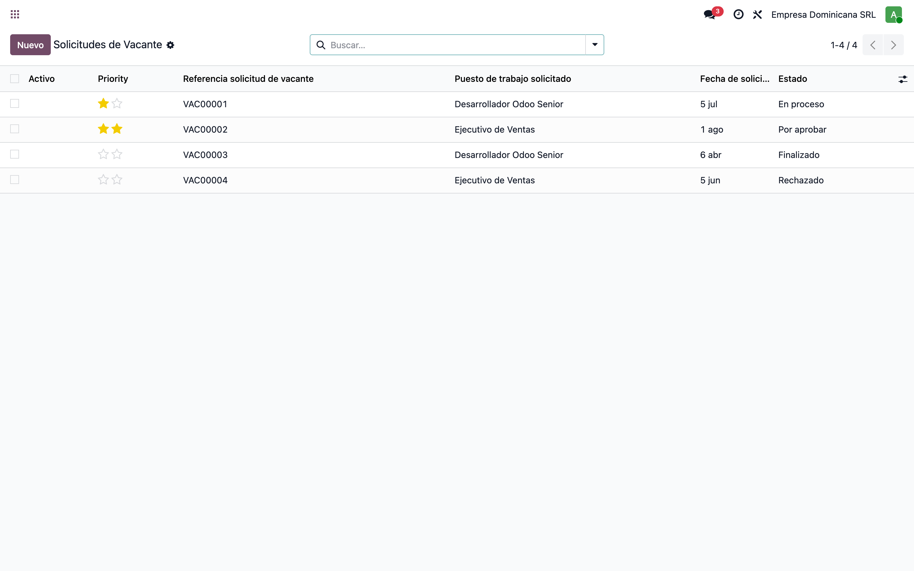

## 2. Flujo 1 — Solicitar la vacante (estado «Por aprobar»)

Toda solicitud **nace en «Por aprobar»**: el `create()` fuerza ese estado sin importar lo que traiga el formulario. El estado **«Nuevo»** existe en la barra pero en la práctica nunca se alcanza al crear. Al guardar, el sistema asigna la **referencia** desde la secuencia `hr.vacancy.application` (prefijo **VAC**, 5 dígitos).

Lo que llena el solicitante:

- **Puesto de trabajo solicitado** — al elegirlo, el sistema **autocompleta** el *Recruitment Responsible* (el reclutador del puesto) y los *Interviewers* (los del puesto). Del puesto también se leen, en solo lectura, el **Departamento** y su **Responsable del departamento**.
- **Solicitante** — por defecto el empleado del usuario conectado; su **Departamento solicitante** se trae solo.
- **Fecha de solicitud** — hoy por defecto.

En este estado el administrador de reclutamiento ve **Aprobar** y **Rechazar**; cualquier usuario con acceso puede **Cancelar**. Las estrellas de arriba a la izquierda son la **prioridad** (Normal / Urgente / Muy urgente) y quedan registradas en el chatter.

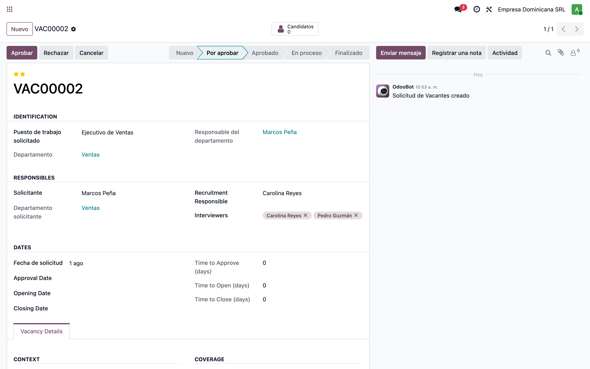

## 3. La pestaña «Vacancy Details»: contexto y cobertura

Debajo de las fechas, la pestaña **Vacancy Details** guarda el porqué de la requisición — la información que normalmente vive en un formulario en papel:

**CONTEXT**

- **Vacancy Type** — *New Position* (plaza nueva), *Replacement* (reemplazo) o *Headcount Expansion* (ampliación de plantilla).
- **Cantidad de recursos** — cuántas personas se necesitan para esa misma requisición.
- **Tipo de Contrato** — *Undefined time* (indefinido), *Some time* (tiempo determinado), *For specific work or service* (obra o servicio) o *Intern* (pasantía).
- **Fecha deseada de contratación** y **Motivo de ingreso**.

**COVERAGE**

- **Coverage Type** — *Internal*, *External* o *Mixed*.
- **Selected Employees** — aparece **solo** si la cobertura es *Internal* o *Mixed*, y es donde se registran los candidatos internos que se van a considerar (promoción o traslado).

En la captura, la requisición de Ventas es *Mixed*: se buscará afuera pero también se está evaluando a un empleado actual.

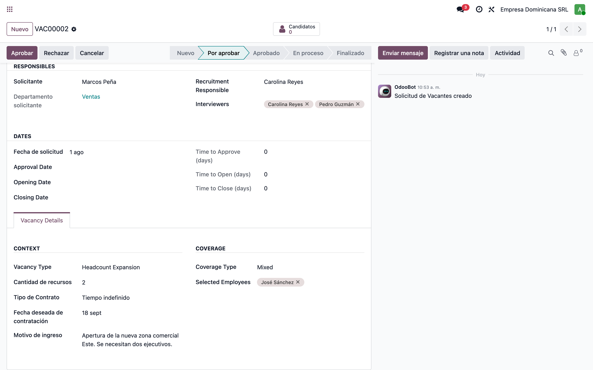

## 4. Flujo 2 — Aprobar y abrir el proceso (estado «En proceso»)

**Aprobar** pasa la requisición a *Aprobado* y **estampa el Approval Date con la fecha de hoy**. Después, **Establecer a En proceso** la pasa a *En proceso* y **estampa el Opening Date**. Las fechas no se digitan: las pone el botón (quedan editables mientras el documento no esté *Finalizado*).

Con eso se llenan solos los tres indicadores de la derecha:

| Indicador | Cómo se calcula |
|---|---|
| **Time to Approve (days)** | Approval Date − Fecha de solicitud |
| **Time to Open (days)** | Opening Date − Approval Date |
| **Time to Close (days)** | Closing Date − Opening Date |

Son campos **almacenados**, así que sirven para filtrar, agrupar y medir el desempeño del proceso de reclutamiento.

Arriba, el botón inteligente **Candidatos** muestra el **contador** de candidatos colgados de esta requisición. Desde *En proceso* los botones disponibles son **Finalizado** (cerrar), **Volver a Aprobado** y **Cancelar**.

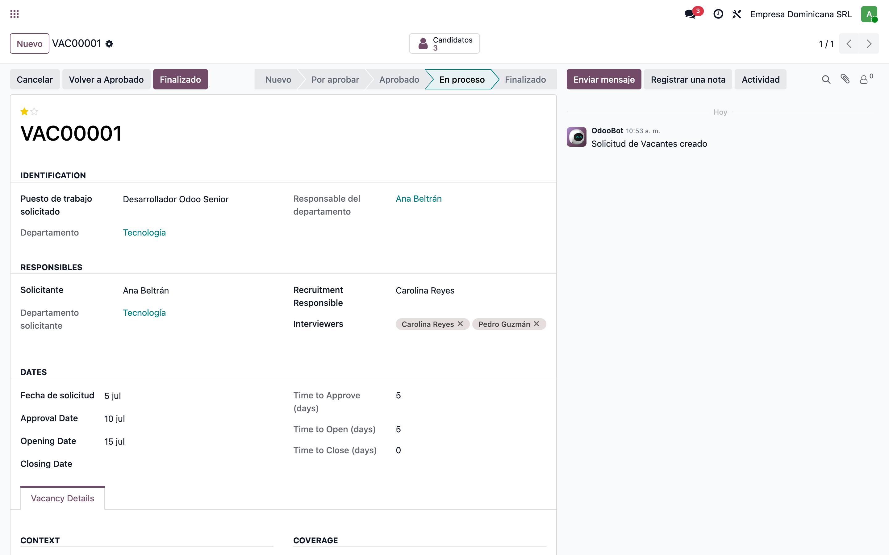

## 5. Flujo 3 — Enganchar los candidatos a la vacante

Un clic en **Candidatos** abre los candidatos de esa requisición, ya filtrados, y con la **solicitud predefinida** para los que se creen desde ahí.

La clave del enganche: en `hr.applicant` el campo **Puesto de trabajo** dejó de escribirse a mano y ahora **se hereda de la solicitud de vacante** (campo relacionado y almacenado). Consecuencias prácticas:

- Si el candidato tiene **Solicitud de Vacantes**, el **Puesto de trabajo** queda en **solo lectura** y es el del documento VAC — en la captura, los tres candidatos heredaron *Desarrollador Odoo Senior*.
- El puesto del candidato **siempre concuerda** con el de la requisición aprobada; no hay forma de desalinearlos.
- Un candidato **sin** solicitud de vacante queda **sin puesto**. Es el efecto de diseño más importante a tener en cuenta: con este módulo instalado, la vía correcta de registrar candidatos es **desde la solicitud de vacante**.

En el buscador de candidatos se agregó el campo/filtro **Solicitud de Vacantes**, para llegar a los candidatos de una requisición desde cualquier vista.

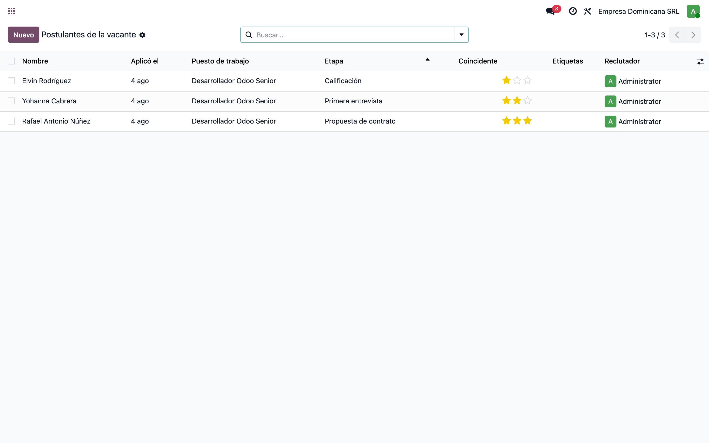

## 6. En la ficha del candidato: pestaña «Detalles»

En la pestaña **Detalles** del candidato, justo debajo del **Departamento**, el módulo agrega el campo **Solicitud de Vacantes**: es el enlace con la requisición.

El **Puesto de trabajo** (arriba, en la cabecera) se ve como enlace en **solo lectura** porque lo manda la solicitud. Para cambiar el puesto de un candidato hay que cambiarle la **solicitud de vacante**, no el puesto.

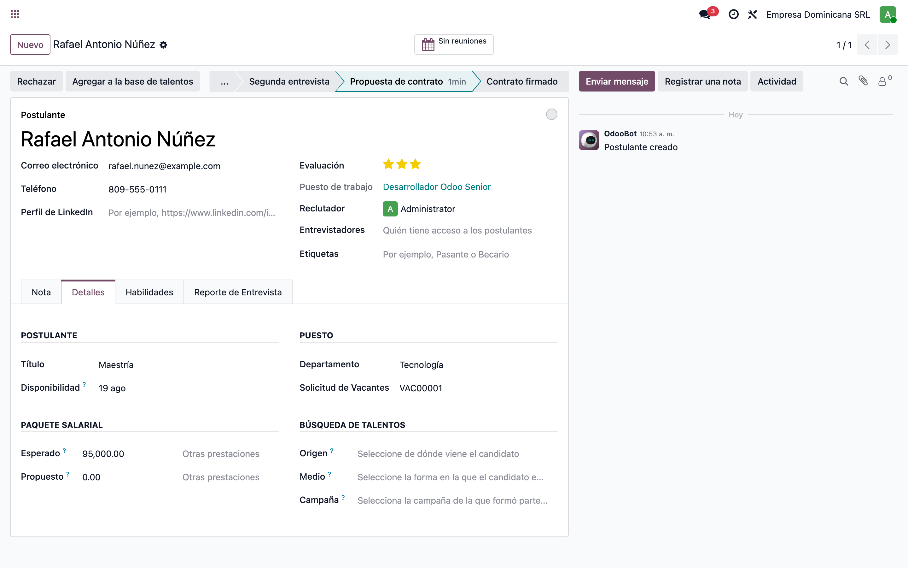

## 7. Flujo 4 — Reporte de Entrevista del candidato

El módulo agrega también la pestaña **Reporte de Entrevista**, con dos campos:

- **Comentarios** — texto libre para la evaluación: resultado de la entrevista técnica, de la de RRHH, verificación de referencias y recomendación final.
- **Referencias** — campo binario para adjuntar el documento de verificación de referencias laborales.

Es el lugar estándar donde el equipo de reclutamiento deja constancia de la evaluación, en la misma ficha del candidato y visible para quien continúe el proceso.

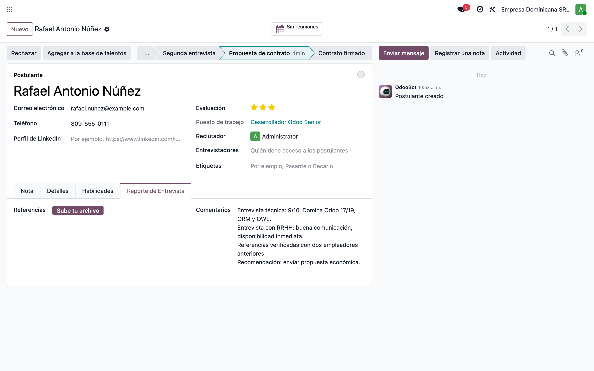

## 8. Flujo 5 — Cerrar la vacante (estado «Finalizado»)

**Finalizado** cierra la requisición y **estampa el Closing Date**, con lo que queda calculado el **Time to Close**. A partir de ahí **todos los campos del documento quedan en solo lectura** (`readonly="state == 'done'"`) y **desaparecen los botones**: la requisición se vuelve un registro histórico.

Esta requisición de ejemplo se cubrió **internamente**: *Coverage Type = Internal* y el candidato interno queda registrado en **Selected Employees**. Es el caso típico de promoción o traslado, donde no hay candidatos externos pero sí hay que dejar el rastro de la requisición y de a quién se le dio la plaza. Nótese que los tres tiempos quedaron completos: 7 días en aprobar, 3 en abrir y 35 en cerrar.

Si hace falta reabrir, **Volver a Por aprobar** está disponible desde *Rechazado* y *Aprobado* — pero **no** desde *Finalizado* ni *Cancelado*.

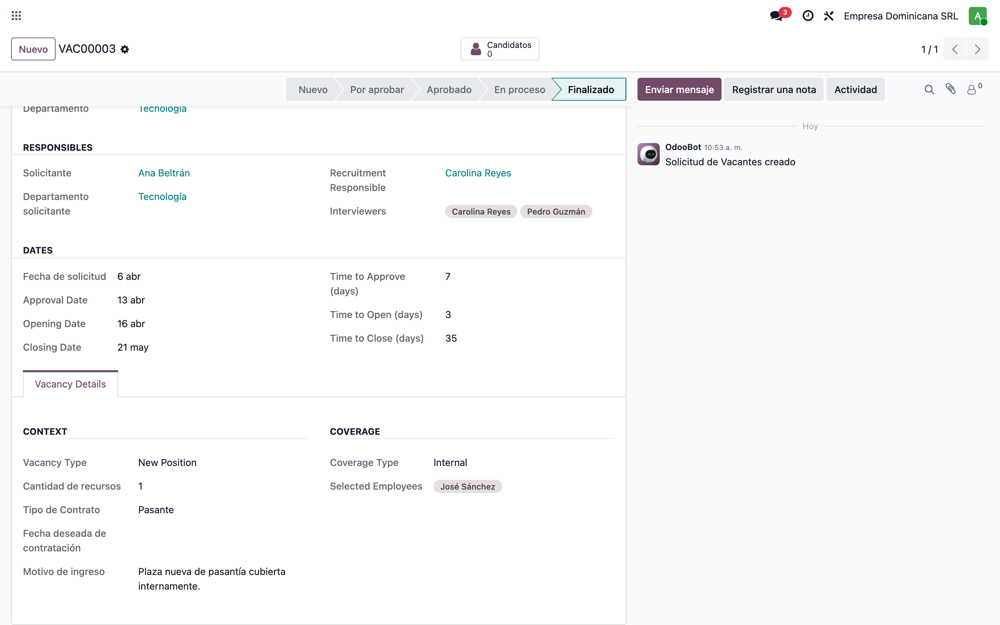

## 9. Seguimiento: agrupar y filtrar las requisiciones

La vista de búsqueda propia del módulo (**Buscar Vacantes**) trae lo necesario para seguir el pipeline de requisiciones:

- **Buscar por**: Vacante (referencia), Puesto de trabajo, Departamento (con `child_of`, o sea incluye los sub-departamentos) y Responsable de reclutamiento.
- **Filtros**: Archivado, más los filtros de actividades (vencidas, hoy, futuras).
- **Agrupar por**: Puesto, **Estado**, Responsable de reclutamiento, Tipo de cobertura y Fecha de creación.

Agrupado por **Estado** se lee de un golpe cuántas requisiciones esperan aprobación, cuántas están abiertas y cuántas ya cerraron.

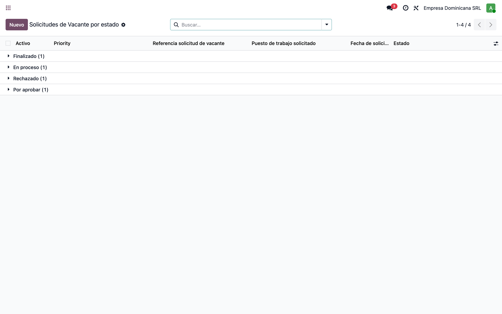

## 10. En el Puesto de trabajo: contador de Vacantes y Grados Académicos

En la ficha del **Puesto de trabajo** el módulo agrega:

- El botón inteligente **Vacantes** con el número de requisiciones levantadas para ese puesto (en la captura, 2). Un clic abre esa lista.
- El campo **Grados Académicos** (`hr.recruitment.degree`, etiquetas múltiples) en la pestaña **Formación y Experiencia**, junto a los *Campos de estudio* que aporta `l10n_do_hr`. Sirve para declarar el nivel académico que exige el puesto.

También se renombró el contador nativo de Odoo a **Aplicaciones de Trabajo**, para que no se confunda con el contador de **Vacantes** que agrega el módulo.

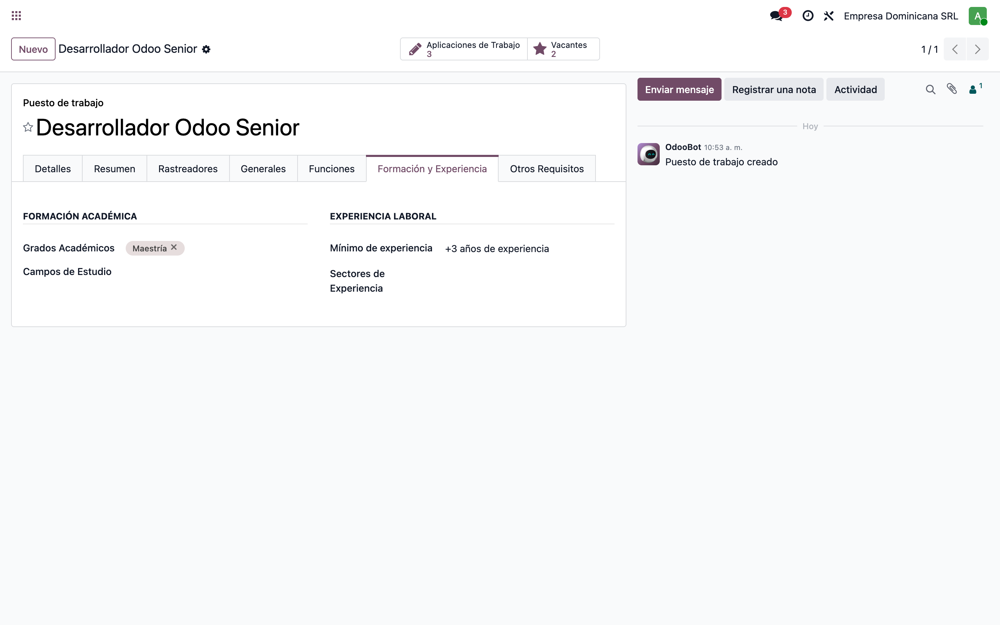

## 11. En la ficha del Empleado: Grados Académicos

La misma tabla de grados se usa en la ficha del empleado: el campo **Grados Académicos** (`l10n_do_recruitment_degree_id`) aparece en la pestaña **Personal**, dentro de *Educación*, antes del *Campo de estudio* de `l10n_do_hr` (y reemplazando en la práctica al *Nivel de certificación* nativo, que `l10n_do_hr` oculta).

Está restringido al grupo **Empleados / Usuario** (`hr.group_hr_user`) y **no permite crear al vuelo**: el grado debe existir en el catálogo.

El catálogo se administra en **Empleados → Configuración → Formación académica → Grados Académicos**, menú que agrega este módulo apuntando a la acción nativa de `hr_recruitment`.

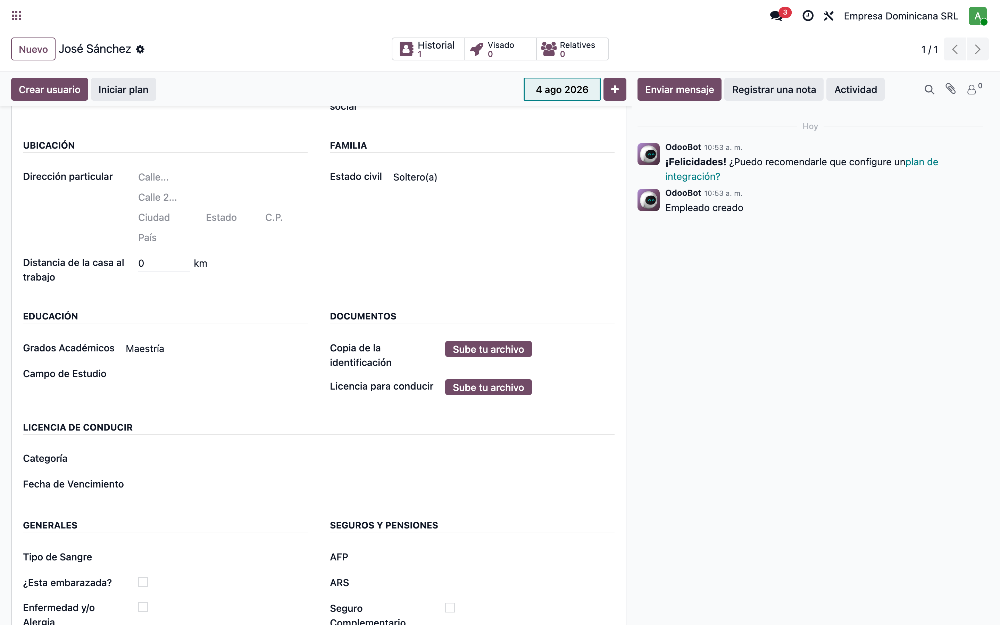

## 12. Resumen del flujo de estados

| Estado | Cómo se llega | Botones disponibles | Efecto |
|---|---|---|---|
| **Nuevo** | Valor `default` del campo, pero el `create()` lo sobrescribe: en la práctica no se usa | — | — |
| **Por aprobar** | Al **guardar** la solicitud (siempre), o con *Volver a Por aprobar* desde Rechazado / Aprobado | Aprobar★, Rechazar★, Cancelar | La requisición espera decisión |
| **Aprobado** | Botón **Aprobar**★ | Establecer a En proceso, Volver a Por aprobar, Cancelar | Estampa **Approval Date = hoy** |
| **En proceso** | Botón **Establecer a En proceso** | Finalizado, Volver a Aprobado, Cancelar | Estampa **Opening Date = hoy**; se registran los candidatos |
| **Finalizado** | Botón **Finalizado** | — (documento cerrado) | Estampa **Closing Date = hoy** y deja todo en **solo lectura** |
| **Rechazado** | Botón **Rechazar**★ | Volver a Por aprobar | No estampa fecha |
| **Cancelado** | Botón **Cancelar** (desde Por aprobar / Aprobado / En proceso) | — (sin retorno) | No estampa fecha |

★ = solo para **Reclutamiento / Administrador** (`hr_recruitment.group_hr_recruitment_manager`).

Los cambios de estado y de prioridad se registran en el **chatter** (`tracking`), así que la requisición lleva su propia bitácora de quién aprobó y cuándo.

## 13. Permisos y visibilidad

| Grupo | Puede |
|---|---|
| **Reclutamiento / Usuario** (`group_hr_recruitment_user`) | Leer, crear, editar y borrar solicitudes — pero **solo las propias**: la regla de registro *«Access own vacancies only»* limita el acceso a las solicitudes donde él es el **Solicitante** (más las que no tienen solicitante asignado) |
| **Reclutamiento / Administrador** (`group_hr_recruitment_manager`) | **Todas** las solicitudes (regla *«Access all vacancies»*), y es el único que ve **Aprobar** y **Rechazar** |

Efecto práctico: un supervisor de área ve **su** requisición y su avance, pero no las de otras áreas. Recursos Humanos ve todo y es quien decide.

Las requisiciones son **por compañía** (`company_id`, requerido) y cada compañía nueva recibe automáticamente su propia secuencia **VAC** al crearse.

## Notas

### Modelo y campos que agrega el módulo

**Nuevo modelo `l10n.do.hr.vacancy.application`** (Solicitud de Vacantes), con chatter y actividades:

| Bloque | Campos |
|---|---|
| Cabecera | `name` (referencia VAC, secuencia), `priority` (Normal / Urgente / Muy urgente), `state`, `company_id`, `active` |
| Identificación | `job_id` (Puesto de trabajo solicitado), `job_department_id` y `job_department_manager_id` (relacionados del puesto) |
| Responsables | `requesting_employee_id` (Solicitante), `requesting_employee_department_id` (relacionado), `recruiter_id`, `interviewer_ids` |
| Fechas | `date_request`, `date_approval`, `date_open`, `date_close` |
| Tiempos (calculados y almacenados) | `time_to_approve`, `time_to_open`, `time_to_close` |
| Contexto | `vacancy_type`, `resources_qty`, `contract_type`, `desired_hire_date`, `reason` |
| Cobertura | `coverage_type`, `selected_employee_ids` |
| Contador | `vacancy_applicants_count` |

**Campos agregados a modelos existentes:**

| Modelo | Campo | Nota |
|---|---|---|
| `hr.applicant` | `l10n_do_vacancy_application_id` | Solicitud de vacante del candidato |
| `hr.applicant` | `l10n_do_comments`, `l10n_do_references` | Pestaña *Reporte de Entrevista* |
| `hr.applicant` | `job_id` | **Redefinido**: pasa a ser *relacionado y almacenado* de `l10n_do_vacancy_application_id.job_id` |
| `hr.job` | `l10n_do_vacancy_application_count` | Botón inteligente *Vacantes* |
| `hr.job` | `l10n_do_recruitment_degree_ids` | Grados académicos requeridos |
| `hr.employee` | `l10n_do_recruitment_degree_id` | Grado académico del empleado (`groups="hr.group_hr_user"`) |
| `res.company` | — | `create()` genera la secuencia **VAC** de la compañía nueva |

### Cosas a tener en cuenta (comportamiento real del código)

1. **El estado inicial siempre es «Por aprobar»**. El `create()` escribe `state = "to_be_approved"` pisando cualquier valor recibido, así que el estado *Nuevo* del selector nunca se alcanza al crear. No existe un borrador que no dispare la aprobación.
2. **Las fechas de aprobación / apertura / cierre las estampan los botones**, siempre con la fecha de **hoy**. Para cargar un histórico con fechas reales hay que editarlas a mano después (posible mientras el estado no sea *Finalizado*).
3. **Un candidato sin solicitud de vacante queda sin puesto de trabajo**, porque `job_id` es relacionado de la vacante. Si la empresa usa este módulo, registrar candidatos por fuera de una requisición deja registros incompletos para cualquier reporte por puesto.
4. **`interviewer_ids` de la solicitud son empleados** (`hr.employee`), mientras que los del puesto son **usuarios** (`res.users`). El *onchange* del puesto traduce usuario → empleado; un entrevistador sin empleado ligado no se copia.
5. **La regla del usuario compara contra `user.employee_id`**: un usuario de reclutamiento sin empleado ligado solo verá las solicitudes sin solicitante asignado.
6. **Traducción es_DO incompleta.** El `i18n/es_DO.po` viene de la versión anterior del módulo y no cubre los campos y grupos nuevos. En las capturas se ve en inglés: *Recruitment Responsible*, *Interviewers*, *Approval Date*, *Opening Date*, *Closing Date*, *Time to Approve / Open / Close (days)*, *Vacancy Type* (y sus opciones *New Position* / *Replacement* / *Headcount Expansion*), *Coverage Type* (*Internal* / *External* / *Mixed*), *Selected Employees*, *Priority*, y los títulos de grupo *IDENTIFICATION*, *RESPONSIBLES*, *DATES*, *Vacancy Details*, *CONTEXT*, *COVERAGE*.
7. **Columna «Activo» visible en el listado.** La vista lista declara `<field name="active" invisible="1"/>`; en Odoo 19 eso oculta las celdas pero **no** el encabezado, así que queda una columna *Activo* vacía. Lo correcto en v19 es `column_invisible="1"`.
8. **`create()` usa el contexto `force_company`**, que Odoo 19 ya no soporta: al crear una requisición se registra un `DeprecationWarning` («Since 19.0, context key 'force_company' is no longer supported. Use with_company(company) instead»). No rompe nada — la secuencia se asigna igual — pero conviene migrarlo a `with_company()`.
9. **`hr.job._compute_l10n_do_vacancy_application_count` usa el `read_group` viejo** (API deprecada en v19). Funciona por la capa de compatibilidad; la forma nueva es `_read_group(domain, groupby, aggregates)`.

### Reproducir este manual

```bash
cd tools/manual-generator
./generate-manual.sh --module=l10n_do_hr_recruitment
```

El seed (`configs/l10n_do_hr_recruitment.seed.py`) arma, sobre una base limpia: compañía RD en español, tres departamentos con gerentes, cinco empleados, dos puestos con grados académicos, **cuatro solicitudes de vacante** (una por estado: en proceso, por aprobar, finalizada, rechazada) y **tres candidatos** colgados de la requisición en proceso, uno con el reporte de entrevista lleno.

`--keep-db` conserva la base `test_v19_l10n_do_hr_recruitment` para seguir explorando; `--headed` muestra el navegador durante las capturas.
