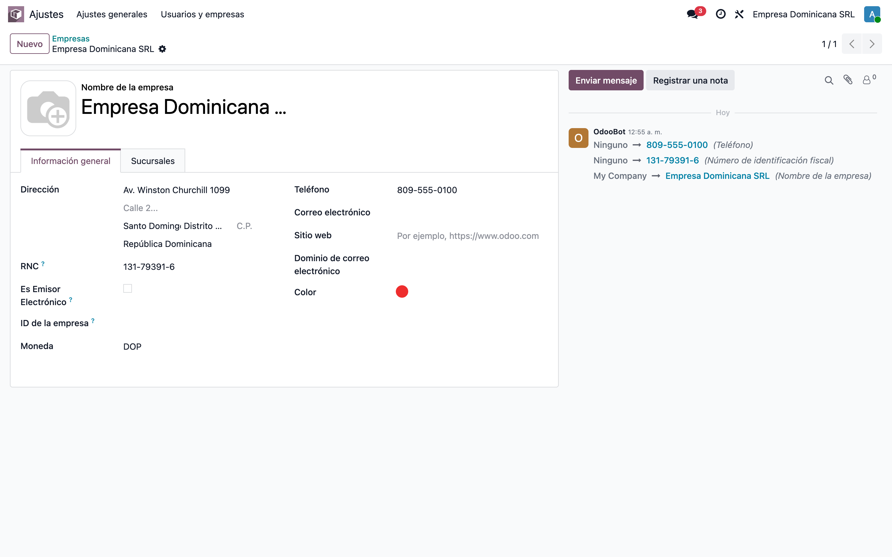
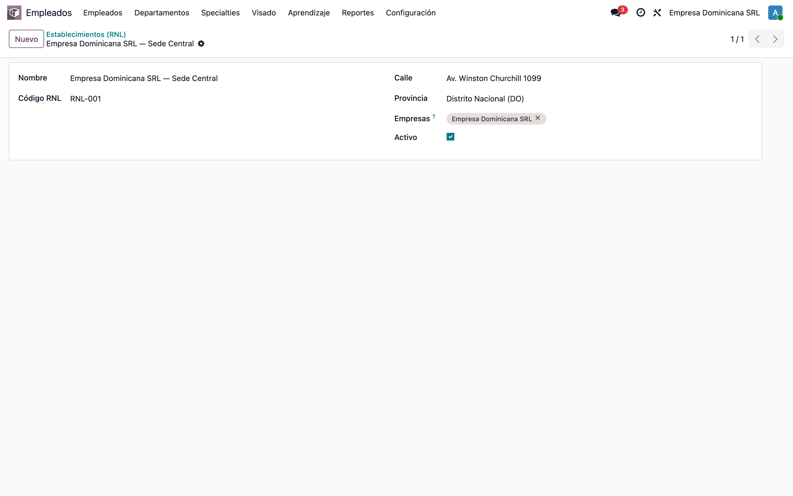
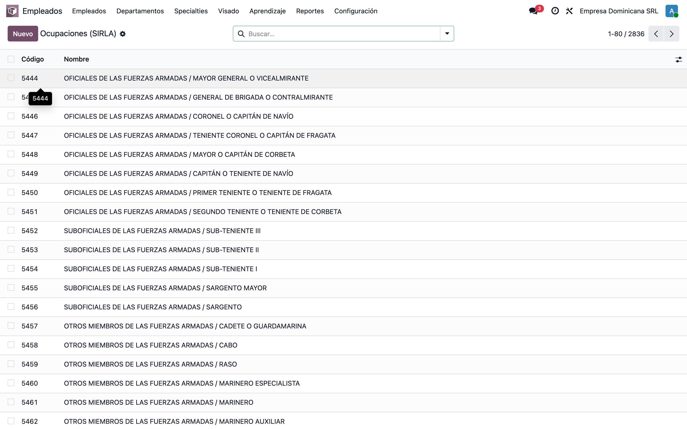
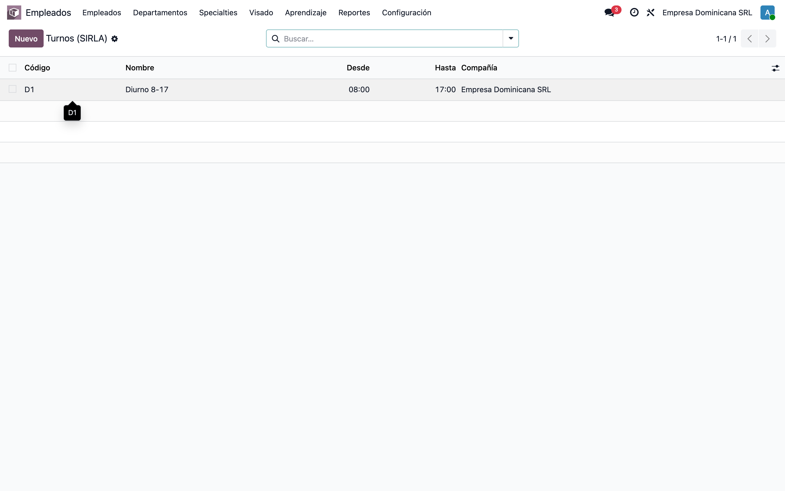
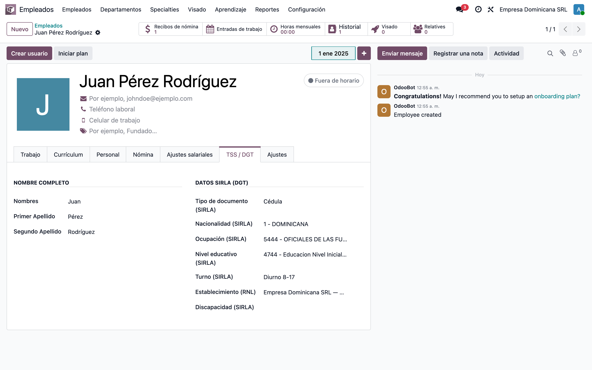
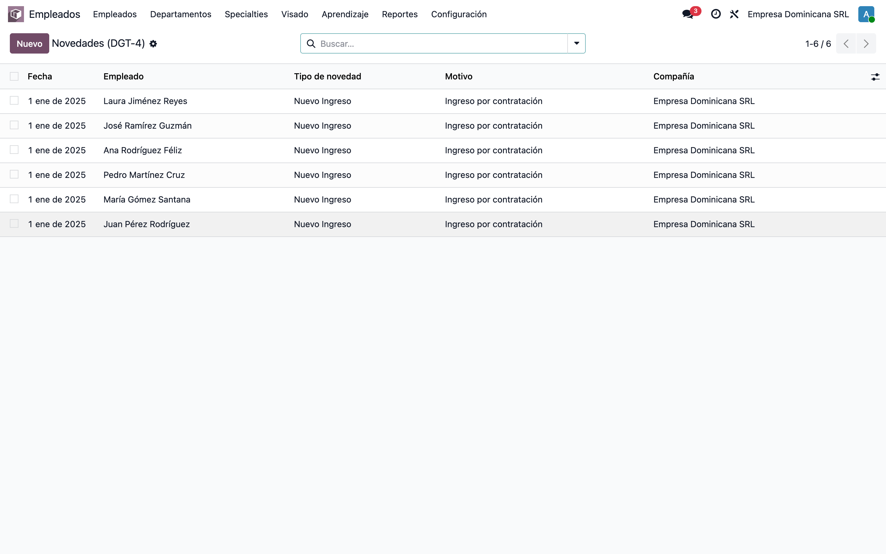
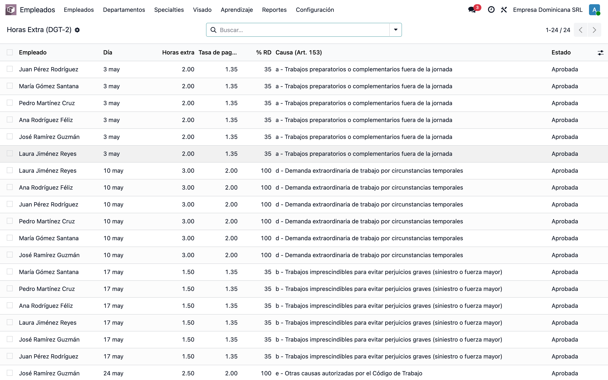
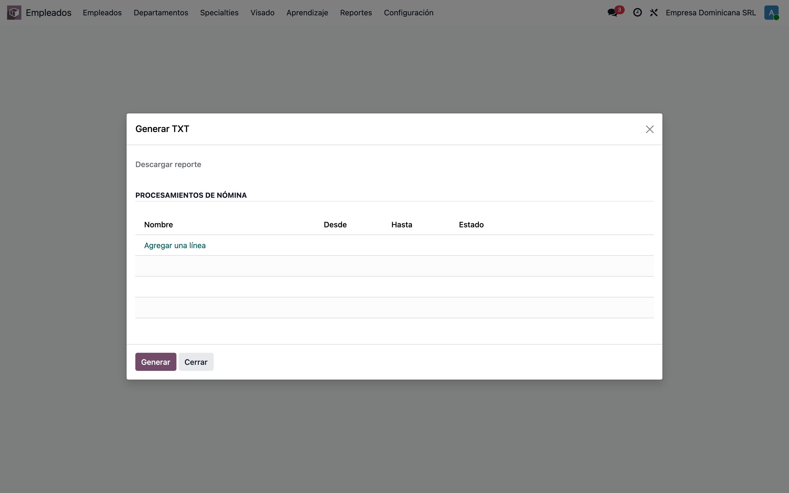
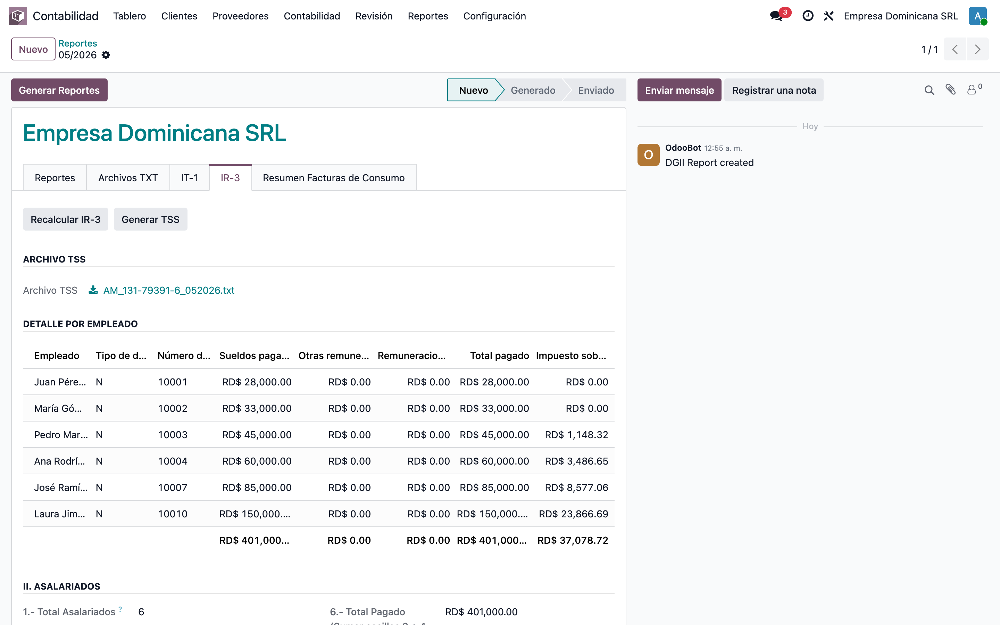

# Reportes laborales y fiscales RD — DGT-2 / DGT-3 / DGT-4 / IR-3 + archivo TSS

> 📘 Manual **funcional** para **funcionales** y **ventas**.
> Explica para qué sirven los módulos, cómo se relacionan y qué significa cada
> campo u opción que agregan, con el contexto de los reportes de la **DGII** y el
> **Ministerio de Trabajo (SIRLA)**.

---

## 1. ¿Qué resuelven estos módulos?

En República Dominicana la nómina alimenta varios reportes obligatorios:

| Reporte | Entidad | Qué declara | ¿Se genera en Odoo? |
|---|---|---|---|
| **DGT-2** | Min. Trabajo (SIRLA) | Horas extra / extensión de jornada | ❌ Externo (Odoo solo guarda los datos) |
| **DGT-3** | Min. Trabajo (SIRLA) | Planilla de personal fijo | ❌ Externo (Odoo solo guarda los datos) |
| **DGT-4** | Min. Trabajo (SIRLA) | Movimientos de personal (altas, salidas, cambios) | ❌ Externo (Odoo solo guarda los datos) |
| **IR-3** | DGII | Retenciones del ISR a asalariados | ✅ Se computa dentro del reporte DGII |
| **TSS** (Autodeterminación) | TSS | Salarios cotizables del período | ✅ Genera el archivo TXT |

La idea central: **un solo lugar guarda los datos y el cálculo** que todos estos
reportes necesitan, para que los números siempre cuadren entre sí.

---

## 2. Los tres módulos y cómo se relacionan

| Módulo | Rol funcional |
|---|---|
| **`l10n_do_hr_report_base`** | 🧱 *Centro de datos*. Agrega al empleado los datos SIRLA, mantiene los catálogos oficiales, los establecimientos (RNL), los movimientos de personal y las horas extra, y guarda el cálculo común (salario cotizable, ISR…). |
| **`dgii_ir3_report`** | 🧾 Añade la pestaña **IR-3** dentro del reporte DGII del período y el **archivo TSS**. |
| **`tss_report`** | 📄 Asistente que produce el **archivo TXT de la TSS** (Autodeterminación). |

```
Nómina (l10n_do_hr_payroll)
        │  (salarios, ISR, horas extra)
        ▼
l10n_do_hr_report_base   ← datos SIRLA del empleado · catálogos · establecimientos · movimientos · cálculo común
        ├──────────────► dgii_ir3_report   → IR-3 + archivo TSS dentro de la declaración DGII del período
        └──────────────► tss_report        → archivo TXT de la TSS (Autodeterminación)
```

> 🔑 **Un único reporte DGII por período** (`MM/AAAA`). Lo crea quien llegue
> primero (al generar la TSS o al abrir DGII) y el otro lo reutiliza. Nunca se
> duplica, y como IR-3 y TSS usan el **mismo cálculo**, los montos cuadran.

---

## 3. Configuración inicial

### 3.1 Empresa: RNC

**Ajustes → Empresas** → abrir la compañía y completar el **RNC** (solo dígitos).
Es obligatorio: encabeza el archivo de la TSS y el reporte DGII.



### 3.2 Establecimientos (RNL)

**Empleados → Configuración → SIRLA / DGT Reports → Establecimientos (RNL)**.

El establecimiento es el **Registro Nacional de Local (RNL)** del Ministerio de
Trabajo. Ya **no se vincula a la empresa**: es un registro independiente que se
asigna **directamente en cada empleado**, y es **multicompañía**.



| Campo | Para qué sirve |
|---|---|
| **Nombre** | Nombre del local/establecimiento. |
| **Código RNL** | Código del Registro Nacional de Local. Es único. |
| **Calle** / **Provincia** | Dirección del establecimiento. |
| **Empresas** | 🏢 Compañías que pueden usar este establecimiento. Al crearlo viene **la compañía actual** por defecto; se pueden agregar **varias** (multicompañía) o **dejarlo vacío** para que esté disponible en **todas**. |
| **Activo** | Permite archivarlo sin borrarlo. |

> 💡 El selector de establecimiento en el empleado solo muestra los
> establecimientos de **su** compañía (o los compartidos con todas).

### 3.3 Catálogos SIRLA

**Empleados → Configuración → SIRLA / DGT Reports**. Vienen **precargados** con
los códigos oficiales del Ministerio de Trabajo y son **catálogos nacionales
compartidos** entre compañías. Cada uno tiene **código** + **descripción**.



| Catálogo | Uso |
|---|---|
| **Ocupaciones** | Ocupación SIRLA del empleado (DGT-2/3/4). |
| **Nacionalidades** | Nacionalidad SIRLA del empleado. |
| **Niveles educativos** | Nivel/grado educativo SIRLA. |
| **Discapacidades** | Discapacidad(es) SIRLA. |
| **Causas de horas extra (Art. 153)** | Motivo de extensión de jornada para el DGT-2. |

> 💡 Si se crea un catálogo "al vuelo" desde el campo del empleado, ahora se
> guarda con un **código autogenerado** (antes el código obligatorio impedía
> guardarlo).

### 3.4 Turnos de trabajo

**Empleados → Configuración → SIRLA / DGT Reports → Turnos**. Define el turno
SIRLA del empleado.



| Campo | Para qué sirve |
|---|---|
| **Código** / **Nombre** | Identifican el turno. |
| **Hora desde** / **Hora hasta** | Franja horaria del turno. |
| **Empresa** | Compañía a la que pertenece el turno. |

---

## 4. Datos del empleado (pestaña TSS / DGT)

En la ficha del empleado, la pestaña **TSS / DGT** concentra todo lo que piden
los reportes. El **nombre completo desglosado** se usa en DGT, IR-3 y TSS; los
**datos SIRLA** alimentan los DGT-2/3/4.



| Campo | Para qué sirve | Reporte |
|---|---|---|
| **Nombres** | Nombre de pila | DGT · IR-3 · TSS |
| **Primer Apellido** | Primer apellido | DGT · IR-3 · TSS |
| **Segundo Apellido** | Segundo apellido | DGT · IR-3 · TSS |
| **Tipo de documento (SIRLA)** | Cédula / Pasaporte / Carnet de extranjería | DGT-2/3/4 |
| **Nacionalidad (SIRLA)** | Del catálogo de nacionalidades | DGT-2/3/4 |
| **Ocupación (SIRLA)** | Del catálogo de ocupaciones | DGT-2/3/4 |
| **Nivel educativo (SIRLA)** | Del catálogo de niveles | DGT-2/3/4 |
| **Turno (SIRLA)** | Del catálogo de turnos | DGT-2/3/4 |
| **Establecimiento (RNL)** | Local donde labora (RNL) | DGT-2/3/4 |
| **Discapacidad (SIRLA)** | Una o varias discapacidades | DGT-2/3/4 |

> 📌 Los datos personales de respaldo (género, fecha de nacimiento y número de
> documento) viven en la pestaña **Información privada** del empleado y también
> los usa la TSS.

---

## 5. DGT-4 — Movimientos de personal

Registra los eventos que exige el DGT-4: **altas** (ingreso), **salidas** y
**cambios**. ⚠️ El DGT-4 se **genera de forma externa**; el módulo **solo
guarda** estos datos (por eso no tiene un menú propio en el día a día).



La lista (**Novedades / DGT-4**) muestra **Fecha**, **Empleado**, **Tipo de
novedad**, **Motivo** y **Compañía**.

| Campo | Para qué sirve |
|---|---|
| **Empleado** | Empleado afectado. |
| **Tipo de novedad** | **NI** = Nuevo Ingreso · **NS** = Salida · **NC** = Cambio. |
| **Fecha** | Fecha del evento. |
| **Motivo** / **Notas** | Detalle del movimiento. |

---

## 6. DGT-2 — Horas extra

Las horas extra (extensión de jornada) salen de la asistencia nativa de Odoo. El
módulo agrega a cada línea la **causa (Art. 153)** y el **% de recargo** dominicano.
⚠️ El DGT-2 también se **genera de forma externa**; aquí solo se **revisan/guardan** los datos.



La lista (**Horas Extra / DGT-2**) muestra **Empleado**, **Día**, **Horas extra**,
**Tasa de pago**, **% RD**, **Causa (Art. 153)** y **Estado**.

| Campo | Para qué sirve |
|---|---|
| **Empleado** / **Día** | A quién y cuándo. |
| **Horas extra** | Cantidad de horas. |
| **Tasa de pago** / **% RD** | Recargo dominicano: **35 %** o **100 %** según la ley. |
| **Causa (Art. 153)** | Motivo de extensión de jornada. |
| **Estado** | Estado de la hora extra (ej. Aprobada). |

---

## 7. Generar el archivo TSS (Autodeterminación)

Hay **dos caminos** que producen **el mismo archivo** (`AM_<RNC>_<MMAAAA>.txt`):

**Camino A — Asistente TSS.** **Nómina → TSS → Autodeterminación** → *Agregar una
línea* y elegir el/los **lotes de nómina** del mismo mes → **Generar** → descargar
el TXT.



**Camino B — Desde el reporte DGII** (botón **Generar TSS**, ver siguiente sección).

> ✅ Antes de generar, la nómina del período debe estar **calculada y validada**.
> Si falta un dato obligatorio (ej. la clave de nómina), el sistema avisa en
> español indicando el empleado y el dato faltante.

---

## 8. IR-3 — Declaración de retenciones a asalariados (DGII)

**Contabilidad → DGII** → abrir/crear la declaración del período → pestaña
**IR-3**. La pestaña reproduce el formulario oficial del IR-3 y se calcula
**automáticamente** desde la nómina validada del mes. Todos los valores son de
**solo lectura** (no se editan a mano).



**Botones**
- **Recalcular IR-3** — recalcula desde las nóminas validadas del período.
- **Generar TSS** — produce el archivo TSS de ese mismo mes (queda en **Archivo TSS**).

**Sección II. Asalariados** (cada casilla del formulario IR-3):

| Casilla | Significado |
|---|---|
| **1 · Total Asalariados** | Cantidad de asalariados del período. |
| **2 · Asalariados Sujetos a Retención** | Cuántos tuvieron ISR retenido. |
| **3 · Sueldos Pagados por el Agente** | Sueldos pagados por la empresa (salario sujeto a ISR). |
| **4 · Otras Remuneraciones** | Otras remuneraciones gravables. |
| **5 · Remuneraciones de Otros Agentes** | Pagadas por otros agentes de retención. |
| **6 · Total Pagado** | Suma de 3 + 4 + 5. |
| **7 · Pago Total Sujeto a Retención** | Total pagado a los asalariados con retención. |
| **8 · Impuesto sobre la Renta** | Total del ISR retenido. |
| **9 · Saldo Compensado Autorizado** | Saldo autorizado por la DGII (se resta de la casilla 8). |
| **10 · Saldo por Compensar** | Saldo a favor del período. |

**Sección III. Liquidación**

| Casilla | Significado |
|---|---|
| **11 · Impuesto a Pagar** | Casilla 8 − 9 cuando es positivo. |

**Detalle por empleado** — una línea por asalariado con su documento, sueldos
pagados, otras remuneraciones, total pagado, ISR retenido, saldo por compensar y
si está sujeto a retención. Es el respaldo de los totales de arriba.

> 🔗 Como el IR-3 y la TSS comparten el mismo cálculo, los montos del IR-3 y del
> archivo TSS del mismo período **siempre cuadran**.

---

## 9. Flujo completo (resumen)

```
1. Empresa con RNC
2. Establecimientos (RNL) + Catálogos SIRLA + Turnos     (configuración)
3. Empleado → pestaña TSS / DGT (nombre + datos SIRLA + establecimiento)
4. Movimientos DGT-4  ·  Horas extra DGT-2                (datos para reportes externos)
5. Nómina del período: Calcular + Validar
6. Archivo TSS (asistente o botón en la declaración DGII)
7. IR-3 dentro de la declaración DGII del período
```

### Datos obligatorios antes de generar

| Dato | Dónde |
|---|---|
| RNC de la compañía | Empresa |
| Género, fecha de nacimiento, documento | Empleado → Información privada |
| Nombres y apellidos + datos SIRLA | Empleado → pestaña TSS / DGT |
| Nómina del período **calculada y validada** | Nómina → Lotes |

---
