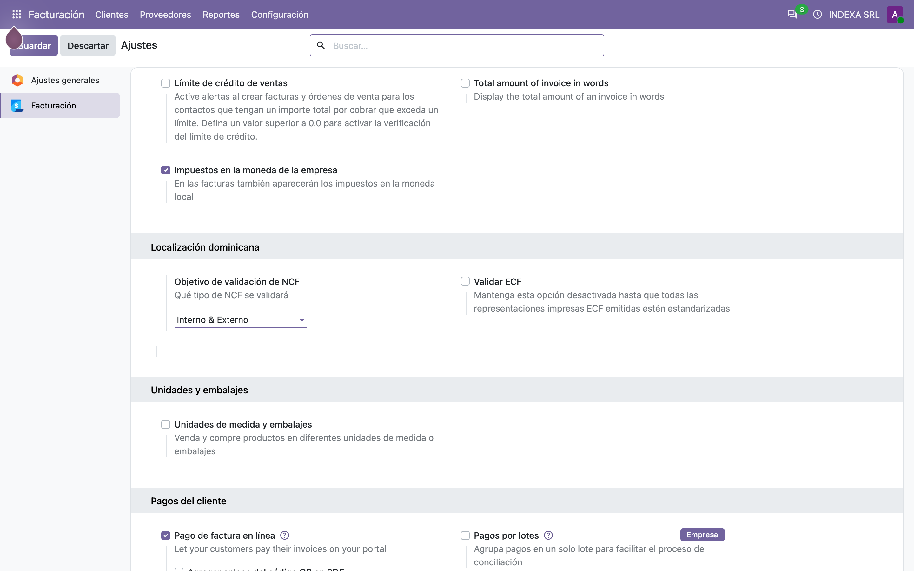
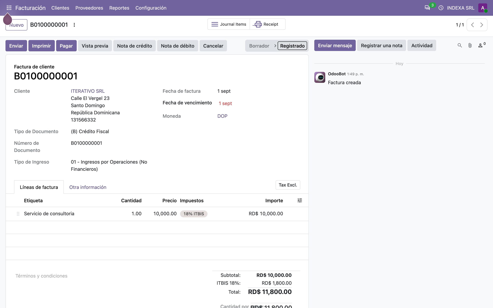
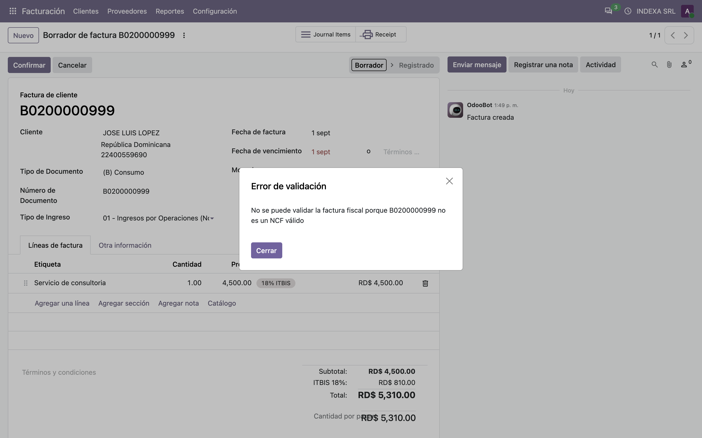
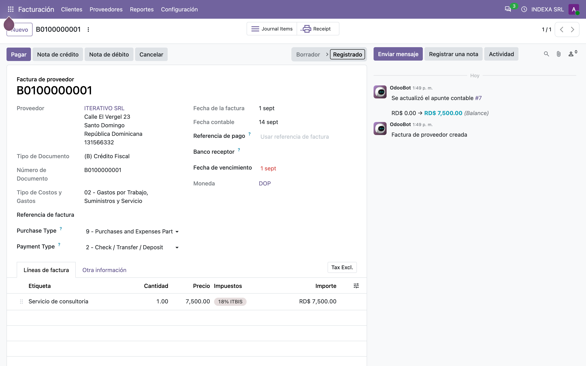
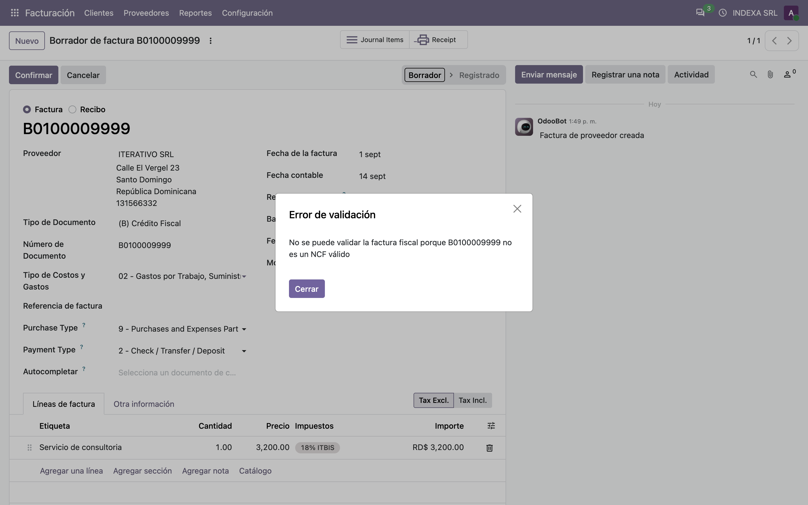
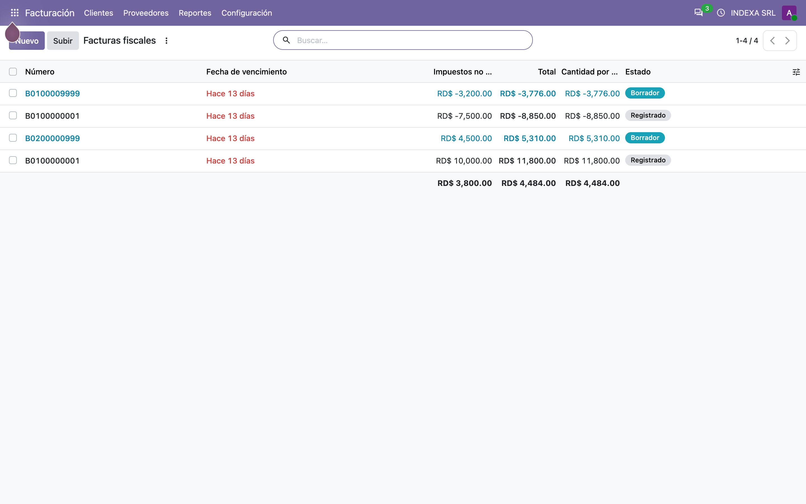

# Validación de NCF contra la DGII — Manual de usuario (l10n_do_ncf_validation)

> Manual generado con `tools/manual-generator`. Las capturas se regeneran ejecutando el generador contra una base `test_v20_<módulo>`.

Este módulo hace una sola cosa, y la hace en el momento exacto en que importa: **antes de dejar publicar una factura fiscal, le pregunta a la DGII si ese NCF existe**.

Odoo, por sí solo, no sabe nada de la DGII. `l10n_do_accounting` administra las secuencias de NCF y valida el *formato* (largo, prefijo, tipo de documento), pero un NCF puede tener el formato perfecto y aun así no estar registrado — o estar vencido, o pertenecer a otro contribuyente. Eso solo lo sabe la DGII.

Qué aporta, en concreto:

- Un enganche en **`action_post`**: al confirmar una factura fiscal, el módulo consulta el servicio público de la DGII (`dgii.gov.do`) con la librería **`python-stdnum`** y **bloquea la publicación** si el NCF no es reconocido.
- Un interruptor por compañía, **Objetivo de validación de NCF**, para decidir *qué* se valida: los NCF que genera la propia empresa, los que vienen de un proveedor, ambos, o ninguno.
- Un segundo interruptor, **Validar ECF**, que extiende la consulta a comprobantes electrónicos (e-CF) enviando además el **código de seguridad** de 6 caracteres y el RNC del comprador.

No reemplaza nada: se monta encima de `l10n_do_accounting` y solo actúa en el `action_post` de facturas de compañías dominicanas con documentos fiscales habilitados.

## Requisitos previos

- Módulo **`l10n_do_ncf_validation`** instalado (v `19.5.1.0.1`, línea 20.0 / `master`). Odoo `master` se autodeclara `19.5`, por eso el prefijo de versión.
- Dependencia: **`l10n_do_accounting`** (v `19.5.3.0.0`), que a su vez trae `l10n_do` y `l10n_latam_invoice_document`.
- Dependencia externa de Python: **`python-stdnum`** (se importa como `stdnum`). La imagen de Odoo 20 trae la versión 1.19.
- **Salida a Internet desde el servidor de Odoo.** La consulta va a `https://dgii.gov.do/app/WebApps/ConsultasWeb2/...`. Sin salida, toda publicación de factura fiscal falla con *«No se pudo establecer comunicación con el servicio de la DGII»*.
- La compañía debe tener **RNC** (`vat`) y país **República Dominicana**, y el diario debe tener **documentos fiscales** (`l10n_latam_use_documents`) activados.

## 1. Dónde se configura: Contabilidad → Configuración → Ajustes

El módulo agrega dos opciones al bloque **Localización Dominicana** de los ajustes de Contabilidad, justo encima de la sección que ya trae `l10n_do_accounting`:

- **Objetivo de validación de NCF** (`ncf_validation_target`) — decide qué facturas se consultan contra la DGII.
- **Validar ECF** (`validate_ecf`) — activa la validación de comprobantes electrónicos, que además del NCF envía el **código de seguridad** y el **RNC del comprador**.

Ambos campos viven en **`res.company`**, o sea que la configuración es **por compañía**: en un grupo multicompañía cada una decide su propia política.

El valor por defecto de *Objetivo de validación* es **Externo**. Es el ajuste conservador: al instalar el módulo se empiezan a validar las facturas de proveedor (donde el NCF lo digitó una persona) y se dejan pasar las propias, cuyo NCF lo generó la secuencia de Odoo.



## 2. Las cuatro políticas de validación

El campo **Objetivo de validación de NCF** cruza una sola pregunta: *¿quién generó este NCF?* Odoo ya lo sabe, en el campo `l10n_latam_manual_document_number`: es **verdadero** cuando el número lo digitó un usuario (facturas de proveedor) y **falso** cuando lo puso la secuencia de la compañía (facturas de cliente).

| Opción | Valor | Qué se consulta a la DGII | Caso de uso |
|---|---|---|---|
| **Ninguno** | `none` | Nada. El módulo no interviene. | Apagar la validación sin desinstalar el módulo, o cuando el servidor no tiene salida a Internet. |
| **Externo** *(por defecto)* | `external` | Solo los NCF **digitados** — facturas y notas de crédito de proveedor. | El caso típico: verificar que el comprobante que me entregó el suplidor existe de verdad. |
| **Interno** | `internal` | Solo los NCF que **generó la compañía** — facturas de cliente. | Verificar que la secuencia configurada en Odoo coincide con lo que la DGII tiene autorizado. |
| **Interno & Externo** | `both` | Todo comprobante fiscal, venga de donde venga. | Cierre fiscal estricto. Cuesta una consulta HTTP por factura publicada. |

La base de ejemplo de este manual está en **Interno & Externo**, para poder mostrar los dos caminos.

Un detalle que conviene tener presente: la validación corre **después** de que `super().action_post()` publicó la factura. Cuando el NCF no pasa, la excepción revierte la transacción completa y la factura se queda en borrador — pero eso depende del *rollback*, no de un chequeo previo.

## 3. Flujo 1 — Factura de cliente con NCF válido (validación «interna»)

Esta factura se publicó con el objetivo en **Interno & Externo**, o sea que la validación **corrió de verdad**: al confirmar, Odoo consultó `dgii.gov.do` con el RNC de la compañía (**131793916**, INDEXA SRL) y el NCF **B0100000001**, la DGII lo reconoció, y la publicación siguió su curso.

Lo que el módulo envía en este caso:

| Dato | De dónde sale |
|---|---|
| RNC emisor | `company_id.vat` — porque es una factura de venta |
| NCF | `l10n_latam_document_number` |
| RNC comprador | *no se envía* (solo aplica a e-CF con *Validar ECF* activo) |
| Código de seguridad | *no se envía* (ídem) |

Si la DGII hubiera devuelto «desconocido», la factura no estaría publicada: se vería el error del paso 4.



## 4. Flujo 2 — Factura de cliente con NCF que la DGII no conoce

Esta factura de consumo tiene el NCF **B0200000999**, con formato impecable: 11 caracteres, empieza en `B`, tipo `02` correcto para un consumidor final. `l10n_do_accounting` la deja pasar sin quejarse.

Al pulsar **Confirmar**, el módulo consulta la DGII y recibe *nada*: ese comprobante no está registrado a nombre de 131793916. La publicación se corta con el mensaje:

> **No se puede validar la factura fiscal porque B0200000999 no es un NCF válido**

Es exactamente el agujero que el módulo tapa: un NCF bien formado pero inexistente. La factura vuelve a **borrador** y el usuario tiene que corregir el número.



## 5. Flujo 3 — Factura de proveedor con NCF válido (validación «externa»)

En una factura de **proveedor** el NCF lo digita quien registra el documento, y el emisor ya no es la compañía: es el suplidor. El módulo lo tiene en cuenta y cambia el RNC que consulta.

| Dato | De dónde sale en una factura de compra |
|---|---|
| RNC emisor | `partner_id.vat` — el RNC del **proveedor** |
| NCF | `l10n_latam_document_number` |

Aquí el proveedor es **ITERATIVO SRL** (RNC **131566332**) y el comprobante **B0100000001**. La DGII lo reconoce y devuelve incluso la razón social, así que la factura se publica.

Esta es la política por defecto del módulo (**Externo**) y el uso más valioso en la práctica: confirma que el comprobante que sustenta un gasto existe y pertenece a ese RNC, antes de que entre al 606.



## 6. Flujo 4 — Factura de proveedor con NCF inventado

Mismo proveedor, **ITERATIVO SRL** (131566332), pero con el comprobante **B0100009999**, que no existe. Es el caso que el módulo persigue: un NCF inventado o mal transcrito en una factura de compra, que sin esta validación entraría al 606 y se descubriría meses después, cuando la DGII lo rechace.

Al pulsar **Confirmar** la publicación se corta con el mismo mensaje del paso 4, y la factura se queda en borrador.

Nótese que este bloqueo **no** depende del proveedor: depende de que la combinación RNC + NCF esté registrada. Un NCF real de *otro* contribuyente también sería rechazado, porque la consulta va atada al RNC del emisor.



## 7. Resultado: lo que queda publicado y lo que no

El listado resume el efecto del módulo sobre la base de ejemplo, con el objetivo en **Interno & Externo**:

| Documento | NCF | RNC consultado | Resultado DGII | Estado |
|---|---|---|---|---|
| Factura de cliente (ITERATIVO SRL) | `B0100000001` | 131793916 (compañía) | reconocido | **Publicada** |
| Factura de cliente (JOSE LUIS LOPEZ) | `B0200000999` | 131793916 (compañía) | desconocido | Borrador |
| Factura de proveedor (ITERATIVO SRL) | `B0100000001` | 131566332 (proveedor) | reconocido | **Publicada** |
| Factura de proveedor (ITERATIVO SRL) | `B0100009999` | 131566332 (proveedor) | desconocido | Borrador |

Las dos publicadas pasaron por una consulta real a `dgii.gov.do` mientras se armaba esta base: no son datos simulados.



## 8. Comprobantes electrónicos: el interruptor «Validar ECF»

Para un **e-CF** (comprobante electrónico, prefijo `E`, 13 caracteres) la consulta de la DGII pide dos datos más: el **RNC del comprador** y el **código de seguridad** de 6 caracteres que va impreso en la representación impresa.

Ese camino solo se activa cuando se cumplen **las dos** condiciones:

1. la factura es e-CF (`is_ecf_invoice`, que calcula `l10n_do_accounting`), y
2. **Validar ECF** está encendido en la compañía.

Con ambas, el módulo arma la consulta así:

| Dato | Factura de venta | Factura de compra |
|---|---|---|
| RNC emisor | compañía | proveedor |
| RNC comprador | cliente | compañía |
| Código de seguridad | `l10n_do_ecf_security_code` | `l10n_do_ecf_security_code` |

Antes de salir a la red, el módulo exige que el código de seguridad tenga **exactamente 6 caracteres**; si no, corta con *«El código de seguridad ECF debe tener una longitud de 6 caracteres alfanuméricos»*. Y valida el RNC del comprador con la misma regla que el del emisor: 9 u 11 dígitos.

Por eso la ayuda del campo dice **«Mantenga esta opción desactivada hasta que todas las representaciones impresas ECF emitidas estén estandarizadas»**: si el código de seguridad no está capturado de forma consistente, encender el interruptor bloquea la publicación de e-CF que por lo demás son correctos.

## 9. Los mensajes que puede dar y qué significa cada uno

| Mensaje | Cuándo aparece | Qué hacer |
|---|---|---|
| **Se requiere un RNC/Cédula válido para solicitar una validación NCF** | El RNC del emisor (o del comprador, en e-CF) está vacío, tiene letras, o no mide 9 u 11 dígitos. | Completar el RNC de la compañía o del tercero. Se corta **antes** de salir a Internet. |
| **NCF `<número>` tiene un formato no válido** | El número no mide 11 ni 13 caracteres, o no empieza en `B` ni en `E`. | Corregir el NCF. También se corta antes de la consulta. |
| **El código de seguridad ECF debe tener una longitud de 6 caracteres alfanuméricos** | e-CF con *Validar ECF* encendido y código de seguridad vacío o de largo distinto de 6. | Capturar el código de la representación impresa, o apagar *Validar ECF*. |
| **No se pudo establecer comunicación con el servicio de la DGII** | El servidor de Odoo no llegó a `dgii.gov.do` (sin salida a Internet, proxy, servicio caído). | Reintentar; si es permanente, poner el objetivo en *Ninguno* mientras se resuelve la conectividad. |
| **Ocurrió un error al interpretar los datos del WebService de la DGII** | La DGII respondió algo que la librería no supo leer (cambio de formato del portal, página de mantenimiento). | Reintentar más tarde; si persiste, actualizar `python-stdnum`. |
| **No se puede validar la factura fiscal porque `<NCF>` no es un NCF válido** | La consulta llegó bien y la DGII **no reconoce** esa combinación RNC + NCF. | Corregir el NCF (o el RNC del proveedor). Es el resultado de los pasos 4 y 6. |

Todos son `ValidationError`, así que se muestran en el diálogo rojo estándar de Odoo y revierten la transacción.

## 10. Qué cuesta tener esto encendido

Cada factura fiscal publicada bajo una política que la alcance dispara **una petición HTTP síncrona** al portal de la DGII, dentro de la transacción de publicación. Consecuencias prácticas:

- **Publicar es más lento.** El portal de la DGII responde normalmente en 1–3 segundos, pero no hay garantía de servicio.
- **No hay lotes.** La validación es por factura (`ensure_one()` en `_has_valid_ncf`), así que publicar 200 facturas de una vez son 200 consultas en fila.
- **No hay caché ni reintento.** Si la DGII no responde, la publicación falla; hay que reintentar a mano.
- **El servidor necesita salida a Internet.** En una instalación sin salida directa, la única configuración que funciona es *Ninguno*.

Por eso el valor por defecto es **Externo** y no *Interno & Externo*: se paga el costo donde el riesgo está (el NCF que digitó una persona) y no donde Odoo ya controla el número.

## Notas

### Qué agrega el módulo

| Modelo | Campo / método | Nota |
|---|---|---|
| `res.company` | `ncf_validation_target` | Selección `none` / `external` / `internal` / `both`, por defecto `external` |
| `res.company` | `validate_ecf` | Booleano; extiende la consulta a e-CF con código de seguridad |
| `res.config.settings` | `ncf_validation_target`, `validate_ecf` | Campos relacionados (`readonly=False`) para los ajustes |
| `account.move` | `_has_valid_ncf()` | Arma y ejecuta la consulta; devuelve `True`/`False` |
| `account.move` | `action_post()` | Filtra las facturas alcanzadas y bloquea las que no validan |

La vista `res_config_settings_view_form` hereda la de `l10n_do_accounting` e inserta las dos opciones **antes** de `setting#l10n_do_section`, dentro del bloque `block#l10n_do_title`.

### Notas de la migración a la línea 20.0 (`master`)

El módulo **no tenía roturas de API** contra `master`: no usa `read_group()`, ni `name_get()`, ni `_cr`/`_uid`/`_context`, ni `odoo.osv`, ni `attrs=`/`states=`, y no trae `ir.model.access.csv` (no declara modelos propios), así que **no le afectó la fusión de `ir.model.access` + `ir.rule` en `ir.access`**. Los rewriters de Odoo (`19.1-00-t-call`, `19.3-00-base64-in-xml`, `19.4-00-ir-access`, `19.4-00-ormcache-on-transaction`, `19.5-00-tuple-rec_names_search`) no encontraron nada que reescribir.

Cambios aplicados:

1. **Versión `20.0.1.0.0` → `19.5.1.0.1` y `installable: True`.** `master` se autodeclara `19.5`, y `check_version()` fuerza `installable=False` en cualquier módulo instalable cuya versión no empiece exactamente con la serie en ejecución.
2. **Traducciones reparadas.** Los tres mensajes con parámetro estaban escritos como `_("... %s" % valor)`: se interpolaba **antes** de buscar la traducción, así que el `msgid` nunca coincidía y el mensaje salía siempre en inglés. Ahora el parámetro va como argumento — `self.env._("... %s", valor)` — y el `es_DO.po` vuelve a aplicar.
3. **`_()` → `self.env._()`** y `super(AccountMove, self)` → `super()`, que es lo que pide la guía de la serie 20.0.
4. **`es_DO.po` modernizado y sincronizado con el código.** El archivo venía en formato Odoo 15 (`#, python-format`) y **le faltaba el comentario `#. odoo-python`**, que es lo que desde 16.0 le dice a `CodeTranslations._load_python_translations()` que una entrada es una traducción de código. Sin él, **ningún** mensaje Python del módulo se traducía, ni siquiera los que no llevan parámetro. Además traía un `msgid` de un mensaje que ya no existe (*«Odoo couldn't authenticate with external service»*), le faltaba el de *«Ocurrió un error al interpretar los datos del WebService de la DGII»*, el de comunicación decía *«servicio externo»* donde el código dice *«servicio de la DGII»*, y las etiquetas de los dos campos estaban escritas *NCf* y *ECf*.
5. **Cuatro pruebas nuevas** sobre `action_post`, que no tenía ninguna: una por política (`none`, `external`, `internal`) más el bloqueo cuando la DGII no reconoce el NCF. La suite pasa 8 de 8.

**No hizo falta script de migración.** No cambió ningún campo, tabla ni registro de seguridad; se verificó actualizando una base marcada como `19.0.1.0.0`, que subió a `19.5.1.0.1` sin tocar datos.

### Pendiente / decisión funcional

- `external_dependencies` declara **`stdnum`**, que es el nombre de *importación*; el nombre del paquete en PyPI es **`python-stdnum`**. `master` prefiere el de PyPI y por eso registra un `WARNING` al cargar el módulo. Se dejó como está a propósito: con `stdnum` Odoo cae al chequeo por importación y el módulo sigue instalable tanto con `python-stdnum` como con el *fork* `python-stdnum-do`. Cambiarlo a `python-stdnum` quita el warning pero rompería una instalación basada en el fork — es una decisión del responsable funcional, no del port.

### Reproducir este manual

```bash
cd tools/manual-generator
./generate-manual.sh --module=l10n_do_ncf_validation
```

El seed (`configs/l10n_do_ncf_validation.seed.py`) arma, sobre una base limpia: compañía INDEXA SRL (RNC 131793916) con plan contable dominicano en español, diarios de venta y compra con documentos fiscales, tres terceros, y las cuatro facturas de la tabla del paso 7. Las dos publicadas **consultan la DGII de verdad durante el seed**, así que el generador necesita salida a Internet.

`--keep-db` conserva la base `test_v20_l10n_do_ncf_validation`; `--headed` muestra el navegador durante las capturas.
