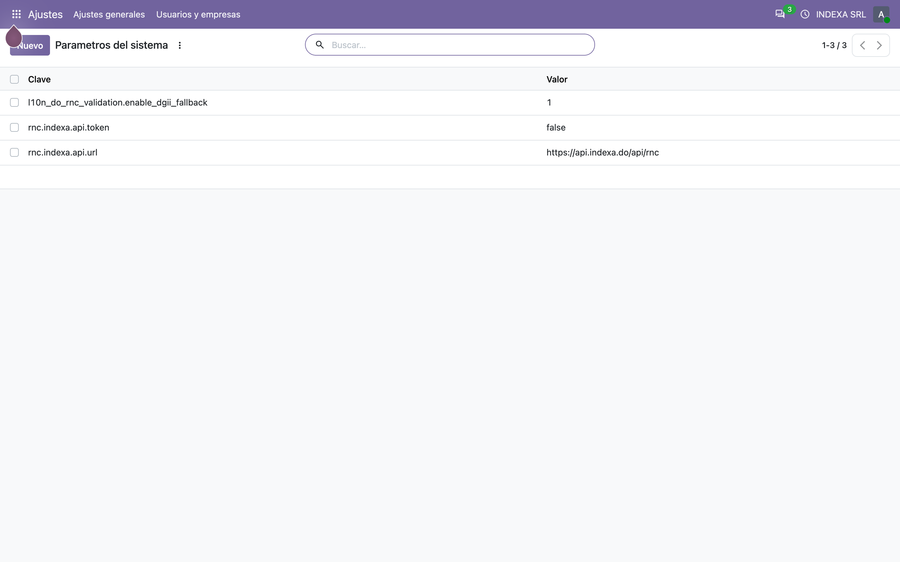
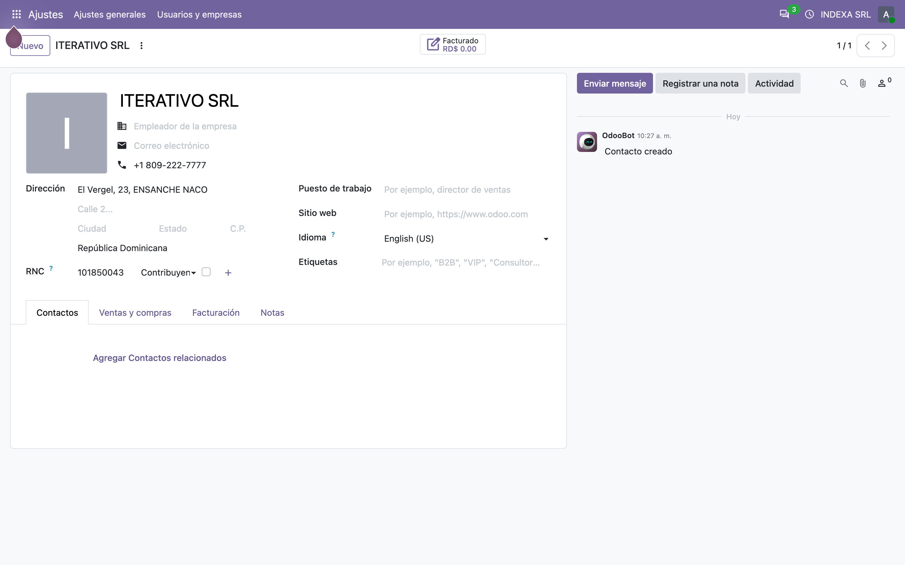
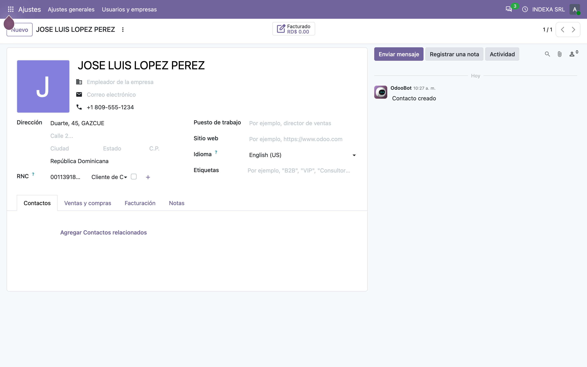
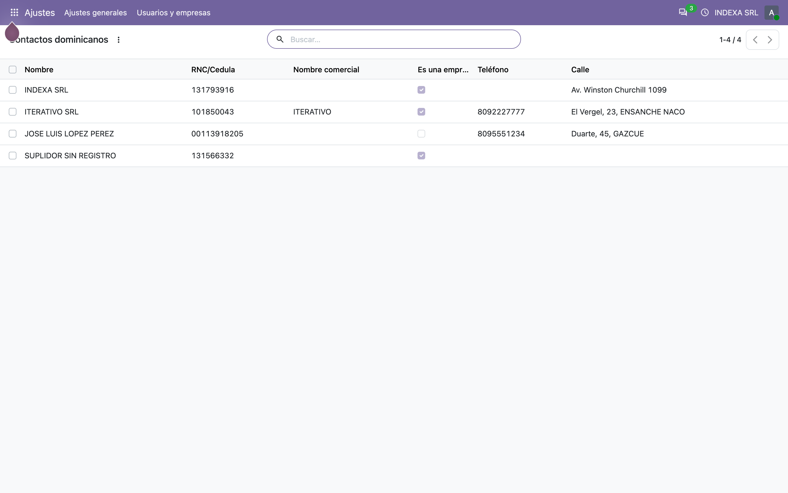
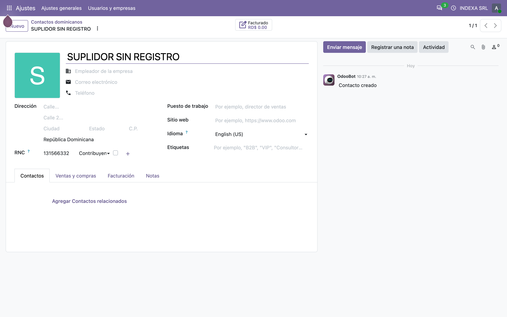
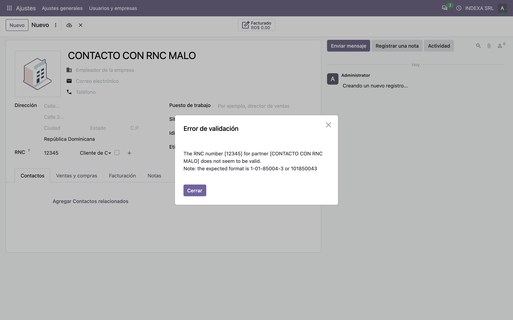

# Validación de RNC/Cédula contra servicios externos — Manual de usuario (l10n_do_rnc_validation)

> Manual generado con `tools/manual-generator`. Las capturas se regeneran ejecutando el generador contra una base `test_v20_<módulo>`.

Este módulo hace que un contacto dominicano se pueda crear **escribiendo solo el número**: se teclea el RNC o la cédula, y el módulo sale a buscar quién es y llena el resto.

Odoo, por sí solo, no consulta ningún registro de contribuyentes. Desde la serie 20.0 el núcleo sí **valida** el número (formato y dígito verificador, con `stdnum`), pero validar no es lo mismo que saber a quién pertenece. Eso sigue siendo trabajo de este módulo.

Qué aporta, en concreto:

- Un enganche en **`create()`** de `res.partner`: si el valor que llega en *Nombre* o en *NIF/RNC* es puramente numérico, consulta la **API de Indexa** (`api.indexa.do/api/rnc`) y, si esa no responde, el **servicio de la DGII** vía `python-stdnum`. Con la respuesta llena **nombre, referencia (nombre comercial), teléfono y dirección**.
- **Persona o empresa**: 9 dígitos es un RNC (empresa), 11 dígitos es una cédula (persona). El núcleo de la 20.0 no distingue — para él cualquier contacto con NIF es una empresa — así que esa clasificación la pone este módulo.
- **RNC duplicado bloqueado**: el núcleo solo *avisa* cuando dos contactos comparten NIF; aquí se corta con un error.
- **Búsqueda y creación rápida por número**: escribir un RNC en cualquier campo de contacto encuentra el contacto existente, y si no existe lo crea ya resuelto.
- Un interruptor por compañía para apagarlo todo, y un parámetro del sistema para apagar solo la consulta a la DGII.

No reemplaza al núcleo: se monta encima. El núcleo rechaza un número mal formado; este módulo dice de quién es.

## Requisitos previos

- Módulo **`l10n_do_rnc_validation`** instalado (v `19.5.1.2.0`, línea 20.0 / `master`). Odoo `master` se autodeclara `19.5`, por eso el prefijo de versión.
- Dependencia: **`l10n_do_accounting`** (v `19.5.3.0.0`), que a su vez trae `l10n_do` y `l10n_latam_invoice_document`.
- Dependencia externa de Python: **`python-stdnum`** (se importa como `stdnum`), para el dígito verificador y para la consulta a la DGII.
- **Salida a Internet desde el servidor de Odoo**, y un **token de la API de Indexa** en el parámetro `rnc.indexa.api.token`. Sin token la API responde con error y el módulo cae al servicio de la DGII.
- La compañía debe tener activado **Datos de RNC de la API de Indexa** en *Ajustes → General*; viene activado por defecto.

## 1. Dónde se enciende: Ajustes → Ajustes generales → Integraciones

El módulo agrega una sola opción, en el bloque **Integraciones** de los ajustes generales: **Datos de RNC de la API de Indexa** (`l10_do_can_validate_rnc`).

El campo vive en **`res.company`**, o sea que es **por compañía**: en un grupo multicompañía cada una decide si sus contactos se resuelven contra el servicio externo o se capturan a mano.

Viene **activado por defecto** (`default=True`). Al apagarlo, `validate_rnc_cedula()` devuelve `{}` de inmediato y no se hace ninguna petición: los contactos se crean con lo que escriba el usuario y nada más. Es el interruptor que hay que usar cuando el servidor no tiene salida a Internet, o durante una carga masiva de datos.

Apagarlo **no** desactiva la validación del núcleo: un RNC con dígito verificador incorrecto se sigue rechazando al guardar.


## 2. Los tres parámetros del sistema

El resto de la configuración vive en *Ajustes → Técnico → Parámetros del sistema*, porque son datos de instalación, no de uso diario:

| Clave | Valor por defecto | Para qué |
|---|---|---|
| `rnc.indexa.api.url` | `https://api.indexa.do/api/rnc` | Endpoint de la API de Indexa. |
| `rnc.indexa.api.token` | `false` | Token de acceso, va en la cabecera `x-access-token`. **Hay que ponerlo**: con el valor por defecto la API responde con error y toda consulta cae al servicio de la DGII. |
| `l10n_do_rnc_validation.enable_dgii_fallback` | `1` | Apaga (`0`) la consulta al servicio de la DGII. |

El tercero merece explicación. Cuando la API de Indexa no devuelve datos, el módulo consulta a la DGII con `stdnum`, que **descarga su WSDL en cada llamada**. Mientras el portal de la DGII está caído — que es el estado habitual — esa consulta solo agrega latencia a cada creación de contacto. Poniéndolo en `0` se ahorra una ida y vuelta HTTP por contacto.

La consulta a la DGII está acotada a **5 segundos** (`DGII_TIMEOUT`). Antes usaba el valor por defecto de `stdnum`, que son 30.



## 3. Flujo 1 — Contacto de empresa creado desde un RNC

Este contacto se creó escribiendo **únicamente el RNC `101850043`**. Todo lo demás lo puso el módulo con lo que devolvió el servicio:

| Campo de Odoo | De dónde sale |
|---|---|
| **Nombre** | `business_name` — la razón social registrada |
| **Referencia** | `tradename` — el nombre comercial |
| **NIF/RNC** | el número consultado |
| **Teléfono** | `phone`, solo si el usuario no escribió uno |
| **Dirección** | `street` + `street_number` + `sector`, unidos por comas, solo si estaba vacía |
| **Es una empresa** | 9 dígitos → RNC → **sí** |

En la captura se ven el nombre, el teléfono (**+1 809-222-7777**), la dirección (**El Vergel, 23, ENSANCHE NACO**) y el RNC. La **Referencia** y el indicador **Es una empresa** no salen en el formulario estándar de contacto de Odoo, pero sí están guardados: se ven en la lista del paso 5.

El detalle importante es el último. En la 20.0 el núcleo calcula `is_company` a partir de la mera **presencia** de un NIF (`has_vat`), sin mirar qué número es. Este módulo lo refina, y por eso un RNC de 9 dígitos sigue quedando marcado como empresa y una cédula no (paso 4).

El teléfono y la dirección se respetan si ya venían escritos: el servicio completa huecos, no pisa lo que capturó el usuario.



## 4. Flujo 2 — Contacto de persona creado desde una cédula

Mismo camino, pero con una **cédula de 11 dígitos** (`00113918205`). El servicio devuelve el nombre de la persona y el módulo lo usa igual, con una diferencia que la lista del paso 5 deja ver: **el contacto no es una empresa**.

Esa distinción es la razón por la que este módulo sigue existiendo tras la 20.0. El núcleo haría lo siguiente:

```python
# odoo/addons/base/models/res_partner.py
def _compute_is_company(self):
    for partner in self:
        partner.is_company = partner.commercial_partner_id == partner and partner.has_vat
```

O sea: *cualquier* contacto con NIF es una empresa. En República Dominicana eso convierte a todo ciudadano con cédula en una empresa, con consecuencias directas — el tipo de comprobante fiscal que Odoo ofrece (31 vs. 32) depende de si el contacto tiene RNC.

El módulo extiende ese cálculo y baja a *persona* todo contacto dominicano cuyo número mida 11 dígitos. Los contactos de otros países no se tocan: un NIF de 11 dígitos fuera de RD conserva lo que decida el núcleo.



## 5. Lo que quedó guardado, y buscar por RNC o cédula

Esta lista lleva columnas que el listado estándar de contactos no trae — **Nombre comercial** (`ref`) y **Es una empresa** (`is_company`) — porque son justo los dos campos que el módulo llena y que el formulario no enseña.

| Contacto | Número | Dígitos | Es una empresa | Origen de los datos |
|---|---|---|---|---|
| INDEXA SRL | `131793916` | 9 | sí | la propia compañía, capturada a mano |
| ITERATIVO SRL | `101850043` | 9 | sí | API |
| JOSE LUIS LOPEZ PEREZ | `00113918205` | 11 | **no** | API |
| SUPLIDOR SIN REGISTRO | `131566332` | 9 | sí | ninguno — ver paso 6 |

Ahí se ve el efecto del módulo de un vistazo: los tres tienen NIF, y solo el de 11 dígitos quedó como persona. Con el cálculo del núcleo solo, los tres serían empresas.

El módulo también agrega el campo **RNC/Cédula** a la búsqueda de contactos, así que se puede teclear un número en la barra y filtrar por él sin abrir el menú de filtros. Aparte de eso, el propio núcleo ya busca por NIF en cualquier campo de contacto (`_rec_names_search` incluye `vat`, `email`, `ref` y el nombre completo). Este módulo **ya no toca esa lista**: la sobreescribía para agregar `vat`, que el núcleo trae desde antes, y al hacerlo quitaba la búsqueda por correo y por referencia.



## 6. Cuando el servicio no conoce el número

**SUPLIDOR SIN REGISTRO** se creó con nombre y RNC `131566332` mientras la API no devolvía datos y el servicio de la DGII tampoco. El resultado es el esperado: el contacto se crea, conserva el nombre que escribió el usuario, y no se inventa nada — sin nombre comercial, sin teléfono y sin dirección.

El orden de intentos es siempre el mismo:

1. **API de Indexa** (`rnc.indexa.api.url`, 15 s de tope). Si responde con datos, se usa y se termina.
2. **Servicio de la DGII** vía `stdnum` (5 s de tope), solo si el parámetro `enable_dgii_fallback` está en `1`. Devuelve razón social, nada más.
3. **Nada**. Se conserva lo que haya escrito el usuario.

Ningún fallo de red interrumpe la creación del contacto: las dos consultas están envueltas en `try/except` y solo dejan un `WARNING` en el log (*«Error connecting to Indexa API»*, *«DGII lookup failed for …»*). Esto es deliberado — un servicio externo caído no debe impedir registrar un cliente.



## 7. Un número mal escrito no se guarda

Al intentar guardar un contacto dominicano con el NIF **`12345`**, el guardado se corta:

> **The RNC number [12345] for partner [CONTACTO CON RNC MALO] does not seem to be valid.**
> **Note: the expected format is 1-01-85004-3 or 101850043**

Este error **ya no lo produce este módulo**: desde la 20.0 los chequeos de `base_vat` viven en el propio `base`, y `check_vat_do` valida el número contra `stdnum` — RNC de 9 dígitos o cédula de 11, **con dígito verificador correcto**. Es estrictamente más severo que la regla que traía este módulo, que solo contaba dígitos, así que esa regla se eliminó durante el port en lugar de duplicarla.

En la práctica esto cambia tres cosas para el usuario:

- Un número con la cantidad correcta de dígitos pero mal transcrito (un dígito cambiado) **ahora sí se rechaza**; antes pasaba.
- El mensaje trae el **formato esperado del país**, que el mensaje anterior no daba.
- **Sale en inglés.** El mensaje es nuevo en la 20.0 y Odoo todavía no lo tradujo al español río arriba (`base/i18n/es.po` no lo trae), así que aparece en inglés aunque el resto de la interfaz esté en español. Es un hueco del núcleo, no de este módulo; se resuelve agregando la entrada a la traducción de `base`.

La validación del núcleo solo corre cuando el contacto tiene **país**. Un contacto sin país no se valida — ni por el núcleo ni por este módulo.



## 8. RNC duplicado: el módulo lo bloquea, el núcleo solo avisa

Si se intenta guardar un segundo contacto con un RNC que ya tiene otro, el módulo corta con:

> **RNC/ID 101850043 ya está asignado a ITERATIVO SRL**

Es un `UserError` lanzado desde `_check_duplicate_partner()`, que corre tanto al crear (dentro de `validate_rnc_cedula`) como en una restricción sobre `vat` y `company_id`.

El núcleo de la 20.0 tiene algo parecido pero más blando: el campo calculado `same_vat_partner_id` **señala** el contacto que comparte NIF, para que la vista muestre un aviso. No impide guardar.

La regla tiene tres excepciones deliberadas, todas descubiertas con casos reales:

| Caso | Por qué se permite |
|---|---|
| **Contacto hijo** (dirección, persona de contacto) | El núcleo sincroniza el NIF de la entidad comercial a sus hijos. El hijo no es una entidad comercial propia, así que no puede ser un duplicado. |
| **Sucursales de la compañía** | `res.company.create()` crea el contacto *antes* de que exista la fila de la compañía, así que en el momento de validar el contacto todavía no está enlazado a ninguna. Por eso el chequeo descarta como candidato a todo contacto que respalde una `res.company`. |
| **Compañía con `parent_id`** | Una sucursal comparte el RNC de la matriz por definición. |

Una **filial** (contacto `is_company` colgando de otro) **sí** se valida: es su propia entidad comercial y tiene su propio RNC.

## 9. Cargas masivas: cómo no convertir una importación en media hora

Cada búsqueda es una petición HTTP **síncrona** dentro de la transacción de creación. En una importación de 600 filas eso son 600 peticiones en fila. El módulo evita la consulta en tres situaciones:

| Situación | Cómo se detecta | Qué pasa |
|---|---|---|
| **Importación que ya trae nombre y NIF** | contexto `import_file` + ambos valores presentes | No se consulta nada; el archivo manda y se conserva el nombre importado. Importar solo el NIF **sí** dispara la búsqueda. |
| **Llamada programática** | contexto `l10n_do_rnc_validation_skip_lookup=True` | No se consulta nada. Es lo que deben usar migraciones y scripts de datos. |
| **Contacto hijo con el NIF del padre** | `parent_id` presente y mismo NIF que la entidad comercial | No se consulta: ya se sabe quién es. |

Y para apagarlo del todo, el interruptor del paso 1.

```python
# en un script de carga
env["res.partner"].with_context(
    l10n_do_rnc_validation_skip_lookup=True
).create(rows)
```

## 10. Qué se quedó el núcleo en la 20.0 y qué sigue aquí

El port a la línea 20.0 obligó a repartir de nuevo el trabajo, porque el núcleo absorbió parte de lo que este módulo hacía.

| Función | 19.0 | 20.0 |
|---|---|---|
| Formato del número (9/11 dígitos) | este módulo | **núcleo** (`check_vat_do`, además con dígito verificador) |
| Dígito verificador | nadie | **núcleo** |
| `DO_CEDULA` como identificador adicional | no existía | **núcleo** (`l10n_do`, campo `additional_identifiers`) |
| Persona vs. empresa según el número | este módulo | **este módulo** (el núcleo lo haría mal) |
| Búsqueda de contribuyente (Indexa / DGII) | este módulo | **este módulo** |
| Autocompletado de nombre, referencia, teléfono, dirección | este módulo | **este módulo** |
| RNC duplicado bloqueado | este módulo | **este módulo** (el núcleo solo avisa) |
| Creación rápida escribiendo el número | este módulo | **este módulo** |
| Buscar por NIF en campos de contacto | este módulo (sobreescribiendo) | **núcleo** (ya lo traía; la sobreescritura se eliminó) |

El módulo salió más chico del port, que era el resultado deseado: lo que el núcleo ya hace, y hace mejor, se borró.

## Notas

### Qué agrega el módulo

| Modelo | Campo / método | Nota |
|---|---|---|
| `res.company` | `l10_do_can_validate_rnc` | Booleano, por defecto `True`; interruptor general |
| `res.config.settings` | `l10_do_can_validate_rnc` | Campo relacionado (`readonly=False`) para los ajustes |
| `res.partner` | `_compute_is_company()` | Extiende el del núcleo: 11 dígitos en RD es persona |
| `res.partner` | `validate_rnc_cedula(number)` | Punto de entrada: valida, chequea duplicados y busca |
| `res.partner` | `get_contact_data(vat)` | Consulta a la API de Indexa (lo usa también `l10n_do_ecommerce`) |
| `res.partner` | `_get_dgii_fallback(number, is_rnc)` | Consulta a la DGII vía `stdnum`, acotada a 5 s |
| `res.partner` | `_check_duplicate_partner(number, company)` | `UserError` si el RNC ya está asignado |
| `res.partner` | `create()`, `name_create()` | Enganches de autocompletado y de creación rápida |

Las vistas heredan `base.view_partner_form` (marcador de posición del nombre), `base.view_res_partner_filter` (campo de búsqueda RNC/Cédula) y `base.res_config_settings_view_form` (el interruptor, dentro del bloque `integration`).

### Notas de la migración a la línea 20.0 (`master`)

El núcleo cambió bastante alrededor de este módulo, así que el port no fue mecánico.

**Roturas encontradas y corregidas:**

1. **`ir.config_parameter.get_param()` no existe.** El núcleo lo reemplazó por accesores tipados: `get_str`, `get_bool`, `get_int`, `get_float` (y los `set_*` correspondientes). Las tres llamadas del módulo estaban dentro de `try/except Exception`, así que la rotura **no se veía**: la consulta simplemente fallaba con `AttributeError` y el log decía *«Error connecting to Indexa API»*. O sea, el módulo se instalaba sin quejarse y **no autocompletaba nada**. Se encontró ejecutando el módulo, no leyendo el diff.
2. **`res.partner.company_type` fue eliminado.** El `create()` lo escribía en cada contacto resuelto. Se eliminó; solo duplicaba `is_company`.
3. **`res.partner.is_company` pasó a ser calculado y almacenado**, derivado del nuevo campo `has_vat`. Escribirlo a mano ya no tiene efecto duradero. Se reemplazó por una extensión de `_compute_is_company()` que baja a *persona* los números dominicanos de 11 dígitos, que es el mecanismo que el propio núcleo documenta para las localizaciones.
4. **`base_vat` se fusionó en `base`.** La restricción propia del módulo (`_l10n_do_rnc_validation_check_rnc_cedula_format`) quedó redundante: `check_vat_do` valida lo mismo y además el dígito verificador. Se eliminó, junto con su entrada en `es_DO.po`.
5. **`_rec_names_search`** se eliminó. El núcleo ya incluía `vat` en 19.0; la sobreescritura del módulo (`["name", "vat"]`) estaba **quitando** la búsqueda por `complete_name`, `email` y `ref`.
6. **Los números de prueba tenían dígito verificador inválido.** Con la validación del núcleo, `999999901` y `99999990101` ya no se pueden guardar. Se cambiaron por `999999001` y `99999990007`, igual de ficticios pero válidos.
7. Se eliminó `migrations/14.0.2.1.0/`, inalcanzable para cualquier base que ya esté en 19.0, y el import sin usar `odoo.modules.module as odoo_module`.
8. **Versión `20.0.1.1.1` → `19.5.1.2.0` e `installable: True`.** `master` se autodeclara `19.5`, y `check_version()` fuerza `installable=False` en cualquier módulo instalable cuya versión no empiece exactamente con la serie en ejecución.

**No hizo falta script de migración.** No cambió ninguna tabla, columna ni registro de seguridad. Se verificó sobre una base marcada como `19.0.1.1.1` con contactos dominicanos existentes (una cédula con `is_company = false`, un RNC con `is_company = true`): la actualización subió a `19.5.1.2.0` sin tocar esos valores. La columna huérfana `res_partner.company_type` queda en la base pero ya no la lee nadie.

**Arreglo que salió de las capturas:** el interruptor de los ajustes usaba dos `<div>` sueltos dentro de `<setting>`, un patrón de series anteriores. En la 20.0 el widget de ajustes espera `<setting string="…" help="…">` con el campo dentro, y con los `<div>` el texto se dibujaba **debajo** de la casilla en vez de al lado, desalineado respecto a las demás opciones del bloque. No lo ve ninguna prueba de Python; se vio en la primera captura del paso 1.

**Verificación:** el módulo instala a `19.5.1.2.0`; su suite pasa **22 de 22**; una batería de humo de 20 comprobaciones cubre las tres vistas propias, las tres del núcleo que hereda, el autocompletado, la clasificación persona/empresa, el bloqueo de duplicados, la creación rápida por número, la consulta a la DGII con su tope de 5 s, el contexto de salto de búsqueda y el guardado de los ajustes. `pre-commit` (ruff, ruff-format, pylint-odoo, chequeos de `.po` y de manifiestos) pasa sobre todos los archivos tocados.

### Pendiente / decisión funcional

- **El mensaje de RNC inválido sale en inglés** (paso 7). Al eliminar la restricción propia del módulo, el usuario pasa a ver la del núcleo, y ese `msgid` no está traducido en `base/i18n/es.po` río arriba. Se puede tapar agregando la entrada a la traducción de `base` de la instalación; volver a poner la restricción del módulo sería peor, porque duplicaría una validación más débil.
- **El servicio de la DGII responde HTML, no XML.** Durante este port, `stdnum.do.rnc.check_dgii()` falla con *«Invalid XML content received»*: el portal devuelve una página web en lugar de la respuesta del servicio. Mientras siga así, el respaldo de la DGII solo agrega latencia, y conviene poner `l10n_do_rnc_validation.enable_dgii_fallback` en `0`. El módulo lo tolera sin romperse (el fallo queda en un `WARNING`), pero nadie está recibiendo datos de esa vía.
- **`stdnum` no está declarado en `external_dependencies`.** El módulo lo importa dentro de un `try/except`, así que si falta, el respaldo de la DGII queda mudo en vez de fallar al instalar. Declararlo es una decisión del responsable funcional: lo haría obligatorio en instalaciones que hoy funcionan sin él.
- **El token de la API de Indexa viene en `false`.** Es el valor de fábrica y no hay forma de adivinarlo, pero conviene saber que una instalación recién hecha **no autocompleta nada** hasta que alguien lo ponga.

### Reproducir este manual

```bash
cd tools/manual-generator
./generate-manual.sh --module=l10n_do_rnc_validation \
  --addons-path=/mnt/extra-addons,/mnt/extra-addons-pro,/mnt/extra-addons-pro/store-addons
```

El `--addons-path` saca `enterprise` de la ruta: ese checkout va por delante del núcleo de la imagen y `ai_auto_install` muere al importar (`cannot import name '_check_jwt'`), lo que tumba la instalación entera. Este módulo no necesita `enterprise`.

El seed (`configs/l10n_do_rnc_validation.seed.py`) arma, sobre una base limpia: compañía INDEXA SRL (RNC 131793916) con plan contable dominicano en español, y los tres contactos de la tabla del paso 5, **creados por el `create()` del propio módulo**. La API de Indexa se simula durante el seed — necesita un token, y el servicio de la DGII está devolviendo HTML — pero todo lo que ocurre después de la respuesta (autocompletado, clasificación, duplicados) es código del módulo sin tocar.

`--keep-db` conserva la base `test_v20_l10n_do_rnc_validation`; `--headed` muestra el navegador durante las capturas.
