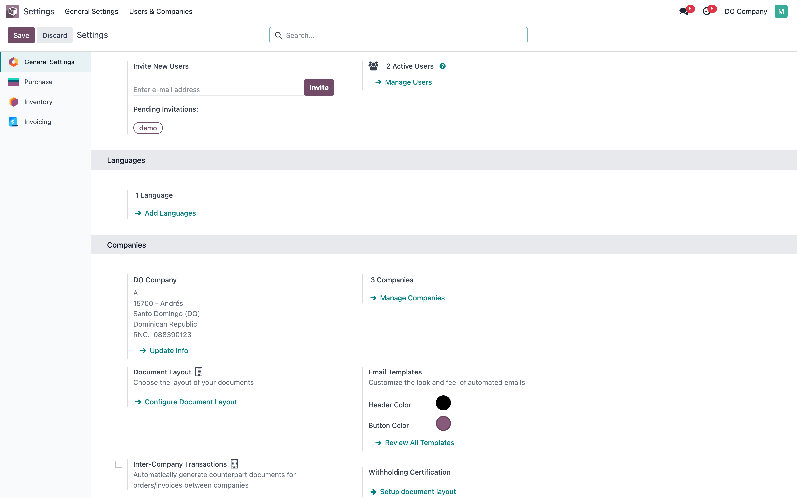
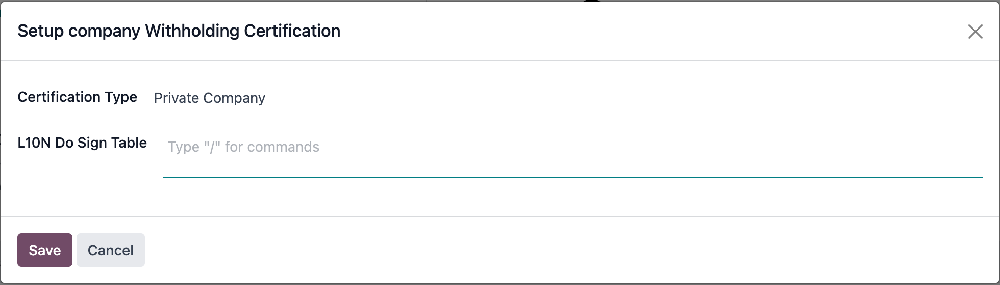
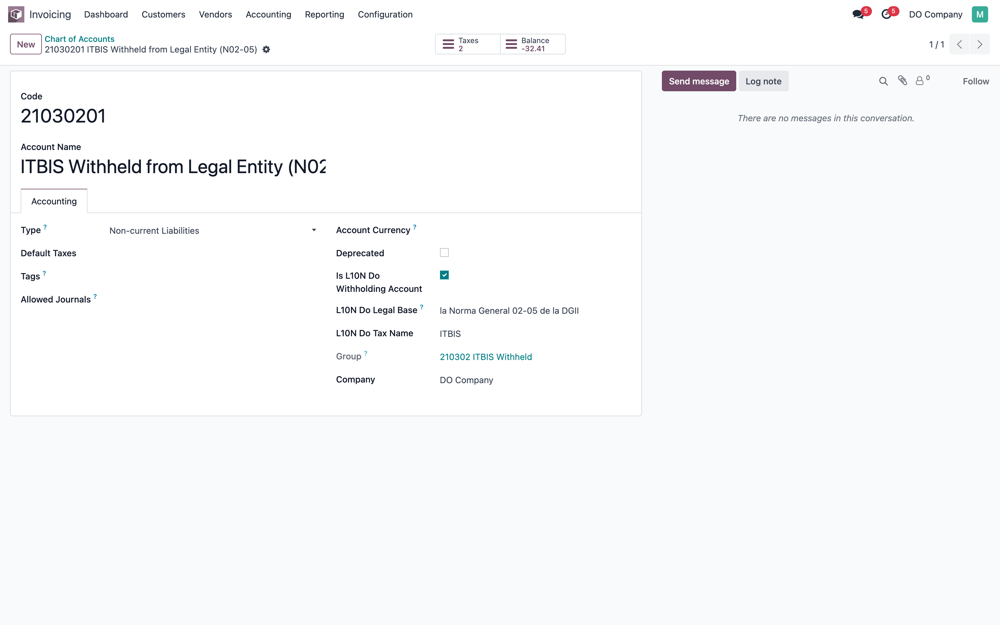
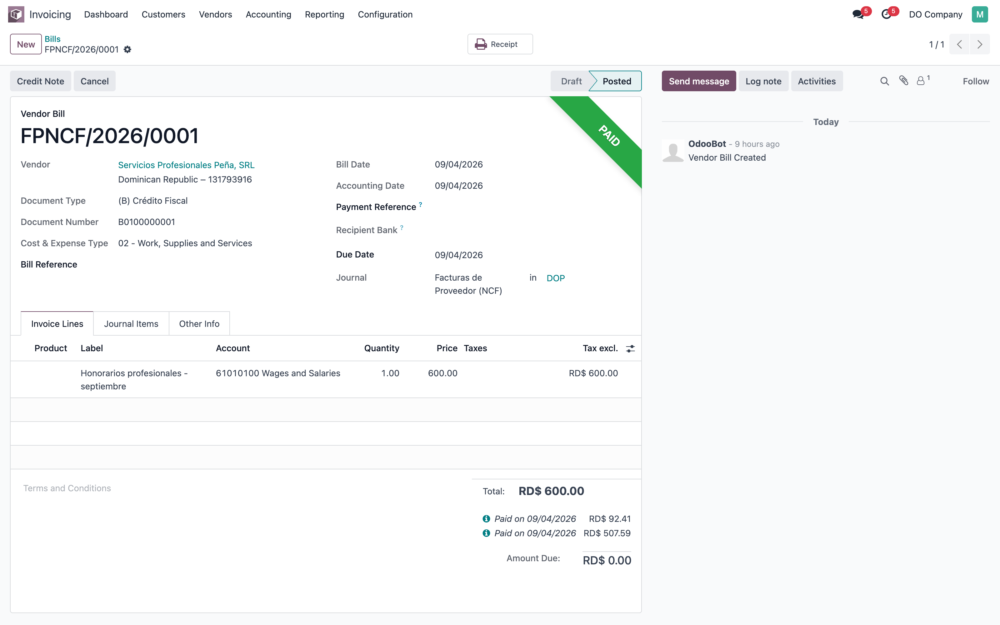
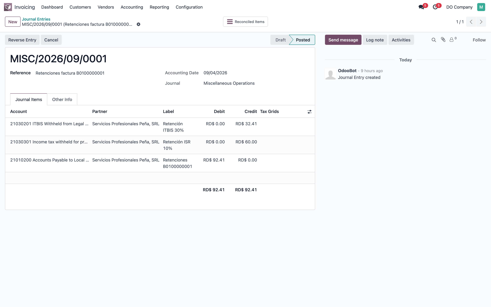
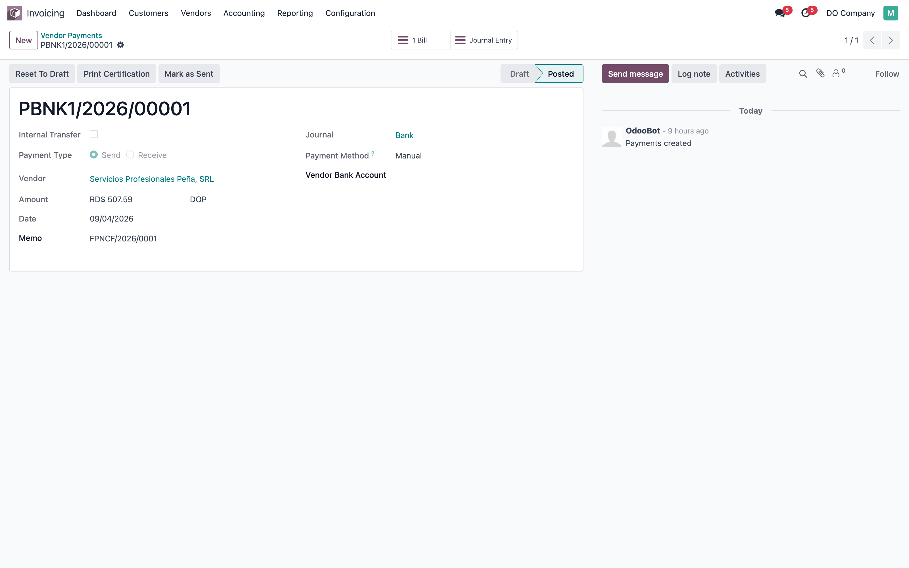
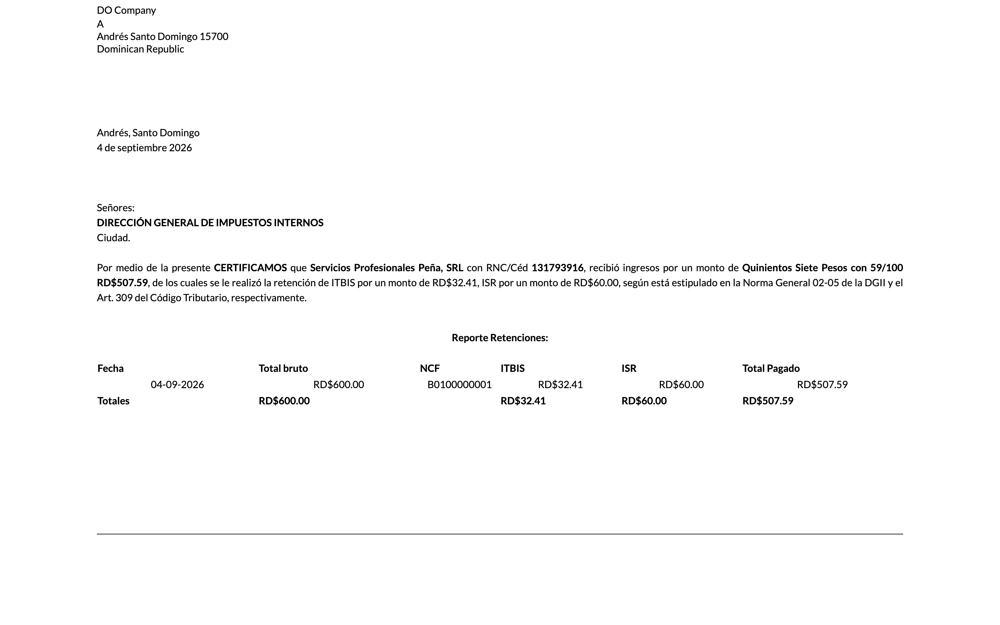

# Certificación de Retenciones — validación funcional

> Manual generado con `tools/manual-generator`: `node capture.mjs --config=configs/l10n_do_withholding_certification.json --db=test_wh_cert`. Las capturas se regeneran corriendo ese comando contra la base de pruebas.

Guía con capturas para **validar en local** el módulo `l10n_do_withholding_certification` en Odoo 17, y en particular el caso que motivó este cambio: **la retención registrada en un asiento de diario aparte**, conciliado con la factura, y el pago por el neto.

Ese escenario es el que antes intentaba atender el tipo de retención `entry`, una rama de código a la que el compute nunca llegaba y cuyo extractor buscaba un campo de otro módulo (`l10n_do_reconcile_invoice_id`, de `account_reconcile_payment`). Esa rama se eliminó: quien arma el certificado es el extractor de tipo `payment`, que lee la retención directamente de las líneas del asiento conciliado.

El escenario sembrado es una sola factura:

| Concepto | Monto |
|---|---|
| Factura de proveedor B0100000001 | RD$ 600.00 |
| Retención ITBIS 30% (asiento) | RD$ 32.41 |
| Retención ISR 10% (asiento) | RD$ 60.00 |
| Pago por el neto | RD$ 507.59 |

Las dos retenciones van **en un mismo asiento**, que es como se registran en la práctica. Lo que se concilia con la factura es la suma (92.41), así que ninguna línea del asiento coincide por monto con lo conciliado: hasta este cambio el certificado imprimía una sola columna sin nombre con los 92.41 juntos, porque el nombre del impuesto y la base legal viven en la cuenta y la cuenta salía vacía.

**Base de datos de las capturas:** `test_wh_cert`. Se arma con la receta de abajo (instalación + `configs/l10n_do_withholding_certification.seed.py` por `odoo shell`). Usuario `admin`, clave `admin`.

## Requisitos previos

- Módulo instalado: `l10n_do_withholding_certification` (arrastra `l10n_do_accounting` y el plan contable `do`).
- Compañía dominicana: país República Dominicana, moneda DOP y plan contable `do` cargado.
- Un diario de compras con **Usar documentos** activado, para que la factura lleve NCF. No se puede activar en un diario que ya tenga facturas contabilizadas, por eso la semilla crea uno propio (`FPNCF`).
- Las cuentas de retención marcadas como tales, **con nombre de impuesto y base legal** (ver paso 3): el certificado toma de ahí el texto que imprime.

## 1. Configuración: dónde vive el certificado

**Ajustes ▸ Ajustes generales**, bloque **Empresas**. El módulo agrega ahí **Withholding Certification** con un único botón, *Setup document layout*. No hay nada más que configurar a nivel de ajustes: el resto de la configuración son las cuentas (paso 3).



## 2. Configuración: encabezado, pie y tipo de certificación

El botón abre el asistente de formato del certificado.

- **Certification Type** — *Private Company* o *Public Sector*. Es obligatorio: sin él, el botón de impresión levanta «No Withholding Certification Type found. Select one in company settings.» Además decide la plantilla: `l10n_do_report_withholding_document_private` para empresa privada, `l10n_do_report_withholding_document` para sector público.
- **L10N Do Sign Table** — HTML libre que se imprime en el bloque de firma. Es el único otro campo que se ve con *Private Company*, como en la captura.
- **Show header**, **Show footer** y **Year tag line** — sólo aparecen al elegir *Public Sector*: en la vista están condicionados a `l10n_do_withholding_cert_type == 'gov'`. Controlan el membrete, el pie y una línea de HTML arriba del certificado.



## 3. Configuración: la cuenta de retención

**Contabilidad ▸ Configuración ▸ Plan de cuentas**, cuenta `21030201`. Tres campos que agrega el módulo:

- **Is Withholding Account** — el interruptor. Es lo que hace que una línea de asiento cuente como retención, tanto para detectar que el pago tiene retención como para armar el certificado.
- **Tax name** (`ITBIS`) — el nombre que sale en el texto y como encabezado de columna.
- **Legal base** (`la Norma General 02-05 de la DGII`) — la norma que se cita al final del párrafo.

**Marcar la cuenta y dejar los otros dos vacíos es el error más común**: el certificado sale con la columna sin título y la frase termina en «según está estipulado en .». La segunda cuenta del escenario, `21030301`, lleva `ISR` y `el Art. 309 del Código Tributario`.



## 4. Escenario: la factura de proveedor

Factura de RD$ 600.00 con NCF `B0100000001`, en el diario `FPNCF` (el que tiene *Usar documentos*). Ya aparece **Pagado**: contra ella se conciliaron dos cosas, el asiento de retenciones (92.41) y el pago (507.59). Ese par es todo el escenario.



## 5. Escenario: el asiento de retenciones

Un solo asiento con las dos retenciones y su contrapartida:

| Cuenta | Debe | Haber |
|---|---|---|
| 21030201 ITBIS retenido | | 32.41 |
| 21030301 ISR retenido | | 60.00 |
| Cuenta por pagar del proveedor | 92.41 | |

La línea de la cuenta por pagar es la que se concilia con la factura: por eso la deuda baja a 507.59 sin que salga dinero. **Este es el caso que el tipo `entry` decía cubrir y nunca cubrió.**



## 6. Escenario: el pago y el botón de impresión

El pago del neto, RD$ 507.59. Arriba aparece **Print Certification**: ese botón sólo se muestra cuando `has_l10n_do_withholding` es verdadero y el pago es de salida, así que **si no aparece, el problema es de detección** — casi siempre una cuenta de retención sin marcar, o el asiento sin conciliar con la factura.

El botón imprime el PDF y además deja el certificado adjunto en el chatter del pago.



## 7. El certificado

El certificado que sale de ese pago. Qué mirar, en orden:

- **Una columna por cuenta de retención**, con su nombre: `ITBIS` 32.41 e `ISR` 60.00. Si sale **una sola columna sin título con 92.41**, el código es anterior a este cambio.
- **Total bruto 600.00** — lo facturado, no lo pagado.
- **Monto pagado 507.59** y el mismo número en letras.
- La frase cierra con las dos bases legales de las cuentas, unidas con «y» y rematadas en «respectivamente».

La captura es la versión HTML del reporte (`/report/html/...`), idéntica en contenido al PDF que baja el botón.



## 8. Cómo armar esta base desde cero

Instalar en una DB nueva (el orden importa: `l10n_do_accounting` no se instala en una base virgen sin las columnas `l10n_do` de `res_partner`, y `--skip-auto-install` evita que el grafo arrastre `l10n_do_sign_to_xml`, que revienta al importar):

```bash
docker exec lfernandez_v17 bash -c "PGPASSWORD=$PASS createdb -h odoo-db -U odoo test_wh_cert"

docker exec lfernandez_v17 odoo -c /etc/odoo/odoo.conf \
  --db_host=odoo-db --db_user=odoo --db_password=$PASS \
  -d test_wh_cert --http-port=8099 --workers=0 --max-cron-threads=0 \
  -i purchase_stock --stop-after-init

docker exec -i odoo-db psql -U odoo -d test_wh_cert -c \
  "ALTER TABLE res_partner ADD COLUMN IF NOT EXISTS l10n_do_dgii_tax_payer_type varchar,
   ADD COLUMN IF NOT EXISTS l10n_do_expense_type varchar,
   ADD COLUMN IF NOT EXISTS l10n_do_rst boolean;"

docker exec lfernandez_v17 odoo -c /etc/odoo/odoo.conf \
  --db_host=odoo-db --db_user=odoo --db_password=$PASS \
  -d test_wh_cert --http-port=8099 --workers=0 --max-cron-threads=0 \
  -i l10n_do_withholding_certification --skip-auto-install --stop-after-init
```

Sembrar el escenario (idempotente, se puede repetir):

```bash
docker exec -i lfernandez_v17 odoo shell -c /etc/odoo/odoo.conf -d test_wh_cert \
  --db_host=odoo-db --db_user=odoo --db_password=$PASS --no-http --log-level=warn \
  < tools/manual-generator/configs/l10n_do_withholding_certification.seed.py
```

La semilla imprime lo que deja montado, y eso es lo que hay que ver:

```
seed: bill FPNCF/2026/0001 total 600.00 residual 0.00
seed: payment PBNK1/2026/00001 amount 507.59
seed: has_l10n_do_withholding=True type=payment
seed: withholding_values={'21030201': 32.41, '21030301': 60.0}
seed: paid=507.59 gross=600.00 words=Quinientos Siete Pesos con 59/100
```

Con el código anterior a este cambio, esa cuarta línea sale `{False: 92.41}`: sin cuenta, y los dos montos sumados.

Para verlo en el navegador hace falta un Odoo que sirva esa base. El `dbfilter` del `odoo.conf` compartido no la incluye, así que lo más limpio es un contenedor aparte con su propio filestore (no montar el volumen de datos: si se comparte, la regeneración de assets falla con `PermissionError`):

```bash
docker run -d --name manualgen_wh --network odoo_shared_network -p 8071:8071 \
  -v "$PWD/enterprise:/mnt/extra-addons-enterprise" \
  -v "$PWD/odoo-pro:/mnt/extra-addons-pro" \
  -v "$PWD/conf:/etc/odoo" \
  --entrypoint /usr/bin/odoo dev_env_odoo_pro-17-odoo \
  -c /etc/odoo/odoo.conf --db_host=odoo-db --db_user=odoo --db_password=$PASS \
  -d test_wh_cert --http-port=8071 --db-filter='^test_wh_cert$' --workers=0 --max-cron-threads=0
```

Y se abre en `http://localhost:8071` con `admin` / `admin`. Al terminar: `docker rm -f manualgen_wh`.

## 9. Qué cambió en el módulo

**Fuera el tipo `entry`.** `l10n_do_withholding_type` queda en `payment` / `tax`. Se eliminaron `_get_entry_withholding_data` y `_get_counterpart_aml`, y la rama `entry` del compute:

- El compute nunca llegaba a esa rama: `_is_payment_invoice_withholding_data` ya recorre las líneas del asiento conciliado y clasifica el pago como `payment` antes.
- `_get_counterpart_aml` buscaba `account.move.line` por `l10n_do_reconcile_invoice_id`, campo de `account_reconcile_payment`, que no es dependencia. Sin ese módulo: `ValueError: Invalid field account.move.line.l10n_do_reconcile_invoice_id`.
- Con el módulo instalado tampoco funcionaba: ese campo guarda el id de la **factura**, y la búsqueda lo comparaba contra el id del **asiento**.

**Migración `17.0.1.0.8`.** Los pagos guardados con tipo `entry` pasan a `payment`. Sin eso, imprimir un certificado viejo revienta: `get_certification_data` resuelve el extractor por el nombre del tipo. Antes de desplegar conviene contar cuántos son:

```sql
SELECT count(*) FROM account_payment WHERE l10n_do_withholding_type = 'entry';
```

**Un asiento con varias retenciones se reparte por cuenta.** Es el defecto que apareció armando este manual: cuando ITBIS e ISR van en el mismo asiento, lo conciliado es la suma y ninguna línea coincide con ese monto, así que el certificado salía con una columna sin nombre y los montos sumados. Ahora, si las líneas de retención del asiento suman lo conciliado, cada una conserva su cuenta. Un asiento conciliado sólo en parte sigue comportándose como antes.

## Notas

Correr los tests del módulo:

```
docker exec lfernandez_v17 odoo -d <db> --db_host=odoo-db --db_user=odoo --db_password=<pass> \
  -u l10n_do_withholding_certification --test-enable --stop-after-init --no-http --workers=0 \
  --test-tags "/l10n_do_withholding_certification:AccountPaymentWithholdingTest"
```

Esperado: `0 failed, 0 error(s) of 4 tests`. La DB tiene que estar **sin apuntes contables en `base.main_company`**: `AccountTestInvoicingCommon.setUpClass` le cambia la moneda a USD y falla con «You cannot change the currency of the company since some journal items already exist».
