# Certificación de Retenciones RD — Manual de usuario

> Manual generado con `tools/manual-generator`: `node capture.mjs --config=configs/l10n_do_withholding_certification.json --db=test_v19_l10n_do_withholding_certification`. Las capturas se regeneran corriendo ese comando contra la base de pruebas.

Cuando una empresa dominicana le retiene ITBIS o ISR a un suplidor, ese suplidor necesita un papel que diga cuánto le retuvieron y bajo qué norma: el **certificado de retención** que se le presenta a la DGII.

**Certificación de Retenciones RD** (`l10n_do_withholding_certification`) lo imprime desde el propio pago. Un botón **Imprimir Certificación** en el pago al proveedor arma el documento con el nombre y el RNC/cédula del suplidor, el monto bruto en letras, una fila por cada factura pagada, una columna por cada impuesto retenido y la base legal de cada retención; además deja una copia adjunta en el historial del pago.

El módulo entiende las **dos formas** en que la retención se registra en República Dominicana, y las suma en un mismo certificado:

- **Retención al registrar el pago** — la forma nativa de Odoo 19: la factura se debe completa y la retención se captura en el momento de pagar.
- **Retención sobre la factura** — como se hacía hasta la v17 y como llegan las bases de datos migradas: el impuesto de retención se aplica en la factura del suplidor, cuyo total ya sale neto.

Hay dos diseños del certificado: uno para **compañía privada** y otro para **sector público**, con escudo nacional, membrete y el lema del año.

**Base de datos de las capturas:** Base de pruebas `test_v19_l10n_do_withholding_certification`, compañía **Constructora del Caribe SRL** (RD, DOP, plan contable dominicano), sin datos de demostración. La siembra deja las dos cuentas de retención configuradas, un suplidor persona física, una factura con la retención **sobre la factura** ya pagada, otra con la retención **en el pago** ya pagada, y una tercera sin pagar para ilustrar el asistente de registro de pago.

## Requisitos previos

- Módulo **`l10n_do_withholding_certification`** instalado (arrastra `l10n_do_account_withholding_tax`, `l10n_do_accounting` y el `l10n_account_withholding_tax` del core).
- Compañía con **país fiscal República Dominicana**: si el país fiscal no es RD, el módulo no marca ningún pago y el botón nunca aparece.
- **Plan contable dominicano** cargado, con sus impuestos de retención de ITBIS e ISR.
- Cada impuesto de retención debe asentar en **su propia cuenta contable**, y esa cuenta debe estar marcada como cuenta de retención con su **Nombre del impuesto** y su **Base legal** — de ahí salen las columnas y el texto legal del certificado.
- Un **tipo de certificación** elegido en los ajustes de la compañía (*Compañía privada* o *Sector público*); sin él, el botón responde con un error.
- El pago tiene que ser **de proveedor** (salida) y estar **publicado**: el botón no aparece en cobros ni en pagos en borrador o cancelados.

## 1. La cuenta de retención: de aquí sale todo lo que dice el certificado

**Contabilidad › Configuración › Plan contable**, y se abre la cuenta en la que asienta el impuesto de retención — aquí *21030102 Retención ISR por pagar*.

El certificado **no lee nada del impuesto**: lee la cuenta. Por eso cada retención necesita su propia cuenta con tres casillas llenas:

- **Es una cuenta de retención** — la marca como tal. Sin ella, la retención registrada sobre la factura no se detecta.
- **Nombre del impuesto** — el texto del encabezado de la columna y del párrafo del certificado: `ITBIS`, `ISR`.
- **Base legal** — el artículo o norma que ampara la retención: *el Art. 309 del Código Tributario*, *la Norma General 02-05 de la DGII*.

Si dos retenciones comparten la misma cuenta, el certificado imprime **una sola columna** con los dos montos sumados y sin nombre propio. Una cuenta por impuesto retenido.

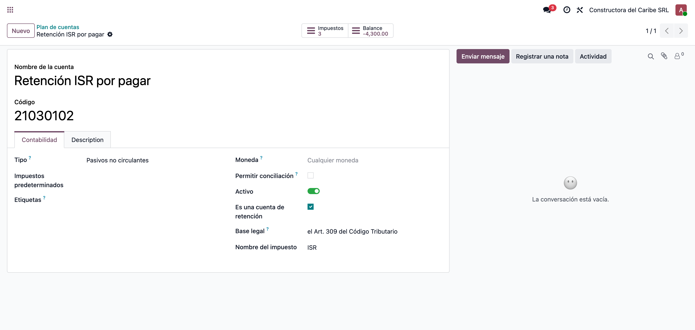

## 2. El impuesto de retención y dónde asienta

**Contabilidad › Configuración › Impuestos**, y se abre el impuesto de retención — aquí *-10% ISR Hon.*, con importe **negativo**, que es lo que lo convierte en retención.

En la pestaña **Definición**, la línea de reparto de tipo *Impuesto* tiene que apuntar a la cuenta de retención del paso anterior: es la cuenta que el módulo busca para saber cómo se llama la columna y qué norma citar.

La casilla **Retención en el pago** decide *cuándo* se retiene, y con eso, cuál de los dos flujos del módulo se usa:

- **Marcada** — el impuesto queda **fuera** de la factura (se debe completa) y se captura al registrar el pago. Es el flujo nativo de Odoo 19.
- **Sin marcar** — el impuesto se aplica **en la factura**, cuyo total sale ya neto de retención. Es la forma pre-v19 y la que traen las bases migradas.

El certificado sale igual con cualquiera de las dos; los dos flujos se ven más abajo.

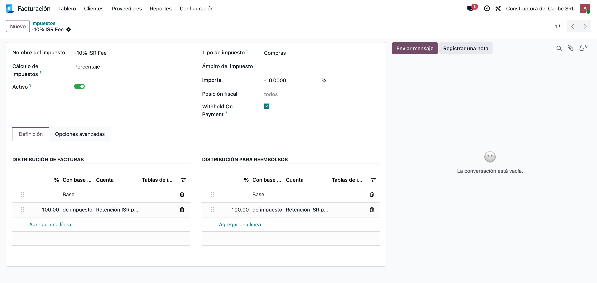

## 3. Dónde se configura el certificado

**Ajustes › Ajustes generales**, sección **Compañías**. El módulo agrega ahí el bloque **Withholding Certification** con un único enlace, **Configurar apariencia del documento**, que abre el asistente del paso siguiente.

Toda la configuración del certificado es **por compañía**: en una base multicompañía, cada una lleva su propio tipo, su lema y su tabla de firmas.

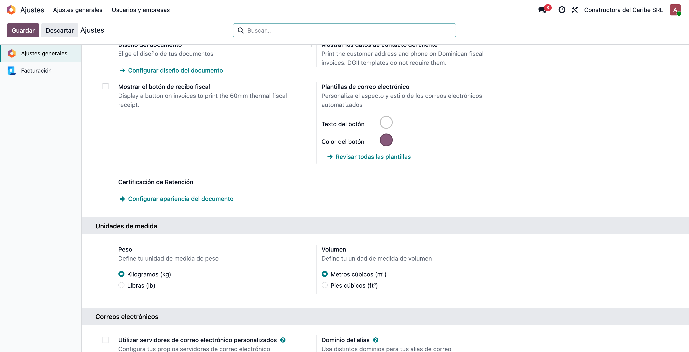

## 4. El asistente de apariencia del documento

El asistente guarda directamente sobre la compañía:

- **Tipo de Certificación** — *Compañía privada* usa el membrete estándar de Odoo; *Sector público* cambia a un diseño con escudo nacional, RNC y dirección de la institución. **Es obligatorio**: sin tipo, el botón de impresión responde *«No Withholding Certification Type found»*.
- **Firmas** — bloque de texto enriquecido con los nombres y cargos de quienes firman. Se imprime al pie de las dos variantes.

Los tres campos restantes — **Mostrar cabecera**, **Mostrar pie de página** y **Slogan del año** — sólo aparecen cuando el tipo es *Sector público*, porque sólo el diseño institucional los usa. Se ven en el paso 13.

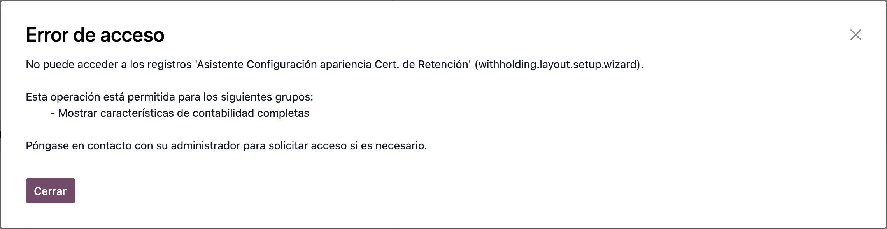

## 5. La factura del suplidor, con la retención pendiente

**Contabilidad › Proveedores › Facturas**, factura *B0100000017* del ingeniero Ramón Emilio Peña Ureña.

Con **Retención en el pago** marcada en los impuestos, la factura **no descuenta** la retención: se le debe al suplidor el total con ITBIS, **RD$ 37,760.00**. Los impuestos de retención sí están en las líneas, esperando el momento del pago.

Es importante para leer el certificado: el *Total bruto* que imprime es este monto facturado, no lo que finalmente se transfiere.

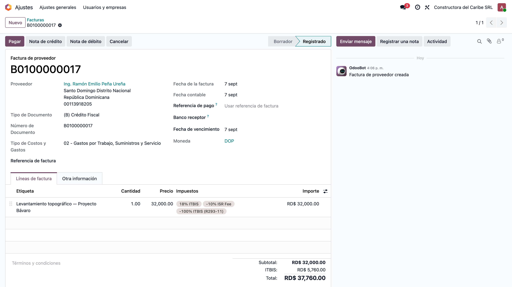

## 6. Registrar el pago: aquí se captura la retención

Al pulsar **Registrar pago**, el asistente trae ya calculadas las **líneas de retención** de la factura: una por impuesto, con su base y su monto. El **importe** del pago baja a lo que realmente se le transfiere al suplidor.

Esas líneas son la primera de las dos formas que el certificado lee. Al confirmar, quedan guardadas en el pago y de ahí salen las columnas del documento.

Se pueden ajustar antes de confirmar (cambiar un monto, quitar una línea): el certificado imprime lo que quede registrado en el pago.

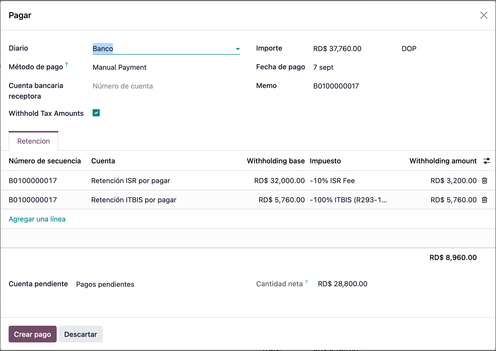

## 7. El pago publicado y el botón Imprimir Certificación

Este es el pago de la factura *B0100000016*, ya publicado. Sus **líneas de retención** guardan RD$ 4,500.00 de ITBIS y RD$ 2,500.00 de ISR sobre una factura de RD$ 29,500.00, así que al suplidor se le transfirieron RD$ 22,500.00.

En la barra de botones aparece **Imprimir Certificación**. Sale sólo cuando se cumplen las tres condiciones a la vez:

1. el pago es **de proveedor** (salida),
2. está **publicado** (ni borrador ni cancelado),
3. el módulo detectó retención — en el pago o en las facturas que liquida.

Si el botón no aparece, el problema está en una de esas tres, no en el reporte.

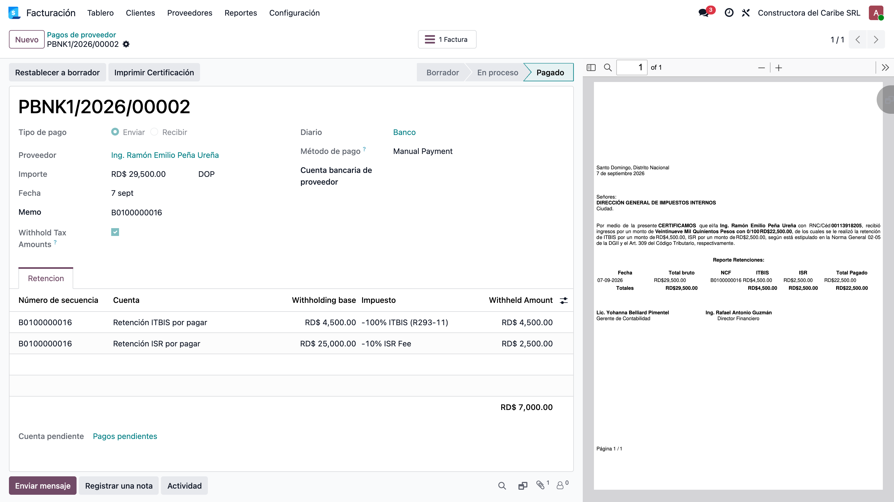

## 8. El certificado impreso (compañía privada)

El botón imprime esto. De arriba abajo:

- **Ciudad y fecha** de emisión, esta última escrita en letras.
- El párrafo dirigido a la **DGII**, con el nombre y el RNC/cédula del suplidor, el monto **en letras**, y una frase por cada impuesto retenido con su monto y su base legal — *«… según está estipulado en la Norma General 02-05 de la DGII y el Art. 309 del Código Tributario, respectivamente»*.
- La tabla **Reporte Retenciones**: una fila por cada factura que el pago liquidó, con su fecha, su **Total bruto**, su **NCF**, una columna por cada retención y el **Total Pagado**. La fila de totales cierra la cuenta: RD$ 29,500.00 facturados − RD$ 4,500.00 de ITBIS − RD$ 2,500.00 de ISR = RD$ 22,500.00 transferidos.
- La tabla de **Firmas** configurada en el asistente.

Un pago que liquida varias facturas imprime **una fila por factura**, y las retenciones capturadas en el pago se reparten entre ellas en proporción a su monto.

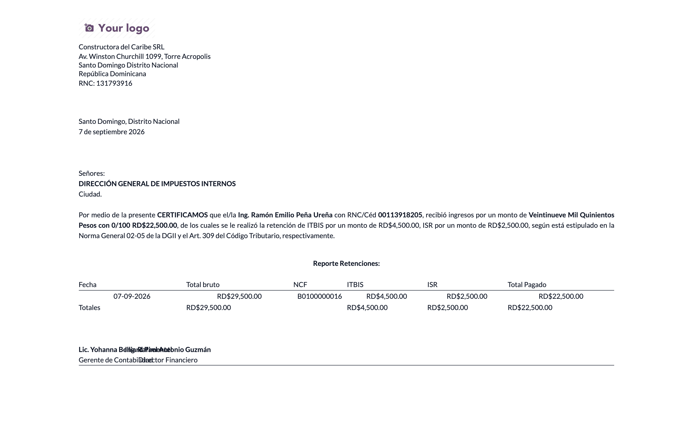

## 9. Cada impresión queda archivada en el pago

Imprimir no sólo descarga el PDF: el módulo lo **adjunta al historial del pago** y deja el mensaje *«New Withholding Certification printed»*.

Sirve de rastro — se sabe cuándo se le entregó el certificado al suplidor y con qué contenido — y de copia: se puede volver a descargar el mismo documento sin reimprimirlo. Cada pulsación del botón agrega un adjunto nuevo, así que el historial conserva también las versiones anteriores si algo se corrigió por el medio.

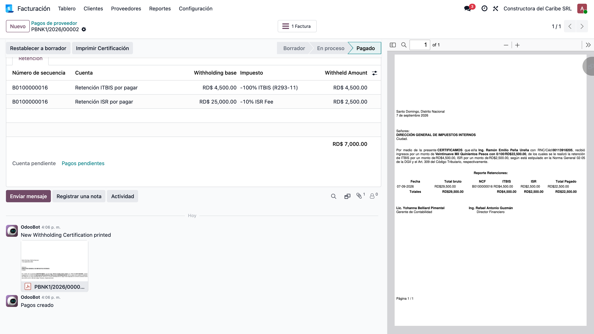

## 10. Encontrar los pagos que llevan certificado

**Contabilidad › Proveedores › Pagos**, filtro **Tiene Retención**. Deja en la lista sólo los pagos que el módulo marcó como certificables — los mismos que muestran el botón.

Es la forma práctica de trabajar el cierre de mes: se filtra el período, se listan los pagos con retención y se imprime el certificado de cada suplidor.

Los dos pagos de esta base aparecen aquí aunque su retención esté registrada de forma distinta: uno la lleva en el pago y el otro en la factura.

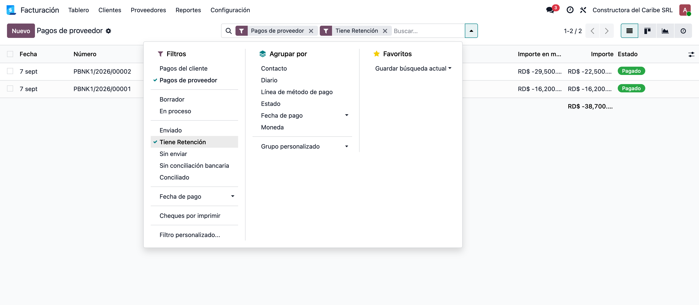

## 11. La otra forma: la retención va en la factura

Hasta la v17 —y así llegan las bases de datos migradas— la retención dominicana se aplicaba como un **impuesto negativo en la factura del suplidor**. La factura *B0100000015* está registrada así: RD$ 18,000.00 de honorarios + RD$ 3,240.00 de ITBIS − RD$ 3,240.00 de retención de ITBIS − RD$ 1,800.00 de retención de ISR, y su **total ya sale neto: RD$ 16,200.00**.

Su pago **no lleva ninguna línea de retención** —no había nada que retener al pagar, ya estaba descontado— y aun así el módulo lo detecta: recorre las facturas que el pago liquidó y suma los impuestos de retención asentados en ellas.

Ambas formas conviven. Un mismo pago puede llevar retención capturada en el pago y liquidar facturas que ya traían la suya: el certificado las suma sin que una tape a la otra.

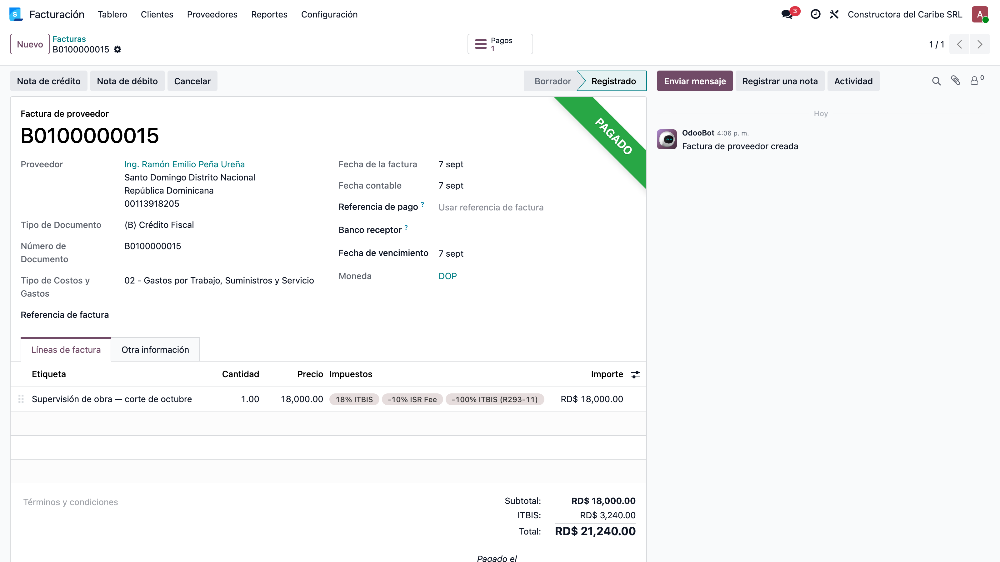

## 12. Su certificado, idéntico al del otro flujo

El certificado del pago de esa factura es el mismo documento, con las mismas columnas y la misma base legal. La única diferencia está en cómo se reconstruye el **Total bruto**: como la factura ya venía neta, el módulo le **suma de vuelta** la retención para poder informar lo facturado.

RD$ 16,200.00 de factura + RD$ 3,240.00 + RD$ 1,800.00 retenidos = **RD$ 21,240.00** de total bruto, que es la cifra que la DGII espera ver como ingreso del suplidor.

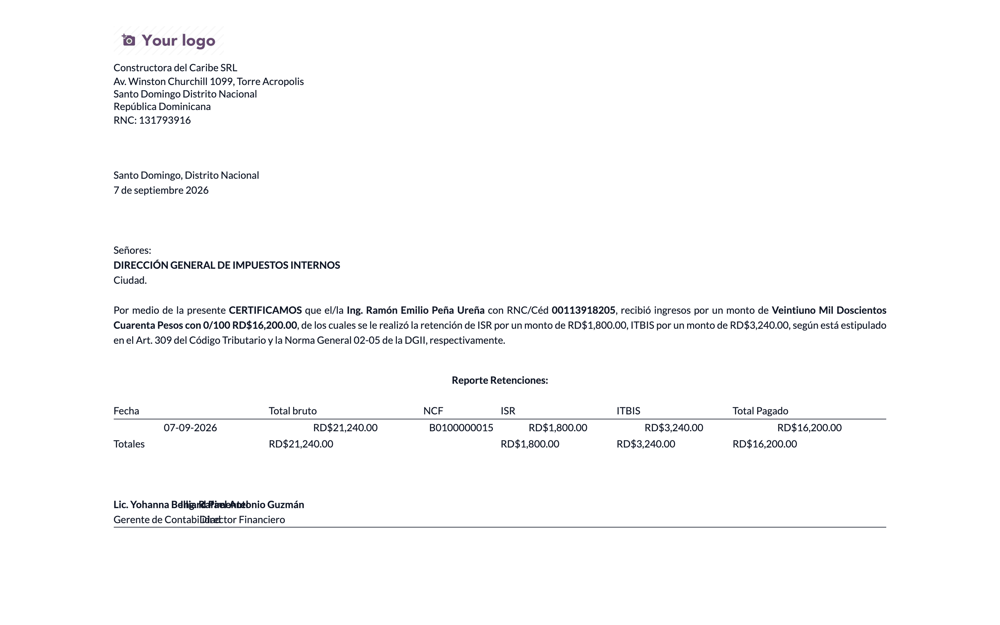

## 13. Cambiar a Sector público

En el mismo asistente de **Configurar apariencia del documento**, al poner el **Tipo de Certificación** en *Sector público* aparecen los tres campos que sólo usa el diseño institucional:

- **Mostrar cabecera** — imprime el encabezado con escudo nacional, logo de la institución, dirección, RNC y web.
- **Mostrar pie de página** — reserva el pie institucional.
- **Slogan del año** — el lema oficial del año, que va centrado sobre el texto del certificado.

Al guardar, el cambio aplica a **todos** los certificados de esa compañía, también a los que ya se habían impreso: el reporte se arma en el momento de imprimirlo.

## 14. El certificado institucional

Guardado el asistente, el mismo pago imprime la variante de sector público: **escudo nacional** junto al logo de la institución, su dirección y teléfono, la línea *PRESIDENCIA DE LA REPÚBLICA* con el RNC y la web, y el **lema del año** centrado sobre el texto.

El contenido no cambia — mismo párrafo, misma tabla, mismas firmas —; cambia el membrete. Volver a *Compañía privada* en el asistente devuelve el diseño estándar.

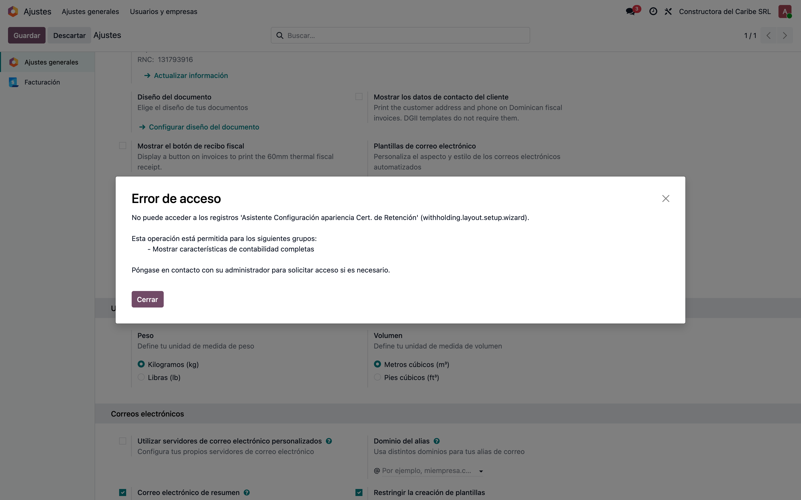

## 15. Si algo no sale

Los tres síntomas que se reportan siempre tienen la misma familia de causas.

**No aparece el botón Imprimir Certificación.** Es un único campo interno en falso. Se revisa en este orden: ¿el pago es **de proveedor** y está **publicado**? ¿El **país fiscal** de la compañía es República Dominicana? ¿Hay retención — líneas en el pago, o impuestos de retención en las facturas que liquida? En una base **migrada desde la v17**, además, las cuentas de retención tienen que quedar marcadas como tales: es lo que permite reconocer la retención asentada en la factura.

**El certificado sale en blanco.** Es el mismo campo: el reporte completo está condicionado a él, así que un pago no detectado imprime una página vacía en vez de un error. Se corrige igual que el punto anterior.

**Una columna sale sin nombre, o dos retenciones aparecen sumadas en una.** Las dos retenciones comparten cuenta contable, o a la cuenta le falta el **Nombre del impuesto**. Una cuenta por impuesto retenido, y las tres casillas llenas.

**Sale el error «No Withholding Certification Type found».** La compañía no tiene **Tipo de Certificación**. Se elige en el asistente del paso 4.

## Notas

**Bruto contra neto en el párrafo.** El párrafo de apertura imprime el monto **en letras en bruto** y la **cifra en neto** (lo transferido). Es así desde la versión 17 y se conserva a propósito para no cambiar un documento que los clientes ya presentan a la DGII; la tabla de abajo desglosa las dos cifras sin ambigüedad.

**Los números en letras.** Los genera la librería `num2words` en español, que escribe *«Veintiuno Mil»* donde el español dominicano diría *«Veintiún Mil»*. Es una limitación de la librería, no del módulo.

**El certificado no se envía a la DGII.** Es un documento informativo que se le entrega al suplidor; el reporte de las retenciones a la DGII va por el 606 y por el IR-17, que son otros módulos.

**Bases migradas desde la v17.** Odoo sólo recalcula un campo almacenado al actualizar cuando su columna es nueva, así que la actualización del módulo trae un script que vuelve a marcar en SQL todos los pagos históricos. Después de migrar conviene comprobar con el filtro **Tiene Retención** que la cantidad de pagos marcados cuadra con lo esperado.
