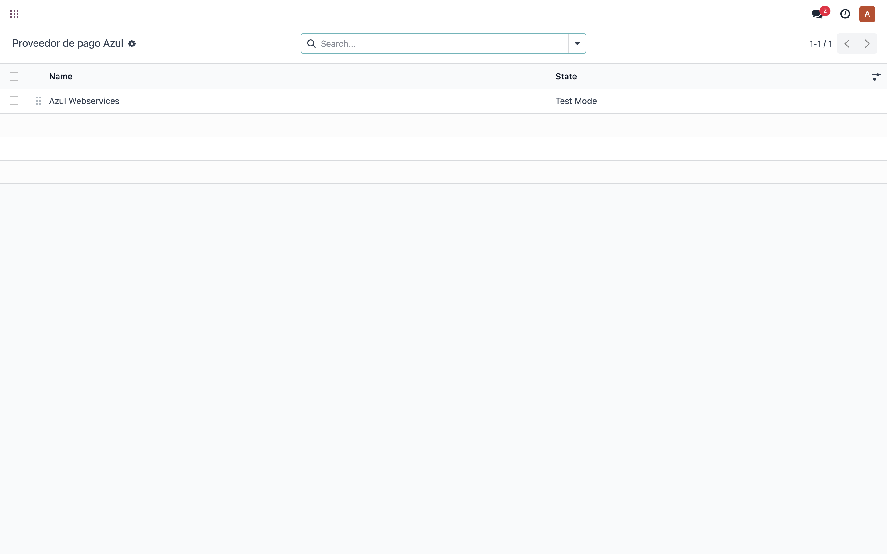
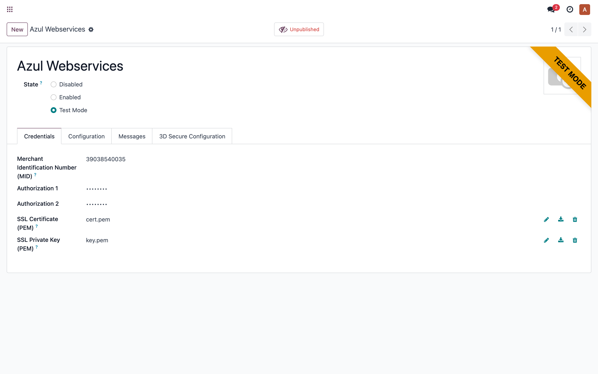
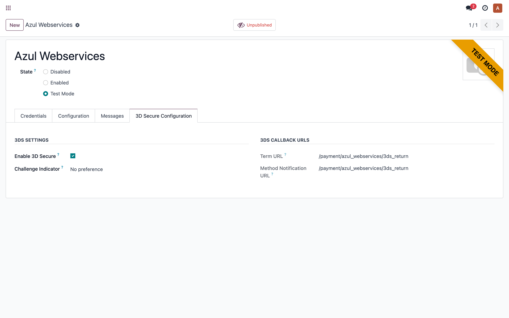

# Payment Provider: Azul Webservices — Prueba funcional

> Manual generado con `tools/manual-generator`. Las capturas se regeneran ejecutando el generador contra una base `test_v19_<módulo>`.

Prueba funcional (smoke) del proveedor de pago **Azul Webservices** en Odoo 17. Verifica que el módulo instala, que las vistas del proveedor renderizan sin error (pestaña de credenciales y pestaña **3D Secure Configuration**) y que la configuración de 3DS/callbacks se muestra correctamente. El proveedor se configura en estado *test* con credenciales de prueba.

## Requisitos previos

- Módulo instalado: payment_azul_webservices (depende de payment, website_sale).
- Dependencia python pyazul==3.2.1 disponible en el contenedor.
- Proveedor Azul en estado 'test' con credenciales de prueba (sembradas por el seed).

## 1. Proveedor de pago Azul en la lista

El proveedor **Azul Webservices** aparece en *Ajustes ▸ Proveedores de pago* en estado *Prueba*. Confirma que el registro se creó al instalar el módulo.

## 2. Credenciales de Azul

Formulario del proveedor, pestaña **Credenciales**: cuenta de comercio (Merchant Account), llaves de autenticación (Auth1/Auth2) y certificados PEM. Estos campos los agrega el módulo mediante herencia de la vista de `payment.provider`.

## 3. Configuración 3D Secure

Pestaña **3D Secure Configuration** que agrega el módulo: activación de 3DS, indicador de challenge y las URLs de callback (Term URL y Method Notification URL) en modo solo lectura. Verifica que la pestaña renderiza y muestra los valores por defecto de las rutas de 3DS.

## 4. Resultado de la prueba funcional

Si los tres pasos anteriores capturaron sus pantallas sin error, el módulo `payment_azul_webservices` está funcional en Odoo 17: instala, carga la dependencia `pyazul`, y las vistas heredadas del proveedor (credenciales + 3DS) renderizan. La lógica de 3DS multi-worker y el pago se validan por separado con las pruebas unitarias (`tests/test_stateless_3ds.py`).

## Notas

Esta es una prueba de humo de la interfaz de configuración. El flujo completo de checkout con 3DS (ACS/challenge) requiere el sandbox de Azul y una tarjeta de prueba y no se cubre aquí; su lógica de backend está cubierta por las pruebas unitarias del módulo.
