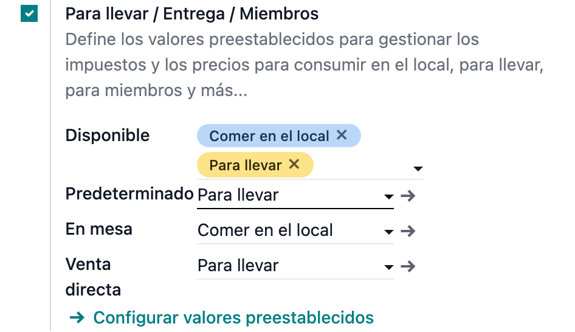
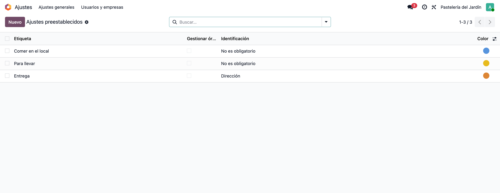
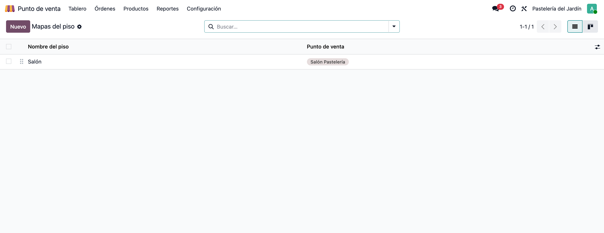
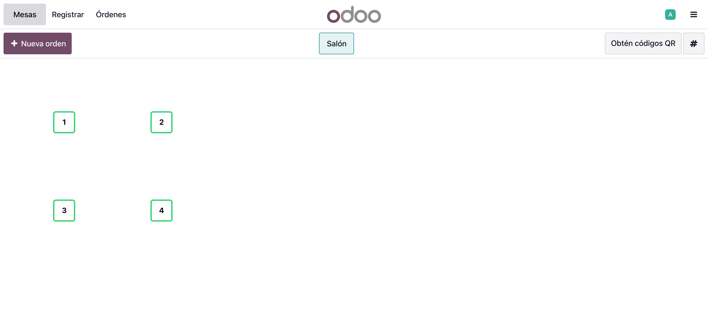
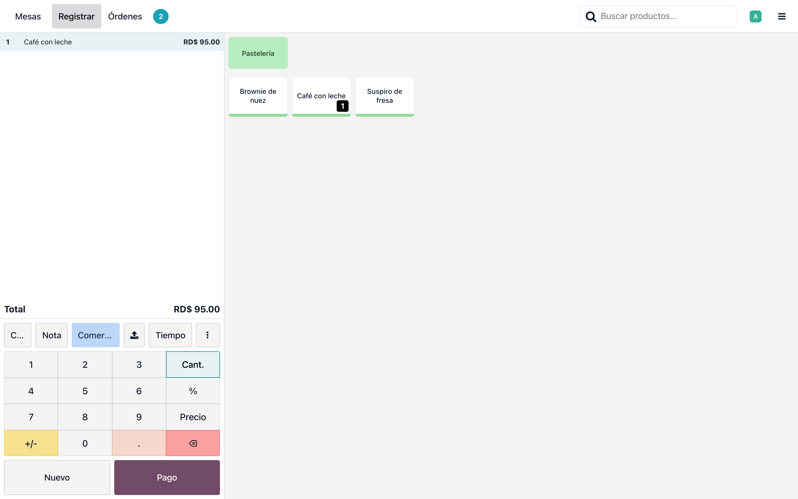
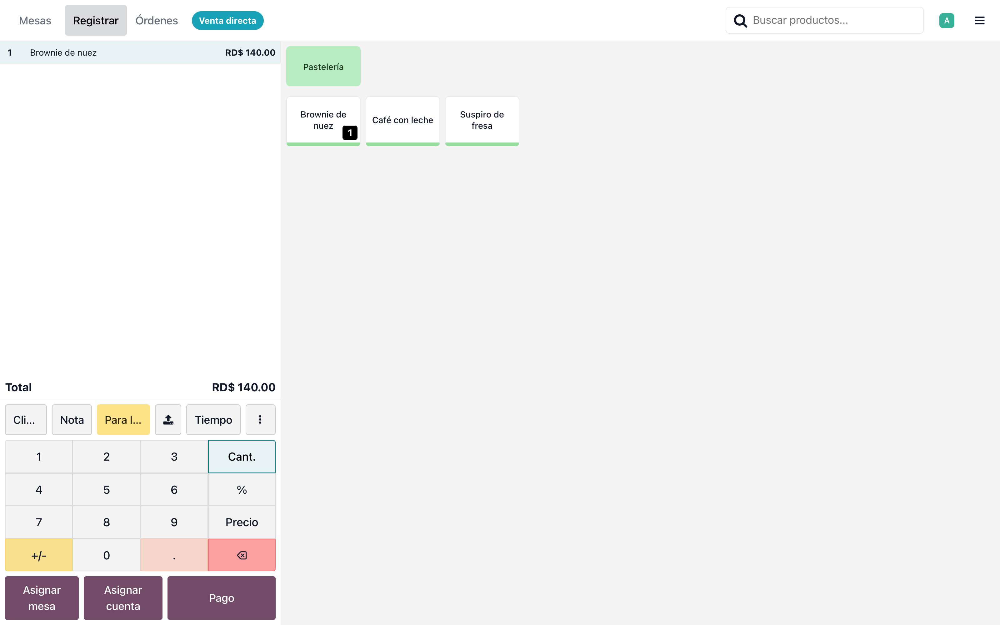
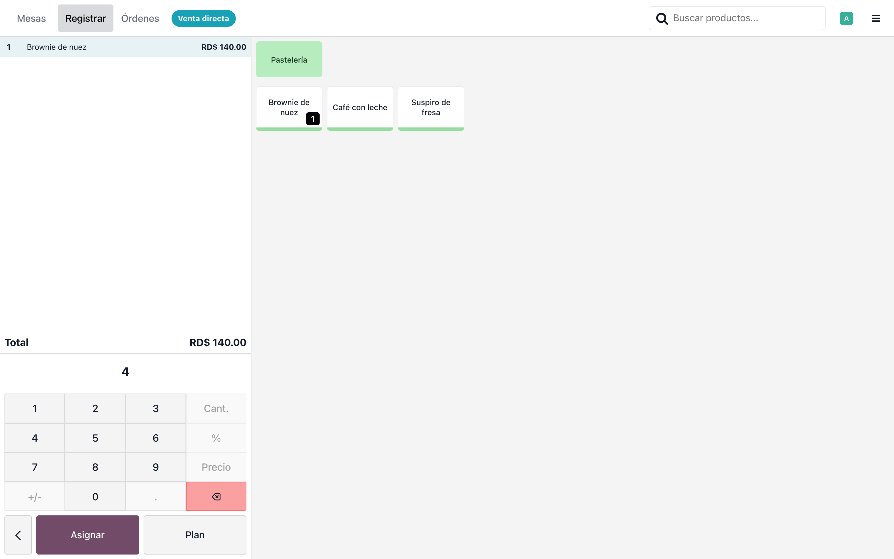
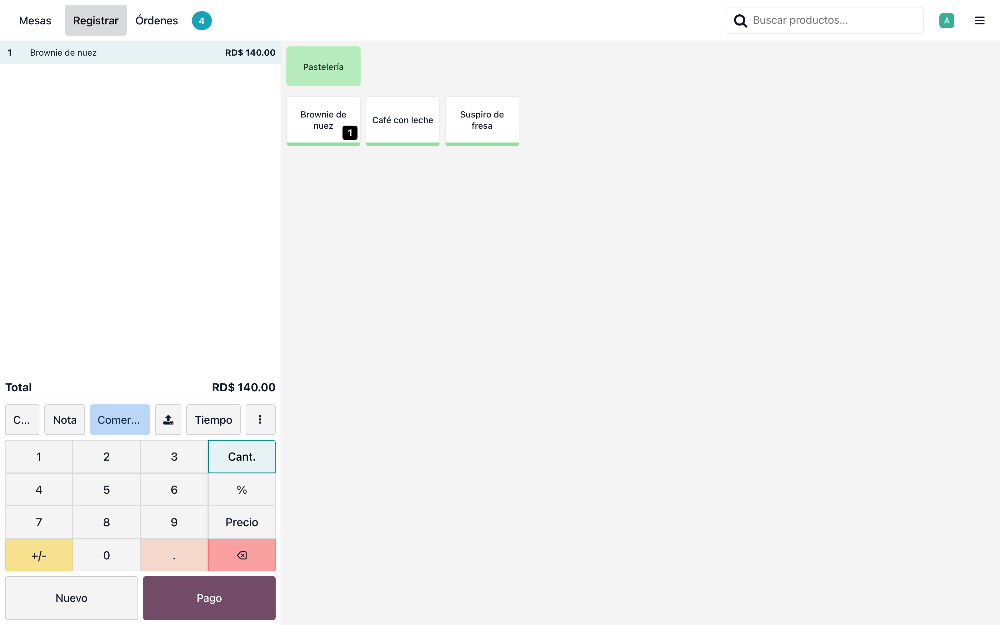
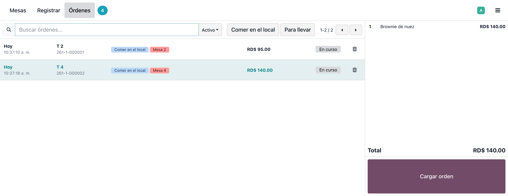
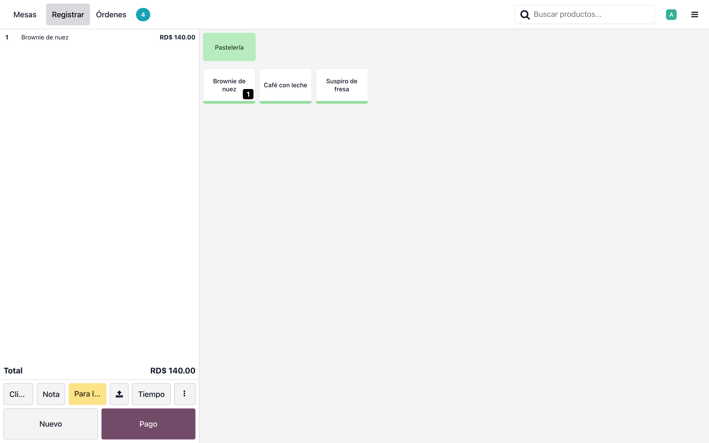

# Preajuste de PdV según el origen de la orden — Manual de usuario

> Manual generado con `tools/manual-generator`: `node capture.mjs --config=/Users/luisfernandez/repos/dev_env_odoo_pro-19/tools/manual-generator/configs/pos_preset_by_order_origin.json --db=test_v19_pos_preset_by_order_origin`. Las capturas se regeneran corriendo ese comando contra la base de pruebas.

El módulo **POS Preset by Order Origin** deduce el preajuste (*preset*) de cada orden del punto de venta a partir de su **origen**, en lugar de aplicar siempre el preajuste predeterminado:

- La orden que **nace en una mesa** toma el preajuste de mesa (*Comer en el local*).
- La orden que **nace sin mesa** —venta directa en el mostrador— toma el preajuste de venta directa (*Para llevar*).
- La venta directa que **después se lleva a una mesa** cambia sola al preajuste de mesa, y sus totales no se tocan.

El cajero conserva la última palabra: si elige el preajuste a mano, el automatismo se apaga para esa orden.

El preajuste es lo que determina la tarifa y la posición fiscal de la orden, así que dejarlo a criterio del cajero significaba en la práctica facturar consumo en el local con la configuración de para llevar (y al revés). Este módulo elimina ese paso manual.

**Base de datos de las capturas:** `test_v19_pos_preset_by_order_origin`, creada con `cd tools/manual-generator && ./generate-manual.sh --module=pos_preset_by_order_origin --keep-db` (usuario `admin`, clave `admin`).

## Requisitos previos

- Odoo 19 con `point_of_sale` y `pos_restaurant` instalados.
- Módulo `pos_preset_by_order_origin` instalado.
- El PdV en modo restaurante (**Es un bar/restaurante**) y con al menos un piso con mesas.
- Preajustes activados en el PdV (**Para llevar / Entrega / Miembros**) y los dos preajustes del flujo en la lista *Disponible*.

## 1. Los dos ajustes nuevos

**Ajustes → Punto de venta → Para llevar / Entrega / Miembros**. Debajo de *Predeterminado* aparecen los dos campos que publica el módulo:

- **En mesa**: el preajuste que se aplica a las órdenes que nacen en una mesa o que se llevan a una mesa.
- **Venta directa**: el que se aplica a las órdenes que nacen sin mesa.

Los dos sólo ofrecen preajustes de la lista *Disponible*, y sólo se muestran cuando el PdV está en modo restaurante.

*Predeterminado* debe coincidir con **Venta directa**: es la condición que usa Odoo para que una venta directa vacía adopte la mesa que el cajero acaba de tocar, en lugar de dejar una orden vacía suelta en las pestañas.

## 2. Preajustes silenciosos

**Punto de venta → Configuración → Preajustes**. El módulo asigna el preajuste mientras la orden se crea, sin pasar por los diálogos del flujo nativo. Por eso los dos preajustes del flujo deben venir **sin preguntas**:

- *Identificación* = **No requerida** (con *Nombre* Odoo pide un nombre en cada orden; así viene de fábrica el preajuste *Para llevar*).
- *Gestionar órdenes por tiempo* **apagado** (si no, pide franja horaria).
- *Modo de devolución* apagado, y la **misma** tarifa y posición fiscal en los dos.

Si un preajuste conserva la identificación o la franja horaria, la orden se crea sin ese dato y Odoo lo reclama más adelante, al momento de cobrar.

## 3. El piso y las mesas

**Punto de venta → Configuración → Mapa de pisos y mesas**. Sin mesas no hay origen que distinguir: el escenario de la orden en mesa y el del traslado no existen, y el módulo se comporta como Odoo de fábrica.

En las capturas se usa un piso *Salón* con cuatro mesas.

## 4. Abrir el punto de venta

Al abrir la caja registradora el PdV entra al plano de mesas. Desde aquí salen los dos orígenes posibles: tocar una mesa o crear una **Nueva orden** (venta directa en el mostrador).

## 5. Orden que nace en una mesa

Se toca la mesa 2 y se captura un *Café con leche*. La orden nace con el preajuste **Comer en el local** —el botón de preajuste, en la fila de acciones de la comanda— sin que el cajero elija nada y sin ningún diálogo de por medio.

El botón recorta la etiqueta cuando el nombre es largo; el nombre completo del preajuste de cada orden se ve en **Órdenes** (paso 9).

## 6. Venta directa en el mostrador

De vuelta al plano (**Mesas**) y con **Nueva orden** se crea una venta directa: una orden sin mesa. Se captura un *Brownie de nuez* (RD$ 140.00).

El preajuste aplicado es **Para llevar**, y la etiqueta *Venta directa* de la barra superior confirma el origen de la orden.

## 7. El cliente se queda: asignar una mesa

El cliente decide quedarse. Con **Asignar mesa** se escribe el número de la mesa —la 4— y se confirma con **Asignar**.

Éste es el tercer escenario, y el que más se repite en el mostrador: la orden ya existe, ya tiene líneas, y su origen cambia a mitad de camino.

## 8. La orden pasa a Comer en el local

Al asignar la mesa 4 el preajuste cambia solo a **Comer en el local** y el total sigue siendo **RD$ 140.00**: el traslado no re-precia la orden, porque los dos preajustes comparten tarifa y posición fiscal.

Si cada preajuste tuviera su propia tarifa, este paso recalcularía los precios de las líneas ya capturadas. Es la razón por la que la configuración insiste en dejar la misma tarifa en los dos.

## 9. El preajuste de cada orden, en una sola pantalla

**Órdenes** lista las órdenes abiertas con el preajuste de cada una en una etiqueta de color. Se ven las dos del ejemplo, ambas ya de mesa y con **Comer en el local**: la que nació en la mesa 2 y la venta directa que acabó en la mesa 4.

Es la pantalla donde conviene verificar el resultado: el botón de la comanda recorta los nombres largos, esta etiqueta no.

## 10. El cajero conserva la última palabra

El botón de preajuste sigue funcionando. Aquí se pasa la orden de la mesa 4 a **Para llevar** a mano —el cliente cambió de idea y se lleva el pedido—. A partir de ese momento el automatismo no vuelve a corregir esa orden: se sale al plano de mesas, se vuelve a entrar a la mesa 4 y la elección manual se mantiene.

Es una decisión por orden: la siguiente orden de esa misma mesa vuelve a nacer como *Comer en el local*.

## 11. Qué no hace el módulo

- **No cambia tarifas ni posiciones fiscales por su cuenta.** Aplica el preajuste con el mismo mecanismo del flujo nativo, que arrastra la tarifa y la posición fiscal del preajuste. Con tarifas distintas, trasladar una orden ya capturada a una mesa **re-precia** sus líneas.
- **No pide identificación ni franja horaria al crear la orden.** Se salta a propósito los diálogos del preajuste; Odoo los sigue exigiendo antes de cobrar, sólo que más adelante en el flujo.
- **Pantalla de cocina.** Cambiar el preajuste después de enviar la orden a preparación se ve en la pantalla de cocina como un cambio de la orden.
- **No toca la numeración fiscal.** El preajuste no participa en el NCF/e-CF ni en el asiento de cierre de sesión.
- **Fuera de alcance:** autopedido por celular y quioscos (`pos_self_order`).

Sin modo restaurante, o con los preajustes desactivados, el módulo queda inerte y el punto de venta se comporta exactamente como de fábrica.

## Notas

**Pruebas.** `docker exec <contenedor> odoo -d <base> --db_host=odoo-db --db_port=5432 --db_user=odoo --db_password=odoo_password --test-enable --test-tags=/pos_preset_by_order_origin --stop-after-init --workers=0 --http-port=8079` corre las dos pruebas Python y el tour `PresetByOriginTour`. Las 6 pruebas unitarias Hoot van por el suite de `web`: `--test-tags="/web:WebSuite.test_unit_desktop[@pos_preset_by_order_origin]"`. El contenedor necesita `websocket-client` y un Chrome (`ODOO_BROWSER_BIN`) para las pruebas con navegador.

**Mantenimiento.** El módulo parchea cuatro métodos del frontend del PdV: `createNewOrder` y `selectPreset` (`point_of_sale`), `setTable` y `prepareOrderTransfer` (`pos_restaurant`). En cada migración mayor hay que verificar que sigan existiendo con la misma firma. La dependencia de `pos_restaurant` es obligatoria: los parches envuelven a los de ese módulo por cadena de prototipos, y eso sólo funciona si los assets se cargan después.
