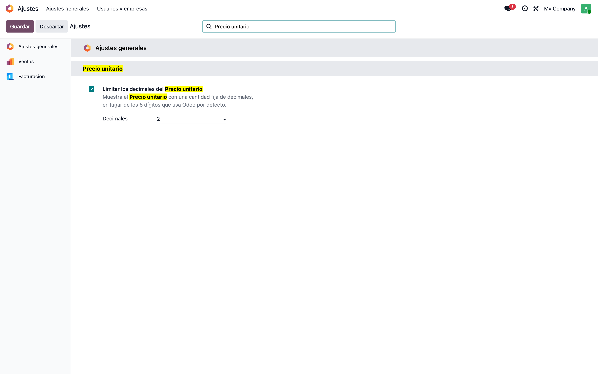
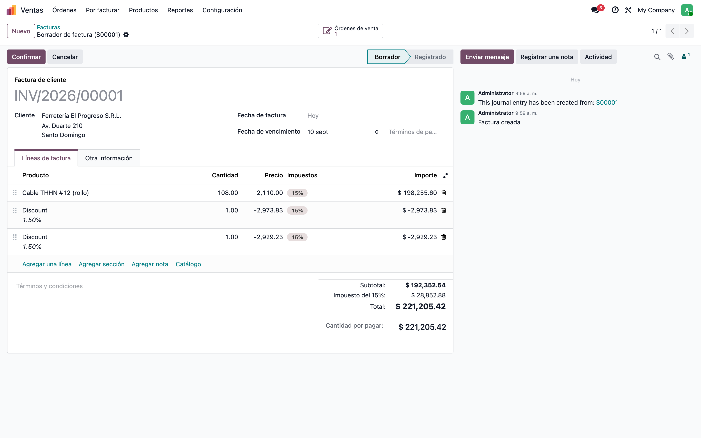
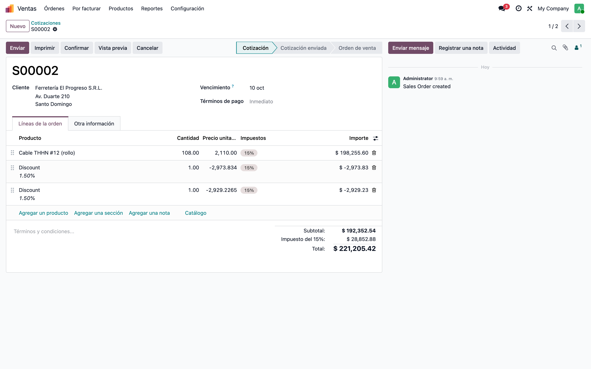

# Decimales del Precio unitario — Manual de usuario

> Manual generado con `tools/manual-generator`: `node capture.mjs --config=configs/price_unit_display_precision.json --db=test_v19_price_unit_display_precision`. Las capturas se regeneran corriendo ese comando contra la base de pruebas.

El módulo `price_unit_display_precision` controla **cuántos decimales se muestran en el Precio unitario**, en todas las vistas de Odoo y sin importar el módulo: cotizaciones, pedidos de venta, facturas, órdenes de compra, gastos, movimientos de inventario y cualquier documento que agregue otra aplicación. Odoo 19 muestra hasta 6 decimales en esa columna —`price_unit` dejó de redondearse y el cliente web cae en una precisión fija de 6 dígitos—, así que un descuento global encadenado se ve como `-2,973.834` en lugar de `-2,973.83`. Con el módulo instalado la columna sale con 2 decimales, la cantidad es configurable de 0 a 6 y el ajuste se puede apagar para volver al comportamiento nativo. Es **presentación solamente**: los valores guardados, los subtotales y los totales no se tocan.

## Requisitos previos

- Ninguna app en particular: el módulo solo depende de **base_setup** y aplica el ajuste a cualquier vista que muestre un Precio unitario, esté o no instalada la app cuando se instala el módulo.
- Permisos de **Administración: Ajustes** para cambiar la cantidad de decimales; ver los documentos no requiere nada extra.

## 1. El ajuste: Ajustes generales → Precio unitario

**Ajustes → Ajustes generales**, sección **Precio unitario** (se llega rápido escribiendo *Precio unitario* en el buscador de los ajustes). Dos controles:

- **Limitar los decimales del Precio unitario**: viene **encendido** al instalar el módulo. Apagarlo devuelve el comportamiento nativo de Odoo.
- **Decimales**: de 0 a 6, con **2** por defecto.

El cambio aplica al momento, sin reiniciar el servidor, y vale para todos los usuarios y compañías: los dos valores se guardan como parámetros del sistema (`price_unit_display_precision.enabled` y `price_unit_display_precision.digits`).

## 2. Cotización — Precio unitario con 2 decimales

**Ventas → Cotizaciones.** La cotización del ejemplo tiene un rollo de cable a 2,110.00 por 108 unidades, un 13% de descuento en la línea y **dos descuentos globales de 1.5%** aplicados uno tras otro. Las líneas de descuento quedan guardadas con `-2973.834` y `-2929.22649`, pero la columna **Precio unitario** muestra `-2,973.83` y `-2,929.23`. El **Subtotal** y el **Total** son idénticos con y sin el módulo: siempre estuvieron a la precisión de la moneda.

## 3. Factura de cliente — el mismo criterio

**Facturación → Clientes → Facturas.** Al facturar el pedido, los precios unitarios con decimales de más viajan tal cual a la factura: `account.move.line.price_unit` está declarado igual que el de la venta, así que sin el módulo la factura también mostraría 6 decimales. Con el módulo, la columna de precio de la factura (etiquetada **Precio**) —en la lista de líneas, en el formulario de la línea expandida y en la tarjeta móvil— usa los mismos 2 decimales. Aplica igual a notas de crédito, facturas de proveedor y rectificativas.

## 4. Cambiar la cantidad de decimales

En **Ajustes generales → Precio unitario** se pone **Decimales** en `4` y se guarda. La misma cotización pasa a mostrar `-2,973.834` y `-2,929.2265`: el valor guardado no cambió, solo cuántos decimales se muestran. Los ceros finales no se imprimen —el mínimo son los 2 decimales de *Product Price*—, así que 4 decimales significa «hasta 4». Sirve para negocios que cotizan por metro, litro o kilo, donde el precio unitario real lleva 3 o 4 decimales.

## 5. Apagar el ajuste — comportamiento nativo

Al desmarcar **Limitar los decimales del Precio unitario** y guardar, la misma cotización vuelve a mostrar los 6 decimales de Odoo: `-2,973.834` y `-2,929.22649`. Es la comparación que conviene tener a mano para explicar qué hace el módulo, y la salida de emergencia si en algún momento hace falta ver el valor completo sin desinstalar nada.

## 6. Qué cubre y qué no

**Cubre** el Precio unitario en pantalla de **cualquier modelo y cualquier tipo de vista** —lista, formulario, línea expandida, tarjeta móvil y sub-vistas embebidas—: cotizaciones, pedidos de venta, facturas de cliente, notas de crédito, facturas de proveedor, rectificativas, apuntes contables, **órdenes de compra**, **gastos**, **movimientos de inventario** y las columnas que agreguen otros módulos o Studio. No hace falta ningún módulo puente: el ajuste se aplica sobre la vista ya armada, desde el modelo abstracto `base` que heredan todos los modelos.

**No cubre:**

- **Pantallas del Punto de Venta**: el cliente del POS arma su propia interfaz con los datos del ORM y no pasa por `get_view`, así que el ajuste no le llega. Las vistas de back-office de `pos.order` sí quedan cubiertas.
- **Portal del cliente**: ya sale con 2 decimales por su cuenta (imprime el precio con el widget monetario).
- **PDF de la cotización y de la factura**: imprimen `price_unit` con la precisión del campo, así que muestran los decimales de más. Se corrige en la plantilla del reporte —o en el editor de reportes de Studio si el reporte fue personalizado ahí— con `t-options='{"widget": "float", "decimal_precision": "Product Price"}'`.

## Notas

- **Nada se redondea en la base de datos.** El módulo solo cambia la vista: `price_unit` sigue guardando el valor completo, y los subtotales y totales (`price_subtotal`, `amount_untaxed`, `amount_total`) nunca tuvieron el problema porque son campos monetarios.
- **Por qué pasa**: Odoo 19 declara `price_unit` con `min_display_digits='Product Price'` en lugar de `digits='Product Price'`. `min_display_digits` fija el mínimo de decimales a mostrar, no el máximo, y deja el campo sin redondeo; cuando la vista no trae `digits`, el formateador del cliente web usa una precisión fija de 6. La configuración *Precisión decimal → Product Price* no influye en ese caso.
- **Alcance global sin módulos puente.** El módulo extiende `_get_view` en el modelo abstracto `base` —el que heredan implícitamente todos los modelos— y escribe el atributo `digits` sobre los nodos `price_unit` de la vista ya armada. Por eso cubre módulos que ni existían cuando se instaló, y respeta la vista que ya traiga un `digits` propio.
- **Decimales por debajo de la precisión de *Product Price*.** El cliente web quita los ceros finales y luego rellena hasta `min_display_digits`. Con *Decimales* en `1` y *Product Price* en `2`, `1.55` se ve `1.60`: redondeado a 1 decimal y rellenado a 2. Con `0` o con `2` o más el comportamiento es el esperado.
- **El ajuste es global**, no por usuario ni por compañía: se guarda en parámetros del sistema. La caché de vistas se limpia al guardar los ajustes, así que el cambio se ve al recargar la página, sin reiniciar.
- **Decimales = 0** muestra el precio unitario redondeado a entero en pantalla. Sigue siendo presentación: el valor guardado no cambia.
- **Si el ajuste no aparece**: requiere permisos de *Administración: Ajustes*. Si aparece pero la columna no cambia, recargar la página con Ctrl+F5 (el cliente web guarda la definición de la vista en caché del navegador).
