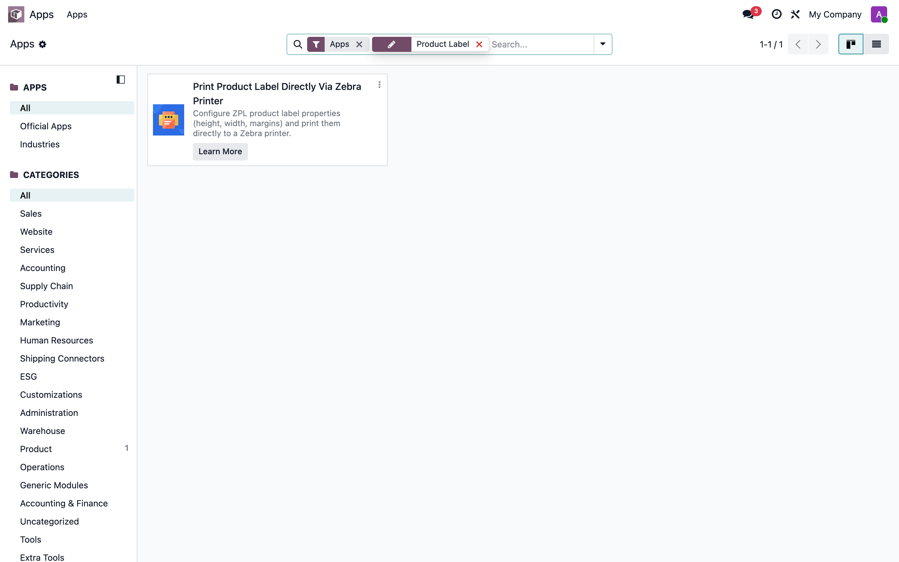
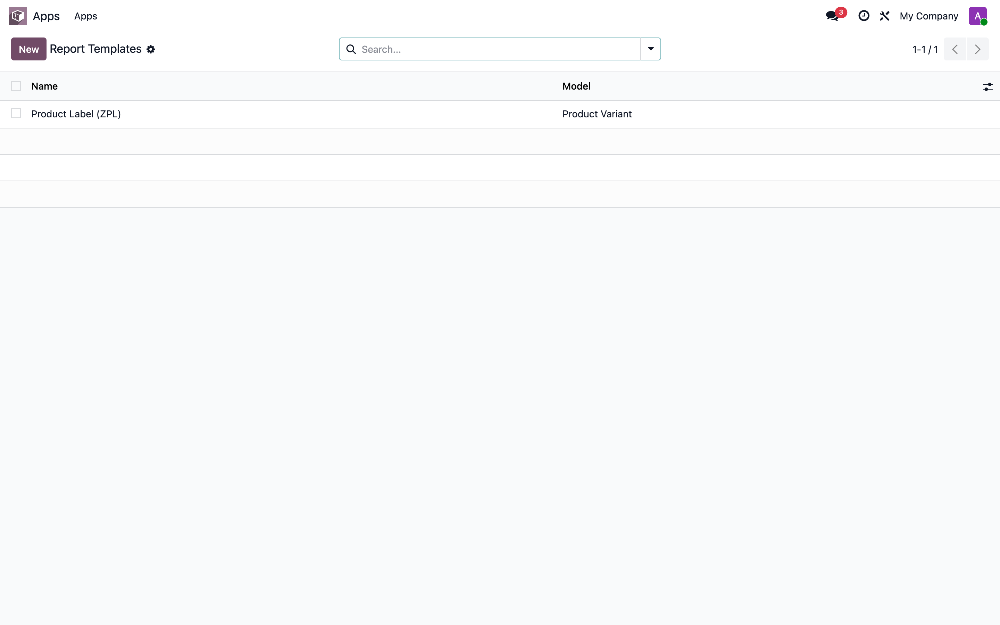
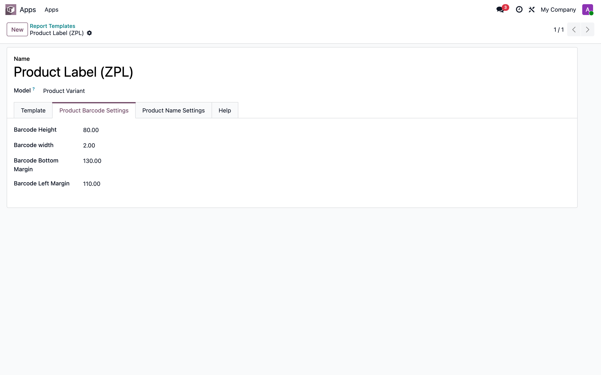
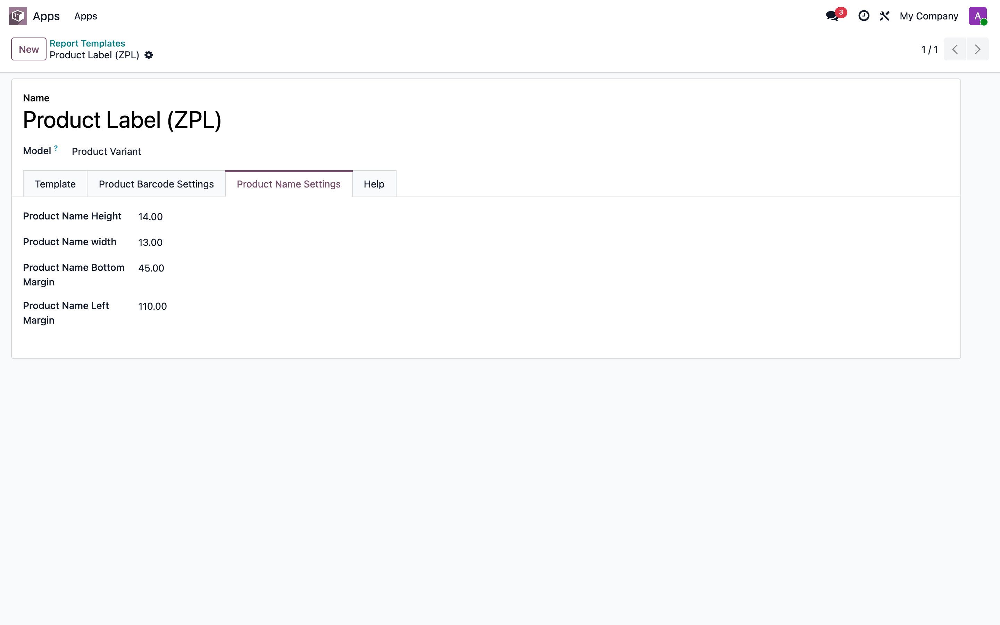
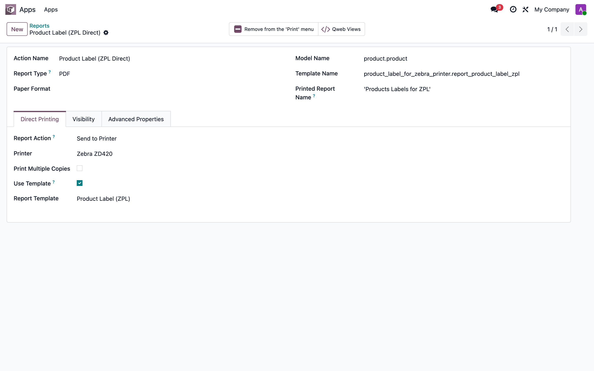
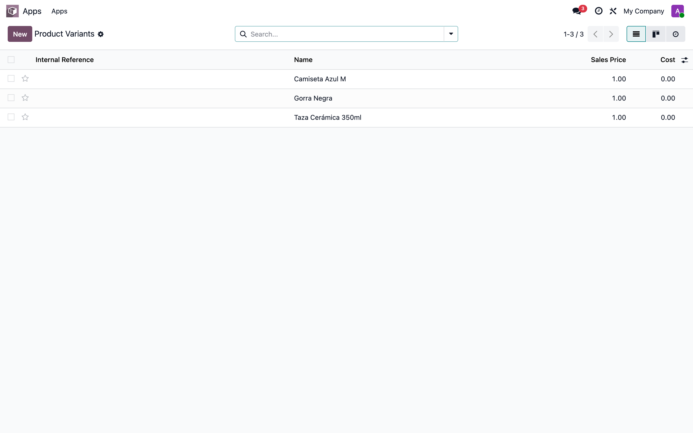

# Print Product Label Directly Via Zebra Printer — Manual de usuario

> Manual generado con `tools/manual-generator`. Las capturas se regeneran ejecutando el generador contra una base `test_v19_<módulo>`.

Este módulo extiende **Report ZPL Direct Print** para imprimir **etiquetas de producto** en impresoras Zebra (ZPL). Añade a las plantillas de etiqueta los parámetros de geometría del código de barras y del nombre del producto (altura, ancho, márgenes), y trae lista una plantilla y un reporte de etiqueta de producto enlazados al menú **Imprimir** de los productos.

Depende de `product` y de `report_zpl_direct_print`. Este manual cubre la instalación y la configuración dentro de Odoo; la impresión física se ejecuta contra la app de escritorio QZ Tray (se describe al final).

## Requisitos previos

- El módulo `report_zpl_direct_print` instalado (se instala automáticamente como dependencia).
- La librería Python `zplgrf` en el servidor (`pip install zplgrf`), solo para la ruta PDF→ZPL.
- QZ Tray instalado y corriendo en la PC del usuario, con la impresora Zebra dada de alta.
- Modo desarrollador activado para ver los menús técnicos de Plantillas e Informes.

## 1. Instalación del módulo

En **Aplicaciones**, busca «Product Label» (o «Zebra») y pulsa **Activar/Instalar** en *Print Product Label Directly Via Zebra Printer*. Al instalarlo se instala también su dependencia *Report ZPL Direct Print* y se crean la plantilla y el reporte de etiqueta de producto.

## 2. Plantilla de etiqueta de producto

Ve a **Ajustes → Técnico → Informes → Report Templates**. El módulo trae creada la plantilla **Product Label (ZPL)**, sobre el modelo *Producto*.

## 3. Parámetros del código de barras

Abre la plantilla **Product Label (ZPL)** y entra en la pestaña **Product Barcode Settings**. Aquí defines la geometría del código de barras (alto, ancho y márgenes inferior/izquierdo). Estos valores se inyectan en la plantilla mediante los marcadores `{template_id.barcode_*}`.

## 4. Parámetros del nombre de producto

En la misma plantilla, la pestaña **Product Name Settings** define la geometría del texto del nombre del producto (alto, ancho y márgenes), inyectada mediante `{template_id.product_*}`.

## 5. Reporte de etiqueta de producto

El módulo trae el reporte **Product Label (ZPL Direct)** (modelo *Producto*) ya configurado para impresión directa: pestaña **Direct Printing** con *Report Action* = **Send to Printer** y **Use Template** apuntando a *Product Label (ZPL)*. Solo falta asignar la **Impresora**.

## 6. Productos a etiquetar

Ve a **Inventario/Ventas → Productos** (variantes de producto). Selecciona uno o varios productos para imprimir su etiqueta.

## 7. Imprimir la etiqueta

Con productos seleccionados, usa el botón **Imprimir** de la barra de acciones y elige **Product Label (ZPL Direct)**. Odoo no descarga PDF: se conecta a QZ Tray y envía la etiqueta a la impresora Zebra; si la impresora configurada no está disponible, aparece un diálogo para elegirla.

> Este paso depende de QZ Tray (app de escritorio) y no se captura en este manual; valida la configuración dentro de Odoo y prueba en una estación con QZ Tray.

## Notas

La geometría (alto/ancho/márgenes) se rellena en la plantilla con `safe_eval` a partir de los campos de las pestañas *Product Barcode Settings* / *Product Name Settings* (`{template_id.<campo>}`), y los datos del producto con `{object.<campo>}` (p. ej. `{object.name}`, `{object.barcode}`).
