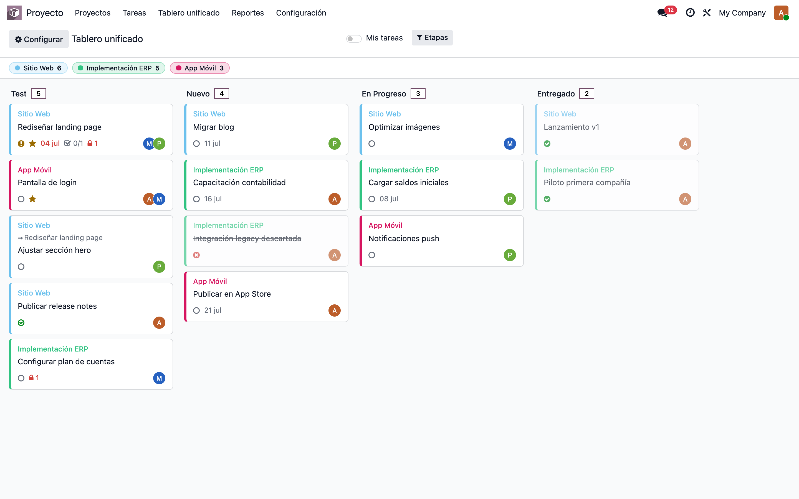
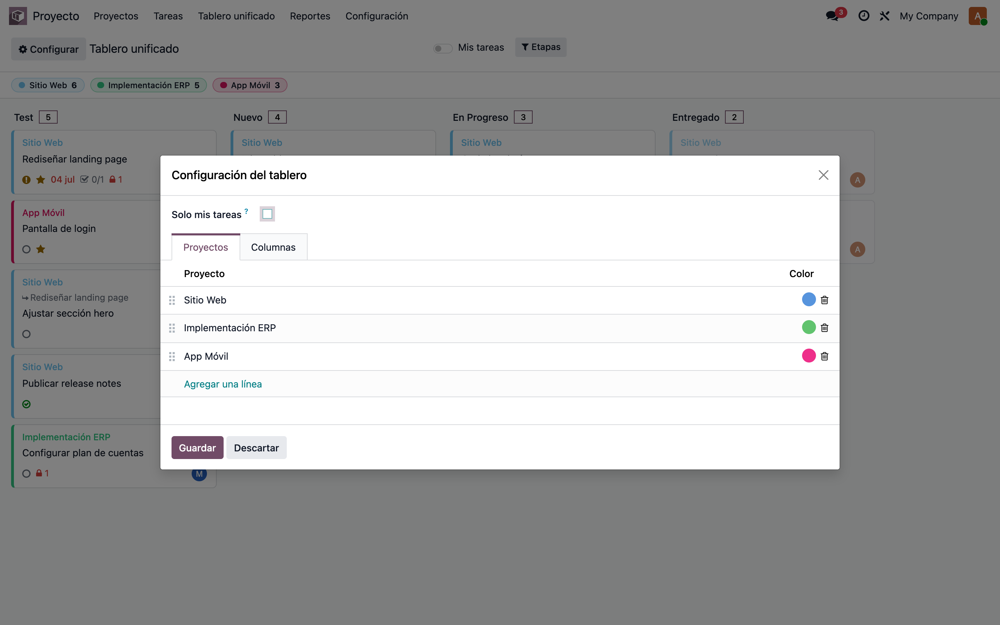
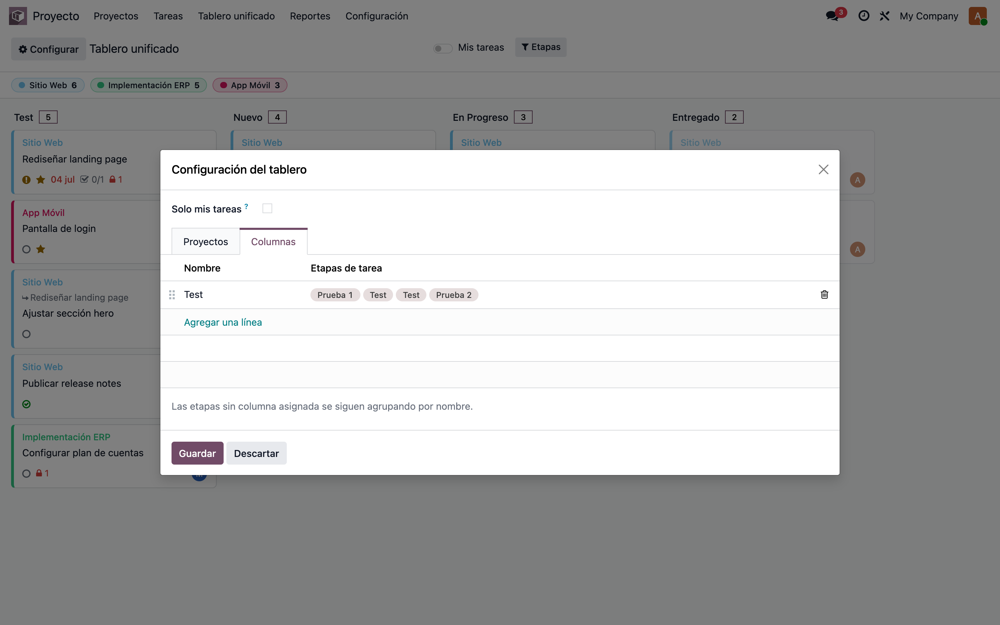
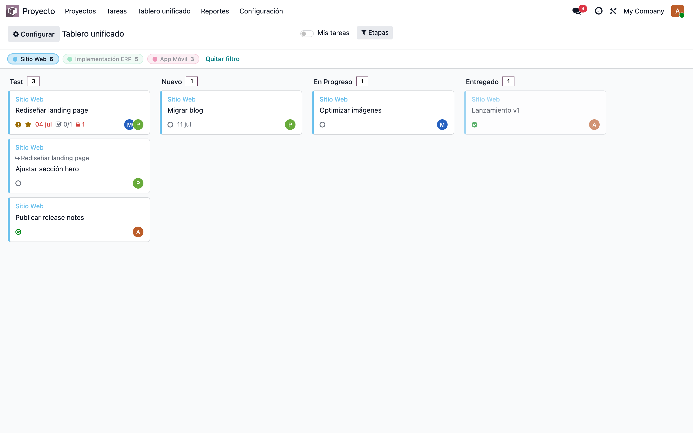
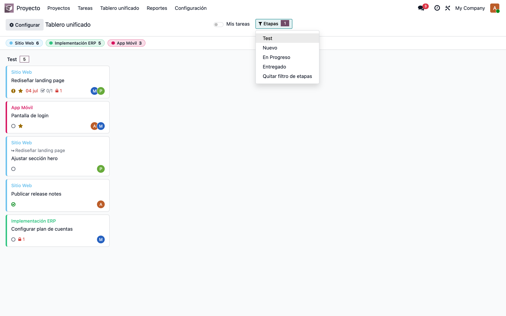
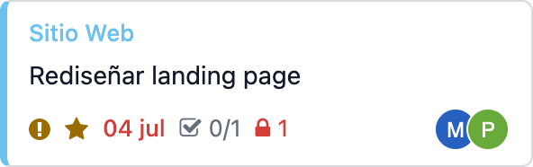
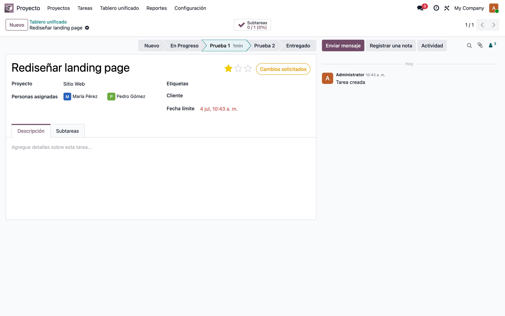
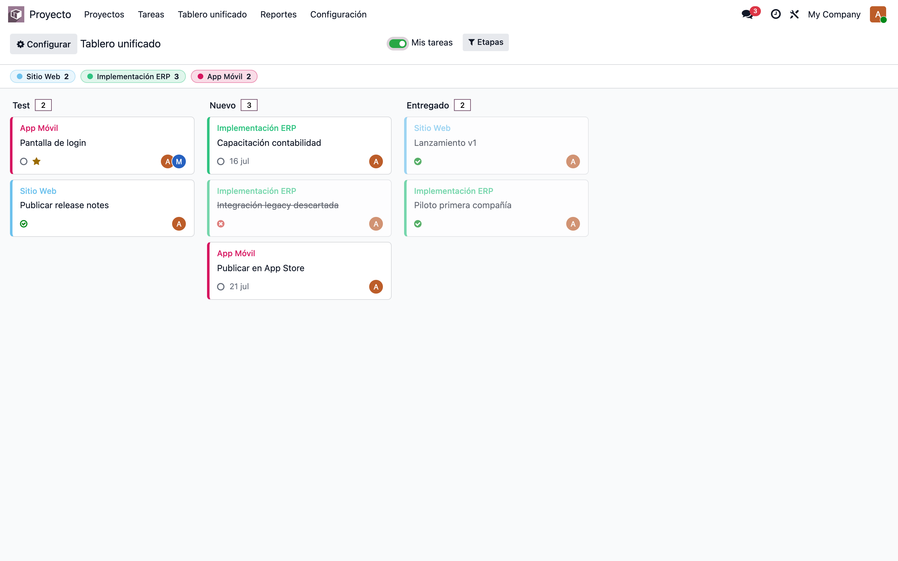

# Tablero Unificado de Proyectos — Manual de usuario

> Manual generado con `tools/manual-generator`. Las capturas se regeneran ejecutando el generador contra una base `test_v19_<módulo>`.

El módulo `project_unified_board` agrega la vista **Proyecto → Tablero unificado**: un tablero tipo kanban que muestra en una sola pantalla las tareas de varios proyectos, con las etapas unificadas en columnas. Cada usuario configura su propio tablero (proyectos, colores y columnas) y el módulo respeta al 100% los permisos nativos de Proyecto: nadie ve por esta vía nada que no vería en la app estándar (privacidad de proyecto, multicompañía, dependencias).

## Requisitos previos

- Grupo **Proyecto / Usuario** (`project.group_project_user`) — sin él no se ve el menú ni se puede consultar el tablero.
- Al menos un proyecto visible para el usuario.
- Traducción es_DO incluida (activar el idioma en las preferencias del usuario).

## 1. El tablero unificado

**Proyecto → Tablero unificado.** Arriba, un *chip* por proyecto con su color y el total de tareas. Las columnas agrupan etapas: la columna personalizada **Test** (configurada por el usuario) reúne las etapas *Prueba 1* y *Prueba 2* del Sitio Web y los *Test* de ERP y App Móvil; las demás etapas (*Nuevo*, *En Progreso*, *Entregado*) se fusionan automáticamente por nombre. Desplazamiento horizontal entre columnas y vertical dentro de cada una.

## 2. Configuración — pestaña Proyectos

Botón **Configurar** (engranaje). En la pestaña *Proyectos* se agregan los proyectos del tablero: cada línea tiene su **color** (selector estándar de Odoo, independiente del color kanban del proyecto) y se reordena arrastrando el manubrio. El desplegable excluye los proyectos ya agregados y los que el usuario no puede ver. La preferencia **Solo mis tareas** también se guarda aquí.

## 3. Configuración — pestaña Columnas

En la pestaña *Columnas* se definen columnas propias: **nombre**, orden y las **etapas de tarea** que caen en ella. Aquí la columna *Test* agrupa las etapas *Prueba 1* y *Prueba 2* del Sitio Web junto con los *Test* de los otros proyectos. Reglas: una etapa solo puede estar en una columna (el desplegable excluye las ya usadas), solo se ofrecen etapas de los proyectos del tablero, y las etapas sin mapear siguen agrupándose por nombre automáticamente.

## 4. Filtrar por proyecto (chips)

Los chips del encabezado son **filtros**: clic en uno para ver solo ese proyecto (multi-selección haciendo clic en varios; clic de nuevo para quitarlo). El chip activo se resalta con un anillo de su color, el resto se atenúa y aparece el enlace *Quitar filtro*. Las columnas que quedan vacías se ocultan solas. El filtro es instantáneo (no recarga) y se restablece al salir de la vista.

## 5. Filtrar por etapas (columnas)

El desplegable **Etapas** del panel de control permite mostrar solo ciertas columnas (casillas multi-selección, con contador en el botón). *Quitar filtro de etapas* restablece. Igual que el filtro de proyectos, es un filtro rápido de sesión.

## 6. Anatomía de la tarjeta

Cada tarjeta resume la tarea: **borde y proyecto** con el color configurado; **icono de estado** interno (`○` En curso, `!` naranja Cambios solicitados, `✓` verde Aprobado, reloj azul En espera, `✓` relleno Hecho, `✗` rojo Cancelado — hechas/canceladas se atenúan y las canceladas van tachadas); `★` prioridad alta; **fecha límite** (rojo si vencida); `☑ n/m` subtareas cerradas/total; `🔒 n` en rojo, cantidad de tareas abiertas que la bloquean; y los **avatares** de los asignados. Las subtareas muestran `↳` con su tarea padre. Clic en la tarjeta abre la tarea.

## 7. Abrir la tarea

Clic en cualquier tarjeta abre el **formulario nativo** de la tarea (no una copia): editas etapa, asignados o estado ahí, y la miga de pan regresa al tablero, que se recarga con los cambios.

## 8. Interruptor "Mis tareas"

El interruptor **Mis tareas** deja solo las tareas donde el usuario está asignado. A diferencia de los filtros rápidos, esta preferencia **sí se guarda** en la configuración del usuario. Observa cómo los contadores de los chips se actualizan.

## 9. Permisos y multicompañía

El tablero **no usa permisos propios**: aplica las mismas reglas que la app de Proyecto. El menú solo aparece con el grupo *Proyecto / Usuario*; los proyectos privados (*visibilidad: usuarios invitados*) no salen ni en el tablero ni en el desplegable de configuración si el usuario no está invitado; en multicompañía solo se ven proyectos de las compañías activas en el selector, y si el tablero mezcla compañías cada tarjeta muestra una etiqueta con la suya. Si un usuario pierde acceso a un proyecto configurado, este desaparece del tablero en silencio (sin errores) y vuelve al recuperar el acceso. El contador de bloqueos solo cuenta tareas bloqueadoras que el usuario puede leer.

## Notas

- Las tarjetas son de **solo lectura** (sin arrastrar entre columnas): una columna puede agrupar etapas de varios proyectos, así que el destino sería ambiguo; el cambio de etapa se hace en la tarea.
- Las subtareas solo aparecen como tarjeta si están marcadas *Mostrar en proyecto* (igual que el kanban nativo); la tarjeta del padre siempre muestra el contador.
- Las columnas personalizadas salen primero (en su orden), luego las automáticas por secuencia de etapa; las columnas sin tareas se ocultan.
- La vista funciona con el **tema oscuro** de Odoo sin configuración extra.
- Modelos técnicos: `project.board.settings` (1 por usuario) + `.line` (proyecto/color) + `.column` (columna/etapas), todos con regla "solo registros propios".
